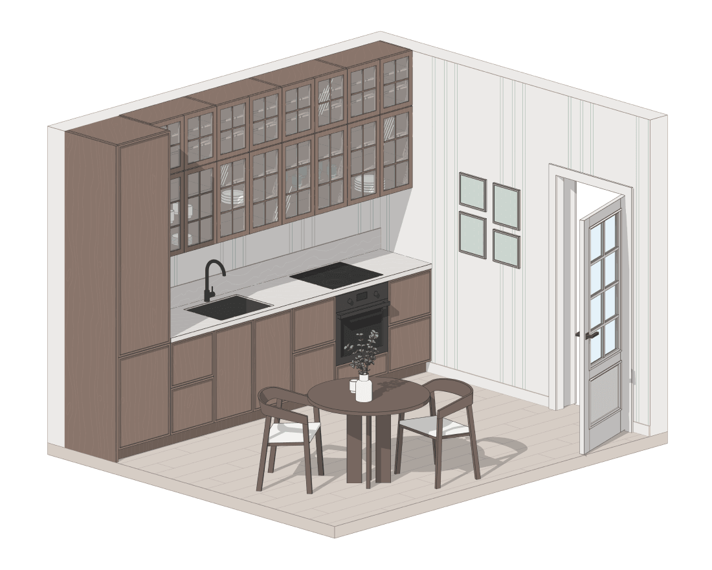
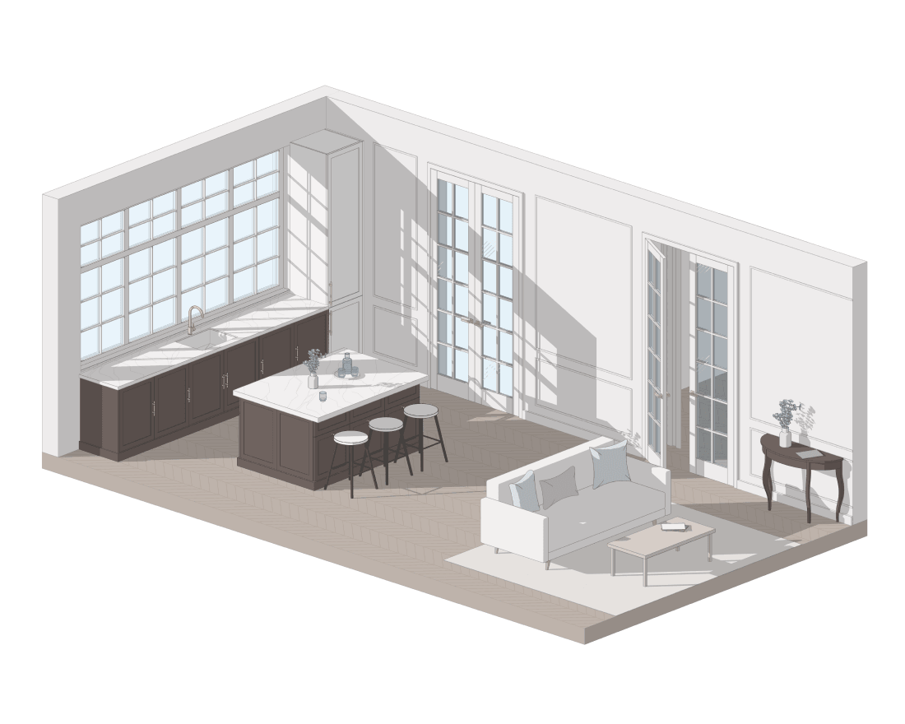

Several kitchen layouts that interior designers put together in Revit from our Kitchen families. Every layout is built from the set's units at real-world sizes, with no manual tweaks. Only BIMCORE families, Revit and the designers' talent went into these schemes 😊

## 1. Kitchen facing the window

<truncate />

It looks good. It is practical, because there is plenty of daylight. Cooking and cleaning up are a pleasure.

:::warning[Important]

Make sure the open window sash does not hit the tap of the kitchen sink. This is a common beginner's mistake.

:::

:::info[Information]
In the set, the kitchen sink goes into a base unit in two ways: automatically, when you tick it on inside the unit itself, or manually, when you place a separate sink family in the worktop. The sink can be topmount or undermount.
:::

## 2. Display cabinets and glass doors

Wall units with glazed doors and muntins make the interior cosier and more interesting. Add lighting, arrange everything nicely inside, and it is a pleasure to look at every single time.

Display cabinets work too: they give the interior a more historic, authentic feel.

:::info[Information]
In the Kitchen set, every unit lets you pick the door type from a list: standard, frame inside, frame outside, or with an integrated handle. To build a top row with framed glass doors and muntins, as in the 3D scheme, pick the frame-outside doors from the drop-down list, set the infill material to Glass, and take the muntins from the Windows set or use the glass door with muntins from the Storage Cabinets set.
:::

## 3. Kitchen with no wall units

No more reaching up to get things down from above. Visually it declutters the room and makes it feel more open.

Storage in this layout moves into base units and tall units. The set has base units with one or two hinged doors, drawer units and tall units with up to six doors, so you can model the exact size and position of every door while the project is still on the drawing board.

## 4. Island with a breakfast bar

For many families this is the best option for a quick bite in the morning or after work. No need to lay the table: sit down and eat.

### Ergonomics of the island breakfast bar

#### Island height

If you make the island 850–900 mm high, keep in mind that the stools have to be counter-height, that is a seat height of about 600 mm.

A simple rule of thumb:

`Stool seat height = Worktop top minus 300 mm.`

:::info[Information]
How do you work out the seat height for a 900 mm worktop?\
900 mm − 300 mm = 600 mm\
So the optimal stool seat height is 600 mm.
:::

These are very simplified guidelines, but if you follow them you are unlikely to go wrong.

#### Account for the height of the people living there

For people taller than 180 cm, raise the bar to about 1000–1100 mm. They will find it noticeably more comfortable. To do this, the eating area has to be separated from the working worktop by height.

#### Legroom

Do not forget legroom. The worktop overhang for the knees is usually about 300 mm. The minimum is 250 mm.

Be careful with the maximum overhang: the weight of the worktop must stay on the kitchen units or on rigid side supports, which can also be made from the worktop material by forming a U-shaped arch.

:::info[Information]
In the Kitchen set there is a separate Island worktop family, and the island itself is assembled from ordinary kitchen base units. The worktop size and overhang are set by parameters, so you can easily build an island of any size you need.
:::

The Kitchen set for Revit is there to assemble a kitchen in an interior project and count its units with minimal effort.

<ProductCard ecwidProductId="543629545" guideButton />

Not ready to buy yet? [Try 3 kitchen families for free](https://community.bimcore.one/t/kitchen/24), a demo version for Revit 2019.
