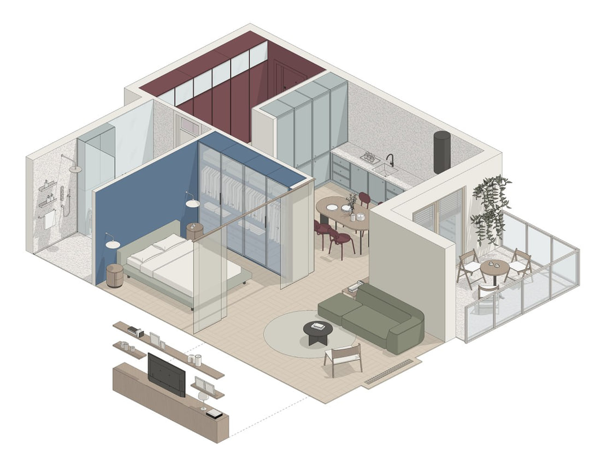
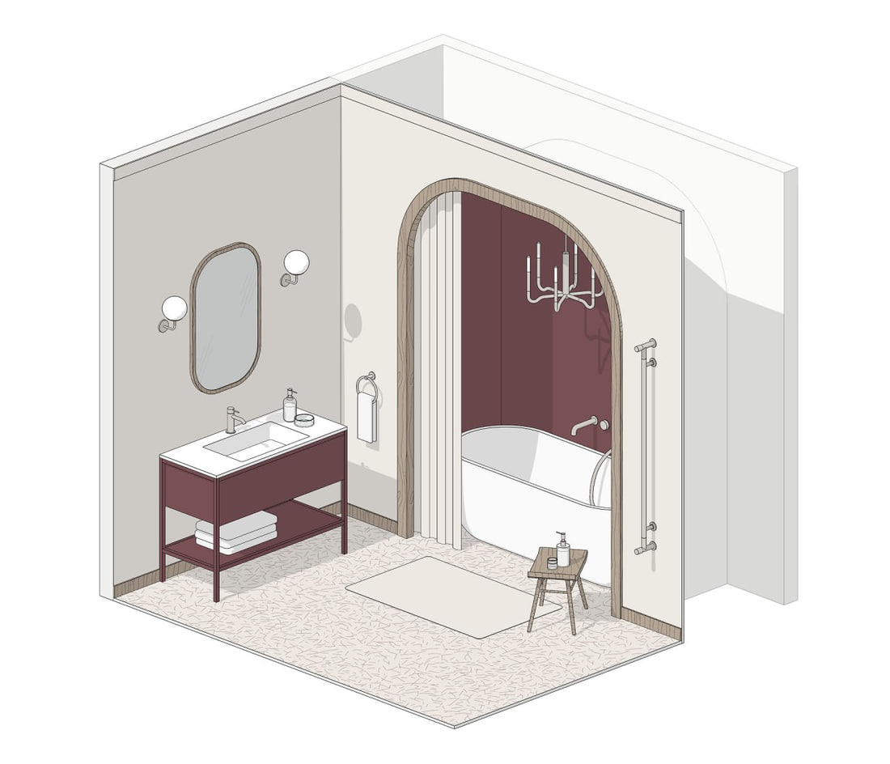
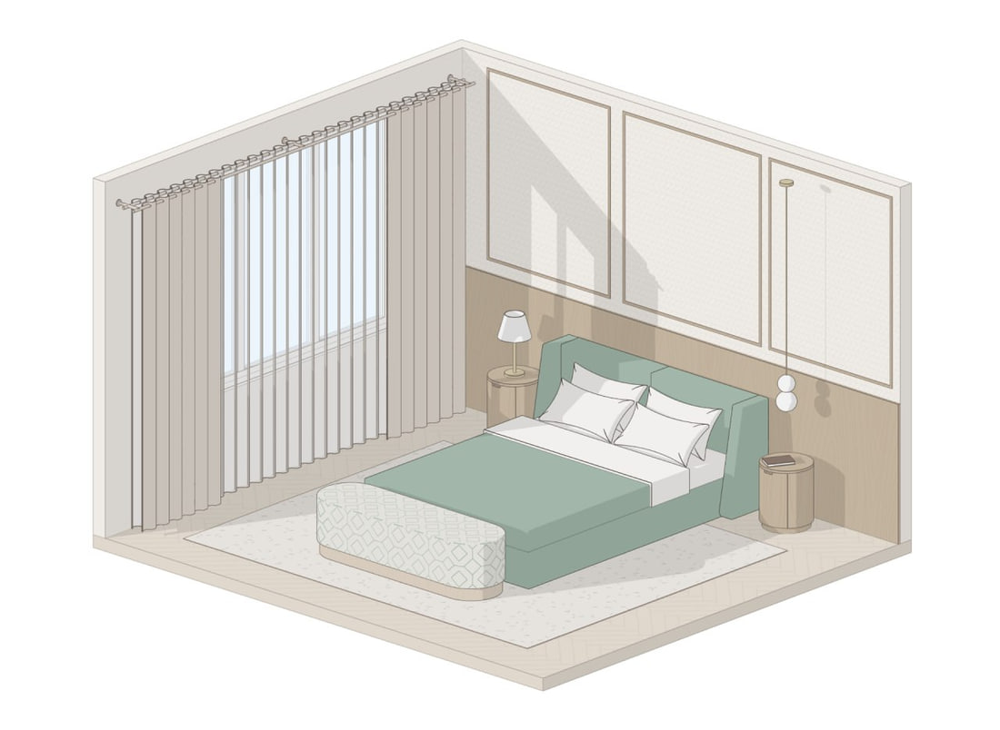

Modeling furniture for an interior project in Revit from scratch takes a significant amount of time. Below are five popular Revit family sets from BIMCORE.ONE that cover the basic needs of an interior designer working in Revit.

<truncate />

## 1. Kitchen families

Perhaps the most in-demand family set for interior designers working in Revit. Its carefully designed parameters make it easy to create even complex kitchens with built-in appliances, different handle types and opening methods. You can change cabinet dimensions, set the number of doors and drawers, and adjust handle placement. The set supports integrated handles and the Gola profile system for handleless fronts.

:::note[Note]
In the United States and Europe, the terms Gola profile system and Gola handleless system are commonly used.
:::

It stands out from other families with its many door types, adjustable frames and glass panels with different fixing methods.

This is BIMCORE's best-selling family set.

**[See the Kitchen set →](/guides/families/kitchen-for-revit)**

## 2. Wardrobe families

A versatile family set for designing a walk-in wardrobe in Revit. The set includes two different wardrobe systems:

- open shelving mounted on rails;
- a cabinet system with or without doors.

The families include different cabinet fittings, wardrobe lifts, hanging rails for garments of different lengths, drawers shown open or closed, and plenty of accessories for a detailed wardrobe interior.

Make your wardrobe design clear to the client :)

**[See the Wardrobe set →](/guides/families/wardrobe-for-revit)**

## 3. Storage cabinet families

Built-in and freestanding cabinets and display cabinets that are easy to place on Revit plans. Fully parametric. Choose the leg type, door placement, door type, and materials for both the inside and outside of the cabinet.\
All of this is available in our parametric cabinet set for residential interiors, including apartments and houses.

**[See the Storage cabinets set →](/guides/families/storage-cabinets-for-revit)**

## 4. Bathroom families

One of the largest family sets in the [complete BIMCORE library](https://bimcore.one/). Parametric bathtubs in several shapes, including egg-shaped, back-to-wall and freestanding clawfoot tubs. Various styles and shapes of faucets for bathtubs and sinks. Parametric shower systems with drains integrated into the shower tray, plus the option to place the drain in the wall. Glass shower screens and rainfall shower systems. Materials and dimensions can be changed, shapes are adjustable, and the families appear under the correct category in schedules. This set saves dozens of working hours otherwise spent searching for the right bathroom family.

**[See the Bathroom set →](/guides/families/bathroom-for-revit)**

## 5. Bed families

An ultra-parametric bed family. Absolutely everything can be adjusted, including the headboard type, the presence of headboard wings and the headboard width. You can turn off the headboard and use special upholstered wall panels instead. Everything needed in real projects. Its attractive appearance, clean plan representation and adjustable 3D pillow shape are the finishing touches.\
The set also includes a bedside table and a bench, so you can design the entire bedroom with one Revit family set.

**[See the Beds set →](/guides/families/beds-for-revit)**

## What makes our families useful?

They use consistent parameters within the unified BIMCORE parameter system. Shared parameters use the INT prefix for Interiors. You can calculate and check the overall dimensions of every family without worrying about errors. The functionality is designed specifically for interior projects. There are no imports from other programs that overload Revit. Everything is designed to save time on your work in Revit.

<CTA type="guide" />
