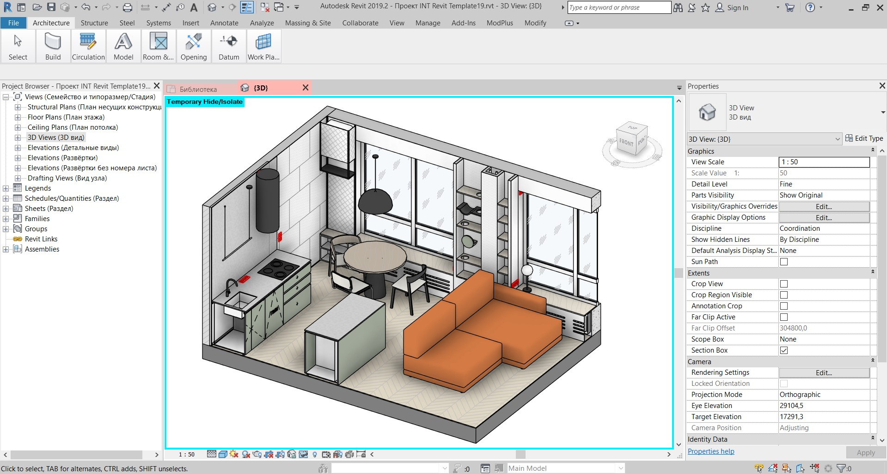
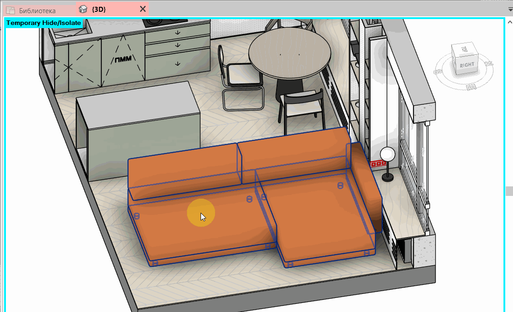

import sofaVideo from './img/sofa-parameters.webm';

When you download a Revit family, check whether you can adjust it for your project. Good looks alone are not enough. The family may be non-parametric, and the parameters you need may be missing.

I create Revit families for interior designers. For me, a model needs to look good and be flexible to adjust. This is why we make the families in our [BIMCORE](https://bimcore.one/) library parametric.

*Interior project in Revit with BIMCORE furniture.*

<truncate />

## What you risk by keeping a non-parametric family in your project

Suppose you download a sofa that looks like the one selected for a project. Its shape is similar, but its width and depth are different. If you leave it unchanged, you may misjudge the layout and ergonomics. The plan may appear to have enough space, while the real sofa leaves a passage that is too narrow.

The consequences can be more noticeable with wardrobes and kitchens. A deeper cabinet takes space from a passage. An open door may hit a table or a ceiling light. It is better to see these problems in the model before the furniture is ordered.

With a non-parametric family, you cannot simply change the required dimensions in Properties. You have to edit the family or find another model. If you have already run into this, you can use our [kitchen family](/guides/families/kitchen-for-revit/) for Revit. It offers maximum flexibility and guarantees that you will avoid these mistakes.

## Why parametric families are useful

In a parametric family, dimensions and other properties control the model. For example, when you change the width of a sofa, its geometry rebuilds according to the rules used to create the family. The available adjustments depend on the individual family and its developer.

*The sofa dimensions change through family parameters inside the interior project.*

I see several practical benefits for an interior project.

**Quick adjustments.** You can change dimensions, materials and configurations through parameters. This is especially useful when a client asks to replace an item after the layout has been approved.

**Checking the actual ergonomics.** Once the required dimensions are entered, you can see how much space the furniture occupies. You can measure passages and check them against applicable standards.

**Potential clashes are easier to spot.** In plan and 3D, you can check whether the furniture overlaps another object. If the family includes an opening control, you can also examine the position of a door. This helps you spot a mistake and correct it quickly before it becomes a problem.

**The model is closer to the intended interior.** When the dimensions, form and materials correspond to the selected design, a client can understand the proposal more clearly. The materials and the family's original form matter here. With our [full interior set](https://bimcore.one/products/all-revit-families-set-21), we do everything we can so you do not have to keep searching for families.

## A free family can still be suitable

Price alone does not determine the quality of a file. Some free families are parametric. Others represent specific manufacturers' products with fixed dimensions and can be suitable when that manufacturer's product is used in the project.

I look at whether a family supports the task. If its dimensions match the selected product and no adjustment is needed, a fixed model may be entirely appropriate. However, if you need to replace it with another model, finding one can quickly become a problem. This is why we offer versatile families that are not tied to specific manufacturers.

Our guide to [free Revit family websites](/blog/free-revit-family-websites/) lists sources for downloading free families.

## How do you check any family after downloading it?

Load the family into a separate test project before using it in live project work.

1. Compare the family's width, depth and height with the dimensions needed for your project. Check what is included in each stated dimension.
2. Change the parameters you will need. Check whether the geometry updates when you change the dimensions.
3. See how the family behaves in plan, elevation and 3D. Check whether its representation is suitable for your drawings.
4. Check how the family behaves at Coarse, Medium and Fine detail levels. Sometimes nothing changes, but families often have a simplified representation at the Coarse detail level.

:::tip[Tip]
When entering dimensions, consider whether the manufacturer can make the item at that size. Entering an arbitrary number in a model is easier than manufacturing an object at that size.
:::

## Our approach at BIMCORE

Our full interior set brings together parametric families for house and apartment interiors. You can adjust them flexibly when preparing drawings and presenting a project to a client.

If you regularly design interiors in Revit, this library lets you use the same families across projects without spending time looking for new ones. You can try one category first, such as our [Revit kitchen families](/guides/families/kitchen-for-revit/), and check whether they suit your workflow.

<video controls muted loop playsInline style={{width: '100%', height: 'auto'}} aria-label="Adjusting a parametric sofa from the BIMCORE sofa set">
  <source src={sofaVideo} type="video/webm" />
</video>

*A Revit project with sofa families from the [Sofas set](/guides/families/sofas-for-revit/).*

Take a look at our interior set and choose families that help you present your design more accurately and make revisions more efficiently.

<CTA type="guide" />
