Free Revit families in 2026 come from three kinds of sources: broad catalogs
(BIMobject, ARCAT, BIMsmith Market, NBS Source, Archiproducts, ArchDaily),
community libraries like RevitCity and Modlar, and brands that publish their own
files, from BIMCORE samples to Herman Miller, Knoll, ERCO and Kohler. All thirty
sources below were checked and alive in July 2026. Each has a
different sweet spot, and this guide shows where to go for furniture, lighting,
bathroom or kitchen, so the search takes minutes.

<truncate />

## Quick comparison

| Site | What you can download | Where to look |
|---|---|---|
| [BIMCORE](https://bimcore.one) | Free sample families from BIMCORE interior sets: kitchens, wardrobes, sofas, tables, doors, windows and plants | Free plugin account, then the BIMCORE family guides |
| [BIMobject](https://www.bimobject.com/en/Browse/Price-Range/Free) | Free manufacturer BIM objects: furniture, sanitary, doors, lighting, kitchen and plumbing | Free catalog filters, category pages or product pages, then Download |
| [Archiproducts](https://www.archiproducts.com/en/products/bim) | Design furniture, lighting, bathroom and kitchen BIM/CAD objects | BIM section or Revit plug-in, then filter by product or format |
| [ArchDaily](https://www.archdaily.com/catalog/us/bim) | Product-catalog BIM objects for furniture, finishes and equipment | Catalog BIM section, then product pages |
| [ARCAT](https://www.arcat.com) | Manufacturer BIM/CAD objects, specs, doors, plumbing and finishes | BIM Objects by category or manufacturer |
| [BIMsmith Market](https://market.bimsmith.com) | Free Revit-ready building products from US brands | Search or category pages, then product page downloads |
| [NBS Source](https://source.thenbs.com) | NBS BIM Library objects and manufacturer products | Product pages, then Download BIM/Revit object |
| [BIM&CO](https://www.bimandco.com) | Manufacturer and generic BIM objects in RFA, IFC, SKP and other formats | BIM library search, then object page format downloads |
| [MEPcontent](https://www.mepcontent.com) | Manufacturer-specific Revit, AutoCAD and IFC files for MEP, lighting, plumbing and HVAC | Browse manufacturers or categories, then product downloads |
| [CADdetails](https://www.caddetails.com/BIM-Models/) | Revit BIM models plus CAD details and specifications | BIM Models, then manufacturer or category product pages |
| [bimstore](https://www.bimstore.co) | Free UK-focused manufacturer BIM objects for Revit | Search or category pages, then product download |
| [RevitCity](https://www.revitcity.com/downloads.php) | User-uploaded Revit families, odd objects and legacy furniture | Downloads search, then object page; free login is needed |
| [Modlar](https://www.modlar.com) | Mixed BIM/CAD models by category, brand and file format | Product library search, then format filters |
| [Herman Miller](https://www.hermanmiller.com/resources/3d-models-and-planning-tools/product-models/) | Official Revit, SketchUp and AutoCAD product models for chairs, tables and systems | Product Models, then category or product |
| [Knoll](https://www.knoll.com/design-plan/resources/furniture-symbols) | Furniture symbols for AutoCAD, Revit and SketchUp, including Womb, Saarinen and Barcelona classics | Furniture Symbol Library or Revit Add-In |
| [Teknion](https://www.teknion.com/can/fr/tools/tools/revit-symbols-library2) | Revit symbol libraries for office systems, seating, tables and storage | Revit resources, then full library or product ZIP downloads |
| [Steelcase](https://www.steelcase.com/resources/revit/) | Revit furniture model downloads for seating, tables and workstations | Revit Files page, then search or filter by category |
| [Haworth](https://market.bimsmith.com/haworth) | Haworth contract furniture BIM content hosted on BIMsmith | BIMsmith Haworth page, then product downloads |
| [Muuto](https://professionals.muuto.com/toolbox/product-information/download-ad-files/) | 2D, 3D and Revit files for furniture, lighting and accessories | Professionals toolbox, then 2D, 3D & Revit files |
| [Fritz Hansen](https://downloads.fritzhansen.com/) | 2D, 3D and Revit files for Danish furniture classics | Downloads portal, then 2D, 3D & Revit folders |
| [ERCO](https://download.erco.com/en/planning_luminaire/revit2015) | Revit families for architectural luminaires | Planning luminaire Revit page, then product or article downloads |
| [TRILUX](https://www.trilux.com/en/service/downloads/software/revit/) | Revit lighting files and catalogue ZIPs for luminaires | Service downloads, then Software and Revit |
| [Zumtobel](https://www.zumtobel.com/com-en/downloads.html) | 3D BIM data in Autodesk Revit format for luminaire product ranges | Downloads page, then Revit BIM Data ZIPs |
| [Cooper Lighting](https://www.cooperlighting.com/global/revit-files) | Native Autodesk Revit files for indoor and outdoor fixtures | Revit Files page, then brand, category or product |
| [Kohler](https://www.studiokohler.com/en-us/resources/technical-specifications/) | CAD blocks, Revit files, 3D files and specs for kitchen and bath products | Studio KOHLER technical specifications; account may be required |
| [Geberit](https://www.geberit-global.com/sanitary-piping-systems/digital-tools-software/geberit-bim-plug-in/) | BIM content for Revit: sanitary systems, installation systems, ceramics and bathroom furniture | Geberit BIM Plug-in catalogue module or online product catalogue |
| [Hansgrohe / AXOR](https://pro.hansgrohe.com/consultation/bim-planning-data) | BIM data and RFA files for selected taps, mixers and shower systems | BIM planning data page, then PRO product pages or BIMobject |
| [Roca](https://www.roca.com/bim) | BIM objects for toilets, basins, baths and bathroom fixtures | BIM objects page, then product and format |
| [Grohe](https://www.grohe.us/products/thermostatic-tub-shower-system) | Revit files for selected sanitary products, taps and showers | Product resources, then Revit Files |
| [Sub-Zero & Wolf](https://www.subzero-wolf.com/trade-resources/product-specifications?business=2) | CAD libraries and Revit RFA files for premium kitchen appliances | Product specifications, then Download CAD Libraries and Revit Files (RFA) |

## 1. BIMCORE

Full disclosure: BIMCORE is our own project, so treat this entry as the host's
recommendation. Register a free account in the BIMCORE plugin for Revit at
[bimcore.one](https://bimcore.one) and you get sample families from almost every
one of our 21 paid interior sets: kitchens, wardrobes, sofas, tables, doors,
windows, plants and more. The samples are cut from the same project-tested files
we sell, so parameters flex without errors, categories are set correctly and
file sizes stay small. Browse the sets in the [family guides](/guides/families/).

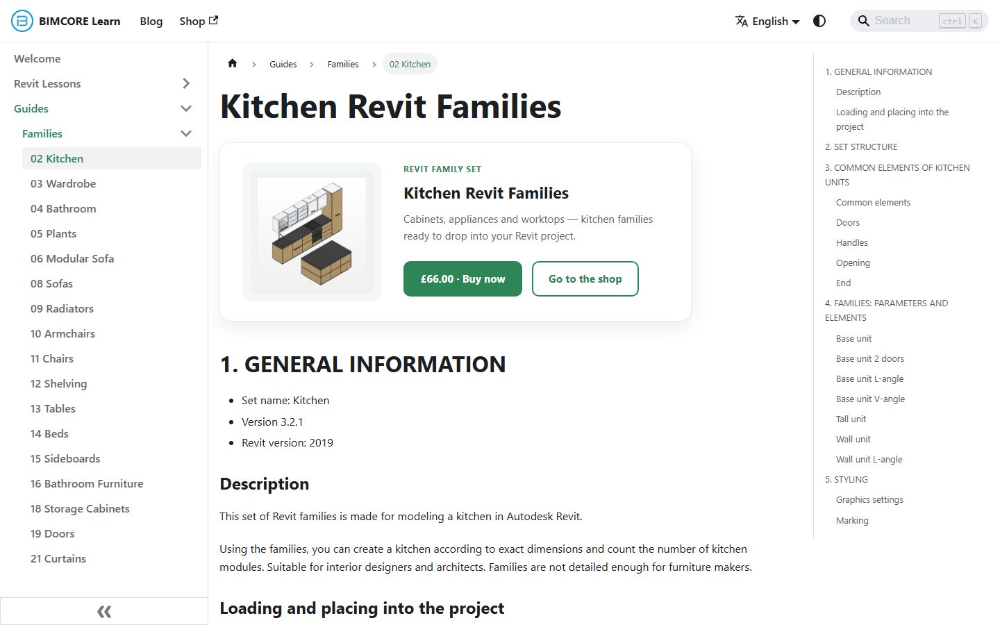

## 2. BIMobject

BIMobject is one of the largest manufacturer BIM catalogs, listing products from
more than 2,000 brands. If you need a real product with a real article number,
say a specific Blum hinge or a Villeroy & Boch sink, start here. The Polantis
catalog, known for its IKEA furniture models, now publishes through BIMobject,
which makes it the main address for IKEA pieces in an interior.

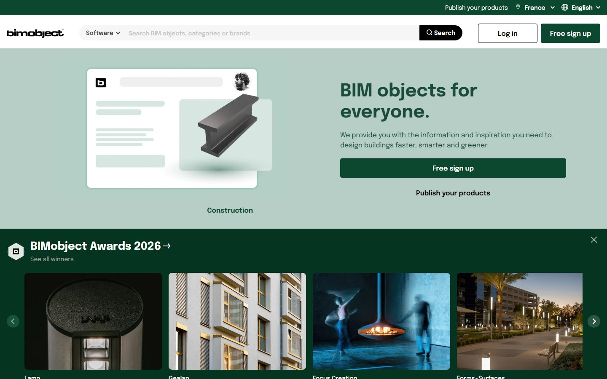

Watch the file size before you load anything. Manufacturer families are often
modeled with every screw in place, and a 40 MB armchair slows a project faster
than it decorates a render.

## 3. Archiproducts

Archiproducts is a large Italian catalog of design furniture, lighting and
bathroom products. Its [BIM section](https://www.archiproducts.com/en/products/bim)
filters to Revit files for brands you rarely find on construction-focused
libraries, which makes it the strongest source here for recognizable European
design pieces.

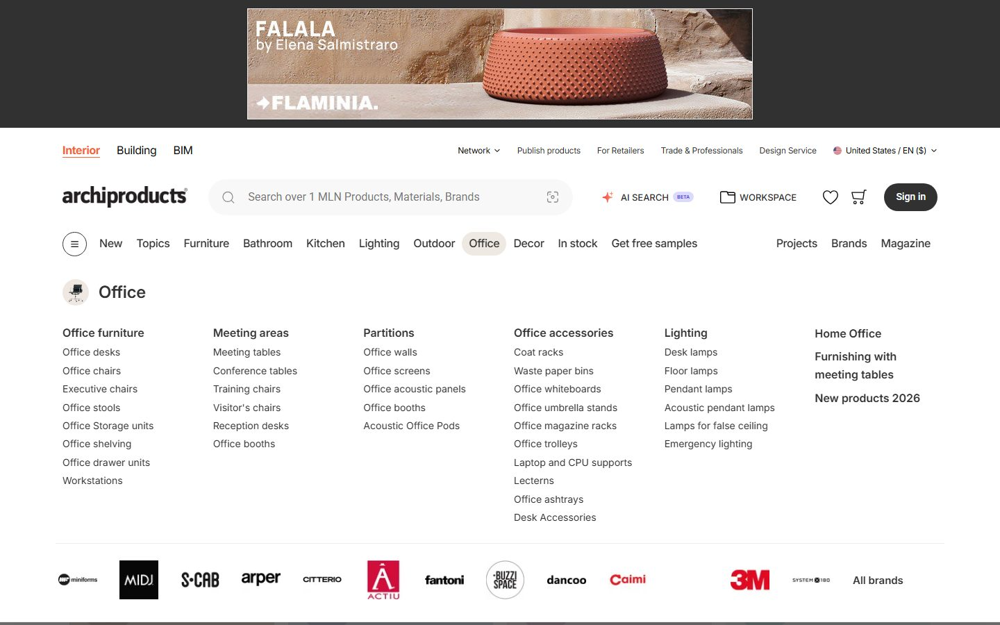

## 4. ArchDaily catalog

ArchDaily's [product catalog](https://www.archdaily.com/catalog/us/bim) sits
next to the world's most-read architecture site. The BIM section groups
manufacturer objects by category (furniture, finishes, equipment), each tagged
BIM, so you browse products and pull Revit files in the same place.

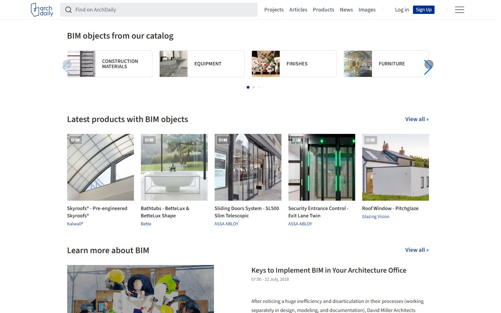

## 5. ARCAT

ARCAT is one of the few large libraries with no registration at all. Open the
page, pick a category, download the file. ARCAT began as a specification
service, so families come tied to manufacturer specs, and the architectural
categories run deep. Interior furniture is thinner here than on BIMobject,
plumbing and doors are well covered.

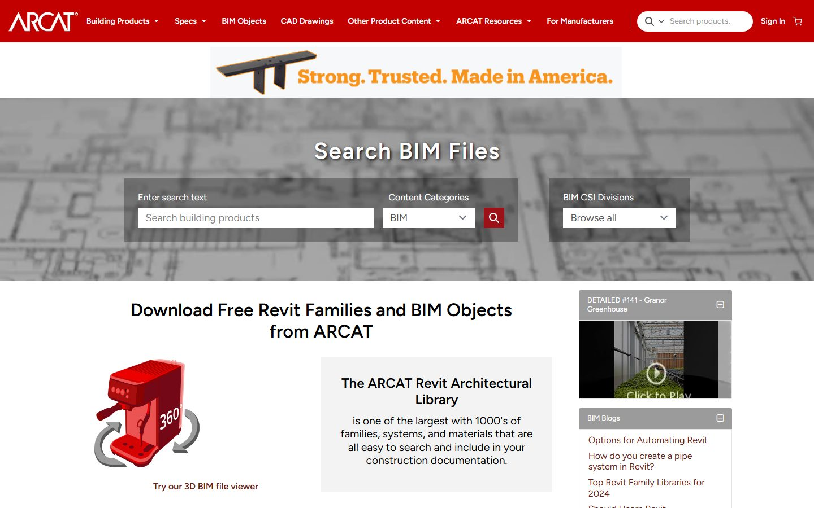

## 6. BIMsmith Market

BIMsmith Market lists tens of thousands of free Revit-ready building products
from hundreds of brands. The catalog leans toward US construction products:
doors, ceilings, insulation, finishes. A useful pick when you need the layers
behind your interior, less so when you hunt for a sofa.

## 7. NBS Source

NBS Source hosts the UK's National BIM Library: generic and manufacturer objects
authored to the NBS BIM Object Standard, which keeps naming and parameters
consistent across the catalog. Downloads need a free NBS account. The
consistency pays off in schedules, and the coverage of generic building elements
is among the best on this list.

## 8. BIM&CO

BIM&CO is a French platform with strong coverage of European manufacturers that
rarely appear on US-centric catalogs. Families carry structured metadata, which
pays off in schedules. If your project uses European fixtures or radiators,
check this catalog before modeling anything yourself.

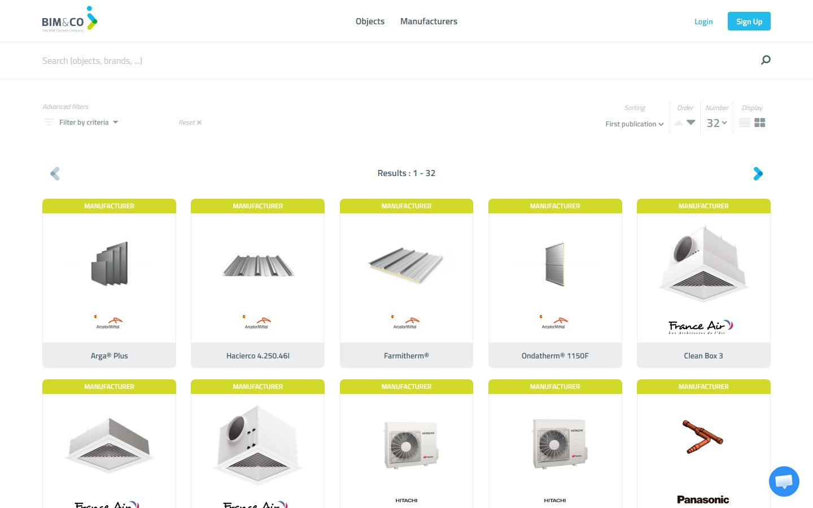

## 9. MEPcontent

MEPcontent is Trimble's MEP library with hundreds of thousands of
manufacturer-specific Revit, AutoCAD and IFC files. Most of it is ducts, pipes
and fittings, and two corners matter for interior work: light fixtures and
plumbing equipment from real European and US brands.

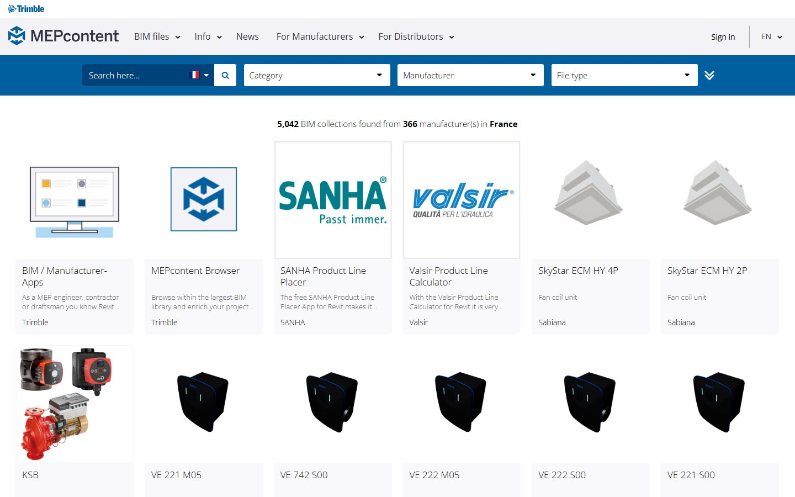

## 10. CADdetails

CADdetails is a North American aggregator where Revit families sit next to 2D
CAD details and written specifications from hundreds of manufacturers. Handy on
projects where the drawing set matters as much as the model, since you pick up
the family and its detail drawings in one place.

## 11. bimstore

bimstore is a UK library that publishes manufacturer-backed families with an
emphasis on technical accuracy. Coverage is UK-centric, so it earns its place
when the project sits in Britain or uses British-spec products, and stays a
secondary stop otherwise.

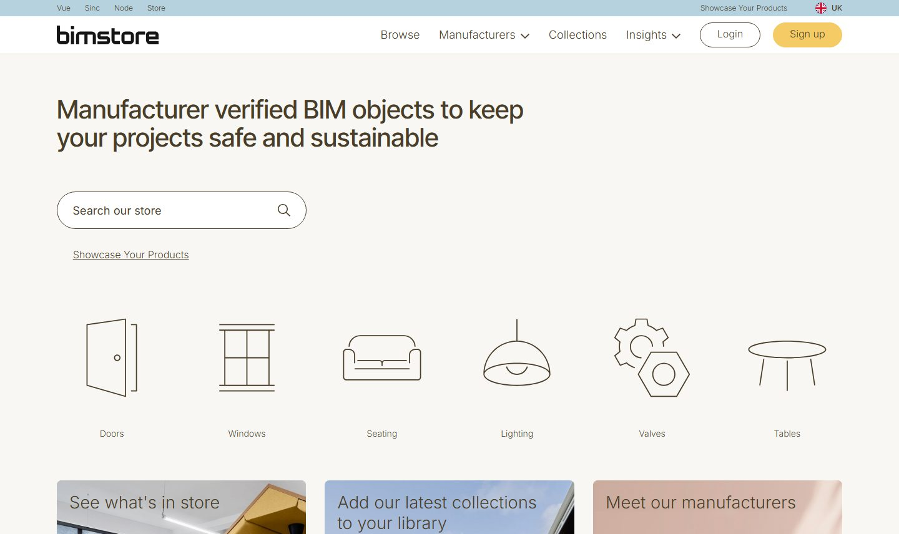

## 12. RevitCity

RevitCity is a veteran community library where users upload their own families,
and new files still appear weekly. Quality swings from excellent to broken, yet
this is the place where you find things nobody sells: a piano, a cat tree, a
barber chair. The search feels dated and downloads sit behind a free account.

## 13. Modlar

Modlar is a community BIM and CAD catalog wrapped around an architecture and
interior-design magazine. The library mixes brand content with user uploads, so
treat it as a browse-and-verify source. Its strength is discovery: the product
feed surfaces furniture you would not think to search for, and appliance brands
like Miele publish here.

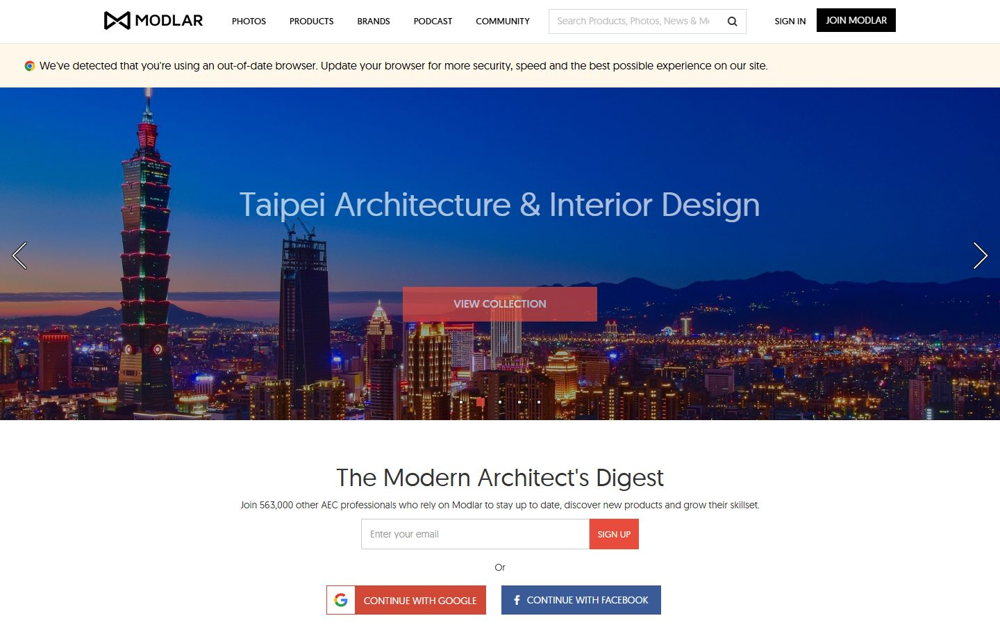

The next sources are manufacturers that publish their own Revit files. These are
often the most accurate you can get: the geometry matches the real product, and
nobody has stripped the metadata.

## 14. Herman Miller

Herman Miller runs one of the best manufacturer portals around. Its
[Product Models page](https://www.hermanmiller.com/resources/3d-models-and-planning-tools/product-models/)
serves Revit, SketchUp and AutoCAD files for roughly a thousand products, from
the Eames and Sayl chairs to tables and storage. Files are free, accurate, and
grouped by portfolio. If a project specifies a design classic, this beats
hunting for a user copy.

## 15. Knoll

Knoll's [Furniture Symbol Library](https://www.knoll.com/design-plan/resources/furniture-symbols)
offers its catalog in Revit, AutoCAD and SketchUp, plus a Revit Add-In. Womb
chairs, Saarinen tables and Barcelona-era classics come straight from the maker,
correctly sized.

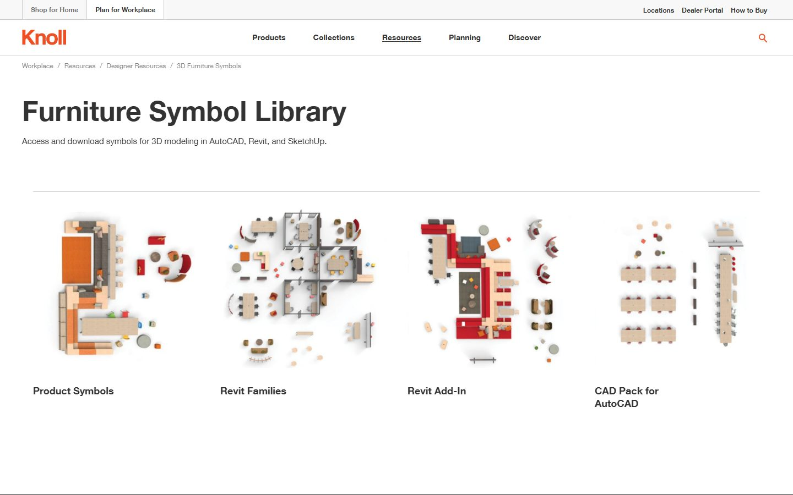

## 16. Teknion

Teknion's [Revit resources](https://www.teknion.com/can/fr/tools/tools/revit-symbols-library2)
publish its office furniture as families, with recently-added models bundled as
ZIP downloads. A first stop for workstations, meeting tables and task seating.

## 17. Steelcase

Steelcase hosts a dedicated [Revit Files page](https://www.steelcase.com/resources/revit/):
search or filter by category (seating, tables, worksurface) and download each
family directly. Deep coverage of office furniture, plus partner brands.

## 18. Haworth

Haworth publishes its contract furniture [through BIMsmith](https://market.bimsmith.com/haworth),
with a Request BIM route on its own site. Strong for office lounge, panels and
workspace pieces.

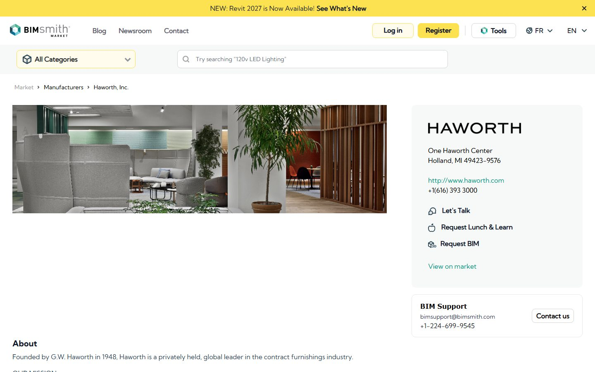

## 19. Muuto

[Muuto](https://professionals.muuto.com/toolbox/product-information/download-ad-files/) offers Revit and CAD files for its
Scandinavian furniture and lighting. The Rest lounge chair, Coltre sofa and similar pieces
download from the brand, ready to specify.

## 20. Fritz Hansen

Fritz Hansen runs its own [downloads portal](https://downloads.fritzhansen.com/)
for the Series 7, Egg and Swan and the rest of its Danish-design catalog, in
Revit and other formats.

## 21. ERCO

ERCO, an architectural lighting specialist, publishes complete
[Revit families](https://download.erco.com/en/planning_luminaire/revit2015) for
its luminaires with accurate photometrics, straight from its download portal.

## 22. TRILUX

TRILUX, a German architectural lighting maker, offers its full range as native
Revit files. Its [Revit page](https://www.trilux.com/en/service/downloads/software/revit/)
bundles the current catalogue as a single ZIP of .rfa families with photometric
data, ready to drop into a lighting layout.

## 23. Zumtobel

Zumtobel publishes 3D BIM data for its product ranges in Autodesk Revit format
on its own [downloads page](https://www.zumtobel.com/com-en/downloads.html),
next to ArchiCAD and 2D CAD libraries. Strong for architectural spotlighting and
façade fixtures.

## 24. Cooper Lighting

Cooper Lighting calls itself the industry's BIM leader and backs it up: native
Autodesk Revit files for its indoor and outdoor fixtures, downloadable from
[its Revit page](https://www.cooperlighting.com/global/revit-files) and the
individual product pages.

## 25. Kohler

Kohler's [professional download page](https://www.studiokohler.com/en-us/resources/technical-specifications/)
carries Revit, CAD and 3D files for its sinks, tubs, faucets and toilets. A first
stop for North American bathroom and kitchen fixtures.

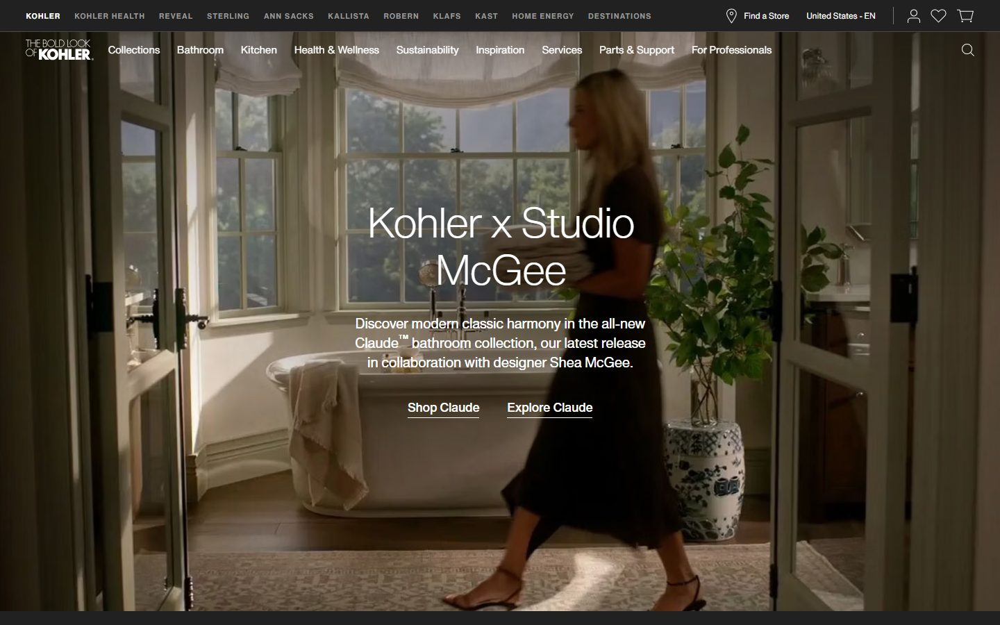

## 26. Geberit

[Geberit](https://www.geberit-global.com/sanitary-piping-systems/digital-tools-software/geberit-bim-plug-in/) serves its sanitary systems, concealed
cisterns and bathroom fixtures through a BIM plug-in for Revit and its online
product catalogue, authored to European standards.

## 27. Hansgrohe / AXOR

Hansgrohe and its premium brand AXOR publish Revit files at LOD 300 for taps,
mixers and shower systems through their
[BIM planning data page](https://pro.hansgrohe.com/consultation/bim-planning-data)
and PRO product pages. Every model carries a real article number, so what you
place matches what gets ordered.

## 28. Roca

Roca's [BIM objects page](https://www.roca.com/bim) lets you download families
for its toilets, basins and baths straight from the cloud, in Revit and other
formats. Strong European bathroom coverage, and a first stop when a project uses
Roca fixtures.

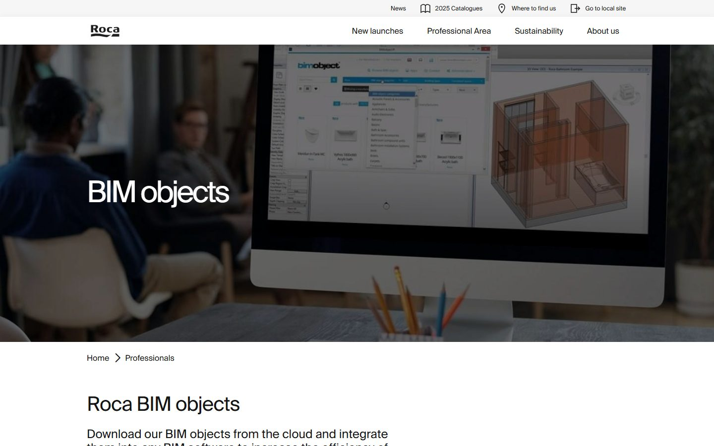

## 29. Grohe

Grohe keeps no single global BIM library. Its Revit files live on selected
[product pages](https://www.grohe.us/products/thermostatic-tub-shower-system):
open a tap or fixture, expand the resources, and look for Revit Files among the
technical downloads. Not every product carries one, but coverage of taps and
showers is good.

## 30. Sub-Zero & Wolf

Sub-Zero and Wolf keep no central library. Their Revit files sit on each
product page under CAD Libraries, listed alongside the other formats: open a
current model from the
[product specifications](https://www.subzero-wolf.com/trade-resources/product-specifications?business=2)
and pick the Revit file. Premium refrigeration and cooking for high-end kitchens.

## How to check a free family before it enters your project

A broken family costs more time than it saves. Run this two-minute check on
every download:

1. **Open it in a blank project first.** Never test downloads inside client work.
2. **Flex the parameters.** Change width and height; a solid family updates
   cleanly, a broken one throws errors or distorts.
3. **Check the file size.** Furniture over 2 to 3 MB deserves suspicion, over
   10 MB it needs a very good excuse.
4. **Look at the category.** A sofa modeled as a Generic Model will vanish from
   your furniture schedules.
5. **Read the license.** Manufacturer catalogs allow commercial use, community
   uploads vary by author. Thirty seconds of reading beats a licensing dispute.

## When paid families make sense

Free libraries cover a lot, and they still leave gaps: inconsistent detail
levels, missing metric versions, furniture that ruins schedules. When a project
needs a full consistent set, a tested paid library closes that gap for the price
of one billable hour. See
[which family sets interior designers use most](/blog/best-revit-families-interior-design)
or browse the [BIMCORE family guides](/guides/families/) to compare what a
project-tested set includes.

## FAQ

### Where do I find free Revit furniture for interior design?

Start with BIMCORE samples and Herman Miller for furniture built as proper
families, then Knoll, Muuto and Fritz Hansen for design classics. Archiproducts
and BIMobject cover branded and IKEA pieces, and RevitCity fills the odd gaps.
Skip the MEP and construction-product libraries for furniture.

### Are free Revit families safe to use?

RFA files are not a typical malware risk. The practical risks are different:
wrong dimensions, heavy geometry, wrong categories and license terms. The
checklist above catches all of them.

### Can I use free families in commercial projects?

On manufacturer catalogs and brand portals such as BIMobject, ARCAT, Herman
Miller or Kohler, yes: manufacturers publish families precisely so that you
specify their products. On community sites, check each author's terms.

### Why did my Revit file get slow after loading free families?

Almost always oversized families. Sort loaded families by file size, purge the
heavy ones and replace them with lighter models. Prevention is cheaper: check
size before loading.

<CTA type="blog" />
