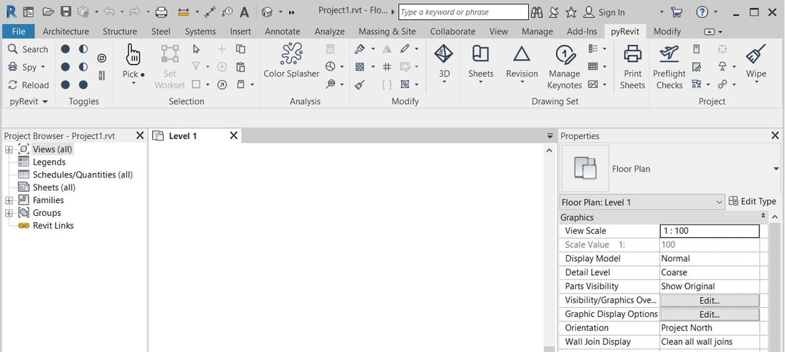
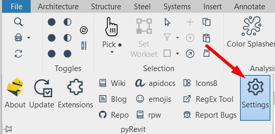
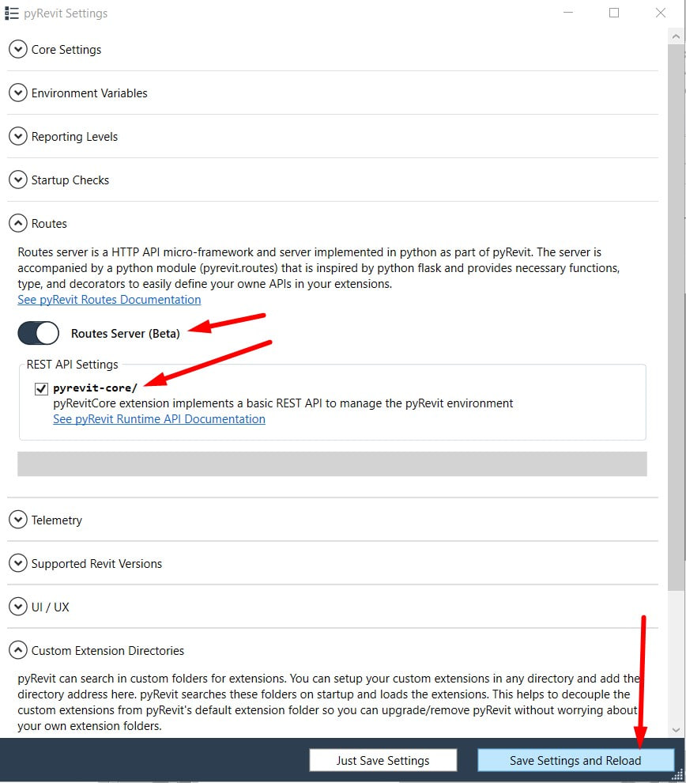
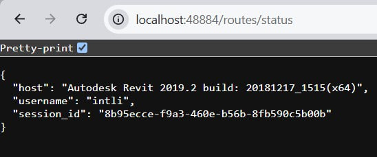
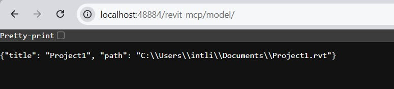
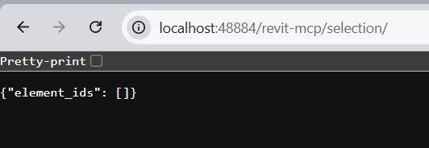
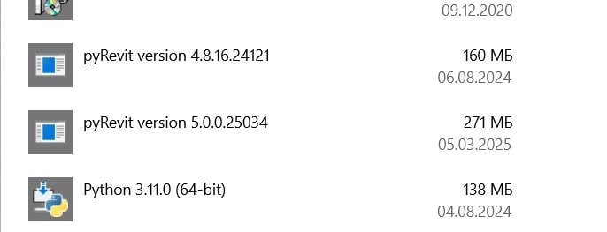
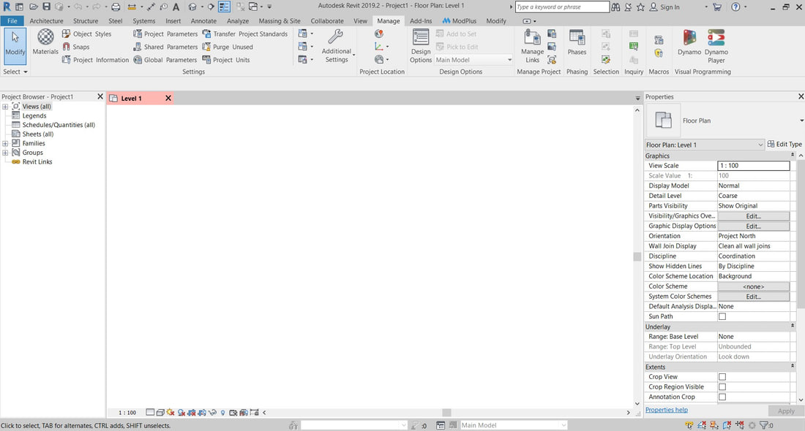

How do you connect Claude to Revit 2019? I asked myself that question yesterday, and today I decided to write this guide, because every ready-made solution starts at Revit 2020. Of all the ways to hook an AI up to Revit, I chose pyRevit: I use it myself, and it is a very popular, free plugin for Revit.

This guide is only for you if you work in Revit 2019. You do not need to know Python programming to follow it. If some of the terms are unfamiliar, do not worry, just repeat the steps one by one and enjoy the result.


<truncate />

## What you get in the end

By the end of this guide you will have a working setup: **you type a request in Claude Desktop and get the result in Revit**.

The chain looks like this: Claude Desktop → an MCP server in Python on your computer → the Routes server inside Revit → your Revit project.

:::info
Why does this chain need pyRevit? It provides:

- Routes, an HTTP server inside Revit
- IronPython, the engine inside Revit that runs the code
- Extensions, a way to add your own buttons to Revit
:::

:::info[What MCP is]
**MCP server** is a separate small program through which an AI can send requests to Revit.

**MCP tools** are prepared scripts that let the AI work in Revit without improvising, so the result is predictable.

:::

To avoid disappointment, keep one thing in mind:\
**there are no MCP tools for Revit 2019**, but you and I will build the most important one, the one that lets the AI send plain code to Revit 2019 to get a task done.

By the end of the article you will have three tools:

- Get the name of the open project
- Get the list of selected elements
- Run any code in the project.
  
Because the AI can run code in Revit, you can do even more than Revit's own tools allow. But if you want a task to repeat predictably, you need to turn it into an MCP tool of your own, and you can ask the AI to do that.

## What you need

- **Revit 2019** (tested on 2019.2).
- **pyRevit 4.8.16**, the last version that works with 2019.
- **Python 3.10 to 3.14.** Tested on 3.13.
- **Claude Desktop**, <a href="https://claude.ai/download" rel="nofollow">download from Anthropic</a>. Any other AI client with MCP support will do, but the commands in this article are written for Claude Desktop.
- **PowerShell**, every command in the article is meant for it.

:::note[Where to find PowerShell]
There is nothing to install, it is already part of Windows. Click **Start**, type `PowerShell` and open **Windows PowerShell**.

Do not paste the commands into the classic `cmd` command prompt: some of them will not work there.

Copy each command from the article in full with **Ctrl+C** and paste it into the window with a **right click** or **Ctrl+V**. Then press **Enter** to run it.
:::

### Installing Python

Python is needed for the MCP server we build in step 4. Revit does not use it, Revit has its own engine that comes with pyRevit.

Paste into PowerShell:

```powershell
winget install -e --id Python.Python.3.13
```


Close the PowerShell window and open a new one, otherwise the console will not see the program you just installed. Check:

```powershell
python --version
```

You should see a line like `Python 3.13.x`.

:::note[If you install Python manually]
You can download the installer from <a href="https://www.python.org/downloads/windows/" rel="nofollow">python.org</a> and run the setup the usual way. In that case, on the first screen make sure to tick **Add python.exe to PATH**. Without it Windows will not know where Python is, and the commands in step 4 will fail.

The sign of a missed tick: instead of a version number, the Microsoft Store opens, or you get a message that `python` is not recognized as a command.
:::

:::note[If Python is already installed, maybe more than once]
There is nothing to remove. See what you have:

```powershell
py --list
```

`py` is the Python version switcher built into Windows. In step 4 you can point to the exact version by typing `py -3.13 -m venv .venv` instead of `python -m venv .venv`.
:::


## Step 1: Install pyRevit 4.8.16

**1. Download the installer** from the [pyRevit 4.8.16 release page on GitHub](https://github.com/pyrevitlabs/pyRevit/releases/tag/v4.8.16.24121%2B2117). You need the file **pyRevit 4.8.16.24121 Installer**, the regular one, not Admin. The Admin build is only for installing for every user on the computer.


Newer versions will not work in Revit 2019.

:::danger
By default, every version of pyRevit installs into the same folder, `%APPDATA%\pyRevit-Master`. If a newer pyRevit is already installed, the files get mixed together and Revit shows an error on startup.


I ran into this error myself and decided to remove the newer pyRevit for the time being through **Start / Add or remove programs**.

Do not repeat my mistake: the newer version can be kept intact if you take care of it **before** installing. How to do that is in the [FAQ](#how-to-keep-the-pyrevit-version-you-already-have).
:::

**2. Make sure the folder `%APPDATA%\pyRevit-Master` is empty or does not exist.** Paste this path into File Explorer.

**3. Close Revit** and run the installer. Leave the component list as it is. These two boxes should stay ticked:

- pyRevit Core Tools
- pyRevit Extended Extensions


**4. Start Revit 2019.** A **pyRevit** tab should appear in the ribbon.



:::warning[No tab, but no error either]
pyRevit installed but did not attach itself to Revit 2019. That happens when Revit was installed after the plugin. What to do is in the [FAQ](#revit-2019-has-no-pyrevit-tab-even-though-it-is-installed).
:::

## Step 2: Turn on Routes

**What we do:** turn on Routes inside Revit. Routes is an HTTP server, a program that accepts requests over the network and answers them. This is how the MCP server will talk to your project.

**1. Open pyRevit → Settings.**



**2. In the Routes section, switch on Routes Server (Beta) and tick pyrevit-core/.** The tick is optional, but it gives you a ready-made address for testing.



**3. Click Save Settings and Reload, then restart Revit.** The Routes server only starts together with Revit.

**4. Go back to the same section.** The orange bar shows the server address.


:::danger
`0.0.0.0` means Revit accepts commands from any device on your network, at the office or at home. Anyone on the same Wi-Fi can reach your open project.

:::

**5. Close that access. Paste into PowerShell:**

```powershell
pyrevit configs routes:host 127.0.0.1
```

The command changes one line in the pyRevit settings file and prints nothing when it succeeds.

:::note[If PowerShell does not know the pyrevit command]
The `pyrevit` command arrives together with the plugin from step 1. A PowerShell window opened before the installation does not know about it, so close it and open a new one.
:::

**6. Check what was written:**

```powershell
Select-String -Path "$env:APPDATA\pyRevit\pyRevit_config.ini" -Pattern "^host"
```

The command looks for the `host` line in the settings file and prints it. It should read `host = 127.0.0.1`. You can also open the same file in Notepad: `%APPDATA%\pyRevit\pyRevit_config.ini`.

**7. Restart Revit again.** The address is read at startup.

**8. Open in your browser:**

```
http://localhost:48884/routes/status
```



You got a reply, and that is the proof that Routes works in Revit 2019. The text in curly braces is JSON, the format Revit will use to send its answers to the AI.

:::warning[The page did not open]
Either Revit was not restarted after Routes was turned on, or more than one Revit window is open: port 48884 goes to the window that started first. Keep a single Revit window open while you set things up.
:::

## Step 3: Create MCP tools in pyRevit

**What we do:** we create three MCP tools that Claude will be able to use. \
**1. Show the name of the open project** \
**2. Show what is selected in it.** \
**3. Run the code it receives**

:::note
It is **running the received code** that gives Claude real power in Revit. The first two tools are mostly there to check our work.
:::

We will create all three tools at once by pasting a single block of code into PowerShell.


:::info
MCP tools in Revit work through a **transaction**.\
A transaction is an indivisible set of operations in Revit. If Revit cannot complete one of them, it cancels all of them and returns the project to the state it was in before. A transaction is exactly what you undo with Ctrl+Z.

If Claude sends Revit code with an error in it, Revit cancels it entirely and sends back a reply describing the error. That helps the AI fix the mistake and try again, and it makes Claude's requests to Revit a little safer.
:::

**1. Paste into PowerShell:**

```powershell
$ext = "$env:APPDATA\pyRevit\Extensions\MCP.extension"
New-Item -ItemType Directory -Force -Path $ext | Out-Null
@'
import json
from pyrevit import routes

api = routes.API('revit-mcp')


@api.route('/model/')
def get_model(doc):
    return {"title": doc.Title, "path": doc.PathName}


@api.route('/selection/')
def get_selection(uidoc):
    ids = [i.IntegerValue for i in uidoc.Selection.GetElementIds()]
    return {"element_ids": ids}


@api.route('/execute/', methods=['POST'])
def execute_code(uiapp, request):
    from Autodesk.Revit import DB, UI

    data = request.data
    if isinstance(data, str):
        data = json.loads(data)
    source = (data or {}).get('code')
    if not source:
        return {"error": "no code provided"}

    uidoc = uiapp.ActiveUIDocument
    doc = uidoc.Document
    scope = {"uiapp": uiapp, "uidoc": uidoc, "doc": doc,
             "DB": DB, "UI": UI, "result": None}

    transaction = DB.Transaction(doc, "MCP execute")
    transaction.Start()
    try:
        exec(source, scope)
        transaction.Commit()
    except Exception as error:
        if transaction.HasStarted():
            transaction.RollBack()
        return {"error": str(error)}

    return {"result": str(scope.get("result"))}
'@ | Set-Content -Encoding ASCII -Path "$ext\startup.py"
Get-Content "$ext\startup.py"
```

**What appeared on your computer:** the folder `%APPDATA%\pyRevit\Extensions\MCP.extension` with the file `startup.py` inside. The last line of the command prints the file back so you can see it was written.

The name `startup.py` cannot be changed: pyRevit looks for a file with exactly that name and runs it when Revit starts. The folder name can be anything, what matters is the `.extension` ending.

:::note[If you prefer to do it by hand]
You can create the folder in File Explorer and save the text with Notepad. Make sure the file does not turn into `startup.py.txt`.

The extension lives inside the pyRevit folder to keep the first steps simple. Once you have buttons of your own, it is better to move it: [Where to keep your extensions](#where-to-keep-your-own-pyrevit-extensions).
:::

**2. Restart Revit.** The file is only read at startup.

**3. Open a project and check both addresses in your browser:**

```
http://localhost:48884/revit-mcp/model/
http://localhost:48884/revit-mcp/selection/
```





The first address returns the project name, the second the selected elements. Select something and refresh the second page. The third address cannot be tested from a browser, it receives code rather than opening a page, so we will test it through Claude.

:::warning[The address returns an error or a blank page]
Revit was not restarted · no project is open · the file is missing at `%APPDATA%\pyRevit\Extensions\MCP.extension\startup.py`.
:::

**Result:** Revit answers at three addresses. Claude does not know about them yet, that is step 4.

## Step 4: Create your own MCP server

**What we do:** write the MCP server, a small program on your computer. Claude talks to it, and it sends requests to Revit at the addresses from step 3 and returns the answer.


**1. Choose a folder for the server.** The example uses `C:\RevitMCP`, but any folder of yours will do, with three conditions:

- **no spaces in the path**: the path goes into the Claude Desktop settings, and spaces there have to be escaped;
- **no non-Latin characters**: a common source of unexplainable Python failures on Windows;
- **not inside OneDrive or Dropbox**: sync will pick up the service folder `.venv` with its thousands of small files.

:::note[If you chose a different folder]
Replace `C:\RevitMCP` in every command below: in this step, the first two lines; in step 5, both paths in the Claude Desktop settings.
:::

**2. Create the folder and install the libraries. Paste into PowerShell:**

```powershell
New-Item -ItemType Directory -Force -Path C:\RevitMCP | Out-Null
Set-Location C:\RevitMCP
python -m venv .venv
.\.venv\Scripts\python.exe -m pip install --quiet --upgrade pip
.\.venv\Scripts\python.exe -m pip install "mcp[cli]" httpx
```

**What appeared on your computer:**

- the folder `C:\RevitMCP`, which you could also create in File Explorer;
- inside it, the subfolder `.venv`, a separate copy of Python just for our server, so its libraries never clash with anything else. This one cannot be created by hand;
- inside `.venv`, two libraries **downloaded from the internet**, ready-made pieces of other people's code: `mcp` handles the conversation with Claude, `httpx` handles the requests to Revit. It takes a couple of minutes and ends with the line `Successfully installed`.

:::note[If the commands fail]
On a work computer the download may be blocked by a corporate proxy or antivirus. In that case you will not get further without your system administrator.
:::

**3. Create the MCP server. Paste into PowerShell:**

```powershell
Set-Location C:\RevitMCP
@'
import os
import httpx
from mcp.server.mcpserver import MCPServer

REVIT_URL = os.environ.get("REVIT_URL", "http://127.0.0.1:48884/revit-mcp")

mcp = MCPServer(
    "revit-mcp",
    instructions=(
        "This server talks to Autodesk Revit 2019.2 through pyRevit Routes. "
        "Any code you send runs on IronPython 2.7 inside Revit, against the Revit 2019 API. "
        "Do not use f-strings or Python 3 syntax. "
        "Do not use API members added after Revit 2019, such as ForgeTypeId or UnitTypeId. "
        "Use DisplayUnitType and BuiltInParameter instead. "
        "When unsure whether a method exists in Revit 2019, prefer the older, simpler API. "
        "A transaction is already open around your code. Never create or start your own "
        "Transaction or TransactionGroup, just modify the elements directly."
    ),
)


async def revit_get(path):
    url = REVIT_URL.rstrip("/") + path
    try:
        async with httpx.AsyncClient(timeout=60) as client:
            response = await client.get(url)
            response.raise_for_status()
            return response.text
    except httpx.ConnectError:
        return "Revit is not reachable. Check Revit is running and pyRevit Routes is on: " + url
    except Exception as error:
        return "Request to Revit failed: {}".format(error)


async def revit_post(path, payload):
    url = REVIT_URL.rstrip("/") + path
    try:
        async with httpx.AsyncClient(timeout=120) as client:
            response = await client.post(url, json=payload)
            return response.text
    except httpx.ConnectError:
        return "Revit is not reachable. Check Revit is running and pyRevit Routes is on: " + url
    except Exception as error:
        return "Request to Revit failed: {}".format(error)


@mcp.tool()
async def get_model_info() -> str:
    """Title and file path of the Revit model currently open."""
    return await revit_get("/model/")


@mcp.tool()
async def get_selection() -> str:
    """Element ids the user has selected right now in Revit."""
    return await revit_get("/selection/")


@mcp.tool()
async def execute_revit_code(code: str) -> str:
    """Run IronPython 2.7 code inside Revit 2019 and return its result.

    The code runs inside one transaction that is already open, committed on
    success and rolled back on error. Never start your own Transaction.
    Available names: doc, uidoc, uiapp, DB, UI.
    Assign anything you want to read back to a variable named `result`.
    Revit 2019 API only: no f-strings, no ForgeTypeId or UnitTypeId,
    use DisplayUnitType. Example:
        levels = DB.FilteredElementCollector(doc).OfClass(DB.Level).ToElements()
        result = [l.Name for l in levels]
    """
    return await revit_post("/execute/", {"code": code})


if __name__ == "__main__":
    mcp.run()
'@ | Set-Content -Encoding ASCII -Path main.py
.\.venv\Scripts\python.exe -c "import importlib.util,asyncio; s=importlib.util.spec_from_file_location('m','main.py'); m=importlib.util.module_from_spec(s); s.loader.exec_module(m); print([t.name for t in asyncio.run(m.mcp.list_tools())])"
```

**What appeared on your computer:** the file `C:\RevitMCP\main.py`, which is the MCP server itself. The last line of the block is a check: it starts the server without Claude and prints the list of its tools. You should see:

```
['get_model_info', 'get_selection', 'execute_revit_code']
```

:::info
Two places in the code worth knowing about. The text in triple quotes under each tool is the description Claude reads when deciding which tool to use. The `instructions` block at the top is guidance for Claude for the whole session: without it, Claude writes code for a modern Revit, and in 2019 that code will fail.
:::

**Result:** three tools are ready on both sides, the addresses inside Revit and the server that knows how to call them. All that is left is to show the server to Claude.

## Step 5: Connect Claude Desktop

**What we do:** tell Claude Desktop where our server is and test the whole chain.

:::note
If you use a different AI, this step is easy to get through in a conversation with it. It is a simple enough task, and any AI should manage it. Send it this article as the instructions and it will tell you how to connect itself to the MCP server you built.
:::

**1. Open the settings file:** in Claude Desktop go to **Settings → Developer → Edit Config**. The program creates `claude_desktop_config.json` if it does not exist yet and shows you the folder it is in. Open the file in Notepad.


**2. Add the server.** There are two cases.

**The file is empty or contains only `{}`**: replace the whole content with:

```json
{
  "mcpServers": {
    "revit": {
      "command": "C:\\RevitMCP\\.venv\\Scripts\\python.exe",
      "args": ["C:\\RevitMCP\\main.py"]
    }
  }
}
```

**The file already lists other servers**: do not delete anything. Find the line `"mcpServers": {` (usually the second one from the top), put the cursor at the end of it, press Enter and paste:

```json
    "revit": {
      "command": "C:\\RevitMCP\\.venv\\Scripts\\python.exe",
      "args": ["C:\\RevitMCP\\main.py"]
    },
```

The comma at the end of the fragment is already there, it separates the new server from the existing ones. Spaces and indentation do not matter, only braces, quotes and commas do.

:::warning
If your MCP server folder is somewhere else, put its path into both lines. Note the double backslashes `\\`, the format requires them.
:::

:::note[If you would rather not edit the file by hand]
This command gives the same result. It saves a backup copy of the file with a `.bak` ending next to it, adds the `revit` entry and prints the list of servers, which should now include `revit`.

```powershell
$cfg = "$env:APPDATA\Claude\claude_desktop_config.json"
if (-not (Test-Path $cfg)) { '{ "mcpServers": {} }' | Set-Content $cfg }
Copy-Item $cfg "$cfg.bak" -Force
$j = Get-Content $cfg -Raw | ConvertFrom-Json
if (-not $j.mcpServers) { $j | Add-Member -NotePropertyName mcpServers -NotePropertyValue ([pscustomobject]@{}) }
$srv = [pscustomobject]@{
  command = "C:\RevitMCP\.venv\Scripts\python.exe"
  args    = @("C:\RevitMCP\main.py")
}
$j.mcpServers | Add-Member -NotePropertyName revit -NotePropertyValue $srv -Force
$json = $j | ConvertTo-Json -Depth 30
[System.IO.File]::WriteAllText($cfg, $json, (New-Object System.Text.UTF8Encoding($false)))
(Get-Content $cfg -Raw | ConvertFrom-Json).mcpServers.PSObject.Properties.Name
```
:::

**3. Quit Claude Desktop from the system tray and start it again.** The window's close button does not quit the program, it keeps running in the tray and never re-reads the settings. Use the tray icon → Quit.


**4. Open a new chat and ask:**

> Which project is currently open in Revit?

Claude will ask for permission to use the tool, click **Allow**. An answer with the file name means the chain is complete.

:::warning[Claude says it cannot see Revit]
Open **Settings → Developer**: next to `revit` it should say `running`. If it says `failed`, check in File Explorer that the file `C:\RevitMCP\.venv\Scripts\python.exe` exists, and that you quit Claude Desktop from the tray rather than with the close button.


:::

**5. Test the universal tool.** A safe, read-only request:

> List all levels in the project with their elevations.

Claude writes the code, runs it in Revit and returns a table of levels. This is the working mode: you describe the task in words, and Claude writes the code for it.

:::danger[What can go wrong here]
The tool runs any code in the open project, including code that deletes elements. The transaction only protects you from a half-finished change after an error: code that ran correctly but deleted the wrong thing is committed successfully.

You can undo such a change with Ctrl+Z as long as you have not saved the file. After saving, undo will not help. If you work with a central model, the changes reach your colleagues at the next sync, so practice only on a copy of a working project.
:::

## In what order to start things

The order in which you start the programs does not matter. When Claude Desktop starts, it only launches your `main.py`, and that script does not connect to Revit by itself, it waits. The connection happens at the moment a tool is called. So you can open Revit later, and everything will work without restarting Claude.

There is one real limitation, and it is about Revit: **everything that lives inside Revit is read when Revit starts.** That applies to the Routes server and to your addresses in `startup.py`. 

:::warning
If you add a new MCP tool, Revit has to be restarted!
:::

:::tip[What to restart]
**Revit:** installing pyRevit, switching Routes on or off, changing the address or port, any edit to `startup.py`.

**Claude Desktop (from the tray):** edits to `main.py`, changes to the server configuration.

**Nothing:** the code Claude writes in a conversation. It travels as ordinary data along an address that already exists, which is the whole point of the universal tool.
:::

## My recommendations on how to use it

There are two different ways to use the Claude + Revit setup:

**1. Claude as your hands in Revit.** \
You ask in words, Claude writes the code and runs it. The result is not repeatable: the same request tomorrow will produce different code. This is fine for one-off work: count, find, check, clean something up once.

**2. Claude builds tools for itself and for you.** \
The goal is not to do one operation in a project but to get code that automates that process in every project. You debug it on a live example, confirm it works and save it as `script.py` in a pyRevit extension folder:

```
MyTools.extension\MyTab.tab\MyPanel.panel\RenameSheets.pushbutton\script.py
```

After a Revit restart your button appears in the ribbon. It always works the same way, without AI, without the internet, instantly.

Revit scripts used to be written blind: save, run, crash, fix, and round again. Now Claude sees your project, tries something and corrects itself on the spot, only much faster. The loop shrinks from minutes to seconds. That is a real saving of both resources and your time.

If automation is still ahead of you, start with the simple things: [10 ways to work faster in Revit](/blog/work-faster-in-revit/).

:::info
I first saw the pyRevit Routes and MCP approach in <a href="https://pyrevit-mcp.learnrevitapi.com/" rel="nofollow">Erik Frits' guide</a>. That guide offers a ready-made tool set for Revit 2020+ and a ready MCP server for those versions.
:::

## FAQ

### Is there a ready-made MCP server for Revit 2019?

No. The existing sets state Revit 2020 to 2027, and Autodesk's official cloud server covers current versions. For 2019 you have to build your own, as in this article.

### How to keep the pyRevit version you already have?

This is the most common situation: you have several Revit versions, a recent pyRevit with your own tools is installed, and you do not want to lose it. Simply installing 4.8.16 alongside will not work: the installer never asks for a folder and always writes to `%APPDATA%\pyRevit-Master`, over whatever is there.



The fix is one command, done before installing. Close every Revit and rename the folder of the existing version:

```powershell
Rename-Item "$env:APPDATA\pyRevit-Master" pyRevit-new
```

Now the 4.8.16 installer creates a clean folder and overwrites nothing, while your previous version sits next to it intact. There is no need to remove it from the list of installed programs.

From here there are two paths.

**The simple one:** leave everything as it is. Revit runs 4.8.16, and the previous version waits for its turn. If you need it again, uninstall 4.8.16 and rename the folder back.

**The harder one, both at once:** register the saved folder as a separate installation and attach it to your Revit versions. The pyRevit developers describe it on their forum like this: each version lives in its own folder and is attached with **its own** `pyrevit.exe` from that folder. Using the other version's executable fails with an engine mismatch error. Registering the folder looks like this:

```powershell
pyrevit clones add pyrevit-new "$env:APPDATA\pyRevit-new"
```

:::warning[Important]
We did not test this second path, we did not need it in our case. The scheme comes from a <a href="https://discourse.pyrevitlabs.io/t/using-both-pyrevit-4-8-16-and-5-0/7642" rel="nofollow">thread on the pyRevit forum</a>. If your working projects depend on the plugin, try it on a spare computer first.
:::

Before changing anything, see what you actually have installed and which Revit versions it is attached to:

```powershell
pyrevit clones
pyrevit attached
```

It may turn out there is nothing to protect: in my case the newer version was not attached to any Revit at all, and I removed it without a second thought.

### Where to keep your own pyRevit extensions?

Not inside the pyRevit folders. Extensions live in `%APPDATA%\pyRevit\Extensions`, the plugin itself in `%APPDATA%\pyRevit-Master`: in the section about keeping the previous version we rename the second folder, and a clean reinstall renames or deletes both. Your scripts go with the folder.

Keep your folder separate, for example `C:\RevitTools\MyTools.extension`, and attach it with the **Add folder** button in the **Custom Extension Directories** section of the pyRevit settings. After that, reinstalling the plugin is nothing to fear.

I deliberately put the extension from this article inside pyRevit to keep the first steps simple. Once you have buttons of your own, move it.

### Revit 2019 has no pyRevit tab even though it is installed?

That happens when Revit was installed after pyRevit: the plugin attaches to a Revit version at the moment of installation.



First try attaching it manually. Close Revit and run:

```powershell
pyrevit attach master 2712 2019
```

Here `2712` is the IronPython 2.7 engine number, and `2019` is the Revit version. Start Revit and check the ribbon.

The command will not help in one case: when your installed pyRevit version is not designed for Revit 2019 at all. Then the attachment either is not created or Revit shows an error on startup. The only cure is installing 4.8.16 as in step 1.

### Do I need `uv`, like other guides say?

No. `uv` is just another way to launch the server: it fetches the libraries on every start instead of keeping them in its own folder. The result is the same.

The real issue is elsewhere. The `mcp` library recently renamed some of its parts, and guides written before that break with it: people get an import error out of nowhere. The code in this article is written for the current version, which is why it works.

### Is it safe to let an AI run code in a project?

On a practice file, yes, and it is the best way to learn. On a real project, treat it like running someone else's script: save before you run it, and better work on a copy of the project. Undo with Ctrl+Z works until you save the file; after saving it no longer helps.

<CTA type="blog" />
