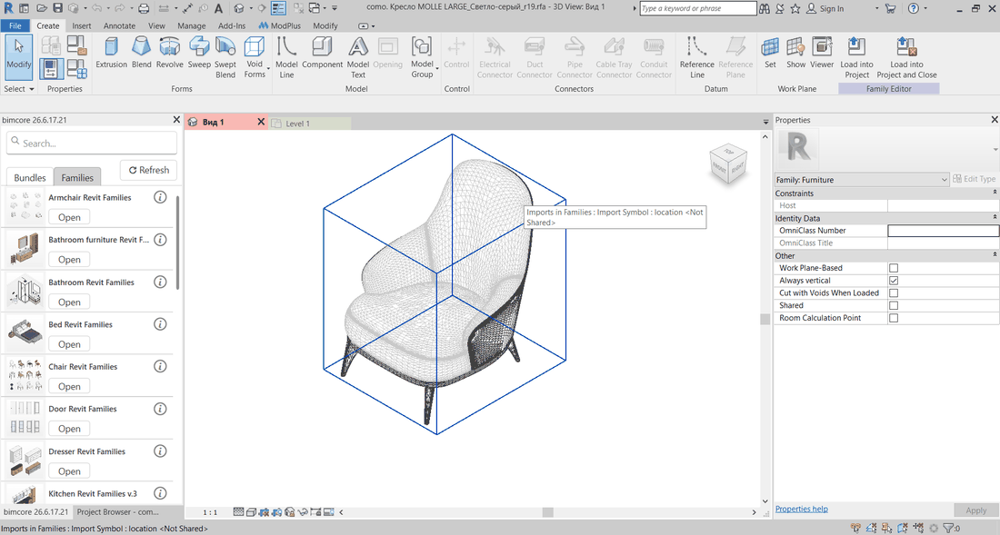
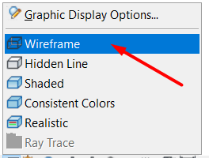
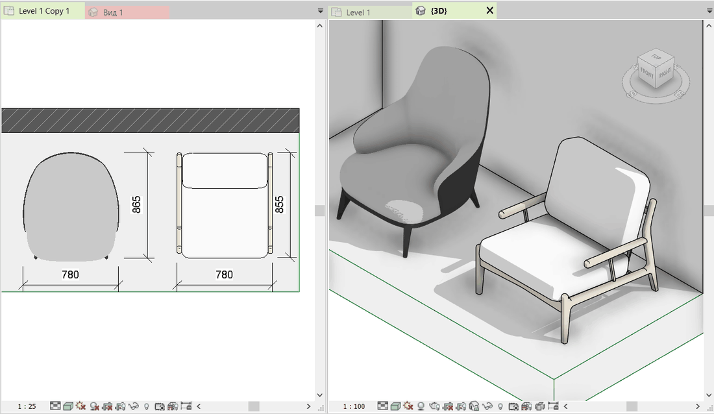
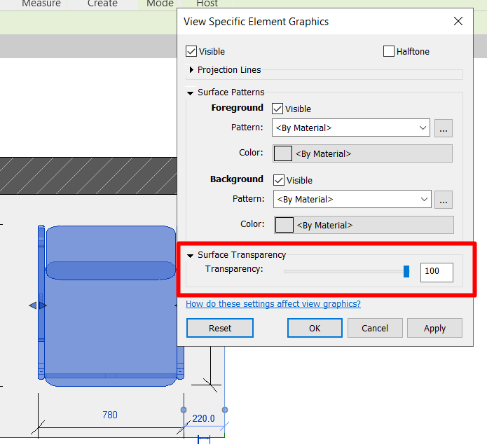

The family is placed in Revit and looks good in 3D, but in plan view you see extra lines, cannot adjust the material, can see the floor finish beneath the family, or get a solid white fill that you cannot change. The cause is almost always one of five. I have arranged them in the order that is easiest to check in a project, from imports and project settings to editing the family.

<truncate />

## 1. Imported geometry

The family is not built from Revit geometry but from a file imported from AutoCAD, 3ds Max or another program. Such families are often shared for free and can look impressively realistic from the outside. But their plan display often suffers. A model with many faces creates a mesh of lines that is very difficult to remove. Materials are also almost impossible to change.

To check your case, select the family and open it in the Family Editor. If the geometry selects as one piece and its properties show that it is an import, this is the problem.

:::danger[Risk]
**Use such families with caution!**

Imported geometry is heavy, and a file containing it is more likely to become corrupted and impossible to open, forcing you to redo the work from scratch. To reduce the risk, before working with such a family click **Save As**, then **Options**, and set **Maximum backups** to 10. If the file becomes corrupted, you will have ten earlier project versions.
:::

:::info[Information]
Revit creates a previous project version each time you click **Save**.
:::

I covered the other things to check in free families before loading them into a project in the article about the [risks of free Revit families](/blog/free-revit-families-risks/).

## 2. Coarse detail level

Most families have three ways of appearing in plan. At the coarse detail level you often see simplified family geometry; at medium and fine, the complete model appears. If the plan is set to coarse, a wardrobe turns into a rectangle and complex furniture may disappear completely.

On the View Control Bar at the bottom of the window, switch **Detail Level** to **Medium** or **Fine** and look at the family again. If its appearance changes, the problem is solved.

:::note[Note]
If a category has a fixed detail level in **Visibility/Graphics Overrides**, the family may not change when you switch the view's detail level. Check this dialog before deciding that this is not your case.
:::

If the plan has a view template assigned, the detail level may be controlled by the template. Change the setting in the template or remove the template from this plan.

## 3. Wireframe visual style

In **Wireframe**, Revit displays only model edges, so the whole family is transparent. In plan view all elements become transparent, fills disappear and you can see everything beneath the furniture. It is easy to switch this style on by accident and then start looking for a problem in the family.

Open **Visual Style** on the View Control Bar and choose **Hidden Line** or **Shaded**. The first gives furniture an opaque outline; the second also displays material colours. **Hidden Line** is usually enough for drawings, while **Shaded** is better for 3D.

## 4. Transparency

Transparency can be assigned to a category, a filter or an individual element, and it remains in the view until you remove it. It is usually added temporarily to see elements beneath the furniture and then forgotten.

Open **Visibility/Graphics Overrides** and check the **Transparency** column for the Furniture, Specialty Equipment and Generic Models categories. Then check the Filters tab.

If only one family is transparent, right-click it, choose **Override Graphics in View**, then **By Element**, and return its surface transparency to 0.

:::tip[Tip]
If several plans are transparent at once and you cannot change them, check whether a view template is assigned. One correction in the template removes transparency from every plan to which it is applied.
:::

## 5. A 2D symbol is set up in the family instead of 3D

Some families are set up so that a 2D symbol made from symbolic lines and a masking region appears in plan instead of the model. The solid geometry is switched off in plan. The symbol was drawn for one size and shape, so after the parameters change it no longer matches the model, while the masking region hides fills and materials.

Open the family in the Family Editor and look at its plan view. If it contains symbolic lines or a masking region and the model is not visible, you have two options.

**First option:** delete the 2D symbol completely, select the solid geometry, click **Visibility Settings** and enable it in plan views. Revit will show the family's real shape in plan. If its category is cuttable, the geometry will also appear cut where the cut plane intersects it.

**Second option:** keep the symbol for one detail level, such as **Coarse**, and enable the solid geometry for medium and fine. In **Visibility Settings**, leave only the coarse level enabled for the symbolic lines. For the geometry, enable plan views and the **Medium** and **Fine** levels. Load the family back into the project and check the plan at all three levels.

## What to check, in short

| What you see in plan | What to check | What you get |
|---|---|---|
| A tangle of lines, no fill, not cut | Import in the Family Editor, backup copies | You know the family must be replaced or rebuilt |
| A rectangle instead of furniture or an empty spot | Detail level of the view or category | The model appears at medium and fine |
| Every element in the view is transparent | Visual style | An opaque outline and fill across the whole plan |
| Only some categories or one item are transparent | Transparency column in Visibility/Graphics Overrides, element override | Transparency is removed where it was forgotten |
| The model exists in 3D, but plan shows a flat symbol | Symbolic lines and Visibility Settings in the family | Plan displays the real shape and materials |

## If you do not want to adjust every family

We have developed a [complete family library for interior designers](https://bimcore.one/). Plan display is already set up. The geometry is created with Revit tools; the coarse level shows a simplified symbol, medium and fine show the real shape, and materials and fills work without additional editing. You can see how this works in our [Revit kitchen families](/guides/families/kitchen-for-revit/).

## Questions and answers

### The family is only white in plan and ignores its material settings

There are two possible causes. Either the view uses the **Hidden Line** visual style, which does not show material colours in plan, or the family contains a masking region in plan that covers the model. In the first case, switch the style to **Shaded**. In the second, open the family and correct it as described in point 5.

### The family appears only as lines in plan, with no fill

The plan most likely displays a 2D symbol made from symbolic lines. First switch the detail level and check transparency as described in points 2 and 4. If that does not help, open the family and follow point 5.

<CTA type="guide" />
