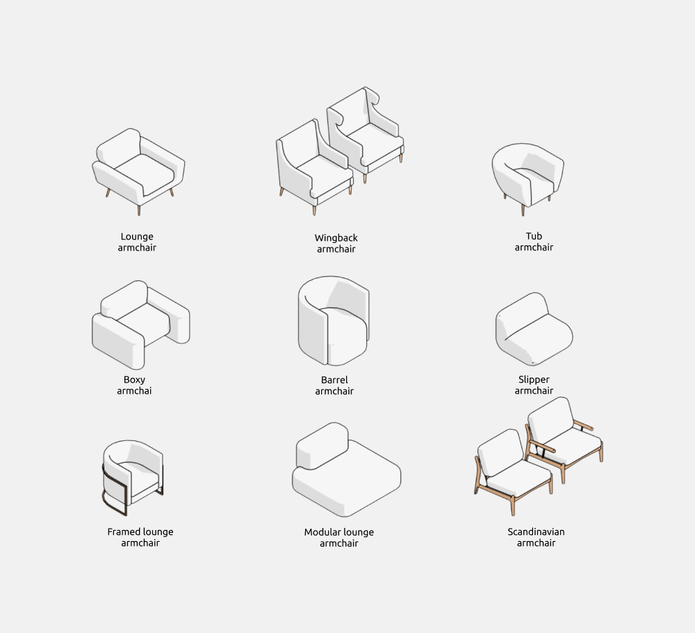
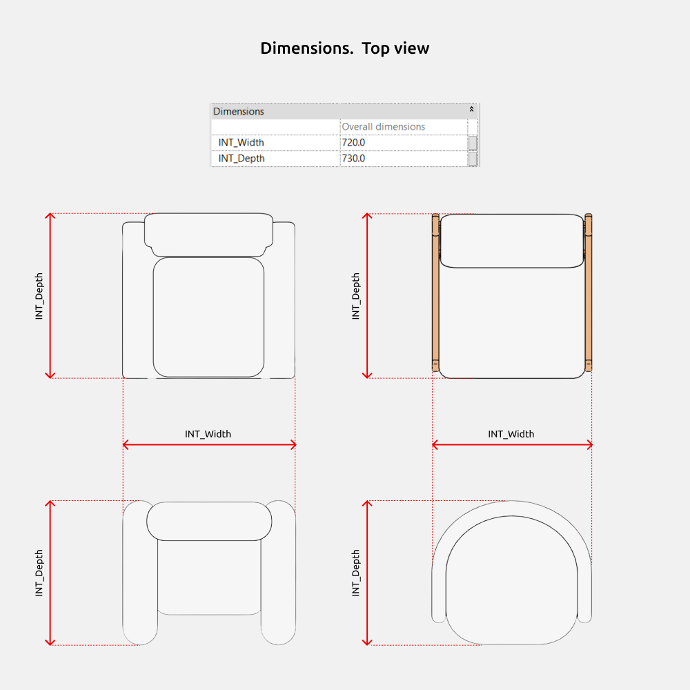
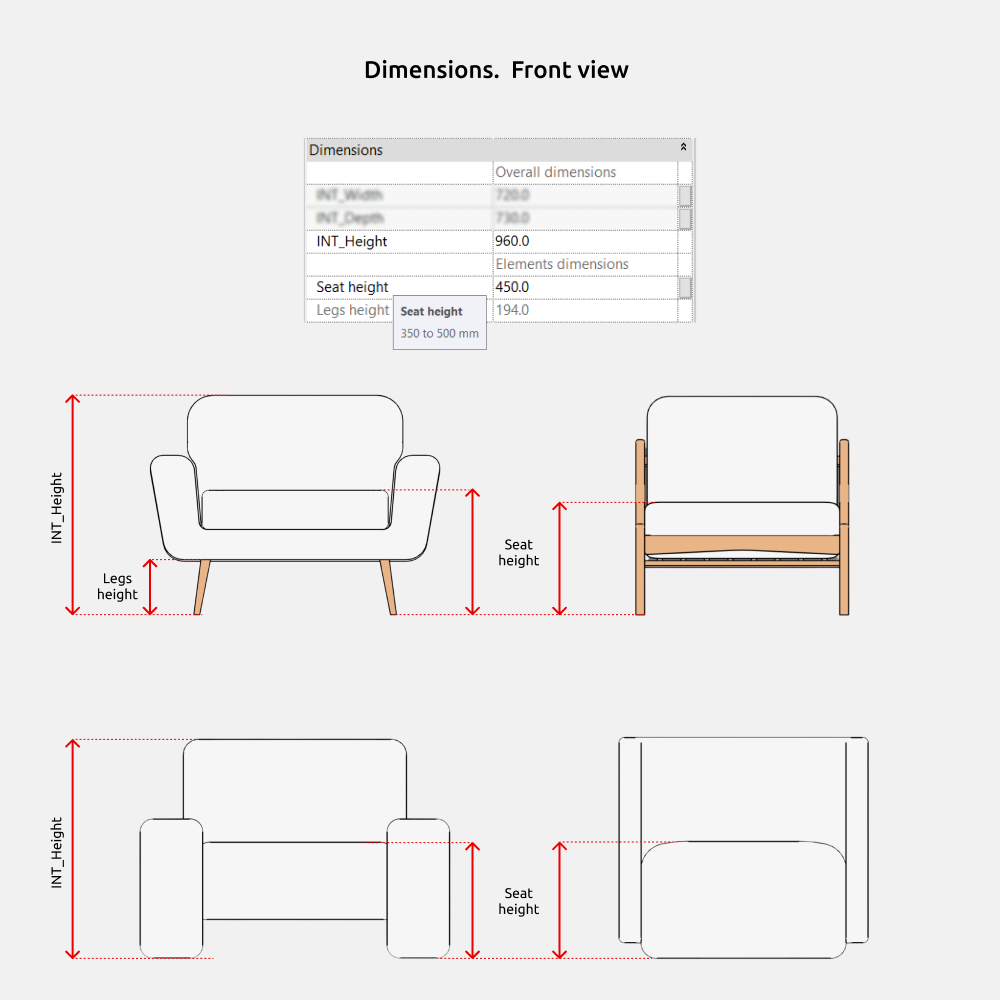
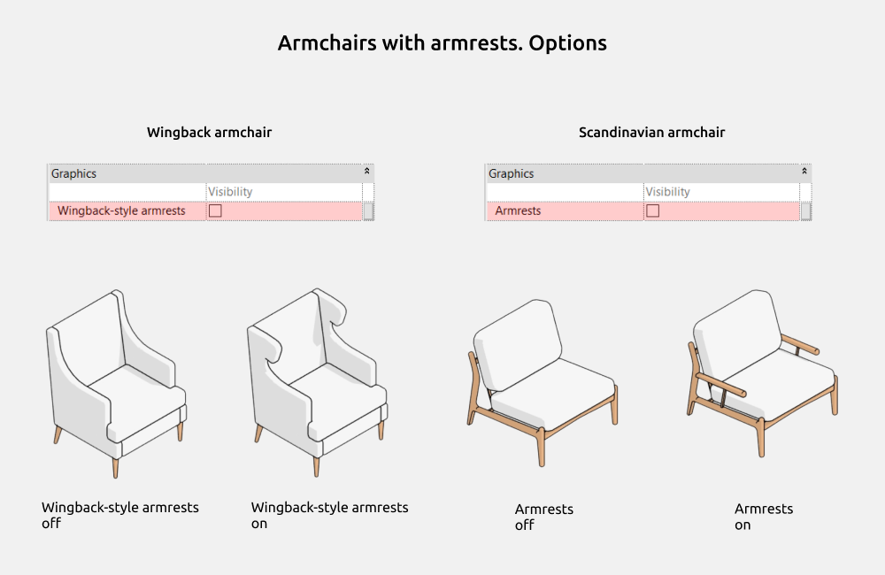

import productPreview from './product.jpg';

<ProductCard
  name="Armchair Revit Families"
  eyebrow="Revit Family Set"
  description="A collection of armchair families in different styles — ready to drop into your Revit project."
  image={productPreview}
  imageAlt="Armchairs Revit Families — set preview"
  buyUrl="https://bimcore.one/products/armchair-revit-families"
  ecwidProductId="577113367"
/>

## 1. GENERAL INFORMATION

- Set name: Armchairs
- Version 1.0.0
- Revit version: 2019

### Description

This set of Revit families is made for armchair usage in Autodesk Revit architectural and interior templates. Using the families, you can create straight, semi-circular, and modular armchairs to exact dimensions. Suitable for interior designers and architects.

### Loading and placing into the project

In order to view and download the families from the set, you can open **Project with armchairs** and copy the families using the Ctrl+C key combination, and then paste them into your project Ctrl+V. Or open the folder with family files and drag it into the project with the mouse.

## 2. SET STRUCTURE

The set includes the following families:

- Lounge armchair
- Wingback armchair
- Tub armchair
- Boxy armchair
- Barrel armchair
- Slipper armchair
- Framed lounge armchair
- Modular lounge armchair
- Scandinavian armchair

## 3. FAMILIES: PARAMETERS AND ELEMENTS

### Armchairs

INT_Width, INT_Depth, and INT_Height parameters control the overall dimensions of the armchairs.

**Seat height** parameter adjusts the seat distance from the finished floor level. It is limited to sizes specified in the tooltip.

To see the tooltip, hover the mouse over the parameter name (as shown in the image).

There are gray parameters that cannot be controlled. But they are needed to understand the size calculations. For example, **Legs height**.

### Options

Wingback armchair and Scandinavian armchair types allow armrest visibility control. Wingback armchair ear armrests visibility controlled by **Armrests with ears** parameter. Scandinavian armchair armrests visibility controlled by **Armrests** parameter.

**Backrest gaps** parameter allows changing the modular armchair backrest width by symmetrically adjusting the distance from the backrest to the seat side edges.

<CTA type="guide" />
