import productPreview from './product.jpg';

<ProductCard
  name="Bathroom Revit Families"
  eyebrow="Revit Family Set"
  description="Toilets, sinks, bathtubs and showers — bathroom families ready to drop into your Revit project."
  image={productPreview}
  imageAlt="Bathroom Revit Families — set preview"
  buyUrl="https://bimcore.one/products/bathroom-revit-families"
  ecwidProductId="543750264"
/>

## 1. GENERAL INFORMATION

-   Set name: Bathroom
-   Version  1.3.0
-   Revit version: 2019

### Description

This set of Revit families is designed for modeling bathroom in Autodesk Revit, suitable for BIM projects in interiors and architecture. The library includes parametric families of plumbing equipment, developed with precise dimensions and requirements for designing bathrooms and laundry rooms.

Using these families, you can create and customize bathtubs, sinks, shower enclosures, shower systems, faucets, towel warmers, plumbing fixtures, and bathroom accessories.

The set is intended for interior designers and architects working in Autodesk Revit on residential and commercial projects.

### Loading and placing into the project

In order to view and download the families from the set, you can open **Project with Bathroom** and copy the families using the Ctrl+C key combination, and then paste them into your project Ctrl+V.

Or open the folder with family files and drag it into the project with the mouse.

## 2. SET STRUCTURE

**Project with bathtubs**

The bathroom project includes the following families from **folder 4 - Bathtubs**:

-   Built-in bathtub
-   Freestanding bathtub
-   Asymmetrical corner bathtub
-   Corner bathtub

**Project with shower enclosure**

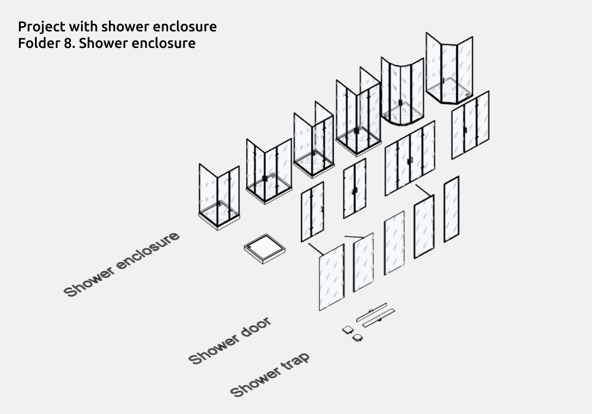

The shower enclosure project includes the following families from **folder 8 - Shower enclosure**:

-   Shower enclosure
-   Shower door
-   Shower trap

**Project with shower systems**

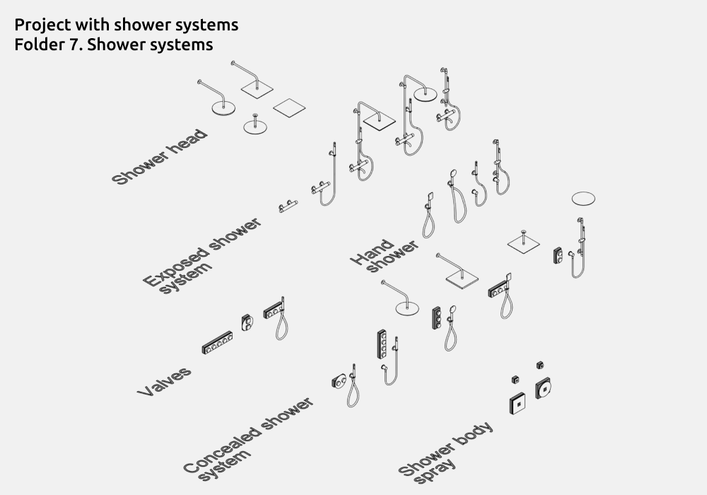

The shower systems project includes the following families from **folder 7 - Shower systems**:

-   Shower body spray
-   Valves
-   Exposed shower system
-   Concealed shower system
-   Hand shower
-   Shower head

**Project with equipment and entourage**

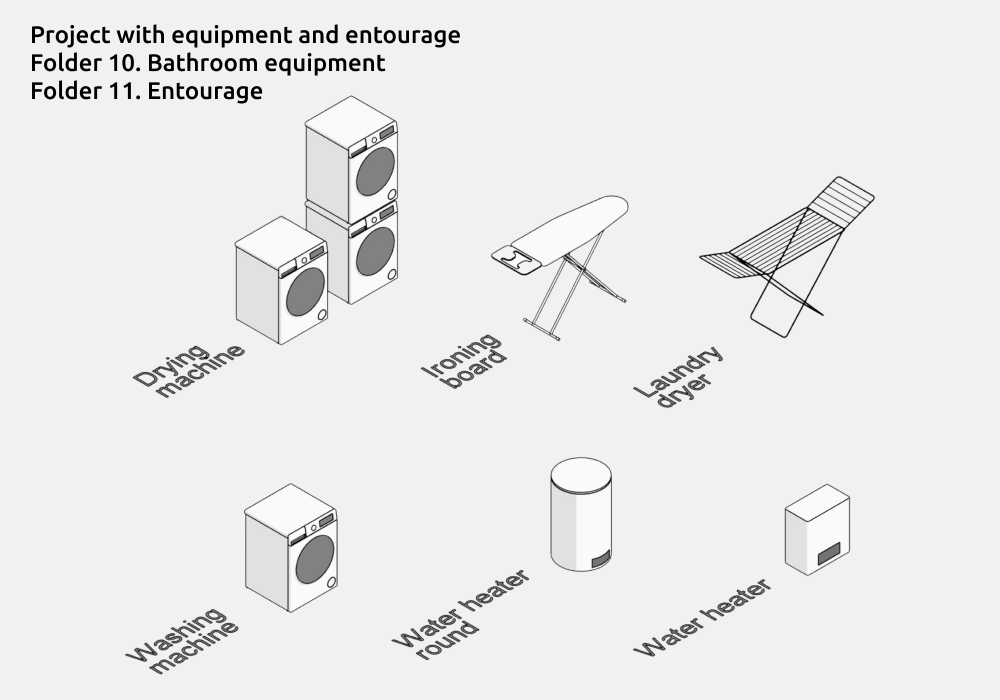

The bathroom equipment and decor project includes families from folder 10 - **Bathroom equipment** and **folder 11 - Entourage**:

Bathroom equipment:

-   Water heater round
-   Water heater
-   Washing machine
-   Drying machine

Entourage:

-   Ironing board
-   Soap dispenser
-   Soap dish
-   Towel on rack
-   Towel twisted
-   Towel
-   Beaker
-   Laundry dryer

**Project with towel warmers**

The towel warmers project includes the following families from **folder 9 - Towel warmers**:

-   Towel warmer Water One rack
-   Towel warmer Water
-   Towel warmer Electric One rack
-   Towel warmer Electric

**Project with sinks**

The sinks project includes families from **folder 5 - Sinks** and **folder 13 - Bathroom furniture**.

Sinks:

-   Built-in sink
-   Wall-Hung sink
-   Corner sink
-   Sink

Bathroom furniture:

-   Base frame for sink

**Project with bathroom fixtures**

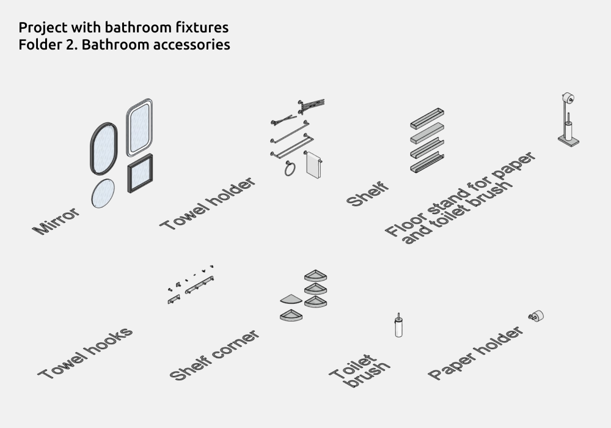

The bathroom fixtures and accessories project includes families from **folder 1 - Bathroom fixture** and **folder 2 - Bathroom accessories**.

Bathroom fixture:

-   Bidet
-   Hygienic shower 1 outlet
-   Hygienic shower 2 outlets
-   Urinal
-   Floorstanding toilet with barrel
-   Toilet

Bathroom accessories:

-   Paper holder
-   Toilet brush
-   Mirror
-   Towel hooks
-   Floor stand for paper and toilet brush
-   Shelf corner
-   Shelf
-   Towel holder

**Project with faucets**

The faucets project includes the following families from **folder 6 - Faucets**:

-   Faucet classic
-   Wall-mounted faucet
-   Faucet

**Bathroom components**

If necessary, you can use individual components from **folder 3 - Bathroom components**, which includes the following families:

-   Bidet installation
-   Urinal installation
-   Toilet installation
-   K
-   Flush button for urinal
-   Siphon

## 3. FAMILIES: PARAMETERS AND ELEMENTS

### Outputs symbol

At **medium** detail level in the top view, you can enable the graphic symbol (GS) for water connections to indicate which pipes need to be routed to this area.

To enable the Graphic symbol, follow these steps:

1.  In the Properties, under the **Graphics** grouping, check the visibility parameter "**Graphic symbol**".
2.  Change the view detail level to **Medium**.

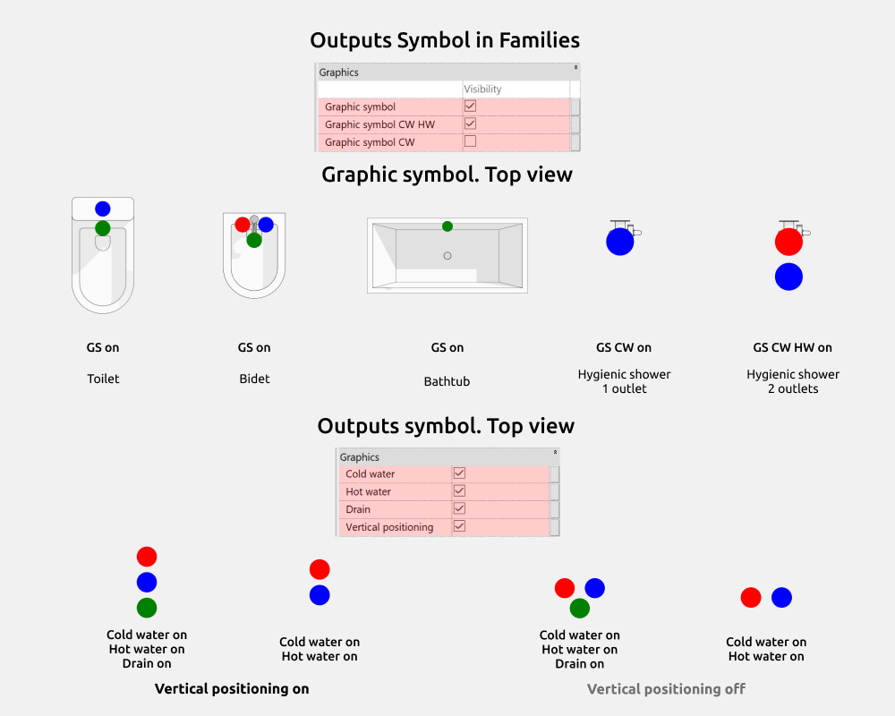

Graphic symbol display in the top view depends on which systems are enabled in the Graphics parameters within the parent family for Graphic symbol, as well as the "Vertical placement" parameter.

Graphic Symbols by system type:

-   Blue - Cold water
-   Red - Hot water
-   Green - Drain

In the front view, Outputs symbol in families are shown as circular markers with centerlines.

Marker colors also indicate the system type.

Graphic symbol display depends on enabled system type parameters and the "Vertical placement" parameter.

### Graphic Symbol Outputs. General Dimensions

In the **Graphic symbol** subgroup under the **Dimensions** grouping, parameters control the size and position of the graphic symbol relative to elements in the parent family.

Graphic Symbol parameters found in families:

-   GS_CW and HW height: Cold and Hot water outlet height
-   GS_Drain height: Drain outlet height
-   GS_CW and HW diameter: Graphic Symbol cold/hot water circle diameter
-   GS_Drain diameter: Graphic symbol drain circle diameter
-   Axis displacement CW: Cold Water outlet offset (or cold/hot Water) from drain

#### Connectors

Some families include connectors to cold water, hot water, and drainage.

Connector dimensions can be specified using the following parameters:

-   Connector CW diameter
-   Connector CW and HW diameter
-   Connector Drain diameter

### Bathtubs

#### Built-in bathtub

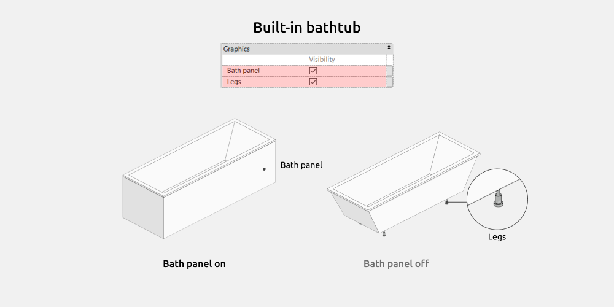

Here you can on/off the following elements:

-   Bath panel
-   Legs

##### Dimensions

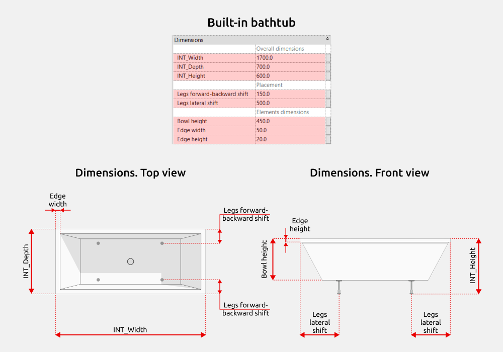

“INT_Width”, “INT_Depth”, and “INT_Height” parameters control the overall dimensions of the bathtubs.

"Legs forward-backward shift": Distance of legs from the edge along the short side.

"Legs lateral shift": Distance of legs from the edge along the long side of the bathtub.

"Bowl height": Distance from the bathtub bottom to the rim edge. Adjusted by leg height.

"Edge width": Width from the inner bowl edge to the outer bathtub edge.

##### Options

Bathtub shape options:

-   Bathtub shape rectangular
- Bowl oval
- Bowl rectangle
-   Bathtub shape oval
-   Bathtub shape semi-oval
-   Bathtub shape semi-oval corner bathtub

Drain placement:

-   Drainage side placement
-   Drainage center placement

Graphic symbol  placement:

-   Graphic symbol_Side placement
-   Graphic symbol_Center placement

#### Corner bathtub

Here you can turn on/off the Bath panel.

You can also select graphic symbol placement:

-   Graphic symbol_Left Placement
-   Graphic symbol_Right Placement

##### Dimensions

In the corner bathtub, the "INT_Width" and "INT_Height" dimensions change. The "INT_Depth" parameter equals "INT_Width".

You can control element sizes: "Bowl height" and "Rim height".

#### Asymmetrical corner bathtub

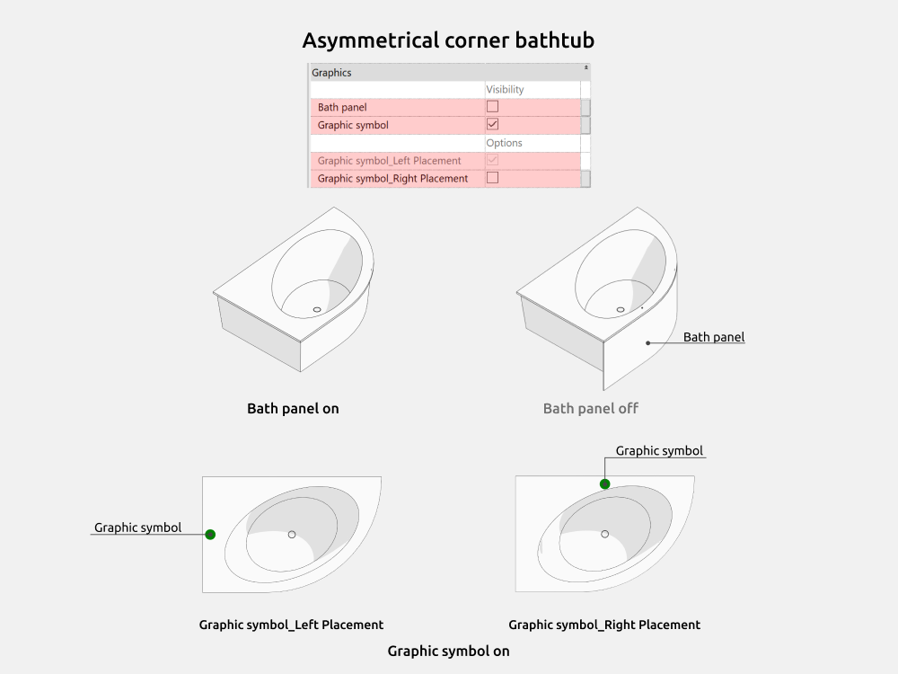

Here you can turn on/off the Bath panel.

You can also select graphic symbol placement:

-   Graphic symbol_Left Placement
-   Graphic symbol_Right Placement

##### Dimensions

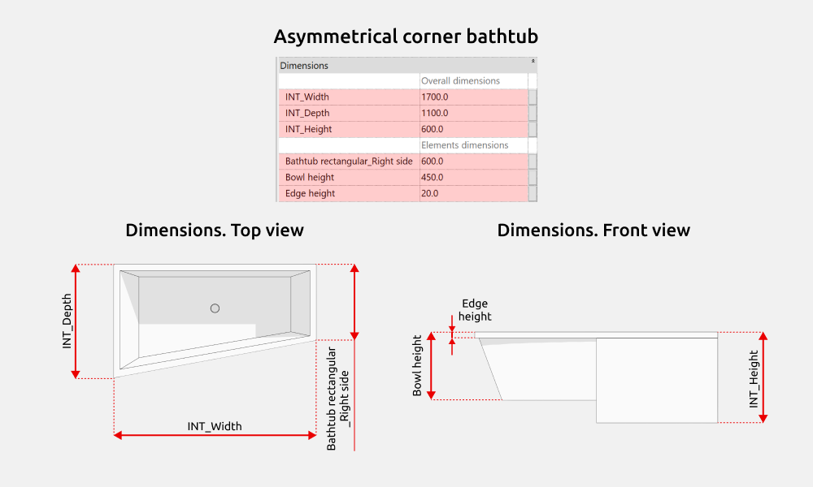

In the asymmetrical corner bathtub, the "INT_Width" and "INT_Height" dimensions change. The "INT_Depth" parameter equals "INT_Width".

You can control the sizes of elements: “Bathtub rectangular_Right side” (Rectangular bathtub only), “Bowl height” and “Edge height”.

##### Options

Bathtub shape

-   Bathtub round
-   Bathtub rectangular

#### Freestanding bathtub

Bathtub shape options:

-   Bathtub shape rectangular
- Bowl oval
- Bowl rectangle
-   Bathtub shape oval
-   Bathtub shape classic
-   Bathtub shape semi-oval
-   Bathtub shape egg

##### Dimensions

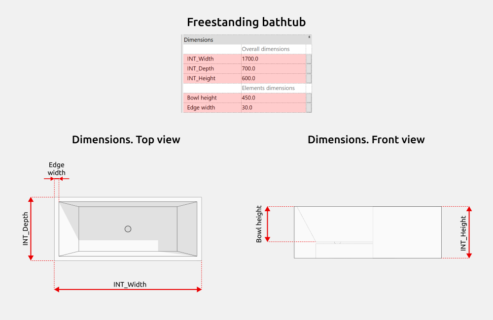

All dimensions change for rectangular, oval, and semi-oval bathtubs.

You can modify the following element sizes:

-   Bowl height
-   Edge width

Bathtub shape features:

-   Bathtub shape classic: only "INT_Width" changes
-   Bathtub shape egg: only "INT_Height" changes

##### Options

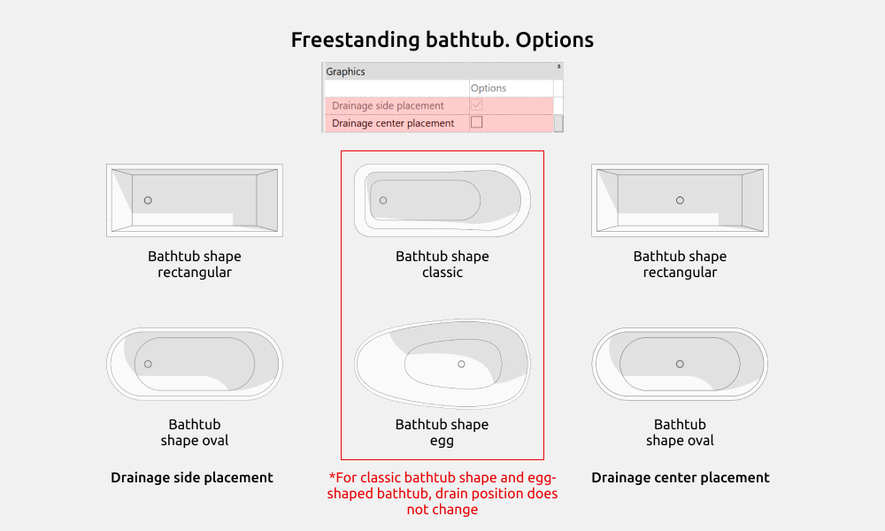

Drain position:

-   Drainage side placement
-   Drainage center placement

Bathtub shape features:

For classic bathtub shape and egg-shaped bathtub, drain position does not change.

### Shower enclosures

#### Shower enclosure

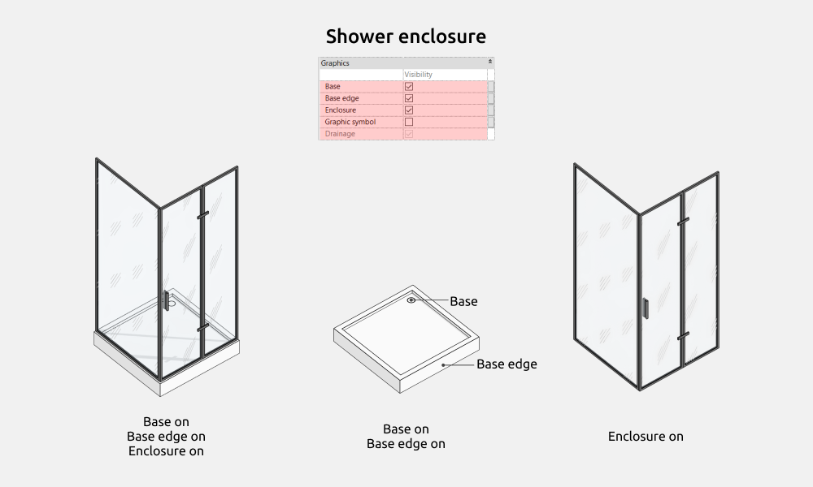

Here you can on/off the following elements:

-   Base
-   Base edge
-   Enclosure

##### Dimensions

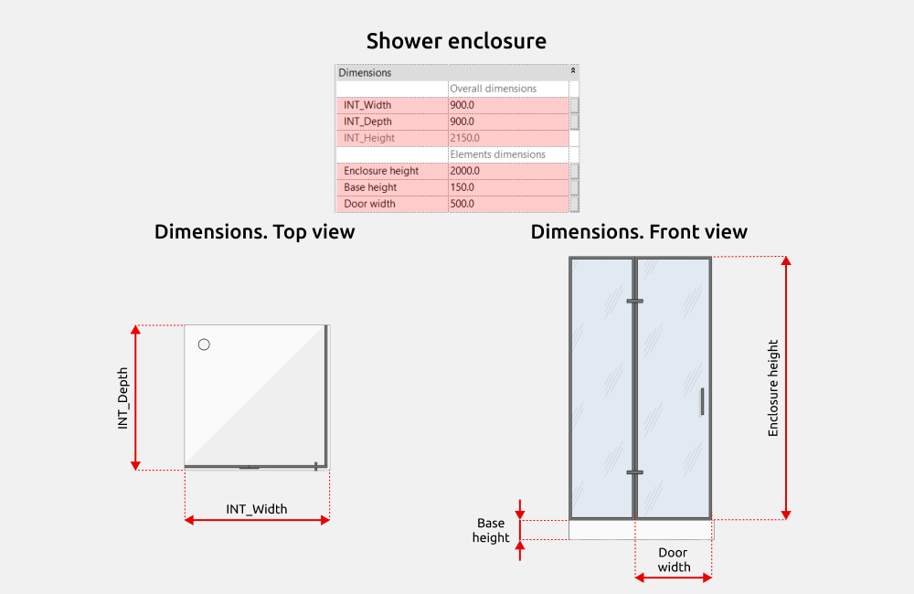

The "INT_Width", "INT_Depth", and "INT_Height" dimensions can be modified.

You can also change element sizes for enclosure height, base height, and door width.

##### Options

Graphic symbol:

-   Graphic symbol (**Medium** detail level)
-   Graphic symbol_Opening
-   Graphic symbol_Trap

Graphic symbol placement

-   Graphic symbol right
-   Graphic symbol left

If a sliding door is selected, the Graphic symbol_Opening displays as an arrow and includes additional options.

-   Placement outside
-   Placement inside

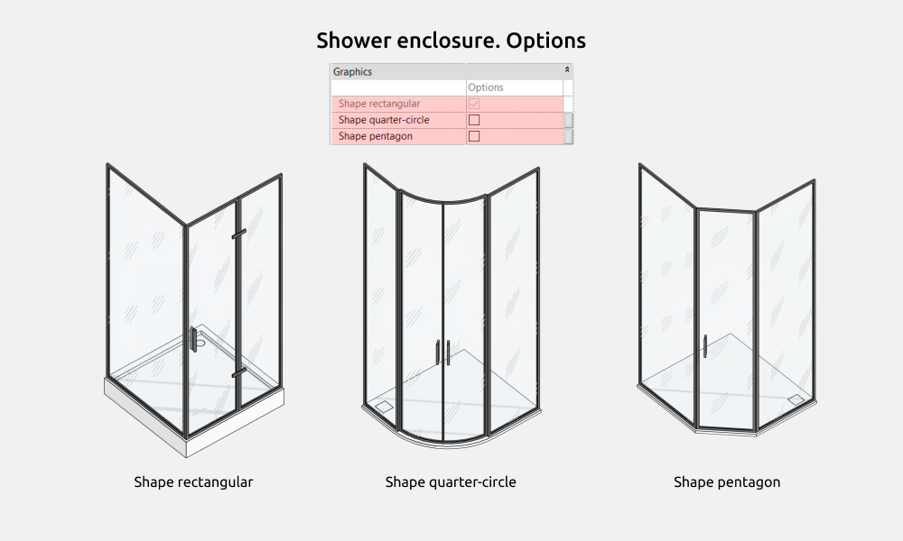

In the options, you can select the enclosure and base shape:

-   Shape rectangular
-   Shape quarter-circle
-   Shape pentagon

Enclosure placement type:

-   E_Placement corner
-   E_Placement in niche
-   E_Placement in niche with 1 side glass
-   E_Placement in niche with 2 side glasses
-   E_Placement wall-mounted
-   E_Placement against wall

Door type selection

-   E_Type swing door
-   E_Type sliding door
-   E_Quantity one door
-   E_Quantity two doors

Door opening type

-   Opening left-hand
-   Opening right-hand

Drain type selection:

-   D_Shape round
-   D_Shape square
-   D_Shape rectangle

You can also select the drain placement variant on the base.

For round and square drains:

-   D_Type top left
-   D_Type top center
-   D_Type top right
-   D_Type left center
-   D_Type bottom left
-   D_Type bottom center
-   D_Type bottom right

The rectangular drain can be positioned on three sides of the tray: top, left, and bottom.

##### Materials

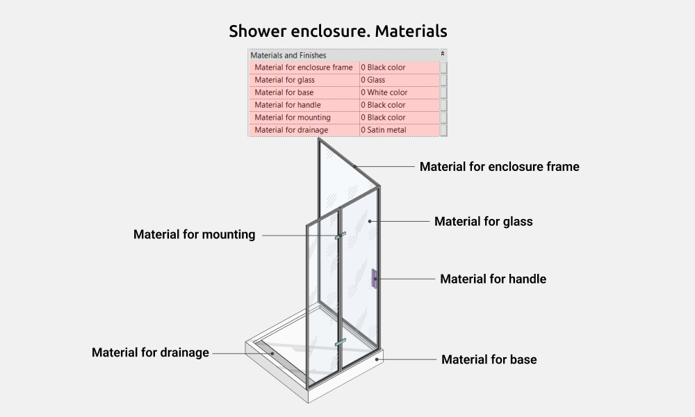

Materials for the enclosure frame, glass, base, handle, mounting, and drain can be changed.

#### Shower door

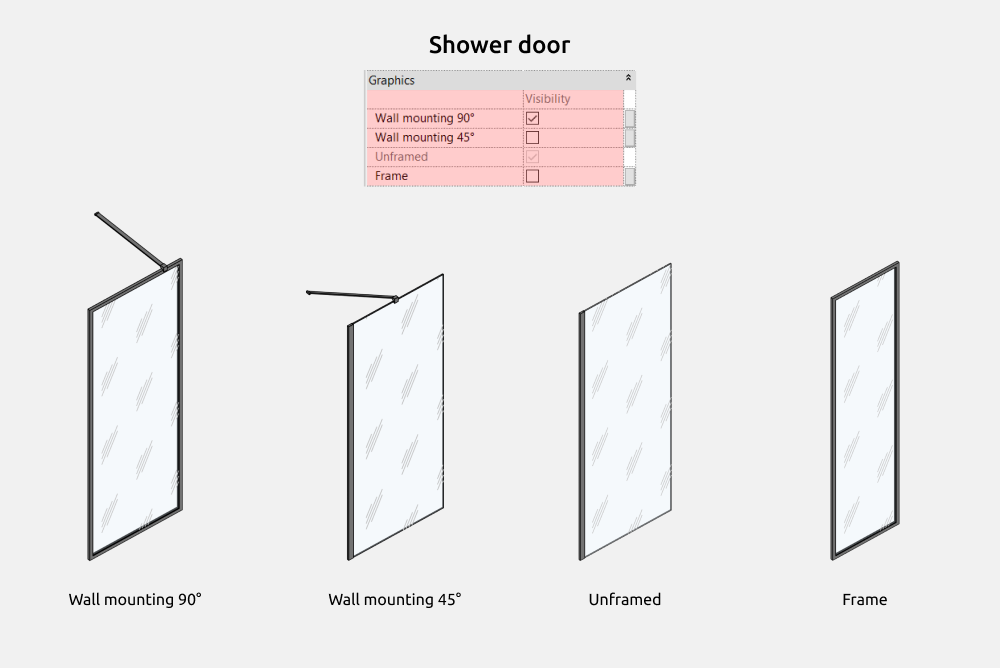

Here you can on/off the following elements:

-   Wall mounting 90°
-   Wall mounting 45°
-   Unframed
-   Frame

##### Dimensions

The “INT_Width” and “INT_Height” dimensions can be modified.

Using the “Mounting setback from the wall” parameter, you can set the partition offset from the wall.

#### Shower trap

Trap shape:

-   Shape rectangular
-   Shape round

For the shower trap, you can on/off the Graphic symbol:

-   Graphic symbol_Trap
-   Graphic symbol (Shower trap)*
-   Graphic symbol (Wall trap)**

*If the trap is placed in the base/floor, enable Graphic symbol (Shower trap).

**If the trap is placed in the wall, enable Graphic symbol (Wall trap) for correct top and front symbolic display.

##### Dimensions

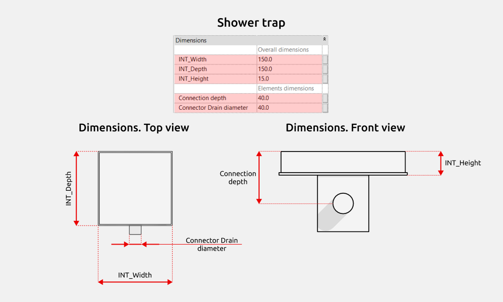

The "INT_Width", "INT_Depth", and "INT_Height" dimensions can be modified.

You can also adjust the sewer connection pipe diameter and connection depth.

### Shower systems

#### Shower body spray

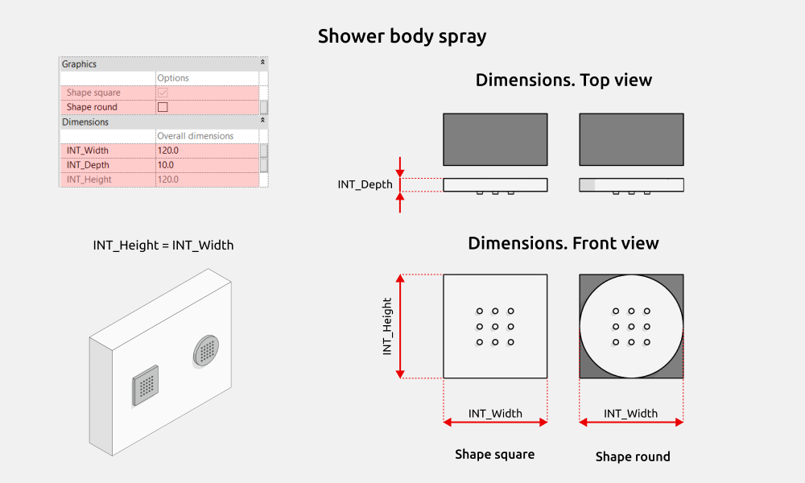

Shower shape options:

-   Shape square
-   Shape round

The "INT_Width", "INT_Depth", and "INT_Height" dimensions can be modified.

#### Valves

Here you can on/off the following elements:

-   Valve 1
-   Valve 2
-   Valve 3
-   Valve 4
-   Valve 5
-   Hand shower on the base
-   Base

##### Dimensions

The "Valves distance between axes" parameter sets the distance between the centers (axes) of the valves and the hand shower (if the hand shower option is enabled).

For rectangular valves, you can modify the "Valves width" and "Valves height" parameters.

For round valves: "Valves height" = "Valves width".

The "Plugs diameter" parameter is available for adjustment only when the “Valve on the base” is enabled and the “Base” is disabled.

The "Frame" parameter adjusts the offset from the edge of the base to the edge of the valve.

##### Options

Valve placement options

-   Valves type vertical
-   Valves type horizontal

Valve shape options

-   Valves shape round
-   Valves shape rectangular

Base shape is set independently of the valves:

-   Base shape rectangular
-   Base shape oval
-   Base shape round

For the hand shower (when the "Hand shower on the base" parameter is enabled), shape selection is available:

-   Hand shower shape cylinder
-   Hand shower shape rectangle
-   Hand shower shape round

Hose type options:

-   Hose type bathtub
-   Hose type shower

##### Materials

Valve Family Materials:

-   Material for valves
-   Material for base
-   Material for plugs
-   Material for hand shower
-   Material for hose

#### Exposed shower system

Here you can on/off the following elements:

-   Shower head
-   Hand shower
-   Spout

##### Dimensions

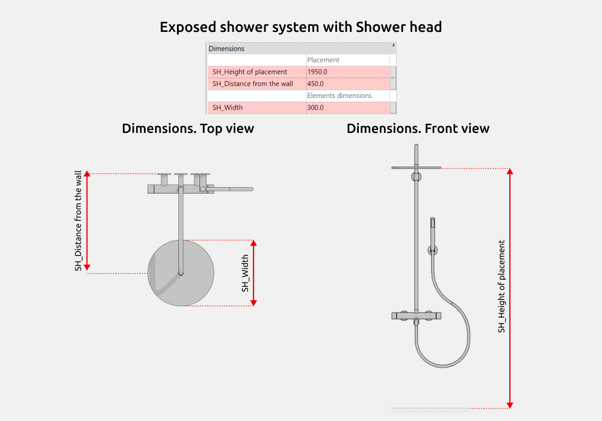

Hand shower parameters are active only when the "Hand shower" parameter is enabled.

Main placement and size parameters for shower elements:

-   SH_Height of placement
-   SH_Distance from the wall
-   SH_Width

Thermostat and showerhead position

-   Hand shower height placement
-   Hand shower offset
-   Thermostat height placement

“Rod height” parameter is active only when “H_Positioning on rod” is enabled.

“Hand shower offset” and “Hand shower height placement” parameters are inactive when “H_Positioning on rack” is enabled.

##### Options

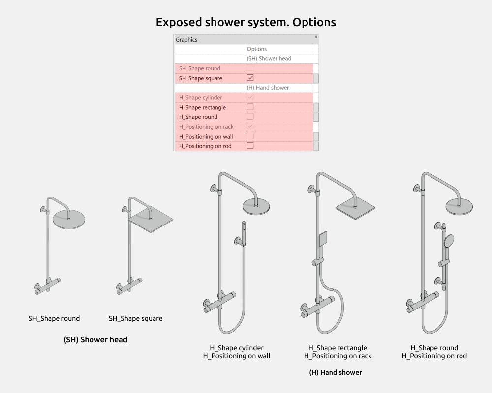

In the Exposed shower system family, Shower head and Hand shower options are available.

For the shower head (when "Shower head" parameter is enabled), shape selection is available:

-   SH_Shape round
-   SH_Shape square

For the Hand shower (when the "Hand shower" parameter is enabled), shape selection is available:

-   H_Shape cylinder
-   H_Shape rectangle
-   H_Shape round

##### Materials

Exposed shower system materials:

-   Material for SH,thermostat,spout
-   Material for hand shower
-   Material for hose
-   Material for plugs
-   Material for rod

#### Concealed shower system

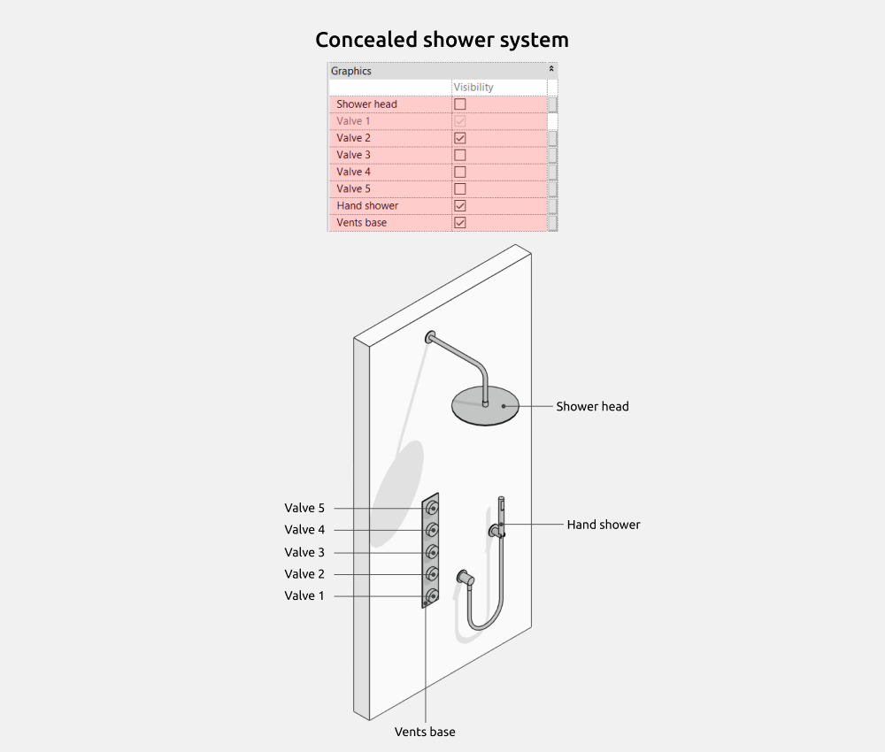

Here you can on/off the following elements:

-   Shower head
-   Valve  1
-   Valve  2
-   Valve  3
-   Valve  4
-   Valve  5
-   Hand shower
-   Vents base

##### Dimensions

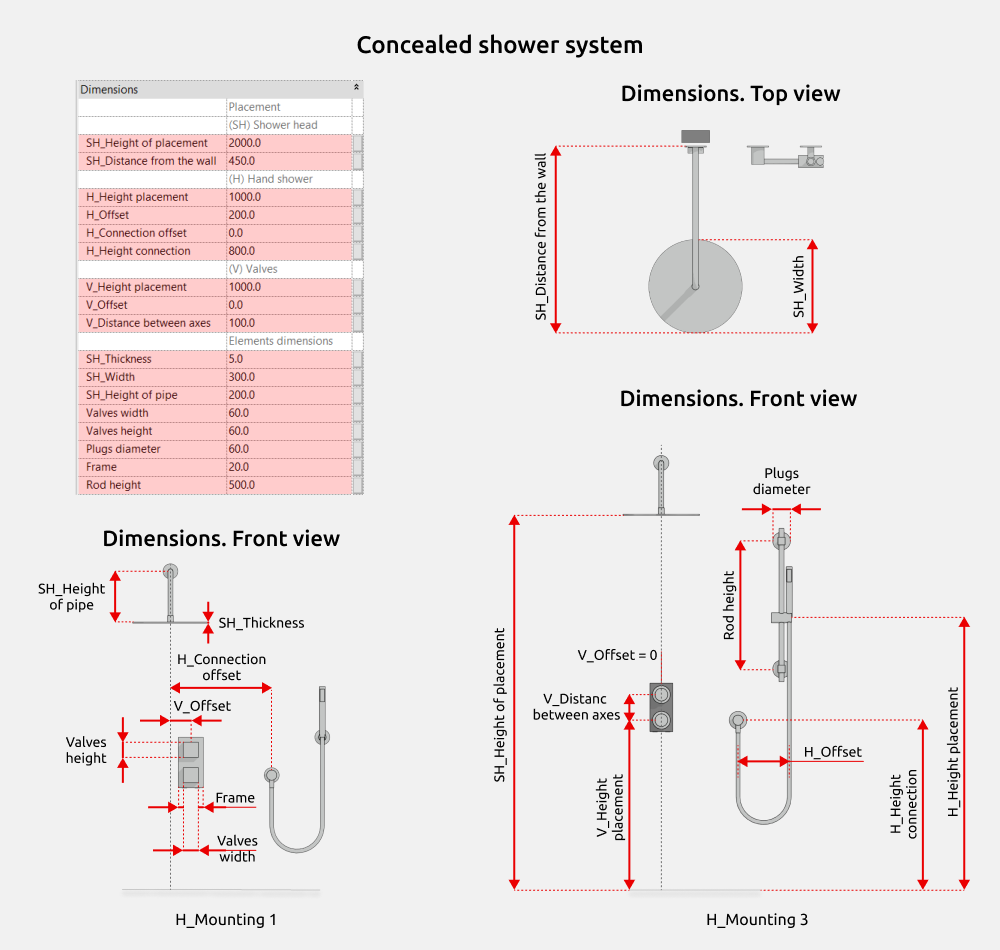

In the concealed-mounted shower system family, placement and size parameters are available.

For the shower head (when the "(SH) Shower head" parameter is enabled):

-   SH_Height of placement
-   SH_Distance from the wall
-   SH_Thickness
-   SH_Width
-   SH_Height of pipe

For the hand shower (when the "Hand shower" parameter is enabled):

-   H_Height placement
-   H_Offset
-   H_Connection offset
-   H_Height connection
-   Rod height
-   Plugs diameter (For hand shower and valves)

For valves:

-   V_Height placement
-   V_Offset
-   V_Distance between axes
-   Valves width
-   Valves height
-   Plugs diameter (For hand shower and valves)
-   Frame

##### Options

In the Concealed shower system family, options are available for the hand shower, shower head, and valves.

Hand shower options:

Shape selection is available (independent of mounting type):

-   H_Shape cylinder
-   H_Shape rectangle
-   H_Shape round

Mounting type is selected separately:

-   H_Mounting 1
-   H_Mounting 2
-   H_Mounting 3
-   H_Mounting 4 on base

For "H_Mounting 2" and "H_Mounting 4 on base", hose type selection is additionally available:

-   Hose type bathtub
-   Hose type shower

Detailed (SH) Shower head options are covered in the Shower head section.

(V) Valves options are detailed in the Valves section.

##### Materials

Concealed shower system materials:

-   Material for SH
-   Material for hand shower
-   Material for hose
-   Material for valves
-   Material for plugs
-   Material for base
-   Material for rod

#### Hand shower

Hand shower shape options (independent of mounting type):

-   Hand shower shape cylinder
-   Hand shower shape rectangle
-   Hand shower shape round

Mounting type:

-   Hand shower attachment 1
-   Hand shower attachment 2
-   Hand shower attachment 3

For "Hand shower attachment 1", hose type selection is additionally available:

-   Hose type bathtub
-   Shower type hose

##### Dimensions

-   Hand shower offset
-   Offset of the shower head (from 0 to any value) is available only for attachment 1 and attachment 3.
-   Hand shower height placement
-   The distance of the shower head from the placement plane is always available.
-   Hand shower connection height
-   Connection distance from the placement plane is available only for attachment 1 and attachment 3.
-   Plugs diameter
-   Diameter of all plugs for the selected mounting type is always available.
-   Rod height
-   Distance between rod mountings is available only for attachment 3.

##### Materials

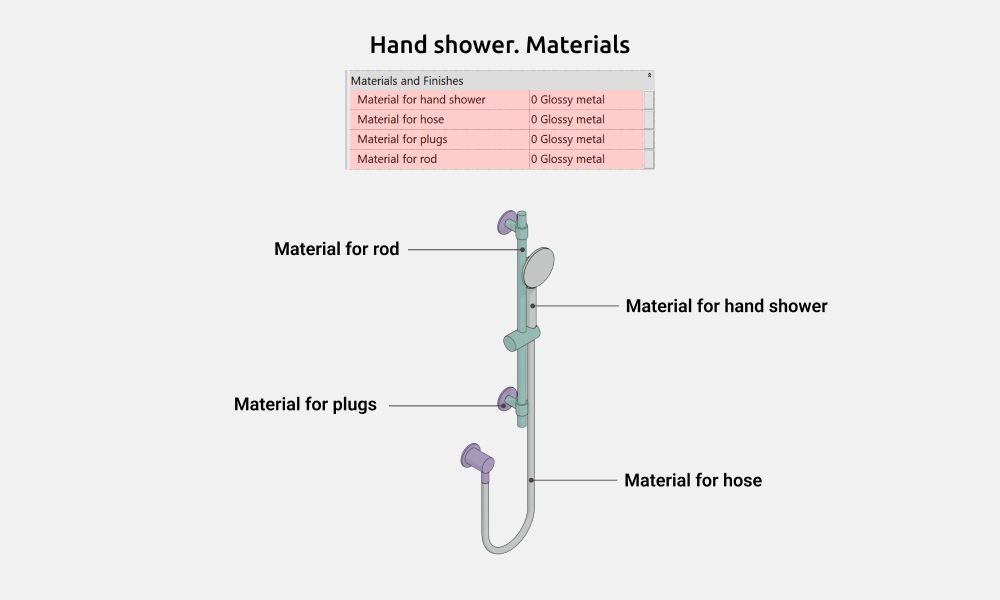

Hand shower materials:

-   Material for hand shower
-   Material for hose
-   Material for plugs
-   Material for rod

#### Shower head

Placement type:

-   SH_1 type from wall
-   SH_2 type from ceiling
-   SH_3 type in ceiling

Shower shape:

-   SH_Shape round
-   SH_Shape square

##### Dimensions

Shower head family parameters: SH_Height of placement and SH_Height of pipe, SH_Distance from the wall, width and thickness, as well as plug diameter.

### Equipment and entourage

#### Water heaters

The set includes two types of water heaters: rectangular and round shapes.

Placement height is adjusted using the “Offset” tool.

Dimensions are changed with parameters "INT_Width", "INT_Depth", and "INT_Height".

For the round water heater, "INT_Depth" equals "INT_Width".

#### Washer and dryer

For the Washing machine, you can on/off the following elements:

-   Drying machine top
-   Graphic symbol_Opening

For the Drying machine

-   Graphic symbol
-   Graphic symbol Top
-   Graphic symbol_Opening

##### Dimensions

Dimensions are changed with parameters "INT_Width", "INT_Depth", and "INT_Height".

The placement parameter "Drying machine setback" can be changed - distance between washer and dryer.

#### Entourage

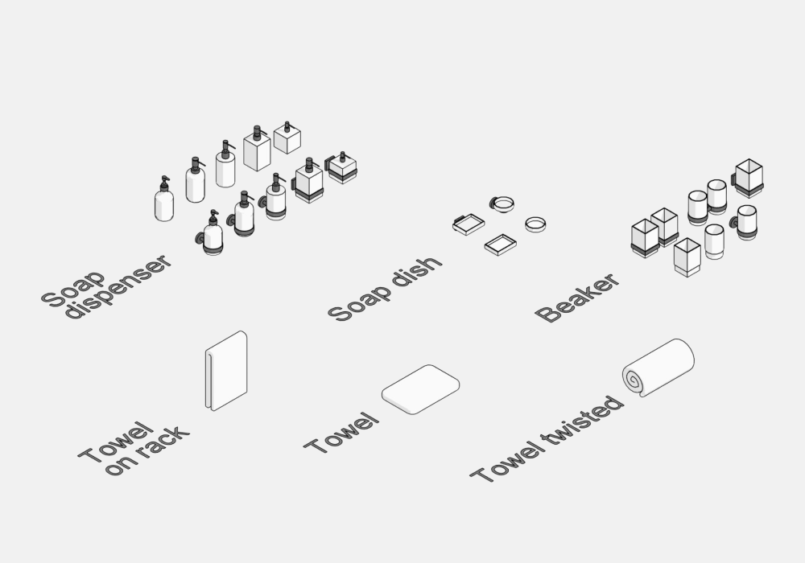

Soap dispenser

In the family, you can turn on/off the holder.

5 types of dispensers are selected by visibility checkboxes.

Soap dish

For the soap dish, you can turn on/off the holder and select the shape: rectangular or round.

The wall offset dimension and plug width values can be changed.

Beaker

For the beaker, you can turn on/off the holder and select the shape: square or round.

The number of beakers in the type can be selected: 1 or 2.

Towels:

Overall dimensions can be changed.

Ironing board family offers the following display options:

-   Unfolded
-   Folded

The Laundry dryer rack family has only one display option.

### Towel warmers

#### Water and electric towel warmers, One rack

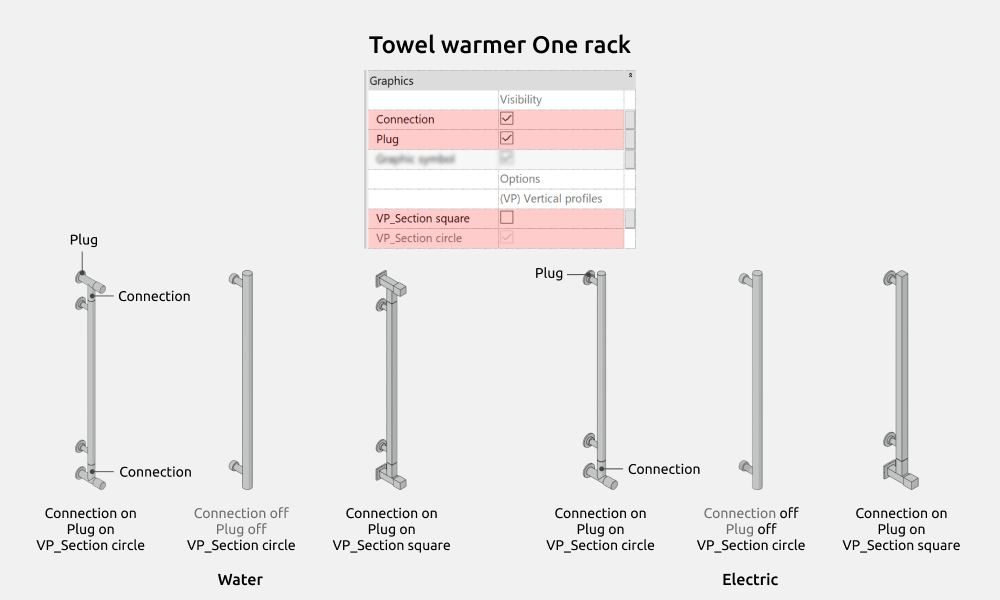

Here you can on/off the following elements:

-   Connection
-   Plug

Vertical profile section options:

-   VP_Section square
-   VP_Section circle

##### Dimensions

Dimensions are controlled by parameters "INT_Height" and "INT_Depth".

Parameter "Connection height" sets the distance from the start of the vertical profile to the connection point.

Parameter "Mounting offset vertically" sets the distance from the profile start to the mounting center.

#### Towel warmers

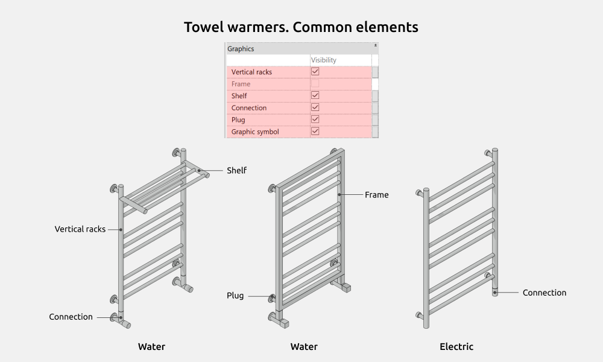

Here you can on/off the following elements:

-   Vertical racks
-   Frame
-   Shelf
-   Connection
-   Plug

##### Dimensions

Dimensions are controlled by parameters "INT_Height", "INT_Depth", "INT_Height".

Parameter "Mounting offset vertically" sets the distance from the profile start to the mounting center.

Parameter "HP vertical offset" sets the distance from the profile start to the edge of the horizontal profile.

*Parameter "Connection height" is available only in the water Towel warmer family. It sets the distance from the vertical profile start to the connection point.

##### Options

Vertical profile options are available in the towel warmer family.

With "Vertical stands" parameter enabled, placement options can be selected:

-   VP_Placement standard
-   VP_Placement nearby

Vertical profiles Section options:

-   VP_Section square
-   VP_Section circle

Horizontal profile options are available in the towel warmer family.

Horizontal Profiles Section options:

-   HP_Section square
-   HP_Section circle
-   HP_Section rectangle

Placement relative to the vertical profile:

-   HP_Placement between verticals
-   HP_Placement in front

Horizontal profile grouping:

-   HP_Group
-   HP_Freestanding

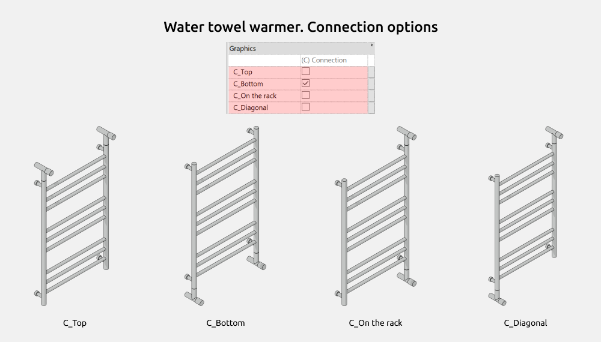

Water towel warmer, connection placement options:

-   C_Top
-   C_Bottom
-   C_On the rack
-   C_Diagonal

### Sinks

#### Common elements

##### Drainage

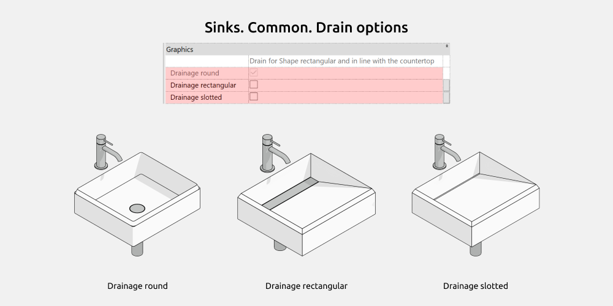

**By default**, round drain is applied to all sinks.

Drain selection is available only for rectangular sink (and if in the "Built-in sink" family the "Placement in line with the countertop" parameter is selected):

-   Drainage round
-   Drainage rectangular
-   Drainage slotted

##### Faucet

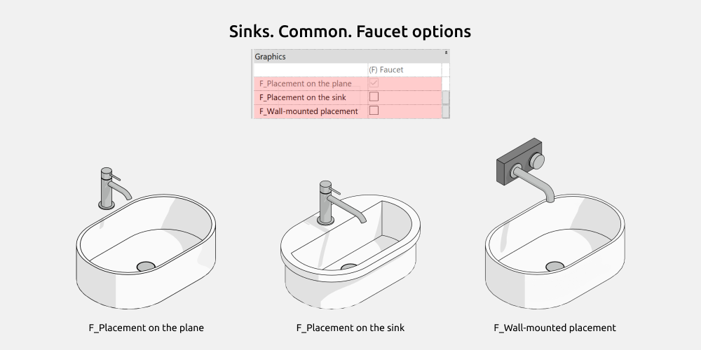

Faucet placement options:

-   F_Placement on the plane
-   F_Placement on the sink
-   F_Wall-mounted placement

For the **built-in sink**, option "F_Placement on the sink" is available only with "Placement on a countertop".

##### Dimensions

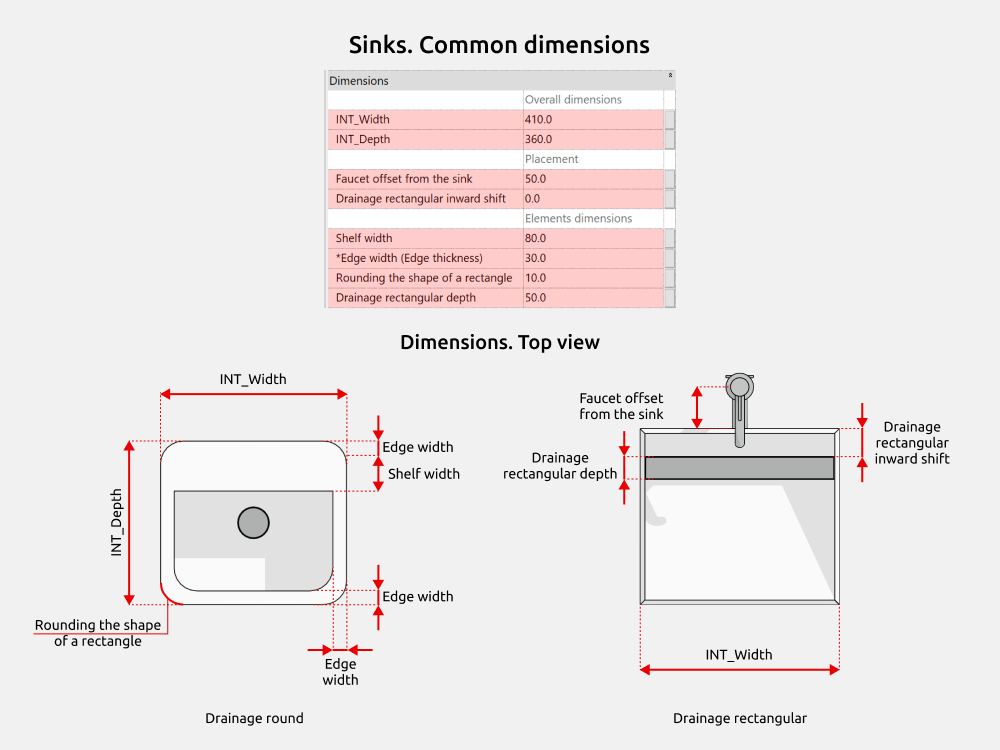

Dimensions are controlled by parameters "INT_Width" and "INT_Depth".

Parameter "Faucet offset from the sink" controls the distance from the faucet axis to the sink edge only for options "F_Placement on the plane" and "F_Wall-mounted placement".

***Important**: In the sink family, the parameter "Edge width" is named "Edge thickness".

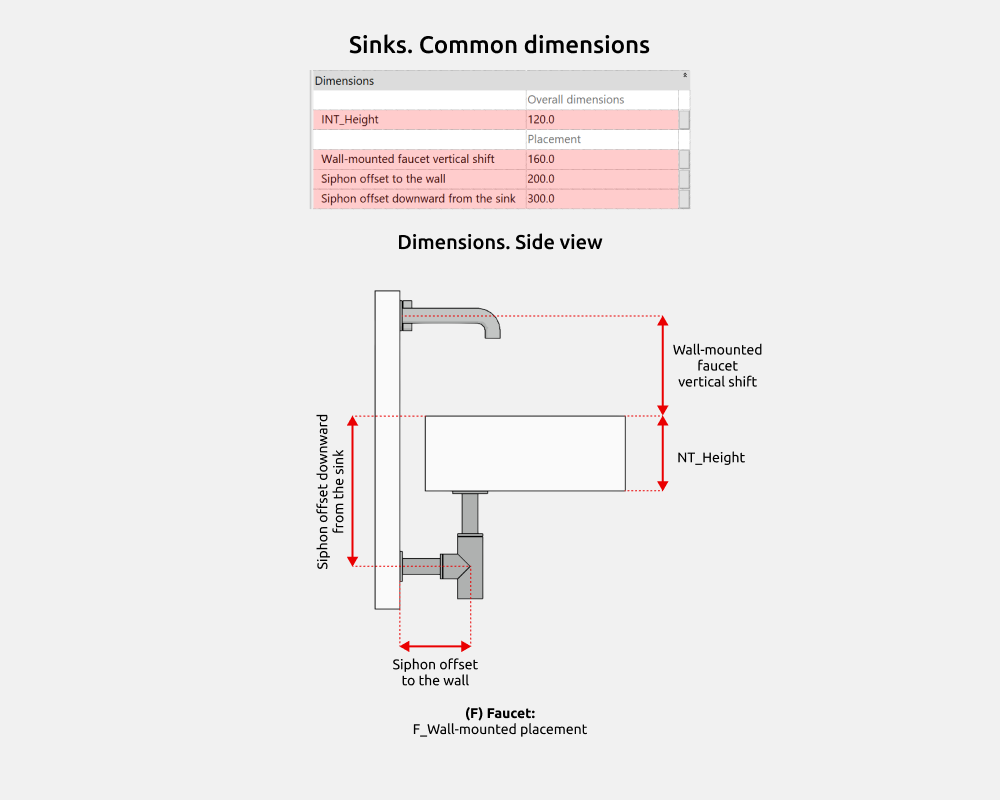

Dimensions are controlled by the parameter "INT_Height".

Parameter "Wall-mounted faucet vertical shift" - distance from sink top to faucet axis (available when "Faucet" parameter is enabled and "F_Wall-mounted placement" option is selected).

Parameter "Siphon offset downward from the sink" - distance from sink top to siphon horizontal axis.

Parameter "Siphon offset to the wall" - distance from wall surface to siphon vertical axis.

Siphon placement parameters are available when "Siphon" parameter is enabled.

##### Pedestal dimensions

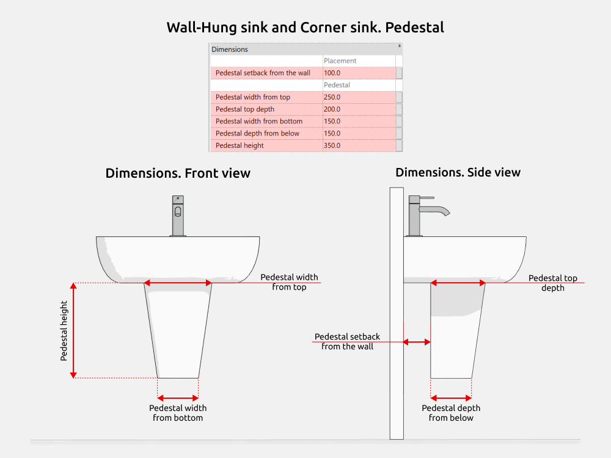

For Wall-hung sink and Corner sink, pedestal dimensions can be changed.

Parameter "Pedestal height" sets the vertical dimension from the top sink connection point to the pedestal base.

Parameter "Pedestal width from top (Pedestal top depth)" sets the width (depth) of the pedestal at the top (sink connection area).

"Pedestal width from bottom (Pedestal depth from below)" sets the width (depth) of the pedestal at the bottom (base).

These parameters create the pedestal's trapezoidal geometry.

#### Built-in sink

Here you can on/off the following elements:

-   Faucet
-   Faucet shelf
-   Siphon

Faucet shelf is available only when "Placement on a countertop" option is enabled

##### Dimensions

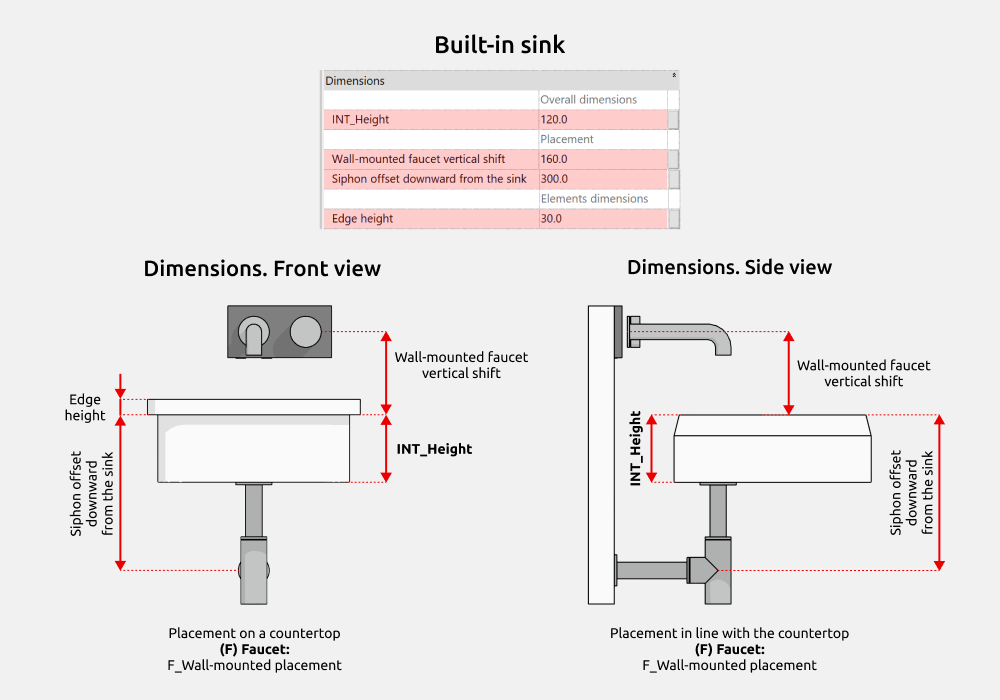

Parameter "INT_Height" controls the main dimension (Edge are not included in the main dimension).

Parameter "Edge height" is available only when "Placement on a countertop" option is enabled.

**Important:** Parameter "Siphon offset downward from the sink" is always measured from the main sink dimension without "Edge height".

For more details on built-in sink dimension parameters, see "Common elements" section, Dimensions subsection.

##### Options

Placement options:

-   Placement under the countertop
-   Placement on a countertop
-   Placement in line with the countertop

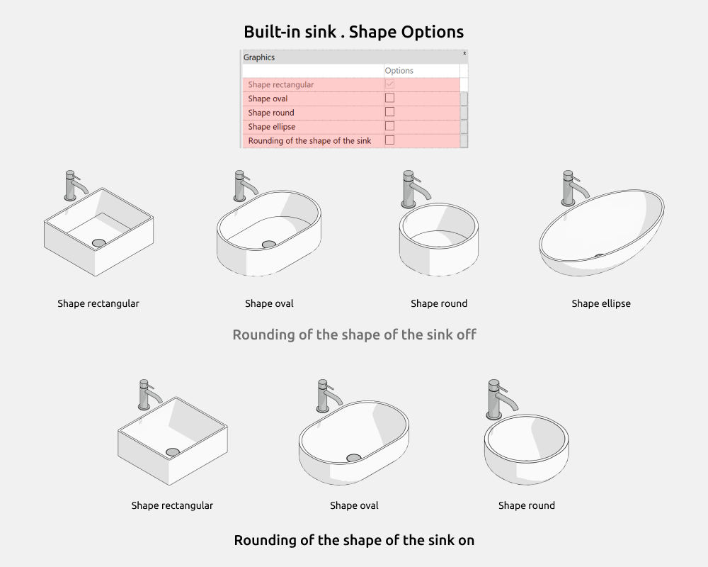

Sink shape options:

-   Shape rectangular
-   Shape oval
-   Shape round
-   Shape ellipse

Sink shape rounding can be set for all shapes except "Shape ellipse".

See other options in section “Common elements”.

#### Sink

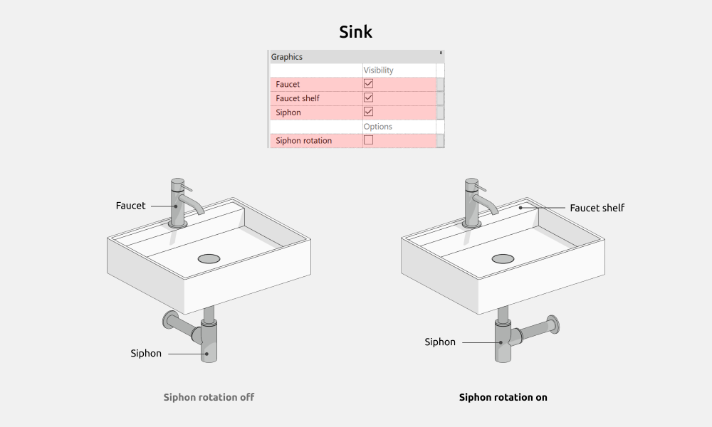

Here you can on/off the following elements:

-   Faucet
-   Faucet shelf
-   Siphon
-   Siphon rotation

See other options in section “Common elements”.

##### Dimensions

Parameter "Shelf height" is available only when "Faucet shelf" parameter is enabled. It sets the distance from sink bottom to shelf top.

Height placement is done using the "Offset" tool in the Constraints group.

For more details on sink dimension parameters, see "Common elements" section, Dimensions subsection.

##### Options

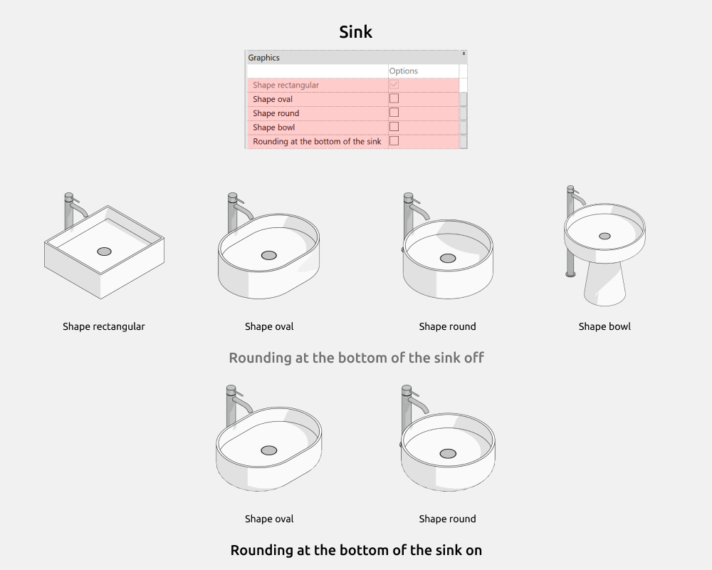

Sink shape options:

-   Shape rectangular
-   Shape oval
-   Shape round
-   Shape bowl

Sink shape rounding can be set for the following sink shapes:

-   Shape oval
-   Shape round

Parameter "INT_Height" allows floor placement of the sink, setting the total height from base to edge top (for floor mounting).

See other options in section “Common elements”.

#### Wall-Hung sink

Here you can on/off the following elements:

-   Faucet
-   Pedestal
-   Siphon

##### Dimensions

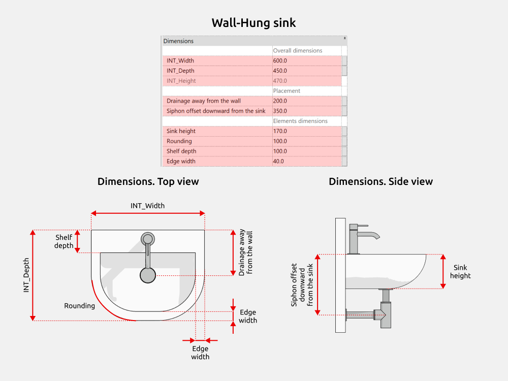

Parameters "INT_Width", "INT_Depth", and "INT_Height" control the overall family dimensions.

There are gray parameters that cannot be controlled. But they are needed to understand size calculations. For example, INT_Height shows the sink height. When pedestal is enabled, it automatically combines pedestal height and sink height itself.

For more details on pedestal dimension parameters, see "Common elements" section, Pedestal dimensions subsection.

#### Corner sink

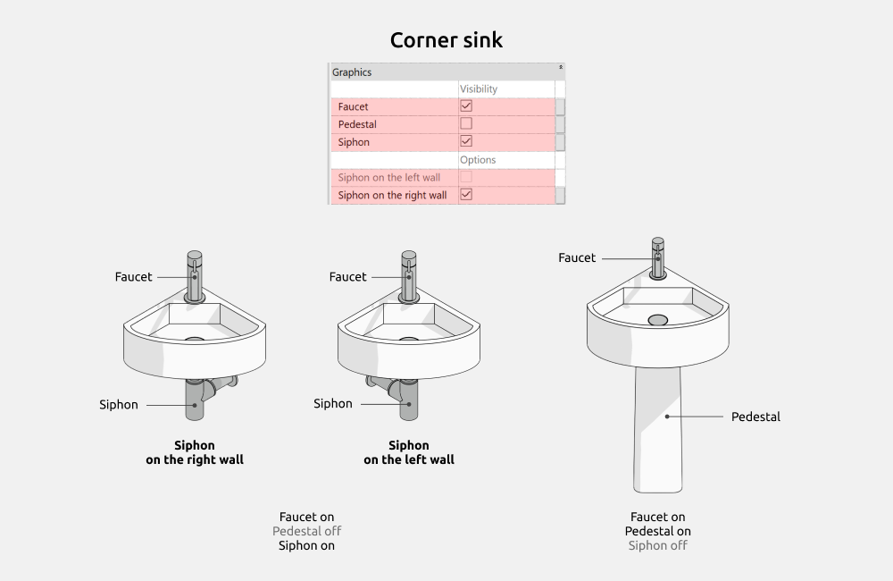

Here you can on/off the following elements:

-   Faucet
-   Pedestal
-   Siphon

Siphon placement options:

-   Siphon on the left wall
-   Siphon on the right wall

##### Dimensions

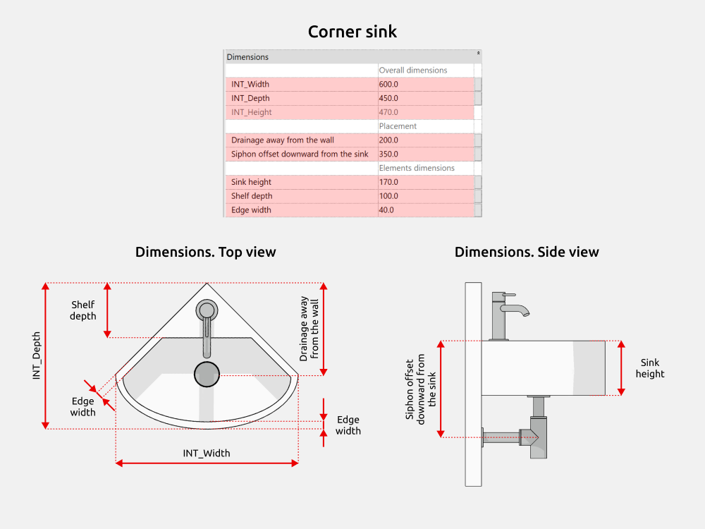

Parameters "INT_Width", "INT_Depth", and "INT_Height" control the overall family dimensions.

There are gray parameters that cannot be controlled. But they are needed to understand size calculations. For example, INT_Height shows the sink height. When pedestal is enabled, it automatically combines pedestal height and sink height itself.

For more details on pedestal dimension parameters, see "Common elements" section, Pedestal dimensions subsection.

#### Base frame for sink

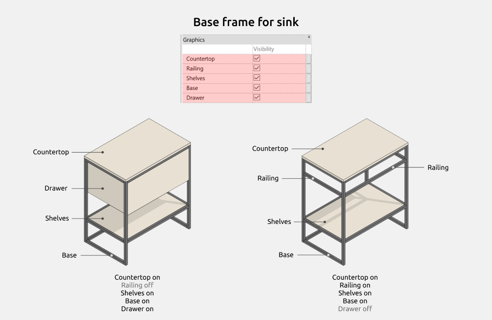

Here you can on/off the following elements:

-   Countertop
-   Railing
-   Shelves
-   Base
-   Drawer

##### Dimensions

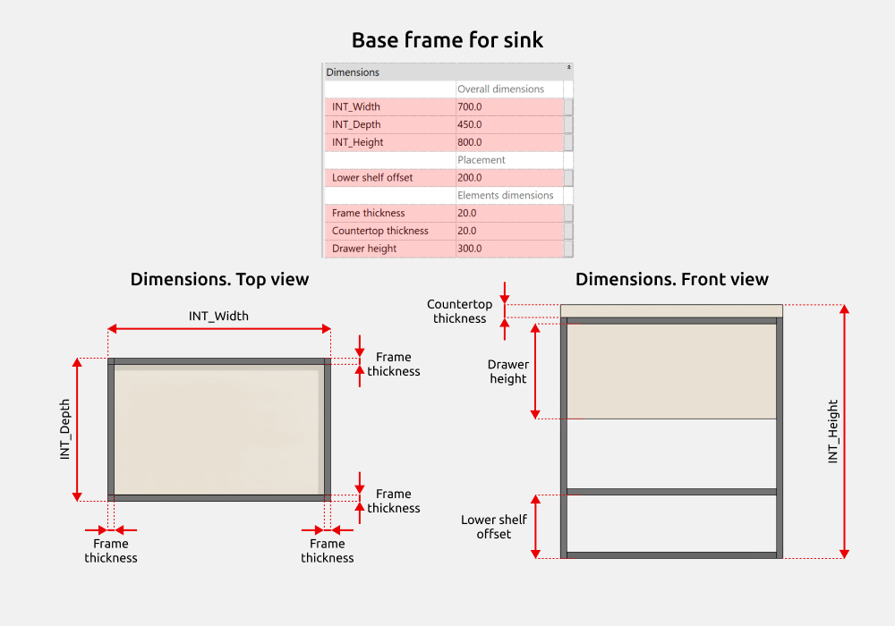

Parameters "INT_Width", "INT_Depth", and "INT_Height" control the overall family dimensions.

Parameter "INT_Height" is a height parameter that includes other element heights when enabled (Countertop thickness, Drawer height, Lower shelf offset).

##### Options

Options:

-   Shelves quantity 2
-   Drawer placement under frame
-   Closed base
-   Side rails

Option "Shelves quantity 2" adds a second shelf (available only when "Shelves" parameter is enabled).

Option "Drawer placement under frame" lowers the drawer to the frame base level (available only when "Drawer" parameter is enabled).

Option "Closed base" adds a horizontal profile at the base along the long side (available only when "Base" parameter is enabled).

Option "Side rails" disables railing between vertical profiles along the frame's long side (available only when "Railing" parameter is enabled).

### Bathroom fixtures and Accessories

#### Bathroom fixture

#### Toilet

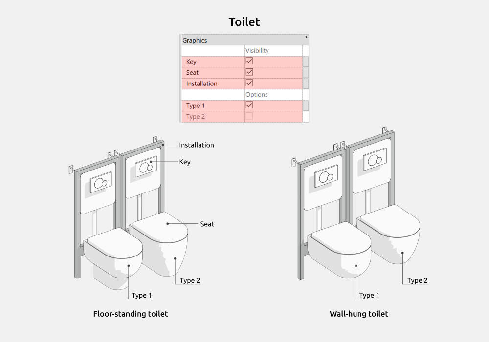

The toilet family has 2 types: Floor-standing toilet and Wall-hung toilet.

Here you can on/off the following elements:

-   Key
-   Seat
-   Installation

You can choose the type:

-   Type 1
-   Type 2

You can select the key type from the toilet family's dropdown menu:

-   Key with two square buttons
-   Key with two round intersecting buttons
-   Key with one round button

##### Dimensions

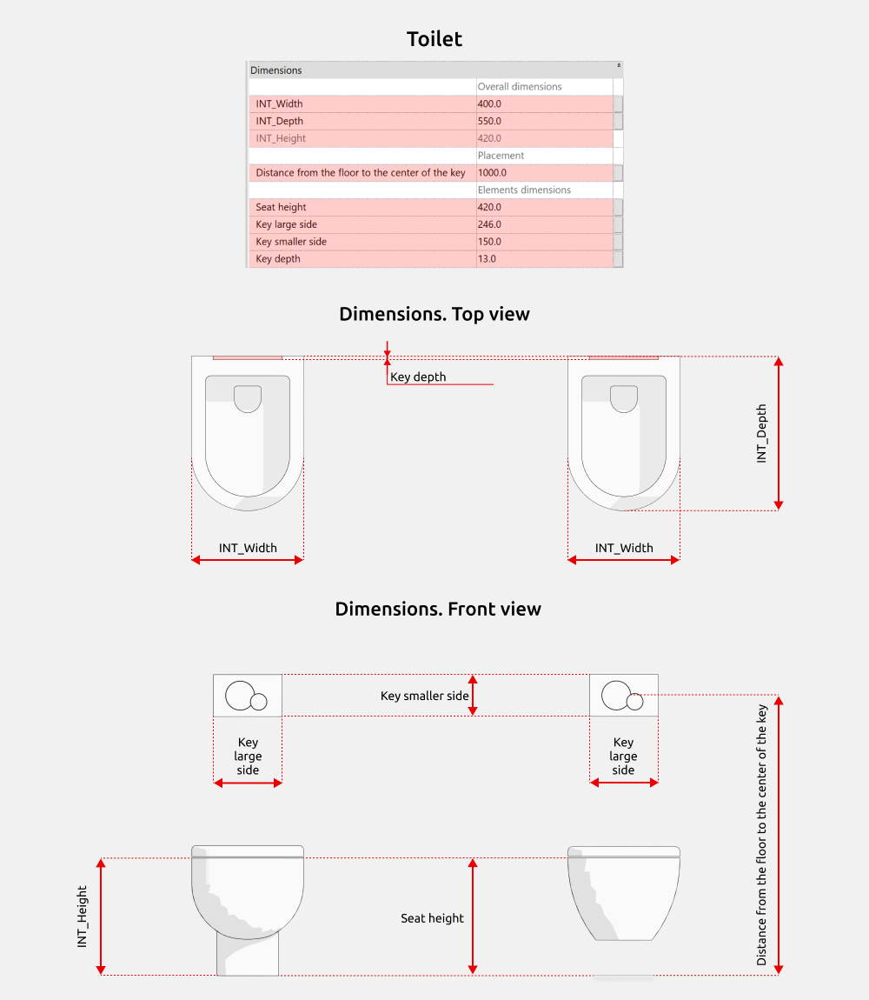

The parameters "INT_Width", "INT_Depth", and "INT_Height" control the toilet's overall dimensions.

There are gray parameters that cannot be controlled. But they are needed to understand the size calculations. For example, *INT_Height* depends on the "Seat height" parameter.

Adjust key sizes using "Key large side", "Key smaller side", and "Key depth".

Change seat height relative to finished floor level using "Seat height".

Control key height with "Distance from the floor to the center of the key".

##### Installation

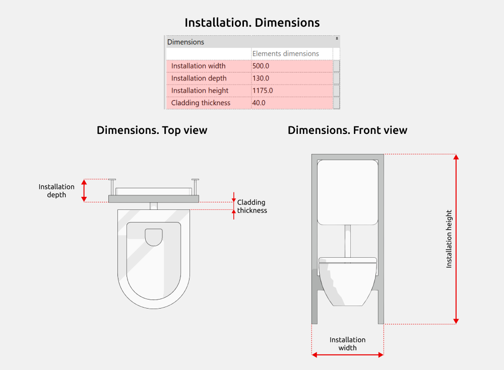

For the Installation, you can adjust dimensions with "Installation width", "Installation depth", and "Installation height".

"Cladding thickness": Distance from carrier to toilet covered by drywall.

##### Materials

You can change materials for the toilet, installation, key, and seat.

#### Floorstanding toilet with barrel

Here you can on/off the following elements:

-   Seat

You can choose the type:

-   Type 1
-   Type 2

##### Dimensions

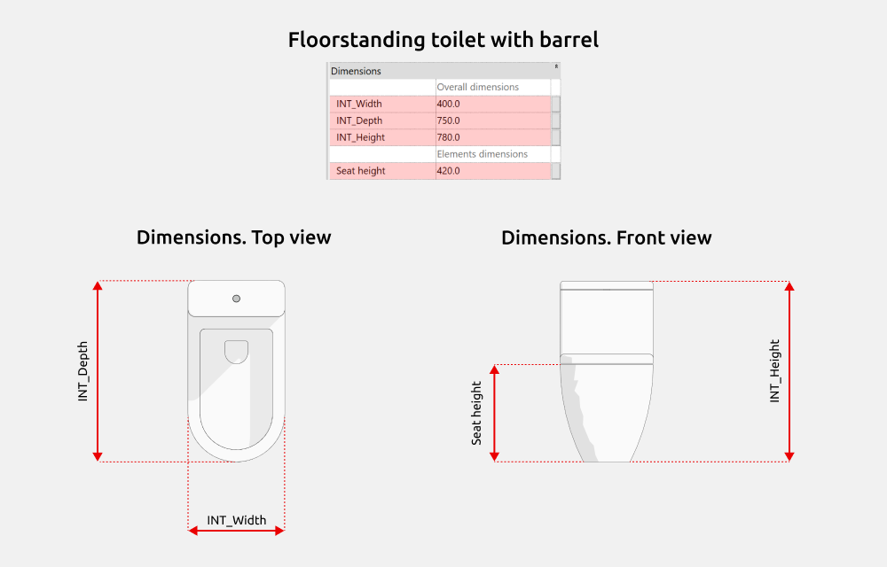

The parameters "INT_Width", "INT_Depth", and "INT_Height" control the toilet dimensions.

You can adjust the seat height relative to the finished floor level using the "Seat height" parameter.

#### Bidet

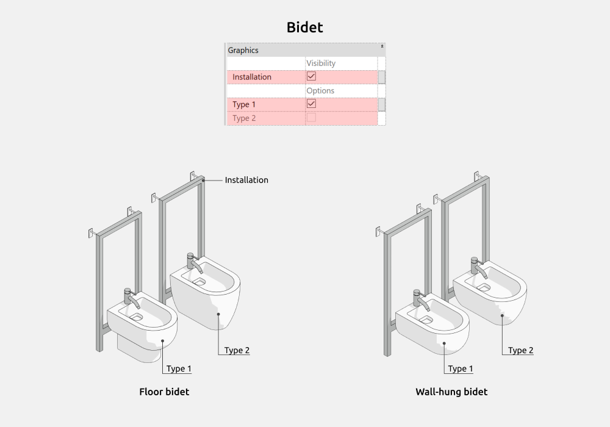

The bidet family has 2 types: Floor bidet and Wall-hung bidet.

Here you can on/off the following elements

-   Installation

You can choose the type:

-   Type 1
-   Type 2

##### Dimensions

The parameters "INT_Width", "INT_Depth", and "INT_Height" control the bidet's overall dimensions.

There are gray parameters that cannot be controlled. But they are needed to understand the size calculations. For example, *INT_Height*. It equals the "Seat height" parameter.

You can adjust the bidet seat height using the "Seat height" parameter.

##### Installation

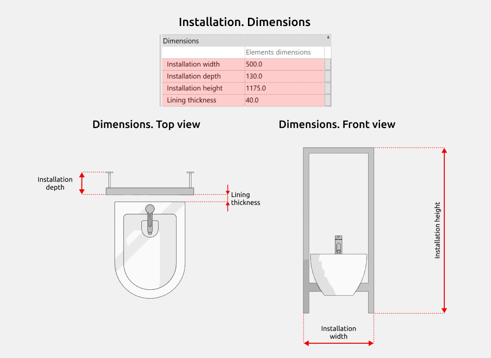

For the Installation, you can adjust dimensions with "Installation width", "Installation depth", and "Installation height".

“Lining thickness”: Distance from bidet to Installation covered by drywall.

#### Urinal

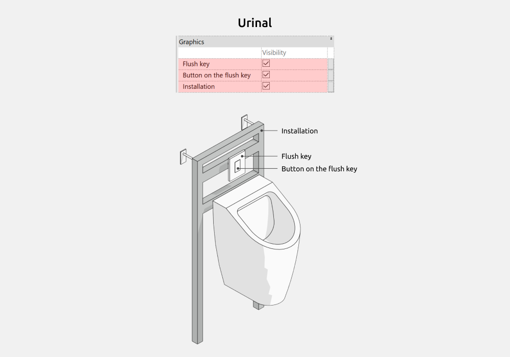

Here you can on/off the following elements:

-   Flush key
-   Button on the flush key
-   Installation

##### Dimensions

The parameters "INT_Width", "INT_Depth", and "INT_Height" control the urinal's overall dimensions.

Adjust flush key size using "Key width", "Key depth", and "Key height". You can also change key height with "Distance from the floor to the center of the key".

The "Urinal depth of straight section" parameter adjusts the distance from the wall to the urinal's drain on the straight section.

The "Distance from floor to top" parameter sets the urinal height above finished floor level.

##### Installation

For the Installation, you can adjust dimensions with "Installation width", "Installation depth", and "Installation height".

“Lining thickness”: Distance from urinal to Installation covered by drywall.

#### Hygienic shower 1 outlet

Added option to toggle Graphic symbol visibility:

-   Graphic symbol CW HW
-   Graphic symbol CW

##### Dimensions

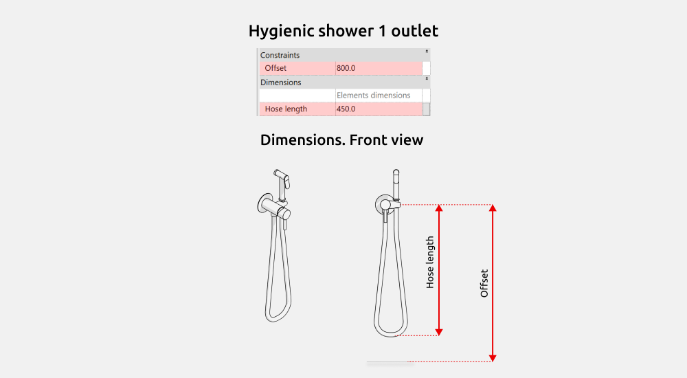

Height placement is done using the "Offset" tool in the Constraints group.

Hose length is adjusted using the "Hose length" parameter.

#### Hygienic shower 2 outlets

For the hygienic shower 2 outlets, you can toggle Graphic symbol visibility on/off.

##### Dimensions

Height placement is done using the "Offset" tool in the Constraints group.

Hose length is adjusted using the "Length hose" parameter.

You can modify the Distance between CW and HW pipes.

#### Accessories

#### Mirror

Here you can on/off the following elements:

-   Frame
-   Backlighting on the mirror
-   Backlighting behind the mirror

##### Dimensions

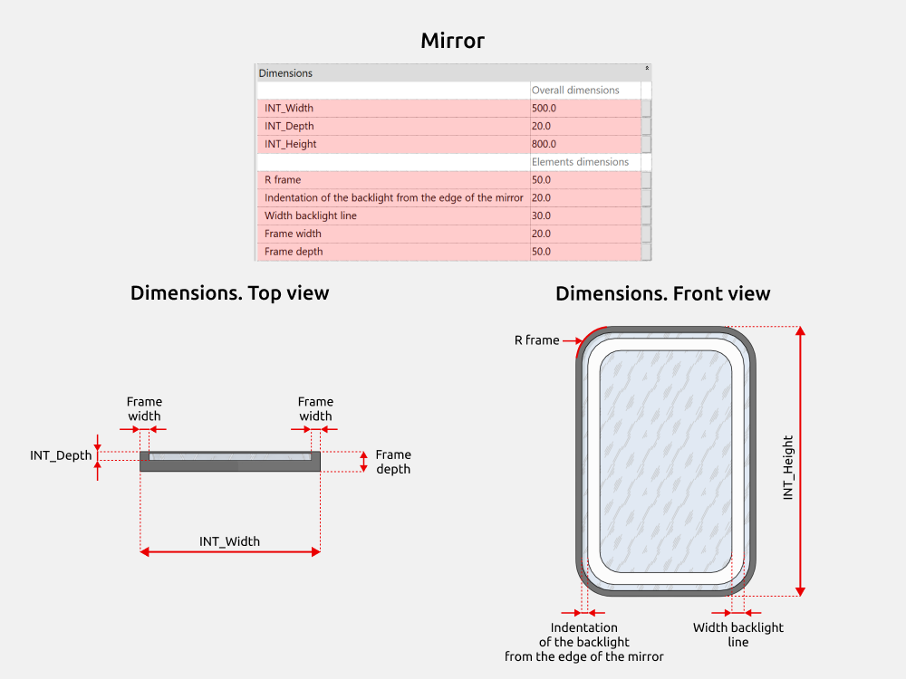

Adjust dimensions using "INT_Width", "INT_Depth", and "INT_Height".

Modify element sizes: "R frame" for the rectangular beveled mirror, "Indentation of the backlight from the edge of the mirror", "Width backlight line", "Frame width", and "Frame depth".

Position and adjust mirror height using the Offset tool.

##### Options

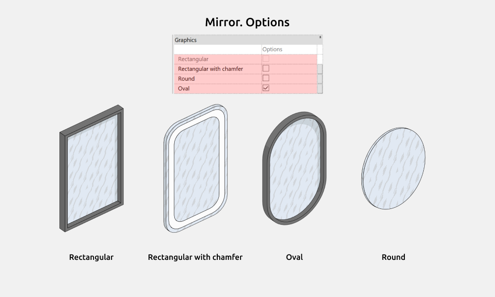

You can change the mirror shape:

-   Rectangular
-   Rectangular with chamfer
-   Rоund
-   Oval

#### Towel holder

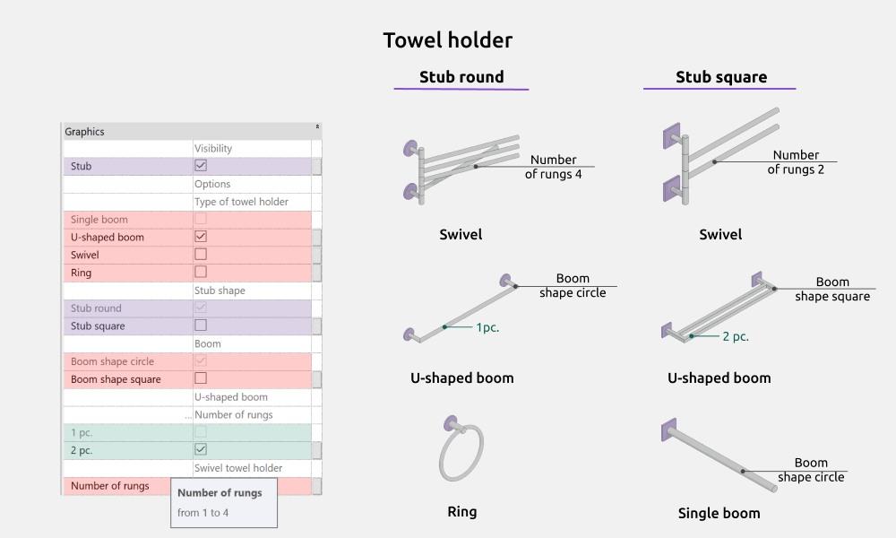

For all towel holders, you can toggle the stub on/off and change its shape:

-   Stub round
-   Stub square

You can select the towel holder type:

-   Single boom
-   U-shaped boom
-   Swivel
-   Ring

For Single boom and U-shaped boom towel holders, you can change the boom shape:

-   Boom shape circle
-   Boom shape square

For U-shaped boom, you can select Number of rungs:

-   1 pc.
-   2 pc.

For the Swivel towel holder, you can select the Number of rungs from 1 to 4 using the "Number of rungs" parameter.

##### Dimensions

Only for the Swivel towel holder can the following parameters be adjusted:

-   Angle of rotation 1: Angle of rotation for the bottom first boom.
-   Angle of rotation 2: Angle of rotation for subsequent boom.
-   Swivel height: Distance between stub mountings.

Only for the ring-shaped towel holder can the following be adjusted:

-   Ring diameter

For all towel holders, the following parameters can be adjusted:

-   Boom width
-   Boom depth
-   Boom thickness

For all towel holders with stubs enabled, the following can be adjusted:

-   Stub width
-   Stub thickness

#### Towel hooks

For hooks, you can toggle the stub on/off and select its shape:

-   Stub rectangular
-   Stub oval
-   Stub round

The number of hooks on a single base can be selected using the "Number of hooks" parameter.

The hook shape can also be specified:

-   1.Button
-   2.L-shaped
-   3.L-shaped double
-   4.Slanted
-   5.Cylinder
-   6.Square

##### Dimensions

The following parameters can be adjusted in the family:

-   Shift from the edge of the stub
-   Hooks depth
-   Stub width
-   Stub height
-   Stub thickness

#### Floor stand for paper and toilet brush, Toilet brush and Paper holder

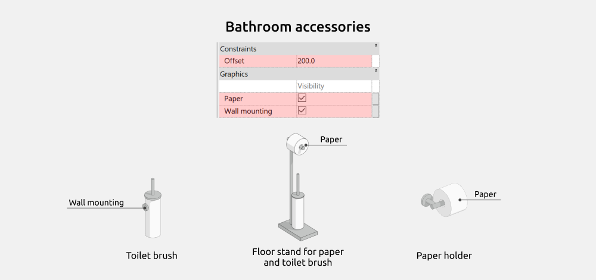

The toilet  brush family can be placed on the wall or floor.

For the toilet brush and paper families, placement and height adjustment are set using the Offset tool.

#### Bathroom Shelves

You can select the shelf family type.

The corner shelf family includes options to toggle the edge on/off and adjust the number of shelves.

##### Dimensions

Shelves are positioned and adjusted in height using the Offset tool.

For shelf family:

Adjust dimensions: "INT_Width", "INT_Depth", "INT_Height".

Modify shelf thickness.

For corner shelf family:

Adjust dimension: "INT_Width".

Modify element sizes: shelf height, edge height, and edge thickness.

### Faucets

#### Faucet

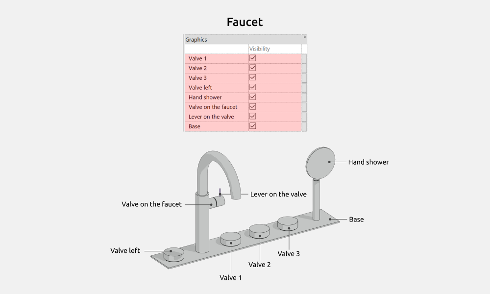

Here you can on/off the following elements:

-   Valve 1
-   Valve 2
-   Valve 3
-   Valve left
-   Hand shower
-   Valve on the faucet
-   Lever on the valve
-   Base

##### Combination Variants

Graphics group parameters let you flexibly control the faucet's composition and appearance by toggling individual family elements on/off.

Combine visibility parameters to create different faucet types within one family.

For the first combination, the following visibility parameters are enabled:

-   Valve 1
-   Valve left
-   Hand shower
-   Base

For the second combination, the following visibility parameters are enabled:

-   Valve on the faucet
-   Lever on the valve
-   Base

##### Dimensions

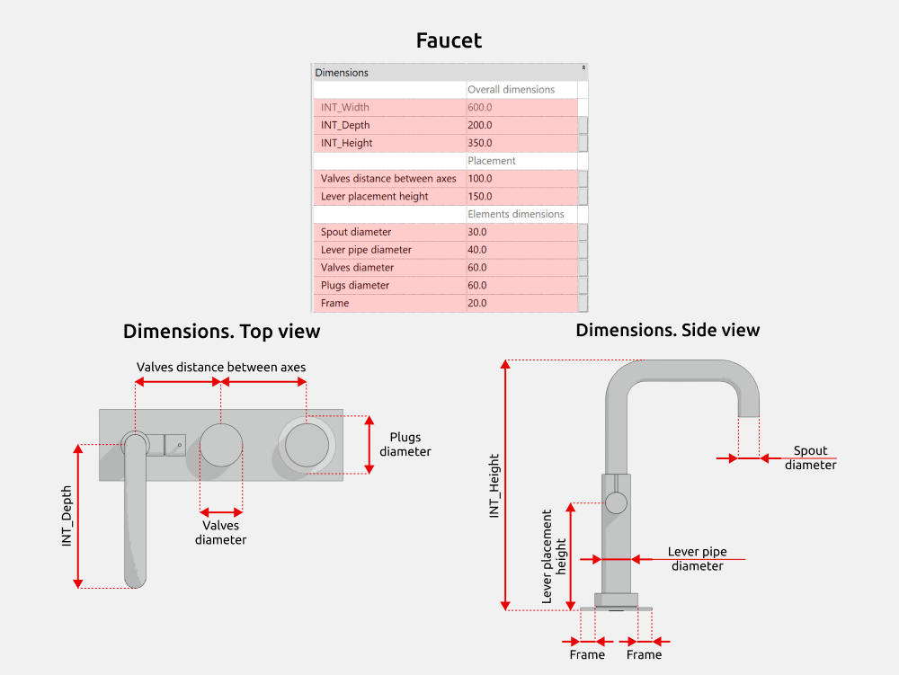

The parameters "INT_Width", "INT_Depth", and "INT_Height" control the faucet's overall dimensions.

There are gray parameters that cannot be controlled. But they are needed to understand the size calculations. For example, *INT_Width*. The parameter shows the faucet width, as it is calculated by a formula based on the number of valves, presence of the hand shower, and the distance between axes.

##### Options

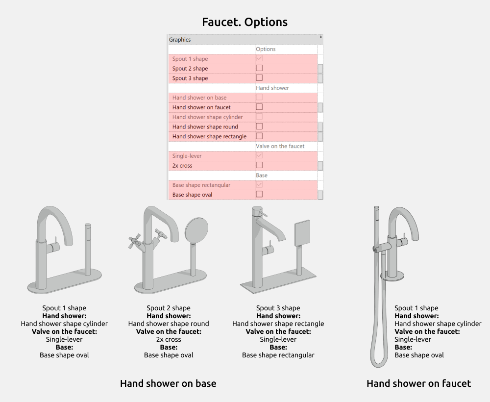

Spout, hand shower, base valve, and base options are available in the faucet family.

Spout shape options:

-   Spout 1 shape
-   Spout 2 shape
-   Spout 3 shape

When the "Hand shower" parameter is enabled, the following options are available:

Hand shower placement options:

-   Hand shower on base
-   Hand shower on faucet

Hand shower shape options:

-   Hand shower shape cylinder
-   Hand shower shape round
-   Hand shower shape rectangle

When the "Valve on the faucet" parameter is enabled, the following faucet body shape options are available:

-   Single-lever
-   2x cross

When the "Base" parameter is enabled, the following base shape options are available:

-   Base shape rectangular
-   Base shape oval

#### Wall-mounted faucet

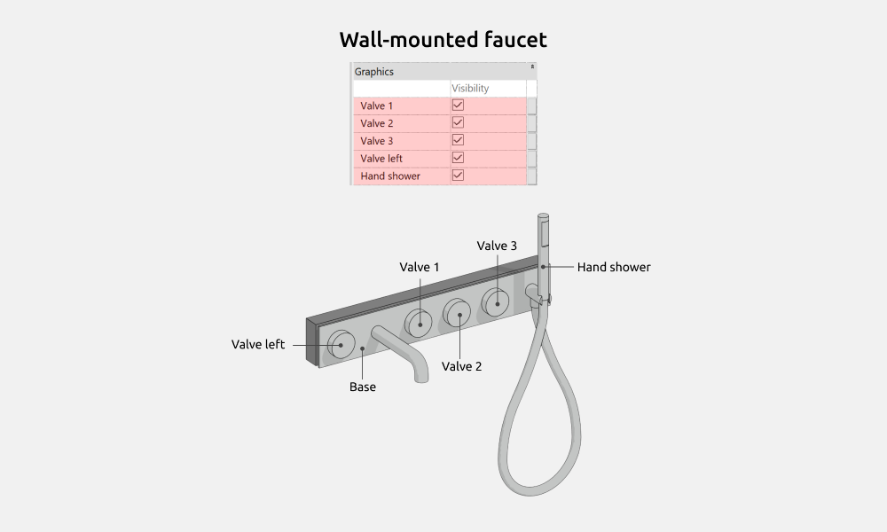

Here you can on/off the following elements:

-   Valve 1
-   Valve 2
-   Valve 3
-   Valve left
-   Hand shower
-   Base

##### Dimensions

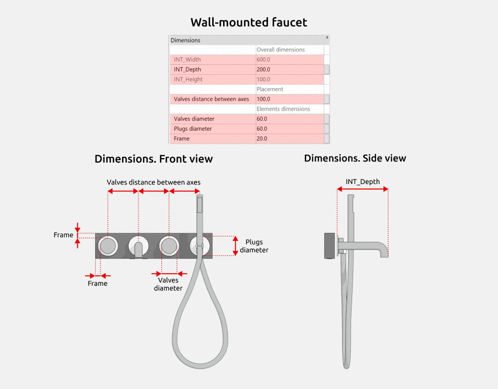

The parameters "INT_Width", "INT_Depth", and "INT_Height" control the faucet's overall dimensions.

There are gray parameters that cannot be controlled. But they are needed to understand the size calculations. For example, *INT_Width*. The parameter shows the faucet width, as it is calculated by a formula based on the number of valves, presence of the hand shower, and the distance between axes.

##### Options

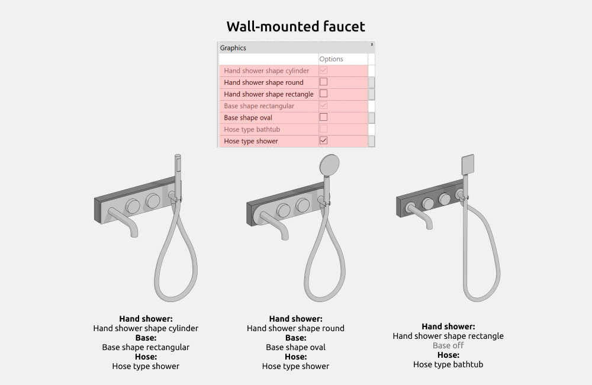

In the faucet family, options are available for the hand shower, hose type, and base.

When the "Hand shower" parameter is enabled, the following are available:

Hand shower shape selection:

-   Hand shower shape cylinder
-   Hand shower shape round
-   Hand shower shape rectangle

Hose type:

-   Hose type bathtub
-   Hose type shower

When the "Base" parameter is enabled, the following faucet body shape options are available:

-   Base shape rectangular
-   Base shape oval

#### Faucet classic

Faucet type options:

-   1 type on edge
-   2 type floor standing
-   3 type wall-mounted

##### Dimensions

The "Height of placement" parameter is available only for faucets when the "2 type floor standing" parameter is enabled. For "1 type on edge" and "3 type wall-mounted" faucets, height can be adjusted using the "Offset" tool in the Revit project.

The "Distance between axes" parameter sets the distance between valve axes and works for all faucet types.

## 4. GRAPHICS

### Graphics settings

To change the color, weight, or line type of family elements, go to Manage > Object Styles > Categories:

-   Entourage
-   Furniture
-   Generic Models
-   Mechanical Equipment
-   Plumbing Fixtures

<CTA type="guide" />
