## 1. GENERAL INFORMATION

- Set name: Bathroom Furniture
- Set version: 1.1.0
- Revit version: 2019

### Description

This set of Revit families is intended for modeling bathroom furniture in Autodesk Revit.
Using these families, you can create vanity units with or without sinks, wall-mounted cabinets with mirrors, tall cabinets, shelving units, and other configurations with precise dimensions.

The set is suitable for interior designers and architects. For furniture manufacturers, the families are not sufficiently detailed for production modeling.

### Loading and Placement

To view and load the required families from the set, you can open the *Project with bathroom furniture* and copy the families using the **Ctrl+C** keyboard shortcut, then paste them into your project using **Ctrl+V**.

Alternatively, you can open the folder containing the family files and drag them into the project using the mouse.

## 2. SET CONTENTS

The set includes the following families:

- Linen tower
- Open linen tower
- Louvered Door
- Mirror cabinet
- Bathroom vanity
- Shelving unit
- Laundry hamper

## 3. FAMILIES

### Bathroom vanity

**The bathroom** **vanity** family is used to create vanity units of various configurations.

The following elements can be enabled or disabled:

- Countertop
- Faucet
- Sink
- Doors
- False drawer front
- Handles
- Siphon
- Carcass back
- Legs
- Opening
- Graphic symbols

#### Dimensions

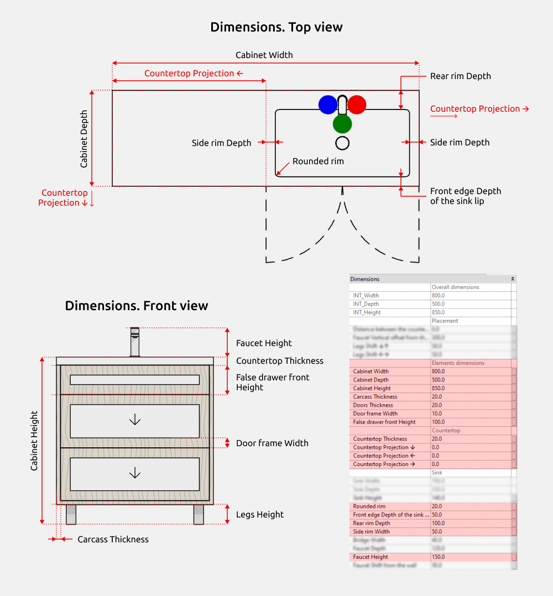

**Vanity Height** is an overall height parameter that includes additional element heights if they are enabled (Leg height, Rail height, Countertop thickness).

Parameters starting with **INT** are shared parameters and can be used in schedules if required.

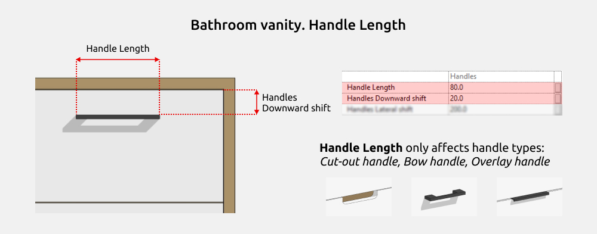

Handles of the **Cut-out**, **Bow handle**, and **Overlay handle** types allow width adjustment.

Cut-out and overlay handles are always centered along the top edge of the front panel.

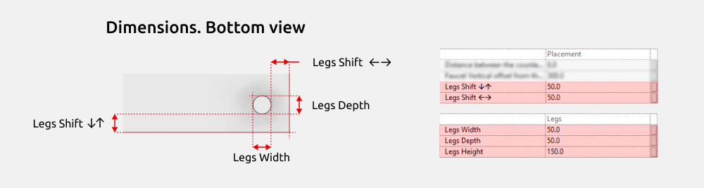

The **Side Leg Offset** and **Front/Back Leg Offset** parameters control the movement of the legs toward the center of the vanity unit.

#### Doors

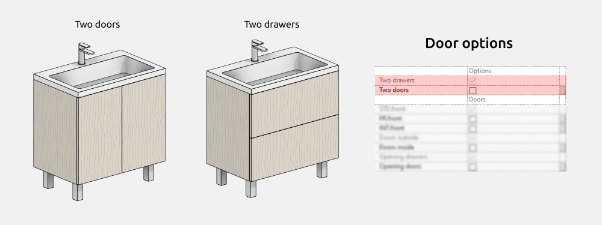

The vanity unit can have two front panel layouts: either two doors or two drawers.

In the front panel type dropdown list:

- STD.front (flat front panel)
- FR.front (front panel with an external frame)
- INT.front (with integrated handle)

All door types can be either inset or overlay.

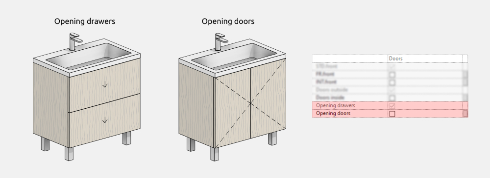

When *Opening* visibility is enabled, the opening type must be selected according to the door layout.

#### Handles

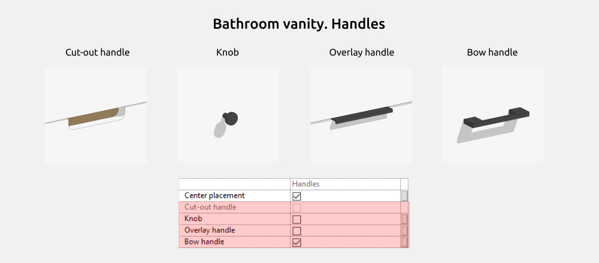

In this section, you can select the handle shape:

- Knob
- Cut-out
- Bow handle
- Overlay handle

If the **Centered Placement** parameter is disabled, the handles move to the top edge of the front panel.

In this case, the **Dimensions** section allows adjustment of the distance from the top edge.

#### Legs

The vanity unit has two leg types: **Rectangle** and **Cylinder**. You can disable all legs or only the rear legs.

#### Materials

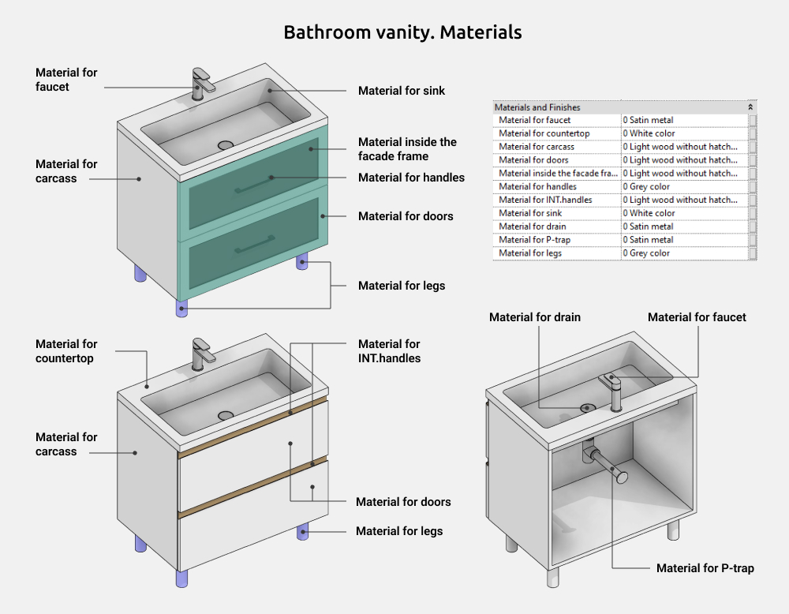

#### Graphics Settings

To change the color, line weight, line type, or to disable the display of opening lines in the family, go to: Manage → Object Styles → Furniture / Plumbing Fixtures

### Mirror Cabinet

The **Mirror Cabinet** family is used to create wall-mounted cabinets of various configurations.

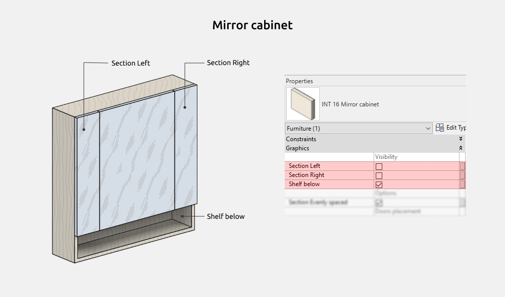

The following elements can be enabled or disabled:

- Section Left
- Section Right
- Shelf below

#### Dimensions

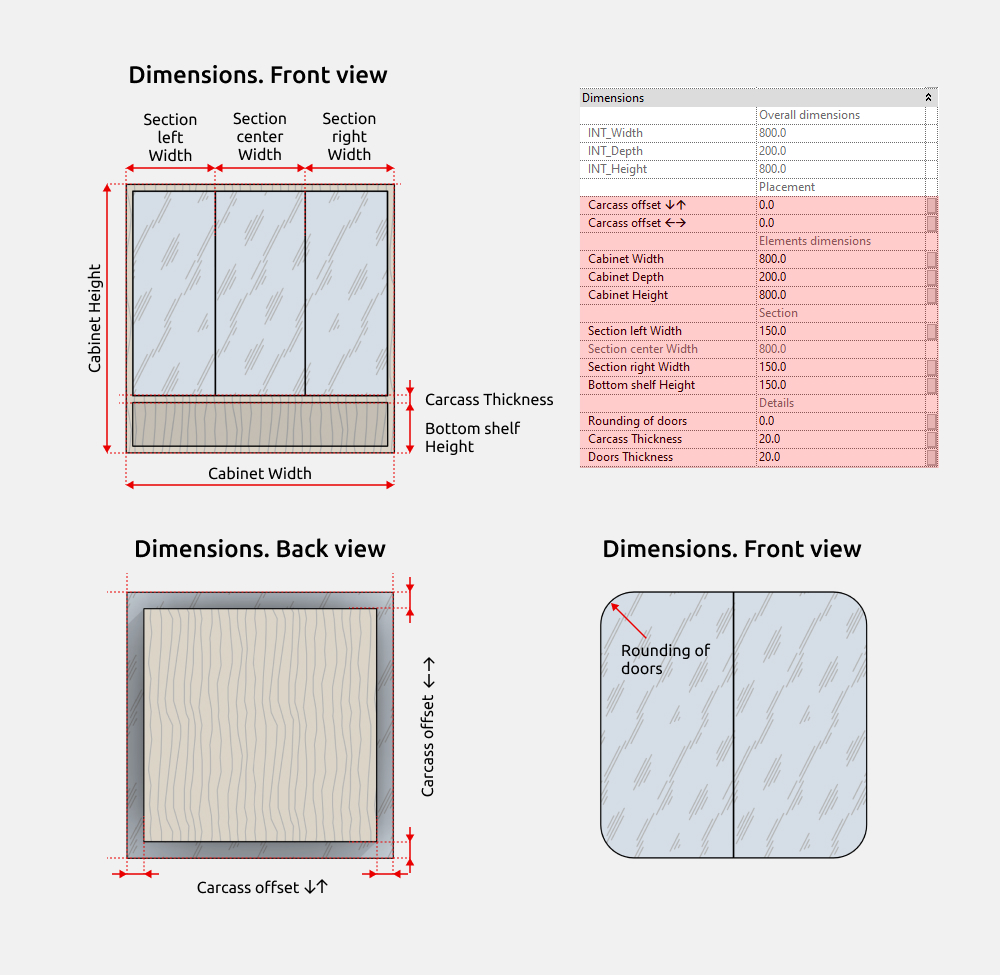

Parameters starting with **INT** are shared and can be used in schedules if required.

#### Section options

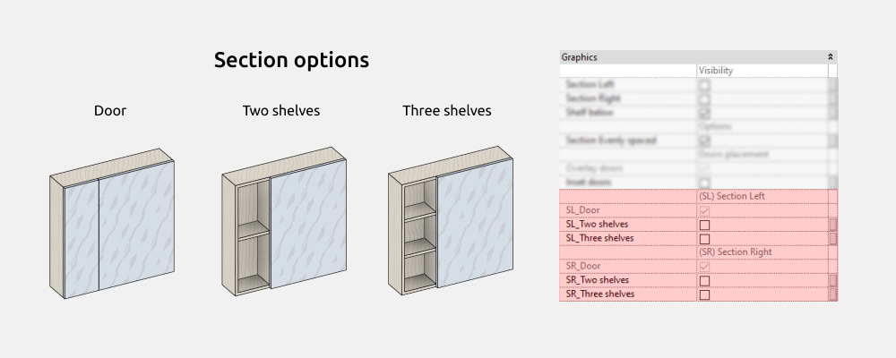For mirror cabinets, the number of sections can be configured. Sections can be identical or configured individually. The width of each section is configured individually. Side sections can have a front panel, 2 or 3 shelves. Sections are configured independently of each other.

In the central section, the mirror can be placed in three ways: on the carcass (as a door), inside the carcass (forming a shelf), without the carcass (mirror mounted on the wall, with one or two side sections).

#### Materials

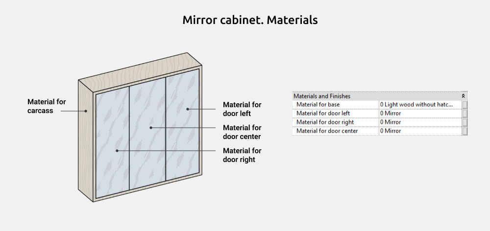

### Linen tower

The **Linen tower** family is used to create narrow cabinets of various configurations.

The following elements can be enabled or disabled:

- Doors
- Handles
- Legs
- Opening

#### Dimensions

Parameters starting with **INT** are shared and can be used in schedules if required.

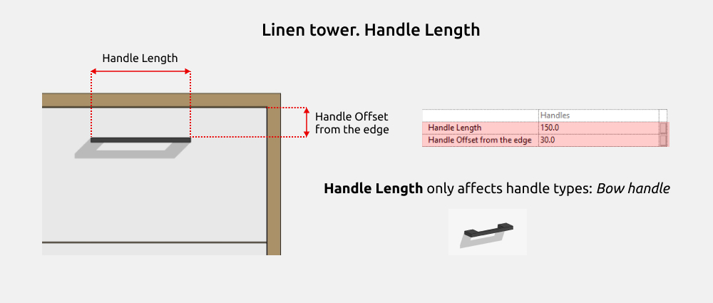

Handles of the **Bow** type allow width adjustment.

The **Side Leg Offset** and **Forward-backward shift Legs** parameters control the movement of the legs toward the center of the cabinet.

#### Doors

The linen tower can have from 1 to 3 modules. Modules can be identical or configured individually. The height of each module is configured individually, except for Module 3. Module 3 height is calculated by subtracting the total height of Modules 1 and 2 from the overall linen tower height.

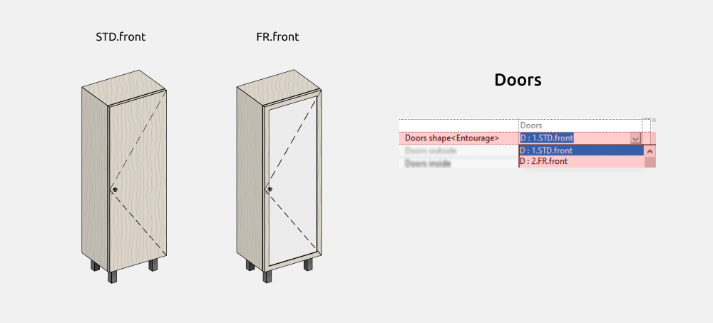

In the linen tower type dropdown list:

- STD.front (flat front panel)
- FR.front (front panel with an external frame)

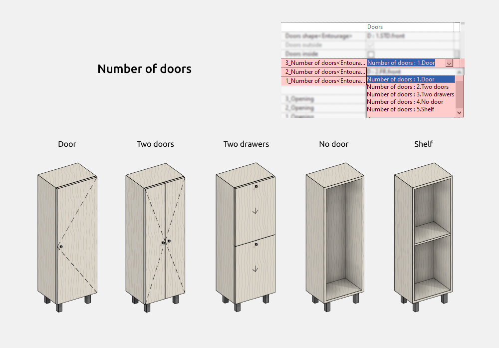

Each module in the cabinet is configured independently.

The opening type for each module’s doors is configured individually.

Opening types:

1 - Left-hinged

2 - Drawer

3 - Right-hinged

4 - Drop-down

#### Handles

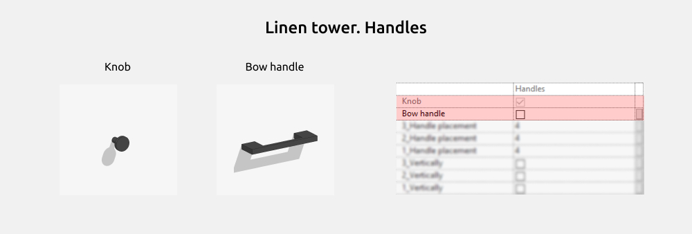

This family includes two handle types: **Knob** and **Bow**. Bow handles can switch between vertical and horizontal orientation.

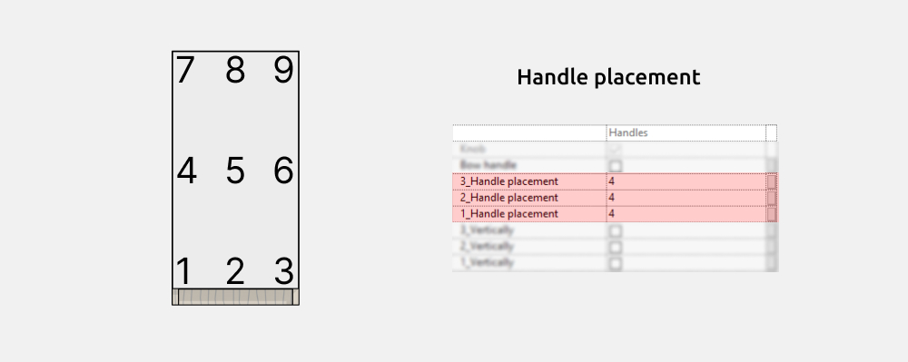

For each door, handle placement and orientation are configured individually when using pull handles.

#### Legs

In the leg shape dropdown list:

- Rectangle
- Cylinder
- Plinth
- Base to the floor

#### Materials

#### Graphics Settings

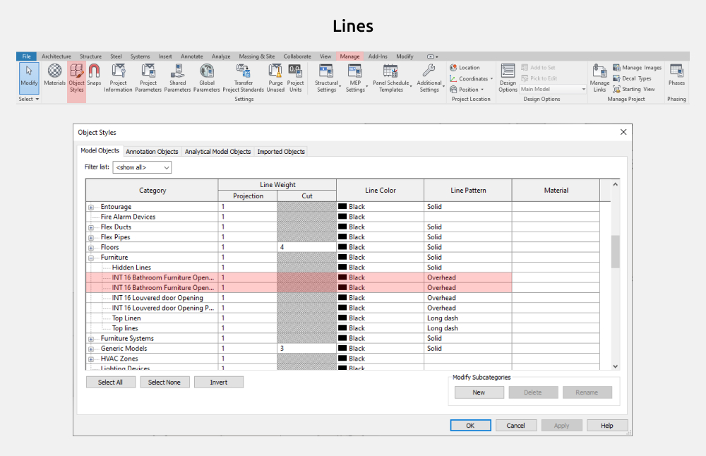

To change the color, line weight, line type, or to disable the display of opening lines in the family, go to: Manage → Object Styles → Furniture

### Louvered door

The **Louvered Door** family is used to create both standalone doors and cabinet front panels.

The following elements can be enabled or disabled:

- Mid rail 2
- Mid rail 1
- Handle
- Opening

#### Dimensions

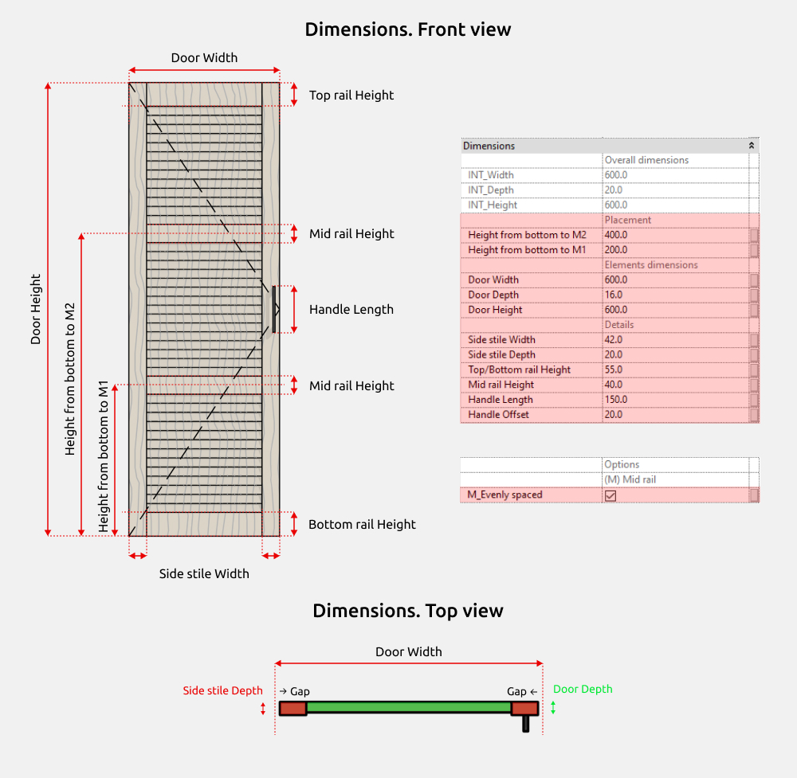

Parameters starting with **INT** are shared and can be used in schedules if required.

#### Handles

Handle placement can be configured for the door.

#### Graphics Settings

To change the color, line weight, line type, or to disable the display of opening lines in the family, go to: Manage → Object Styles → Furniture

<CTA type="guide" />
