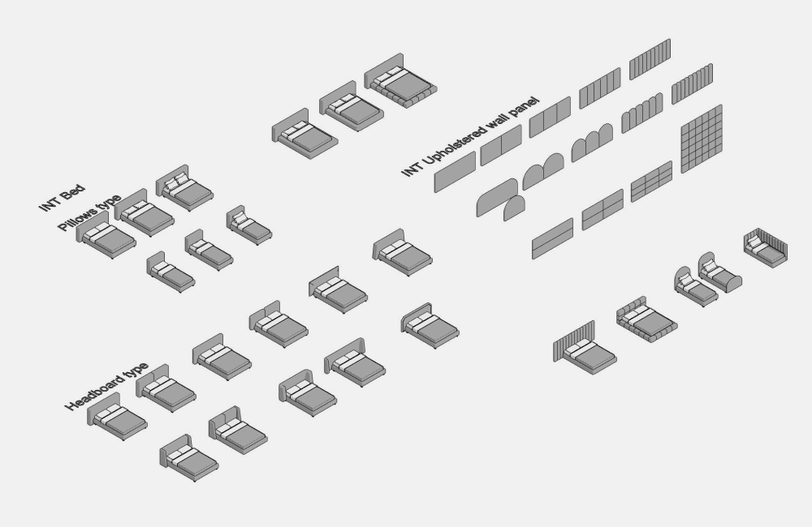
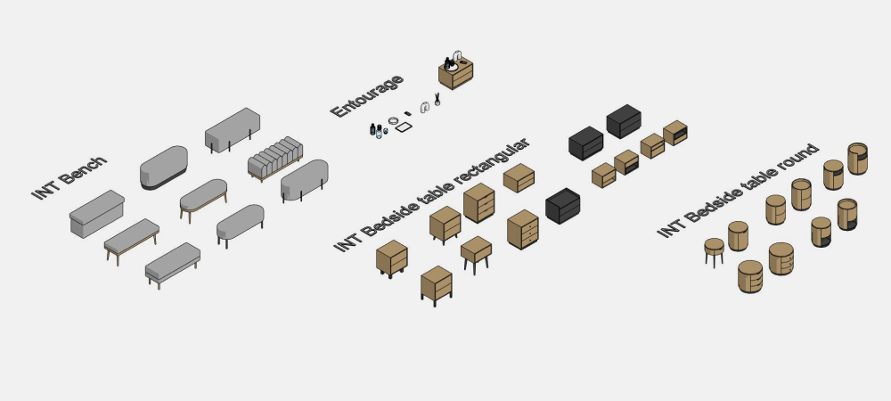
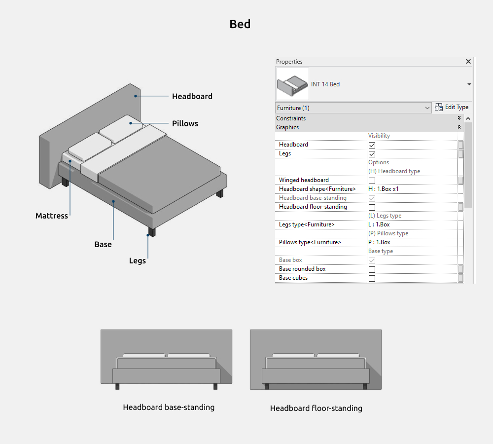
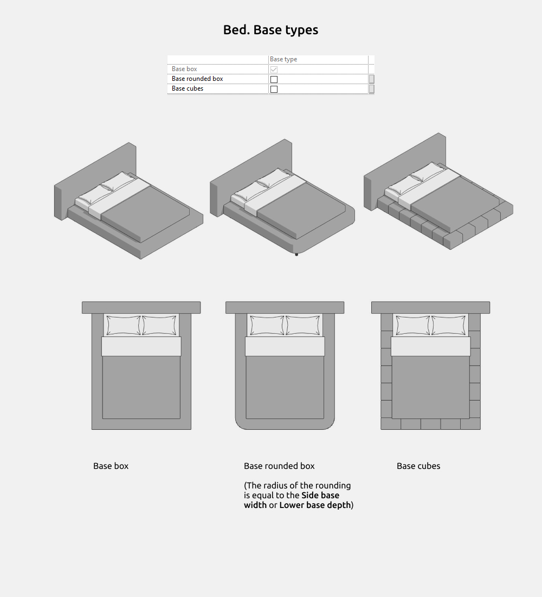
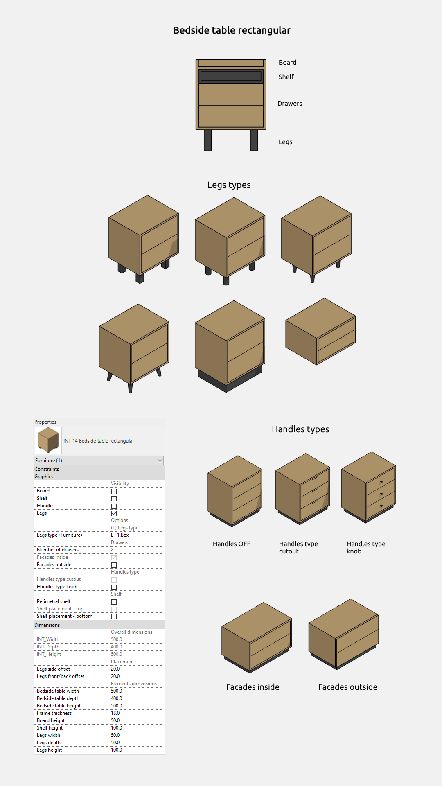
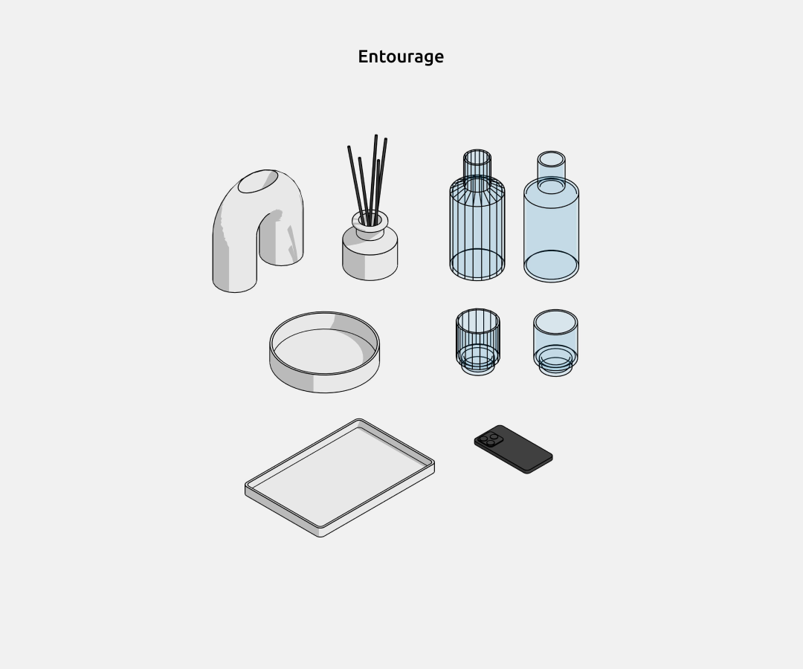

## 1. GENERAL INFORMATION

-   Set name: Beds
-   Version 1.0.0
-   Revit version: 2019

### Description

This set of Revit families is made for modeling beds, bedside tables, benches and upholstered wall panels in Autodesk Revit.

Using families, you can design bedroom in the interior. Suitable for interior designers and architects. The geometry of beds is made by the tools of Revit.

### Loading and placing into the project

In order to view and download the families from the set, you can open **Project with beds** and copy the families using the Ctrl+C key combination, and then paste them into your project Ctrl+V.

Or open the folder with family files and drag it into the project with the mouse.

## 2. SET STRUCTURE

The set includes the following families (category Furniture):

-   Bed
-   Upholstered wall panel
-   Bench
-   Bedside table rectangular
-   Bedside table round

Category Entourage:

-   Decanter
-   Diffuser
-   Glass
-   Phone
-   Tray
-   Vase arch-form

## 3. FAMILIES

### Bed

In the family Bed you can on/off the following elements:

-   Headboard
-   Legs

Headboard options: Headboard base-standing and Headboard floor-standing.

**Dimensions**

Gray parameters (which cannot be controlled) are needed to understand the dimensions. For example, *Headboard width* - you cannot set this width, as control is done through *Headboard side offset*.

But if you need to know the full *Headboard width*, that's what the gray parameter is for.

Or, *Wings real depth* = 490 mm, while *Wings depth* = 100 mm, so to increase the Wings depth, you need to increase the Wings depth parameter beyond 490 mm.

Overall dimensions are also gray because they can be composed of multiple parameters. To change the width and depth, adjust the mattress dimensions.

Winged headboard (ON with any headboard. For example, the Box x1 headboard is ON here)

Winged box(This is one of the headboard shapes.

Wings width doesn't work, as the width depends on the Headboard depth.)

Base types:

-   Box
-   Rounded box (The radius of the rounding is equal to the Side base width or Lower base depth)
-   Cubes

Pillows types:

-   Box
-   Knife edge
-   Knife edge х4

Headboard types:

-   Box х1
-   Box х2
-   Rounded box х1
-   Rounded box х2
-   Seamed box
-   Trapezoidal
-   Classic
-   Winged box

### Upholstered wall panel

The wall panel family can be used as a headboard or as wall decor.

Rounding on top does not work with Vertical amount more then 1.

The Rounding size parameter can only be adjusted if the Rounding on top checkbox is enabled.

### Bench

Bench types:

-   Box
-   Oval
-   Wavy box

Legs types:

-   Cylinder
-   Cone
-   Inclined cone
-   Classic
-   Platform
-   Metal frame

Legs type classic - Legs height from 250mm and more.

Legs type platform - Legs offset under the bench is fixed.

Legs type metal frame - Legs width does not change.

### Bedside table rectangular

### Bedside table round

### Entourage

This group of families is made in the Entourage category and can be used for interior decoration.

<CTA type="guide" />
