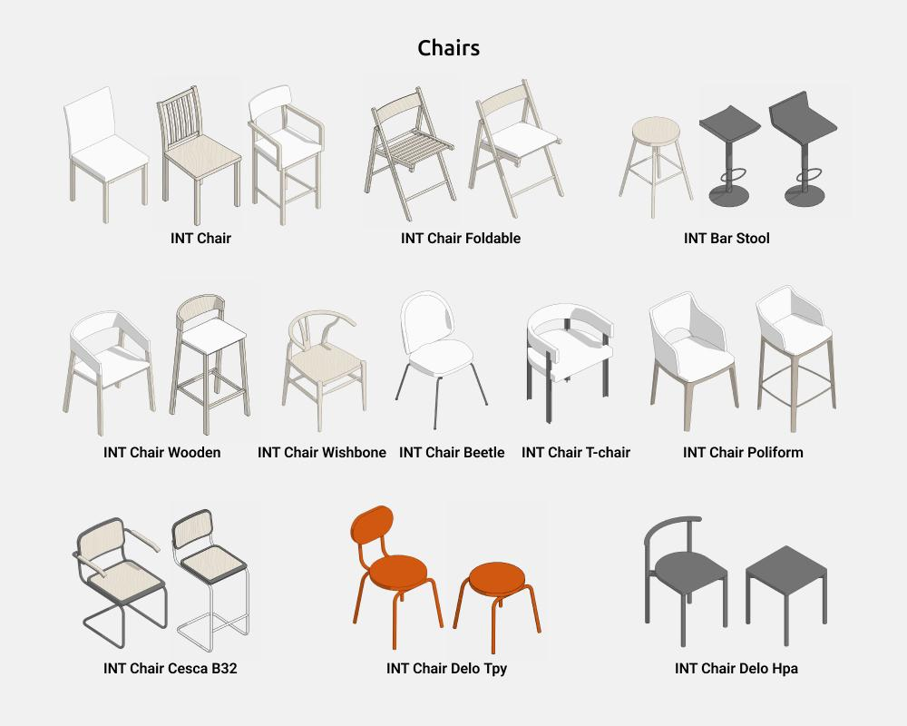
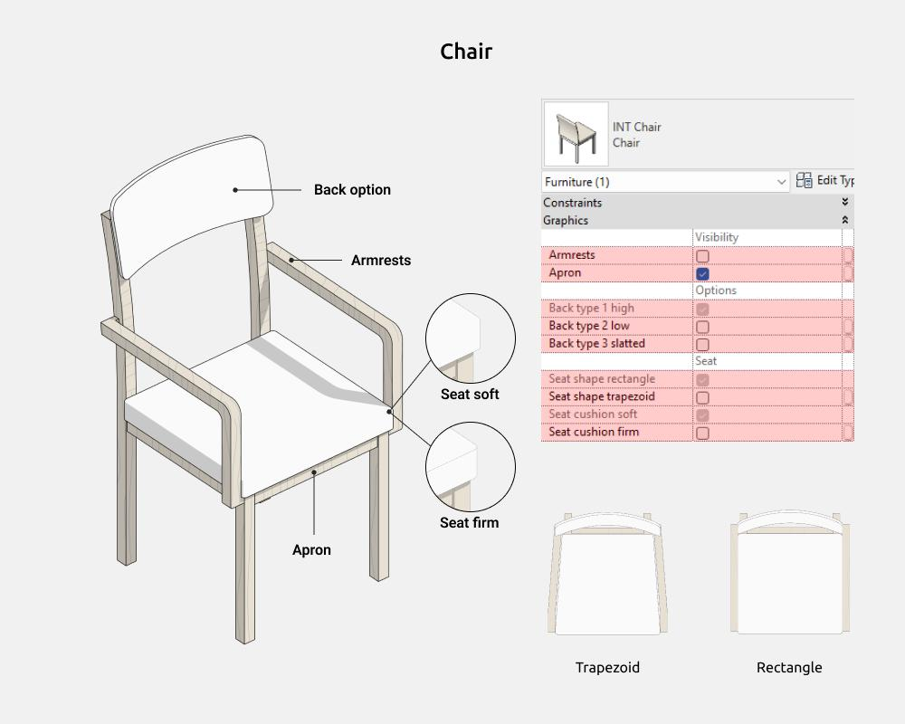
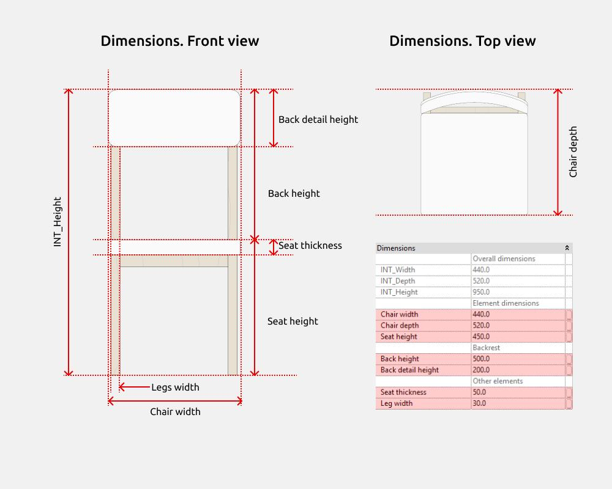
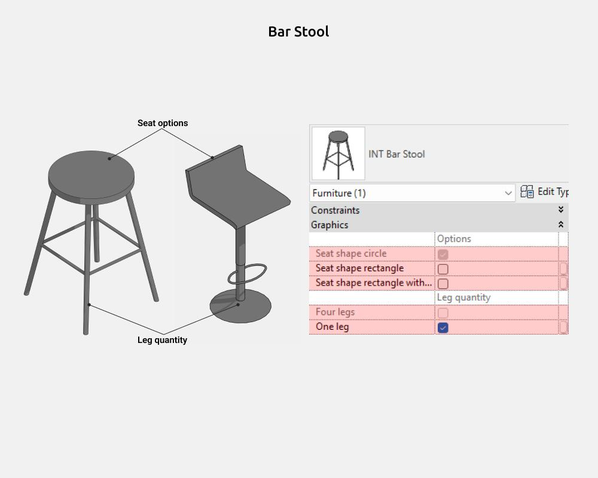
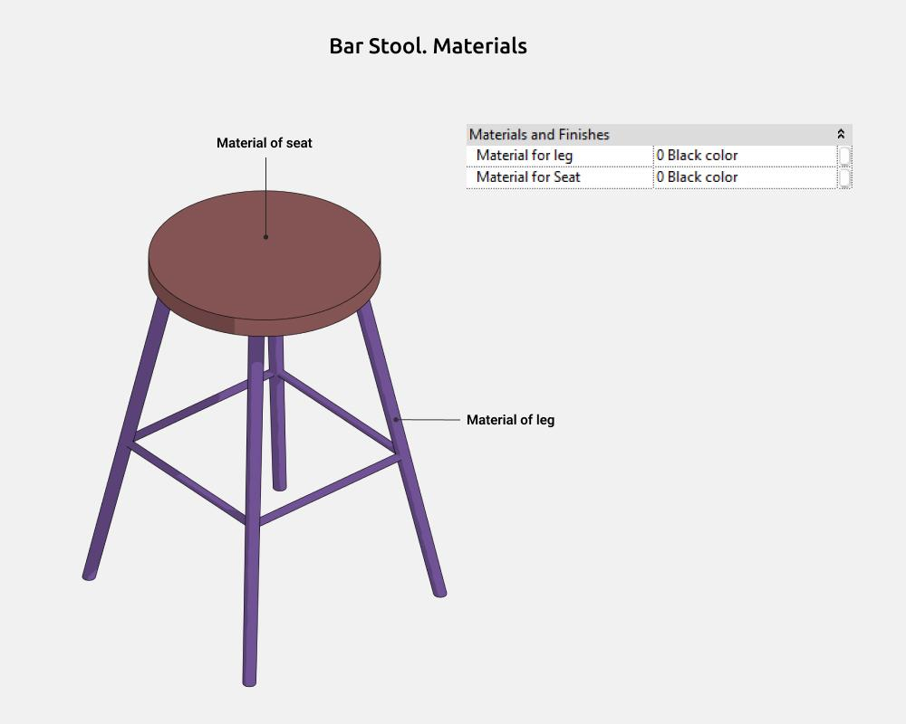
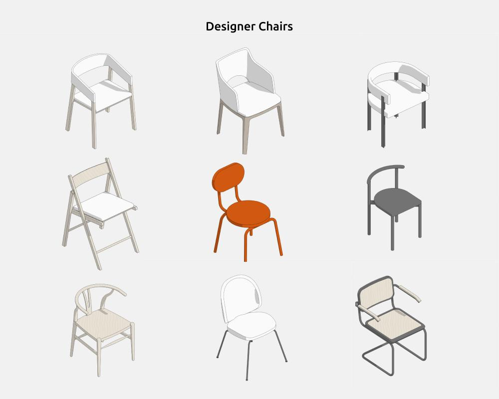

import productPreview from './product.jpg';

<ProductCard
  name="Chair Revit Families"
  eyebrow="Revit Family Set"
  description="A collection of chair families in different styles — ready to drop into your Revit project."
  image={productPreview}
  imageAlt="Chairs Revit Families — set preview"
  buyUrl="https://bimcore.one/products/chair-revit-families"
  ecwidProductId="582492458"
/>

## 1. GENERAL INFORMATION

- Set name: Chairs
- Version: 1.0.0
- Revit version: 2019

### Description

This Revit family set is intended for modeling chairs in Autodesk Revit.

Using these families, you can create basic shapes and types of chairs and bar stools, as well as popular designer models.

Suitable for interior designers and architects. For chair modeling by furniture manufacturers, the families are not detailed enough.

### Loading and placing into the project

To view and load the required families from the set, you can open the Chair Project and copy the families using the Ctrl+C keyboard shortcut, then paste them into your project using Ctrl+V. Alternatively, open the folder containing the family files and drag them into your project with your mouse.

## 2. SET STRUCTURE

The set includes the following parametric families:

- Chair
- Bar Stool

Designer Chairs:

- Chair Beetle
- Chair Cesca B32
- Chair Delo Нра
- Chair Delo Тру
- Chair Poliform
- Chair T-chair
- Chair Wishbone
- Chair Wooden
- Chair Foldable

## 3. FAMILIES

### Chair

The Chair family is used to create basic chair shapes and types.

Here you can enable/disable the following elements:

- Armrests
- Aprons (these are horizontal slats connecting the legs of the seat around the perimeter)
- Back type 1
- Back type 2
- Back type 3
- Seat shape rectangle
- Seat shape trapezoid
- Soft seat
- Hard seat

#### Dimensions

 

INT_Height is the overall chair height parameter, which is the sum of the Backrest height and Seat height parameters that can be controlled.

#### Back options

The number of backrest types is limited to three, the most common variants.

You can enable type 2 or type 3. If both of these types are disabled, type 1 is enabled.

#### Materials

### Bar Stool

The Bar Stool family is used to create basic shapes and types of bar stools.

Here you can enable/disable the following elements:

- Seat shape circle
- Seat shape rectangle
- Seat shape rectangle + Back
- Four legs
- One leg

#### Dimensions

INT_Height is the overall bar stool height parameter, which is the sum of the Backrest height and Seat height parameters that can be controlled.

#### Seat options

The number of seat types is limited to three, the most common variants.

You can enable Rectangular seat or Rectangular seat + backrest. If both of these types are disabled, the seat is Circular.

#### Materials

### Designer chairs

All families in the Designer Chairs group are used to create existing designer chair models.

They have a similar logic for adjusting dimensions and displaying elements (armrests, backrest, etc.) as the main Chair and Bar Stool families.

<CTA type="guide" />
