import productPreview from './product.png';

<ProductCard
  name="Curtains Revit Families"
  eyebrow="Revit Family Set"
  description="Curtains, blinds and drapes — window dressing families ready to drop into your Revit project."
  image={productPreview}
  imageAlt="Curtains Revit Families — set preview"
  buyUrl="https://bimcore.one/products/surtains-and-blinds-revit-families"
  ecwidProductId="759002618"
/>

## 1. GENERAL INFORMATION

-   Set Name: Curtains and Blinds
-   Set Version: 1.0.1
-   Revit Version: 2019

### Description

This Revit family set is designed for use in architectural and interior design projects to represent various window treatment options. It includes parameters for customizing the appearance, placement, dimensions, and materials of curtains or blinds.

### Loading and placing into the project

To view and load the required families from the set, you can open the Curtains and Blinds Project and copy the families using the Ctrl+C shortcut, then paste them into your own project with Ctrl+V.

Alternatively, you can open the folder with the family files and drag them directly into your project.

## 2. SET STRUCTURE

The set includes the following families:

-   Japanese panel blinds
-   Layered curtains
-   Classic layered curtains
-   Horizontal Blinds
-   Vertical blinds
-   Roller blinds
-   Roman blinds
-   Curtains for sloped surfaces
-   Curtains for irregular windows
-   Arched curtains

## 3. FAMILIES

### Curtain and blind placement

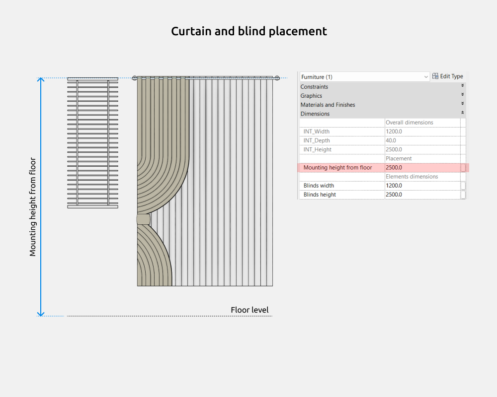

A universal parameter used in most families of the set. Measures the distance from the floor to the top point of the family (to the top of the blind or curtain).

### Japanese panel blinds

In families with Japanese panels, the following parameters can be adjusted:

-   % Opening
-   Panel count

The “% Opening” parameter is used in many families within this set and controls the open/closed state. The value of “% Opening” does not affect the size parameters of the elements.

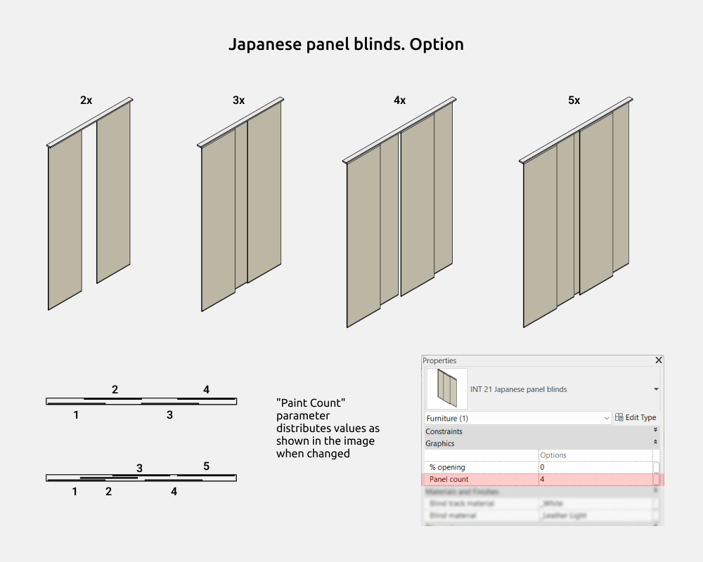

The families include a parameter called “Panel count”, the value of which changes based on the number entered into the input field.

The “Offset from floor” parameter is found in many families in this set and measures the distance from the floor level to the lowest point of the family.

Track height has a fixed value of 15 mm.

“Track width” and “Track depth” define the overall dimensions of the family.

Panel width and Panel height refer to the dimensions of a single curtain panel.

There are gray parameters that cannot be modified directly, but they help in understanding the size calculations. For example, Panel height subtracts the Track height and shows the height of the curtain fabric itself.

### Layered curtains

In the curtain families, you can enable or disable the following elements:

-   Sheer curtain
-   Curtains
-   Valance

The “Single curtain” option disables the curtain on the right side.

Types of cornices:

-   Wall mounted cornice – the cornice is positioned with a gap from the ceiling and attached to a vertical surface.
-   Ceiling mounted cornice – the cornice is fixed directly to the ceiling. Suitable for hidden or recessed installation.

The family includes several parameters for assigning materials, allowing flexible customization of the appearance.

The following parameters are available in the Materials and Finishes section:

-   Cornice material
-   Sheer material
-   Curtain material
-   Valance material

Offset from floor is a commonly used parameter across many families in this set. It measures the distance from the floor level to the bottom point of the element.

Cornice width, Cornice depth, and Curtain height define the overall dimensions of the family.

Valance height, End cap radius, and End cap inset are separate, individual parameters.

Some parameters appear greyed out and cannot be modified directly. However, they are essential for understanding dimensional calculations. For example, Curtain height subtracts the Offset from floor value and displays the total visible height of the curtain panel.

### Classic Layered Curtains

In the curtain families, you can enable or disable the following elements:

-   Sheer curtain
-   Curtain
-   Valance

There are two types of valances: Straight valance and Curved valance.

The Single curtain option disables the curtain on the right side.

Types of cornices:

-   Wall mounted cornice – the cornice is installed with a gap below the ceiling and is attached to a vertical surface.
-   Ceiling mounted cornice – the cornice is mounted directly to the ceiling. Suitable for hidden or recessed installation.

The family includes several parameters for defining materials, allowing flexible customization of the product’s appearance.

The following parameters are available under Materials and Finishes:

-   Cornice material
-   Sheer curtain
-   Curtain material
-   Valance material

Offset from floor is used in many families in this set and measures the distance from the floor level to the bottom of the family.

Cornice width, Cornice depth, and Curtain height are the overall dimensions of the family.

Drapery width, Tieback height, Valance height, End cap radius, and End cap inset are individual parameters.

Drapery width – the width of a single drapery panel.

Tieback height – the position of the decorative tieback relative to the bottom of the curtain.

There are gray parameters that cannot be manually adjusted. However, they help in understanding dimensional calculations.

For example, Curtain height subtracts the Offset from floor to show the actual panel height.

### Horizontal blinds

In curtain families, the following elements can be turned on or off:

-   Vertical frames

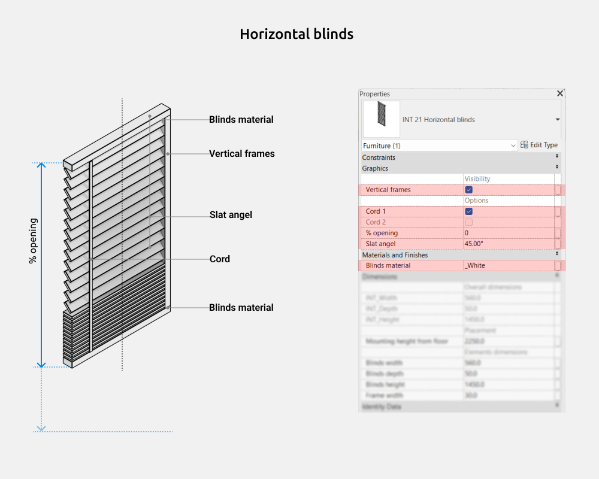

In the "Options" subsection, you can select the type of cord when the Vertical frames element is turned off, and you can also adjust the Slat angle.

The "% Opening" parameter is found in many families of this set and controls the degree of curtain/blind opening or closing. The "% Opening" value does not affect the Element dimensions parameters.

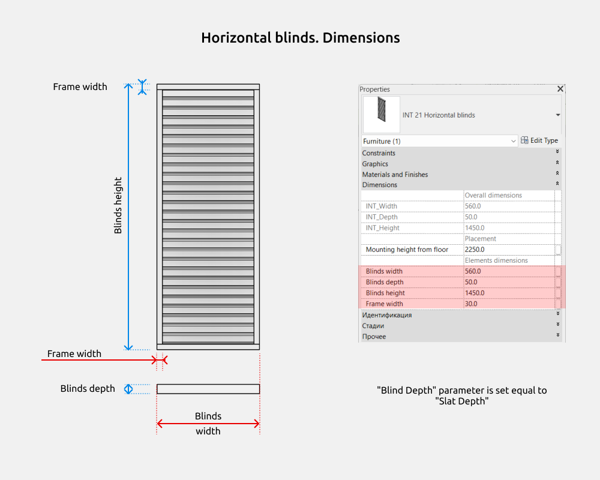

Blind width, Blind depth, and Blind height are the overall dimensions of the family.

Frame width is a separate parameter.

There are gray parameters (e.g., ADSK_Dimension_Width) that cannot be edited manually. These are used for size calculations and formula functionality and are not intended for user modification.

### Vertical blinds

In curtain families, you can enable/disable the following elements:

-   Blind frame

In the "Options" subsection, you can select the cord type when the Frames element is disabled, and adjust the Slat angle.

The "Opening %" parameter is present in many families of this set and controls the open/close state. The value of "Opening %" does not affect the Element Dimensions parameters.

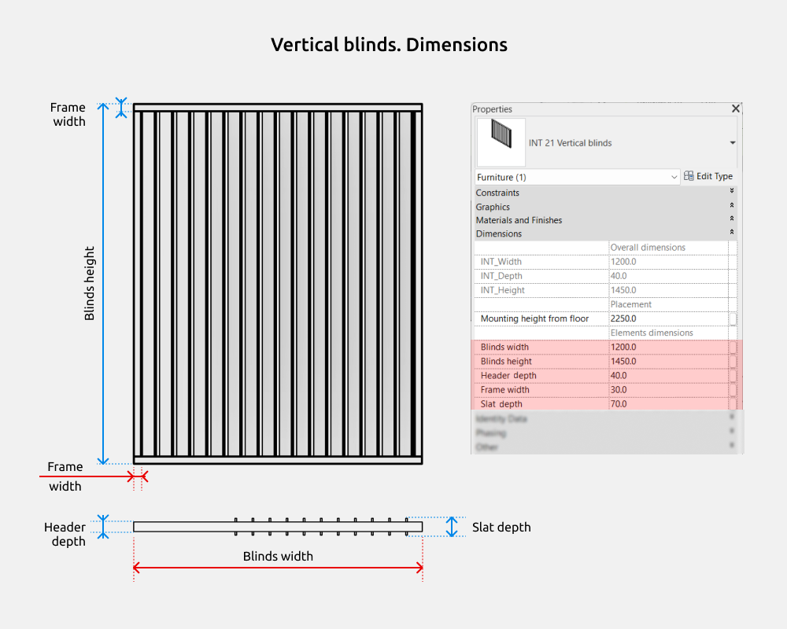

Blind width, Cornice depth, and Blind height are the overall dimensions of the family.

Frame width and Slat depth are separate parameters.

There are gray-colored parameters that cannot be modified (e.g., ADSK_Dimension_Width). These are used for understanding size calculations and ensuring formulas work correctly. They are not intended for user editing.

### Roller blind

In curtain families, you can enable or disable the following elements:

-   Cassette cover

In the Options section, you can select the type of cord, change the mounting type (wall or ceiling), and choose the fabric placement—either inside or outside the frame.

The "Opening %" parameter appears in many families within this set and controls the level of opening/closing. The value of "Opening %" does not affect the element dimensions.

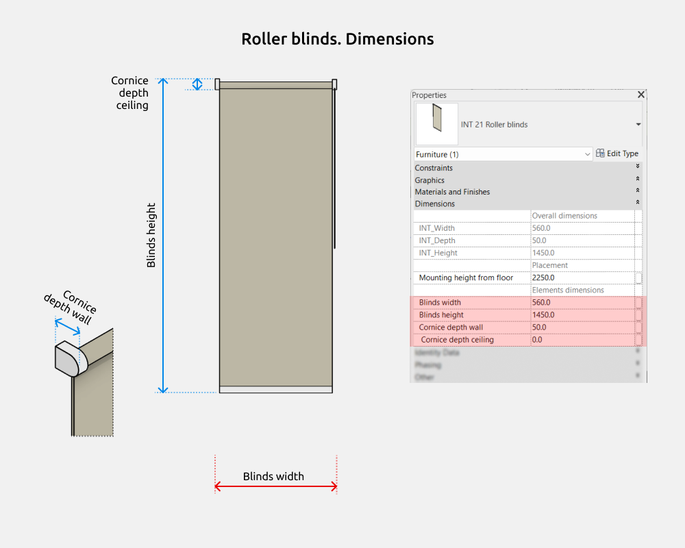

Curtain width, Curtain height, and Cornice depth wall are the overall dimensions of the family.

The Cornice depth wall parameter is active when the Ceiling-mounted cornice option is enabled. If this option is disabled, the cornice depth defaults to 40 mm.

The Cornice depth ceiling parameter is used when the Wall-mounted cornice option is enabled.

There are gray (read-only) parameters, such as ADSK_Dimension_Width, which are not user-editable. These are required for dimension calculations and proper formula functioning and are not intended for manual modification.

### Roman blinds

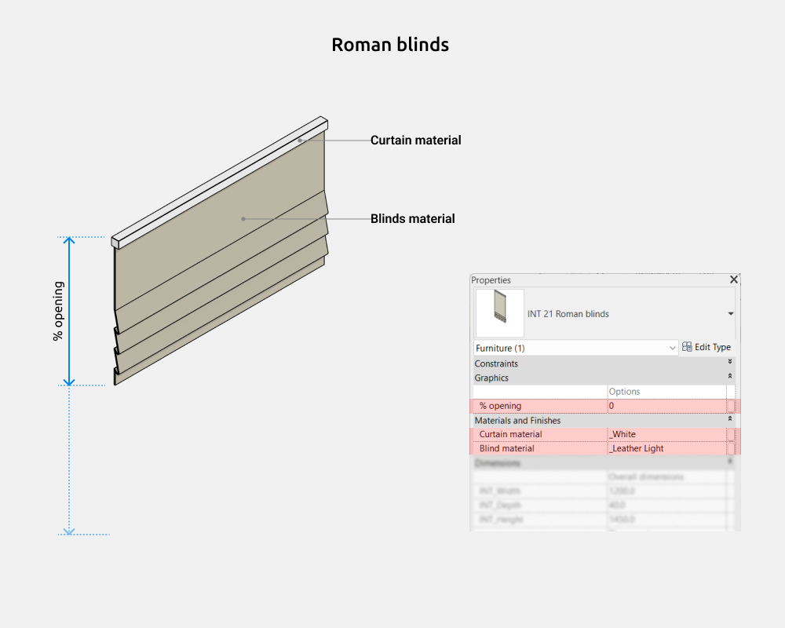

The “% opening” parameter appears in many families in this set and controls the open/closed state of the window treatment. The value of “% opening” does not affect the size parameters of the elements.

The families include several material parameters, allowing for flexible customization of the appearance. Under the “Materials and Finishes” section, the following parameters are available:

-   Cornice material
-   Curtain material

Blinds width, Cornice depth, and Blinds height are the overall dimensions of the family.

Cornice height is a separate parameter.

There are gray-colored parameters that cannot be edited (e.g., ADSK_Dimension_Width). These are used for dimension calculations and to ensure proper formula functionality; they are not intended for user modification.

### Curtains for sloped surfaces

The “% opening” parameter appears in many families within this set and controls the open/close state. The “% opening” value does not affect the element dimension parameters.

Several parameters are available for assigning materials, allowing flexible customization of the element’s appearance. The following parameters are available in the “Materials and Finishes” section:

-   Cornice material
-   Curtain material

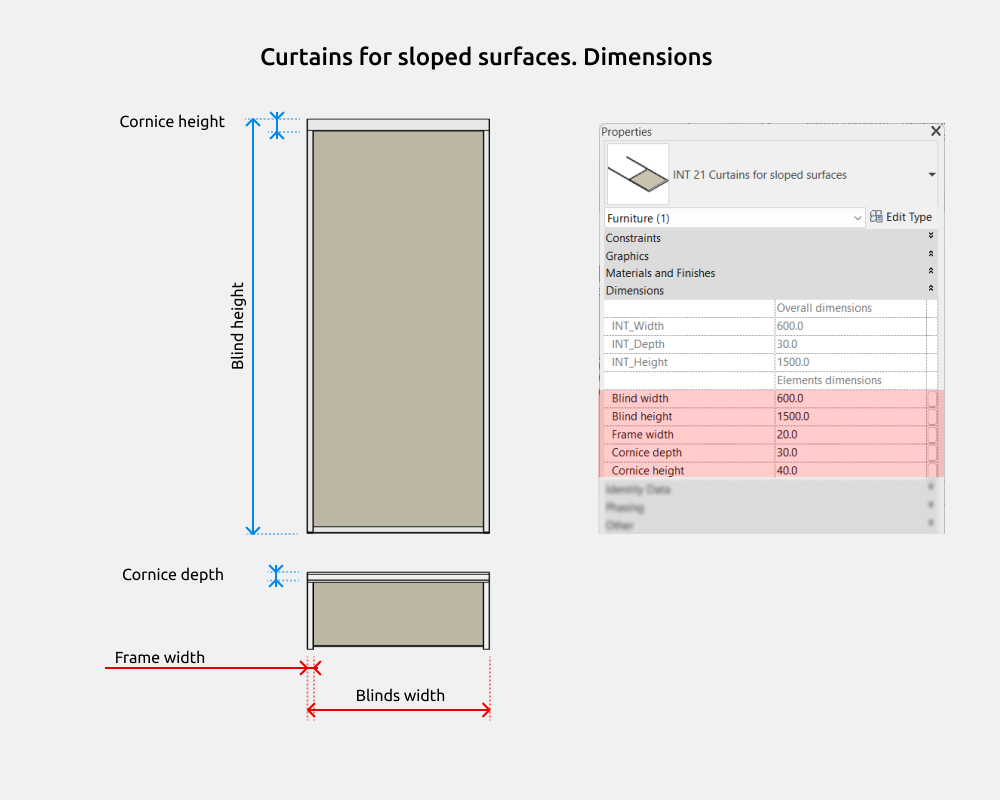

Blind width, Cornice depth, and Blind height are the overall dimensions of the family.

Frame width and Cornice height are separate parameters.

There are greyed-out parameters that cannot be edited (for example, ADSK_Dimension_Width). These are used for understanding dimension calculations and ensuring the correct operation of formulas. They are not intended for user modification.

### Curtains for irregular windows

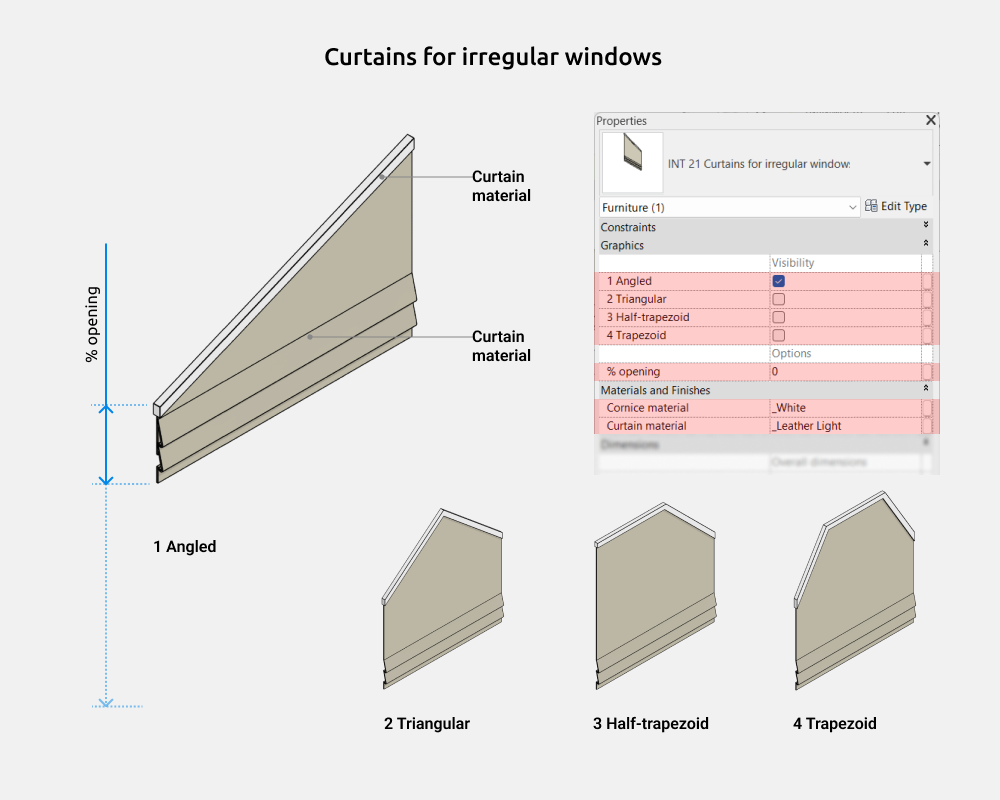

In curtain families, the following elements can be enabled or disabled:

-   1 Angled
-   2 Triangular
-   3 Half-trapezoid
-   4 Trapezoid

The “% opening” parameter appears in many families within this set and controls the open/close state. The “% opening” value does not affect the element dimension parameters.

Several parameters are available for assigning materials, allowing flexible customization of the element’s appearance. The following parameters are available in the “Materials and Finishes” section:

-   Cornice material
-   Curtain material

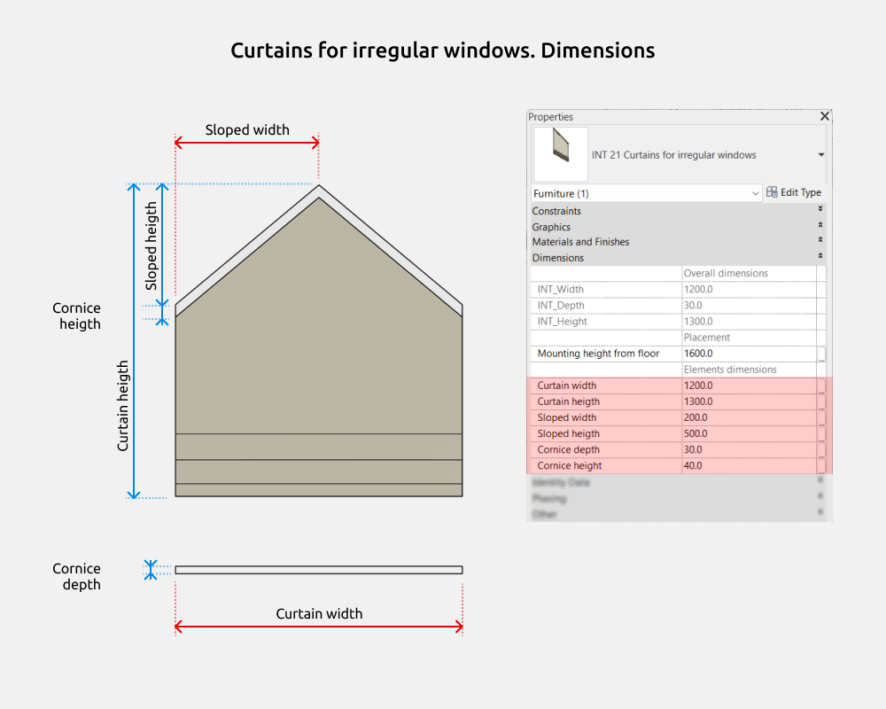

Curtain width, Cornice depth, and Curtain height are the overall dimensions of the family.

Slope width, Slope height, and Cornice height are separate parameters.

There are greyed-out parameters that cannot be edited (for example, ADSK_Dimension_Width). These are used for understanding dimension calculations and ensuring the correct operation of formulas. They are not intended for user modification.

### Arched curtains

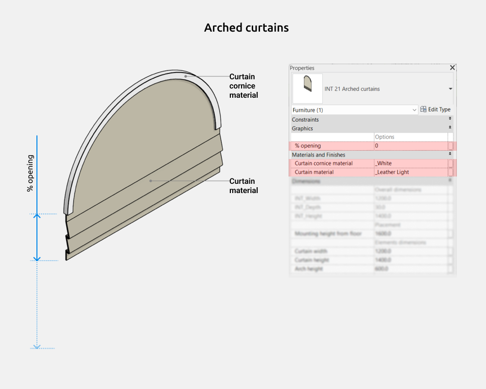

The “% opening” parameter appears in many families within this set and controls the open/close state. The “% opening” value does not affect the element dimension parameters.

Several parameters are available for assigning materials, allowing flexible customization of the element’s appearance. The following parameters are available in the “Materials and Finishes” section:

-   Cornice material
-   Curtain material

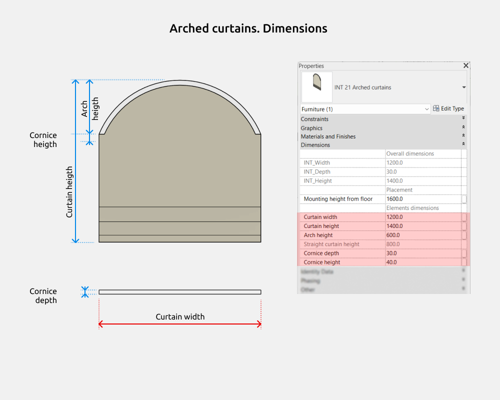

Curtain width, Cornice depth, and Curtain height are the overall dimensions of the family.

Arch height, Cornice depth, and Cornice height are separate parameters.

There are greyed-out parameters that cannot be edited (for example, ADSK_Dimension_Width). These are used for understanding dimension calculations and ensuring the correct operation of formulas. They are not intended for user modification.

## 4. STYLING

### Graphics settings

To change the color/weight/pattern of family lines, you need to go to Manage - Object Styles - Furniture/ INT 21 Curtains and blinds.

In the “Layered curtains” and “Classic layered curtains” families, to change the graphics on floor plans, you need to change Patterns color.

<CTA type="guide" />
