import productPreview from './product.png';

<ProductCard
  name="Kitchen Revit Families"
  eyebrow="Revit Family Set"
  description="Cabinets, appliances and worktops — kitchen families ready to drop into your Revit project."
  image={productPreview}
  imageAlt="Kitchen Revit Families — set preview"
  buyUrl="https://bimcore.one/products/kitchen-revit-families-v-3"
  ecwidProductId="543629545"
/>

## 1. GENERAL INFORMATION

-   Set name: Kitchen
-   Version 3.2.1
-   Revit version: 2019

### Description

This set of Revit families is made for modeling a kitchen in Autodesk Revit.

Using the families, you can create a kitchen according to exact dimensions and count the number of kitchen modules. Suitable for interior designers and architects. Families are not detailed enough for furniture makers.

### Loading and placing into the project

In order to view and download the families from the set, you can open **Project with kitchen** and copy the families using the Ctrl+C key combination, and then paste them into your project Ctrl+V.

Or open the folder with family files and drag it into the project with the mouse.

## 2. SET STRUCTURE

The set includes the following families:

Base unit

-   Base unit (х1,х2,х3,х4)
-   Base unit 2 doors (2 дверцы, 2 ящика)
-   Base unit L-angle
-   Base unit V-angle

Wall unit

-   Wall unit
-   Wall unit L-angle

Tall unit

-   Tall unit (х1,х2,х3,х4,х5,х6)

Fillers

-   Filler
-   Corner filler
-   Panel
-   Panel with Gola

Others

-   Island worktop

## 3. COMMON ELEMENTS OF KITCHEN UNITS

Kitchen units - the main families of the set from which the kitchen is made.

In this chapter you will learn what elements units consist of and how to use them.

### Common elements

Common elements - elements that are repeated in each kitchen unit.

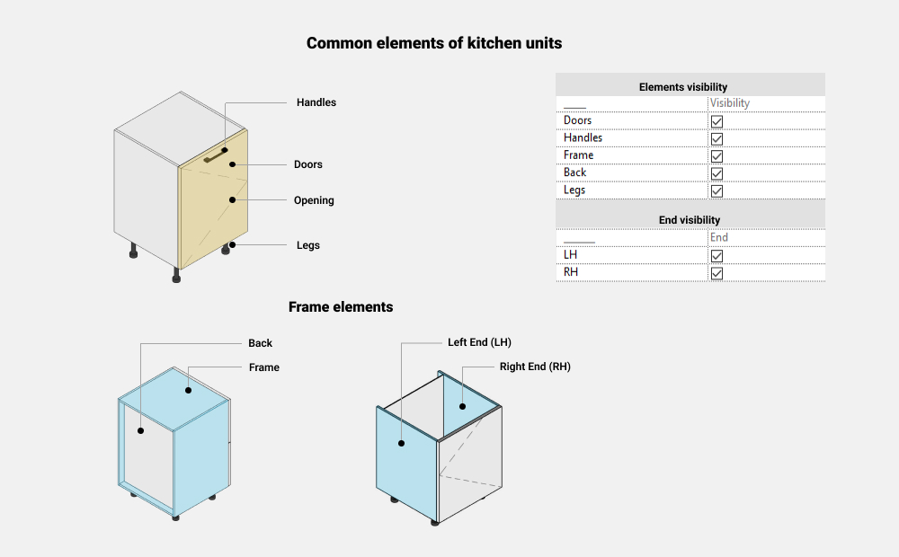

The common elements of all kitchen units are:

-   Doors
-   Handles
-   Legs
-   Opening
-   Frame
-   Back (part of the frame)
-   Left End (part of the frame)
-   Right End (part of the frame)

### Doors

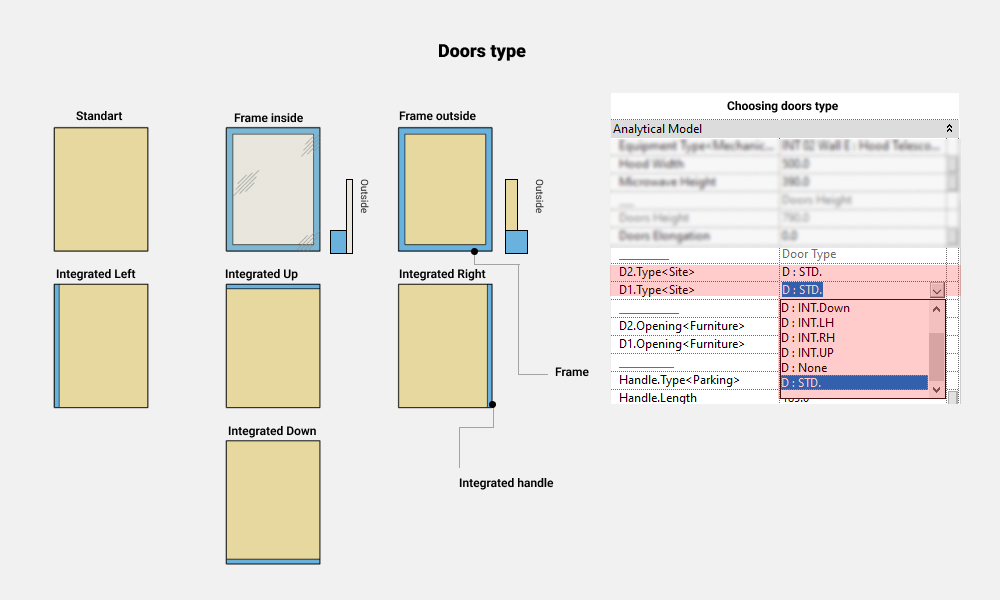

Doors types can be selected in the drop-down list for each **unit** family. It is:

-   None
-   Standart (STD.)
-   Frame inside (FR.Inside)
-   Frame outside  (FR.Outside)
-   Integrated up (INT.Up)
-   Integrated left (INT.LH)
-   Integrated right (INT.RH)
-   Integrated down (INT.Down)

### Handles

#### Handles type

Handles types can be selected in the drop-down list for each **unit** family. It is:

-   None
-   D-shape
-   Built-in
-   Round
-   Т-bar

For **built-in handles** you need to set the **Handle.Offset** = 2mm so that it moves to the edge of the door.

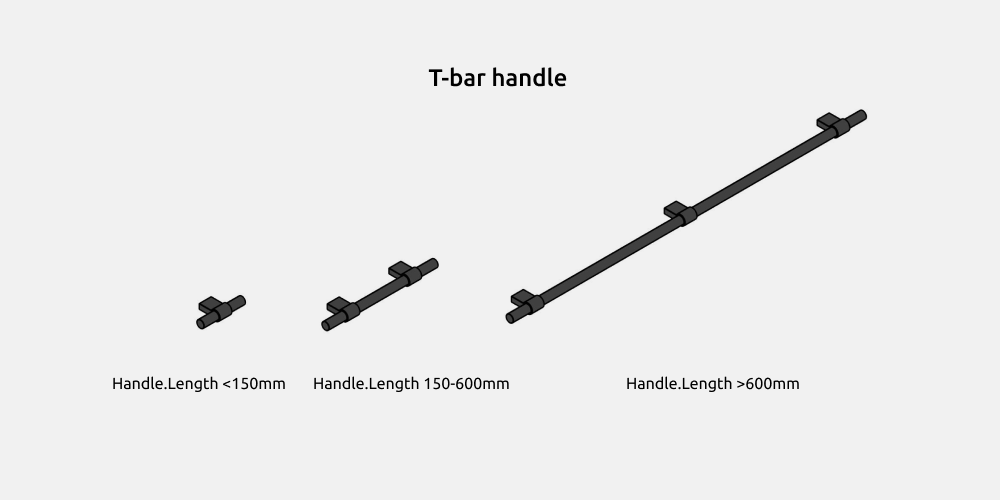

The **T-bar** display changes with different handle lengths (Handle.Length).

#### Handles position

The placement of handles is not made by a drop-down list, but simply by numbers from 1 to 9. Visually, this is similar to the placement of numbers from a keyboard. You can also look at the tooltip in the **H.Position** parameter itself.

The position of the handles can be horizontal or vertical. The **Handle.Horizontal** parameter is responsible for this.

### Opening

Opening types can be selected in the drop-down list for each **unit** family. It is:

-   None
-   Left (LH)
-   Right (RH)
-   Down
-   Up
-   Drawer
-   Double
-   Left slide (LH Slide)
-   Right slide (RH Slide)
-   Double slide
-   Lift up
-   Lift oblique
-   Folder
-   2 drawers

Doors opening does not depend on the handles position.

To turn on Opening RU or ENG, you need to go to View Visibility and then to Furniture.

### End

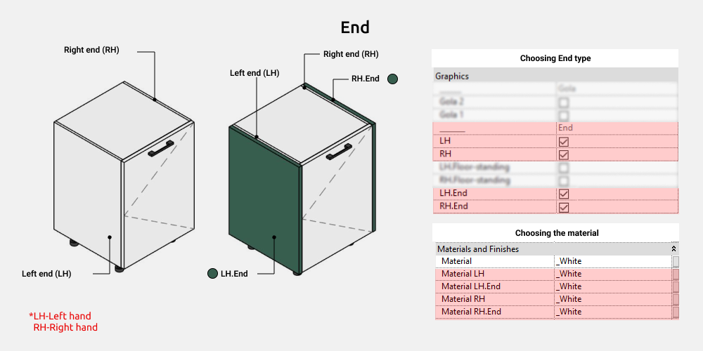

Left end (LH) and Right end (RH) are present in all frames and can be turned off if necessary. But they are on by default.

LH.End, R.End - add an additional panel to the side and cover the end of the door.

In units that are installed on the floor, additional parameters are added to the ends. These are: LH.Floor-standing, RH.Floor-standing (which allows the ends to be lowered to the floor) and LH.End, RH.End.

## 4. FAMILIES: PARAMETERS AND ELEMENTS

### Base unit

**Base unit** is used to build kitchen cabinets, which are placed on the floor and serve as a work surface for cooking.

Here you can on/off the following elements:

-   Worktop
-   Handles
-   Doors
-   Frame
-   Back
-   Shelf
-   Hidden drawer (displayed by line pattern)
-   Legs
-   Gola
-   different options for the End, which were mentioned previously

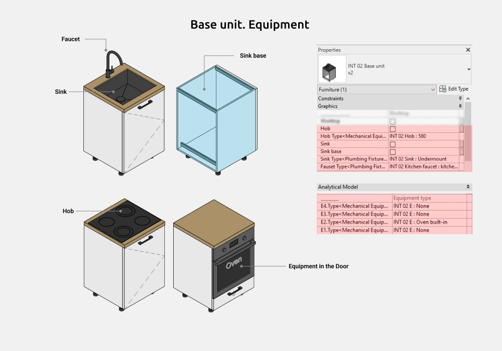

There is also Equipment:

-   Hob
-   Sink (and Fauset automatically ON)
-   Equipment in the Door

#### Family types

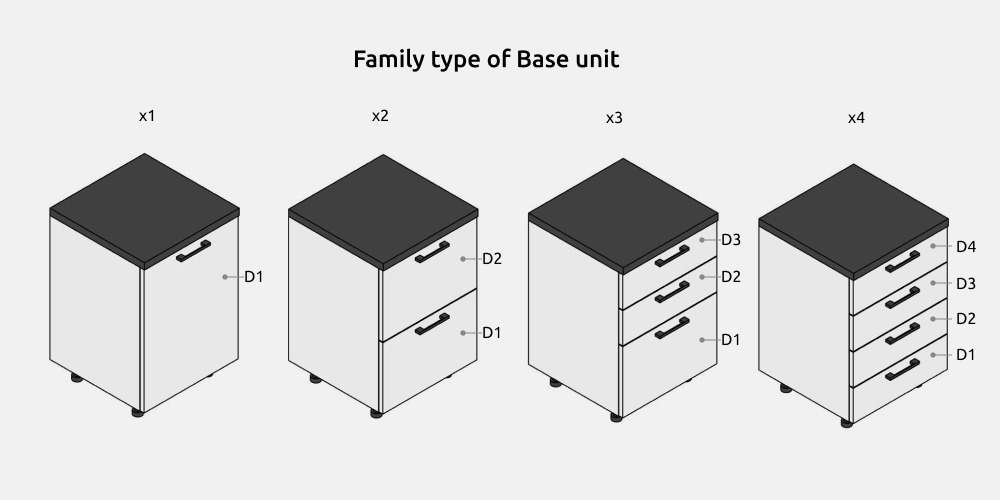

Family types are named by the number of doors in the unit:

-   х1
-   х2
-   х3
-   х4

The numbers of the doors go in order from bottom to top, where D1 is the lower door, and D4 is the upper door.

To change the number of doors in the Base unit, you need to select the appropriate family type, and not instance parameters. If there is one door, then choose x1. If there are two doors - x2. And so on up to four doors, this is the maximum value in this family.

#### Dimensions

**Width, Depth, Height** of the unit are the dimensions of the frame. **Door thickness, Worktop thickness, Plinth** - individual parameters.

Worktop depth in the top view has a fixed value and consists of the dimensions: Depth + Door thickness + 5mm.

There are gray parameters that cannot be controlled. But they are needed to understand the size calculations. For example, **Worktop height.** The parameter summarizes all heights and shows the important end point of the worktop when Worktop is enabled. (see pictures)

Due to the fact that there are 4 family types in the family, which means there are 4 doors; you can change individual parameters specifically for each.

If family type **x1** is selected, then we change all the parameters with the number 1: D1.Height (in x1 it is equal to the height of the frame), E1.Type, E1.Closed, D1.Type, D1.Opening, H1.Position. If **x2** is selected, then we change all parameters with numbers 1 and 2.

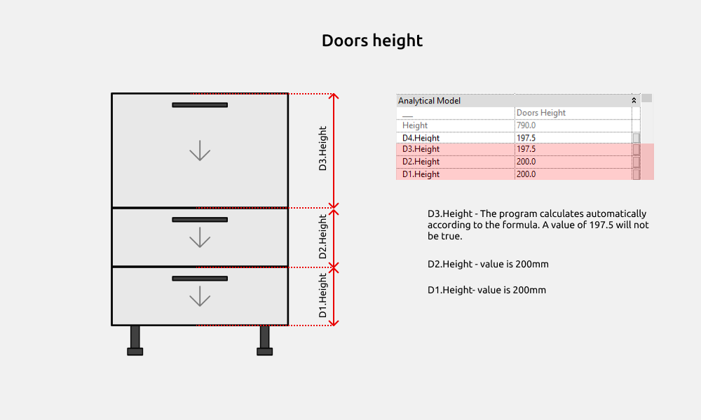

It is better to start building D.Height from the lower, first door. Because D.Height of the last, upper door does not work.

For example, family type x3 is selected, **D1.Height** and **D2.Height** will be changeable, and **D3.Height** is calculated based on the first two heights.

If D.Height is more than frame Height, there will be an error. If this happens, simply go back and put smaller values in D.Height.

#### Hob

**Hob** types can be selected in the drop-down list. It is:

-   300 (2 burner)
-   450 (3 burner)
-   580 (4 burner)
-   880 (6 burner)

Be sure to choose types with the initial heading INT 02 Hob. Because various other families are loaded into the drop-down lists and do not need to be selected.

#### Sink

There are two types of Sink, which are selected in the drop-down list. It is:

-   Topmount
-   Undermount

Be sure to choose types with the initial heading INT 02 Sink. Because various other families are loaded into the drop-down lists and do not need to be selected.

**Kitchen faucet** to the Sink:

-   height 360
-   height 450

Be sure to choose types with the initial heading INT 02 Kitchen faucet.

The Sink and Hob on the worktop can be moved to the left or to the right of the central axis.

There is also a parameter for the sink - Sink width.

If the configuration of these elements does not suit you, turn them off and place a separate family in the project.

#### Gola

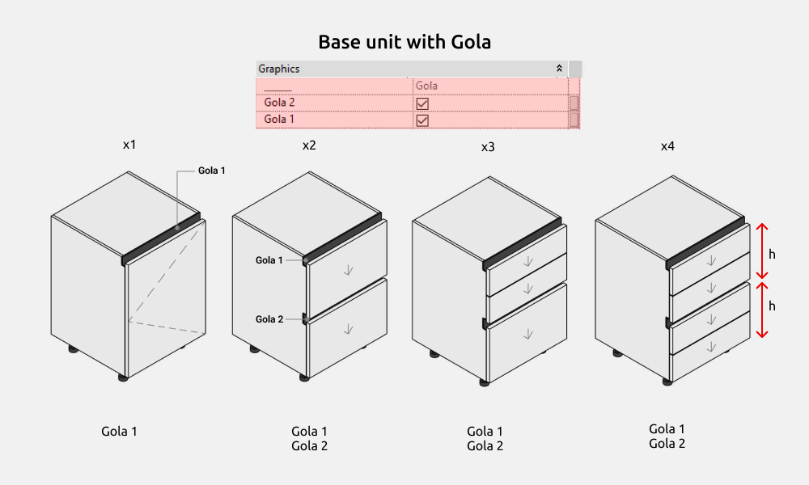

Gola can be placed on top of the frame, under the worktop - this is Gola 1. And the Gola 2 handle will be between the drawers in the center of the frame. The height of the frame can be higher/lower, but the height of the individual doors in this case changes equally, Gola 2 is always in the center.

#### Equipment

Equipment can be installed in place of the door. To do this, you need to select the door number and equipment type from the drop-down list.

There are several types of equipment:

-   Built-in
-   Integrated

Built-in equipment:

-   Wine built-in
-   Oven built-in
-   Coffee machine
-   Microwave built-in
-   Freezer built-in
-   Dish warmer
-   Fridge built-in
-   Dish dryer

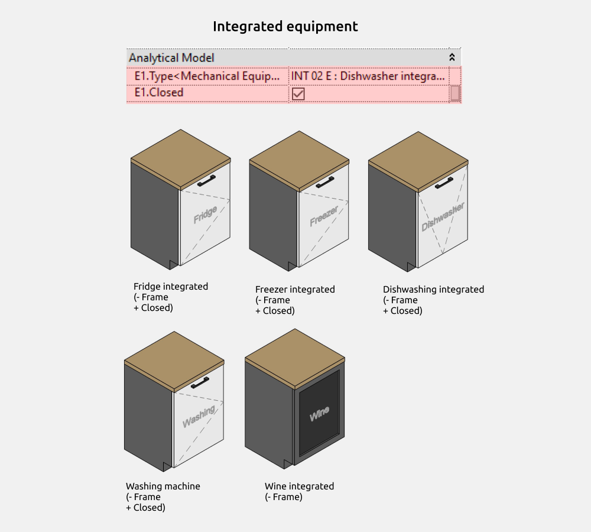

Integrated equipment:

-   Wine integrated
-   Freezer integrated
-   Dishwasher integrated
-   Washing machine
-   Fridge integrated

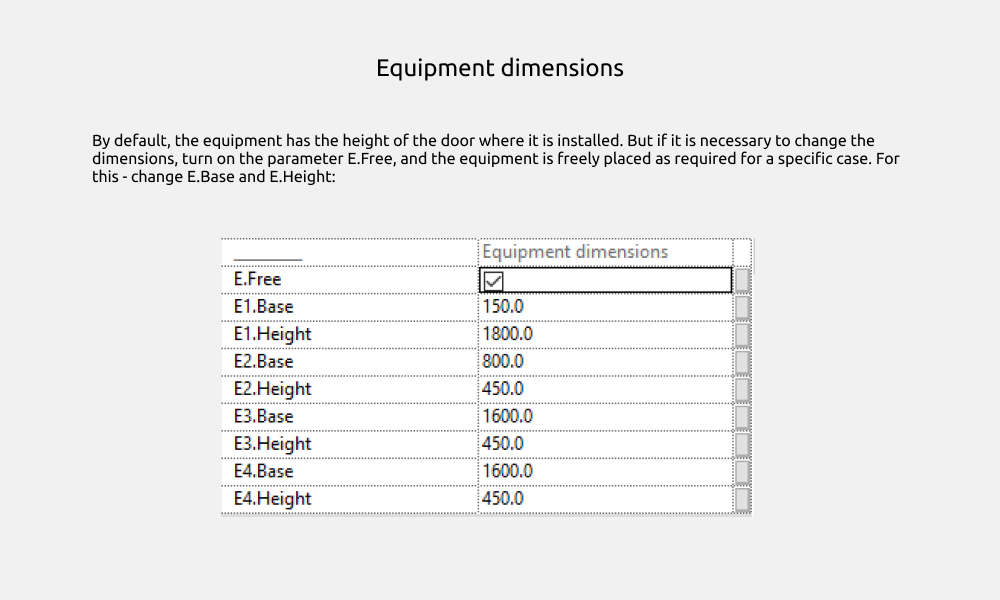

#### Materials

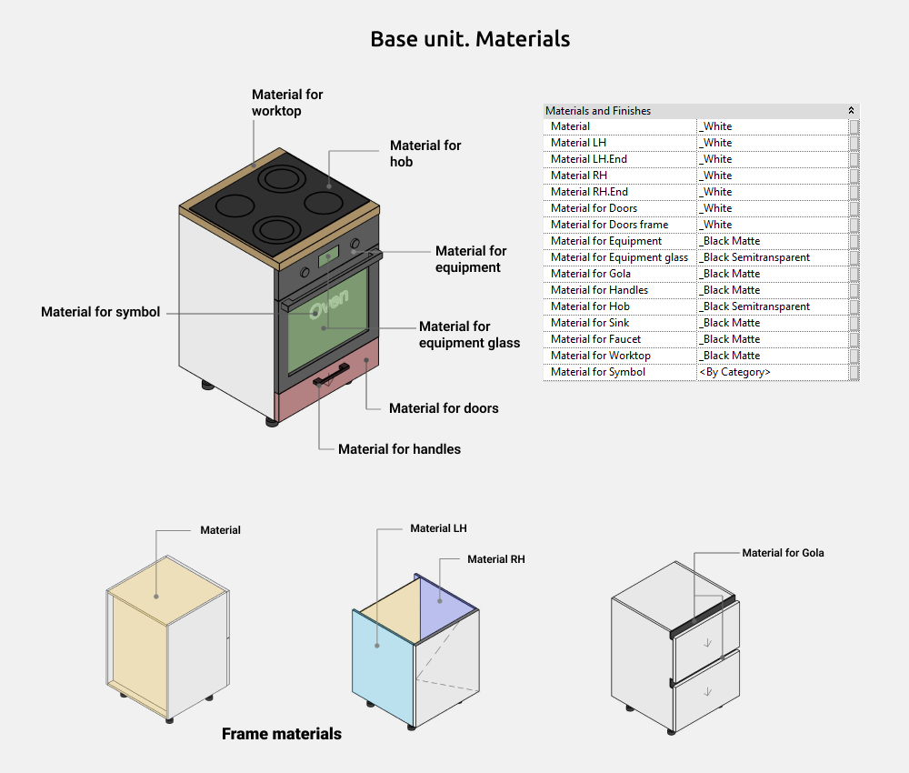

### Base unit 2 doors

**Base unit** **2 doors** is used to build kitchen cabinets, which are placed on the floor and serve as a work surface for cooking. Unlike the Base unit, there is no equipment in the doors, and the number of doors is only 2.

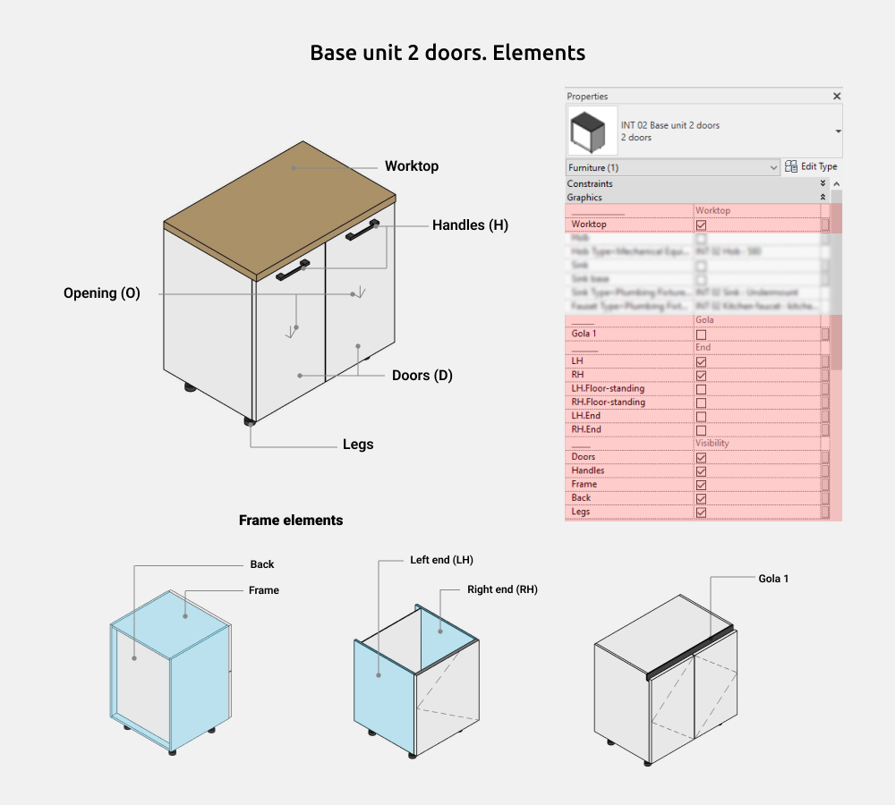

Here you can on/off the following elements:

-   Worktop
-   Handles
-   Doors
-   Frame
-   Back
-   Legs
-   Gola
-   different options for the End, which were mentioned previously

There is also Equipment:

-   Hob
-   Sink (and Fauset automatically ON)

#### Family types

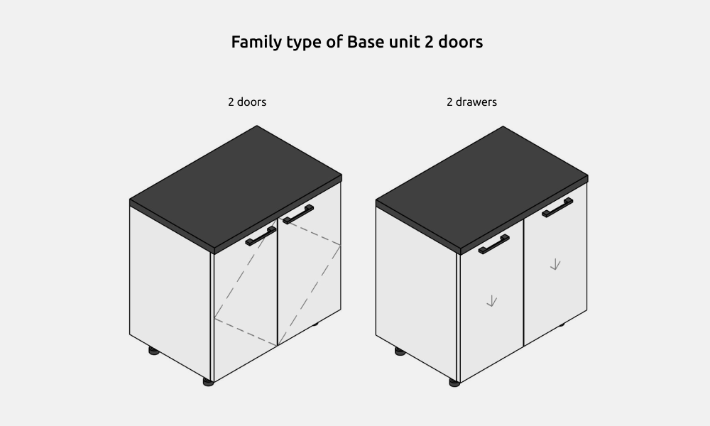

Family types are named by the type of opening in the unit:

-   2 doors
-   2 drawers

#### Dimensions

**Width, Depth, Height** of the unit are the dimensions of the frame. **Door thickness, Worktop thickness, Plinth** - individual parameters.

Worktop depth in the top view has a fixed value and consists of the dimensions: Depth + Door thickness + 5mm.

There are gray parameters that cannot be controlled. But they are needed to understand the size calculations. For example, **Worktop height.** The parameter summarizes all heights and shows the important end point of the worktop when Worktop is enabled. (see pictures)

In this family, the height and width of the doors do not need to be placed; everything is calculated automatically based on the overall dimensions of the unit.

#### Hob

**Hob** types can be selected in the drop-down list. It is:

-   300 (2 burner)
-   450 (3 burner)
-   580 (4 burner)
-   880 (6 burner)

Be sure to choose types with the initial heading INT 02 Hob. Because various other families are loaded into the drop-down lists and do not need to be selected.

#### Sink

There are two types of Sink, which are selected in the drop-down list. It is:

-   Topmount
-   Undermount

Be sure to choose types with the initial heading INT 02 Sink. Because various other families are loaded into the drop-down lists and do not need to be selected.

**Kitchen faucet** to the Sink:

-   height 360
-   height 450

Be sure to choose types with the initial heading INT 02 Kitchen faucet.

The Sink and Hob on the worktop can be moved to the left or to the right of the central axis.

There is also a parameter for the sink - Sink width.

If the configuration of these elements does not suit you, turn them off and place a separate family in the project.

#### Gola

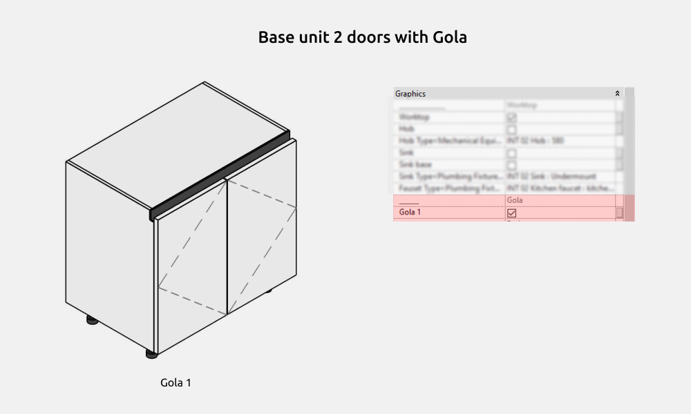

Gola can be placed on top of the frame, under the worktop - this is Gola 1.

#### Materials

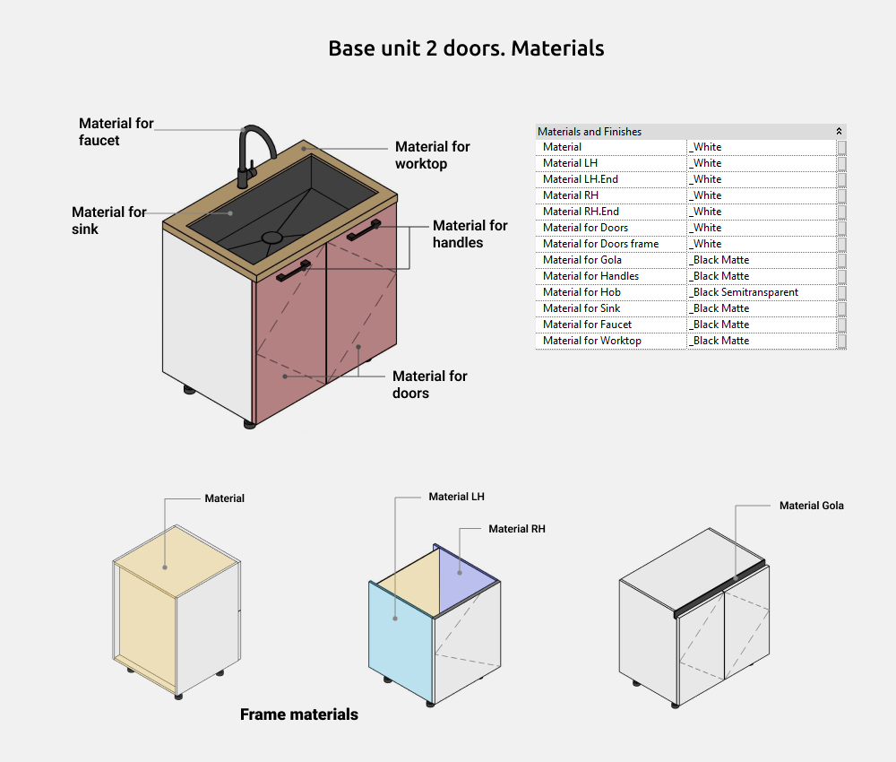

### Base unit L-angle

**Base unit** **L-angle** is used to build corner kitchen cabinets, which are placed on the floor and serve as a work surface for cooking. Unlike the Base unit, there is no equipment in the doors, and the number of doors is only 1.

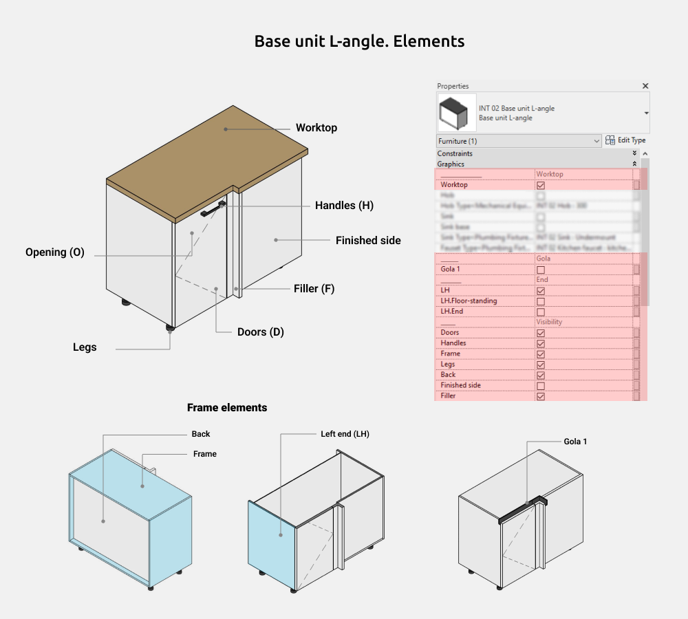

Here you can on/off the following elements:

-   Worktop
-   Handles
-   Doors
-   Frame
-   Back
-   Finished side
-   Filler
-   Legs
-   Gola
-   different options for the End, which were mentioned previously

There is also Equipment:

-   Hob
-   Sink (and Fauset automatically ON)

There are no family types.

#### Dimensions

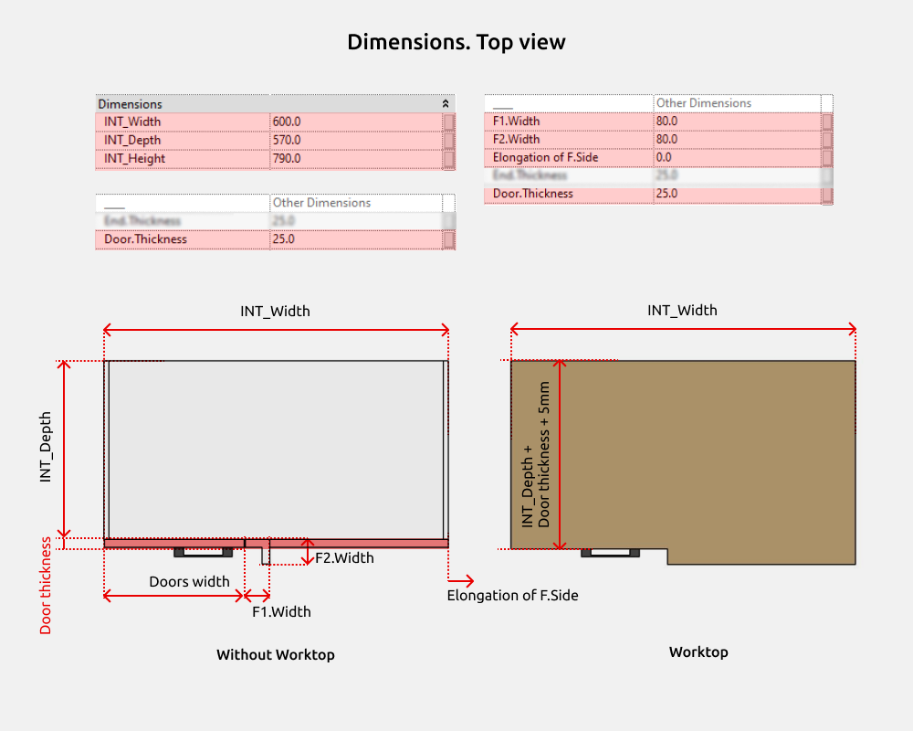

**Width, Depth, Height** of the unit are the dimensions of the frame. **Door thickness, Worktop thickness, Plinth** - individual parameters.

Worktop depth in the top view has a fixed value and consists of the dimensions: Depth + Door thickness + 5mm.

There are gray parameters that cannot be controlled. But they are needed to understand the size calculations. For example, **Worktop height.** The parameter summarizes all heights and shows the important end point of the worktop when Worktop is enabled. (see pictures)

In this family, the height and width of the doors do not need to be placed; everything is calculated automatically based on the overall dimensions of the unit.

#### Hob

**Hob** types can be selected in the drop-down list. It is:

-   300 (2 burner)
-   450 (3 burner)
-   580 (4 burner)
-   880 (6 burner)

Be sure to choose types with the initial heading INT 02 Hob. Because various other families are loaded into the drop-down lists and do not need to be selected.

#### Sink

There are two types of Sink, which are selected in the drop-down list. It is:

-   Topmount
-   Undermount

Be sure to choose types with the initial heading INT 02 Sink. Because various other families are loaded into the drop-down lists and do not need to be selected.

**Kitchen faucet** to the Sink:

-   height 360
-   height 450

Be sure to choose types with the initial heading INT 02 Kitchen faucet.

The Sink and Hob on the worktop can be moved to the left or to the right of the central axis.

There is also a parameter for the sink - Sink width.

If the configuration of these elements does not suit you, turn them off and place a separate family in the project.

#### Gola

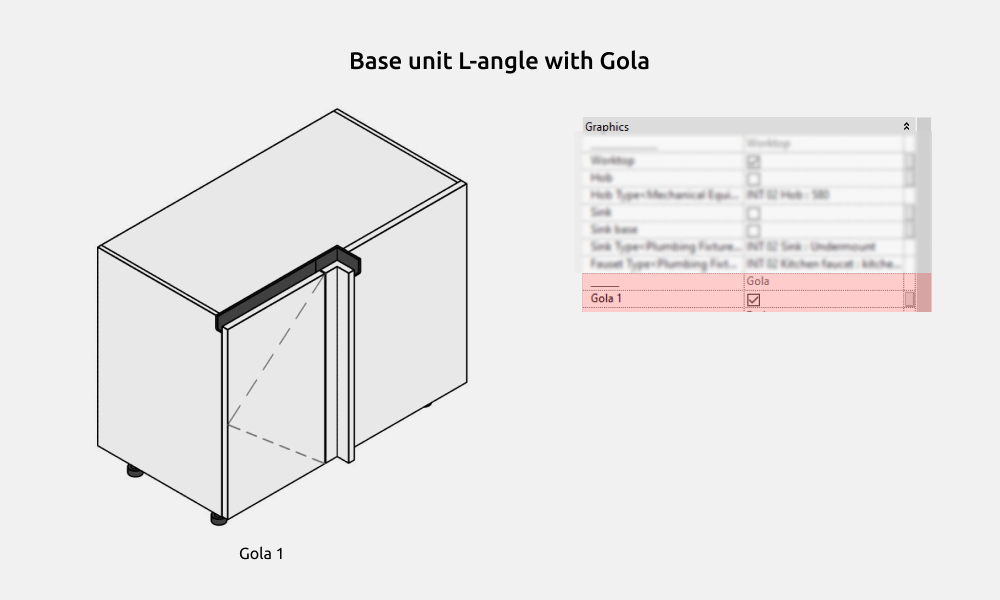

Gola can be placed on top of the frame, under the worktop - this is Gola 1.

#### Materials

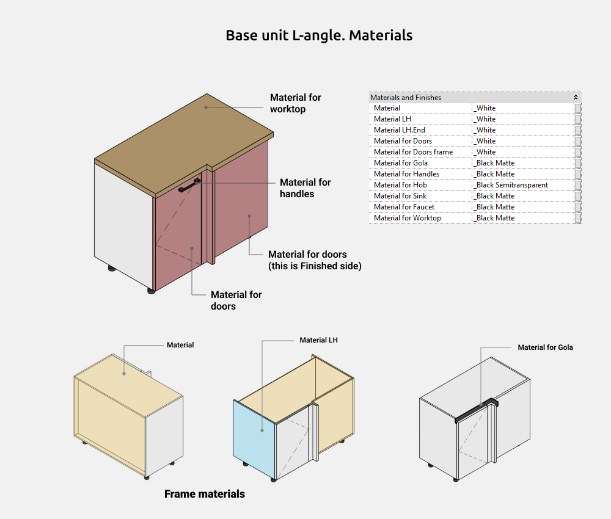

### Base unit V-angle

**Base unit** **V-angle** is used to build corner kitchen cabinets, which are placed on the floor and serve as a work surface for cooking. Unlike the Base unit, there is no equipment in the doors, and the number of doors is only 1.

Here you can on/off the following elements:

-   Worktop
-   Handles
-   Doors
-   Frame
-   Back
-   Legs
-   End: Left, Right

There is also Equipment:

-   Hob
-   Sink (and Fauset automatically ON)

There are no family types.

#### Dimensions

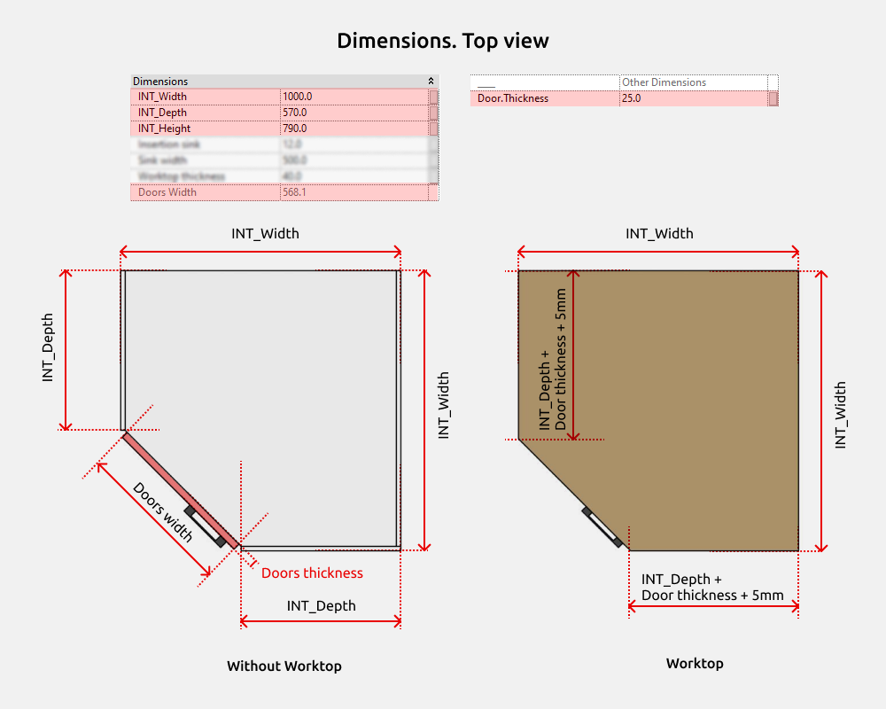

**Width, Depth, Height** of the unit are the dimensions of the frame. **Door thickness, Worktop thickness, Plinth** - individual parameters.

Worktop depth in the top view has a fixed value and consists of the dimensions: Depth + Door thickness + 5mm.

There are gray parameters that cannot be controlled. But they are needed to understand the size calculations. For example, **Worktop height.** The parameter summarizes all heights and shows the important end point of the worktop when Worktop is enabled. (see pictures)

In this family, the height and width of the doors do not need to be placed; everything is calculated automatically based on the overall dimensions of the unit.

#### Hob

**Hob** types can be selected in the drop-down list. It is:

-   300 (2 burner)
-   450 (3 burner)
-   580 (4 burner)
-   880 (6 burner)

Be sure to choose types with the initial heading INT 02 Hob. Because various other families are loaded into the drop-down lists and do not need to be selected.

#### Sink

There are two types of Sink, which are selected in the drop-down list. It is:

-   Topmount
-   Undermount

Be sure to choose types with the initial heading INT 02 Sink. Because various other families are loaded into the drop-down lists and do not need to be selected.

**Kitchen faucet** to the Sink:

-   height 360
-   height 450

Be sure to choose types with the initial heading INT 02 Kitchen faucet.

The sink/hob on the worktop are placed on the central axis and DO NOT move left/right.

There is also a parameter for the sink - **Sink width**.If the configuration of these elements does not suit you, turn them off and place a separate family in the project.

#### Materials

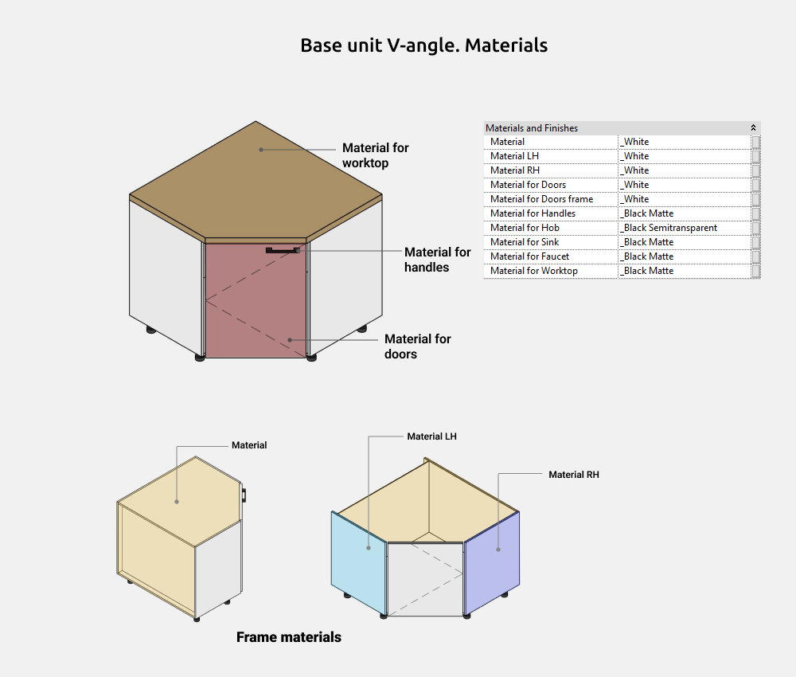

### Tall unit

**Tall unit** is used to build floor-standing column cabinets for the kitchen. With or without built-in equipment.

Here you can on/off the following elements:

-   Worktop
-   Handles
-   Doors
-   Frame
-   Back
-   Legs
-   Gola
-   different options for the End, which were mentioned previously

There is also Equipment:

-   Equipment in the Door

#### Family types

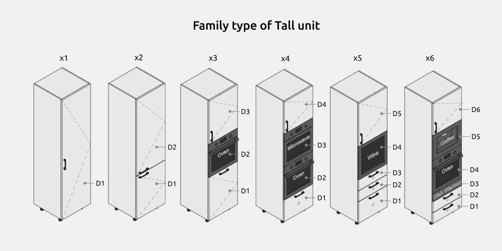

Family types are named by the number of doors in the unit:

-   х1
-   х2
-   х3
-   х4
-   х5
-   х6

The numbers of the doors go in order from bottom to top, where D1 is the lower door, and D6 is the upper door.

To change the number of doors in the Base unit, you need to select the appropriate family type, and not instance parameters. If there is one door, then choose x1. If there are two doors - x2. And so on up to six doors, this is the maximum value in this family.

#### Dimensions

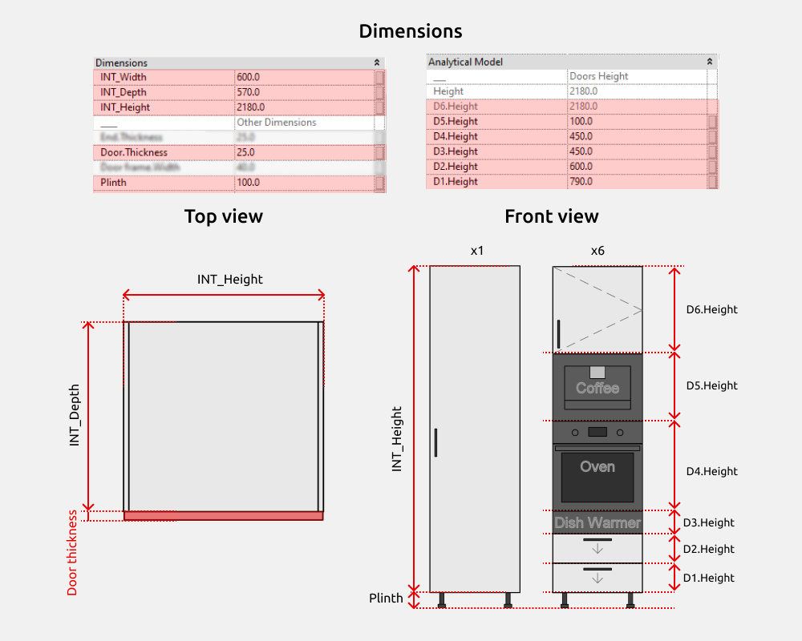

**Width, Depth, Height** of the unit are the dimensions of the frame. **Door thickness, Plinth** - individual parameters.

Due to the fact that there are 6 family types in the family, which means there are 6 doors; you can change individual parameters specifically for each.

If family type **x1** is selected, then we change all the parameters with the number 1: D1.Height (in x1 it is equal to the height of the frame), E1.Type, E1.Closed, D1.Type, D1.Opening, H1.Position. If **x2** is selected, then we change all parameters with numbers 1 and 2.

It is better to start building D.Height from the lower, first door. Because D.Height of the last, upper door does not work.

For example, family type x3 is selected, **D1.Height** and **D2.Height** will be changeable, and **D3.Height** is calculated based on the first two heights.

If D.Height is more than frame Height, there will be an error. If this happens, simply go back and put smaller values in D.Height.

#### Gola

Gola handles in the Tall unit can be placed vertically on the left and right of the frame, and also horizontally between Doors - this is Gola 1, Gola 2, Gola 3, Gola 4.

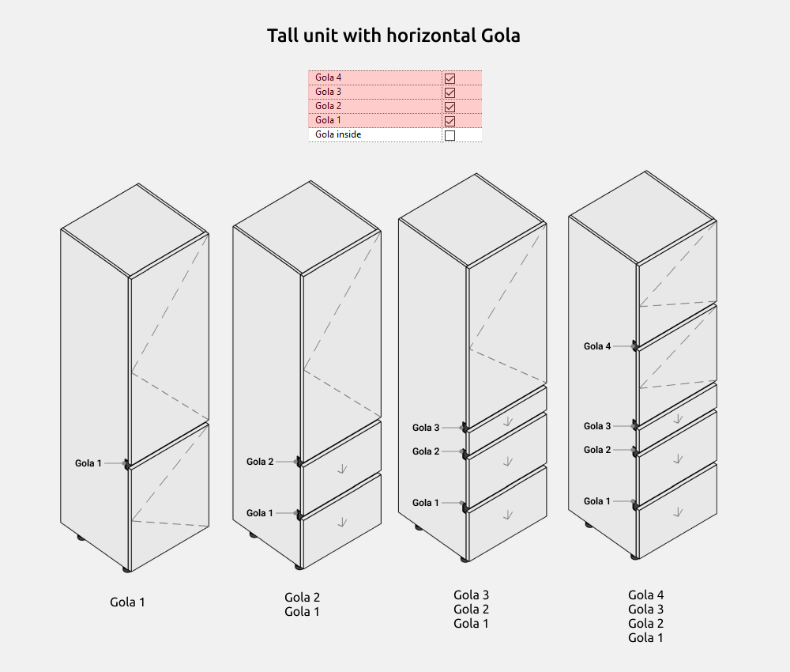

The numbers of the Gola handles go in order from bottom to top, where Gola 1 is the lower handle, and Gola 4 is the upper.

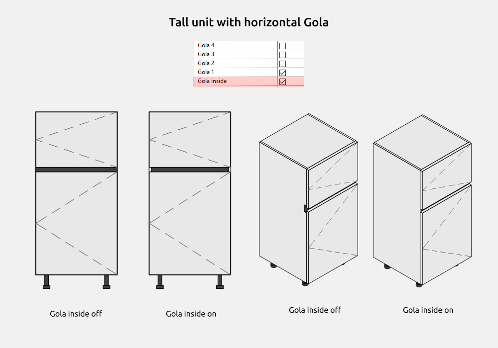

Parameter Gola inside - moves Gola inside the frame, that is the Ends of the Frame become visible.

#### Equipment

Equipment can be installed in place of the door. To do this, you need to select the serial number of the door, where to place the equipment (E.Position) and the equipment type from the drop-down list. Heading - INT 02 E.

There are several types of equipment:

-   Built-in
-   Integrated

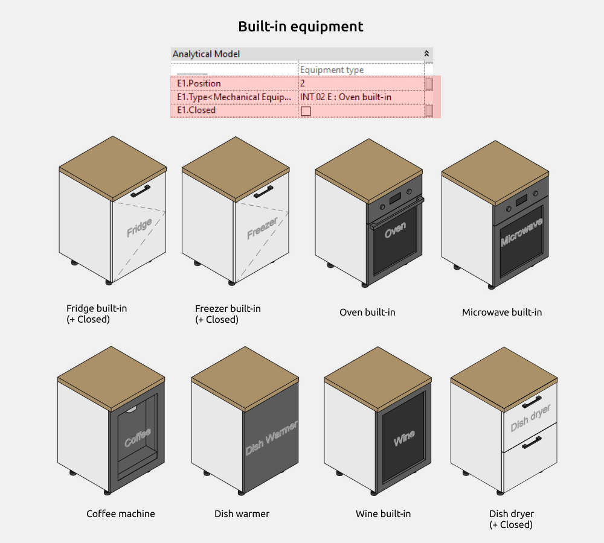

Built-in equipment:

-   Wine built-in
-   Oven built-in
-   Coffee machine
-   Microwave built-in
-   Freezer built-in
-   Dish warmer
-   Fridge built-in
-   Dish dryer

Integrated equipment:

-   Wine integrated
-   Freezer integrated
-   Dishwasher integrated
-   Washing machine
-   Fridge integrated

By default, the equipment has the door height in which it is installed. But if you need to change the dimensions, then put the number 0 in the E.Position parameter and the equipment is freely placed as needed for a specific case. To do this, change E.Base and E.Height.

#### Materials

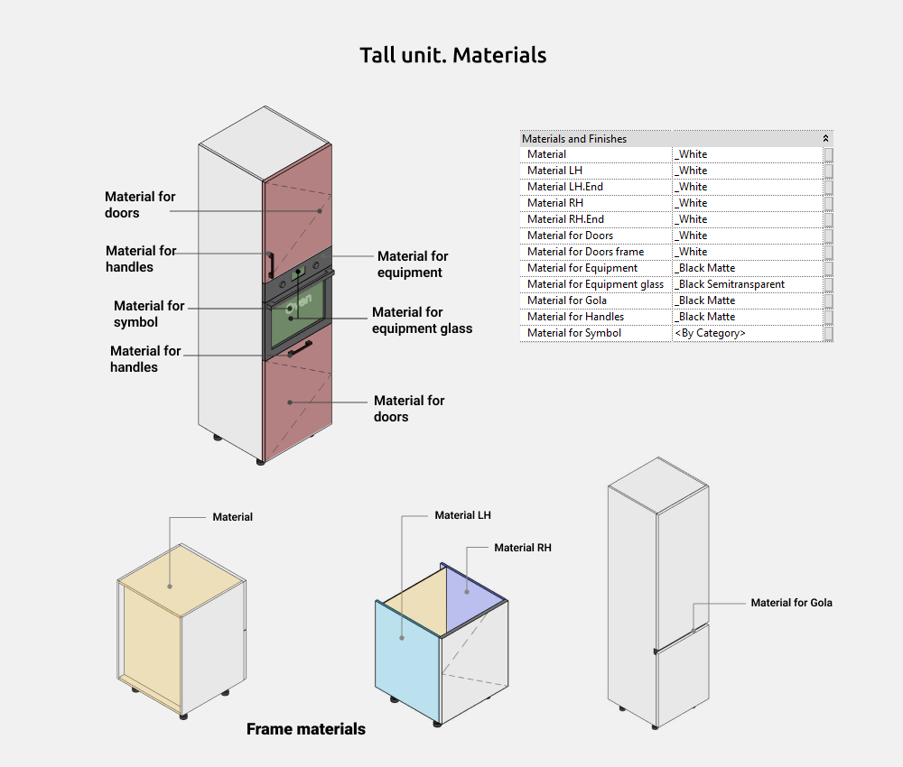

### Wall unit

**Wall unit** is used to build kitchen wall cabinets.

Here you can on/off the following elements:

-   Handles
-   Doors
-   Frame
-   Back
-   Lighting
-   Shelves
-   End: Left, Right

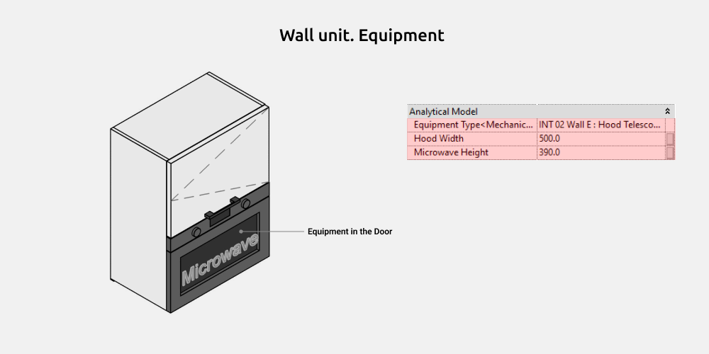

There is also Equipment:

-   Equipment in the Door

#### Number of doors

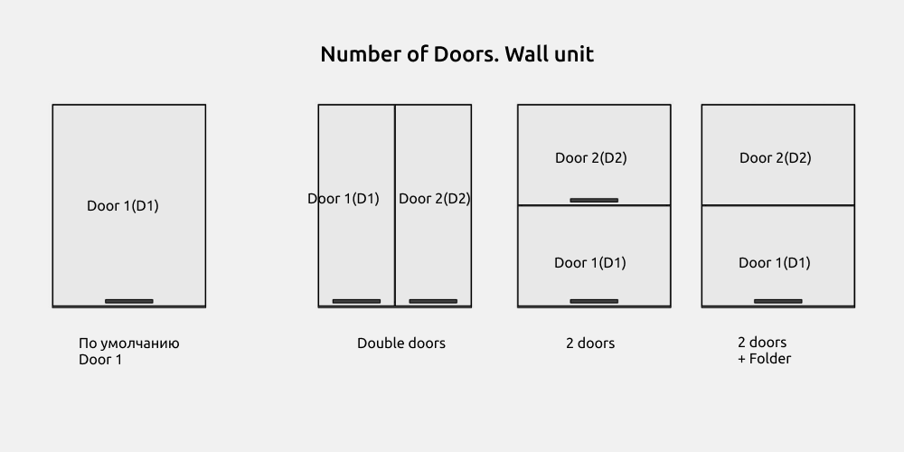

To change the number of doors in the wall unit, you need to select instance parameters, because there are no family types in the family.

There are Doors:

-   Door 1 (by default)
-   Double doors
-   2 doors (you can add Folder opening to this parameter and the top handle will disappear)

#### Number of shelves

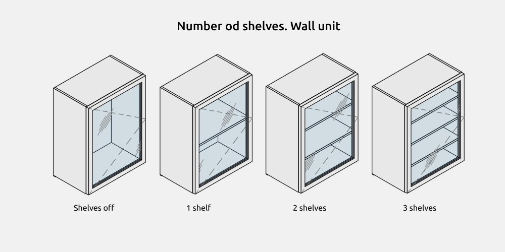

The number of shelves in the wall unit can be from 1 to 3.

#### Dimensions

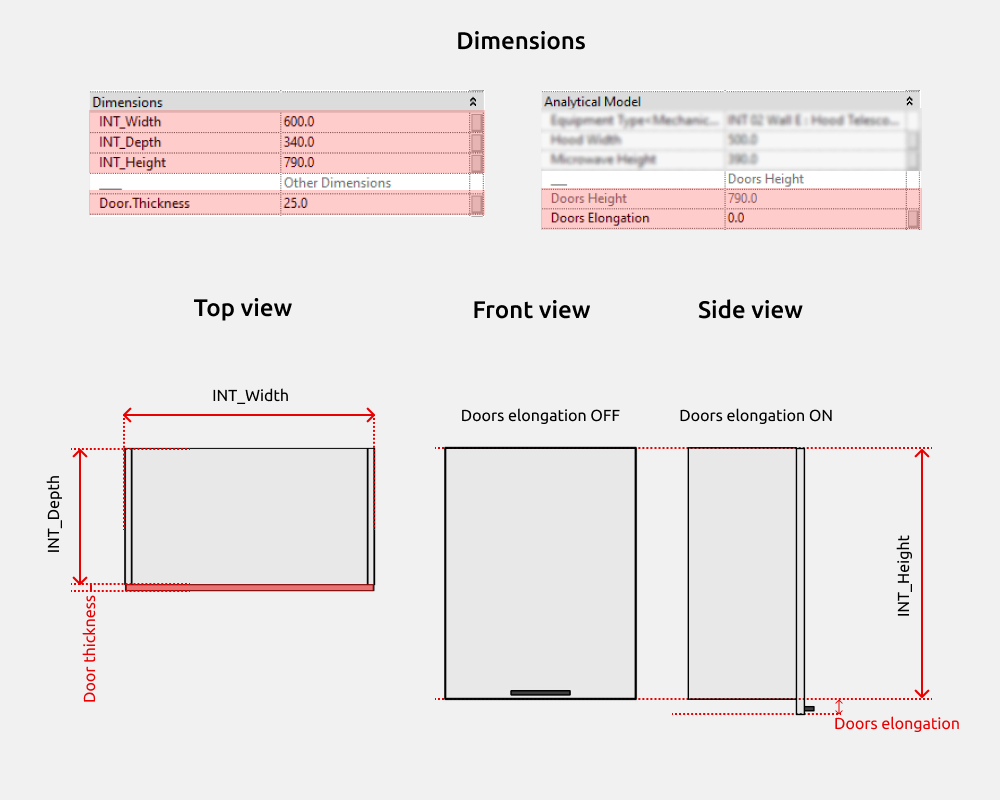

**Width, Depth, Height** of the unit are the dimensions of the frame. **Door thickness** - individual parameters.

**Doors elongation** moves the door downward from the frame by a specified distance.

#### Equipment

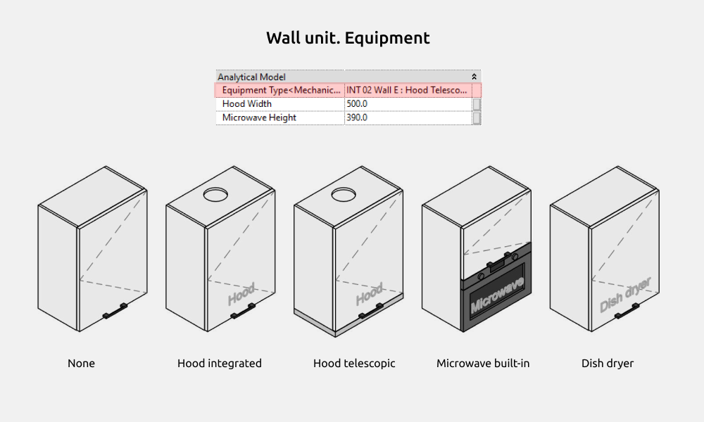

Equipment can be installed in place of the first/lower door. To do this, you need to select the equipment type from the drop-down list.    Equipment type, Heading - INT 02 Wall E.

There are several types of equipment:

-   Hood integrated
-   Hood telescopic
-   Microwave built-in
-   Dish dryer

#### Materials

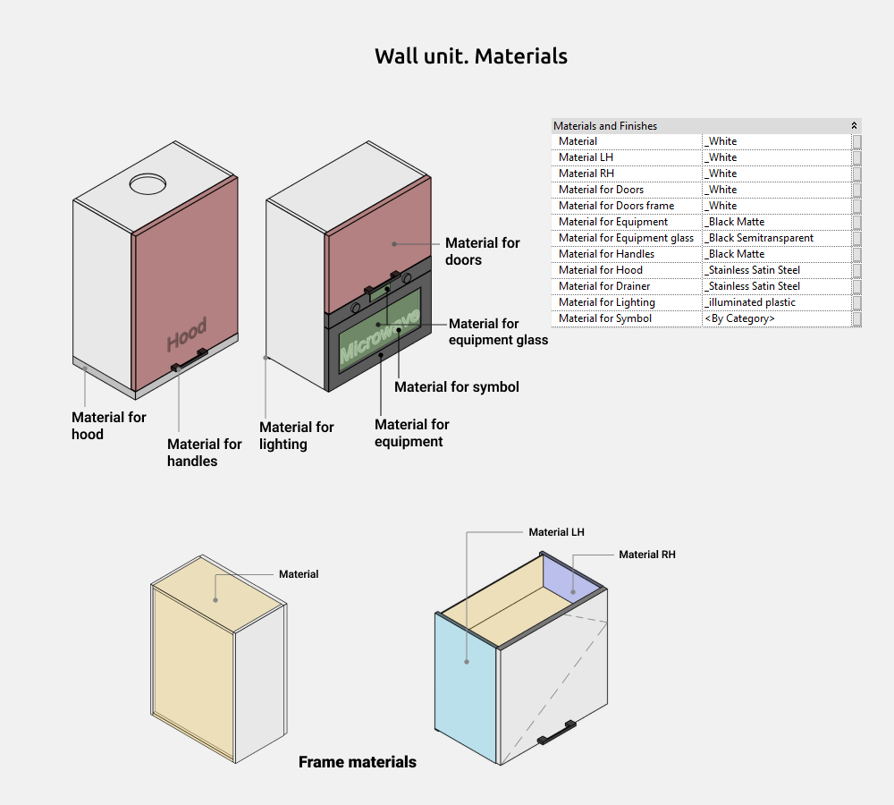

### Wall unit L-angle

**Wall unit L-angle** is used to build corner kitchen wall cabinets.

Here you can on/off the following elements:

-   Handles
-   Doors
-   Frame
-   Back
-   Lighting
-   Shelves
-   End: Left, Right

#### Number of shelves

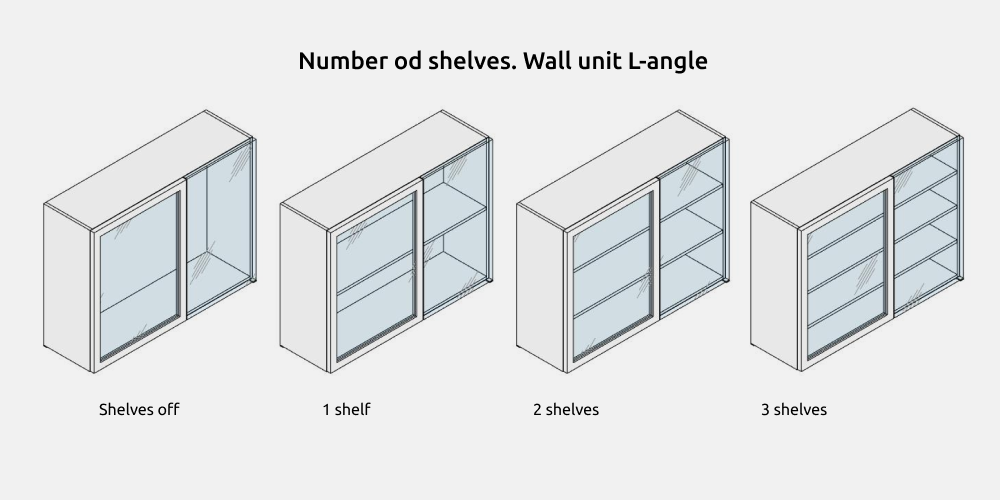

The number of shelves in the wall unit can be from 1 to 3.

#### Dimensions

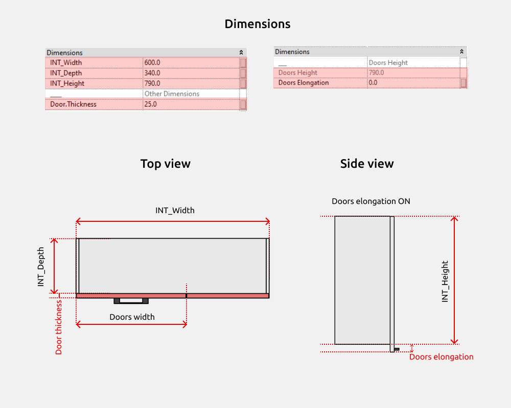

**Width, Depth, Height** of the unit are the dimensions of the frame. **Door thickness** - individual parameters.

**Doors elongation** moves the door downward from the frame by a specified distance.

#### Materials

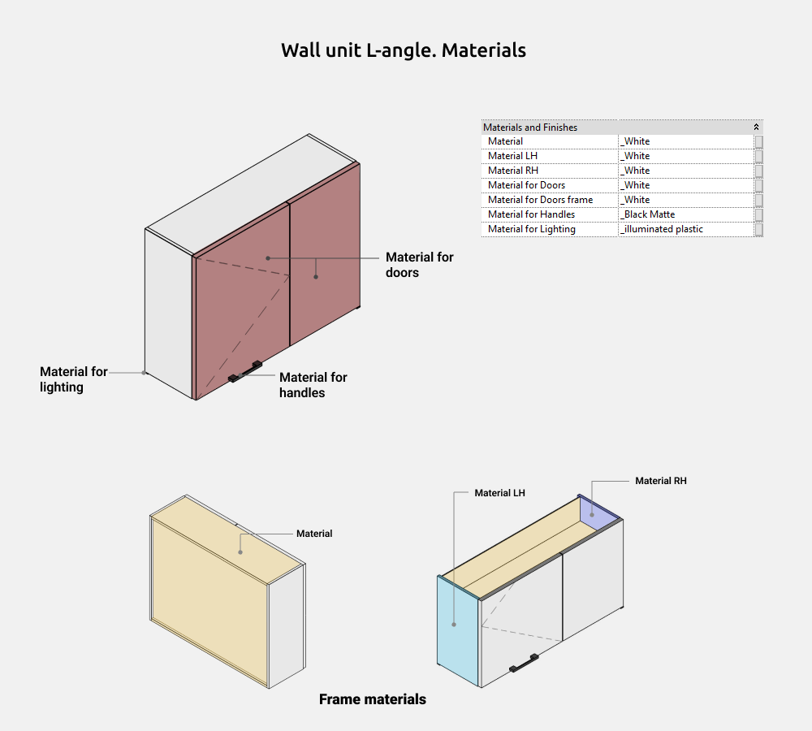

## 5. STYLING

### Graphics settings

To change the color/weight/pattern of family lines, you need to go to Manage - Object Styles - Furniture/ Plumbing Fixtures/ Mechanical Equipment

### Marking

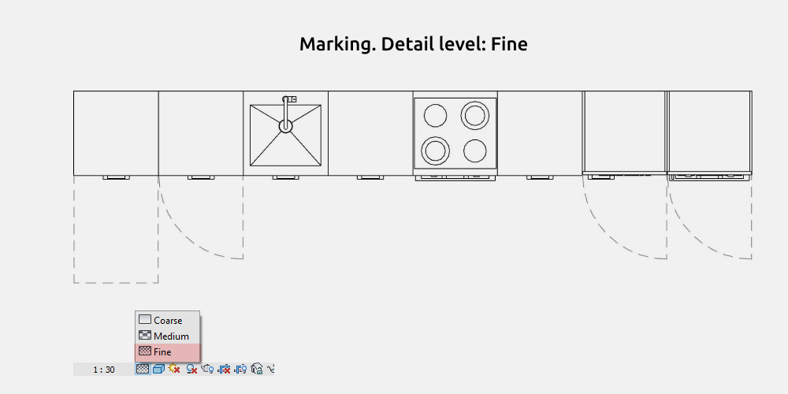

At a **Fine** detail level, Equipment text symbols do not appear on floor plans. But if you turn on the **Medium** or **Coarse** detail level, the text will be visible.

To change the text symbol of equipment, you need to select the equipment in the unit using the Tab key and click Edit Type, then Type Comments.

<CTA type="guide" />
