import productPreview from './product.jpg';

<ProductCard
  name="Lighting Revit Families"
  description="Downlights, pendants, chandeliers, wall lights, floor lamps, LED profiles and track systems — ready to drop into your Revit project."
  image={productPreview}
  imageAlt="Lighting Revit Families — set preview"
  buyUrl="https://bimcore.one/products/lighting-revit-families"
  ecwidProductId="560800271"
/>

## 1. GENERAL INFORMATION

- Set name: Lighting
- Version 1.1.0
- Revit version: 2019

### Description

This set of families is designed for use in Autodesk Revit and BIM projects for interiors and architecture.

Suitable for interior designers and architects. The geometry of lamps and other details is simplified using Revit tools.

Electrical connectors and photometric mesh files have been added to the families.

### Loading and placing into the project

In order to view and download the families from the set, you can open Projects with lighting and copy the families using the Ctrl+C key combination, and then paste them into your project Ctrl+V.

Or open the folder with family files and drag it into the project with the mouse.

Most lighting fixtures are made using a Metric Generic Model face based. Place them on the ceiling plan or 3D view.

## 2. SET STRUCTURE

The set includes the following group of families, category Lighting fixtures:

- Downlights
- Pendant lights
- Chandeliers
- Wall lights
- Stair lights
- Floor and table lamps
- Lights from profile
- Profile (LED)
- Track lights

## 3. COMMON ELEMENTS

Common elements - elements that are repeated in most families.

### Graphic symbols

Graphic symbols – conventional graphic elements. Different levels of detail display different graphic symbols.

**Fine detail level** – The geometry of the lamp looks exactly the same as in 3D.

**Medium detail level** – The scale of the Graphic symbols does not reflect the actual physical dimensions of the light fixtures. The Graphic symbols dimensions can be adjusted individually, by instance.

**Coarse detail level** – The symbol size is proportional to the actual light fixture dimensions.

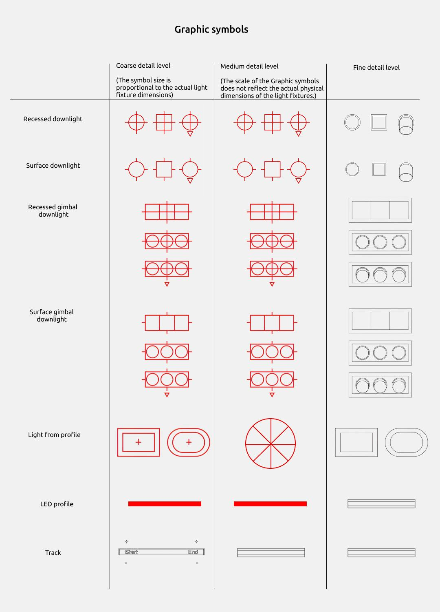

Use any detail level you are comfortable with.

To change the style of the lamps Graphic symbols, go to (Medium detail level): **Manage** > **Object Styles** > **Annotation objects** > **Generic annotations** > **INT 07 Lighting Graphic symbols**

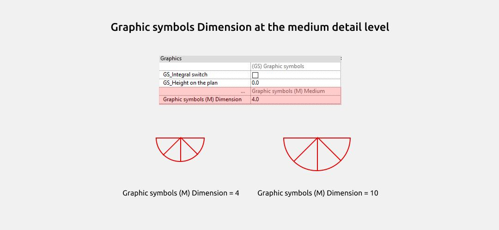

The size (scale) of the GS at the medium detail level can be changed for each instance using the **Graphic symbols (M) Dimension** parameter.

At a coarse detail level, if there's another object above the wall light, it may overlap the GS. Change the value for the **GS_Height on the plan** parameter. Works with Wall lights.

### Subtitles and setting up families

Each lighting family has main sections in Properties:

- **Graphics : Visibility, Options.**
  - In the **Visibility** subtitle you can turn on/off family elements.
  - **Options** - select shape/type/direction/number of elements.

- **Materials and finishes.**
- **Dimensions : Overall dimensions, Placement, Elements dimensions.**
  - The **Overall dimensions** subtitle displays the overall dimensions of the lighting. These are usually grayed out, meaning they are not editable and are calculated automatically using formulas.
  - **Placement** - control of various shifts, offsets, rotations.
  - **Elements dimensions** - control of all possible dimensions (height, width, thickness, diameter).

Parameters can be changed by clicking checkboxes or selecting from a drop-down list.

### Pitched roof

Most light fixtures are made using a Metric Generic Model face based. To ensure the light fixture hangs vertically, rather than at a 90-degree angle to a pitched roof, you can use this method:

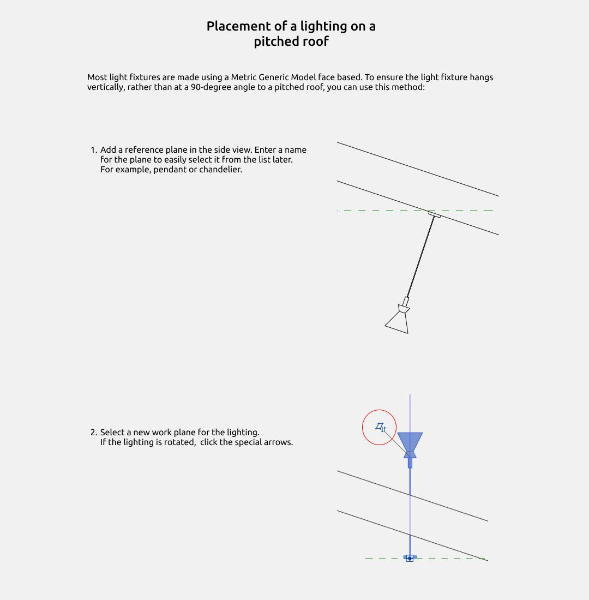

## 4. FAMILIES

### Floor and table lamps

Floor lamps include the following families:

- Floor lamp
- Boom floor lamp
- Cantilever floor lamp

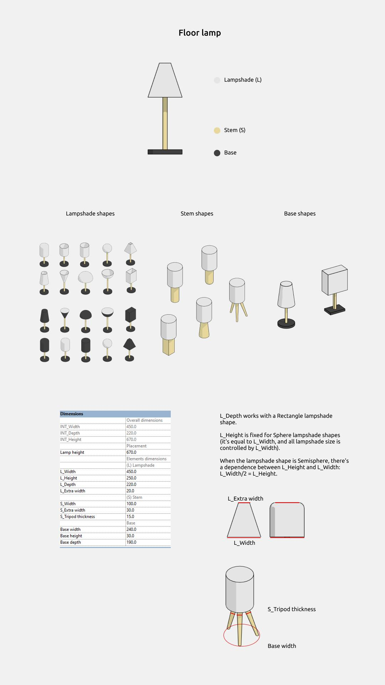

A floor lamp is a standard lighting fixture that can be placed on a cabinet, table or floor.

**L_Height** is fixed for Sphere lampshade shapes (it's equal to **L_Width**, and all lampshade size is controlled by **L_Width**).

When the lampshade shape is Semisphere, there's a dependence between **L_Height** and **L_Width**: **L_Width**/2 = **L_Height**.

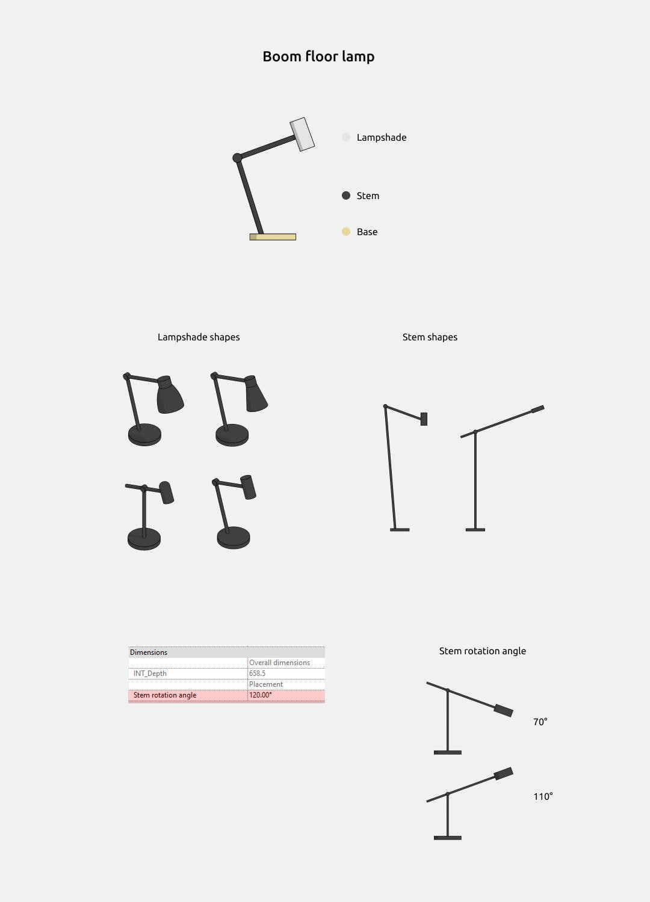

Boom floor lamp has **Stem rotation angle**.

Cantilever floor lamp has additional option **Lampshade offset** to the side.

### Wall lights

Wall lights include the following families:

- Wall light
- Bedside wall light
- Stick wall light
- Disc wall light
- Up-down wall light

And listed separately Stair light

The Wall light family is the basic family in this group, which offers various shade options, shapes and numbers of arms, and sizes.

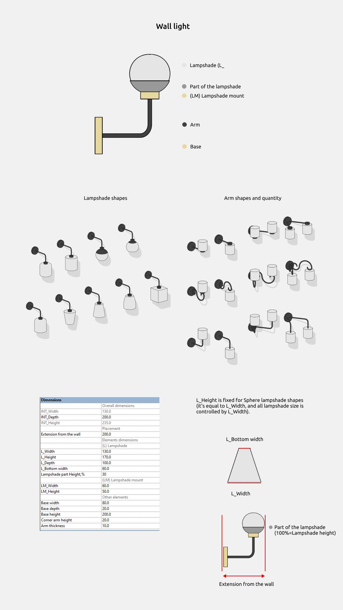

**L_Height** is fixed for Sphere lampshade shapes (it's equal to **L_Width**, and all lampshade size is controlled by **L_Width**).

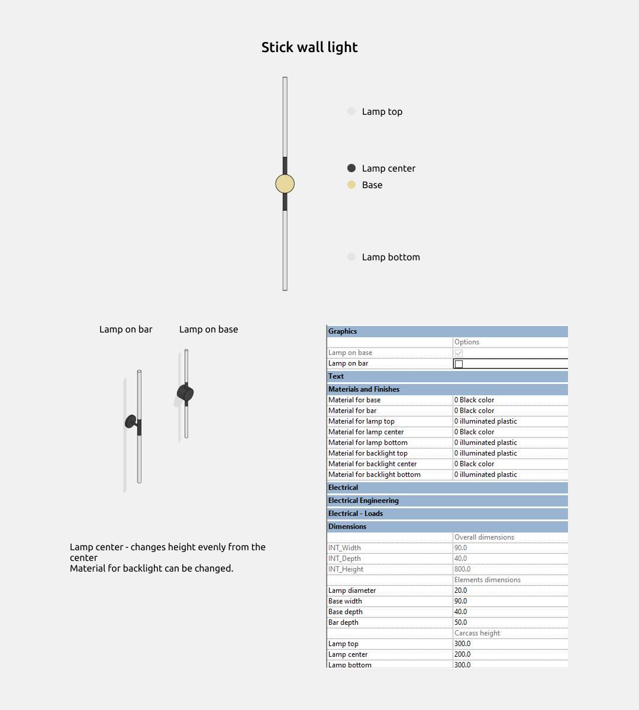

**Lamp center** - changes height evenly from the center.
Material for backlight can be changed.

Also, Stick wall light can be rotated at a given angle.

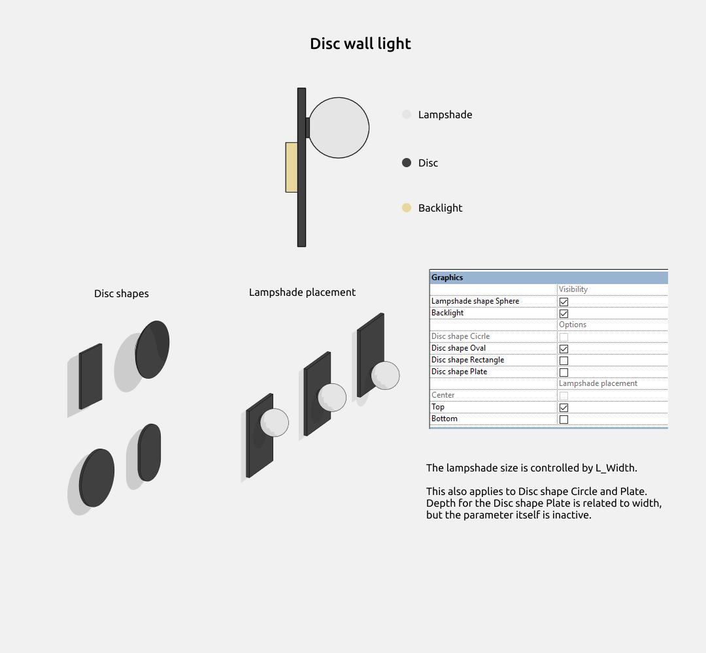

The lampshade size is controlled by **L_Width**.

This also applies to Disc shape Circle and Plate. Depth for the Disc shape Plate is related to width, but the parameter itself is inactive.

To ensure that this family is displayed correctly in the 3D project, you must click Cut Geometry.

### Pendant lights

Pendant lights include the following families:

- Pendant light
- Linear pendant light
- Arched pendant light
- Cloud pendant (It is needed to show a large, volumetric light fixture with complex shapes, which would show the dimensions in space without detailed modeling using Revit tools.)

The Pendant light family is the basic family in this group, which offers various options for lampshades, lampshade mounts, shapes and sizes.

**Part of the lampshade**. 100%=**L_Height**

Used in round lampshade shapes (sphere, sphere trimmed, cap).

Pendant type: 5 lampshades and 7 lampshades.
In these cases, the lampshades are only spherical in shape and are evenly distributed across the carcass. Their number doesn't change, only their size.
However, if you select the Array type, you can edit the parameters in the Array Options.

If the Array type and **Pendant height**=0 is selected, the wire and base are disabled, leaving only the Pendant-array (or, in other words, a Surface-mounted pendant with editable options).
Its height is controlled by the **Pendant-array height** parameter.

**Left** and **Right** parameters work with **quantity of plugs**: Two.

If the quantity is set to One, use the **Width between wires** value.

Base changes along with this parameter. **Base width left** value controls the depth.

### Chandelier

Chandeliers include the following families:

- Chandelier
- Ring chandelier
- Rectangular chandelier

The Chandelier family is the basic family in this group, which has various options for lampshades, lampshade mounts, number of arms, shapes and sizes.

Arm quantity from 3 to 10.

The **L_Bottom** lampshade direction works for Straight arm and Corner arm.
**L_Side** - for Straight arm.

**L_Height** is fixed for Sphere lampshade shapes (it's equal to **L_Width**, and all lampshade size is controlled by **L_Width**).

If the **Pendant height** = 0, the wire and base are removed, leaving the surface-mounted chandelier. Its height is controlled by the frame parameters.

### Downlights

Downlights include the following families:

- Recessed downlight
- Recessed gimbal downlight
- Surface downlight
- Surface gimbal downlight

#### Graphic symbols on sloped base

For all Downlights placed on a sloped base, you can enable Graphic symbols to display them on the plan.

Parameters **Sloped Base** allow to display on the plan a luminaire that is placed on a sloped ceiling or roof.

To make the symbolic representation visible on the plan, the parameter **GS on sloped surface** must be active.

At a coarse level of detail the size of Graphic symbols depends on the luminaire size.

At medium level of detail it is necessary to set the plan scale value for the parameter **Plan scale** and set the desired Graphic symbols size on the sheet for the parameter **GS sloped base size**.

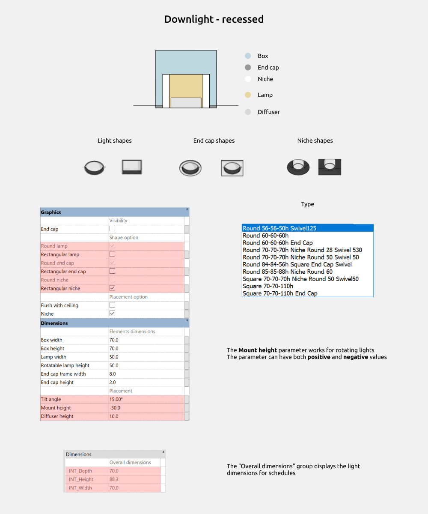

Here you can select Shape option

Light shape:

- Round lamp
- Rectangular lamp

End cap shape:

- Round end cap
- Rectangular end cap

Niche shape:

- Round niche
- Rectangular niche

The **Mount height** parameter works for rotating lights. The parameter can have both positive and negative values.

The **Overall dimensions** group displays the light dimensions for schedules.

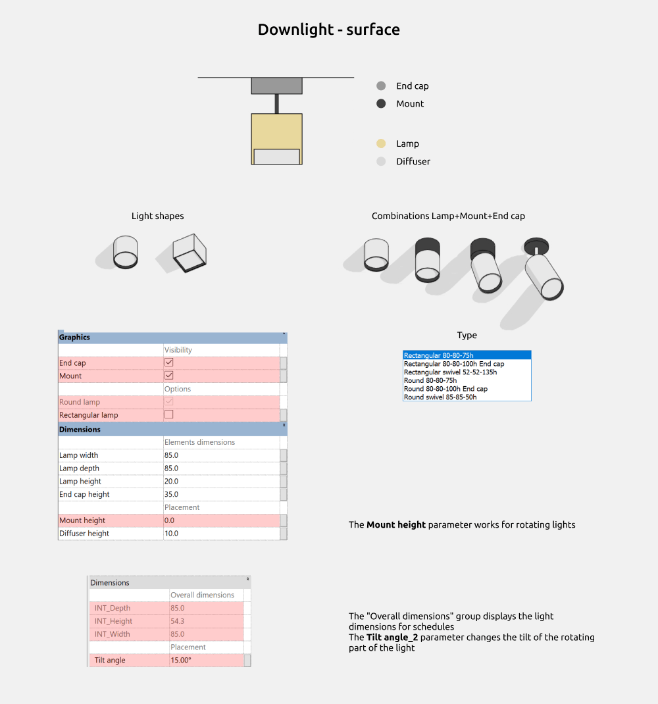

Here you can select Shape option

Light shape:

- Round lamp
- Rectangular lamp

The following elements can be enabled/disabled:

- End cap
- Mount

The **Mount height** parameter works for rotating lights.

The **Overall dimensions** group displays the light dimensions for schedules.

The **Tilt angle_2** parameter changes the tilt of the rotating part of the light.

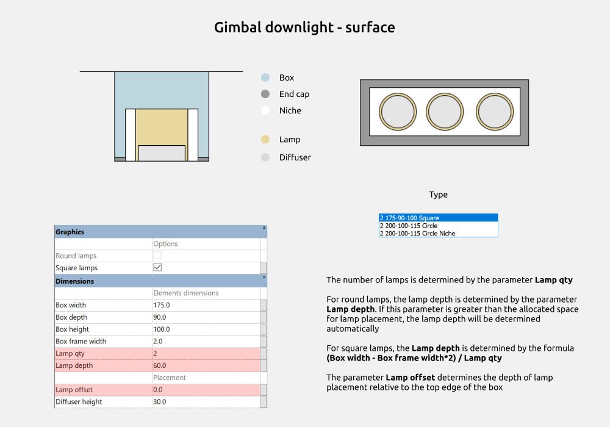

The number of lamps is determined by the parameter **Lamp qty**.

For round lamps, the lamp depth is determined by the parameter **Lamp depth**. If this parameter is greater than the allocated space for lamp placement, the lamp depth will be determined automatically.

For square lamps, the **Lamp depth** is determined by the formula (**Box width** - **Box frame width**\*2) / **Lamp qty**.

The parameter **Lamp offset** determines the depth of lamp placement relative to the top edge of the box.

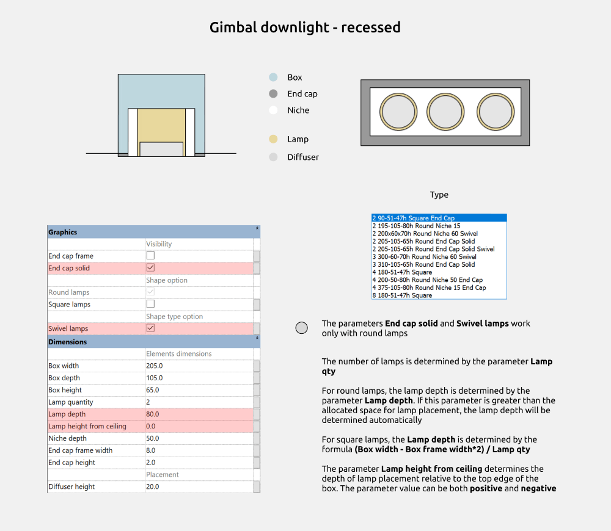

The parameters **End cap solid** and **Swivel lamps** work only with round lamps.

The number of lamps is determined by the parameter **Lamp qty**.

For round lamps, the lamp depth is determined by the parameter **Lamp depth**. If this parameter is greater than the allocated space for lamp placement, the lamp depth will be determined automatically.

For square lamps, the **Lamp depth** is determined by the formula (**Box width** - **Box frame width**\*2) / **Lamp qty**.

The parameter **Lamp height from ceiling** determines the depth of lamp placement relative to the top edge of the box. The parameter value can be both positive and negative.

### Light from profile

Consists of one profile Light.

Here you can select Shape option

Light shape:

- X-shaped
- Y-shaped
- Hexagon
- Round
- Straight
- Rectangular
- Rectangular rounded
- Triangular

Mount shape:

- Recessed
- Surface
- PM_Center
- PM_On the edges

To make the light surface-mounted, you need to uncheck the **Recessed** parameter and set the **Pendant height** parameter to 0.

### LED profile

Consists of one Light - LED profile.

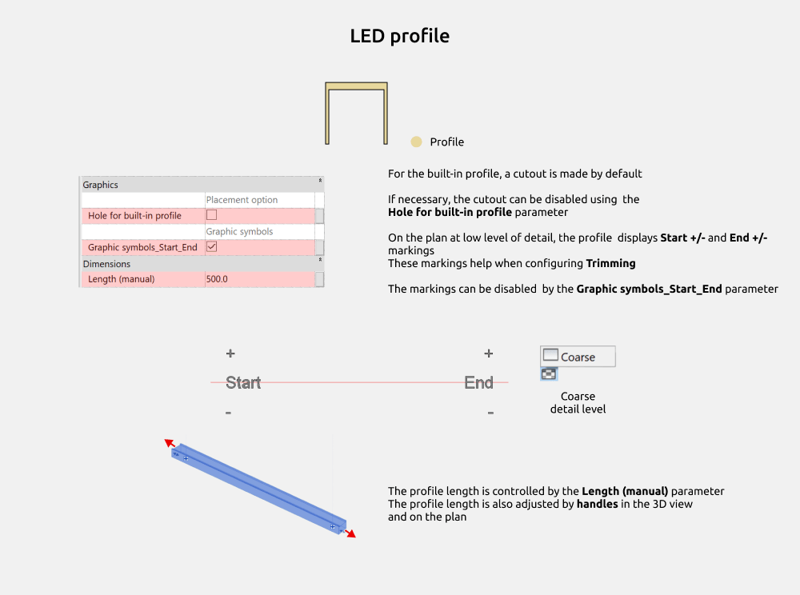

For the built-in profile, a cutout is made by default.

If necessary, the cutout can be disabled using the **Hole for built-in profile** parameter.

On the plan at low level of detail, the profile displays Start +/- and End +/- markings. These markings help when configuring Trimming.

The markings can be disabled by the **Graphic symbols_Start_End** parameter.

The profile length is controlled by the **Length (manual)** parameter. The profile length is also adjusted by handles in the 3D view and on the plan.

The Without trimming value enables end caps on the profile ends and cuts the profile at a right angle.

Trimming + cuts the profile at the specified angle. The angle tip points toward the + direction on the plan

The **T_End angle** parameter accepts the value of the angle between 2 joined profiles Available angle range: from 10° to 170°

Trimming - cuts the profile at the specified angle. The angle tip points toward the - direction on the plan.

Trimming Forward is used for joining 2 profiles at a right angle in different planes (inward).

### Track lights

Track lights include the following families:

- Recessed track
- Surface track
- Recessed curved track
- Surface curved track
- Track light - Adjustable linear
- Track light - Linear
- Track light - Spot

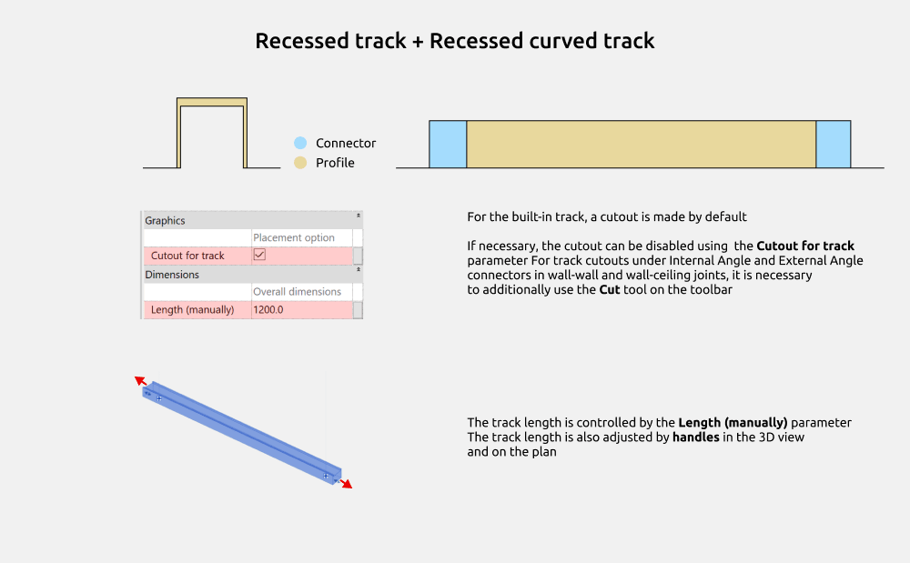

For the built-in track, a cutout is made by default.

If necessary, the cutout can be disabled using the **Cutout for track** parameter.

For track cutouts under Internal Angle and External Angle connectors in wall-wall and wall-ceiling joints, it is necessary to additionally use the Cut tool on the toolbar.

The track length is controlled by the **Length (manually)** parameter.

The track length is also adjusted by handles in the 3D view and on the plan.

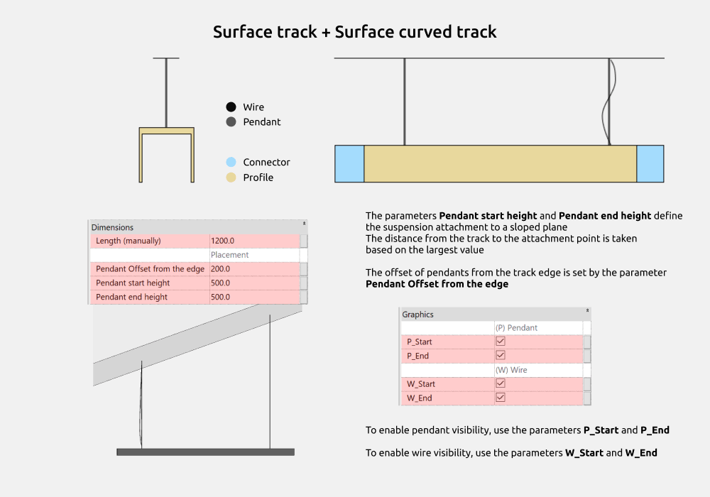

The parameters **Pendant start height** and **Pendant end height** define the suspension attachment to a sloped plane.

The distance from the track to the attachment point is taken based on the largest value

The offset of pendants from the track edge is set by the parameter **Pendant Offset from the edge**.

To enable pendant visibility, use the parameters **P_Start** and **P_End**.

To enable wire visibility, use the parameters **W_Start** and **W_End**.

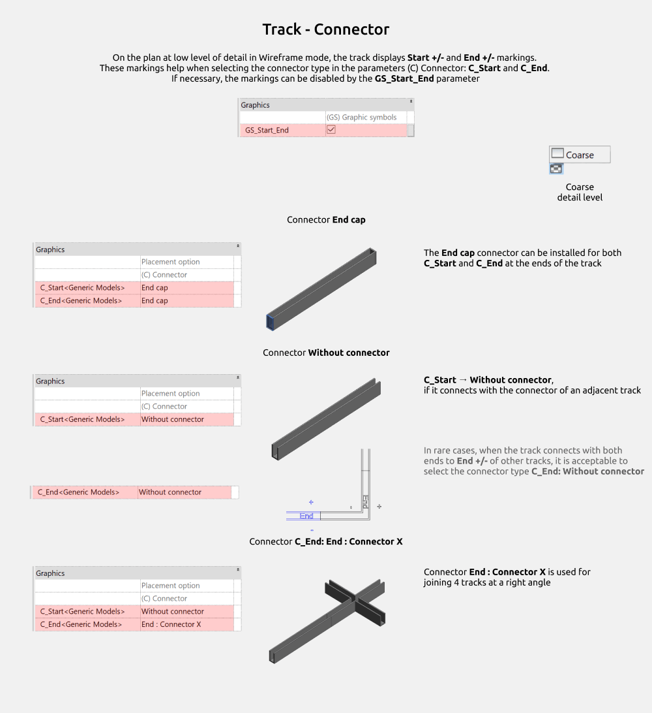

On the plan at low level of detail in Wireframe mode, the track displays Start +/- and End +/- markings.

These markings help when selecting the connector type in the parameters (C) Connector: **C_Start** and **C_End**.

If necessary, the markings can be disabled by the **GS_Start_End** parameter.

Connector:

#### End cap

The End cap connector can be installed for both **C_Start** and **C_End** at the ends of the track.

#### Without connector

Should be selected if the track connects with the connector of an adjacent track.

In rare cases, when the track connects with both ends to End +/- of other tracks, it is acceptable to select the connector type **C_End**: Without connector.

#### Connector X

Connector End : Connector X is used for joining 4 tracks at a right angle.

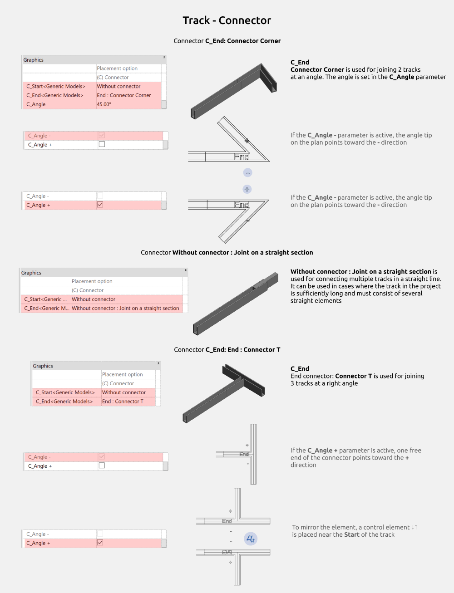

#### Connector Corner

**C_End**: Connector Corner is used for joining 2 tracks at an angle. The angle is set in the **C_Angle** parameter.

If the **C_Angle -** parameter is active, the angle tip on the plan points toward the - direction.

If the **C_Angle +** parameter is active, the angle tip on the plan points toward the + direction.

#### Joint on a straight section

Without connector : Joint on a straight section is used for connecting multiple tracks in a straight line. It can be used in cases where the track in the project is sufficiently long and must consist of several straight elements.

#### Connector T

End connector: Connector T is used for joining 3 tracks at a right angle.

If the **C_Angle +** parameter is active, one free end of the connector points toward the + direction.

To mirror the element, a control element ↓↑ is placed near the Start of the track.

#### Outer corner

End connector: Outer corner is used for joining 2 tracks at a right angle in different planes (outward).

To join with the End : Outer corner connector, in the **C_Start** parameter it is necessary to select the value Without connector : Joint on a straight section.

#### Inner corner

End connector: Inner corner is used for joining 2 tracks at a right angle in different planes (inward).

To join with the End : Inner corner connector, in the **C_Start** parameter it is necessary to select the value Without connector : Joint on a straight section

The **Sloped base** parameters allow you to display on the plan a light that is placed on a sloped track.

To make the symbolic representation visible on the plan, the parameter **GS_On a sloped plane** must be active.

At a coarse level of detail, the size of Graphic symbols depends on the light size.

At medium level of detail, it is necessary to set the plan scale value for the parameter **Scale of the plan** and set the desired Graphic symbols size on the sheet for the parameter **GS_Dimension Sloped plane**.

In cases where track lights need to be placed not on the ceiling or roof, but on the wall, it is necessary to activate the parameter **Graphic symbols on the wall**.

The size of Graphic symbols at medium level of detail will also be controlled by the parameters **Scale of the plan** and **GS_Dimension Sloped plane**.

## 5. Graphic symbols and Figma

For the set of lighting, images of all Graphic symbols by type were added to the **INT_Graphic symbols** and **INT_Graphic symbols 2** parameters.

If you need to change the Graphic symbol in the schedule, you can edit the vector file with the lighting image on the Figma page.

Figma link:

https://www.figma.com/design/Wmf24tLPX4jthdiSWlPSOY/INT-LIGHTING?node-id=4-277&t=zR6X0GsaoMQxt9ry-0

Files can be viewed in any browser, but editing them on the INT LINES page is not possible; you must select everything and copy it to your page.

<u>Algorithm for replacing an image in a project:</u>

- To upload an updated image to a family, find the desired family in the Project browser and click Edit. This will take you to the family editor.
- Here you need to open the Edit Types in the family and replace the values of the **INT_Graphic symbols** parameters for coarse detail level or **INT_Graphic symbols 2** for medium detail level.
- After this, you need to replace the family in the project and select !!!Overwrite the existing version and its parameter values!!!

## 6. STYLING

### Graphics settings

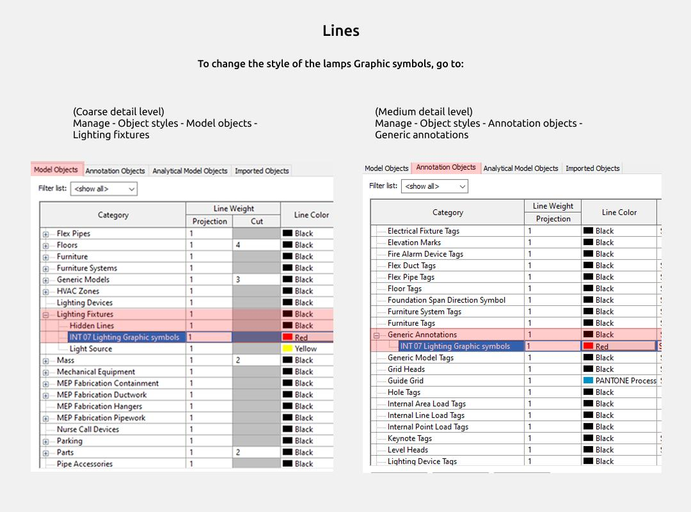

To change the color/weight/pattern of family lines, you need to go to **Manage** > **Object Styles** > **Lighting fixtures**

You can also change lines for one specific plan through Visibility/Graphics Override.

<CTA type="guide" />
