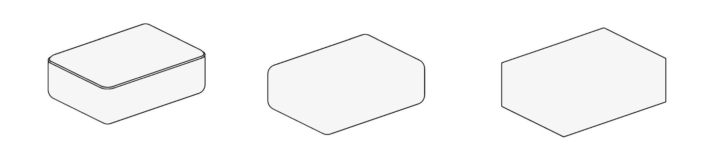
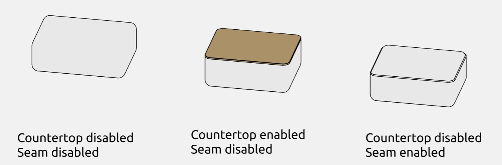
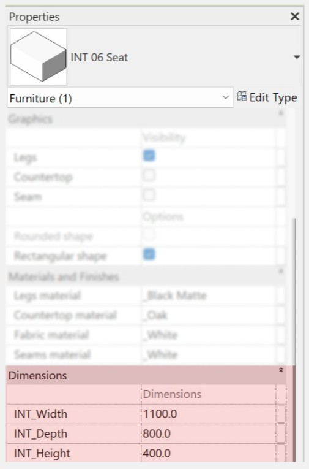
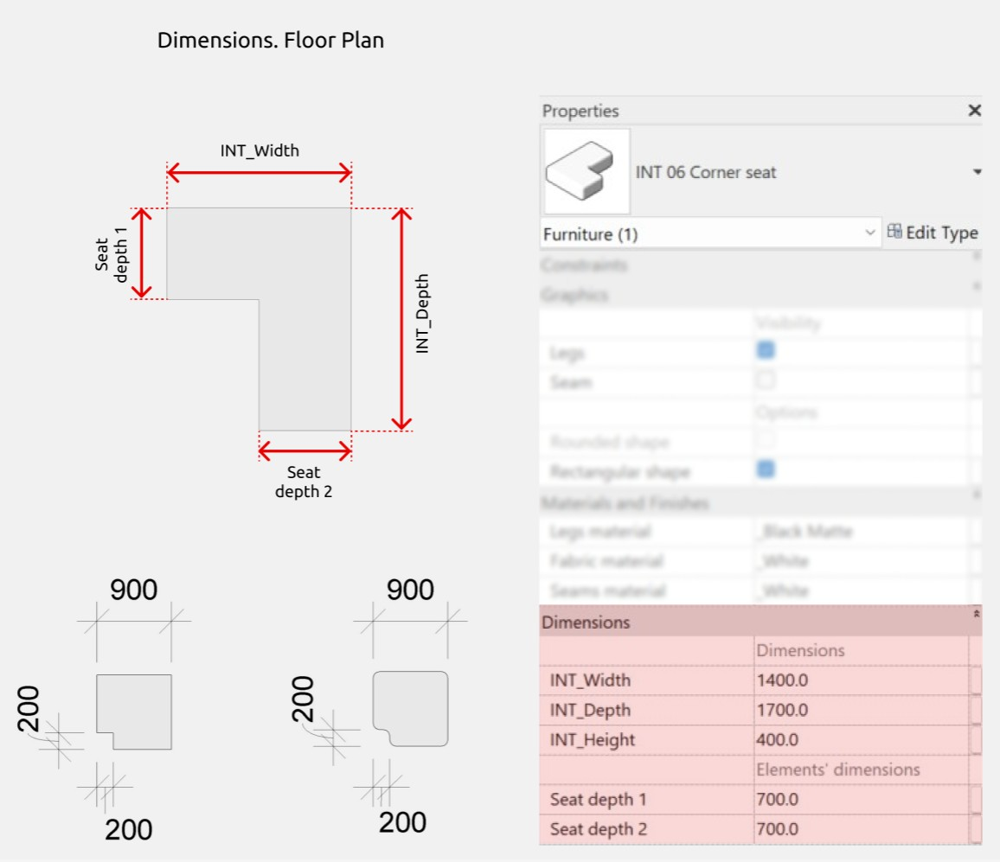
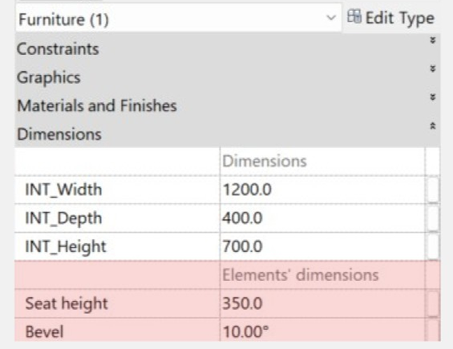
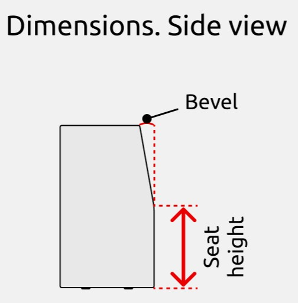
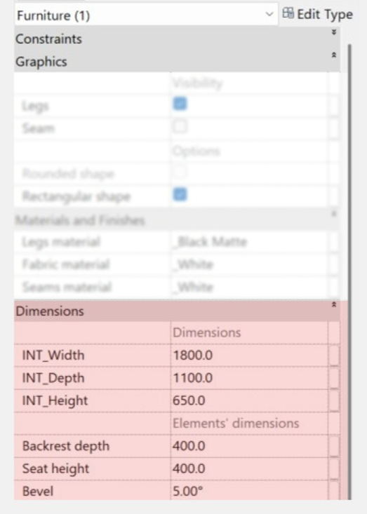
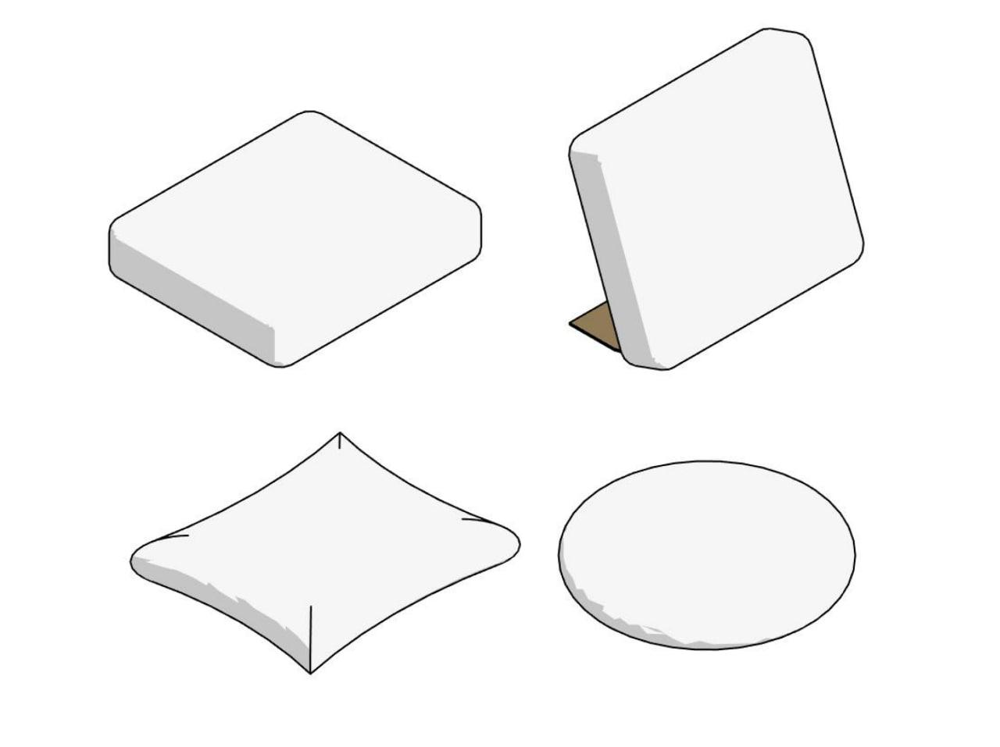
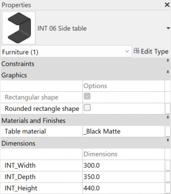

import productPreview from './product.jpg';

<ProductCard
  name="Modular Sofa Revit Families"
  eyebrow="Revit Family Set"
  description="Build any layout from modular sofa sections — ready to drop into your Revit project."
  image={productPreview}
  imageAlt="Modular Sofa Revit Families — set preview"
  buyUrl="https://bimcore.one/products/modular-sofa-revit-families"
  ecwidProductId="543746540"
/>

## 1. GENERAL INFORMATION

-   Set name: Modular sofa
-   Set version 1.0.2
-   Revit version: 2019

### Description

This set of Revit families is designed for flexible modeling of sofas in Autodesk Revit. Suitable for interior designers and architects.

### Loading and placing into the project

In order to view and download the families from the set, you can open **Project with sofas** and copy the families using the Ctrl+C key combination, and then paste them into your project Ctrl+V.

Or open the folder with family files and drag it into the project with the mouse.

## 2. SET STRUCTURE

The set includes the following families:

-   Seat
-   Corner seat
-   Backrest-armrest
-   Corner backrest-armrest
-   Cushion
-   Inclined cushion
-   Side table

## 3. FAMILIES

### Seat

The family is designed to represent the seating in a modular sofa, which is the main furniture component intended for comfortable seating.

The following parameters can be edited:

-   adjusting width, depth, height, and materials;
-   enabling or disabling the "Seam" parameter;
-   a tabletop that can be activated or deactivated;
-   a shape parameter that allows choosing between rectangular or rounded corners.

#### Graphics

The "Graphics" section allows you to adjust the following elements:

-   the "Legs" parameter enables or disables the visibility of the seat legs;
-   the "Countertop" parameter enables or disables a countertop on the top surface of the seat;
-   the "Seam" parameter controls the display of the seam on the seat;
-   the "Rectangular shape" parameter allows switching between a rectangular or more rounded seat shape. If this parameter is unchecked, the seat will default to a rounded shape.

#### Materials

#### Dimensions

INT_Height is a height parameter that includes the height of the countertop and legs if they are enabled.

### Corner seat

The “Corner seat” family is used for placing seats in corner configurations.

Just like in a regular seat, the following parameters are supported:

-   changing width, depth, height, and materials;
-   enabling or disabling the "Seam" parameter;
-   a shape parameter that allows choosing between rectangular or rounded corners.

#### Elements’ dimensions

In the "Dimensions" section there is a subsection called "Elements’ dimensions" where the "Seat depth 1" and "Seat depth 2" parameters can be managed. These allow you to adjust the seat depth on both sides of the module.

### Backrest-armrest

The "Backrest-armrest" family is used when support for the back and arms is required. It also serves as a decorative element, allowing for various sofa configurations.

Here, you can enable or disable legs and seam, switch between rectangular or rounded shapes, and set materials for all elements.

#### Elements’ dimensions

The “Seat height” parameter allows to edit the seat height, while the“Bevel” parameter allows to adjust the tilt angle of the top part of the module.

### Corner backrest-armrest

The “Corner backrest-armrest” family is similar to the regular "Backrest-armrest" but it is designed for corner configurations.

The family has the same parameters as the "Backrest-armrest" family, as well as the "Backrest depth" parameter, which will be discussed later.

#### Elements’ dimensions

The "INT_Depth" parameter in the "Dimensions" section controls the depth of the entire family, while the "Backrest depth" parameter in the "Elements’ dimensions" subsection allows you to adjust the depth of the backrest itself.

The "Seat height" and "Bevel" parameters function identically to the same parameters in the "Backrest-armrest” family.

### Cushion

The "Cushion" family is intended for decorative purposes.

The family parameters allow you to edit the cushion's dimensions and material, as well as switch between cylindrical and trapezoidal shapes.

### Inclined cushion

The “Inclined cushion” family is intended for decorative purposes, as well as for indicating support for other objects.

The “Inclined cushion” family has the same parameters as the "Cushion" family, and it also allows to:

-   switch between three cushion shapes (round/rectangular/Oxford);
-   enable or disable a stand (if the stand is enabled, its material can also be edited);
-   adjust the tilt angle of the cushion.

### Side table

The "Side table" family is designed for visualizing a coffee table, work surface, a place for drinks and snacks, a gadget holder, or as a decorative element.

In the family parameters, you can edit its dimensions and material, as well as choose between a rectangular or rounded shape.

<CTA type="guide" />
