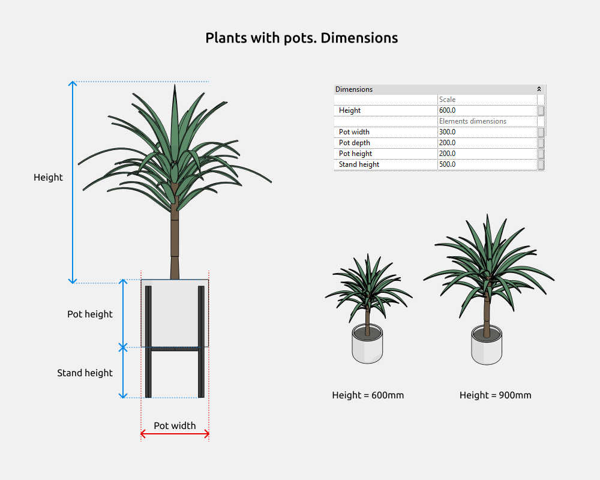
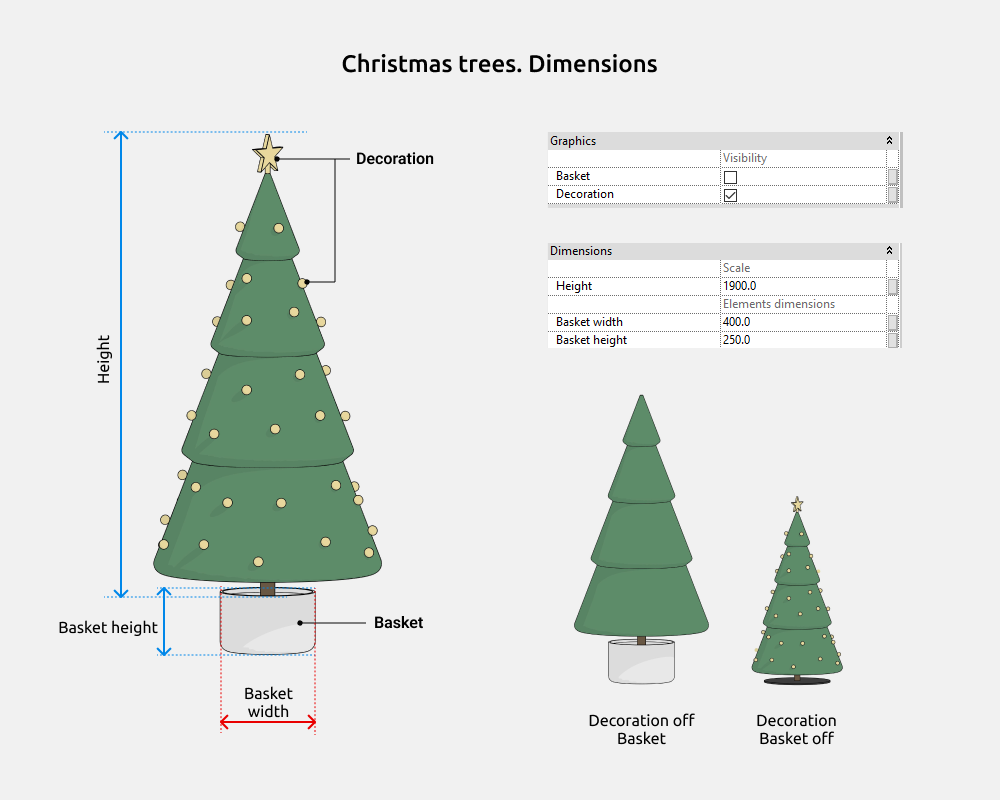
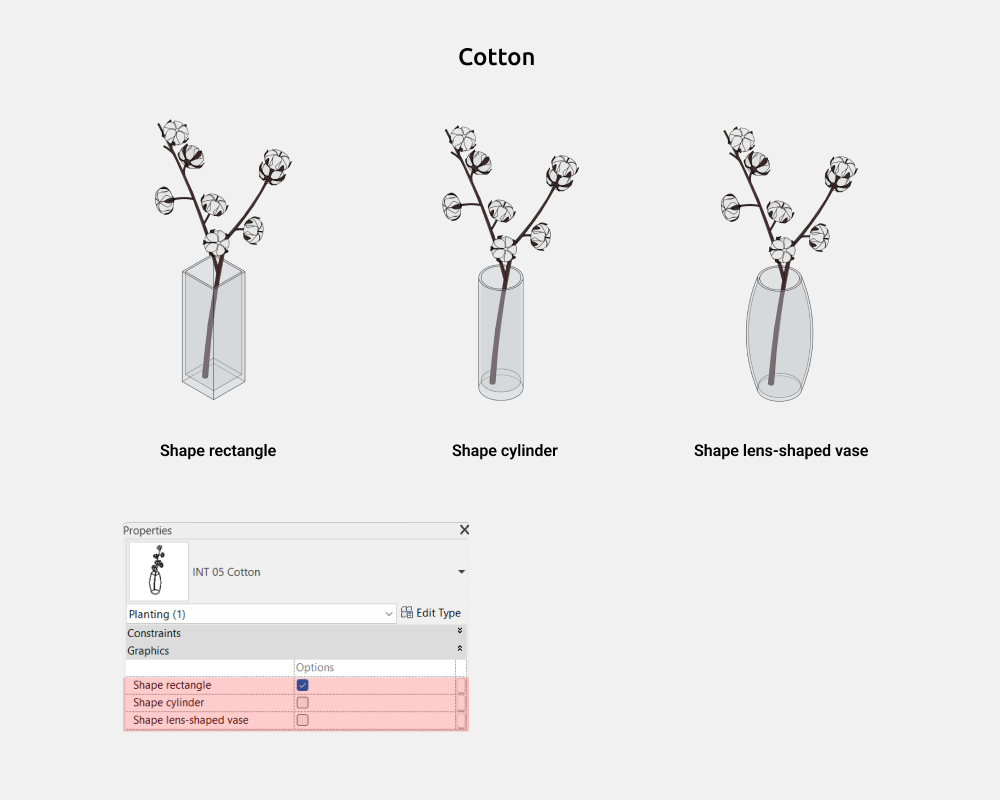
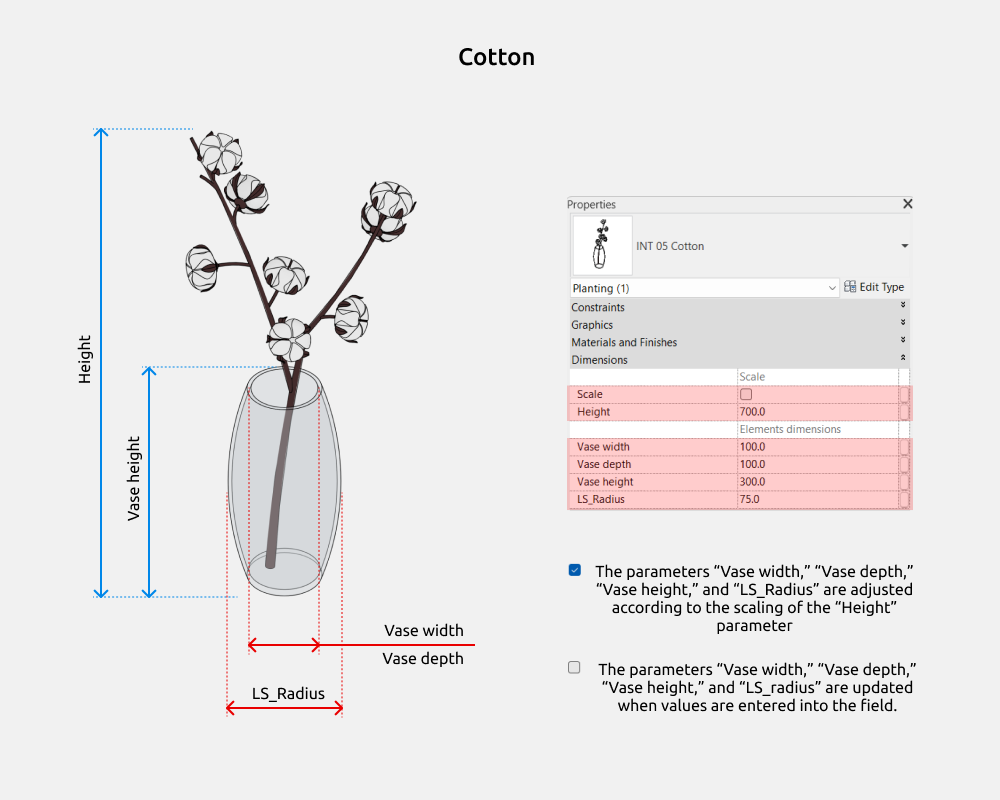

import productPreview from './product.jpg';

<ProductCard
  name="Plants Revit Families"
  eyebrow="Revit Family Set"
  description="Indoor plants and pots in various shapes — ready to drop into your Revit project."
  image={productPreview}
  imageAlt="Plants Revit Families — set preview"
  buyUrl="https://bimcore.one/products/plants-revit-families"
  ecwidProductId="543589695"
/>

## 1. GENERAL INFORMATION

-   Set name: Plants
-   Version 1.3.0
-   Revit version: 2019

### Description

This set of Revit families is made for modeling indoor plants with pots or vases in Autodesk Revit.

Using families, you can create planting in the interior. Suitable for interior designers and architects. The geometry of leaves and flowers is made by the tools of Revit.

### Loading and placing into the project

In order to view and download the families from the set, you can open **Project with plants** and copy the families using the Ctrl+C key combination, and then paste them into your project Ctrl+V.

Or open the folder with family files and drag it into the project with the mouse.

## 2. SET STRUCTURE

The set includes the following families (category Planting):

-   Monstera
-   Strelitzia
-   Dracaena
-   Sansevieria
-   Ficus Umbellata
-   Ficus
-   Hoya
-   Eucalyptus in a vase
-   Cotton
-   Pineapple plant
-   Christmas tree 1-7 (7 different shapes)
-   Present

## 3. FAMILIES

### Plants with pots

In families with pots you can on/off the following elements:

-   Stand (for pot)

Pots shapes: cylinder, rounded cylinder, rectangle.

In families there is a parameter “Height”, which changes the scale of the plant.

In the rectangular pot, you can change the width and depth. But in cylinders “Pot depth” does not work, only “Pot width”.

### Christmas trees

In families Christmas trees you can on/off the following elements:

-   Basket
-   Decoration (star and lights)

In families there is a parameter “Height”, which changes the scale of the plant.

### Cotton

Vases shapes: cylinder, rectangle, lens-shaped.

Scale allows locking the parameters Vase width, Vase depth, Vase height, and LS_Radius to adjust the vase dimensions proportionally to the cotton plant.

When the “Scale” checkbox is unchecked, all vase dimension values can be entered manually.

<CTA type="guide" />
