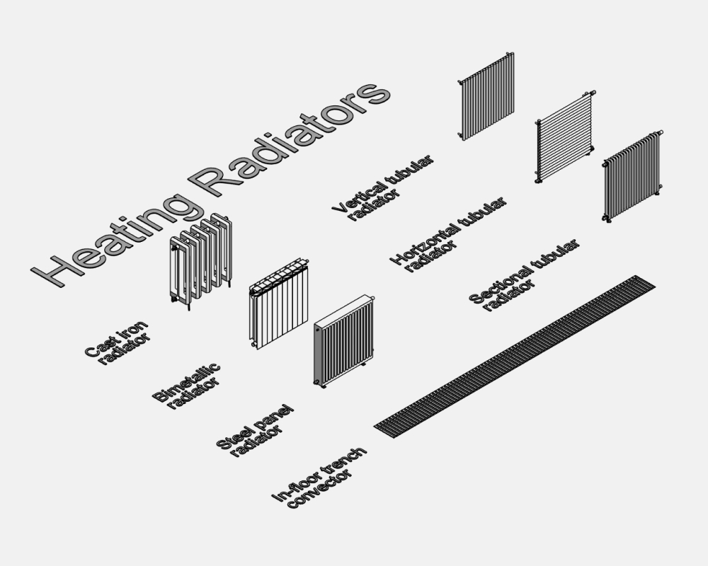
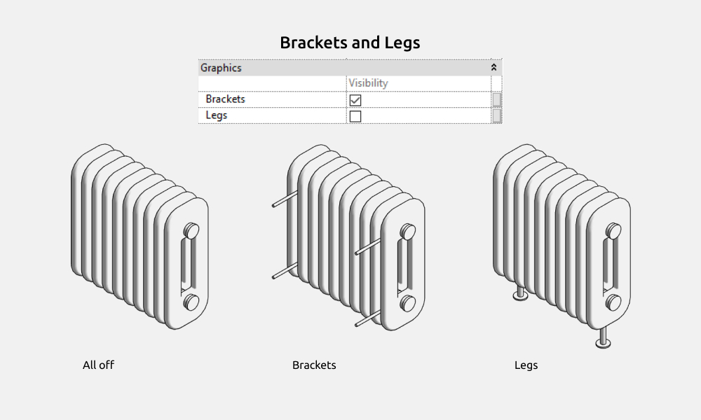
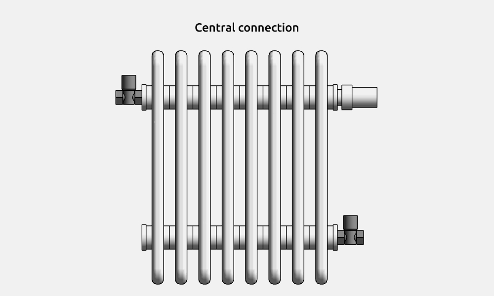

import productPreview from './product.jpg';

<ProductCard
  name="Radiators Revit Families"
  eyebrow="Revit Family Set"
  description="Panel, column and towel radiators — heating families ready to drop into your Revit project."
  image={productPreview}
  imageAlt="Radiators Revit Families — set preview"
  buyUrl="https://bimcore.one/products/radiators-revit-families"
  ecwidProductId="577117112"
/>

## 1. GENERAL INFORMATION

- Set name: Heating Radiators
- Version 1.1.0
- Revit version: 2019

### Description

This set of Revit families is made for modeling heating radiators in Autodesk Revit.

Allows you to create radiators with precise dimensions.

Suitable for interior designers and architects.

### Loading and placing into the project

In order to view and download the families from the set, you can open *Project with heating radiators* and copy the families using the Ctrl+C key combination, and then paste them into your project Ctrl+V.

Or open the folder with family files and drag it into the project with the mouse.

The set includes families in the Plumbing Fixtures category and Pipe Accessories.

## 2. SET STRUCTURE

Families:

- Cast iron radiator
- Bimetallic radiator
- Steel panel radiator
- Vertical tubular radiator
- Horizontal tubular radiator
- Sectional tubular radiator
- In-floor trench convector

The families include shared parameters with the “INT” prefix, which can be scheduled.

A material can be assigned to all radiators using the INT_Material parameter.

## 3. COMMON ELEMENTS

Common elements are elements that are frequently repeated within families.

### Dimensions

All radiators have overall dimensions

INT_Width

INT_Depth

INT_Height

In families

- Cast iron radiator
- Bimetallic radiator

the overall dimensions are not entered manually; they are calculated from the section size parameters and the number of sections.

In families

- Vertical tubular radiator
- Horizontal tubular radiator

The INT_Depth parameter is not set manually; it is calculated from the dimensions of the horizontal and vertical channels.

You can specify the installation height and the distance to the wall.

For horizontal channels, a vertical offset parameter is provided.

In families

- Bimetallic radiator
- Steel panel radiator
- Vertical tubular radiator
- Horizontal tubular radiator
- Sectional tubular radiator

paired bottom connection can be selected.

For the paired bottom connection, an offset from the left edge of the radiator is specified.

The distance between the bottom connection valves is 50 mm.

### Brackets and Legs

All radiators allow you to choose brackets — their size is controlled by the Distance to Wall parameter.

Legs are configured using the Installation Height parameter. They can be either round or square. Cast iron radiators have only one leg shape option.

### Bottom Connection

In families

- Bimetallic radiator
- Steel panel radiator
- Vertical tubular radiator
- Horizontal tubular radiator
- Sectional tubular radiator

A bottom connection is предусмотрен — it can be either paired or independent, with Straight and Angled connection options available.

### Central connection

Radiators offer several fitting options for the central connection. The parameters include so-called “hints.” These are short texts that help explain the function of the selected parameter. To view a hint, hover your mouse over the parameter name. For the top outlets, you can choose from six elements.
For the bottom outlets, you can choose from four elements.

### Mark

The set includes the Mark Heating radiators Dimensions family, which allows you to display the overall dimensions of the radiators.

## 4. FAMILIES

### In-floor trench convector

The In-floor trench convector is installed using the Place on Face command, ensuring it is correctly cut out of the floor.

For the convector, you can specify the material, overall dimensions, supply and return placement, and connection diameter.
A Fill option has been added — when enabled, a white rectangle appears in the plan view.

### Cast iron radiator

The cast iron radiator can have two or three channels.

For a section depth up to 150 mm, it is two-channel; for 150 mm and above, it is three-channel.

<CTA type="guide" />
