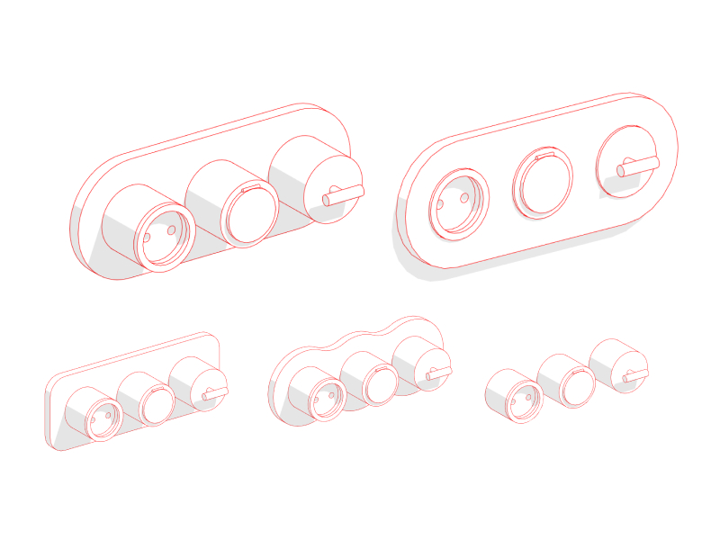
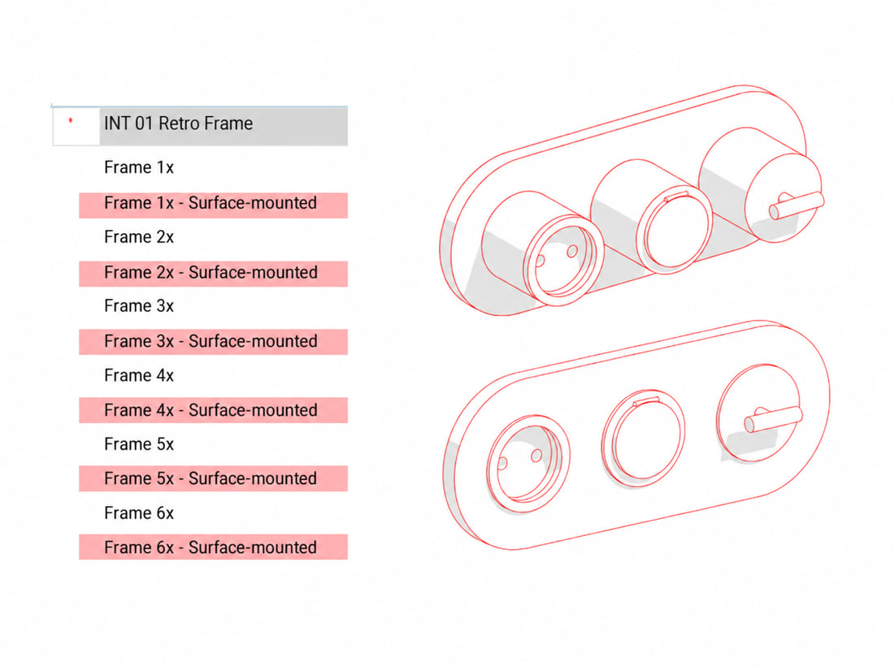
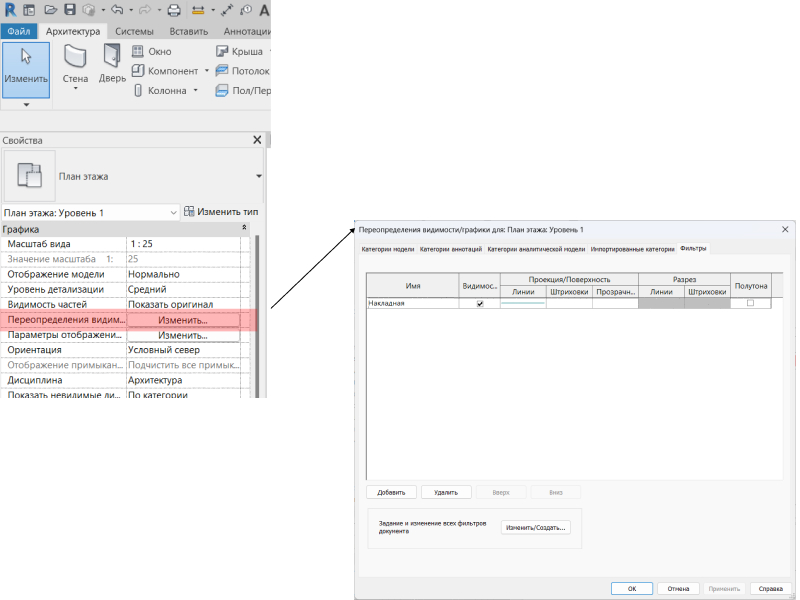
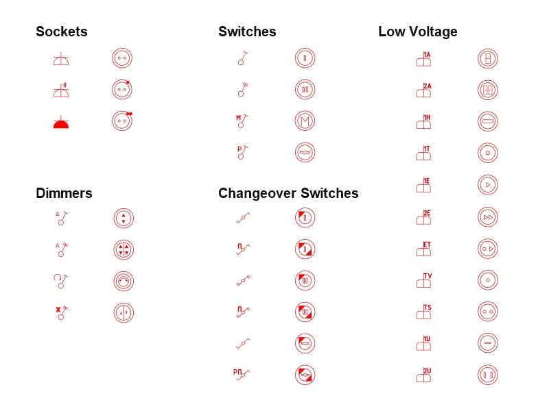
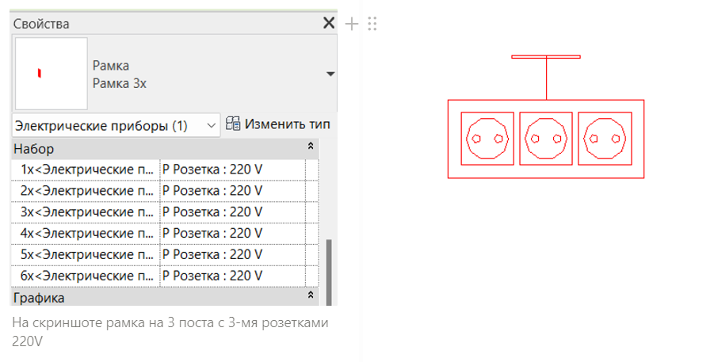
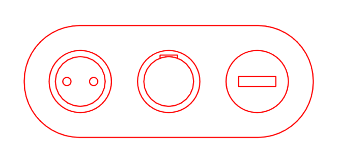

import productPreview from './product.jpg';

:::note
The families in this set are currently available in Russian only. Screenshots, file names and parameter names are kept in Russian so you can find them in Revit. The explanations below are in English.
:::

<ProductCard
  name="Retro Socket Revit Families"
  description="Retro-style sockets and switches ready to place in your Revit project."
  image={productPreview}
  imageAlt="Retro Socket Revit Families — set preview"
  buyUrl="https://bimcore.one/products/retro-style-socket-revit-families"
  ecwidProductId="660613460"
/>

## Introduction

These families complement the Sockets set. The vintage-style sockets and switches follow the same workflow and use similar symbols, so you can use both sets in one project.

## 1. Set contents

The sample project contains the loaded families and schedules.

17 Проект Ретро-Розетки.rvt

Loadable families.

- Retro frame (INT 01 Рамка ретро.rfa)
- Face-based retro frame (INT 01 Рамка грань ретро.rfa)

Tags.

- INT 01 Марка розеток.rfa
- INT 01 Марка розеток — 21.rfa

## 2. Loading the families

INT 01 Рамка ретро is the main family. Place it against a wall in a floor plan or reflected ceiling plan. You can set its mounting height.

INT 01 Рамка грань ретро is placed on a face in a plan or 3D view. It is mainly used on floors and ceilings. It has no independent mounting height because it sits on the selected face without an offset.

Load both families into your project, or copy them from the sample project with Ctrl+C and paste them into your project with Ctrl+V.

For INT 01 Рамка ретро, **INT_Отступ** sets the height above the floor. For INT 01 Рамка грань ретро, the mounting height depends on the face on which the family is placed.

## 3. Surface-mounted and flush-mounted frames

Each frame has two types, flush-mounted (Встроенная) and surface-mounted (Накладная). Select the type you need to change how the frame is mounted.

You can highlight surface-mounted mechanisms with a colour using the visibility/graphics filter from the sample project.

Open your project and the retro sockets sample project. In your working project, use Transfer Project Standards to copy the required parameters and visibility/graphics filter.

## 4. Mechanisms

The set includes 3 socket types, 4 switch types, 6 changeover switch types, 4 dimmer types and low-current mechanisms.

To fill the frame, choose the socket or switch family from the drop-down lists for **1х**, **2х**, **3х**, **4х**, **5х** and **6х**. The prefixes В and Р identify switches and sockets respectively.

## 5. Editing symbols

To change a device symbol in a schedule, edit its vector image file. The files are collected in a folder.

They are saved as .svg files. You can edit them in a desktop or online vector editor such as Figma, and view them in any browser.

### Replacing an image in the project

Find the family in the Project Browser and choose Edit to open it in the Family Editor.

Open Family Types and replace **INT_Условное обозначение** for the coarse detail level, or **INT_Условное обозначение 2** for the medium detail level.

Load the family back into the project and choose the option to overwrite the existing version and its parameter values.

## 6. Schedules

The INT Проект Розетки project contains ready-made schedules.

Copy them from one sheet to another with Ctrl+C and Ctrl+V, or use Insert from File and select INT Проект Розетки.

### Included schedules

- Symbol legend (Легенда условных обозначений)
- Frame schedule (Спецификация рамок)
- Switch schedule (Спецификация выключателей)
- Socket schedule (Спецификация розеток)

<CTA type="guide" />
