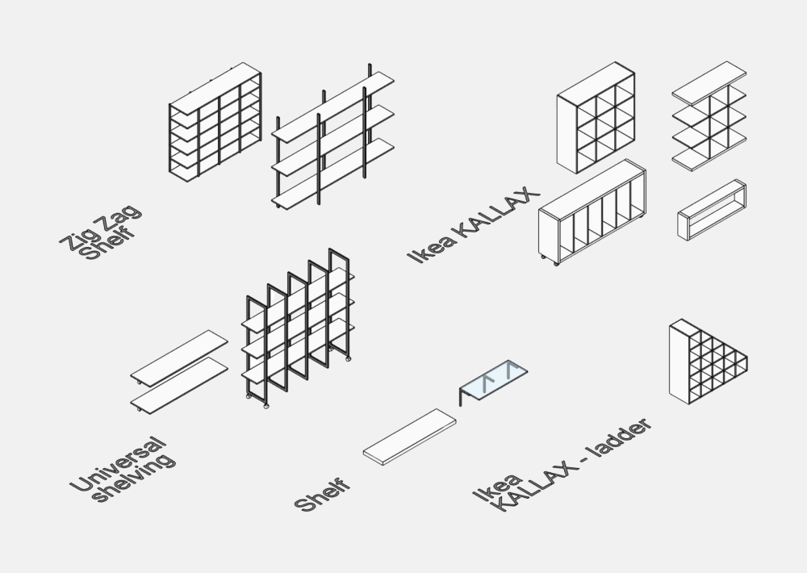
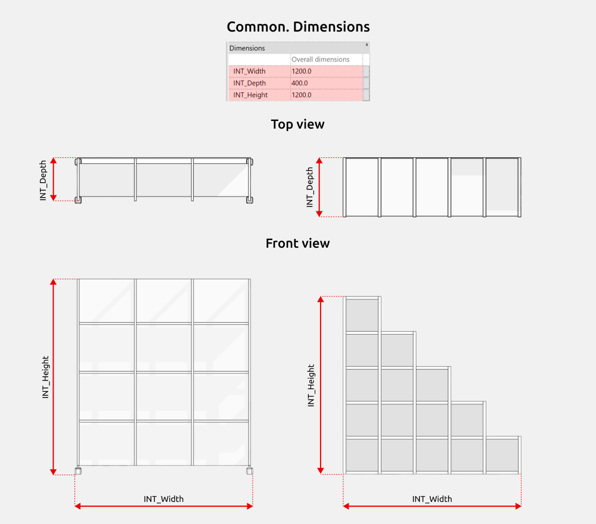
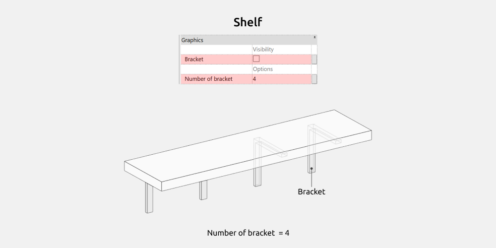
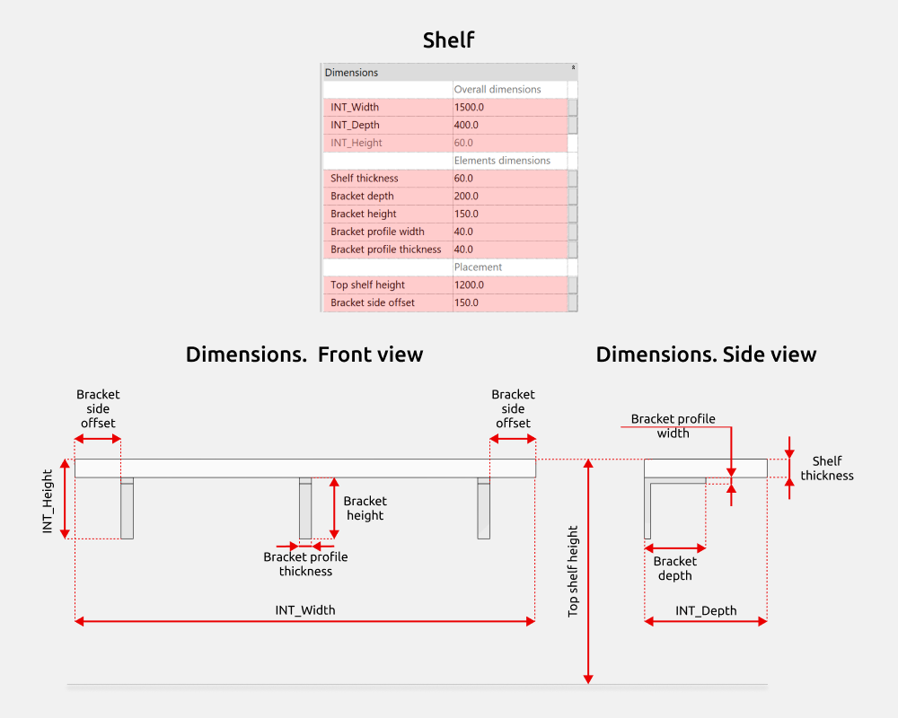
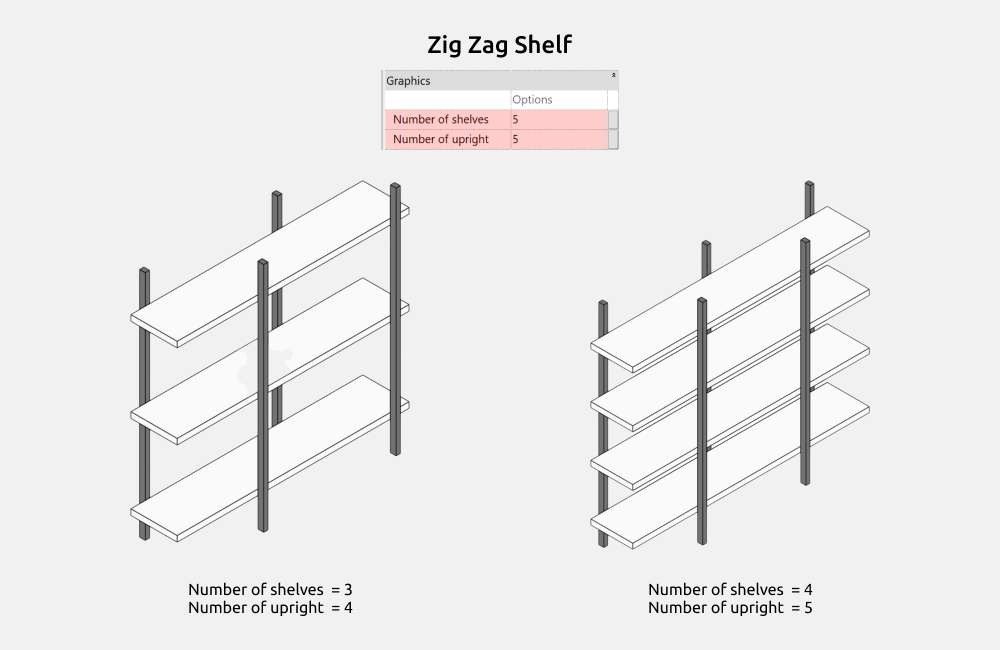
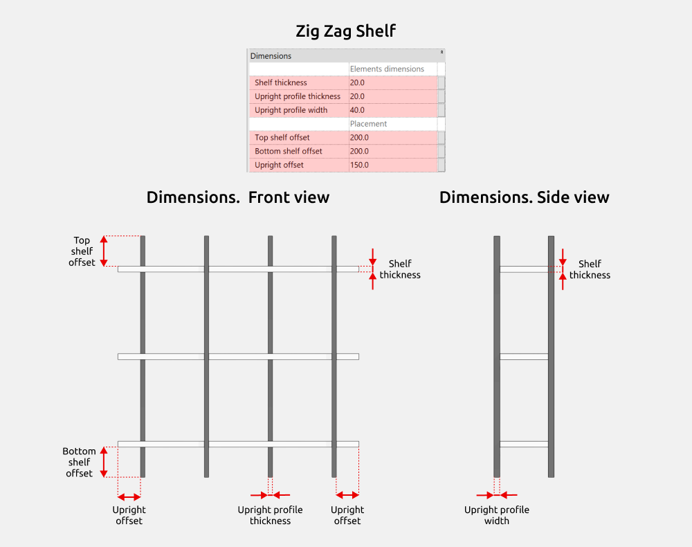
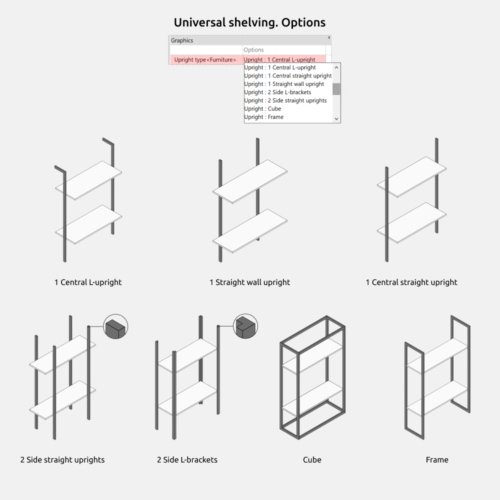

## 1. GENERAL INFORMATION

- Set name: Shelving
- Version: 1.1.0
- Revit version: 2019

### Description

The set of Revit shelving families is designed for work in Autodesk Revit and for use in BIM interior and architectural projects. The library includes parametric shelving and storage‑decoration families.

The set is intended for interior designers, architects and drafters working in Autodesk Revit on residential and public projects.

### Loading and placing into the project

In order to view and download the families from the set, you can open *Project with shelving* and copy the families using the Ctrl+C key combination, and then paste them into your project Ctrl+V.

Or open the folder with family files and drag it into the project with the mouse.

## 2. SET STRUCTURE

The set includes the following shelving families:

- Ikea KALLAX - ladder
- Ikea KALLAX
- Shelf
- Universal shelving
- Zig Zag Shelf

Decoration families:

- Book
- Box
- File holder
- Frame
- Plastic box
- Ring binder
- Taper candle from 10 mm
- Wide candle from 100 mm

## 3. FAMILIES: PARAMETERS AND ELEMENTS

### Shelving

##### Common. Dimensions

The parameters “INT_Width”, “INT_Depth” and “INT_Height” control the overall dimensions of the shelving units.

#### Ikea KALLAX - ladder

Here you can turn on/off the following elements:

- Back panel

You can change the number of internal walls using the “Internal walls quantity” parameter.

#### Ikea KALLAX

Here you can turn on/off the following elements:

- Left side panel
- Right side panel
- Internal panel
- Top shelf
- Bottom shelf
- Wheels
- Back panel

You can change the number of shelves using the “Number of shelves” parameter.

You can change the number of internal walls using the “Number of internal panels” parameter.

##### Dimensions

“Side panel thickness”: thickness of the internal walls.

“Back panel depth”: depth of the back panel.

“Shelf thickness”: thickness of the internal shelves.

“Outer contour thickness”: thickness of the side panels (left/right) and of the outer shelves (top/bottom).

#### Shelf

Here you can turn on/off the following elements:

- Bracket

You can change the number of brackets using the “Number of bracket” parameter.

##### Dimensions

The parameters “INT_Width”, “INT_Depth” and “INT_Height” control the overall dimensions of the shelf.

There are gray‑colored parameters that cannot be controlled. However, they are needed to understand the size calculations. For example, “INT_Height”. The parameter shows the height of the shelf and is composed of the shelf thickness and the bracket height.

The height at which the shelf is placed can be controlled using the “Top shelf height” parameter.

The offset of the brackets along the shelf width can be controlled using the “Bracket side offset” parameter.

#### Zig Zag Shelf

For the zigzag shelving unit, you can change the number of shelves and uprights using the “Number of shelves” and “Number of upright” parameters.

##### Dimensions

The offset of the uprights along the shelving unit width is controlled by the “Upright offset” parameter.

The thickness and width of the upright profile are set using the “Upright profile thickness” and “Upright profile width” parameters.

The offset of the top and bottom shelves is adjusted using “Top shelf offset” and “Bottom shelf offset”.

The thickness of the shelf is controlled by the “Shelf thickness” parameter.

#### Universal shelving

Here you can turn on/off the following elements:

- Left upright
- Right upright
- Internal uprights
- Bracket
- Wheels

Selection of back panel type:

- B_Solid
- B_Bracing

For the shelving unit, you can change the number of shelves and internal uprights using the “Number of shelves” and “Number of internal uprights” parameters.

##### Dimensions

The offset of the uprights along the shelving unit width is controlled by the “Upright/bracket offset” parameter.

The thickness and width of the upright profile are set using the “Upright profile thickness” and “Upright profile width” parameters.

The offset of the top and bottom shelves is adjusted using “Top shelf offset” and “Bottom shelf offset”.

The thickness of the shelf is controlled by the “Shelf thickness” parameter.

The offset of the brackets along the shelving unit width can be controlled using the “Upright/bracket offset” parameter.

The dimensions of the bracket can be controlled using the “Bracket depth”, “Bracket height”, “Bracket profile thickness” and “Bracket profile width” parameters.

##### Options

In the options you can select the upright type:

- 1 Central L-upright
- 1 Straight wall upright
- 1 Central straight upright
- 2 Side straight uprights
- 2 Side L-brackets
- Cube
- Frame

### Decor

The decoration family set allows you to fill shelving units and open storage systems in the interior for different scenarios.

The families have flexible dimensional settings (height, width, depth), enabling you to precisely adapt the contents to the specific height, depth, and width of the shelves.

<CTA type="guide" />
