import productPreview from './product.png';

<ProductCard
  name="Sideboards Revit Families"
  eyebrow="Revit Family Set"
  description="Sideboards, dressers and chests of drawers — ready to drop into your Revit project."
  image={productPreview}
  imageAlt="Sideboards Revit Families — set preview"
  buyUrl="https://bimcore.one/products/dresser-revit-families"
  ecwidProductId="615953573"
/>

## 1. GENERAL INFORMATION

-   Set name: Sideboards and Dressers
-   Version: 1.0.0
-   Revit version: 2019

### Description

This set of Revit families is intended for modeling sideboards and dressers in Autodesk Revit.
The families allow you to create sideboards and dressers of various configurations with precise dimensions. The set is suitable for interior designers and architects. For furniture manufacturers, the families are not sufficiently detailed for production modeling.

### Loading and placing into the project

To view and load the required families from the set, you can open the **Sideboards and Dressers Project** and copy the families using the Ctrl+C keyboard shortcut, then paste them into your project using Ctrl+V.

Alternatively, you can open the folder containing the family files and drag them into the project using the mouse.

## 2. SET STRUCTURE

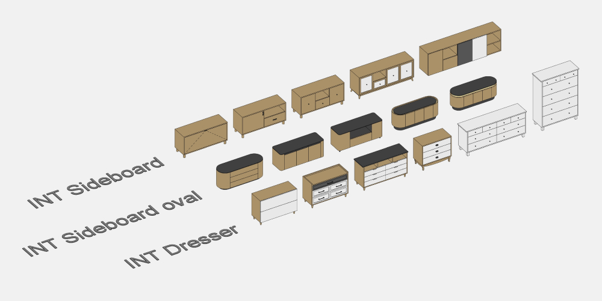

The set includes the following families:

-   Sideboard
-   Sideboard oval
-   Dresser

## 3. COMMON FAMILY ELEMENTS (DRESSER AND SIDEBOARD)

This section describes the repeating elements and options available in the **Dresser** and **Sideboard** families.

### Doors

In the door type dropdown list:

-   STD.front (flat front panel)
-   FR.Front (front panel with an external frame)
-   INT.front (with integrated handle)

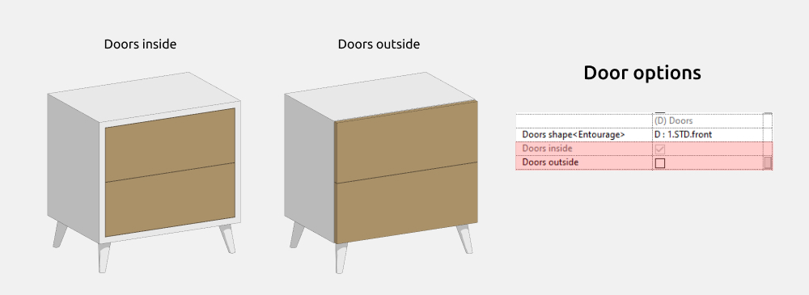

All door types can be either inside or outside.

### Handles

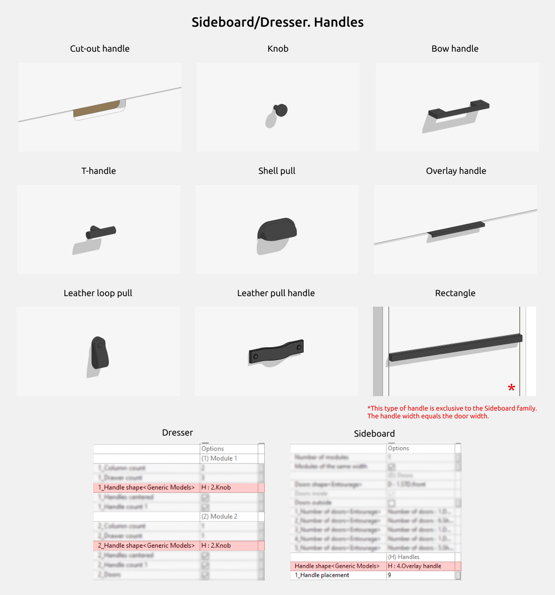

In the handle shape dropdown list:

-   Cut-out handle
-   Knob
-   Bow handle
-   T-shaped
-   Shell pull
-   Overlay handle
-   Leather loop pull
-   Leather pull handle
-   Rectangular handle (full width of the door)

### Legs

In the leg shape dropdown list:

-   Rectangle
-   Cylinder
-   Cone
-   Platform
-   Chamfered rectangle
-   Angled cone
-   U-shaped
-   Plinth
-   Classic

For freestanding legs, it is possible to enable or disable the rail between them.

## 4. FAMILIES

### Dresser

The Dresser family is used to create dressers of various configurations.

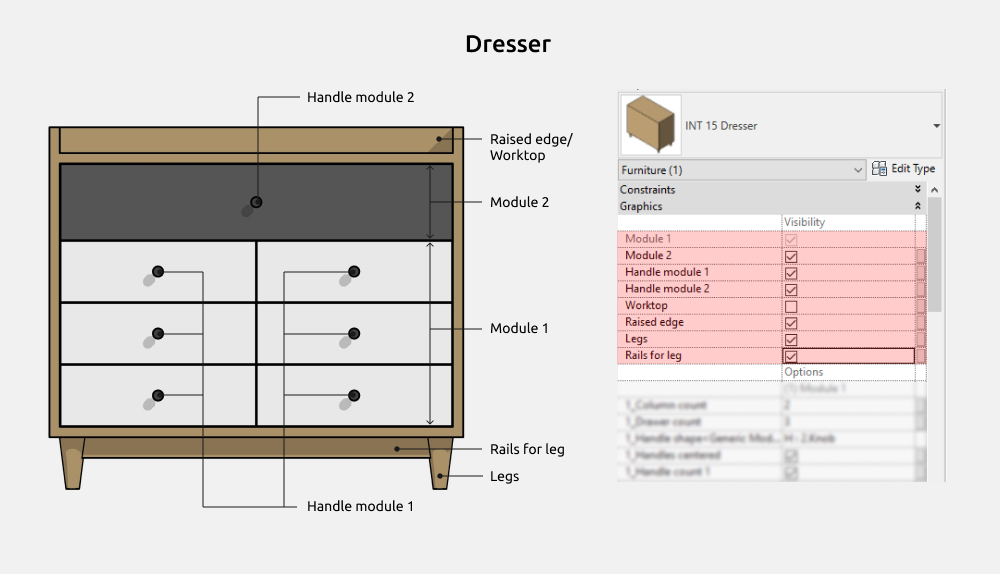

The following elements can be enabled or disabled:

-   Module 2
-   Handle module 1
-   Handle module 2
-   Worktop
-   Raised edge
-   Legs
-   Rails for leg

#### Dresser Options

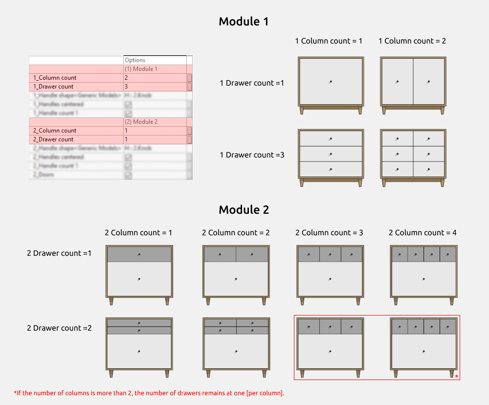

The number of doors can be **1 or more**.
The width of the doors is not set manually and is calculated automatically.

Parameter tooltips contain information about minimum and maximum values (hover the mouse over the parameter and wait for the tooltip to appear).

**Module 1**

1_Column count: from 1 to 2
1_Drawer count: 1 or more

**Module 2**

2_Column count: from 1 to 4
2_Drawer count: 1 or more

The number of drawers vertically can be 1 or more, but dimensional correctness must be maintained to avoid errors.

#### Dimensions

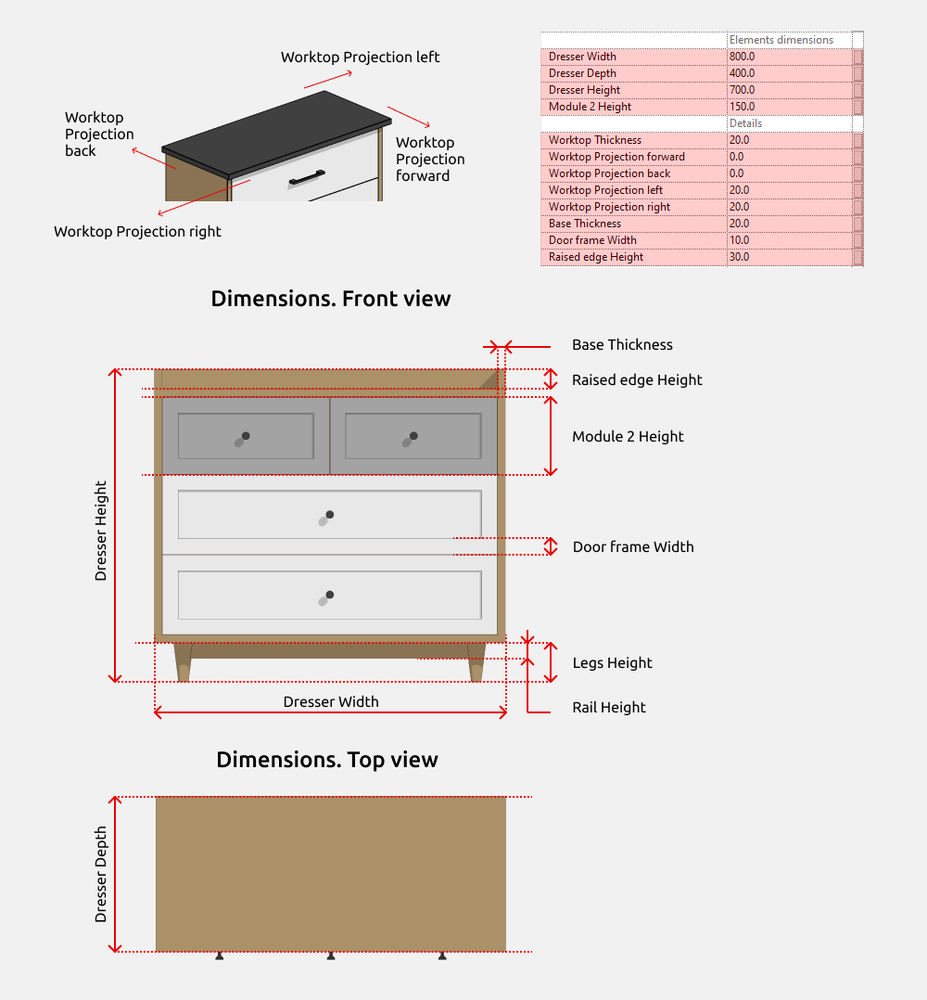

**Dresser Height** is an overall height parameter that includes additional element heights if they are enabled (Legs Height, Module 2 Height, Worktop Thickness, Raised edge Height).

Parameters shown in gray cannot be edited. They are intended for understanding dimensional calculations. For example, *INT_Width* shows the total furniture width, calculated using a formula based on the countertop overhang and the dresser width.

If the countertop is disabled, *INT_Width* will be equal to *Dresser Width*.
The same principle applies to dresser depth.

Handles of the Cut-out handle, Bow handle, and Overlay handle types allow width adjustment. Cut-out handles and overlay handles are always centered along the top edge of the door.

The *Handle Offset from edge* parameter affects the vertical position of the handles.

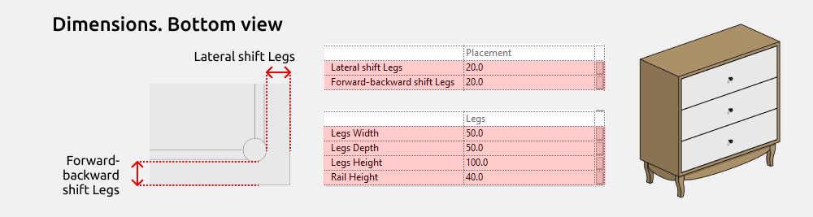

Classic leg dimensions are fixed:

Legs width = 40 mm
Legs height = 150 mm

The *Lateral shift Legs* and *Forward-backward shift Legs* parameters control the movement of the legs toward the center of the dresser.

#### Doors

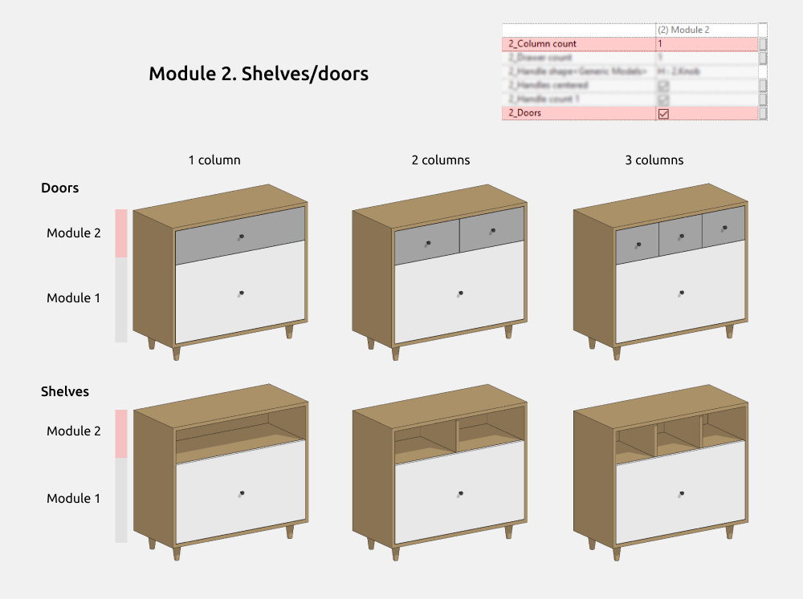

Module 2 allows the doors to be disabled, creating a shelf in the upper part of the dresser. Only one shelf is possible. The number of vertical dividers depends on the selected number of columns in Module 2.

#### Handles

Handles for Module 1 and Module 2 can be enabled/disabled and configured independently.

One or two handles can be placed on a single door. This does not apply to Cut-out handles and Overlay handles, which always have one handle per door.

If the **Handles centered** parameter is disabled, the handles move to the top edge of the door. In this case, the **Dimensions** section allows adjustment of the distance from the top edge.

#### Materials

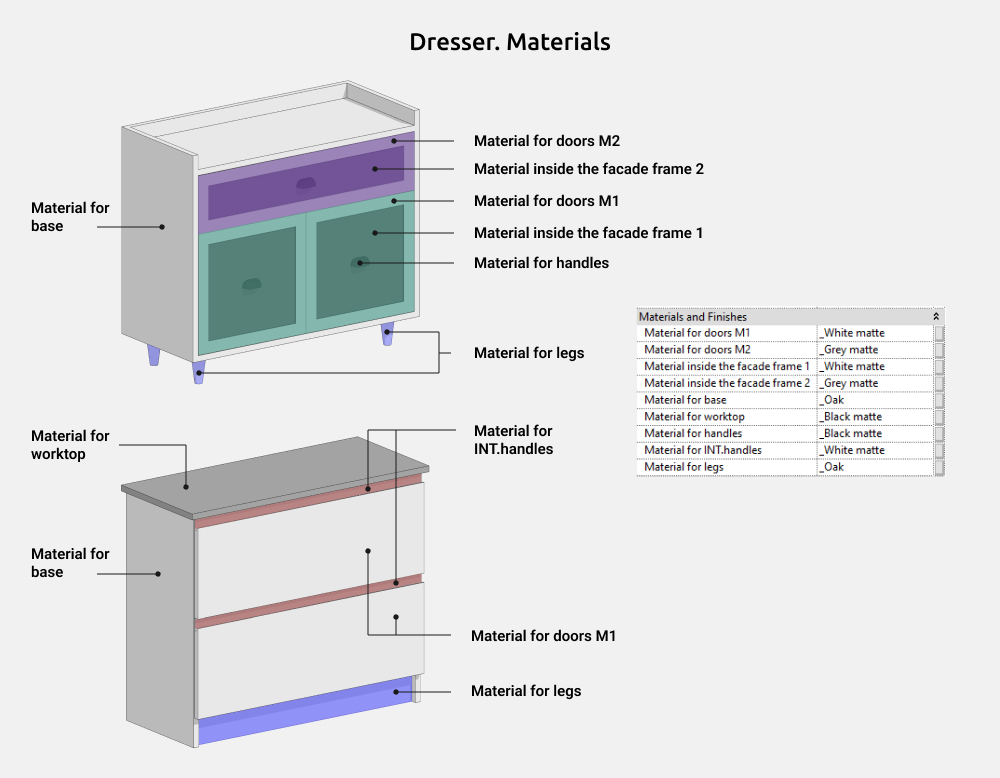

### Sideboard

The **Sideboard** family is used to create sideboards of various configurations.

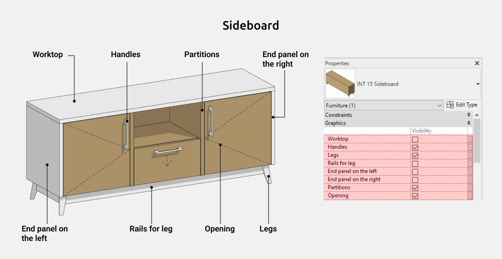

The following elements can be enabled or disabled:

-   Worktop
-   Handles
-   Legs
-   Rails for leg
-   End panel on the left
-   End panel on the right
-   Partitions
-   Opening

Doors and handles are the same for all modules.
The following parameters are configured individually per module:

-   Number of doors
-   Handle placement
-   Vertical position (for handles)
-   Opening type

#### Sideboard Options

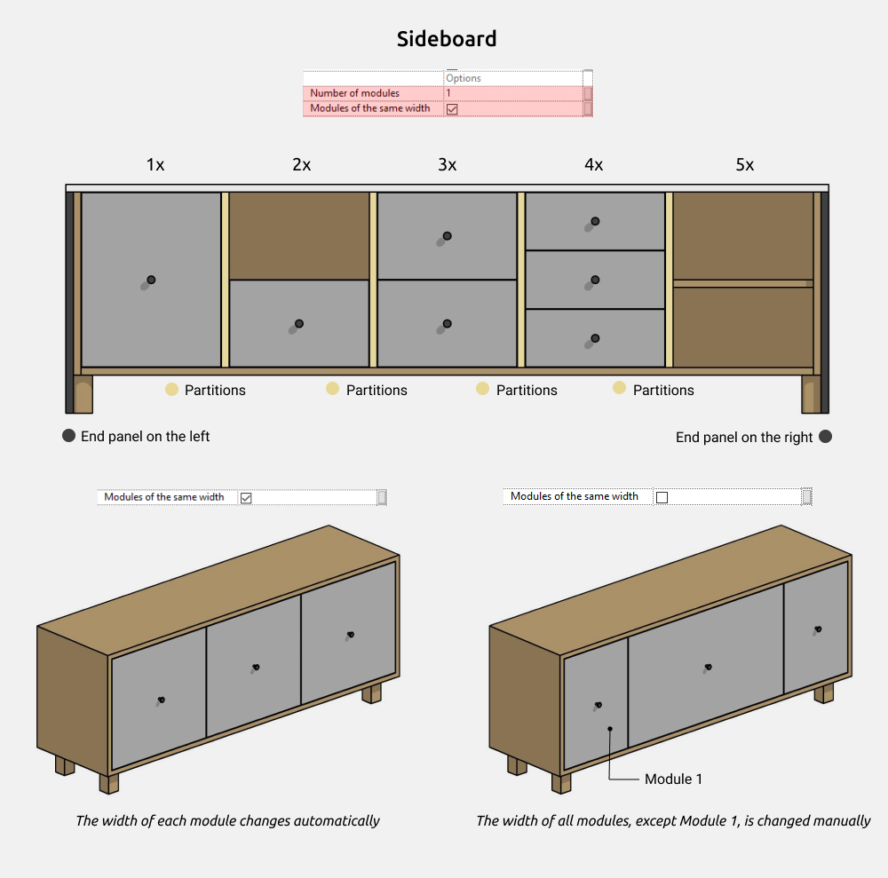

The number of modules can be set from **1 to 5**. Modules can be identical or configured individually.

The width of each module is configured individually, except for **Module 1**.
Module 1 width is calculated by subtracting the total width of Modules 2–5 from the overall sideboard width.

Each module in the sideboard is configured independently.

The left and right end panels are enabled separately, but their height is adjusted jointly.

An additional partition can be enabled between modules, allowing for a greater variety of sideboard configurations.

#### Dimensions

**Sideboard Height** is an overall height parameter that includes additional element heights if they are enabled (Legs Height, Worktop Thickness).

Parameters shown in gray cannot be edited. *Module 1 Width* cannot be edited to ensure correct family behavior. Parameters starting with **INT** are shared parameters and can be used in schedules if required.

If the worktop is disabled, *INT_Width* will be equal to *Sideboard Width*. The same principle applies to sideboard depth.

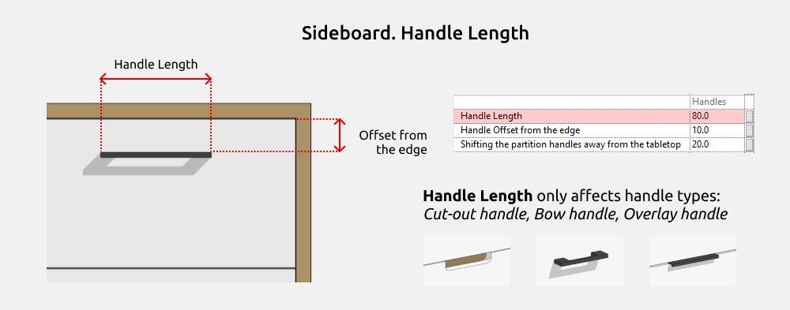

Handles of the **Cut-out**, **Bow**, and **Overlay** types allow width adjustment.
Cut-out and overlay handles are always centered along the top edge of the door.

The *Handle Offset from edge* parameter affects the vertical position of the handles.

Classic leg dimensions are fixed:

Legs Width = 40 mm

Legs Height = 150 mm

The *Lateral shift Legs* and *Forward-backward shift Legs* parameters control the movement of the legs toward the center of the sideboard.

#### Door Opening

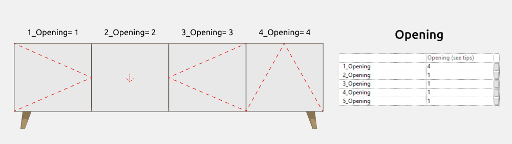

The opening type for each module’s front panels is configured individually.

Opening types:
1 - Left-hinged
2 - Drawer
3 - Right-hinged
4 - Drop-down

#### Handle placement

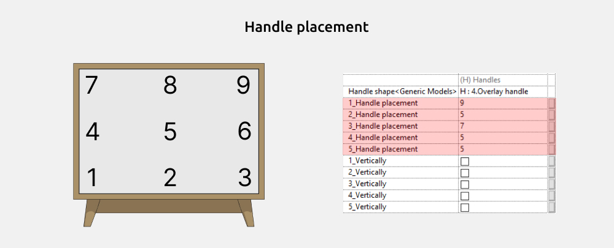

For each module, handle placement and orientation are configured individually.

#### Materials

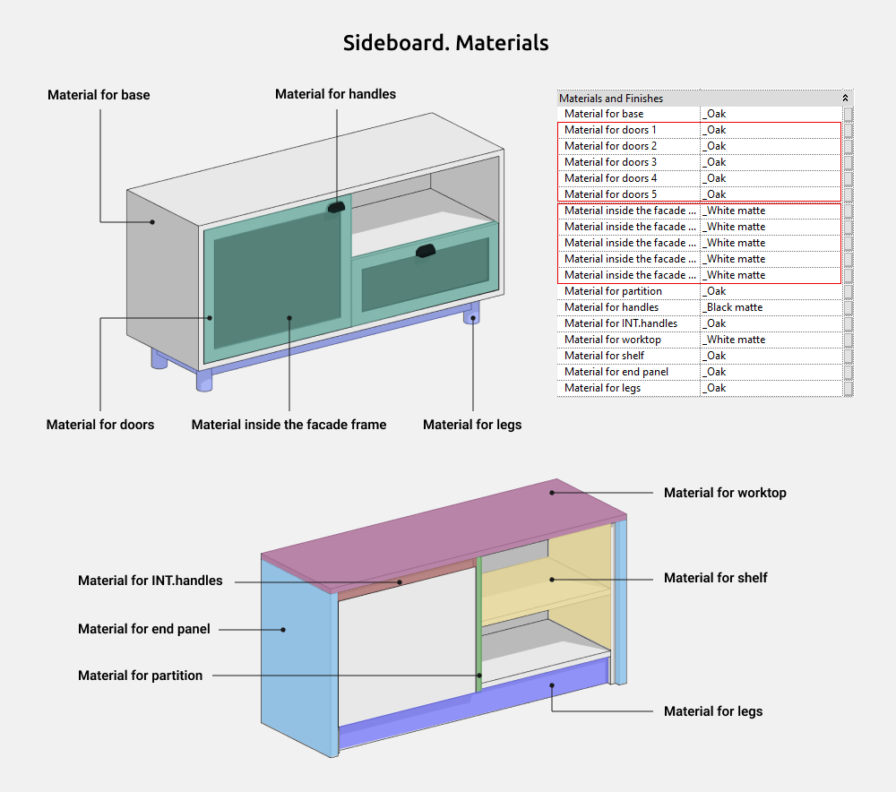

#### Graphics settings

To change the color, line weight, line type, or to disable the display of opening lines in the family, go to: Manage → Object Styles → Furniture

### Sideboard oval

The **Sideboard** **oval** family is used to create sideboards of various configurations with rounded corners.

The following elements can be enabled or disabled:

-   Raised edge
-   Integrated handles

The following settings are also configured in this section:

-   Front panel type and quantity
-   Countertop placement
-   Leg shape

#### Dimensions

**Sideboard Height** is an overall height parameter that includes the *Raised edge* height if it is enabled in graphics.

Parameters shown in gray cannot be edited. Parameters starting with **INT** are shared and can be used in schedules if required.

#### Doors

When selecting *Drawer* or *Door* front panel types, their quantity can be adjusted.

When selecting the *Shelves* type, the bottom shelf is always single.

Any door type can have an integrated handle.

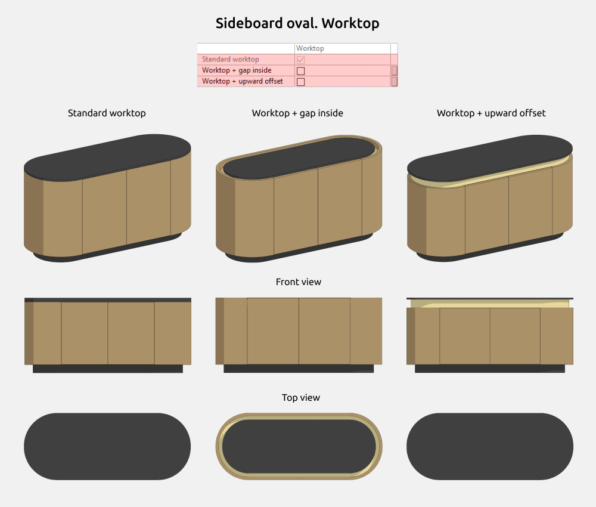

When selecting *Worktop + gap inside* or *Worktop + upward offset*, the **Dimensions** section allows editing of the countertop offset.

#### Legs

In the leg shape dropdown list:

-   Rectangle
-   Cylinder
-   Cone
-   Angled cone
-   Platform

The *Lateral shift Legs* and *Forward-backward shift Legs* parameters control the movement of the legs toward the center of the sideboard.

#### Materials

<CTA type="guide" />
