import productPreview from './product.jpg';

:::note
The families in this set are currently available in Russian only. Screenshots, family names and parameter names are kept in Russian so that you can find them in Revit. The explanations are in English.
:::

<ProductCard
  name="Socket Revit Families"
  description="Sockets, switches and outlets in many standards — ready to drop into your Revit project."
  image={productPreview}
  imageAlt="Sockets Revit Families — set preview"
  buyUrl="https://bimcore.one/products/socket-revit-families-v-4"
  ecwidProductId="543601734"
/>

## 1. GENERAL INFORMATION

- Set name: Sockets (Розетки)
- Set version 4.2.2
- Revit version: 2019

### Description

This Revit family set is made for drawing electrical and switch layouts and for counting frames and mechanisms in Autodesk Revit schedules.

It suits interior designers and architects. The geometry of the frames and mechanisms is simplified and built with the tools of Revit itself.

### Loading and placing

To look through the set and load the families you need, open the socket project (Проект с розетками), copy the families with Ctrl+C and paste them into your own project with Ctrl+V. You can also open the folder with the family files and drag them into the project with the mouse.

If you already have older versions of these families, delete them first. In the Project Browser expand Families, go to Электрические приборы (Electrical Fixtures), select every family that belongs to the socket set and delete it.

To avoid problems with images in schedules, choose the option that replaces the shared family of nested components together with its parameter values:

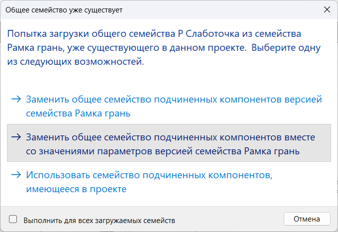

## 2. WHAT IS IN THE SET

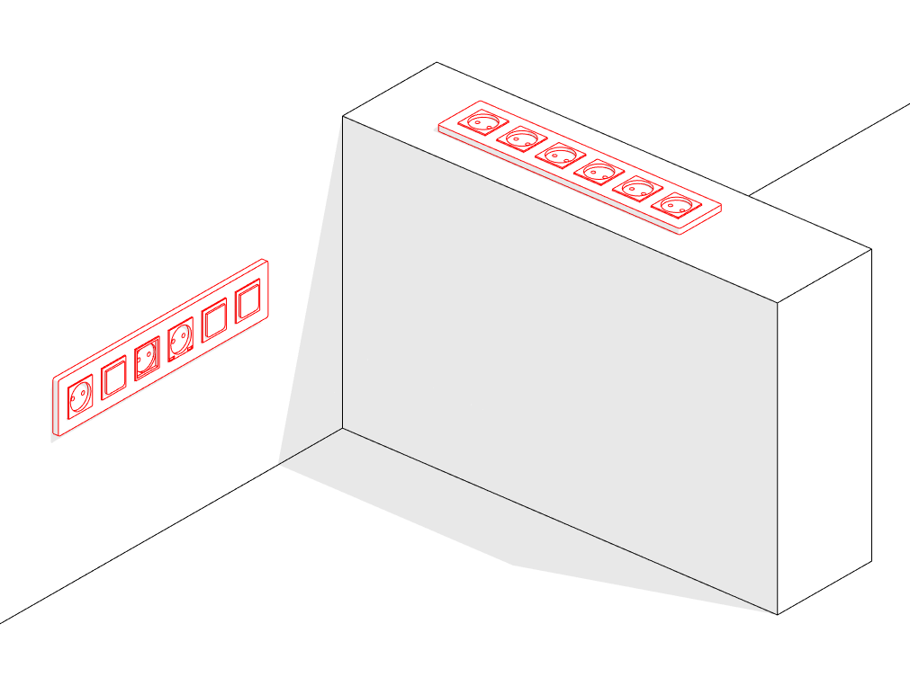

The set includes these families of the Электрические приборы (Electrical Fixtures) category:

- Рамка (frame)
- Рамка грань (face-based frame), for placing sockets on a selected plane
- Марка розеток (socket tag)
- Легенда (legend), from the Обобщенные модели (Generic Models) category

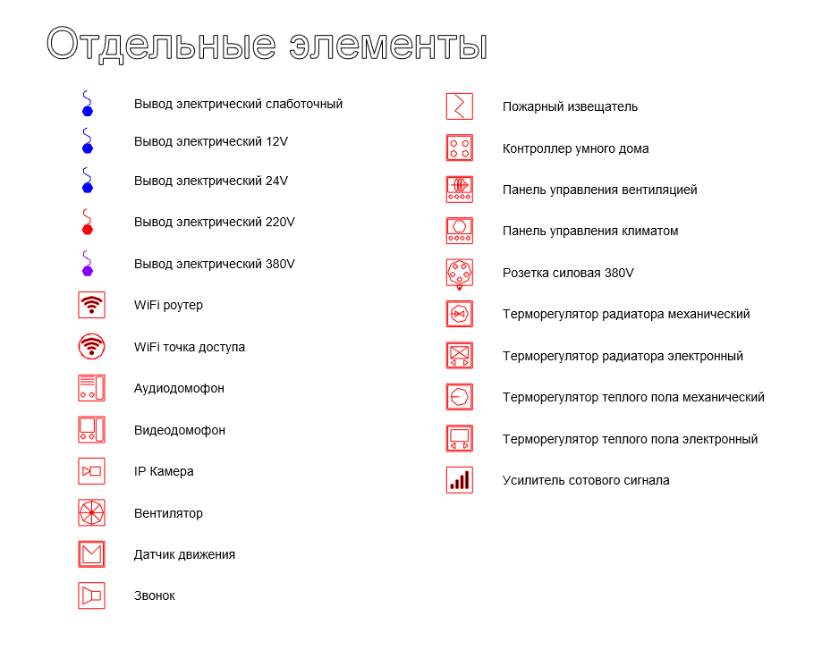

The set also includes a group of separate mechanisms, Отдельные механизмы, that are placed outside the frames:

- WIFI
- Вывод электрический (electrical outlet)
- Домофоны (door entry phones)
- Механизмы (mechanisms)
- Механизмы по грани (face-based mechanisms)
- Пульты управления (control panels)
- Розетка силовая 380V (three-phase 380 V power socket)
- Терморегуляторы (thermostats)
- Усилитель сотового сигнала (mobile signal booster)

Рамка is the main family you work with. It is placed on a floor plan or a ceiling plan tight against the wall, and you can give it a height.

Рамка грань is placed on a surface, either in plan or in 3D. It is used most often in floors and ceilings. You cannot give it a height: Рамка грань sits on the selected host with no offset.

Families with the В and Р prefixes are nested families. They are used ONLY inside a frame. Placing them on their own is not recommended.

## 3. DETAIL LEVELS

How a family is drawn in plan and elevation depends on the detail level of the view. For 3D views use the fine detail level.

## 4. SCALE

The type parameters **М План** and **М Фасад** change the size of the symbol in plan and in elevation at the coarse and medium detail levels.

If you change **Размер механизма** and **Толщина внешней рамки**, the real size of the socket or switch changes. You see this at the fine detail level of the view.

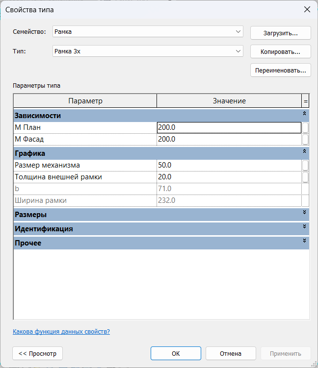

## 5. FRAME OPTIONS

### 1. Frame types

The number of elements in a frame depends on the type you choose:

To choose what goes inside the frame, pick the socket or switch family you need from the drop-down list next to the parameters **1х**, **2х**, **3х**, **4х**, **5х** and **6х**. The prefixes are В for a switch (выключатель) and Р for a socket (розетка):

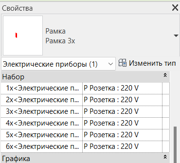

If the frame has 2 gangs, only the elements set in **1х** and **2х** go into it. If the frame has 5 gangs, the elements set in **1х**, **2х**, **3х**, **4х** and **5х** go into it. The **6х** parameter then has no effect on what the frame holds.

To turn a horizontal frame into a vertical one, switch off the **Гор** parameter:

### 2. Sockets

Sockets are nested into the frames as shared families. Here is the full list of socket families with their types:

Р 01 Прочее (other):

- Заглушка (blank cover)
- Заглушка кабель-канала (trunking blank cover)
- Прочее 1 (other 1)
- Прочее 2 (other 2)
- Прочее 3 (other 3)

Р 01 Розетка (socket):

- 220V
- IP20 с крышкой (IP20 with a lid)
- IP44
- USB

Р 01 Слаботочка (low-voltage):

- Audio 1x
- Audio 2x
- HDMI 1х
- RJ10 1x (Телефон), telephone
- RJ45 1x (Интернет), data
- RJ45 2x (Интернет), data
- RJ45 + TV
- TV
- TV + SAT
- USB 1x
- USB 2x

To find the socket type you need faster, type the capital Cyrillic letter Р.

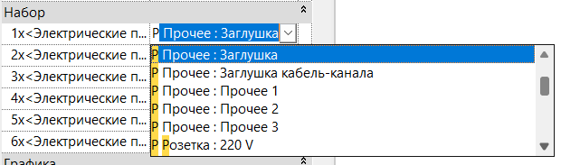

The Р Прочее sockets, Прочее 1, 2 and 3, are there so that you can build your own type for an element the set does not cover. You can add your own 3D text to these types and use them in the project.

### 3. Switches

Switches are nested into the frames as shared families too. Here is the full list of switch families with their types:

В 01 Выключатель (switch):

- 1КЛ (one gang)
- 2КЛ (two gangs)
- 3КЛ (three gangs)
- 4КЛ (four gangs)
- КАРТ (key card)
- МАСТЕР (master)

В 01 Датчик движения (motion sensor)

В 01 Диммер (dimmer):

- 1КЛ НАЖИМ (one gang, push)
- 2КЛ НАЖИМ (two gangs, push)
- ЖАЛЮЗИ (blinds)
- ПОВ НАЖ (rotary with push)
- ПОВОРОТНЫЙ (rotary)

В 01 Переключатель (two-way switch):

- 1КЛ (one gang)
- 1КЛ Перекрестный (one gang, intermediate)
- 2КЛ (two gangs)
- 2КЛ Перекрестный (two gangs, intermediate)

В 01 Терморегулятор (thermostat):

- РАДИАТОР МЕХ (radiator, mechanical)
- РАДИАТОР ЭЛЕКТР (radiator, electronic)
- ТЕПЛ ПОЛ МЕХ (underfloor heating, mechanical)
- ТЕПЛ ПОЛ ЭЛЕКТР (underfloor heating, electronic)

To find the switch type you need faster, type the capital Cyrillic letter В.

### 4. Reference points (centre, bottom, top)

In plan, a horizontal frame can be dimensioned with a leader to:

- the centre of the frame
- the start, the first element in the frame
- the end, the last element in the frame

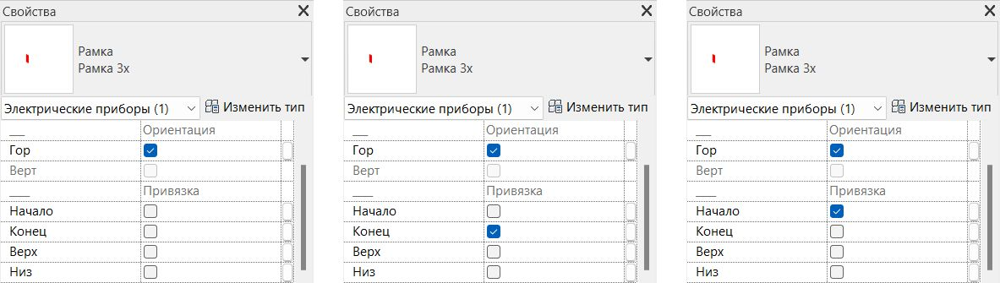

In elevation, a vertical frame can be referenced to:

- the centre of the frame
- the bottom element in the frame
- the top element in the frame

In elevation the reference point is drawn as a circle.

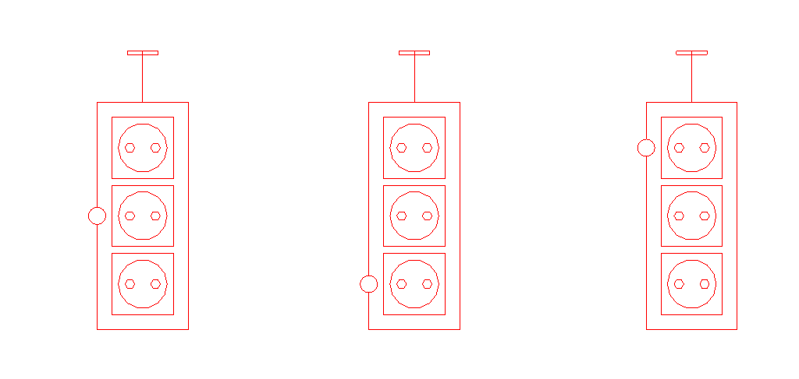

### 5. Materials

To change the material of Рамка and of the elements nested in it at the fine detail level, change the instance parameters **INT_Материал рамки** and **INT_Материал розетки** and assign a material from the material browser.

## 6. PLACEMENT

### 1. Symbol offset in plan and elevation

The parameters **Вынос УГО План** and **Вынос УГО Фасад** let you show a frame with its sockets or switches even when furniture or other elements cover them in plan or in elevation, as long as you are not using the fine detail level on interior elevations.

A COMMON MISTAKE:

For Revit, the height of the Рамка family is the sum of **INT отступ от пола** and **Вынос УГО План**.

So if you have a switch at a height of 900 mm and its plan symbol offset is set to 2500, in the Revit plan that switch stays visible all the way up to +2.400 above the finished floor.

If the second floor plan sits below the sum of **INT отступ от пола** and **Вынос УГО План**, the switch is visible on the second floor as well. If it is lower, then only on the first floor.

### 2. Offset from the wall

How far the element sits from the wall is controlled by **Отступ от основы**.

The larger the value, the further the frame symbol sits from the wall.

You can also enter **negative values** and push the symbol to the other side of the wall. This is especially useful in small rooms.

In elevation and section the symbols sit without any offset, centred on the real position of the frame.

## 7. TAGGING

To tag the frames of the set there is the INT 01 Марка розеток tag, which comes with several types:

Краткая (short)

Only the height of the device, the value of **INT_отступ от пола**, plus the comment.

Note: for the Рамка грань family this value is always 0, because the family always lies on a surface with 0 offset.

Краткая + Ориентация (short with orientation)

The height of the device, the value of **INT_отступ от пола**, plus the orientation of the frame (**INT_Ориентация**) and the comment.

Полная (full)

**INT_Отступ от пола**, **INT_Ориентация**, **INT_Производитель**, **INT_Серия**, **INT_Цвет**, **INT_Цвет рамки** and the comment.

Только комментарий (comment only)

The comment only.

The frames also carry the **Марка** parameter. It turns on a tag in plan next to the socket showing the mounting height of the frame, the value of **INT Отступ от пола**. If you tag with a separate family instead of this parameter, clear the **Марка** checkbox.

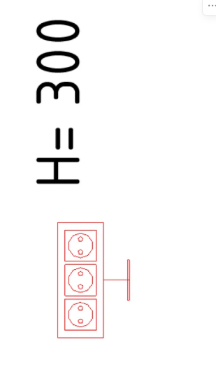

## 8. CEILING PLAN

A ceiling plan shows the elements that sit above its cut plane. If you want to see elements that sit below the cut plane or are covered by furniture, edit **Вынос УГО План** so that **INT отступ от пола** plus **Вынос УГО План** is greater than the height of the cut plane.

You can also use the standard Revit tool **Фрагмент плана** (Plan Region).

To make sockets and switches on a ceiling plan look the same as on a floor plan at the medium detail level, set **Transparency** to 100% in the Visibility/Graphic Overrides of the view. At the coarse detail level the elements are drawn correctly without transparency.

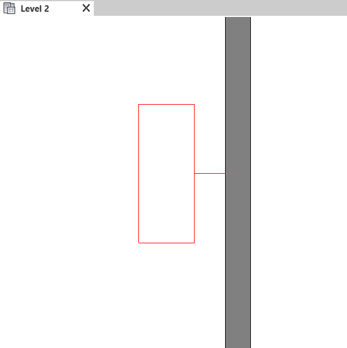

## 9. SEPARATE MECHANISMS

Here is the full list of mechanism families with their types:

INT 01 WIFI:

- Роутер (router)
- Точка доступа (access point)

INT 01 Вывод электрический (electrical outlet):

- Слаботочный (low-voltage)
- 12V
- 24V
- 220V
- 380V

INT 01 Домофоны (door entry phones):

- Аудиодомофон (audio entry phone)
- Видеодомофон (video entry phone)

INT 01 Механизмы and INT 01 Механизмы по грани:

- IP Камера (IP camera)
- Вентилятор (fan)
- Датчик движения (motion sensor)
- Звонок (doorbell)
- Пожарный извещатель дымовой (smoke detector)

INT 01 Пульты управления (control panels):

- Контроллер умного дома (smart home controller)
- Пульт управления вентиляцией (ventilation control panel)
- Пульт управления климатом (climate control panel, Метеостанция)

INT 01 Розетка силовая 380V (three-phase 380 V power socket):

- Скрытая 3Р+Е+N 16А 380В IP44 (flush mounted)
- Стационарная 3Р+Е+N 16А 380В IP44 (surface mounted)

INT 01 Терморегуляторы (thermostats):

- Терморегулятор радиатора - Механический (radiator thermostat, mechanical)
- Терморегулятор радиатора - Электронный (radiator thermostat, electronic)
- Терморегулятор теплого пола - Механический (underfloor heating thermostat, mechanical)
- Терморегулятор теплого пола - Электронный (underfloor heating thermostat, electronic)

INT 01 Усилитель сотового сигнала (mobile signal booster)

Механизмы по грани are placed on a selected surface, all the others are placed in plan.

If you switch on the **Марка** instance parameter, the tag of the mechanism shows the height of the element and the type parameter **INT_Комментарий по типу**:

### Electrical outlets

At the medium and coarse detail levels the electrical outlets are drawn in plan no matter what height they sit at.

## 10. GRAPHICS

### 1. Line styles

To change the colour of the sockets and switches across the whole project, go to the Manage tab and open the Object Styles tool.

By changing the colour of a subcategory you change the colour of the element in the whole project. Set up the Электрические приборы (Electrical Fixtures) category and its subcategories. Your project may still hold extra subcategories left from older versions, and you can delete them.

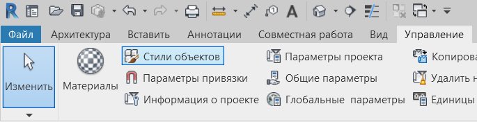

To change the colour of the sockets and switches in a single view, open Visibility/Graphic Overrides and set the colours for the Электрические приборы category and its subcategories.

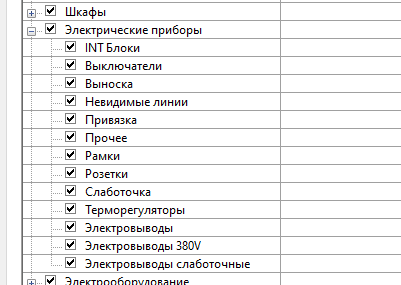

You can also use Filters in the Visibility/Graphic Overrides window to change the colour of sockets or switches in a view.

The **INT Блоки** parameter turns on the outline of the frame at the coarse detail level.

The **Выноска** parameter shows the leader lines in plan between the wall and the symbol.

The **Привязка** parameter turns on the reference mark in elevation for vertical sockets, at the centre, the top or the bottom.

### 2. Fill

To change the fill colour of a socket or a switch in plan, select the nested shared family with Tab and change the type parameter **INT_УГО Заливка**, assigning a material from the material browser:

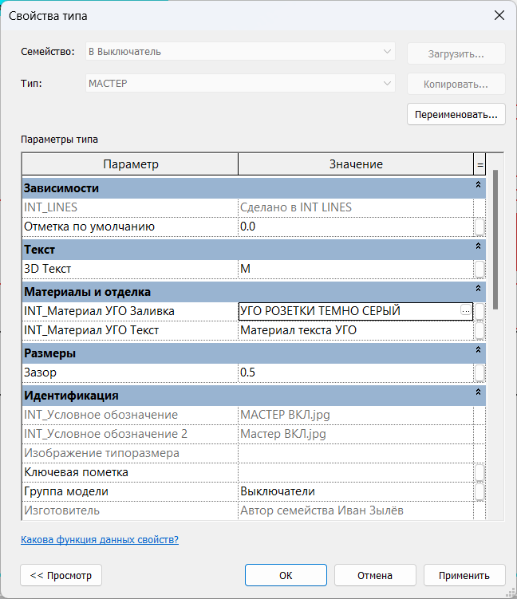

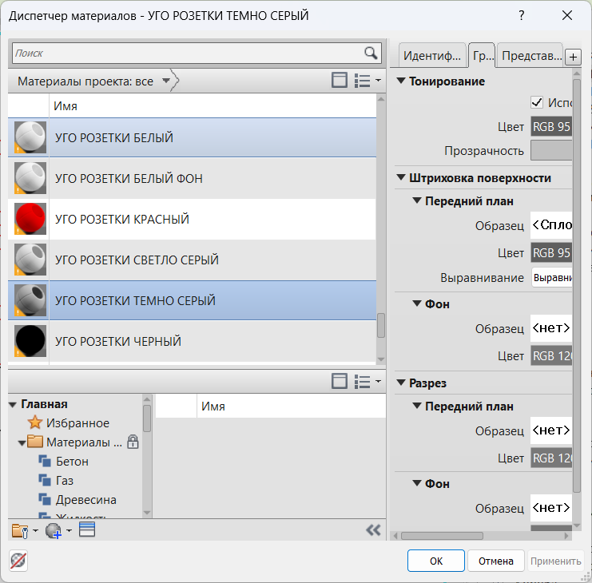

For the device symbols in a schedule to match what is set in the project, update the symbol JPEG in the type properties.

### 3. Symbols and Figma

If you need to change the symbol of a device in a schedule, you can edit the vector file with the drawing of that electrical device on a [Figma page](https://www.figma.com/design/C53Y49XcTp6BOhbNSROxqs/%D0%A3%D0%93%D0%9E-%D0%A0%D0%9E%D0%97%D0%95%D0%A2%D0%9A%D0%98-V4?node-id=0-1&t=fJL1bR7jzSHFrgc3-1).

The files can be viewed in any browser, but the INT LINES page itself cannot be edited. Select everything on it and copy it to a page of your own.

How to replace an image in the project:

- To load an updated image into a family, find that family in the Project Browser and click Edit. This opens the family editor.
- There, open the Family Types window and replace the values of **INT_Условное обозначение** for the coarse detail level or **INT_Условное обозначение 2** for the medium level.
- After that load the family back into the project and choose to overwrite the existing version and its parameter values.

If you want to use the changed symbols in later projects, then before loading the updated family into the project you first need to open the Рамка and Рамка грань families and replace the updated family both in the project and inside Рамка and Рамка грань. After that save Рамка and Рамка грань on your own computer.

<CTA type="guide" />
