## 1. GENERAL INFORMATION

-   Set name: Sofas
-   Set version 1.0.0
-   Revit version: 2019

### Description

This set of families for Revit is designed for modeling sofas in Autodesk Revit. With these families, you can create straight and L-shaped sofas, couches, and ottomans with precise dimensions.

Suitable for interior designers and architects.

### Loading and placing into the project

In order to view and download the families from the set, you can open **Project with sofas** and copy the families using the Ctrl+C key combination, and then paste them into your project Ctrl+V.

Or open the folder with family files and drag it into the project with the mouse.

## 2. SET STRUCTURE

The set includes the following families:

-   Straight sofa;
-   L-shaped sofa;
-   Ottoman;
-   Cushion;
-   Inclined cushion.

## 3. FAMILIES

### Straight sofa

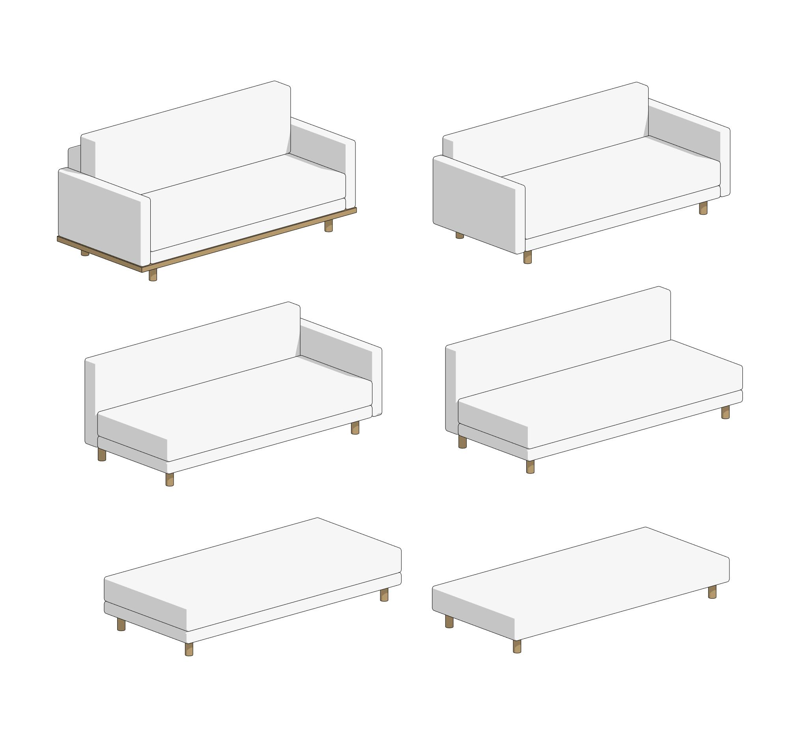

The "Straight sofa" family is used to build sofas, couches, and ottomans with a straight shape.

Here, you can enable or disable the following elements:

-   stand;
-   base;
-   backrest;
-   cushion;
-   left armrest;
-   right armrest;
-   symbol of convertible sofa (on the floor plan).

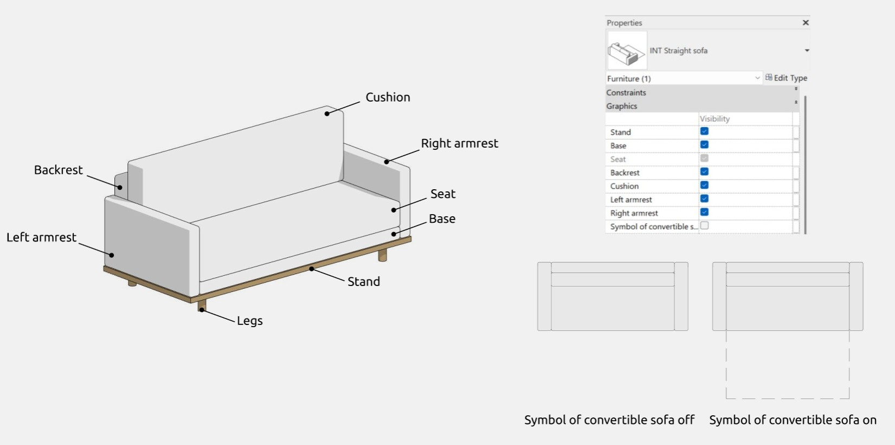

The "Seat" and "Legs" parameters are enabled by default.

#### Options

In the family, you can independently adjust the number of cushions (from 1 to 3) and the number of seats (from 1 to 3). This information is also available as tooltips when hovering over the corresponding parameters.

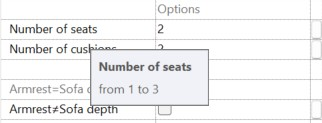

Armrests

In the "Graphics" section, you can work with armrests: their depth can either match or not match the depth of the sofa. By default, the first option is set. If the armrest depth does not match the sofa depth, it can be edited using the "Armrest depth" parameter. This parameter controls both armrests, and changing the armrest depths independently of each other is not available in the family.

Legs

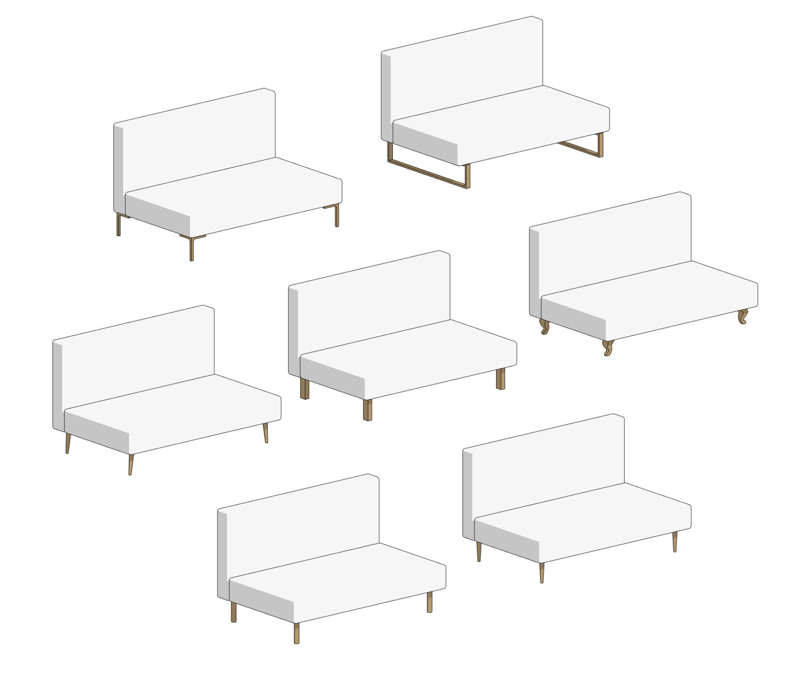

The types of legs can be selected from a dropdown list. The following options are available:

-   L-shaped;
-   classical shape;
-   cone-shaped;
-   tilted cone-shaped;
-   U-shaped
-   rectangular;
-   cylindrical.

The height of the legs of the classical shape always equals 150 mm.

When selecting the "Rectangular" leg type, it becomes possible to edit the leg depth.

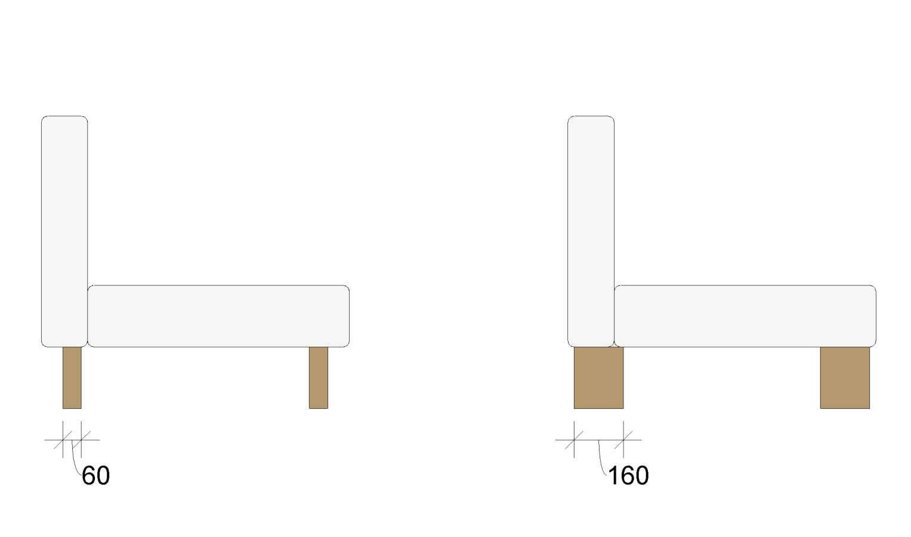

In this section, you can choose the placement of the legs: under the armrests or under the seat. By default, the second option is selected.

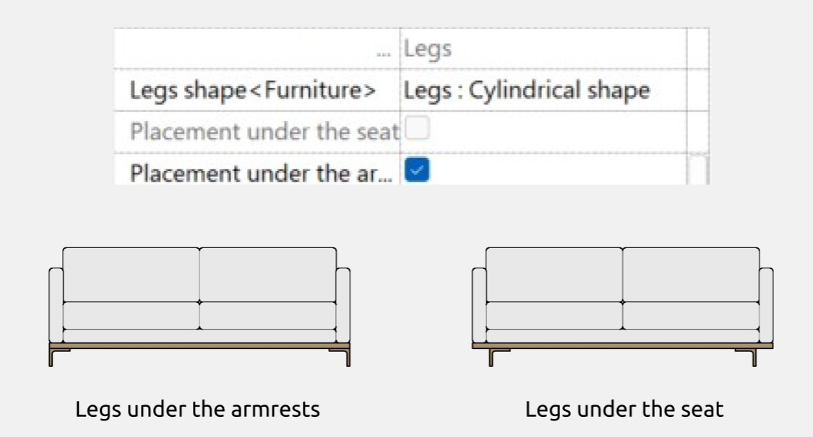

#### Materials

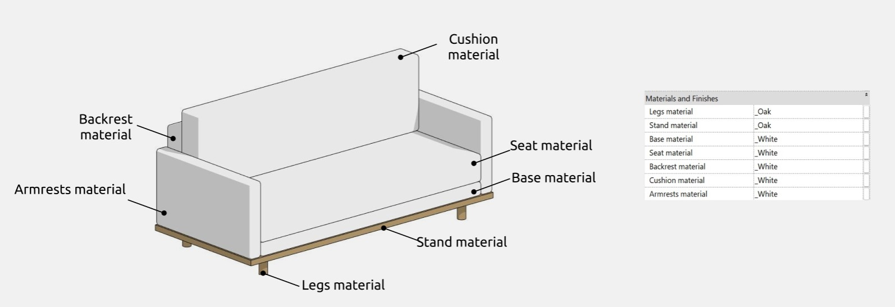

#### Dimensions

The "Sofa width" parameter controls the overall width, which includes other smaller width parameters for individual elements, such as "Armrest width", if they are enabled. If the armrests are turned off, the frame shifts to the width of the armrests. The same applies to the "Sofa height" parameter and its smaller height parameters (such as "Armrest height," "Leg height," "Base height"), as well as for the "Sofa depth" and smaller depth parameters like "Backrest depth".

The "Symbol of depth" parameter allows you to adjust the depth of the symbol of convertible sofa.

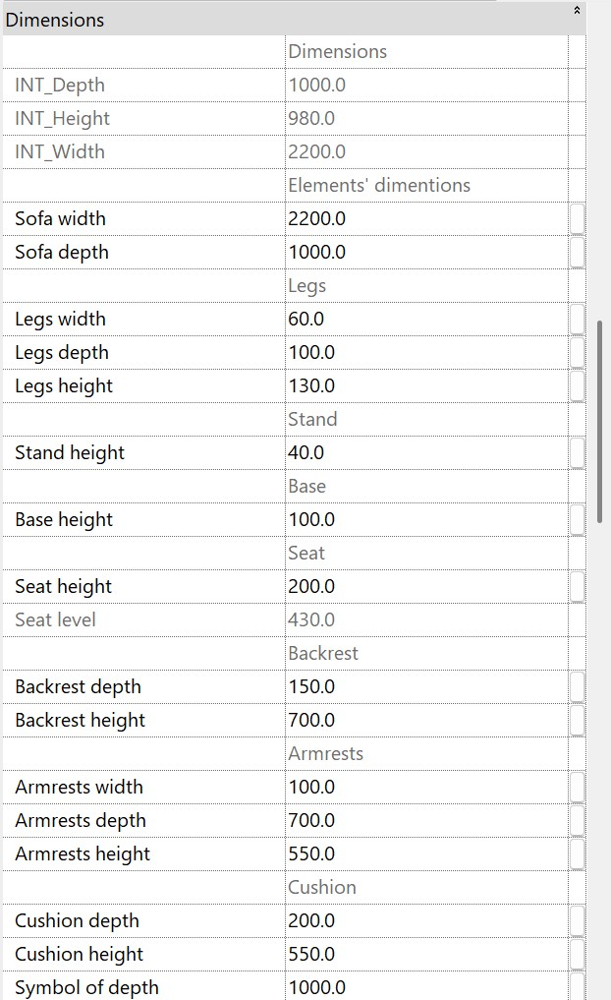

There are gray-colored parameters that cannot be controlled (e.g., INT_Width). They are necessary for understanding size calculations and ensuring the correct functioning of formulas and are not intended for user editing.

### L-shaped sofa

The “L-shaped sofa” family is used for creating corner sofas of various configurations.

Here, you can enable or disable the following elements:

-   stand;
-   base;
-   backrest;
-   cushion;
-   left armrest;
-   right armrest.

#### Options

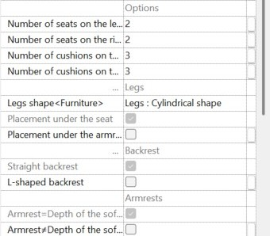

In the "Options" subsection, you can select the desired number of cushions and seats for the sofa. The number of seats and cushions on the left is counted from the corner seat to the left, while the number of seats and cushions on the right is counted from the corner seat downward to the right.

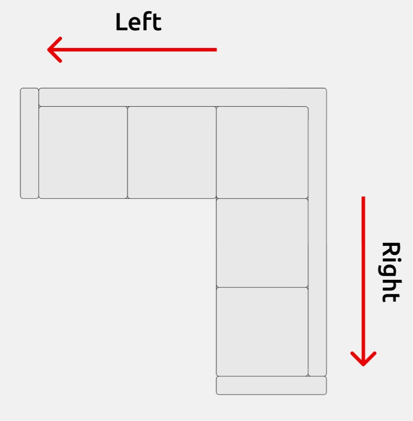

In the family, you can independently adjust the number of seats (from 1 to 2 on the left, from 0 to 2 on the right) and the number of cushions (from 1 to 3). This information is also available as tooltips when hovering over the corresponding parameters.

Legs

In the "Legs" subsection, you can control the shape of the sofa legs.

The available leg shapes and all their editable parameters are identical for both straight and L-shaped sofas.

Backrest

Here, you can switch between a straight and an L-shaped backrest. The first option is set by default.

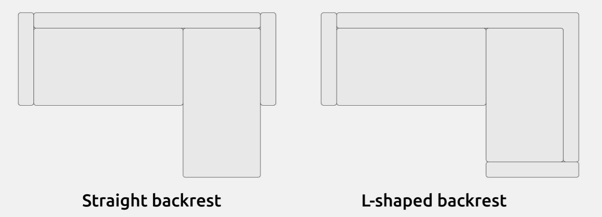

Armrests

In the "Armrests" subsection, you can control the placement of the armrests on the L-shaped sofa. The placement options are identical for both straight and L-shaped sofas. However, there is one difference: the depth of the armrests can be adjusted independently. This is explained in more detail in the "Dimensions" section.

Materials

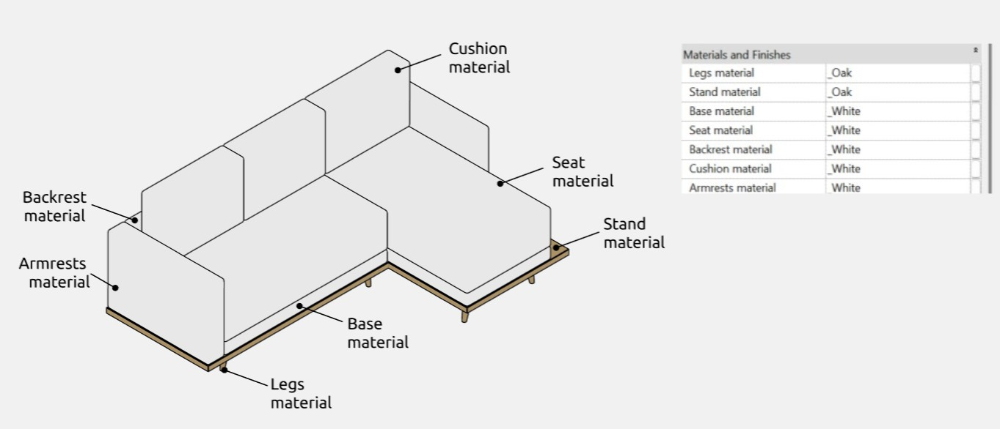

#### Dimensions

The "Sofa width" and "Sofa depth" parameters control the overall dimensions of the sofa. They include smaller width-related parameters for individual elements if enabled via checkboxes, such as "Armrest Width." If the armrests are disabled, the main frame shifts inward by the width of the armrests. The same logic applies to other minor parameters.

In the family’s structure, cushions are placed on the seats, meaning that seat depth is determined by the upper edge of the cushion rather than the lower edge.

The "Armrest width" and "Armrest height" parameters control the width and height of both armrests. If an L-shaped backrest is selected in the graphical parameters or if the armrest depth matches the sofa depth, then the "Armrest depth" parameter will control the depth of both armrests. However, if the armrest depth does not match the sofa depth, the family allows independent adjustment of armrest depths. Armrest depth can be edited using the "Armrest depth" parameter for the left armrest and the "Right armrest depth" parameter for the right one.

There are gray-colored parameters that cannot be controlled (e.g., INT_Width). They are necessary for understanding size calculations and ensuring the correct functioning of formulas and are not intended for user editing.

### Ottoman

The "Ottoman" family is used to display ottomans and benches.

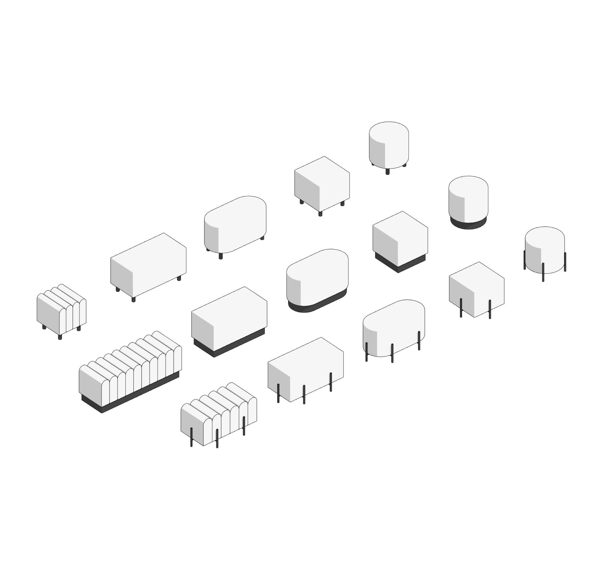

The "Ottoman" family supports 4 shapes:

-   oval;
-   square;
-   round;
-   corrugated rectangle (when this option is selected, the number of cluster segments can be edited in the "Ottoman corrugated rectangle shape" subsection).

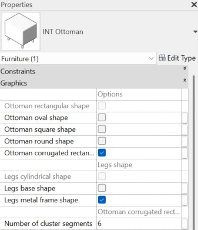

In this section, you can also switch between 3 leg shapes:

- cylindrical (selected by default if other options are disabled);
- base;
- metal frame.

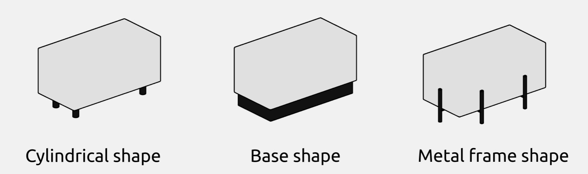

Using the ottoman without legs is not supported.

#### Materials and dimensions

In the family, you can edit the materials of the fabric and legs.

You can also adjust the size of the ottoman and the height of the legs. If cylindrical legs are selected, their width can also be modified.

### Cushion

The "Cushion" family is intended for decorative purposes.

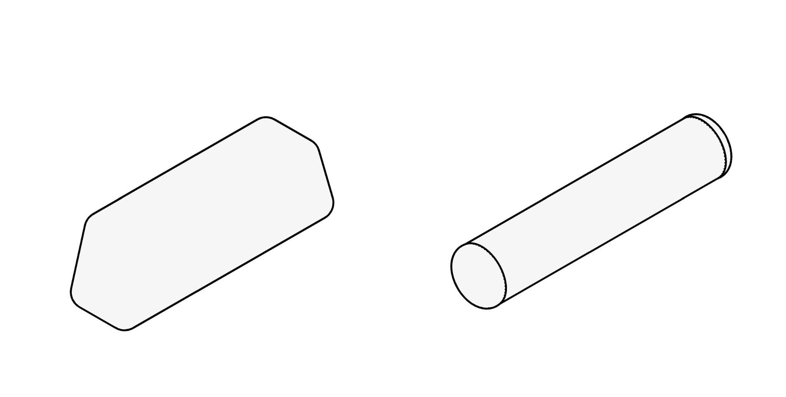

The family parameters allow you to edit the cushion's dimensions and material, as well as switch between cylindrical and trapezoidal shapes.

### Inclined cushion

The “Inclined cushion” family is intended for decorative purposes, as well as for indicating support for other objects.

The “Inclined cushion” family has the same parameters as the "Cushion" family, and it also allows to:

-   switch between three cushion shapes (round/rectangular/Oxford);
-   enable or disable a stand (if the stand is enabled, its material can also be edited);
-   adjust the tilt angle of the cushion.

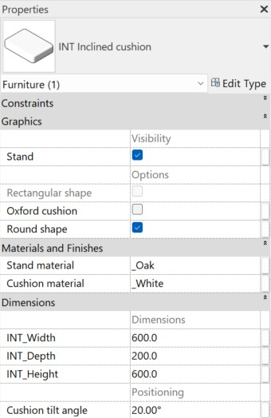

<CTA type="guide" />
