import productPreview from './product.png';

<ProductCard
  name="Storage Cabinet Revit Families"
  eyebrow="Revit Family Set"
  description="Storage cabinets and cupboards in various sizes — ready to drop into your Revit project."
  image={productPreview}
  imageAlt="Storage Cabinets Revit Families — set preview"
  buyUrl="https://bimcore.one/products/storage-cabinet-revit-families"
  ecwidProductId="660642703"
/>

## 1. GENERAL INFORMATION

-   Set name: Storage cabinets
-   Version 1.0.0
-   Revit version: 2019

### Description

This set of Revit families is made for modeling storage cabinets/wardrobes in Autodesk Revit.

Using the families, you can create cabinets, doors, showcases, bookcases, cornice according to exact dimensions. Suitable for interior designers and architects. Families are not detailed enough for furniture makers.

### Loading and placing into the project

In order to view and download the families from the set, you can open **Project with storage cabinets** and copy the families using the Ctrl+C key combination, and then paste them into your project Ctrl+V.

Or open the folder with family files and drag it into the project with the mouse.

## 2. SET STRUCTURE

The set includes the following families:

-   Storage cabinet
-   Storage cabinet Attic
-   Storage drawers
-   Bookcase
-   Showcase
-   Shelf
-   Panel
-   Cornice
-   Cornice W-shape

Doors

-   Door
-   Door Glass
-   Door Wave
-   Door Ribbed-round
-   Door Ribbed-square
-   Door Louvers
-   Door Classic

## 3. FAMILIES: PARAMETERS AND ELEMENTS

### Storage cabinet

**Storage cabinet** is used to build cabinets with drawers or top section.

Here you can on/off the following elements:

-   Top
-   Drawers
-   Plinth
-   Opening
-   Doors top
-   Doors cabinet
-   Doors drawers
-   Symbol_Hangers (on top plan)
-   Symbol_X (on top plan)

#### Dimensions

Cabinet height is a height parameter in which there are other small element heights if they are turned on (Plinth height, Drawers height, Cabinet door height, Top height).

There are gray parameters that cannot be controlled. But they are needed to understand the size calculations. For example, **Door width.** The parameter shows the width of the doors, as it is calculated by a formula based on the number of doors and the width of the cabinet itself.

If the doors are turned off, the carcass moves by the Doors thickness.

#### Number of doors

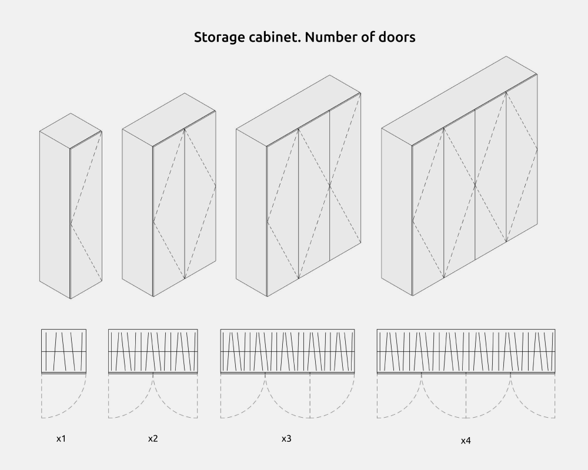

The number of doors in the Storage cabinet can be from 1 to 4.

The numbers of the doors go in order from left to right, where D1 is the leftmost door, and D4 is the rightmost door. The Doors width is not parametric, but is calculated automatically.

#### Opening

The main types of openings in this family are left opening and right opening. If you turn off Left opening (D_Left), then Right opening will automatically turn on for all visible doors in vertical.

When you need to show a different type of opening for a top section or drawer, turn on additional parameters. These are *Top up, Drawers down and Drawers pullout*. And for the main door (Cabinet door), left or right opening remains.

#### Options

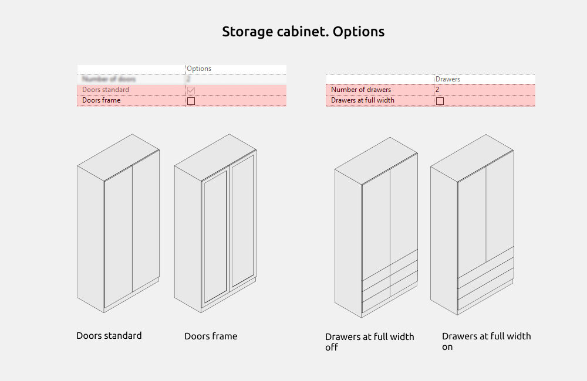

Doors can be standard (simple, without milling) or framed.

The number of drawers in height can be from 1 and more, but you need to ensure that the dimensions are correct so that an error does not appear.

*Drawers at full width* - this parameter removes the division along the doors and extends the drawers to the full width of the cabinet.

#### Materials

### Storage cabinet Attic

**Storage cabinet Attic** is used to build attic cabinets with drawers or top section. Typically these cabinets will have a beveled corner to match the slope of the roof.

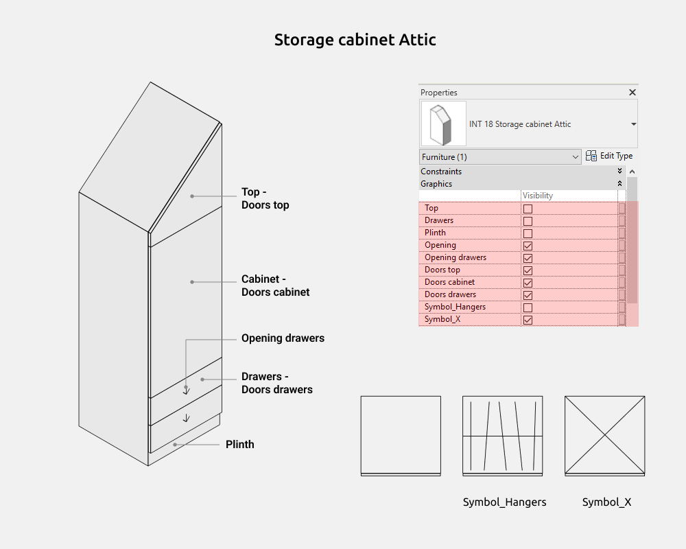

Here you can on/off the following elements:

-   Top
-   Drawers
-   Plinth
-   Opening (on top plan)
-   Opening drawers
-   Doors top
-   Doors cabinet
-   Doors drawers
-   Symbol_Hangers (on top plan)
-   Symbol_X (on top plan)

#### Dimensions

Cabinet height is a height parameter in which there are other small element heights if they are turned on (Plinth height, Drawers height, Cabinet door height, Top height).

Slope width starts from the top left point of the cabinet and increases to the right, and the Slope height - downwards.

There are gray parameters that cannot be controlled. But they are needed to understand the size calculations. For example, **D1_Width.** The parameter shows the width of the first door, as it is calculated by a formula based on the number of doors and the width of the cabinet itself. By default, all doors are equal to each other, because the corresponding parameter is enabled in the options.

If the doors are turned off, the carcass moves by the Doors thickness.

#### Number of doors

The number of doors can be from 1 to 4.

The numbers of the doors go in order from left to right, where D1 is the leftmost door, and D4 is the rightmost door. The Doors width is not parametric, but is calculated automatically.

#### Opening

Only drawers have opening on the doors (Opening drawers). And Opening is precisely opening on the plan from top.

You can select Left or Right opening. If you turn off Left opening (D_Left), then Right opening will automatically turn on for all visible doors in vertical.

When mirroring, the openings are also mirrored, so the names will be opposite: Left will become Right and so on.

#### Options

Doors can be standard (simple, without milling) or framed.

Doors outside are the doors that cover the cabinet carcass, and Doors inside, on the contrary, show the carcass thickness of the cabinet along the perimeter.

When the Doors are equal in width parameter is enabled - D1_Width is equal to the width of all other facades. If off, the width of each door (except D1.Width) is set manually.

The number of drawers in height can be from 1 and more, but you need to ensure that the dimensions are correct so that an error does not appear.

*Drawers at full width* - this parameter removes the division along the doors and extends the drawers to the full width of the cabinet.

#### Materials

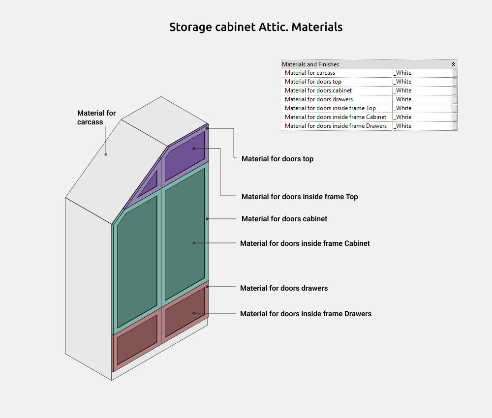

### Showcase

Showcase is used to build glass display cases with shelves where you can place dishes, books or other items.

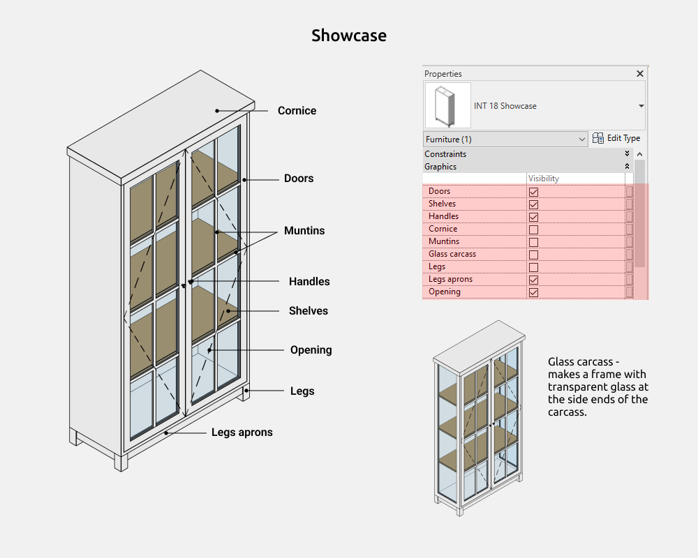

Here you can on/off the following elements:

-   Doors
-   Shelves
-   Handles
-   Cornice
-   Muntins (matches the number of shelves)
-   Glass carcass
-   Legs
-   Legs aprons
-   Opening

#### Dimensions

Showcase height is a height parameter in which there are other small element heights if they are turned on (Legs height, Cornice height).

The carcass thickness (on the sides) may differ in size from the carcass thickness up/down. Green color in the picture.

If the doors are turned off, the carcass moves by the Doors thickness.

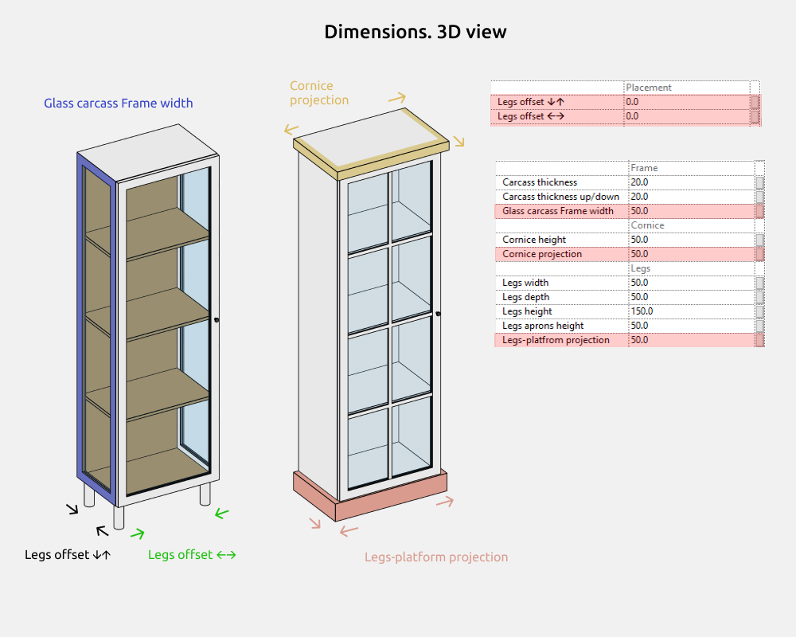

Glass carcass Frame width -works with parameter Glass carcass.

#### Doors

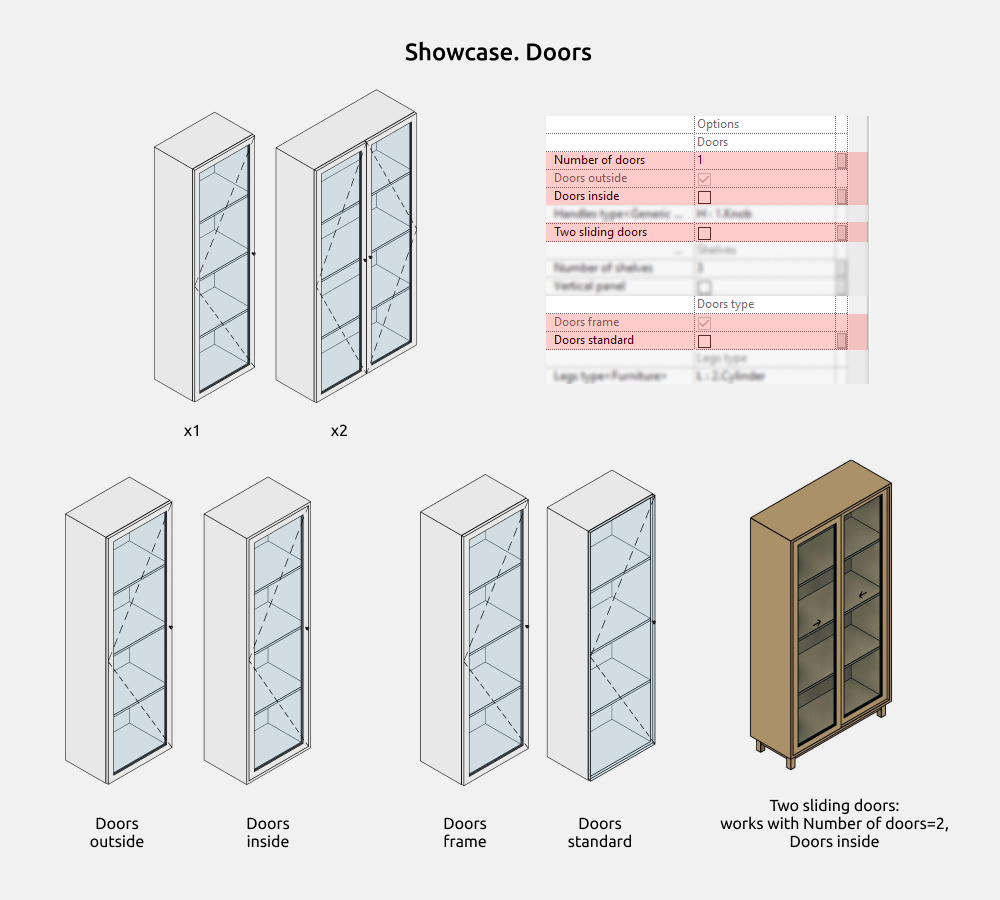

The number of doors can be from 1 to 2.

Doors outside are the doors that cover the cabinet carcass, and Doors inside, on the contrary, show the carcass thickness of the cabinet along the perimeter.

Doors can be standard (simple, without milling) or framed.

When the *Two sliding doors* option is enabled, one door slides behind the other. For correct work, you need to select Number of doors=2 and Doors inside.

#### Shelves

The number of shelves can be from 2 and more.

The vertical panel is turned on in the center of the showcase and divides the shelves into two sections.

#### Handles

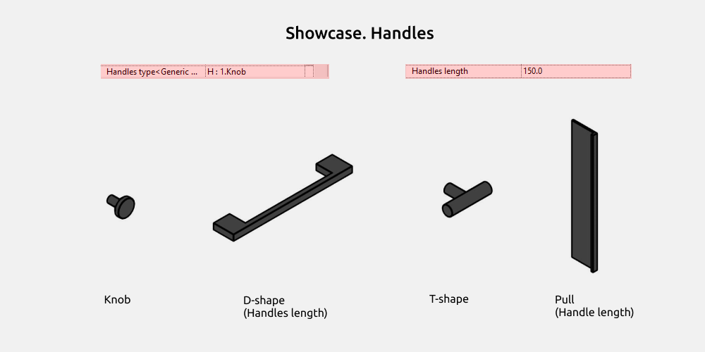

Handles types can be selected in the drop-down list. It is:

-   Knob
-   D-shape
-   Т-shape
-   Pull

Be sure to choose types with the initial heading H:. Because various other families are loaded into the drop-down lists and do not need to be selected.

For the D-shape and Pull handle works Handles length parameter.

#### Legs

Legs types can be selected in the drop-down list. It is:

-   Box
-   Cylinder
-   Cone
-   Inclined cone
-   Platform
-   Slope box
-   П-shape
-   Classic
-   Plinth

The Platform legs have an additional parameter in the Dimensions  -  Legs-platform projection.

Classic: Legs height  = 150mm.

#### Materials

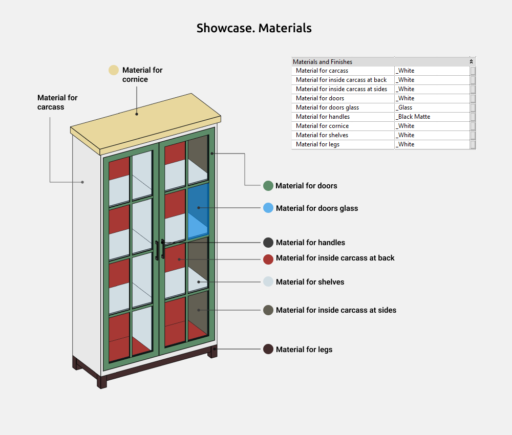

### Bookcase

Bookcase is used to build bookcases with shelves where books or other items can be placed. The upper doors are open/glass, and the lower ones are closed/no glass.

Here you can on/off the following elements:

-   Doors 2 (up)
-   Doors 1 (down)
-   Shelves
-   Handles
-   Cornice
-   Muntins (matches the number of shelves)
-   Legs
-   Legs aprons
-   Opening

#### Dimensions

*Bookcase height* is a height parameter consisting of two main parameters D1_Height and D2_Height, and there are also other small element heights if they are turned on (Legs height, Cornice height).

The carcass thickness (on the sides) may differ in size from the carcass thickness up/down. Green color in the picture.

There are gray parameters that cannot be controlled. But they are needed to understand the size calculations. For example, **D2_Height.** The parameter shows the height of the second door, as it is calculated by a formula based on the D1_Height and the height of the bookcase itself.

If the doors are turned off, the carcass moves by the Doors thickness.

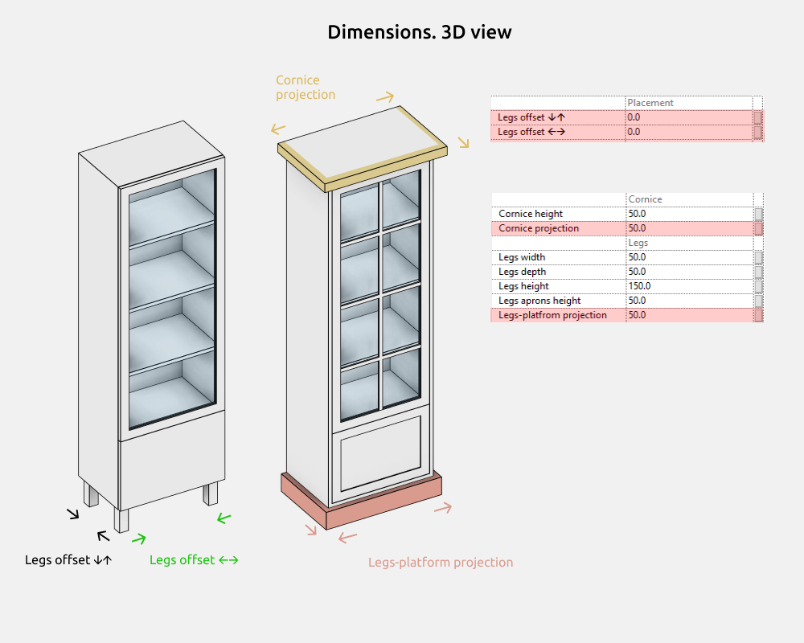

#### Doors. Common

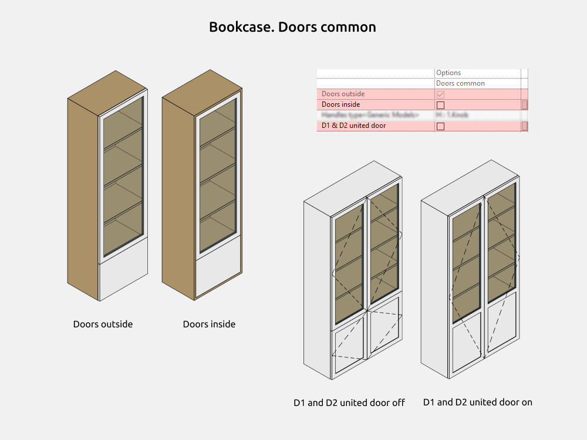

Doors outside are the doors that cover the cabinet carcass, and Doors inside, on the contrary, show the carcass thickness of the cabinet along the perimeter.

When the *D1 and D2 united door* parameter is enabled - the lower and upper doors become one single door. The opening also becomes united.

#### Doors 2

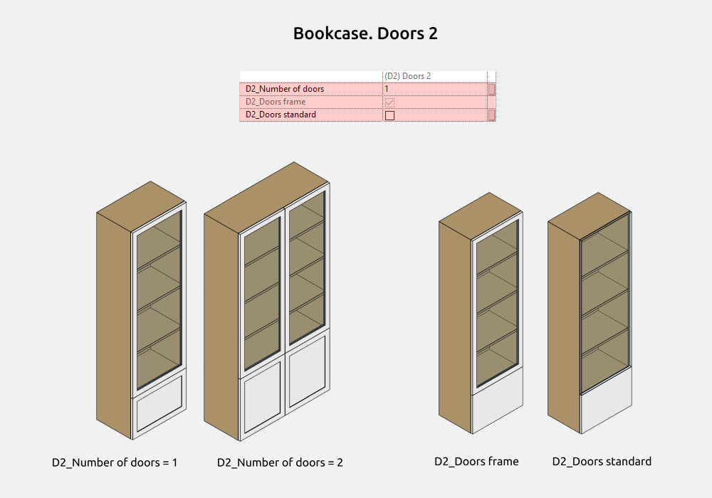

*D2_Number of doors* can be from 1 to 2.

D2 doors  can be standard (simple, without milling) or framed.

#### Doors 1

We select the number of D1 doors by check marks: 2 doors, 1 drawer, 2 drawers.

D1 doors can be standard (simple, without milling) or framed.

The default number of handles is 1, and if the option is disabled - 2.

#### Shelves

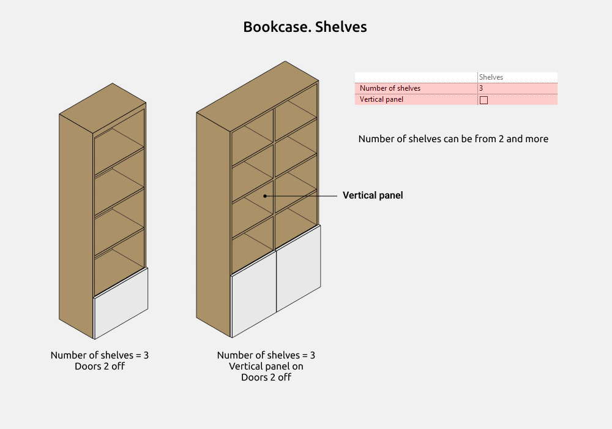

The number of shelves can be from 2 and more.

The vertical panel is turned on in the center of the D2 bookcase and divides the shelves into two sections.

#### Handles

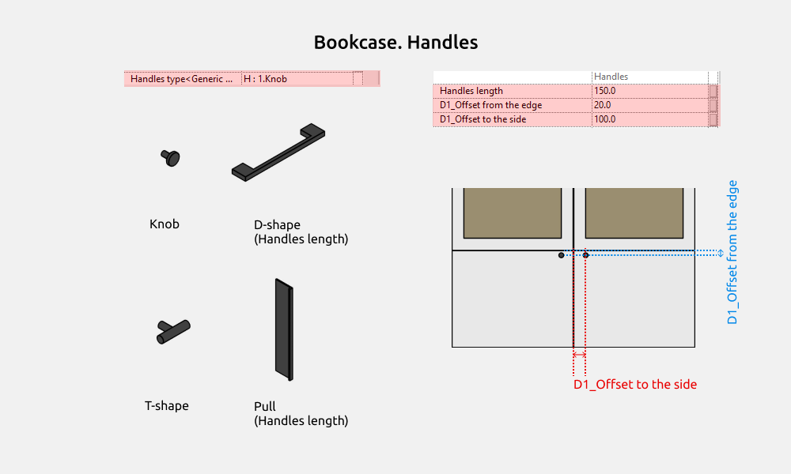

Handles types can be selected in the drop-down list. It is:

-   Knob
-   D-shape
-   Т-shape
-   Pull

Be sure to choose types with the initial heading H:. Because various other families are loaded into the drop-down lists and do not need to be selected.

For the D-shape and Pull handle works Handles length parameter.

#### Legs

Legs types can be selected in the drop-down list. It is:

-   Box
-   Cylinder
-   Cone
-   Inclined cone
-   Platform
-   Slope box
-   П-shape
-   Classic
-   Plinth

The Platform legs have an additional parameter in the Dimensions  -  Legs-platform projection.

Classic: Legs height  = 150mm.

#### Materials

### Cornice

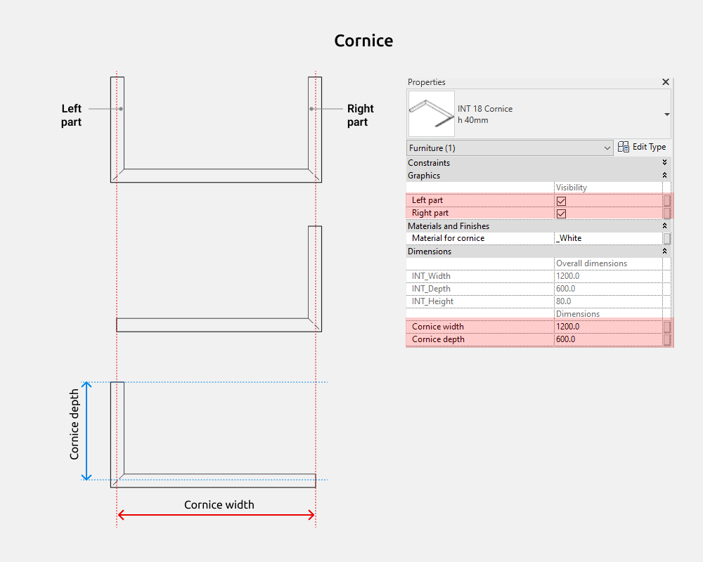

Cornice width and Cornice depth match with the dimensions of the cabinet on which the cornice will be installed.

There are two family types, differing in height - 40 and 80 mm.

Inside the family, you can load a new sweep profile or change the geometry of existing ones. But if you load a new one, then you need to select it in the drop-down list in the family profiles for a new sweep or for existing ones.

### Cornice W-shape

Cornice width and Cornice depth match with the dimensions of the cabinet on which the cornice will be installed.

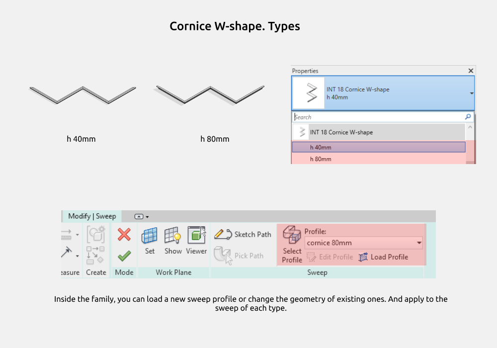

There are two family types, differing in height - 40 and 80 mm.

Inside the family, you can load a new sweep profile or change the geometry of existing ones. But if you load a new one, then you need to select it in the drop-down list in the family profiles for a new sweep or for existing ones.

### Doors

Doors - front doors of furniture cabinets. They can be used for built-in cabinets, kitchens, and any other furniture.

Doors made in various materials and shapes. This set includes the following types of doors:

-   Door
-   Door Wave
-   Door Ribbed-square
-   Door Ribbed-round
-   Door Glass
-   Door Classic
-   Door Louvers

Further shows the common parameters for all doors in the set.

#### Common. Handles

Handles types can be selected in the drop-down list. It is:

-   Knob
-   D-shape
-   Т-shape
-   Profile pull
-   Cup
-   Leather
-   Leather D-shape

For the D-shape, T-shape and Profile pull handles works parameter Handle length.

The **T-shape** display changes with different handle lengths (Handle.Length).

#### Common. Handles placement

The placement of handles is not made by a drop-down list, but simply by numbers from 1 to 9. Visually, this is similar to the placement of numbers from a keyboard. You can also look at the tooltip in the **Handle placement** parameter itself.

The position of the handles can be horizontal or vertical. The **Handle horizontally** parameter is responsible for this.

#### Common. Opening

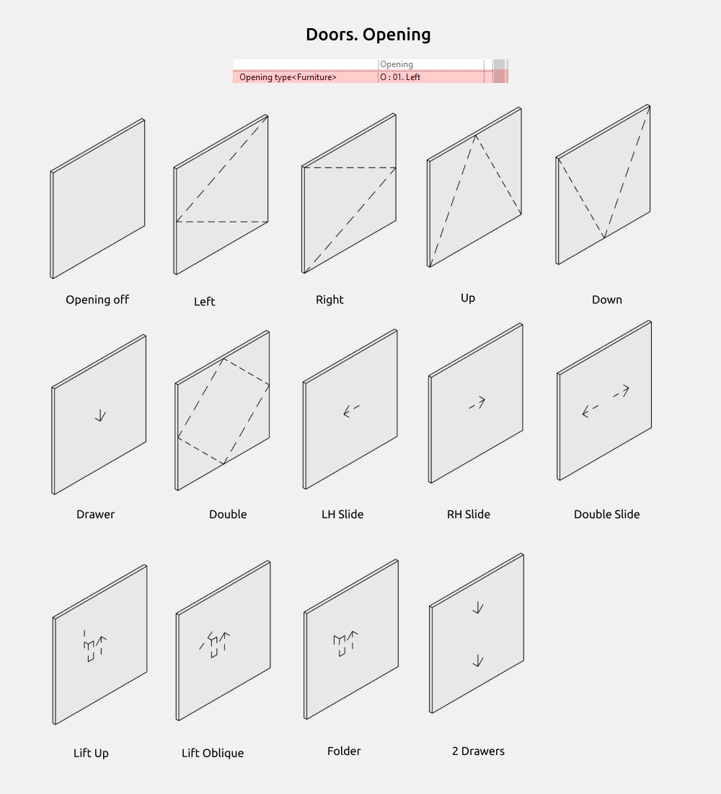

Opening types can be selected in the drop-down list. It is:

-   Left
-   Right
-   Down
-   Up
-   Drawer
-   Double
-   Left Slide
-   Right Slide
-   Double slide
-   Lift up
-   Lift oblique
-   Folder
-   2 drawers

Doors opening does not depend on the handles position.

#### Common. Dimensions

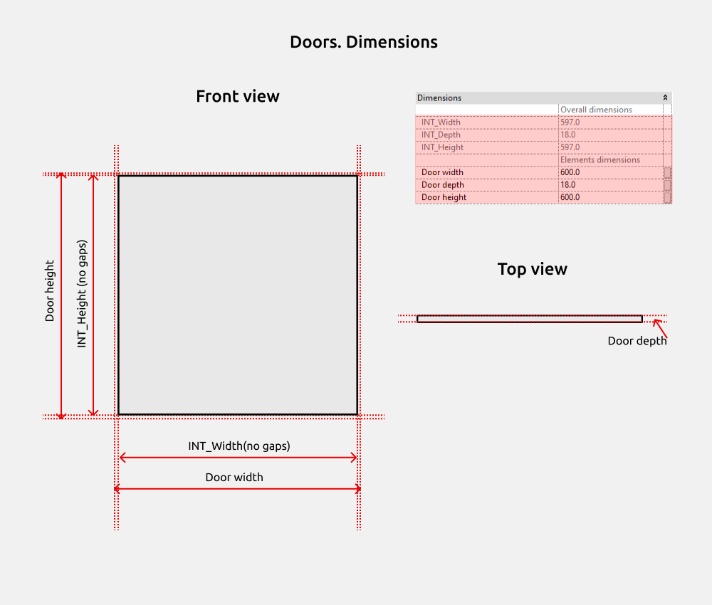

Door width and Door depth are dimensions with gaps, while ADSK dimensions are without gaps.

#### Door

Door - these are the standard and most popular types of doors.

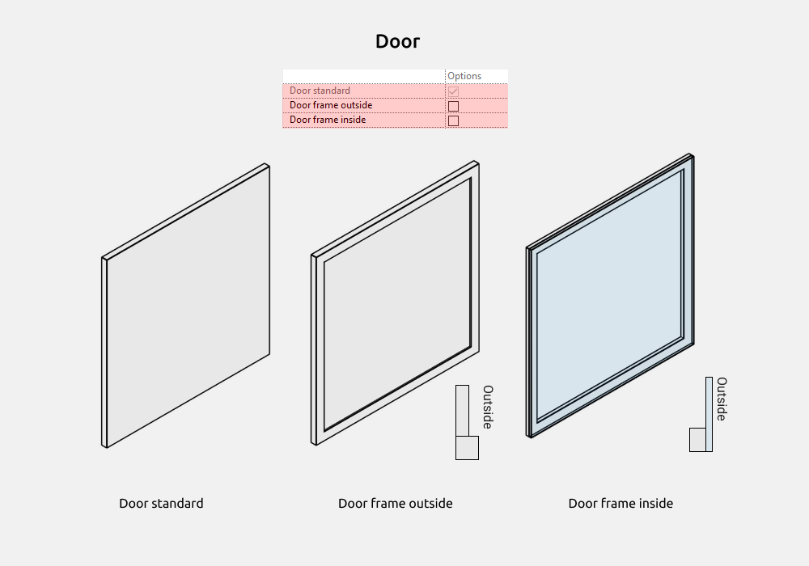

Door standard - a simple rectangular door.

Door frame outside - framed rectangular door, suitable for neoclassical style.

Door frame inside - the frame is inside, behind the glass.

Handles from the Common section are supplemented in this family with Integrated and Cutout. And it would bet:

-   Knob
-   D-shape
-   Т-shape
-   Cup
-   Leather
-   Leather D-shape
-   Profile pull
-   Integrated
-   Cutout

For the D-shape, T-shape, Cutout and Profile pull handles works parameter Handle length.

#### Door Wave

Door Wave - a door with milling, similar in shape to a wave.

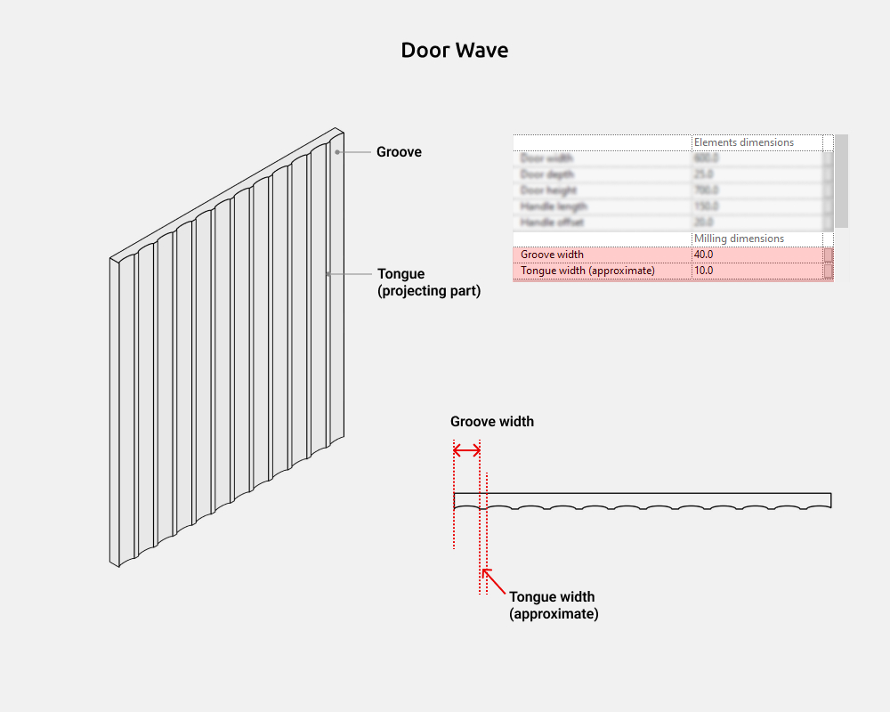

The width of the groove and tongue are adjustable, only the tongue will have an approximate width. This is due to the specific way that arrays work in Revit.

#### Door Ribbed-square

Door Ribbed-square  - a door with milling, similar in shape to slats.

The width of the groove and tongue are adjustable, only the tongue will have an approximate width. This is due to the specific way that arrays work in Revit.

Unlike other milling families, the groove depth is adjustable.

#### Door Ribbed-round

Door Ribbed-round - a door with milling, similar in shape to rounded slats.

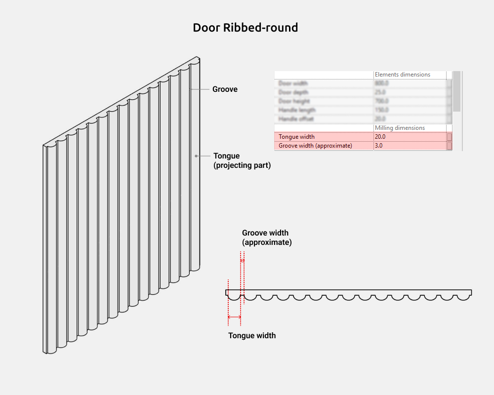

The width of the groove and tongue are adjustable, only the groove will have an approximate width. This is due to the specific way that arrays work in Revit.

#### Door Glass

Door Glass - a door with glass, muntins and muntins in the form of a cross.

Muntins - these are dividing planks on the door.

#### Door Classic

Door classic - framed doors with complex milling. The profile can be changed inside the family, but with a large profile width there may be errors in work.

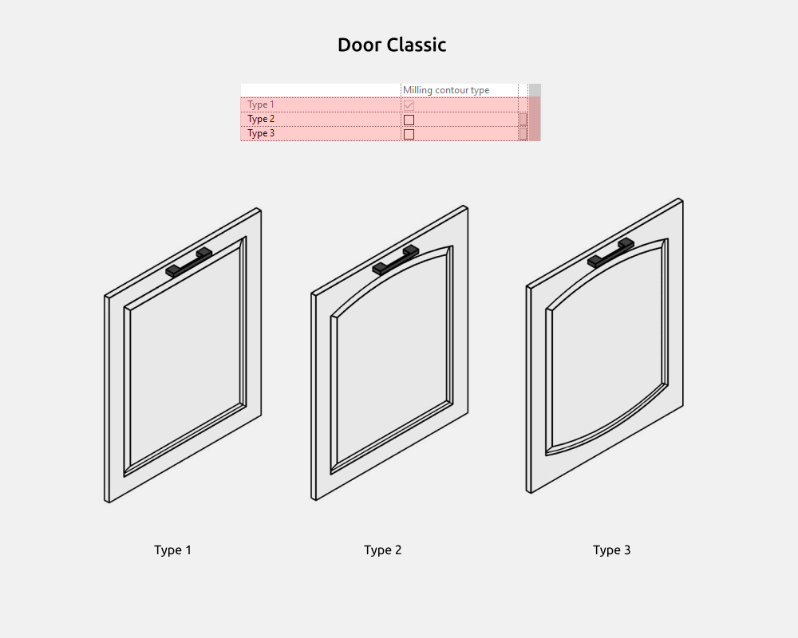

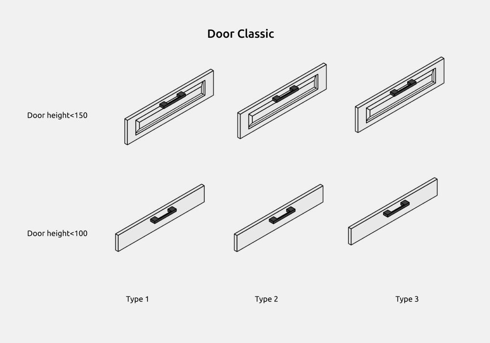

When the Door height is less than 150 mm, all types of door become Type 1. And the door frame width at the top and bottom is 2 times less, unlike the side frames.

When the Door height is less than 100 mm, all types of door become a simple rectangular facade without milling.

The Door width cannot be less than 150mm.

#### Door Louvers

Door louvers - a door with vertical and horizontal lamellas.

## 4. GRAPHICS

### Graphics settings

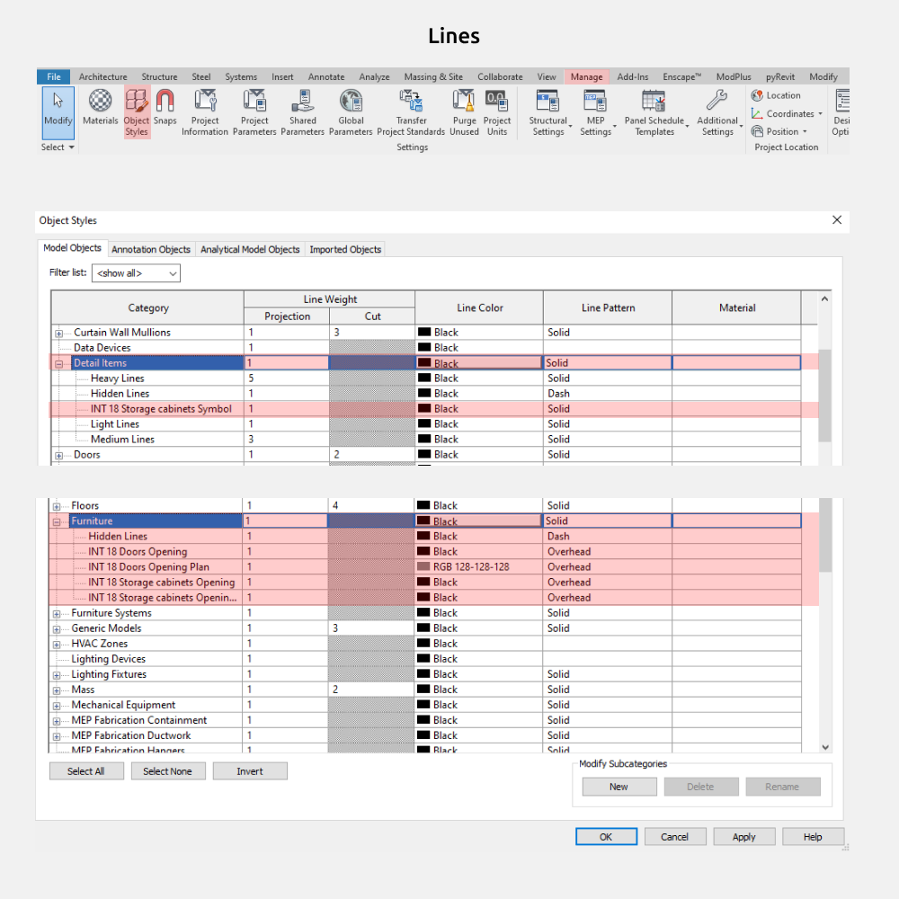

To change the color/weight/pattern of family lines, you need to go to Manage - Object Styles - Furniture/ Detail Items.

<CTA type="guide" />
