## 1. GENERAL INFORMATION

- Set name: Tables
- Version: 1.2.0
- Revit version: 2019

### Description

The set of Revit tables families is designed for work in Autodesk Revit and for use in BIM interior and architectural projects. The library includes parametric tables and storage‑decoration families.

The set is intended for interior designers, architects and drafters working in Autodesk Revit on residential and public projects.

### Loading and placing into the project

In order to view and download the families from the set, you can open Project with tables and copy the families using the Ctrl+C key combination, and then paste them into your project Ctrl+V. Or open the folder with family files and drag it into the project with the mouse.

## 2. SET STRUCTURE

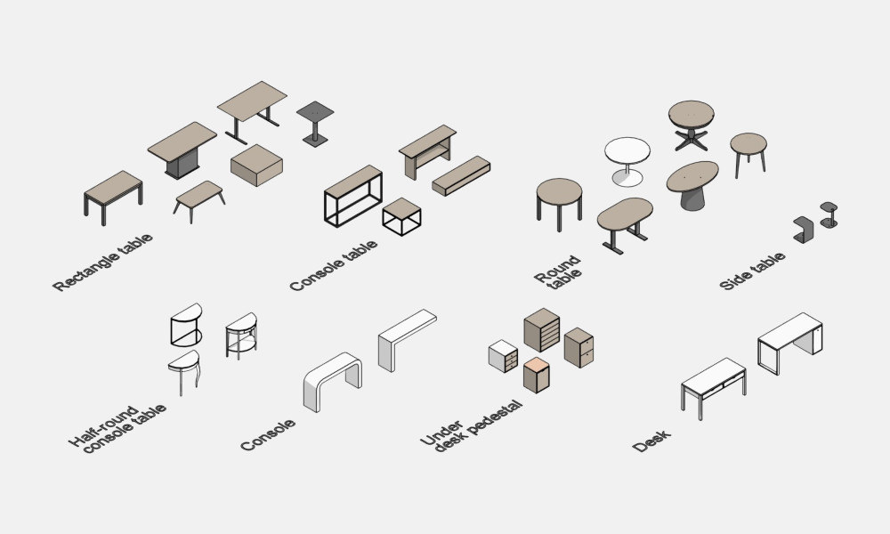

The parametric tables families:

- Console
- Side table
- Half-round console table
- Console table
- Round table
- Desk
- Rectangle table
- Under desk pedestal

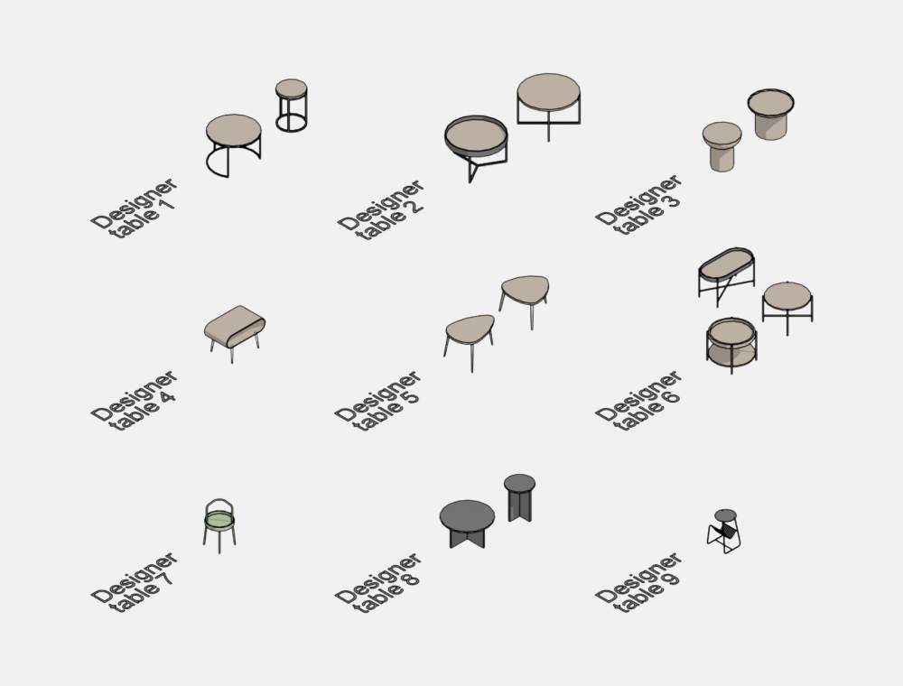\
The designer tables families:

- Designer table 1
- Designer table 2
- Designer table 3
- Designer table 4
- Designer table 5
- Designer table 6
- Designer table 7
- Designer table 8
- Designer table 9

## 3. FAMILIES: PARAMETERS AND ELEMENTS

### Common. Dimensions

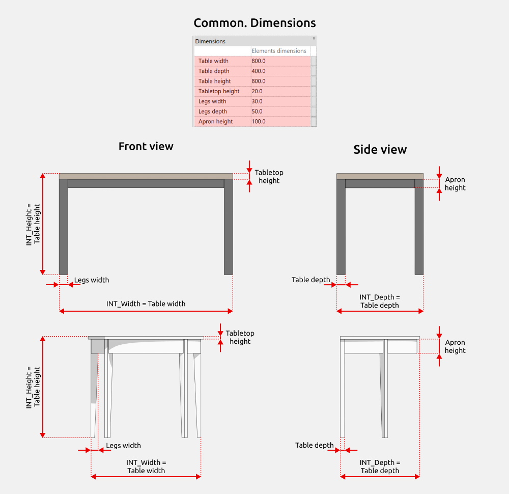

For most parametric tables, the following common parameters control the overall dimensions:

INT_Width = Table width

INT_Depth = Table depth

INT_Height = Table height

You can also change the values of the “Legs width”, “Legs depth”, “Table top thickness”, and “Apron height” parameters.

### Graphic symbol

In the top view, you can turn on the graphic symbol for the extendable tabletop using the “GS” parameter.

The width of the graphic symbol can be changed using the “GS_Table top width” parameter.

### Console

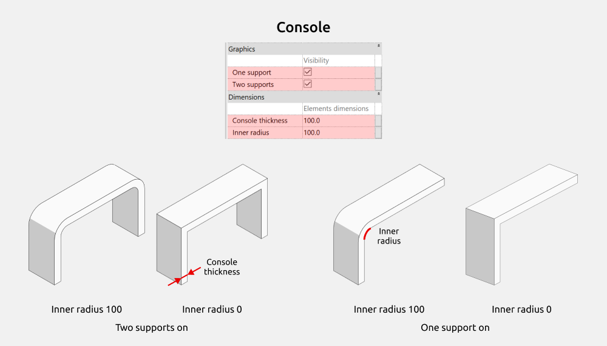

Here you can turn on/off the following elements:

- One support
- Two supports

In addition to changing the overall dimensions for the console, you can change the console thickness using the “Console thickness” parameter and the radius where the support transitions into the tabletop using the “Inner radius” parameter.

If Inner radius = 0, the console rounding is turned off.

### Side table

Here you can turn on/off the following elements:

- Shape rectangle
- Shape rounded rectangle

### Half-round console table

Here you can turn on/off the following elements:

- Apron
- Drawer
- Shelf

To turn on Drawer, you must first turn on Apron.

#### Options

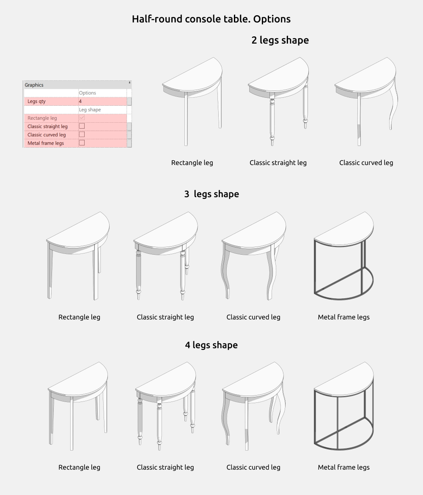

Here you can choose the number of legs from 2 to 4.

You can also choose from the following leg shapes:

- Rectangle leg
- Classic straight leg
- Classic curved leg
- Metal frame legs (not available for 2 legs)

#### Dimensions

All adjustable table dimensions are listed in the ”Common. Dimensions” section.

Parameter details:

Table height: 700mm or higher

Classic straight leg: leg width and depth are fixed.

Metal frame legs: dimensions are controlled by the “Legs frame thickness” parameter.

### Console table

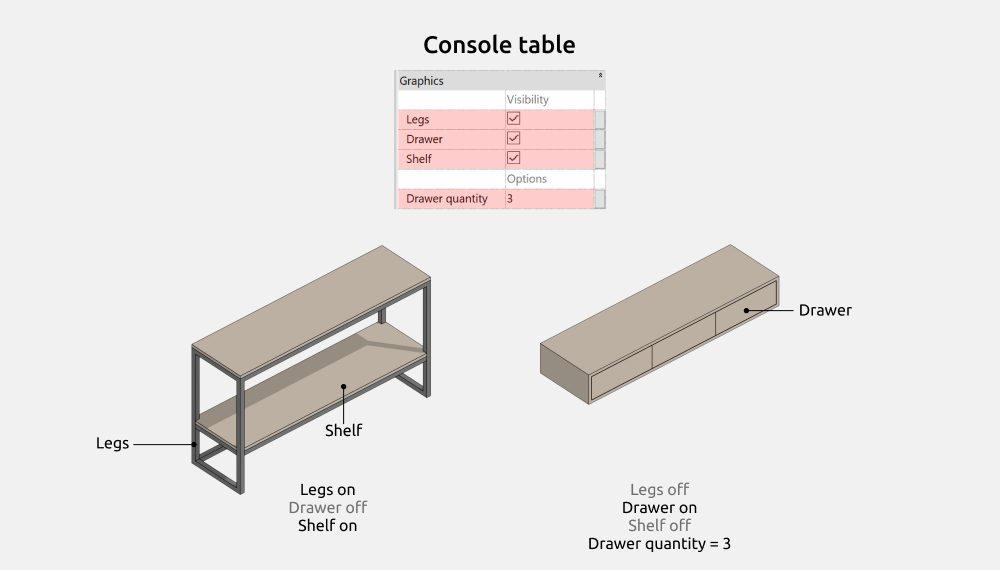

Here you can turn on/off the following elements:

- Legs
- Drawer
- Shelf

Number of drawers: 1 to 3.

The shelf can be turned on for all leg shapes except “Tapered rectangle leg”.

#### Options

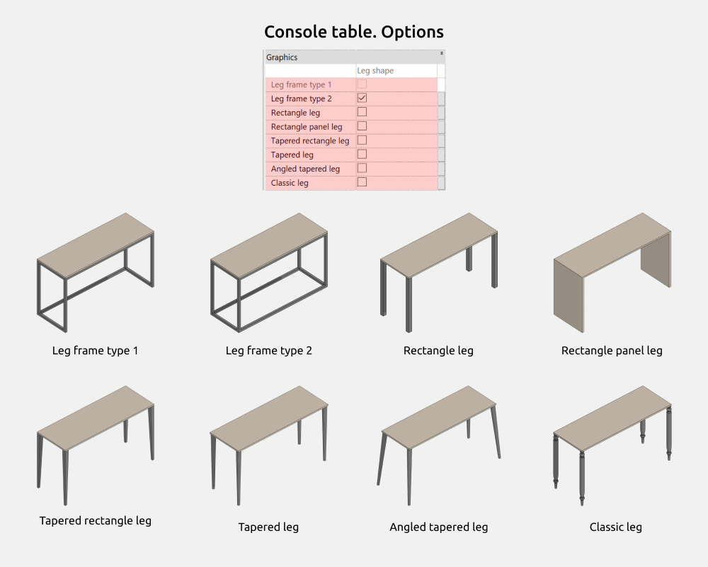

You can choose from the following leg shapes:

- Leg frame type 1
- Leg frame type 2
- Rectangle leg
- Rectangle panel leg
- Tapered rectangle leg
- Tapered leg
- Angled tapered leg
- Classic leg

#### Dimensions

In addition to the overall dimensions, you can change the leg offset from the tabletop edge using the “Side offset” and “Back offset” parameters.

You can also control the shelf height with the “Shelf height from floor” parameter and the drawer height with the “Drawer height” parameter.

For the “Tapered rectangle leg” shape, width ranges from 40 to 100 mm.

Classic leg has fixed dimensions (except height). Leg height is 300 mm or higher.

### Round table

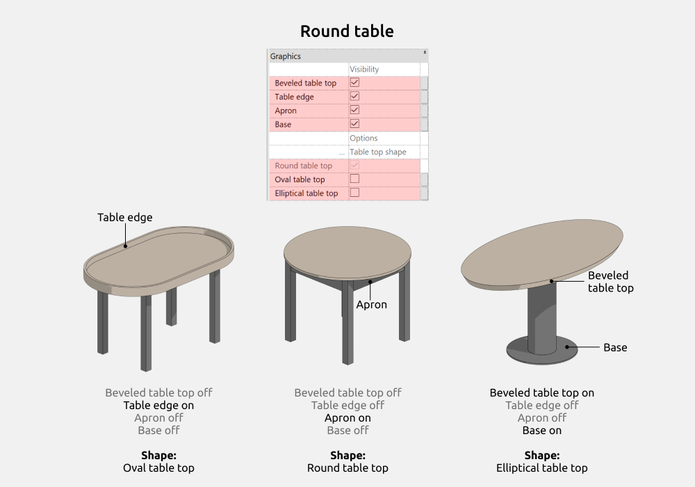

Here you can turn on/off the following elements:

- Beveled table top
- Table edge
- Apron
- Base

You can also choose the tabletop shape:

- Round table top
- Oval table top
- Elliptical table top

Apron can be turned on for the following leg types: 4 legs and 1 leg.

#### Options

Here you can choose the number of legs:\
- 4 legs
- 3 legs
- 2 legs
- 1 leg

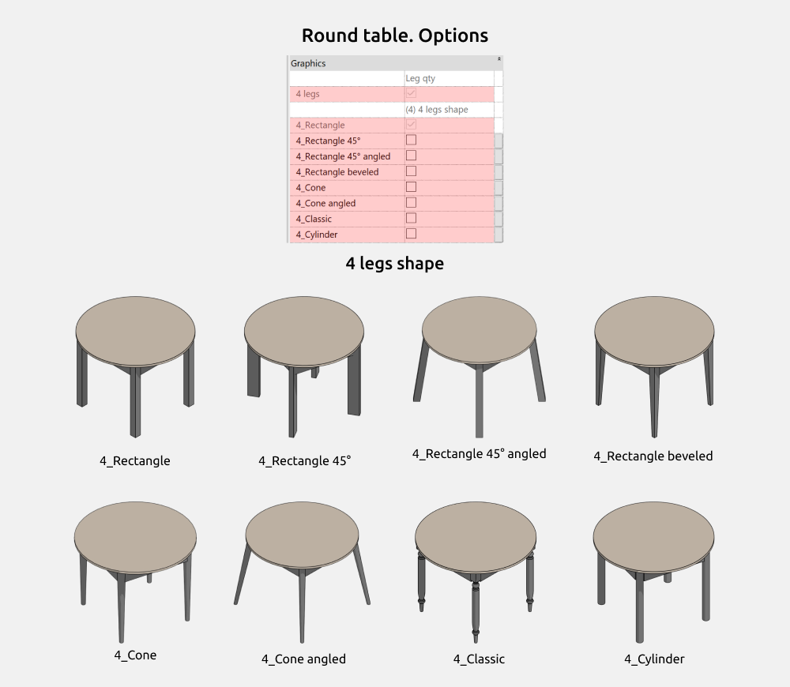

For 4 legs, you can choose from the following shapes:

- 4_Rectangle
- 4_Rectangle 45°
- 4_Rectangle 45° angled
- 4_Rectangle beveled
- 4_Cone
- 4_Cone angled
- 4_Classic
- 4_Cylinder

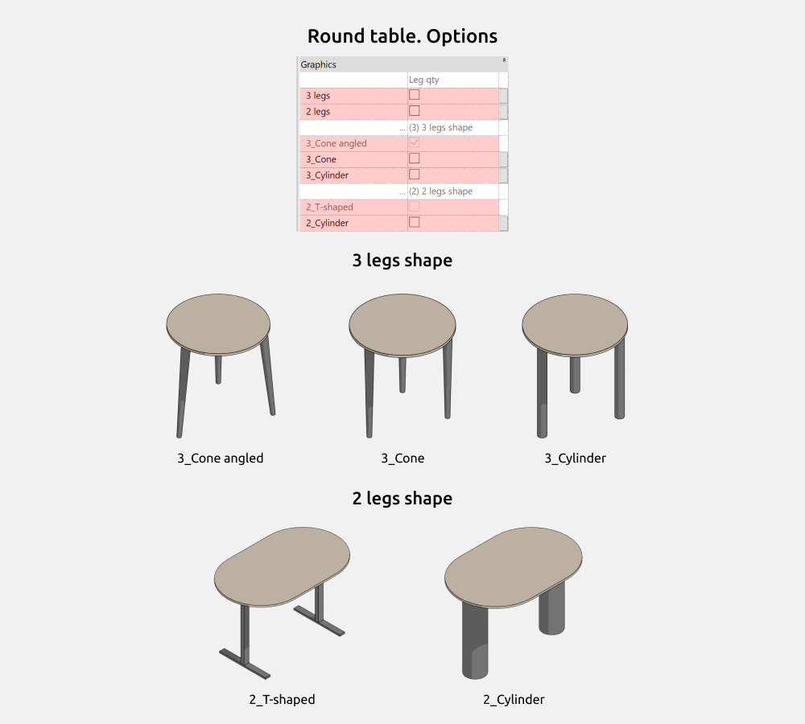

For 3 legs, you can choose from the following shapes:

- 3_Cone angled
- 3_Cone
- 3_Cylinder

For 2 legs, you can choose from the following shapes:

- 2_T-shaped
- 2_Cylinder

For 1 leg, you can choose from the following shapes:

- 1_Cone
- 1_Rectangle
- 1_Cylinder
- 1_Tulip (large)
- 1_Tulip (small)
- 1_Classic

When the “Base” parameter is turned on, you can choose the base shape for the leg:

- Base round
- Base cross

#### Dimensions

For 2, 3, and 4 legs, you can control the leg offset from the table edge using the “Side offset” and “Front/back offset” parameters.

When the “Base” parameter is turned on, you can control its width and height. If “Cross” base is selected, you can adjust the thickness using the “Base cross thickness” parameter.

When the “Table edge” parameter is turned on, you can control its height and thickness.

Leg shape dimensions:

For the “4_Rectangle beveled” leg shape, width ranges from 40 to 100 mm.

“4_Classic” has fixed dimensions (except height). Leg height is 400 mm or higher.

The leg shapes “1_Classic”, “1_Tulip (large)”, and “1_Tulip (small)” also have fixed dimensions.

Height for “1_Classic” is 600 mm or higher.

When the round tabletop shape is selected, the tabletop diameter is controlled only by “Table width”.

### Desk

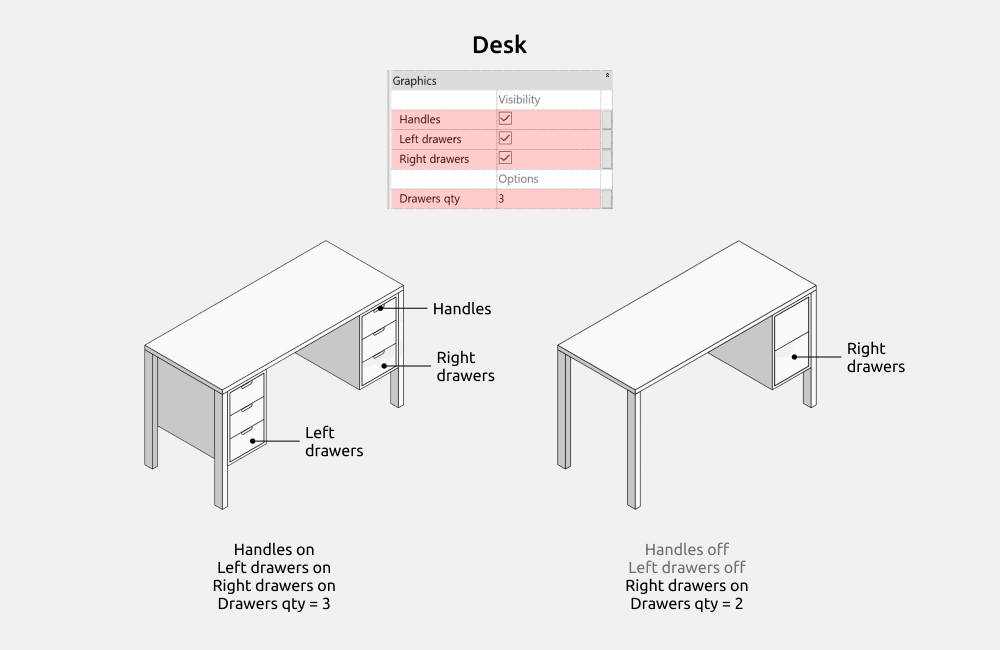

Here you can turn on/off the following elements:

- Handles
- Left drawers
- Right drawers

Number of drawers: 1 or more.

#### Options

Here you can choose the leg shape:

- Rectangle leg
- Rectangle panel leg
- U-shaped legs

When the “Handles” parameter is turned on, you can choose the handle shape:

- Handle cutout shape
- Handle button shape

If you don’t turn on the “Handles” parameter, the table will show flat front panels.

#### Dimensions

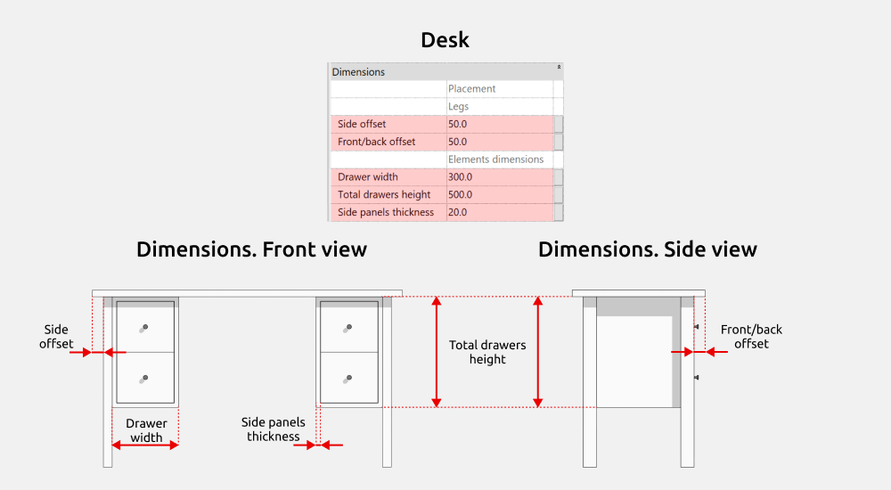

You can control the leg offset from the table edge using the “Side offset” and “Front/back offset” parameters.

When “Right drawers” or “Left drawers” is turned on, you can control their dimensions and wall thickness using the “Drawer width”, “Total drawers height”, and “Side panels thickness” parameters.

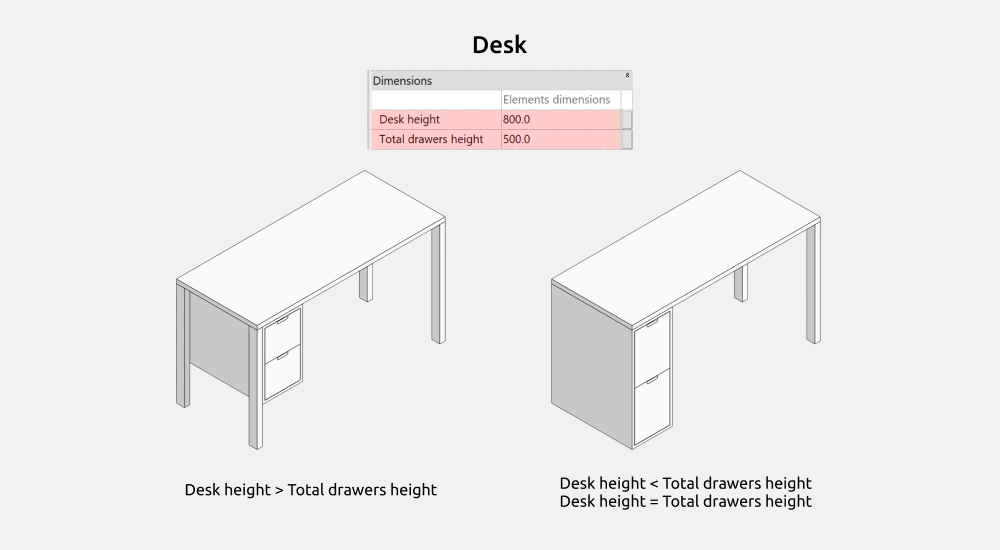

If “Total drawers height” is less than “Table height”, the drawers shift from the edge by the leg width, and the legs appear.

If it is greater than or equal to “Table height”, the legs disappear and the drawers take their place.

You can enter any value for “Total drawers height” — the drawers will still lock to the floor level.

### Rectangle table

Here you can turn on/off the following elements:

- Beveled table top
- Apron
- Base

Apron can only be turned on for one leg type: 4 legs.

#### Options

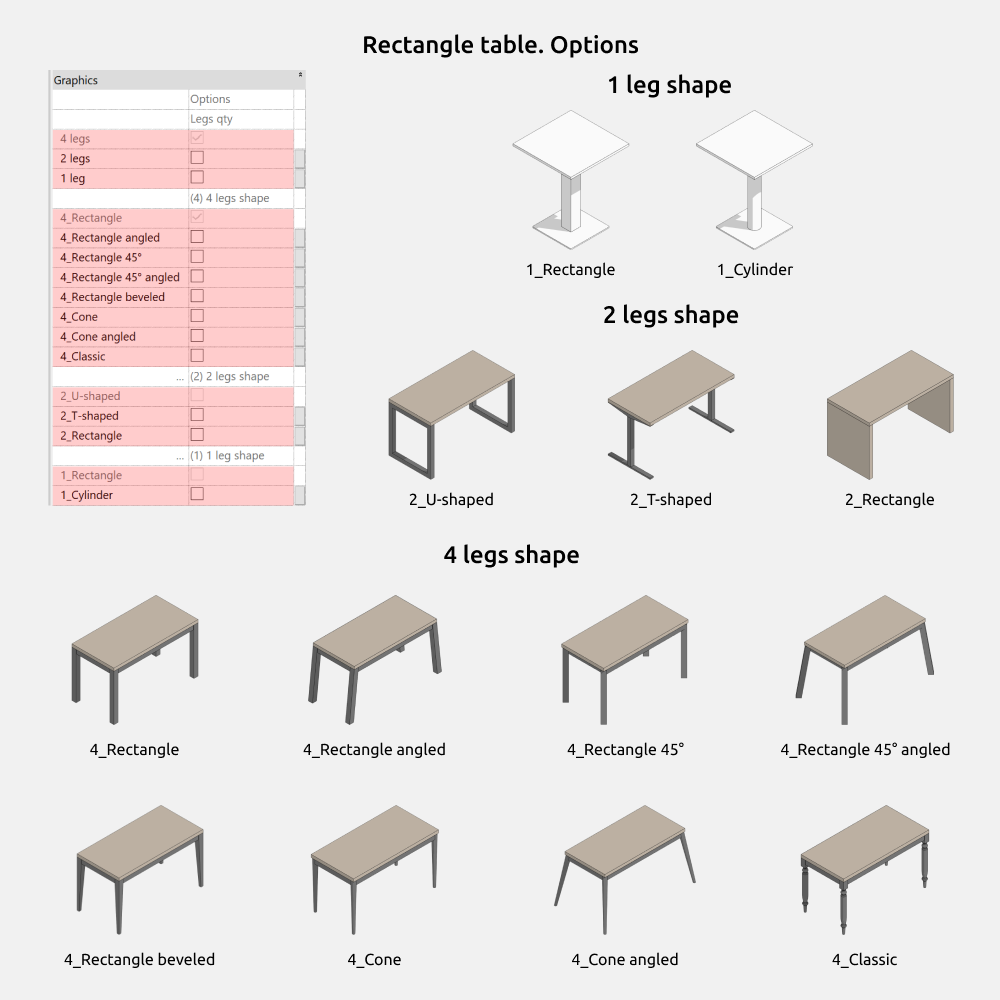

Here you can choose the number of legs:\
- 4 legs
- 2 legs
- 1 leg

For 4 legs, you can choose from the following shapes:

- 4_Rectangle
- 4_Rectangle angled
- 4_Rectangle 45°
- 4_Rectangle 45° angled
- 4_Rectangle beveled
- 4_Cone
- 4_Cone angled
- 4_Classic

For 2 legs, you can choose from the following shapes:

- 2_U-shaped
- 2_T-shaped
- 2_Rectangle

For 1 leg, you can choose from the following shapes:

- 1 Rectangle
- 1 Cylinder

#### Dimensions

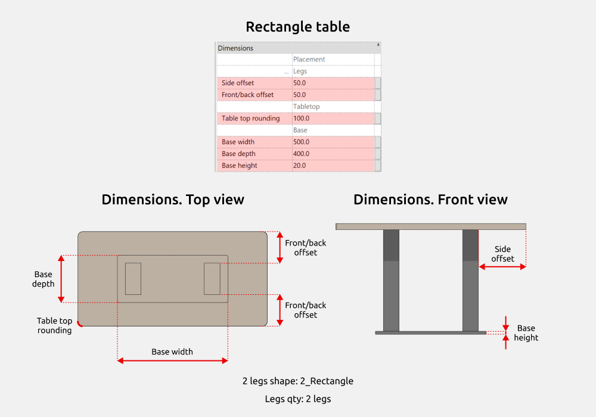

For 2 and 4 legs, you can control the leg offset from the table edge using the “Side offset” and “Front/back offset” parameters.

The “Table top rounding” parameter controls the corner radius of the tabletop.

When the base is turned on, you can change its dimensions: “Base width”, “Base depth”, and “Base height”.

For the “4_Rectangle beveled” leg shape, the “Legs width” parameter ranges from 40 to 100mm.

For the “4_Classic” leg shape, dimensions are fixed (except height). Leg height is 400mm or higher.

### Under desk pedestal

Here you can turn on/off the following elements:

- Handles
- Pillow

Choose an unlimited number of drawers.

You can also choose the front panel placement:\
- Drawer fronts inside
- Drawer fronts outside

#### Options

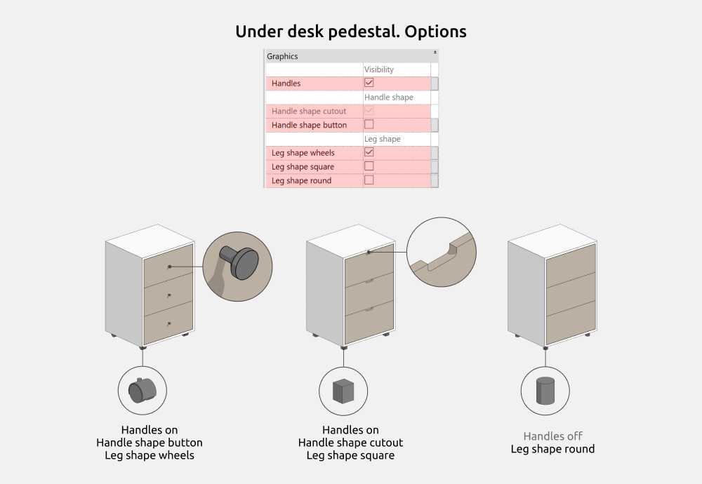

When the “Handles” parameter is turned on, you can choose its shape:

- Handle shape cutout
- Handle shape button

You can choose the leg shape:

- Leg shape wheels
- Leg shape square
- Leg shape round

#### Dimensions

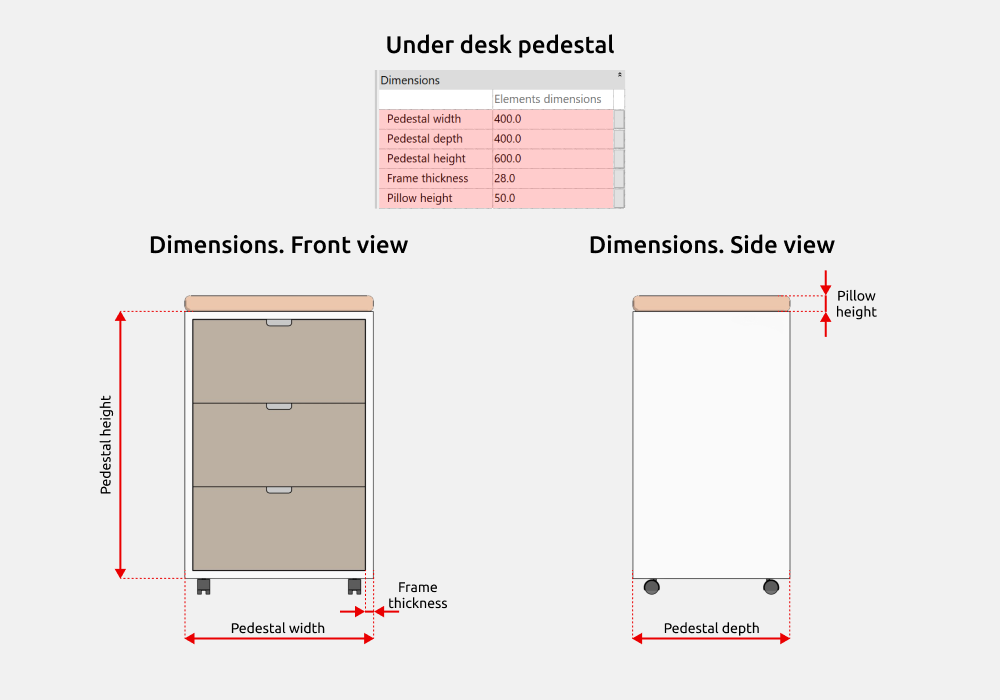

For the pedestal, you can control the overall dimensions using the “Pedestal width”, “Pedestal depth”, and “Pedestal height” parameters.

The “Pedestal height” parameter is made up of the pedestal body height plus a fixed leg height.

You can also control the frame thickness using the “Frame thickness” parameter.

When the “Pillow” parameter is turned on, its height can be controlled using the “Pillow height” parameter.

### Designer tables

For Designer Table 1, you can turn on/off the following elements:

- Table edge

Leg shape:

- Legs frame type 1
- Legs frame type 2

For Designer Table 2, you can turn on/off the following elements:

- Beveled table top edge
- Table edge

Leg shape:

- Legs cross type 1
- Legs cross type 2

For Designer Table 6, you can turn on/off the following elements:

- Table edge
- Shelf
- Cross

Tabletop shape:

- Table shape round
- Table shape oval

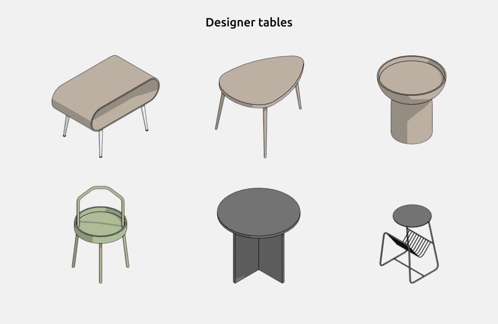

For other designer tables, you can control the dimensions of the elements, except for Type 9.

## 4. GRAPHICS

### Graphics settings

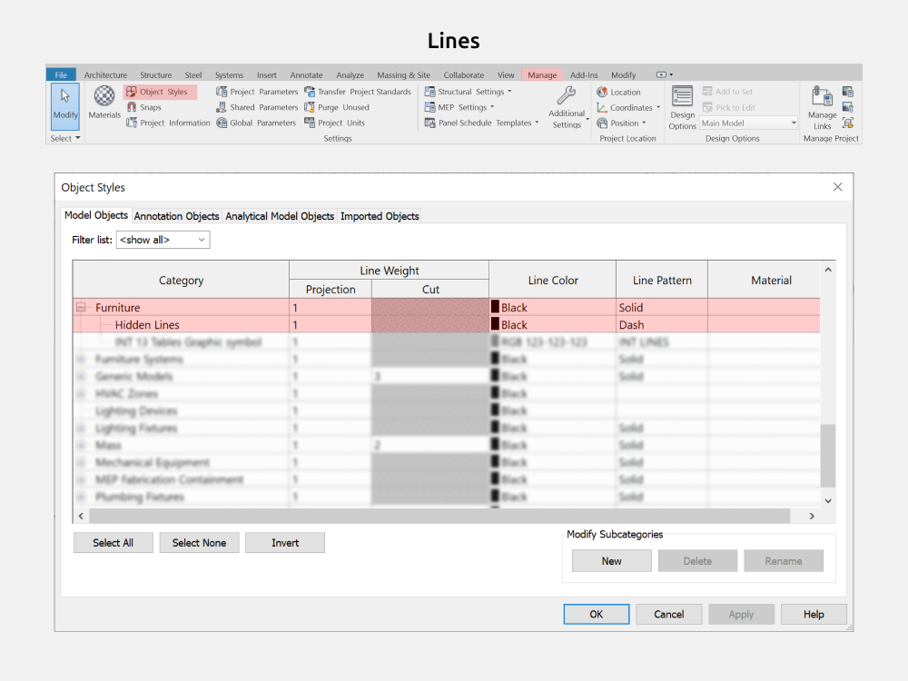

To change the color, line weight, or line pattern of the Graphic symbol for families with an extendable table top, go to Manage \> Object Styles \> Furniture category.

<CTA type="guide" />
