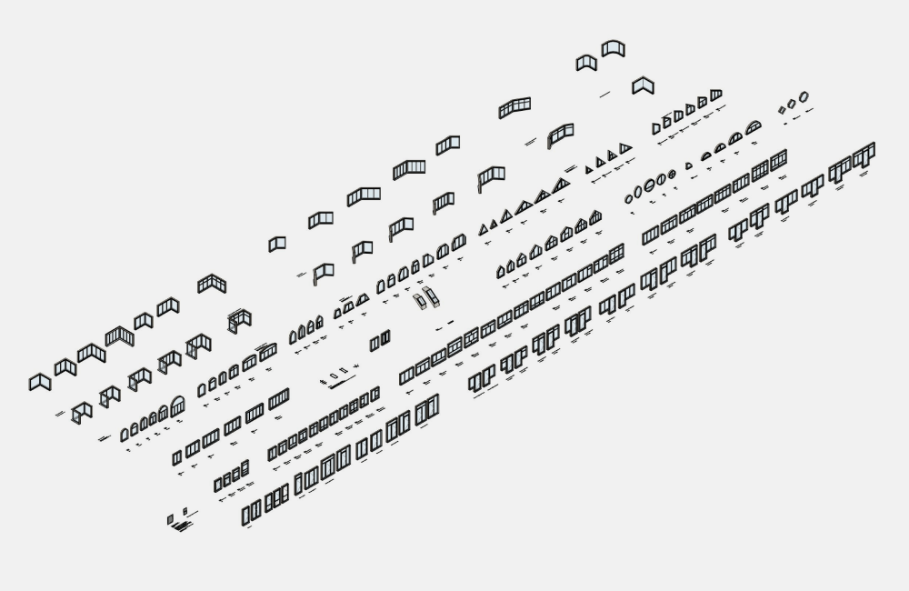
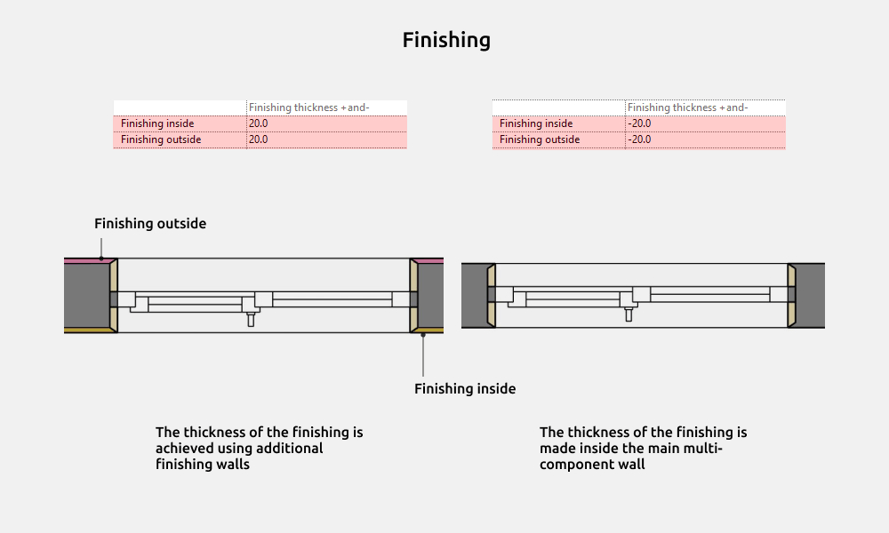
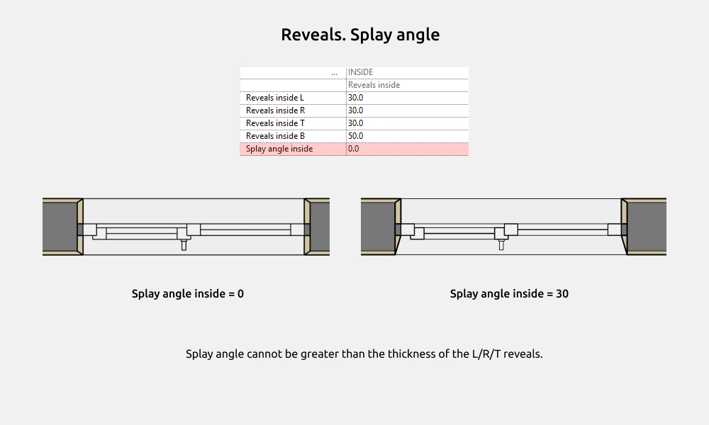
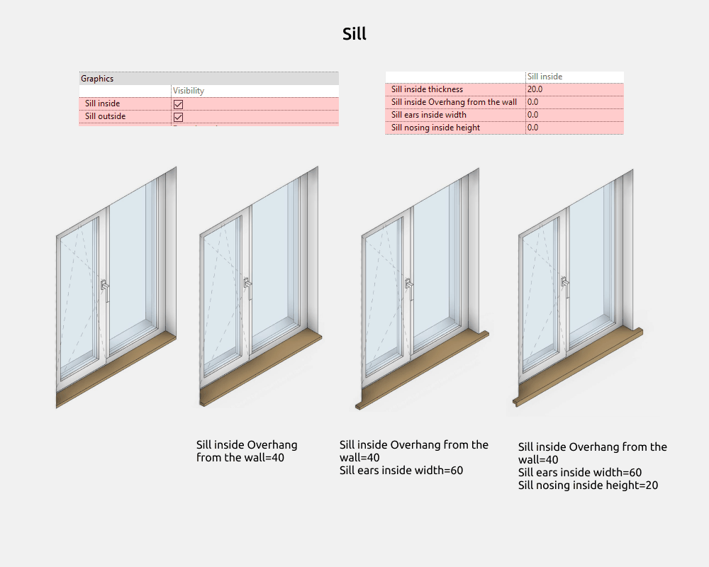
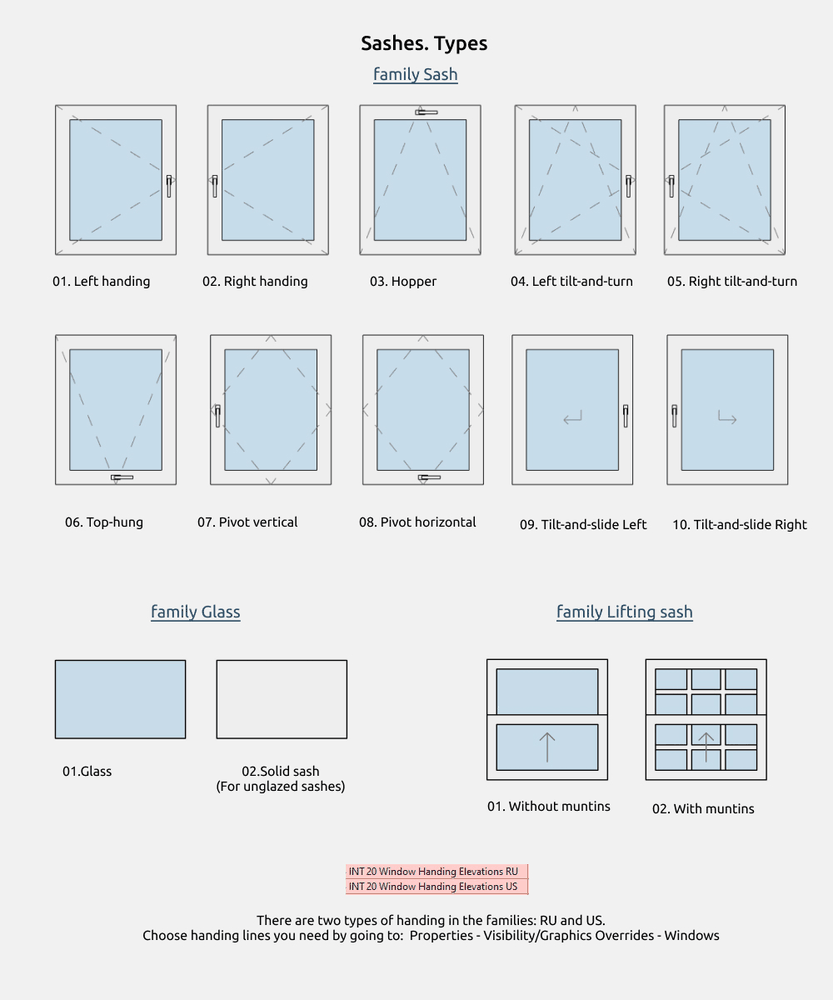
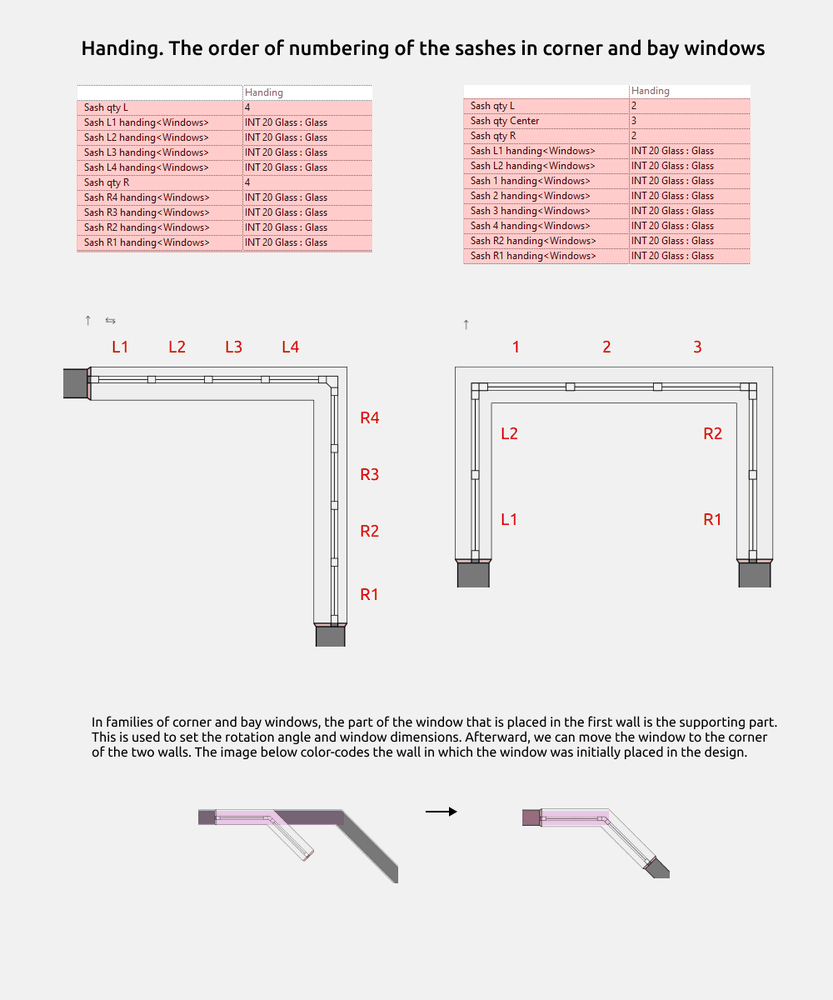
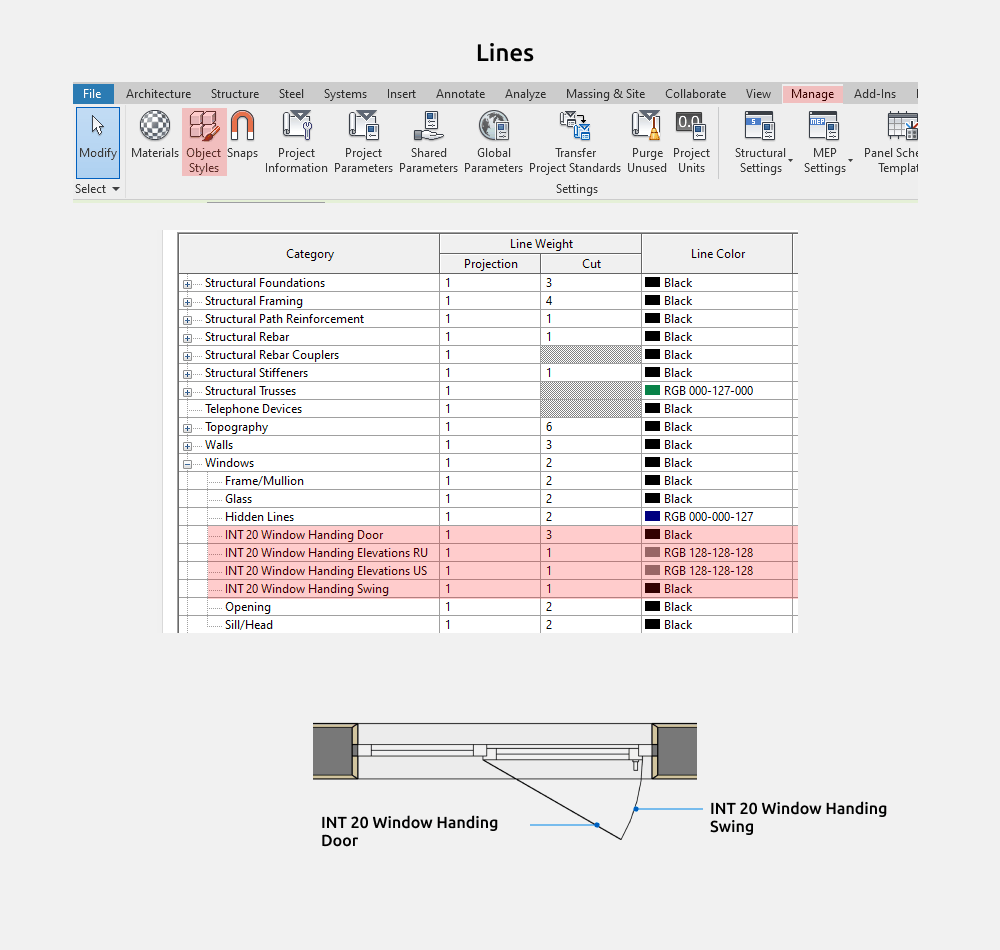

import productPreview from './product.jpg';

<ProductCard
  name="Window Revit Families"
  eyebrow="Revit Family Set"
  description="Casement, sliding and fixed windows — window families ready to drop into your Revit project."
  image={productPreview}
  imageAlt="Windows Revit Families — set preview"
  buyUrl="https://bimcore.one/products/windows"
  ecwidProductId="794237685"
/>

## 1. GENERAL INFORMATION

- Set name: Windows
- Version 1.1.0
- Revit version: 2019

### Description

This set of Revit families is made for modeling different windows, balcony units, roof windows, sliding, corner and bay windows with transom in Autodesk Revit.

Suitable for interior designers and architects. The geometry of the frame, sashes and other elements are made by the tools of Revit.

### Loading and placing into the project

In order to view and download the families from the set, you can open the folder with family files and drag it into the project with the mouse.

IMPORTANT! Place windows only on the plan view, not in 3D (otherwise, an error may occur and Revit will not allow you to place the window).

## 2. SET STRUCTURE

The set includes the following group of families, category Windows:

- Window openings
- Windows (rectangular, arched, trapezoidal, triangular, round, polygonal)
- Balcony units
- Corner and bay windows
- Sliding windows
- Roof windows
- Muntins
- Sashes
- Window tag

The set also includes families of the Curtain Panels category, which are suitable for insertion into a Curtain wall:

- Curtain door
- Curtain sash

The total number of families is about 170 pieces.

## 3. COMMON ELEMENTS

Common elements - elements that are repeated in each family.

### Dimensions

In window families, you can change the Width, Height, and Rebate of the opening. The distance to the sill is changed using the INT_Height to the sill parameter, which is entered into the schedules and the tag.

Width and Height - these are the dimensions of the opening.

Rough width and Rough height - these are the dimensions of the window (Width - Gap_L - Gap_R, Height - Gap_T - Gap_B).

Installation depth - position of the window frame in the wall opening

Gaps can be reduced to 0. Sash overlap cannot be less than 0.

The width of the opening at corner windows is measured from the main wall (along the grey dotted line), not along the reveals.

Corner window 90°: rotation angle is fixed, the thickness of the walls may be different.

Corner window: rotation angle is changed, the thickness of the walls is the same.

The width of the opening at bay windows is measured from the main wall (along the grey dotted line), not along the reveals.

Bay window 90°: rotation angle is fixed, the thickness of the walls is the same.

Bay window: rotation angle is changed, the thickness of the walls is the same.

### Finishing

If the project includes additional thin walls that are attached to the main wall, the window must be offset by the thickness of the finishing and fit within the dimensions.

The finishing can be both external and internal.

If the finishing is done with additional walls, then you need to set a positive value for the thickness of the finishing in the windows, and if the wall is multi-component, then a negative value for the thickness.

### Reveals

Reveals are made in all window families using common nested families. They are located in the Walls group. You can enable or disable them by clicking the "Reveals outside" and "Reveals inside" parameters.

Abbreviations used: L - left, R - right, T - top, B - bottom.

If the abbreviation in the family is written as "LRT," it means the left, right, and top have the same thickness for the parameter.

Splay angle cannot be greater than the thickness of the L/R/T reveals.

To ensure that the reveals area is calculated for a single edge rather than the entire volume (which would produce incorrect data in the schedules), materials are made with different parameters.

Reveals material not for schedules—it's the fill material for the reveals. It's not required for the schedules.

Reveals material is the outer edge of the reveals, to which the material is applied using the paint tool. The material can be used to calculate the area.

### Sill

The window sills are made as a common nested family with two types:

- Sill inside
- Sill outside

By default, the Overhang from the wall, Sill ears and Sill nosing parameters for window sills are set to 0.

Identity data includes parameters where you can entering descriptions for internal and/or external window sills. These are common parameters that are included in the schedules.

The same parameters exist for window sill dimensions. They are built into nested window sill families. If you don't need external window sills in the schedules, exclude the "Sill outside" family type.

The casing are fixed to the edge of the jambs and move with it. Even if the jambs are turned off and you need to move the door casing, simply adjust the thickness of the jambs.

### Material for window inside and outside

### Sashes

Sash families are loaded into the project additionally, and by default, the families only include the Glass family.

If you only want to show the window layout, you don't need to load the sash.

After loading it into the project, you need to replace Glass with the opening type in the drop-down list.

Family Glass includes two types:

- 01.Glass
- 02.Solid sash (for unglazed sashes)

Family Sash includes the following types:

- 01.Left handing
- 02.Right handing
- 03.Hopper
- 04.Left tilt-and-turn
- 05.Right tilt-and-turn
- 06.Top-hung
- 07.Pivot vertical
- 08.Pivot horizontal
- 09.Tilt-and-slide Left (in the type you can move the arrow on the plan above)
- 10.Tilt-and-slide Right (in the type you can move the arrow on the plan above)

Family Lifting sash includes two types:

- 01.Without muntins
- 02.With muntins (Muntins are made of one type; if you need a different layout, then use the muntins families from folder 06.Muntins)

### Handing

We start counting the sashes from the left. The top and the bottom sashes are labeled T and B.\
To help us navigate which side of the window we're looking at on the plan from above, there are flip arrows. They show the outer left side of the families. This means we can use them to determine where the outside finishing will be, or inside finishing, and so on. The arrow will only appear when we click on the family itself.

### Detail level

Coarse detail level: Opening with frame lines. It's best to exclude additional finishing walls, as the opening is drawn along the main wall.

Medium detail level: The geometry of the window is drawn with 2D lines, white fill. Sashes are shown with low detail. Irregularly shaped windows are often shown cropped in the plan above, and for this purpose it is more convenient to use the medium level of detail.

Fine detail level: The frame and sashes are white in 2D, everything else is displayed in color, as in 3D. The sashes are drawn in more detail.

### Window tag

Window tag has following types:

- Type mark
- Type mark + Dimensions
- Mark
- Mark + Dimensions
- Dimensions

## 4. STYLING

### Graphics settings

To change the color/weight/pattern of family lines, you need to go to Manage - Object Styles - Windows

You can also disable the lines in the Visibility/Graphics Override.

<CTA type="guide" />
