Autodesk Revit is a program that lets you create an information model of a building and use it to produce construction drawings. If you are a builder, architect, interior designer, or engineer and that definition tells you nothing, I will explain this program in plain language below. What is it for, and who needs it? Which tasks does it solve perfectly, and which ones does it struggle with? How hard is it to learn, how long does it take, and how can you make money with it? And, of course, should you switch to Revit? Let's figure it out!

## 1. What Is Revit in Plain Language

Revit is a program for designing anything that can be built, from private houses to skyscrapers. Its special feature is that you design directly in 3D. In effect, you create a full-size digital copy of the future building. Revit lets you place ready-made objects such as walls, windows, and roofs directly into the project. You do not need to use lines (AutoCAD) or create 3D geometry yourself from scratch (SketchUp) just to make an element look like a wall or window. It is a bit like The Sims, but do not rush to celebrate: designing in Revit is not just as easy. Designing with objects rather than lines and 3D geometry is the key difference between BIM and CAD programs.

:::info[What BIM means]

**BIM stands for Building Information Modeling.**

In other words, in these programs you literally build an information model. The information is what appears after you place an object, whether it is a wall or a window. It includes dimensions, material, and any other attributes you decide to add. Programs that operate with objects rather than lines are BIM programs.

:::

:::info[What CAD means]

**CAD stands for Computer-Aided Design.**

These programs help you move from drawing by hand with a pencil to creating drawings with lines and 3D geometry on a computer. In other words, this is the first step after drafting on paper.

:::

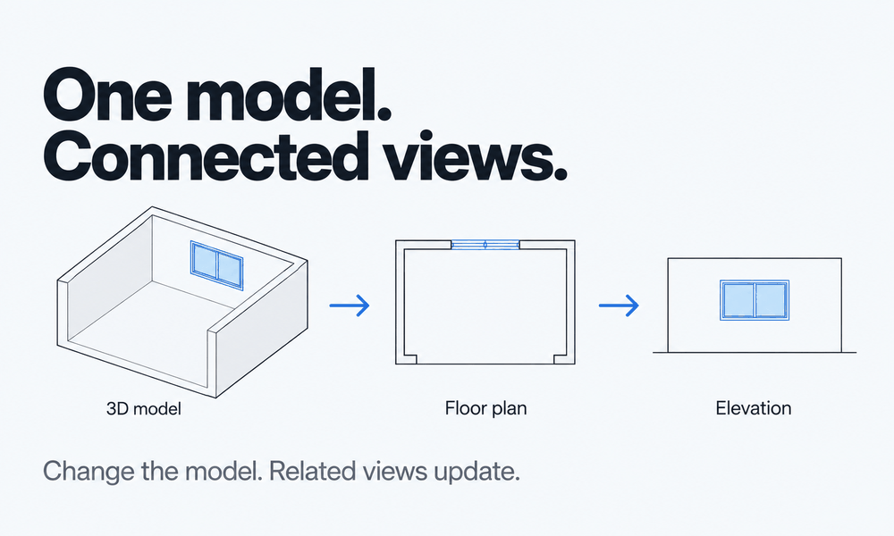
After creating the building's information-rich 3D model, Revit uses special entities called views to prepare documentation. A view shows a particular projection of the object from above, below, front, back, or side, or as a section. When the information model changes, the view changes instantly, so you do not have to track changes manually on every sheet.

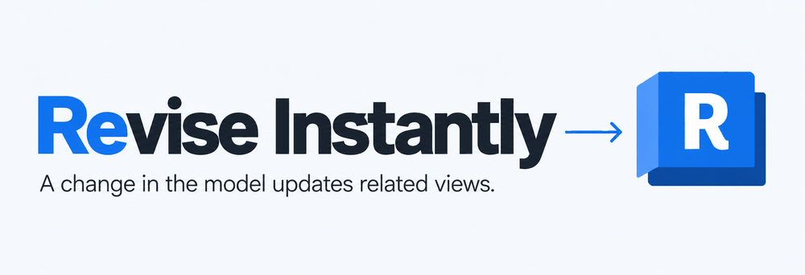

:::note[Where the name Revit comes from]

The name Revit comes from the expression Revise Instantly precisely because any change in the model immediately changes its display in every view. This really is very convenient and useful.
:::

In views, you can use tools to add dimensions and tag elements so that people on site understand how and from what to assemble our building. These tools are called annotations and are on the corresponding tab.

## 2. The Actual Result You Can Get from Revit
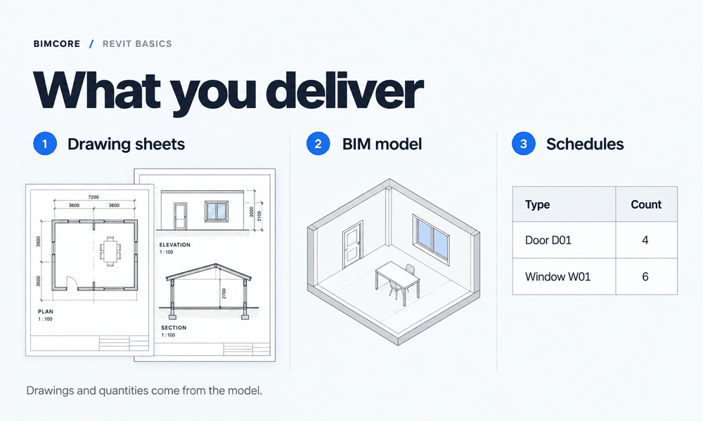
When you use Revit for design, the result is a set of drawings from which the building will be constructed. Going into detail, you can create floor plans, elevations, sections, and furniture and equipment schedules. Yes, Revit counts areas and the number of objects in the project by itself, and after AutoCAD this is a real miracle! And yes, you must check it and define the counting rules: which elements to count and which attributes to use. It is not as simple as it sounds, but it is worth it. A configured template saves a ton of time when calculating schedules. You can even produce decent architectural visualization in Revit. But for interior visualization, you need third-party programs such as Enscape and Twinmotion (included with a subscription starting with Revit 2023.1 and installed separately), or Autodesk 3ds Max.

## 3. Who Can Benefit from Revit?
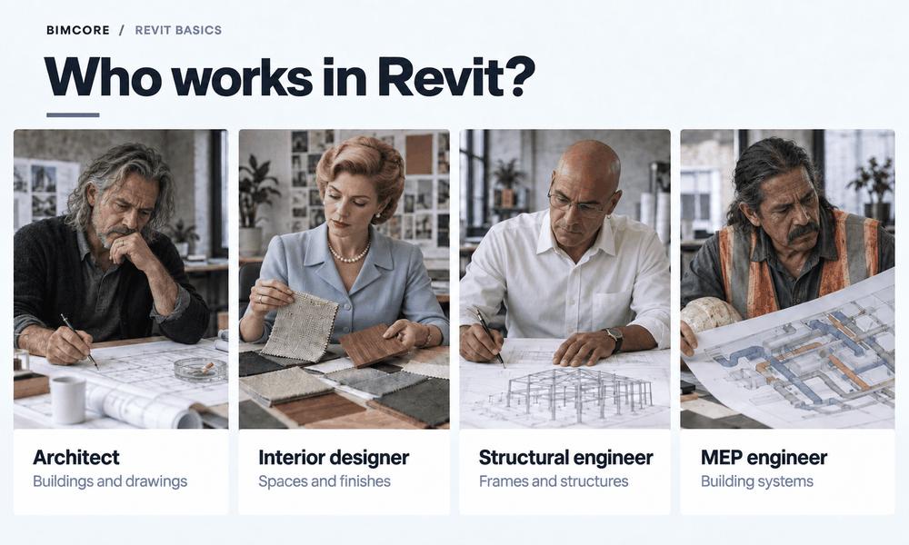
Revit can be useful to architects, structural engineers, MEP engineers, and interior designers. Architects were the first people Revit was created for, but structural and MEP engineers were not forgotten either.

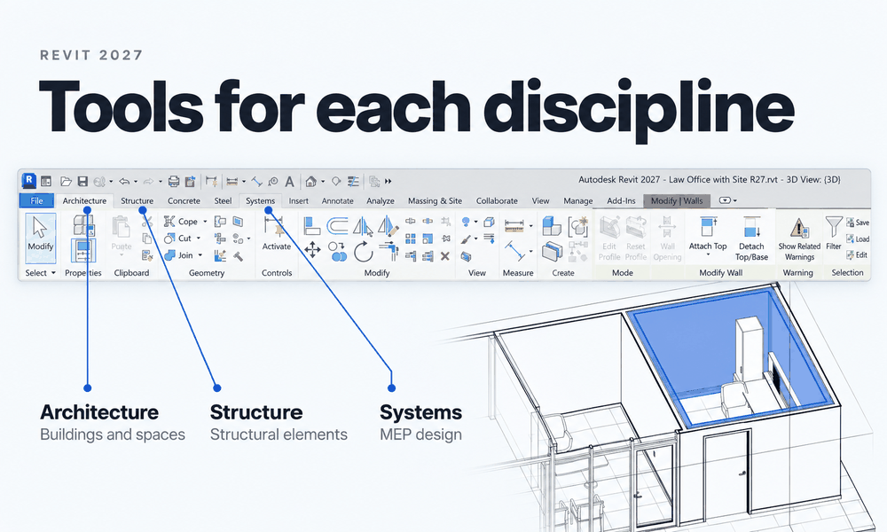
Each profession has its own tools: architects use the **Architecture** tab, structural engineers the **Structure** tab, and MEP engineers the **Systems** tab.
But what about interior designers? Designers saw how much easier architects' lives had become, decided to try working in Revit, and succeeded. Yes, not everything goes perfectly. Sometimes you have to invent a way to solve one task or another, but overall the task is solvable, and there is a payoff.

## 4. How Revit Differs from AutoCAD and SketchUp
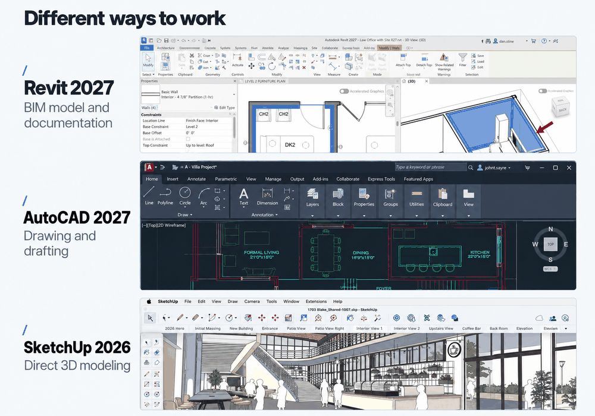
The main difference between Revit and AutoCAD or SketchUp is that its information model and documentation are connected. Every element inside the model is a precisely known object, clear both to you and to the program. Every change made in Revit appears instantly in 3D, in the drawings, and in the schedules. Fully explaining the differences in how these programs work takes separate articles, and [one of them is already available](/blog/revit-vs-sketchup-interior-design/). But I can describe the important differences here.

AutoCAD and SketchUp are [CAD programs](#1-what-is-revit-in-plain-language). Everything you create in them is therefore a collection of lines or faces. Only you know that this part is a window and that part is a wall; the program does not know and—drumroll—cannot count them automatically. That means you have to count the windows and calculate wall areas and volumes manually. If you accidentally move or delete a line and the window disappears from the plan (or your spiteful colleague does it), the schedule will still contain the wrong number of windows, and nobody on site will pat you on the head for that.

AutoCAD and SketchUp have various add-ons that partly solve these pains. In AutoCAD, you can create a group from a set of lines and call it a "chair," but if you make a mistake or forget to create the group, nobody will correct you.

Revit simply will not let you make that mistake. If you accidentally delete a window, it disappears from the schedule too; if you move a wall, the area is recalculated. You can always be sure that a change made in one drawing appears everywhere. Revit helps you avoid mistakes, but what does it ask in return? That is covered in ["The Downsides of Revit"](#6-the-downsides-of-revit).

## 5. Direct Competitors, or Revit vs. Archicad

I like Revit more, but if you already know Archicad well, you need Revit only to broaden your experience and increase your salary, not for new functionality. The programs are very similar and solve the same tasks through different routes and slightly different tools.

Autodesk Revit takes MEP and structural design more seriously. The corporation wants to cover every need in building design. Archicad is more of an architectural program.

One of the key differences is that views change instantly in Revit. In Archicad, views do not change instantly, and that annoys many people, but you can work with it—just remember to update the views :)

Archicad also chose the "I'll do everything myself" route and created more models for users. Revit decided to create a "fishing rod" so architects could make all the models they need themselves, and called that fishing rod the Family Editor. For five years now, I have earned money thanks to this fishing rod by creating [families for designers and architects](https://bimcore.one/). Thank you, Autodesk!
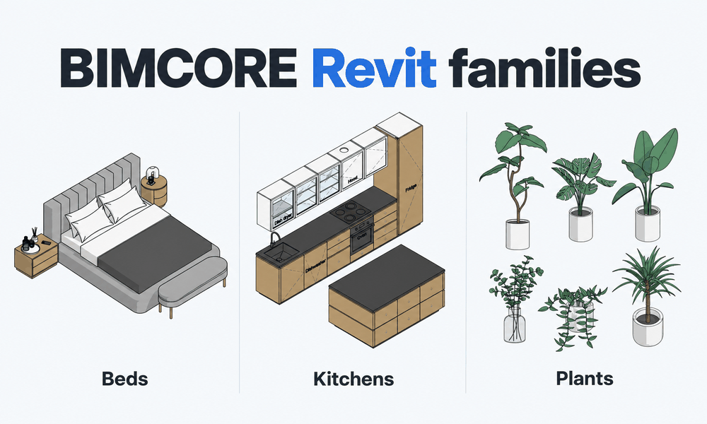

## 6. The Downsides of Revit

In short, the downsides of Revit are:

- Few models out of the box
- High cost
- No macOS version
- Creating 3D takes longer and is harder
- You have to keep an eye on parameters

The first downside is the lack of a large model library. You simply cannot create a real project using only the families—that is what objects are called in Revit—that come with the program. You need to learn how to create them or use the many free families available online. We collected them in a [list of sources](/blog/free-revit-family-websites/). But you need to understand that for a serious project, adapting them to your needs will take a long and painful amount of work. That leads to the next downside for you and the upside for me: paid professional families. At that point, the problem disappears, and Revit even surpasses Archicad. Designing in Revit with professional models is pure pleasure.

2. The second downside is the price. You really do need to weigh your finances before buying this program. As of September 2026, Autodesk lists an annual Revit subscription at about USD 3,000 per user when paid annually. The price depends on the region and purchase terms, so check it on the [Autodesk website](https://www.autodesk.com/solutions/revit-subscription-faq) before paying.

3. The third downside is that Revit runs only on Windows. For full professional work, it is better not to try installing it on a Mac through a virtual machine such as Parallels Desktop. The program will start, and you will be able to work, but it will not handle serious projects and, according to reviews, will crash frequently. It is better to buy a separate Windows computer for Revit work.

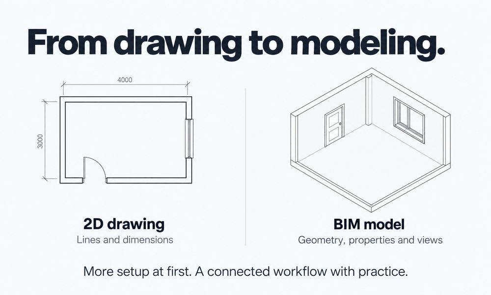
4. The fourth downside is that you now have to create 3D instead of 2D, and that takes longer! This applies not only to Revit but to every other BIM program. You spend more time creating drawings. And no matter what anyone says, immediately after learning Revit you will not design faster. Speed comes only with experience, a template tailored to your tasks, and the necessary families. You can double the speed of project production, but first you have to configure the system for your tasks.

:::warning[Warning]
Searching for and configuring families takes 50% of the design time in Revit. So if you are a designer or architect, I can immediately offer my [complete set](https://bimcore.one/) to eliminate this downside. You can see what the sets contain and what they can do in the [family guides](/guides/families/).
:::

5. The fifth downside is that you have to control parameter values. You now have to keep in your head what cannot be seen in the drawings: parameter values. In AutoCAD, looking at the drawings was enough to check whether they were correct. Here, you also have to open Properties and check which mark is assigned to a wall, what rule hides furniture on plans where it is not needed, and so on.

This creates an additional burden for designers and forces companies to hire BIM specialists to organize work in Revit.

## 7. Visualization in Revit

Visualization in Revit is not very good. You can produce a decent visualization of an architectural project, but definitely not of an interior. I did not include visualization among Revit's downsides because it is not the program's main purpose. You can achieve an acceptable result after spending a great many hours, but it is better to use other programs.

Some people use SketchUp, some use 3ds Max,
and others use Enscape or Twinmotion, but then one unpleasant issue appears:

:::warning[Warning]
Revit models are not suitable for visualization. They are schematic, often crude, and unrealistic. Texture settings are very limited; you cannot make a wooden chair or upholstered armchair look photorealistic in a visualization.
:::

This creates duplicated work, which nobody likes but which still follows the interior architect's profession around. You have to create a separate model for visualization. And you have to do it at the very first stage, the concept stage. That is a large amount of work, and you would rather not build it all over again later in Revit, but you have to.

People are trying to solve this problem, but not very actively. Twinmotion lets you replace a sofa family with its photorealistic model, but there is a size problem. If you change the sofa's dimensions in Revit, its size in Twinmotion stays the same. And keeping two models up to date is a job in itself.

Today, there is no solution to duplicated modeling, so we accept it and get on with the work. AI can, of course, help a little by generating a photorealistic picture from a schematic Revit view. But keep an eye on the details, and if you want to make changes, be ready to go to war with AI.

## 8. Revit or Revit LT
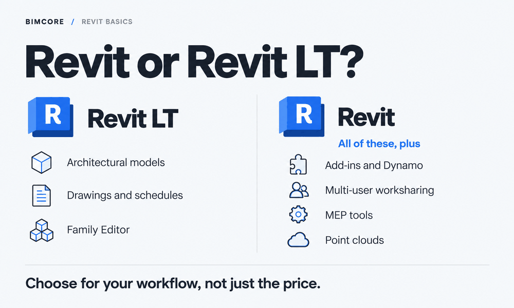
Revit LT may be suitable for an architectural model and drawings if you do not need plugins, MEP modeling, or collaboration in a single model. Because Revit is expensive, some companies consider Revit LT, but this version does not support plugins, and that is 50% of all work automation.
There are other restrictions too. According to Autodesk's [official comparison](https://www.autodesk.com/products/revit/compare), Revit LT lacks the following capabilities:

- Third-party plugins through the API and Dynamo.
- Collaboration by multiple users in one model through worksets.
- Full MEP modeling and advanced structural tools, such as analytical models and reinforcement.
- Working with point clouds.
- Interference checking and copy/monitor tools.
- In-product photorealistic rendering.

At the same time, LT has the Family Editor, plans, sections, elevations, schedules, and sheets. That may be enough for independent work on small architectural projects. But if your team depends on plugins or a shared model, saving money on the subscription can turn into restrictions on the work itself.

## 9. Is Revit Hard to Learn, and How Long Does It Take?
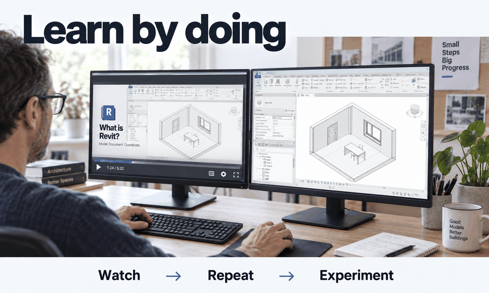
My honest answer is that, depending on your own abilities, you can learn the basic functionality and start real professional work in anywhere from two weeks to two months. But it will take about a year to make every possible mistake and stop frantically asking AI questions. During that time, you will encounter all the critical issues and learn how to solve them.

:::tip[How to learn more effectively]

Is there anything that will speed up learning? No. There is no magic pill here, and learning will not be easy, because our neurons resist until the bitter end and do not want to connect. But I can recommend learning interactively. Repeat everything you find, experiment, look for your own approach, invent things. This will make the learning process a little longer but much more effective. You can start with the free Revit course for interior designers.

:::

Besides creating a project, you will also need to learn how to develop families. This is optional if your team has a family developer, but it is a useful skill. You can learn it in one or two months. That is longer than learning project development and slightly harder, but for some people, like me, it is pure joy :)

## 10. How to Make Money with Revit and Which Jobs Require It
You can make money with Revit either in a corporate environment or as a freelancer.

These are corporate roles that require Revit:

- Architect, interior designer, structural engineer, or MEP engineer. You make design decisions in your discipline and document them in the model and drawings. Revit helps with the work but does not replace professional knowledge.
- BIM modeler, BIM master, or BIM specialist. You usually build 3D models, fill in parameters, create families, and prepare views, sheets, and schedules.
- BIM coordinator. You check how models from different disciplines are coordinated, find clashes, send comments to the people responsible, and monitor their resolution.
- BIM manager. You organize the team's work with models, develop rules and templates, choose automation tools, and help employees work to common requirements.

Architects and engineers who feel cramped in their profession and enjoy automating processes often move into all the roles whose names start with BIM. They learn either through practice or specialized courses. Besides Revit, these roles require knowledge of additional specialist programs such as Navisworks.

Here is how you can use Revit as a freelancer:

- Build a BIM model in Revit from 2D drawings.
- Develop families.
- Create BIM models from point clouds.
- Produce drawings for interior designers and architects.

- Automate repetitive operations if you know Dynamo or Revit programming.

The easiest entry point is creating information models from 2D drawings. But if you make the effort, you can learn any of these directions.

## 11. Quick Facts About Revit
Revit is intended for building information modeling and preparing construction documentation. Below are the plain facts about Revit.

| What | Details |
|---|---|
| First release | 2000 |
| Company | Autodesk, which acquired Revit Technology Corporation in 2002 |
| Current version | Revit 2027 |
| Operating system | Windows; there is no separate macOS version |
| .rvt | Project file |
| .rfa | Loadable family file |
| .rte | Project template |
| .rft | Family template |
| Annual subscription | About USD 3,000 per user |
| For whom | Architects, interior designers, structural engineers, MEP engineers, and BIM specialists |

Sources for the [subscription and version](https://www.autodesk.com/solutions/revit-subscription-faq), [file formats](https://www.autodesk.com/support/technical/article/caas/sfdcarticles/sfdcarticles/Revit-file-types.html), and [origin of the name](https://www.autodesk.com/support/technical/article/caas/sfdcarticles/sfdcarticles/How-did-Revit-get-its-name.html) are available on the Autodesk website.

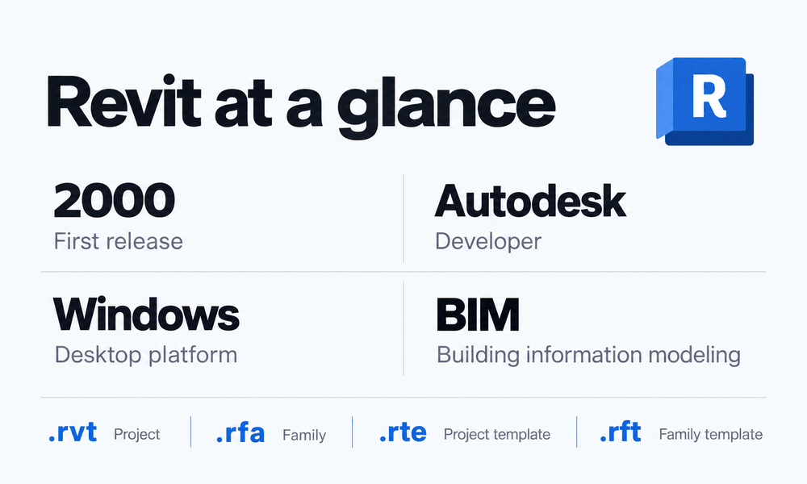

## Should You Learn Revit?

You need to learn Revit if you:
1. Want to work at a large company as an architect, designer, engineer, or BIM specialist
2. Want to automate the work of architects, designers, and engineers
3. Want to issue construction documentation with a minimum of errors
4. Want to set up convenient collaboration for producing documentation
5. Want to earn money from freelance Revit services

## Questions and Answers
Below are short answers to questions about Revit's cost, learning it, and choosing a version.

### Is Revit free?

Revit requires a paid license for commercial work. Autodesk offers a trial and educational access to people who meet its conditions, but the educational license is not intended for commercial projects.

### How can I download the student version of Revit for free?

Open the [Revit page for students and educators on the Autodesk website](https://www.autodesk.com/education/edu-software/revit), sign in to your account or create one, select student access, and confirm your eligibility. After confirmation, choose an available Revit version and download the installer by following Autodesk's instructions.

### How long does free student access last?

Autodesk gives eligible students and educators free access for one year, renewable while they remain eligible. This access is intended for educational purposes, not commercial work.

### What does the word Revit mean?

The name Revit comes from the expression Revise Instantly. It refers to the model and its related representations updating when changes are made.

### Does Revit work on Mac?

There is no separate version of Revit for macOS. Running it on a Mac requires a Windows environment, and you need to check the compatibility of the specific configuration before buying hardware.

### Is Revit suitable for interior design?

Yes. You can develop documentation and 3D interior diagrams in Revit. For convenient work, you will need [suitable families](https://bimcore.one/), view settings, and an interior template. You will also need to understand the specific approach to designing interiors, which we explain in our [lessons](/lessons/) and plan to cover in a future course on creating interiors in Revit.

### Which should I choose, Revit or SketchUp?

Choose according to the result you need. Revit is worth considering for documentation, while SketchUp is for rapid massing and form finding.

### How long does it take to learn Revit?

Learning the basics of Revit takes from two weeks to two months with regular practice. The time depends on your design knowledge, tasks, and available study time.

### Is Revit LT enough?

Yes, if your workflow fits within its capabilities. You need full Revit for plugins, MEP modeling, and simultaneous team collaboration in one model.

If you still have questions, welcome to our community.

<CTA type="lesson" />
