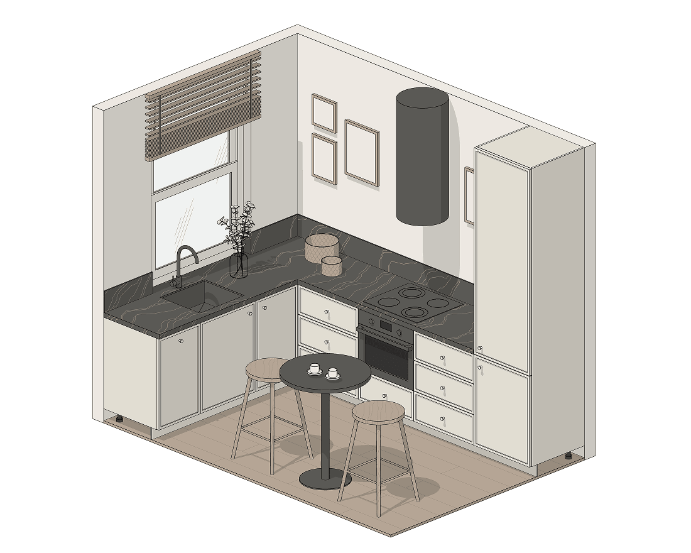

Varias cocinas que diseñadores de interiores montaron en Revit con nuestras familias de cocina. Todas están hechas con los módulos del conjunto a medidas reales, sin retoques manuales. Para estos esquemas solo se usaron familias BIMCORE, Revit y el talento de los diseñadores 😊

## 1. Cocina frente a la ventana

<truncate />

Es bonita. Es cómoda, porque entra mucha luz. Da gusto cocinar y recoger.

:::warning[Importante]

Comprueba que la hoja de la ventana abierta no choque con el grifo del fregadero. Es un error muy habitual al empezar.

:::

:::info[Información]
En el conjunto, el fregadero se coloca en el mueble bajo de dos maneras: automáticamente, activándolo con una casilla dentro del propio módulo, o a mano, colocando una familia de fregadero aparte en la encimera. El fregadero puede ser sobre encimera (Topmount) o bajo encimera (Undermount).
:::

## 2. Vitrinas y frentes de vidrio

Los muebles altos con frentes de vidrio y parteluces hacen el interior más acogedor e interesante. Si añades iluminación y colocas bien lo que hay dentro, será un placer verlo cada vez.

También puedes usar vitrinas: dan al interior un aire más clásico y auténtico.

:::info[Información]
En el conjunto Cocinas, en cada módulo el tipo de frente se elige de una lista: estándar, marco interior (Frame inside), marco exterior (Frame outside) o con tirador integrado. Para montar la fila superior con frentes de marco, vidrio y parteluces como en el esquema 3D, elige en la lista los frentes de marco exterior, pon Vidrio como material del relleno y toma los parteluces del conjunto Ventanas (Windows) o usa el frente de vidrio con parteluces del conjunto Armarios (Storage Cabinets).
:::

## 3. Cocina sin muebles altos

Evita tener que estirarse todo el rato para alcanzar lo de arriba. Visualmente despeja la estancia y la hace más amplia.

En esta variante el almacenaje pasa a los muebles bajos y a las columnas. El conjunto incluye muebles bajos de una o dos puertas batientes, módulos con cajones y columnas de hasta seis frentes, así que puedes modelar el tamaño y la posición exacta de cada frente ya en la fase de proyecto.

## 4. Isla con barra

Para muchas familias es la mejor solución para picar algo rápido por la mañana o al volver del trabajo. No hace falta poner la mesa: te sientas y comes.

### Ergonomía de la barra de la isla

#### Altura de la isla

Si haces la isla de 850–900 mm de alto, ten en cuenta que los taburetes deben ser de media altura, es decir, con el asiento a unos 600 mm.

Puedes guiarte por esta regla:

`Altura del asiento = Altura de la encimera menos 300 mm.`

:::info[Información]
¿Cómo calcular la altura del asiento con una encimera de 900 mm?\
900 mm − 300 mm = 600 mm\
La altura óptima del asiento del taburete es 600 mm.
:::

Son recomendaciones muy simplificadas, pero siguiéndolas es difícil equivocarse.

#### Ten en cuenta la altura de quienes viven en la casa

Para personas de más de 180 cm conviene subir la barra a unos 1000–1100 mm. Les resultará mucho más cómodo. Para ello habrá que separar la zona de comer de la encimera de trabajo por altura.

#### Espacio para las piernas

No olvides el espacio para las piernas. El voladizo de la encimera para las rodillas suele ser de unos 300 mm. El mínimo es 250 mm.

Con el voladizo máximo ten cuidado: el peso de la encimera debe seguir apoyado en los módulos de cocina o en soportes laterales rígidos, que también pueden hacerse del material de la encimera formando un arco en U.

:::info[Información]
En el conjunto Cocinas hay una familia aparte, Encimera de isla (Island worktop), y la isla se monta con los muebles bajos normales. Las medidas de la encimera y el voladizo se regulan con parámetros, así que podrás crear fácilmente una isla del tamaño que necesites.
:::

El conjunto Cocinas para Revit sirve para montar la cocina en un proyecto de interiorismo y contar sus módulos con el mínimo esfuerzo.

<ProductCard ecwidProductId="543629545" guideButton />

¿Aún no quieres comprar? [Prueba gratis 3 familias de cocina](https://community.bimcore.one/t/kitchen/24): versión de demostración para Revit 2019, página en inglés.
