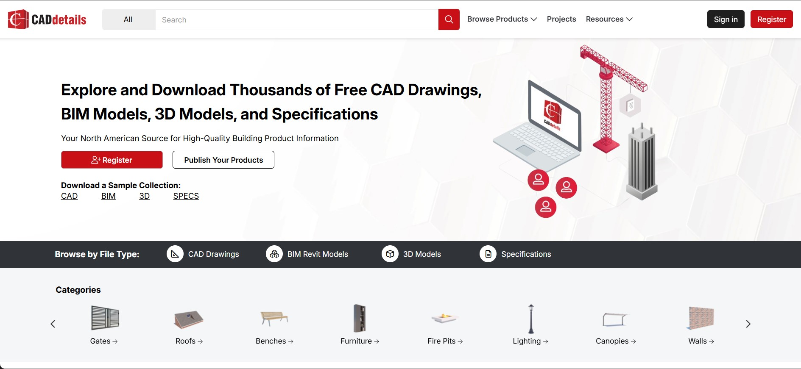
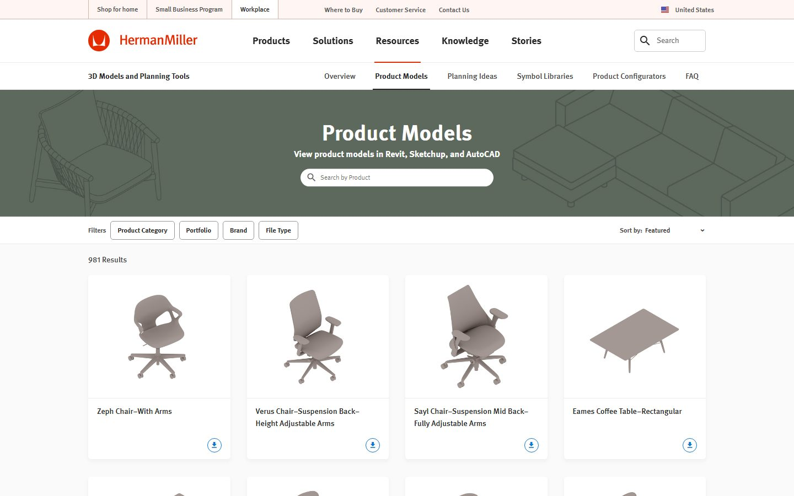
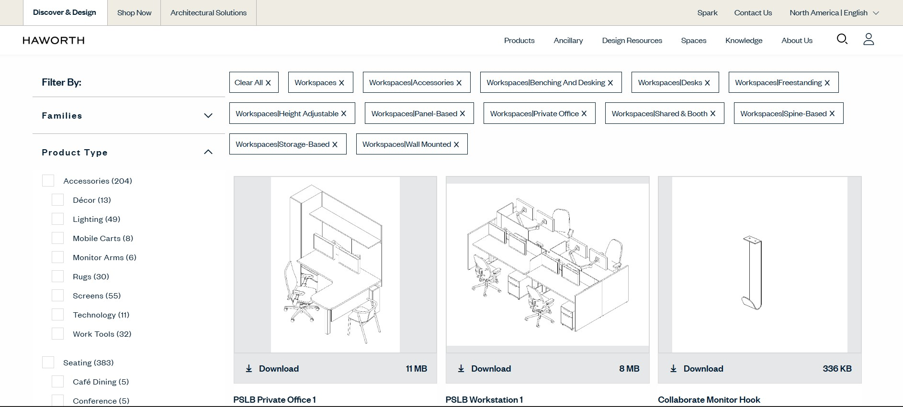
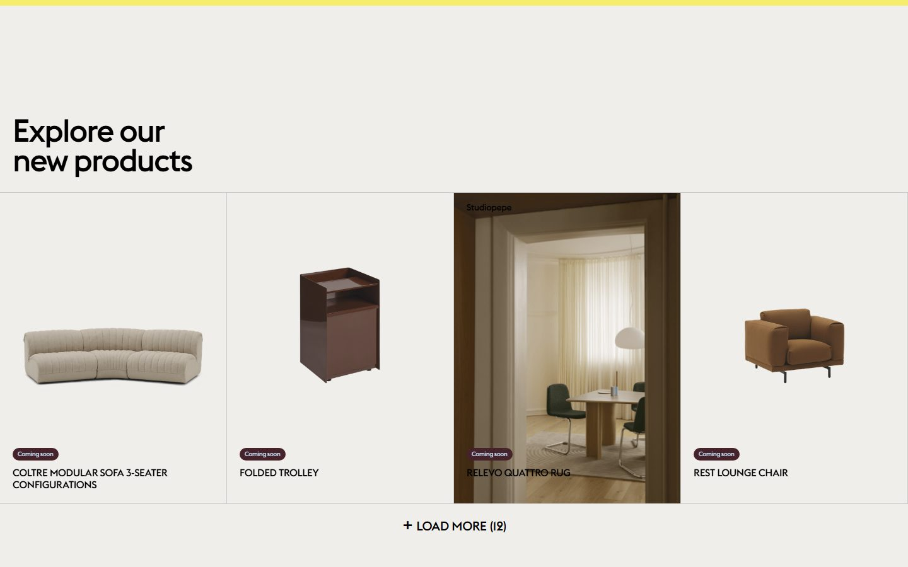
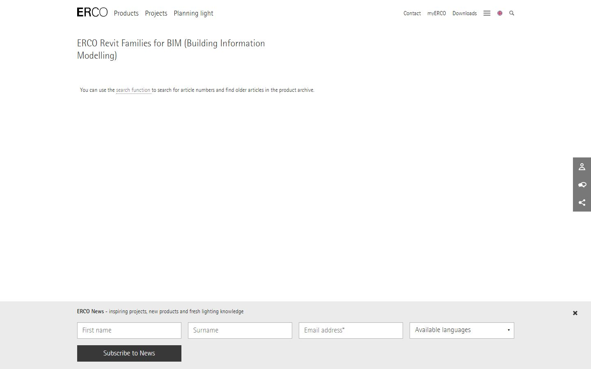
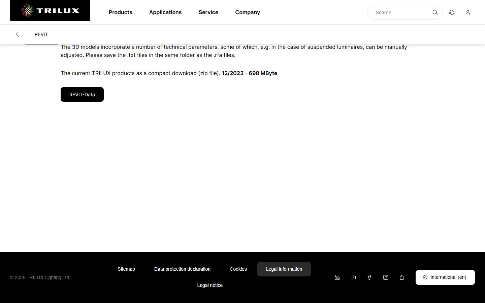
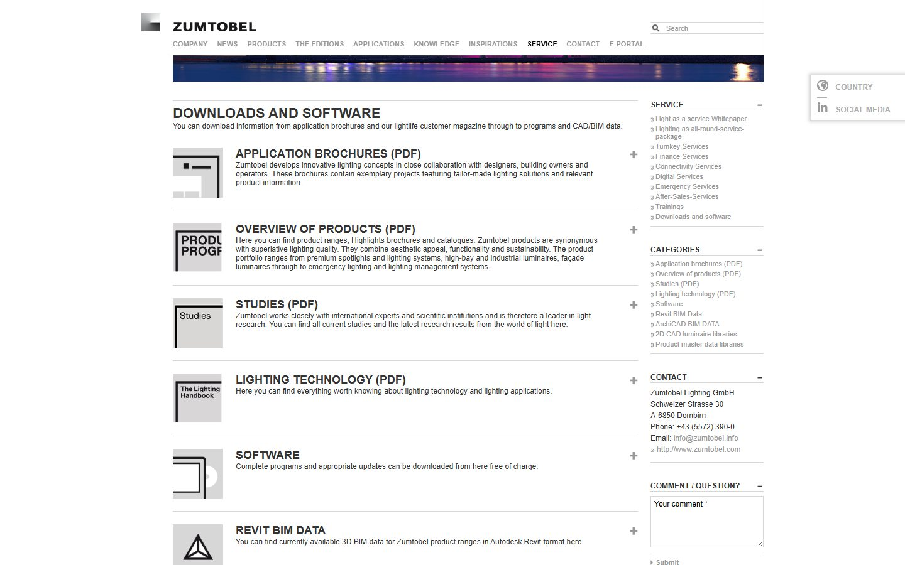
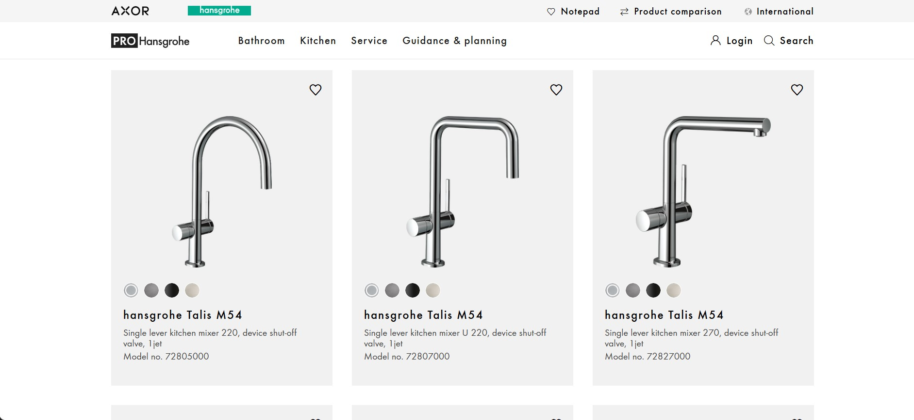
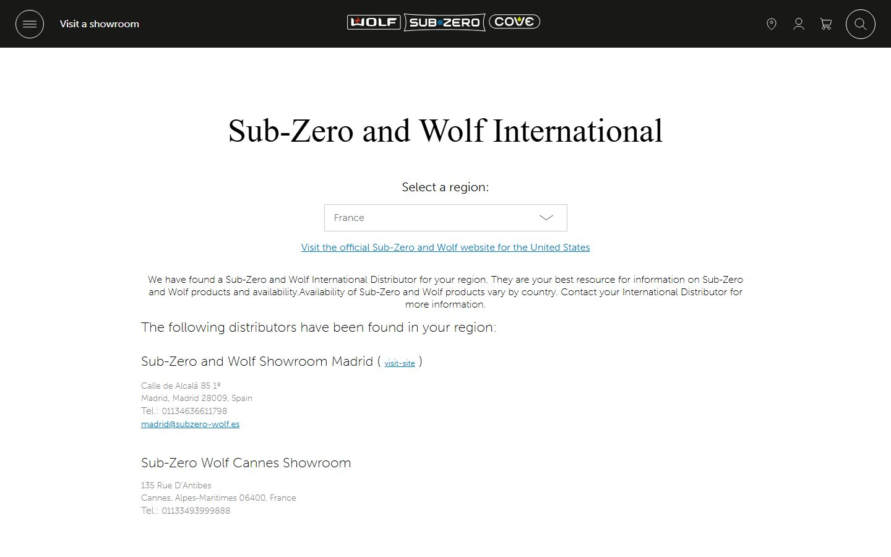

En 2026, las familias Revit gratis vienen de tres tipos de fuentes: grandes
catálogos (BIMobject, ARCAT, BIMsmith Market, NBS Source, Archiproducts,
ArchDaily), bibliotecas comunitarias como RevitCity y Modlar, y marcas que
publican sus propios archivos, desde muestras de BIMCORE hasta Herman Miller,
Knoll, ERCO y Kohler. Las treinta fuentes de abajo se comprobaron y estaban
activas en julio de 2026. Cada una tiene su punto fuerte, y esta guía muestra
dónde buscar mobiliario, iluminación, baño o cocina para que la búsqueda lleve
minutos.

<truncate />

## Comparación rápida

| Sitio | Qué puedes descargar | Dónde buscar |
|---|---|---|
| [BIMCORE](https://bimcore.one) | Muestras gratis de una de las bibliotecas paramétricas de familias Revit para interiores más fuertes para diseñadores | Cuenta gratuita del plugin y la instrucción del conjunto de cocina |
| <a href="https://www.bimobject.com/en/Browse/Price-Range/Free" rel="nofollow">BIMobject</a> | Objetos BIM gratuitos de fabricantes: mobiliario, sanitarios, puertas, iluminación, cocina y fontanería | Filtros del catálogo gratuito, categorías o páginas de producto, luego Download |
| <a href="https://www.archiproducts.com/en/products/bim" rel="nofollow">Archiproducts</a> | Objetos BIM/CAD de mobiliario de diseño, iluminación, baño y cocina | Sección BIM o plugin de Revit, luego filtrar por producto o formato |
| <a href="https://www.archdaily.com/catalog/us/bim" rel="nofollow">ArchDaily</a> | Objetos BIM del catálogo de productos: mobiliario, acabados y equipamiento | Sección BIM del catálogo y páginas de producto |
| <a href="https://www.arcat.com" rel="nofollow">ARCAT</a> | Objetos BIM/CAD de fabricantes, especificaciones, puertas, fontanería y acabados | BIM Objects por categoría o fabricante |
| <a href="https://market.bimsmith.com" rel="nofollow">BIMsmith Market</a> | Productos constructivos gratis listos para Revit, sobre todo de marcas de EE. UU. | Búsqueda o categorías, luego descargas en la página de producto |
| <a href="https://source.thenbs.com" rel="nofollow">NBS Source</a> | Objetos de NBS BIM Library y productos de fabricantes | Páginas de producto, luego Download BIM/Revit object |
| <a href="https://www.bimandco.com" rel="nofollow">BIM&CO</a> | Objetos BIM de fabricante y genéricos en RFA, IFC, SKP y otros formatos | Búsqueda en la biblioteca BIM y descargas por formato en la página del objeto |
| <a href="https://www.mepcontent.com" rel="nofollow">MEPcontent</a> | Archivos Revit, AutoCAD e IFC específicos de fabricantes para MEP, iluminación, fontanería y HVAC | Fabricantes o categorías, luego descargas de producto |
| <a href="https://www.caddetails.com/BIM-Models/" rel="nofollow">CADdetails</a> | Modelos BIM Revit junto con detalles CAD y especificaciones | BIM Models, luego páginas por fabricante o categoría |
| <a href="https://www.bimstore.co" rel="nofollow">bimstore</a> | Objetos BIM gratuitos para Revit, centrados en productos del Reino Unido | Búsqueda o categorías, luego descarga del producto |
| <a href="https://www.revitcity.com/downloads.php" rel="nofollow">RevitCity</a> | Familias Revit subidas por usuarios, objetos raros y mobiliario antiguo | Búsqueda en Downloads y página del objeto; requiere cuenta gratuita |
| <a href="https://www.modlar.com" rel="nofollow">Modlar</a> | Modelos BIM/CAD mixtos por categoría, marca y formato | Biblioteca de productos y filtros por formato |
| <a href="https://www.hermanmiller.com/resources/3d-models-and-planning-tools/product-models/" rel="nofollow">Herman Miller</a> | Modelos oficiales en Revit, SketchUp y AutoCAD para sillas, mesas y sistemas | Product Models, luego categoría o producto |
| <a href="https://www.knoll.com/design-plan/resources/furniture-symbols" rel="nofollow">Knoll</a> | Símbolos de mobiliario para AutoCAD, Revit y SketchUp, incluidos clásicos Womb, Saarinen y Barcelona | Furniture Symbol Library o Revit Add-In |
| <a href="https://www.teknion.com/can/fr/tools/tools/revit-symbols-library2" rel="nofollow">Teknion</a> | Bibliotecas de símbolos Revit para sistemas de oficina, sillas, mesas y almacenaje | Recursos Revit, luego biblioteca completa o ZIP por producto |
| <a href="https://www.steelcase.com/resources/revit/" rel="nofollow">Steelcase</a> | Modelos Revit de mobiliario para sillas, mesas y puestos de trabajo | Página Revit Files, luego búsqueda o filtro por categoría |
| <a href="https://www.haworth.com/na/en/design-resources/revit.html" rel="nofollow">Haworth</a> | Archivos Revit oficiales para mobiliario de oficina, lounges, paneles y espacios de trabajo | Página Revit de recursos de diseño de Haworth; descargas directas sin registro |
| <a href="https://professionals.muuto.com/toolbox/product-information/download-ad-files/" rel="nofollow">Muuto</a> | Archivos 2D, 3D y Revit de mobiliario, iluminación y accesorios | Toolbox para profesionales, luego 2D, 3D & Revit files |
| <a href="https://downloads.fritzhansen.com/" rel="nofollow">Fritz Hansen</a> | Archivos 2D, 3D y Revit de clásicos daneses | Portal de descargas, luego carpetas 2D, 3D & Revit |
| <a href="https://download.erco.com/en/planning_luminaire/revit2015" rel="nofollow">ERCO</a> | Familias Revit para luminarias arquitectónicas | Página Planning luminaire Revit, luego producto o artículo |
| <a href="https://www.trilux.com/en/service/downloads/software/revit/" rel="nofollow">TRILUX</a> | Archivos Revit de iluminación y ZIPs de catálogo para luminarias | Service downloads, luego Software y Revit |
| <a href="https://www.zumtobel.com/com-en/downloads.html" rel="nofollow">Zumtobel</a> | Datos BIM 3D en formato Autodesk Revit para gamas de luminarias | Página Downloads, luego ZIPs de Revit BIM Data |
| <a href="https://www.cooperlighting.com/global/revit-files" rel="nofollow">Cooper Lighting</a> | Archivos nativos de Autodesk Revit para luminarias interiores y exteriores | Página Revit Files, luego marca, categoría o producto |
| <a href="https://www.studiokohler.com/en-us/resources/technical-specifications/" rel="nofollow">Kohler</a> | Bloques CAD, archivos Revit, archivos 3D y fichas para cocina y baño | Studio KOHLER technical specifications; puede requerir cuenta |
| <a href="https://www.geberit-global.com/sanitary-piping-systems/digital-tools-software/geberit-bim-plug-in/" rel="nofollow">Geberit</a> | Contenido BIM para Revit: sistemas sanitarios, instalación, cerámica y muebles de baño | Módulo de catálogo del plugin BIM de Geberit o catálogo online |
| <a href="https://pro.hansgrohe.com/consultation/bim-planning-data" rel="nofollow">Hansgrohe / AXOR</a> | Datos BIM y archivos RFA para grifería, mezcladores y duchas seleccionados | Página BIM planning data, luego páginas PRO o BIMobject |
| <a href="https://www.roca.com/bim" rel="nofollow">Roca</a> | Objetos BIM para inodoros, lavabos, bañeras y equipamiento de baño | Página BIM objects, luego producto y formato |
| <a href="https://www.grohe.us/products/thermostatic-tub-shower-system" rel="nofollow">Grohe</a> | Archivos Revit para productos sanitarios, grifería y duchas seleccionados | Recursos de producto, luego Revit Files |
| <a href="https://www.subzero-wolf.com/trade-resources/product-specifications?business=2" rel="nofollow">Sub-Zero & Wolf</a> | Bibliotecas CAD y archivos Revit RFA para electrodomésticos de cocina premium | Product specifications, luego Download CAD Libraries y Revit Files (RFA) |

## 1. BIMCORE

Transparencia total: [BIMCORE](https://bimcore.one) es nuestro propio proyecto, así que toma esta
entrada como la recomendación del anfitrión. Creamos algunas de las mejores
familias Revit paramétricas para interiores dirigidas a diseñadores: cocinas,
armarios, sofás, mesas, puertas, ventanas, plantas y más. En conjunto, nuestros
21 sets forman una biblioteca completa de interiorismo; al comprar la colección
completa puedes dejar de buscar familias sueltas por la web. También escribimos
instrucciones detalladas para cada set; empieza por la
[instrucción del conjunto de cocina](/guides/families/kitchen-for-revit).

## 2. BIMobject

<a href="https://www.bimobject.com/en/Browse/Price-Range/Free" rel="nofollow">BIMobject</a> es uno de los catálogos BIM de fabricantes más grandes, con productos
de más de 2.000 marcas. Si necesitas un producto real con una referencia real,
por ejemplo una bisagra concreta de Blum o un lavabo de Villeroy & Boch, empieza
aquí. El catálogo Polantis, conocido por sus modelos de muebles IKEA, ahora se
publica a través de BIMobject, lo que lo convierte en la dirección principal
para piezas IKEA en un interior.

Mira el tamaño del archivo antes de cargar nada. Las familias de fabricante a
menudo modelan hasta el último tornillo, y una butaca de 40 MB ralentiza un
proyecto más rápido de lo que mejora un render.

## 3. Archiproducts

<a href="https://www.archiproducts.com/en/products/bim" rel="nofollow">Archiproducts</a> es un gran catálogo italiano de mobiliario de diseño, iluminación
y productos de baño. Su sección BIM
permite filtrar archivos Revit de marcas que rara vez aparecen en bibliotecas
centradas en construcción, por eso es una de las fuentes más fuertes para piezas
europeas reconocibles.

## 4. Catálogo de ArchDaily

El catálogo de productos de
<a href="https://www.archdaily.com/catalog/us/bim" rel="nofollow">ArchDaily</a> está junto al sitio de arquitectura más leído del mundo. La sección
BIM agrupa objetos de fabricantes por categoría (mobiliario, acabados,
equipamiento), cada uno etiquetado como BIM, así que puedes explorar productos y
descargar archivos Revit en el mismo lugar.

## 5. ARCAT

<a href="https://www.arcat.com" rel="nofollow">ARCAT</a> es una de las pocas bibliotecas grandes sin registro. Abres la página,
eliges una categoría y descargas el archivo. ARCAT empezó como servicio de
especificaciones, por eso las familias vienen vinculadas a fichas de fabricante
y las categorías arquitectónicas son profundas. El mobiliario interior es más
limitado que en BIMobject, pero fontanería y puertas están bien cubiertas.

## 6. BIMsmith Market

<a href="https://market.bimsmith.com" rel="nofollow">BIMsmith Market</a> reúne decenas de miles de productos constructivos gratuitos
listos para Revit, de cientos de marcas. El catálogo se inclina hacia productos
de construcción de EE. UU.: puertas, techos, aislamiento y acabados. Es útil
cuando necesitas las capas detrás del interior, menos cuando buscas un sofá.

## 7. NBS Source

<a href="https://source.thenbs.com" rel="nofollow">NBS Source</a> aloja la National BIM Library del Reino Unido: objetos genéricos y de
fabricante creados según el estándar NBS BIM Object, lo que mantiene nombres y
parámetros coherentes en todo el catálogo. Las descargas requieren una cuenta
gratuita de NBS. Esa coherencia se nota en las tablas, y la cobertura de
elementos constructivos genéricos es de las mejores de esta lista.

## 8. BIM&CO

<a href="https://www.bimandco.com" rel="nofollow">BIM&CO</a> es una plataforma francesa con buena cobertura de fabricantes europeos
que rara vez aparecen en catálogos centrados en EE. UU. Las familias traen
metadatos estructurados, algo útil en tablas. Si tu proyecto usa equipamiento o
radiadores europeos, revisa este catálogo antes de modelar desde cero.

## 9. MEPcontent

<a href="https://www.mepcontent.com" rel="nofollow">MEPcontent</a> es la biblioteca MEP de Trimble, con cientos de miles de archivos
Revit, AutoCAD e IFC específicos de fabricante. La mayor parte son conductos,
tuberías y accesorios, pero dos zonas importan en interiores: luminarias y
equipos de fontanería de marcas reales europeas y estadounidenses.

## 10. CADdetails

<a href="https://www.caddetails.com/BIM-Models/" rel="nofollow">CADdetails</a> es un agregador norteamericano donde las familias Revit conviven con
detalles CAD 2D y especificaciones escritas de cientos de fabricantes. Es útil
en proyectos donde el paquete de planos importa tanto como el modelo, porque
puedes obtener la familia y sus detalles en un solo sitio.

## 11. bimstore

<a href="https://www.bimstore.co" rel="nofollow">bimstore</a> es una biblioteca del Reino Unido que publica familias respaldadas por
fabricantes, con énfasis en la precisión técnica. Su cobertura es británica, así
que merece el lugar cuando el proyecto está en Reino Unido o usa productos con
especificación británica; en otros casos es una parada secundaria.

## 12. RevitCity

<a href="https://www.revitcity.com/downloads.php" rel="nofollow">RevitCity</a> es una biblioteca comunitaria veterana donde los usuarios suben sus
propias familias, y siguen apareciendo archivos nuevos cada semana. La calidad
de los archivos varía mucho: hay familias aprovechables y modelos que conviene
mantener fuera de proyectos reales. Aun así, aquí a veces encuentras objetos que
los fabricantes no publican: un piano, una silla de peluquería o una pieza
decorativa poco común. La búsqueda se siente antigua y las descargas requieren
una cuenta gratuita.

## 13. Modlar

<a href="https://www.modlar.com" rel="nofollow">Modlar</a> es un catálogo comunitario BIM y CAD envuelto en una revista de
arquitectura e interiorismo. La biblioteca mezcla contenido de marcas con
subidas de usuarios, así que úsala como fuente para explorar y verificar. Su
fuerza es el descubrimiento: el feed de productos muestra mobiliario que quizá
no se te ocurriría buscar, y marcas de electrodomésticos como Miele publican
allí.

Las siguientes fuentes son fabricantes que publican sus propios archivos Revit.
A menudo son los más precisos que puedes conseguir: la geometría coincide con el
producto real y nadie ha eliminado los metadatos.

## 14. Herman Miller

<a href="https://www.hermanmiller.com/resources/3d-models-and-planning-tools/product-models/" rel="nofollow">Herman Miller</a> tiene uno de los mejores portales de fabricante. Su página
Product Models ofrece archivos Revit, SketchUp y AutoCAD para cerca de mil productos, desde las
sillas Eames y Sayl hasta mesas y almacenaje. Son archivos gratis, precisos y
agrupados por colección. Si el proyecto especifica un clásico de diseño, esto es
mejor que buscar una copia de usuario.

## 15. Knoll

La Furniture Symbol Library de <a href="https://www.knoll.com/design-plan/resources/furniture-symbols" rel="nofollow">Knoll</a> ofrece su catálogo en Revit, AutoCAD y SketchUp, además de un Revit
Add-In. Las sillas Womb, mesas Saarinen y clásicos de la era Barcelona vienen
directamente del fabricante, con medidas correctas.

## 16. Teknion

Los recursos Revit
de <a href="https://www.teknion.com/can/fr/tools/tools/revit-symbols-library2" rel="nofollow">Teknion</a> publican su mobiliario de oficina como familias, con modelos
recientes agrupados en descargas ZIP. Es una primera parada para puestos de
trabajo, mesas de reunión y sillas de tarea.

## 17. Steelcase

<a href="https://www.steelcase.com/resources/revit/" rel="nofollow">Steelcase</a> tiene una página dedicada de
Revit Files: busca o filtra por
categoría (sillas, mesas, superficies de trabajo) y descarga cada familia
directamente. Tiene cobertura profunda de mobiliario de oficina y marcas
asociadas.

## 18. Haworth

<a href="https://www.haworth.com/na/en/design-resources/revit.html" rel="nofollow">Haworth</a> publica archivos Revit oficiales en su propia página de recursos de diseño, con
descargas directas sin registro. La cobertura es amplia para mobiliario de
oficina, lounges, paneles y sistemas de espacio de trabajo.

## 19. Muuto

<a href="https://professionals.muuto.com/toolbox/product-information/download-ad-files/" rel="nofollow">Muuto</a>
ofrece archivos Revit y CAD para su mobiliario e iluminación escandinavos. La
butaca Rest, el sofá Coltre y piezas similares se descargan desde la marca,
listas para especificar.

## 20. Fritz Hansen

<a href="https://downloads.fritzhansen.com/" rel="nofollow">Fritz Hansen</a> mantiene su propio
portal de descargas para Series 7, Egg,
Swan y el resto de su catálogo de diseño danés, en Revit y otros formatos.

## 21. ERCO

<a href="https://download.erco.com/en/planning_luminaire/revit2015" rel="nofollow">ERCO</a>, especialista en iluminación arquitectónica, publica
familias Revit
completas para sus luminarias, con fotometría precisa, directamente desde su
portal de descargas.

## 22. TRILUX

<a href="https://www.trilux.com/en/service/downloads/software/revit/" rel="nofollow">TRILUX</a>, fabricante alemán de iluminación arquitectónica, ofrece toda su gama
como archivos nativos de Revit. Su
página Revit
agrupa el catálogo actual en un único ZIP de familias .rfa con datos
fotométricos, listo para usar en un proyecto de iluminación.

## 23. Zumtobel

<a href="https://www.zumtobel.com/com-en/downloads.html" rel="nofollow">Zumtobel</a> publica datos BIM 3D de sus gamas de producto en formato Autodesk Revit
en su propia página de descargas,
junto a bibliotecas ArchiCAD y CAD 2D. Es fuerte para proyectores arquitectónicos
y luminarias de fachada.

## 24. Cooper Lighting

<a href="https://www.cooperlighting.com/global/revit-files" rel="nofollow">Cooper Lighting</a> se llama a sí misma líder BIM de la industria y lo respalda con
hechos: archivos nativos de Autodesk Revit para sus luminarias interiores y
exteriores, descargables desde
su página Revit y desde las
páginas individuales de producto.

## 25. Kohler

La página profesional de descargas
de <a href="https://www.studiokohler.com/en-us/resources/technical-specifications/" rel="nofollow">Kohler</a> contiene archivos Revit, CAD y 3D para lavabos, bañeras, grifería e
inodoros. Es una primera parada para equipamiento de baño y cocina en proyectos
norteamericanos.

## 26. Geberit

<a href="https://www.geberit-global.com/sanitary-piping-systems/digital-tools-software/geberit-bim-plug-in/" rel="nofollow">Geberit</a>
ofrece sus sistemas sanitarios, cisternas empotradas y equipamiento de baño a
través de un plugin BIM para Revit y de su catálogo online, creado según
estándares europeos.

## 27. Hansgrohe / AXOR

<a href="https://pro.hansgrohe.com/consultation/bim-planning-data" rel="nofollow">Hansgrohe y su marca premium AXOR</a> publican archivos Revit con LOD 300 para
grifería, mezcladores y sistemas de ducha a través de su
página de datos BIM
y de las páginas PRO de producto. Cada modelo lleva una referencia real, así que
lo que colocas coincide con lo que se pide.

## 28. Roca

La página de objetos BIM de <a href="https://www.roca.com/bim" rel="nofollow">Roca</a> permite descargar
familias de inodoros, lavabos y bañeras directamente desde la nube, en Revit y
otros formatos. Buena cobertura europea de baño y primera parada cuando un
proyecto usa piezas Roca.

## 29. Grohe

<a href="https://www.grohe.us/products/thermostatic-tub-shower-system" rel="nofollow">Grohe</a> no mantiene una biblioteca BIM global única. Sus archivos Revit viven en
páginas de producto
seleccionadas: abre una grifería o pieza, despliega los recursos y busca Revit
Files entre las descargas técnicas. No todos los productos tienen uno, pero la
cobertura de grifería y duchas es buena.

## 30. Sub-Zero & Wolf

<a href="https://www.subzero-wolf.com/trade-resources/product-specifications?business=2" rel="nofollow">Sub-Zero y Wolf</a> no tienen una biblioteca central. Sus archivos Revit están en
cada página de producto, dentro de CAD Libraries, junto a otros formatos: abre
un modelo actual desde Product Specifications y elige el archivo Revit.
Refrigeración y cocción premium para cocinas de gama alta.

## Cómo comprobar una familia gratis antes de meterla en tu proyecto

Una familia rota cuesta más tiempo del que ahorra. Haz esta comprobación de dos
minutos en cada descarga:

1. **Ábrela primero en un proyecto vacío.** Nunca pruebes descargas dentro de un
   proyecto de cliente.
2. **Flexiona los parámetros.** Cambia ancho y alto; una familia sólida se
   actualiza limpiamente, una rota lanza errores o se deforma.
3. **Comprueba el tamaño del archivo.** Un mueble de más de 2 o 3 MB merece
   sospecha; más de 10 MB necesita una muy buena excusa.
4. **Mira la categoría.** Un sofá modelado como Generic Model desaparecerá de
   tus tablas de mobiliario.
5. **Revisa las condiciones de uso.** Los catálogos de fabricantes suelen
   permitir uso comercial; las subidas comunitarias varían por autor. Una
   revisión rápida evita sorpresas después.

En el artículo sobre [qué comprobar antes de usar familias gratuitas de Revit en un proyecto de interiorismo](/es/blog/free-revit-families-risks/) encontrarás ejemplos de cambios de dimensiones y comprobaciones en planta y en 3D.

## Cuándo tienen sentido las familias de pago

Las bibliotecas gratuitas cubren mucho, pero siguen dejando huecos: niveles de
detalle incoherentes, versiones métricas ausentes, mobiliario que arruina las
tablas. Cuando un proyecto necesita un conjunto completo y coherente, una
biblioteca probada cierra esa brecha por el precio de una hora facturable. Lee
[qué conjuntos de familias usan más los interioristas](/blog/best-revit-families-interior-design)
o revisa la [instrucción del conjunto de cocina BIMCORE](/guides/families/kitchen-for-revit) para comparar qué
incluye un conjunto probado en proyectos.

## FAQ

### ¿Dónde encuentro mobiliario Revit gratis para diseño de interiores?

Empieza con las muestras de BIMCORE y Herman Miller para mobiliario creado como
familias correctas; luego Knoll, Muuto y Fritz Hansen para clásicos de diseño.
Archiproducts y BIMobject cubren piezas de marca e IKEA, y RevitCity rellena los
huecos raros. Para mobiliario, salta las bibliotecas MEP y de productos
constructivos.

### ¿Son seguras las familias Revit gratuitas?

Los archivos RFA no son un riesgo típico de malware. Los riesgos prácticos son
otros: dimensiones incorrectas, geometría pesada, parámetros rotos y categorías
erróneas. La lista de comprobación anterior detecta los problemas habituales.

### ¿Puedo usar familias gratis en proyectos comerciales?

En catálogos de fabricantes y portales de marca como BIMobject, ARCAT, Herman
Miller o Kohler, sí: los fabricantes publican familias precisamente para que
especifiques sus productos. En sitios comunitarios, revisa las condiciones de
cada autor.

### ¿Por qué mi archivo Revit se volvió lento después de cargar familias gratis?

Casi siempre por familias demasiado pesadas. Ordena las familias cargadas por
tamaño, purga las grandes y sustitúyelas por modelos más ligeros. Prevenir sale
más barato: comprueba el tamaño antes de cargar.

<CTA type="blog" />
