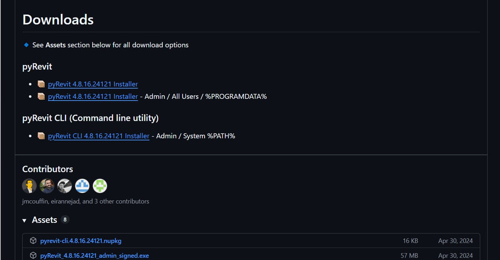
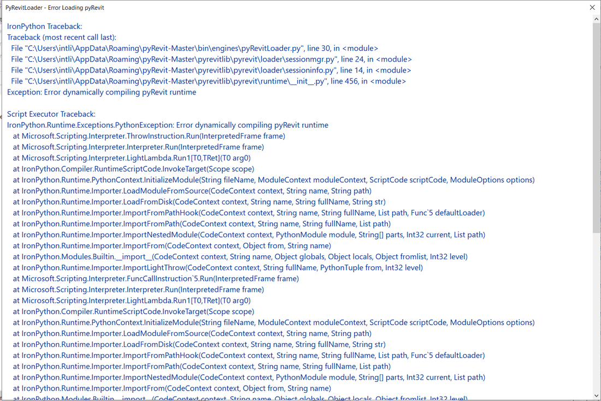
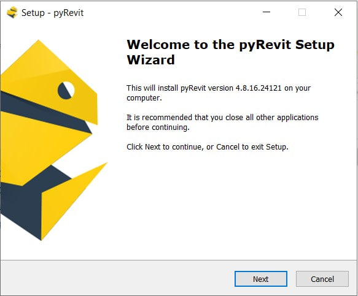
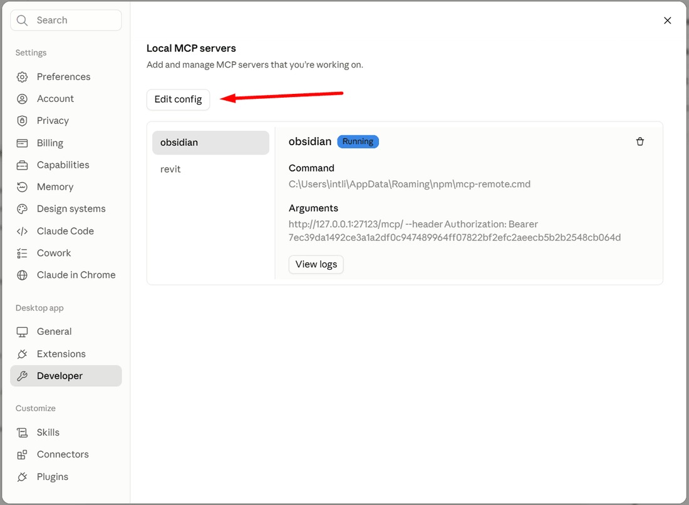
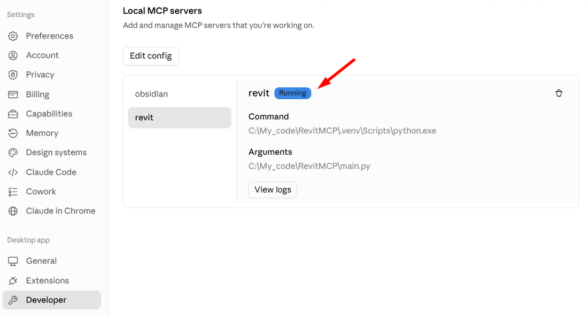

¿Cómo conectar Claude a Revit 2019? Ayer me hice esa pregunta y hoy decidí escribir esta guía, porque todas las soluciones ya hechas empiezan en Revit 2020. De todas las formas de conectar una IA a Revit elegí pyRevit: lo uso yo mismo y es un plugin muy popular y gratuito para Revit.

Esta guía te sirve solo si trabajas en Revit 2019. Para seguirla no necesitas saber programar en Python. Si algún término te resulta desconocido, no te asustes, repite los pasos uno a uno y disfruta del resultado.


<truncate />

## Qué obtienes al final

Al terminar la guía tendrás un flujo de trabajo montado: **escribes una petición en Claude Desktop y obtienes el resultado en Revit**.

La cadena es esta: Claude Desktop → un servidor MCP en Python en tu equipo → el servidor Routes dentro de Revit → tu proyecto de Revit.

:::info
¿Para qué hace falta pyRevit en esta cadena? Aporta:

- Routes, un servidor HTTP dentro de Revit
- IronPython, el motor dentro de Revit que ejecuta el código
- Extensions, la posibilidad de crear tus propios botones en Revit
:::

:::info[Qué es MCP]
**Servidor MCP** es un programa pequeño y aparte a través del cual una IA puede enviar peticiones a Revit.

**Herramientas MCP** son scripts preparados de antemano con los que la IA puede trabajar en Revit sin improvisar, con un resultado estable.

:::

Para no llevarte una decepción, conviene tener claro algo:\
**no existen herramientas MCP para Revit 2019**, pero tú y yo crearemos la más importante, la que permite a la IA enviar a Revit 2019 código limpio para resolver una tarea.

Al final del artículo tendrás tres herramientas:

- Obtener el nombre del proyecto abierto
- Obtener la lista de elementos seleccionados
- Ejecutar cualquier código en el proyecto.
  
Gracias a la ejecución de código en Revit puedes hacer incluso más que con las herramientas básicas de Revit, pero para que una tarea se repita de forma predecible hay que crear una herramienta MCP propia, y eso se lo puedes pedir a la IA.

## Qué hace falta

- **Revit 2019** (probado en 2019.2).
- **pyRevit 4.8.16**, la última versión que funciona con 2019.
- **Python 3.10 a 3.14.** Probado en 3.13.
- **Claude Desktop**, <a href="https://claude.ai/download" rel="nofollow">descargar del sitio de Anthropic</a>. Sirve cualquier otro cliente de IA compatible con MCP, pero los comandos del artículo están escritos para Claude Desktop.
- **PowerShell**, todos los comandos del artículo son para esa consola.

:::note[Dónde encontrar PowerShell]
No hay que instalar nada, ya viene con Windows. Pulsa **Inicio**, escribe `PowerShell` y abre **Windows PowerShell**.

No pegues los comandos en la consola clásica `cmd`: algunos no funcionarán allí.

Copia cada comando del artículo completo con **Ctrl+C** y pégalo en la ventana con el **botón derecho del ratón** o con **Ctrl+V**. Después pulsa **Enter** para ejecutarlo.
:::

### Instalamos Python

Python hace falta para el servidor MCP que montaremos en el paso 4. Dentro de Revit no se usa, allí trabaja el motor propio que viene con pyRevit.

Pega en PowerShell:

```powershell
winget install -e --id Python.Python.3.13
```


Cierra la ventana de PowerShell y abre una nueva, de lo contrario la consola no verá el programa recién instalado. Comprueba:

```powershell
python --version
```

Debe aparecer una línea del tipo `Python 3.13.x`.

:::note[Si instalas Python a mano]
Puedes descargar el instalador de <a href="https://www.python.org/downloads/windows/" rel="nofollow">python.org</a> y hacer la instalación de la forma habitual. En ese caso, en la primera pantalla marca sin falta la casilla **Add python.exe to PATH**. Sin ella Windows no sabrá dónde está Python y los comandos del paso 4 no funcionarán.

La señal de que se te pasó la casilla: en lugar del número de versión se abre Microsoft Store o aparece un mensaje de que `python` no se reconoce como comando.
:::

:::note[Si Python ya está instalado, y no una sola vez]
No hay que borrar nada. Mira qué tienes instalado:

```powershell
py --list
```

`py` es el selector de versiones de Python que trae Windows. En el paso 4 puedes indicar la versión exacta escribiendo `py -3.13 -m venv .venv` en lugar de `python -m venv .venv`.
:::


## Paso 1: instalar pyRevit 4.8.16

**1. Descarga el instalador** desde la [página del lanzamiento pyRevit 4.8.16 en GitHub](https://github.com/pyrevitlabs/pyRevit/releases/tag/v4.8.16.24121%2B2117). Necesitas el archivo **pyRevit 4.8.16.24121 Installer**, el normal, no el Admin. La variante Admin solo sirve para instalar para todos los usuarios del equipo.



Las versiones más recientes no funcionarán en Revit 2019.

:::danger
Por defecto, todas las versiones de pyRevit se instalan en la misma carpeta, `%APPDATA%\pyRevit-Master`. Si ya tienes instalada una versión más reciente de pyRevit, los archivos se mezclan y Revit muestra un error al arrancar.




A mí me salió este error y decidí desinstalar temporalmente la versión nueva de pyRevit desde **Inicio / Agregar o quitar programas**.

No repitas mi error: la versión nueva se puede conservar entera si lo haces **antes** de instalar. Cómo hacerlo está en las [preguntas y respuestas](#cómo-conservar-la-versión-de-pyrevit-que-ya-tienes-instalada).
:::

**2. Comprueba que la carpeta `%APPDATA%\pyRevit-Master` está vacía o no existe.** Pega esa ruta en el Explorador de archivos.

**3. Cierra Revit** y ejecuta el instalador. No cambies nada en la lista de componentes. Deben quedar marcadas estas casillas:

- pyRevit Core Tools
- pyRevit Extended Extensions




**4. Abre Revit 2019.** En la cinta debe aparecer la pestaña **pyRevit**.


:::warning[No hay pestaña, pero tampoco errores]
pyRevit se instaló pero no se vinculó a Revit 2019. Pasa cuando Revit se instaló después del plugin. Qué hacer está en las [preguntas y respuestas](#revit-2019-no-muestra-la-pestaña-pyrevit-aunque-está-instalado).
:::

## Paso 2: activar Routes

**Qué hacemos:** activamos Routes dentro de Revit. Routes es un servidor HTTP, un programa que recibe peticiones por la red y las responde. Por ahí hablará el servidor MCP con tu proyecto.

**1. Abre pyRevit → Settings.**


**2. En la sección Routes, activa el interruptor Routes Server (Beta) y marca la casilla pyrevit-core/.** La casilla no es obligatoria, pero da una dirección lista para comprobar.


**3. Pulsa Save Settings and Reload y reinicia Revit.** El servidor Routes solo se levanta al arrancar Revit.

**4. Vuelve a la misma sección.** La franja naranja muestra la dirección del servidor.


:::danger
`0.0.0.0` significa que Revit acepta comandos desde cualquier dispositivo de tu red, en la oficina o en casa. Cualquiera conectado al mismo Wi-Fi puede acceder a tu proyecto abierto.

:::

**5. Cierra ese acceso. Pega en PowerShell:**

```powershell
pyrevit configs routes:host 127.0.0.1
```

El comando cambia una línea del archivo de ajustes de pyRevit y no imprime nada cuando funciona.

:::note[Si PowerShell no conoce el comando pyrevit]
El comando `pyrevit` llega junto con el plugin del paso 1. Una ventana de PowerShell abierta antes de la instalación no lo conoce: ciérrala y abre una nueva.
:::

**6. Comprueba lo que se escribió:**

```powershell
Select-String -Path "$env:APPDATA\pyRevit\pyRevit_config.ini" -Pattern "^host"
```

El comando busca la línea `host` en el archivo de ajustes y la imprime. Debe decir `host = 127.0.0.1`. El mismo archivo se puede abrir con el Bloc de notas: `%APPDATA%\pyRevit\pyRevit_config.ini`.

**7. Reinicia Revit otra vez.** La dirección se lee al arrancar.

**8. Abre en el navegador:**

```
http://localhost:48884/routes/status
```


Llegó la respuesta, y esa es la prueba de que Routes funciona en Revit 2019. El texto entre llaves es JSON, el formato con el que Revit enviará sus respuestas a la IA.

:::warning[La página no se abre]
O no reiniciaste Revit después de activar Routes, o hay más de una ventana de Revit abierta: el puerto 48884 se lo queda la que arrancó primero. Mientras configuras, mantén abierta una sola ventana.
:::

## Paso 3: crear herramientas MCP en pyRevit

**¿Qué hacemos?** Creamos tres herramientas MCP que Claude podrá usar. \
**1. Mostrar cómo se llama el proyecto abierto** \
**2. Mostrar qué hay seleccionado en él.** \
**3. Ejecutar el código recibido**

:::note
Es la **ejecución del código recibido** lo que da a Claude posibilidades reales en Revit. Las dos primeras herramientas sirven sobre todo para comprobar nuestro trabajo.
:::

Crearemos las tres herramientas de una vez pegando un solo bloque de código en PowerShell.


:::info
Las herramientas MCP en Revit funcionan a través de una **transacción**.\
Una transacción es un conjunto indivisible de operaciones en Revit. Si Revit no puede completar una de ellas, las cancela todas y devuelve el proyecto al estado en que estaba antes. La transacción es justo lo que deshaces con Ctrl+Z.

Si Claude envía a Revit código con un error, Revit lo cancela por completo y devuelve una respuesta con la descripción del error. Eso ayuda a la IA a corregirlo e intentarlo de nuevo, y hace las peticiones de Claude a Revit un poco más seguras.
:::

**1. Pega en PowerShell:**

```powershell
$ext = "$env:APPDATA\pyRevit\Extensions\MCP.extension"
New-Item -ItemType Directory -Force -Path $ext | Out-Null
@'
import json
from pyrevit import routes

api = routes.API('revit-mcp')


@api.route('/model/')
def get_model(doc):
    return {"title": doc.Title, "path": doc.PathName}


@api.route('/selection/')
def get_selection(uidoc):
    ids = [i.IntegerValue for i in uidoc.Selection.GetElementIds()]
    return {"element_ids": ids}


@api.route('/execute/', methods=['POST'])
def execute_code(uiapp, request):
    from Autodesk.Revit import DB, UI

    data = request.data
    if isinstance(data, str):
        data = json.loads(data)
    source = (data or {}).get('code')
    if not source:
        return {"error": "no code provided"}

    uidoc = uiapp.ActiveUIDocument
    doc = uidoc.Document
    scope = {"uiapp": uiapp, "uidoc": uidoc, "doc": doc,
             "DB": DB, "UI": UI, "result": None}

    transaction = DB.Transaction(doc, "MCP execute")
    transaction.Start()
    try:
        exec(source, scope)
        transaction.Commit()
    except Exception as error:
        if transaction.HasStarted():
            transaction.RollBack()
        return {"error": str(error)}

    return {"result": str(scope.get("result"))}
'@ | Set-Content -Encoding ASCII -Path "$ext\startup.py"
Get-Content "$ext\startup.py"
```

**Qué apareció en tu equipo:** la carpeta `%APPDATA%\pyRevit\Extensions\MCP.extension` y dentro el archivo `startup.py`. La última línea del comando imprime el contenido del archivo para que veas que se ha escrito.

El nombre `startup.py` no se puede cambiar: pyRevit busca un archivo con exactamente ese nombre y lo ejecuta al arrancar Revit. El nombre de la carpeta puede ser cualquiera, lo que importa es la terminación `.extension`.

:::note[Si prefieres hacerlo a mano]
La carpeta se puede crear en el Explorador y el texto guardarlo con el Bloc de notas. Vigila que el archivo no se convierta en `startup.py.txt`.

La extensión está dentro de la carpeta de pyRevit para no complicar los primeros pasos. Cuando tengas botones propios, conviene moverla: [Dónde guardar tus extensiones](#dónde-guardar-tus-propias-extensiones-de-pyrevit).
:::

**2. Reinicia Revit.** El archivo solo se lee al arrancar.

**3. Abre un proyecto y comprueba las dos direcciones en el navegador:**

```
http://localhost:48884/revit-mcp/model/
http://localhost:48884/revit-mcp/selection/
```


La primera dirección devuelve el nombre del proyecto, la segunda los elementos seleccionados. Selecciona algo y actualiza la segunda página. La tercera dirección no se puede probar desde el navegador, recibe código en lugar de abrirse, así que la probaremos a través de Claude.

:::warning[La dirección responde con un error o una página en blanco]
Revit no se ha reiniciado · no hay ningún proyecto abierto · falta el archivo en `%APPDATA%\pyRevit\Extensions\MCP.extension\startup.py`.
:::

**Resultado:** Revit responde en tres direcciones. Claude todavía no lo sabe, eso es el paso 4.

## Paso 4: crear tu propio servidor MCP

**Qué hacemos:** escribimos el servidor MCP, un programa pequeño en tu equipo. Claude se dirige a él, y él envía las peticiones a Revit a las direcciones del paso 3 y devuelve la respuesta.


**1. Elige una carpeta para el servidor.** En el ejemplo es `C:\RevitMCP`, pero sirve cualquier carpeta tuya, con tres condiciones:

- **sin espacios en la ruta**: la ruta va a los ajustes de Claude Desktop y allí los espacios hay que escaparlos;
- **sin caracteres no latinos**: fuente habitual de fallos inexplicables de Python en Windows;
- **fuera de OneDrive o Dropbox**: la sincronización se llevará la carpeta de servicio `.venv` con sus miles de archivos pequeños.

:::note[Si elegiste otra carpeta]
Sustituye `C:\RevitMCP` en todos los comandos de abajo: en este paso, las dos primeras líneas; en el paso 5, las dos rutas de los ajustes de Claude Desktop.
:::

**2. Crea la carpeta e instala las librerías. Pega en PowerShell:**

```powershell
New-Item -ItemType Directory -Force -Path C:\RevitMCP | Out-Null
Set-Location C:\RevitMCP
python -m venv .venv
.\.venv\Scripts\python.exe -m pip install --quiet --upgrade pip
.\.venv\Scripts\python.exe -m pip install "mcp[cli]" httpx
```

**Qué apareció en tu equipo:**

- la carpeta `C:\RevitMCP`, que también podrías crear en el Explorador;
- dentro, la subcarpeta `.venv`, una copia de Python aparte solo para nuestro servidor, para que sus librerías no choquen con nada más. Esta no se puede crear a mano;
- en `.venv`, dos librerías **descargadas de internet**, piezas de código ajeno ya hechas: `mcp` se encarga de la conversación con Claude, `httpx` de las peticiones a Revit. Tarda un par de minutos y termina con la línea `Successfully installed`.

:::note[Si los comandos fallan]
En un equipo de trabajo la descarga puede estar bloqueada por un proxy corporativo o un antivirus. En ese caso no podrás seguir sin tu administrador de sistemas.
:::

**3. Crea el servidor MCP. Pega en PowerShell:**

```powershell
Set-Location C:\RevitMCP
@'
import os
import httpx
from mcp.server.mcpserver import MCPServer

REVIT_URL = os.environ.get("REVIT_URL", "http://127.0.0.1:48884/revit-mcp")

mcp = MCPServer(
    "revit-mcp",
    instructions=(
        "This server talks to Autodesk Revit 2019.2 through pyRevit Routes. "
        "Any code you send runs on IronPython 2.7 inside Revit, against the Revit 2019 API. "
        "Do not use f-strings or Python 3 syntax. "
        "Do not use API members added after Revit 2019, such as ForgeTypeId or UnitTypeId. "
        "Use DisplayUnitType and BuiltInParameter instead. "
        "When unsure whether a method exists in Revit 2019, prefer the older, simpler API. "
        "A transaction is already open around your code. Never create or start your own "
        "Transaction or TransactionGroup, just modify the elements directly."
    ),
)


async def revit_get(path):
    url = REVIT_URL.rstrip("/") + path
    try:
        async with httpx.AsyncClient(timeout=60) as client:
            response = await client.get(url)
            response.raise_for_status()
            return response.text
    except httpx.ConnectError:
        return "Revit is not reachable. Check Revit is running and pyRevit Routes is on: " + url
    except Exception as error:
        return "Request to Revit failed: {}".format(error)


async def revit_post(path, payload):
    url = REVIT_URL.rstrip("/") + path
    try:
        async with httpx.AsyncClient(timeout=120) as client:
            response = await client.post(url, json=payload)
            return response.text
    except httpx.ConnectError:
        return "Revit is not reachable. Check Revit is running and pyRevit Routes is on: " + url
    except Exception as error:
        return "Request to Revit failed: {}".format(error)


@mcp.tool()
async def get_model_info() -> str:
    """Title and file path of the Revit model currently open."""
    return await revit_get("/model/")


@mcp.tool()
async def get_selection() -> str:
    """Element ids the user has selected right now in Revit."""
    return await revit_get("/selection/")


@mcp.tool()
async def execute_revit_code(code: str) -> str:
    """Run IronPython 2.7 code inside Revit 2019 and return its result.

    The code runs inside one transaction that is already open, committed on
    success and rolled back on error. Never start your own Transaction.
    Available names: doc, uidoc, uiapp, DB, UI.
    Assign anything you want to read back to a variable named `result`.
    Revit 2019 API only: no f-strings, no ForgeTypeId or UnitTypeId,
    use DisplayUnitType. Example:
        levels = DB.FilteredElementCollector(doc).OfClass(DB.Level).ToElements()
        result = [l.Name for l in levels]
    """
    return await revit_post("/execute/", {"code": code})


if __name__ == "__main__":
    mcp.run()
'@ | Set-Content -Encoding ASCII -Path main.py
.\.venv\Scripts\python.exe -c "import importlib.util,asyncio; s=importlib.util.spec_from_file_location('m','main.py'); m=importlib.util.module_from_spec(s); s.loader.exec_module(m); print([t.name for t in asyncio.run(m.mcp.list_tools())])"
```

**Qué apareció en tu equipo:** el archivo `C:\RevitMCP\main.py`, que es el servidor MCP en sí. La última línea del bloque es una comprobación: arranca el servidor sin Claude e imprime la lista de sus herramientas. Debe salir:

```
['get_model_info', 'get_selection', 'execute_revit_code']
```

:::info
Dos lugares del código que conviene conocer. El texto entre comillas triples bajo cada herramienta es la descripción que Claude lee cuando decide qué herramienta usar. El bloque `instructions` del principio son indicaciones para Claude durante toda la sesión: sin él escribe código para un Revit moderno, y en 2019 ese código fallará.
:::

**Resultado:** las tres herramientas están listas por los dos lados, las direcciones dentro de Revit y el servidor que sabe llamarlas. Solo queda mostrarle el servidor a Claude.

## Paso 5: conectar Claude Desktop

**Qué hacemos:** le decimos a Claude Desktop dónde está nuestro servidor y probamos toda la cadena.

:::note
Si usas otra IA, este paso se resuelve fácilmente en una conversación con ella. Es una tarea bastante sencilla y cualquier IA debería poder con ella. Envíale este artículo como instrucciones y te dirá cómo conectarse al servidor MCP que has creado.
:::

**1. Abre el archivo de ajustes:** en Claude Desktop ve a **Settings → Developer → Edit Config**. El programa crea el archivo `claude_desktop_config.json` si todavía no existe y te muestra la carpeta donde está. Ábrelo con el Bloc de notas.




**2. Añade el servidor.** Hay dos casos.

**El archivo está vacío o solo contiene `{}`**: sustituye todo el contenido por:

```json
{
  "mcpServers": {
    "revit": {
      "command": "C:\\RevitMCP\\.venv\\Scripts\\python.exe",
      "args": ["C:\\RevitMCP\\main.py"]
    }
  }
}
```

**El archivo ya tiene otros servidores**: no borres nada. Busca la línea `"mcpServers": {` (normalmente la segunda desde arriba), pon el cursor al final, pulsa Enter y pega:

```json
    "revit": {
      "command": "C:\\RevitMCP\\.venv\\Scripts\\python.exe",
      "args": ["C:\\RevitMCP\\main.py"]
    },
```

La coma al final del fragmento ya está puesta, separa el servidor nuevo de los que ya había. Los espacios y las sangrías no importan, solo importan las llaves, las comillas y las comas.

:::warning
Si tu carpeta del servidor MCP está en otra ruta, ponla en las dos líneas. Fíjate en las barras dobles `\\`, el formato las exige.
:::

:::note[Si prefieres no editar el archivo a mano]
Este comando da el mismo resultado. Guarda al lado una copia de seguridad del archivo con la terminación `.bak`, añade la entrada `revit` e imprime la lista de servidores, en la que debe aparecer `revit`.

```powershell
$cfg = "$env:APPDATA\Claude\claude_desktop_config.json"
if (-not (Test-Path $cfg)) { '{ "mcpServers": {} }' | Set-Content $cfg }
Copy-Item $cfg "$cfg.bak" -Force
$j = Get-Content $cfg -Raw | ConvertFrom-Json
if (-not $j.mcpServers) { $j | Add-Member -NotePropertyName mcpServers -NotePropertyValue ([pscustomobject]@{}) }
$srv = [pscustomobject]@{
  command = "C:\RevitMCP\.venv\Scripts\python.exe"
  args    = @("C:\RevitMCP\main.py")
}
$j.mcpServers | Add-Member -NotePropertyName revit -NotePropertyValue $srv -Force
$json = $j | ConvertTo-Json -Depth 30
[System.IO.File]::WriteAllText($cfg, $json, (New-Object System.Text.UTF8Encoding($false)))
(Get-Content $cfg -Raw | ConvertFrom-Json).mcpServers.PSObject.Properties.Name
```
:::

**3. Cierra Claude Desktop desde la bandeja del sistema y ábrelo de nuevo.** La cruz de la ventana no cierra el programa: sigue en la bandeja y no vuelve a leer los ajustes. Usa el icono de la bandeja → Quit.


**4. Abre un chat nuevo y pregunta:**

> ¿Qué proyecto está abierto ahora en Revit?

Claude pedirá permiso para usar la herramienta, pulsa **Allow**. Una respuesta con el nombre del archivo significa que la cadena está cerrada.

:::warning[Claude dice que no ve Revit]
Abre **Settings → Developer**: junto a `revit` debe poner `running`. Si pone `failed`, comprueba en el Explorador que el archivo `C:\RevitMCP\.venv\Scripts\python.exe` existe y que cerraste Claude Desktop desde la bandeja y no con la cruz.



:::

**5. Prueba la herramienta universal.** Una petición segura, de solo lectura:

> Enumera todos los niveles del proyecto con sus elevaciones.

Claude escribe el código, lo ejecuta en Revit y devuelve una tabla de niveles. Este es el modo de trabajo: tú describes la tarea con palabras y Claude escribe el código.

:::danger[Qué puede salir mal aquí]
La herramienta ejecuta cualquier código en el proyecto abierto, incluido el que borra elementos. La transacción solo te protege de un cambio a medias tras un error: el código que se ejecutó bien pero borró lo que no debía se confirma igualmente.

Ese cambio se puede deshacer con Ctrl+Z mientras no hayas guardado el archivo. Después de guardar, deshacer ya no sirve. Si trabajas con un modelo central, los cambios llegan a tus compañeros en la siguiente sincronización, así que practica solo sobre una copia de un proyecto real.
:::

## En qué orden arrancar

El orden en que abres los programas no importa. Al iniciarse, Claude Desktop solo lanza tu `main.py`, y ese script no se conecta a Revit por sí mismo, espera. La conexión ocurre en el momento en que se llama a una herramienta. Por eso puedes abrir Revit después y todo funcionará sin reiniciar Claude.

Hay una limitación real, y es de Revit: **todo lo que vive dentro de Revit se lee al arrancarlo.** Eso vale para el servidor Routes y para tus direcciones en `startup.py`. 

:::warning
Si añades una herramienta MCP nueva, ¡hay que reiniciar Revit!
:::

:::tip[Qué reiniciar]
**Revit:** instalar pyRevit, activar o desactivar Routes, cambiar la dirección o el puerto, cualquier cambio en `startup.py`.

**Claude Desktop (desde la bandeja):** cambios en `main.py` y en la configuración de servidores.

**Nada:** el código que Claude escribe en la conversación. Viaja como datos normales por una dirección que ya existe, y ese es todo el sentido de la herramienta universal.
:::

## Mis recomendaciones de uso

Hay dos formas distintas de usar la combinación Claude + Revit:

**1. Claude como tus manos en Revit.** \
Pides con palabras, Claude escribe el código y lo ejecuta. El resultado no es repetible: la misma petición mañana dará otro código. Sirve para lo puntual: contar, buscar, comprobar, limpiar algo una vez.

**2. Claude crea herramientas para sí mismo y para ti.** \
El objetivo no es hacer una operación en un proyecto, sino conseguir código que automatice ese proceso en todos los proyectos. Lo depuras sobre un ejemplo real, compruebas que funciona y lo guardas como `script.py` en una carpeta de extensión de pyRevit:

```
MyTools.extension\MyTab.tab\MyPanel.panel\RenameSheets.pushbutton\script.py
```

Tras reiniciar Revit, tu botón aparece en la cinta. Funciona siempre igual, sin IA, sin internet y al instante.

Antes los scripts para Revit se escribían a ciegas: guardar, ejecutar, error, corregir, y vuelta a empezar. Ahora Claude ve tu proyecto, prueba y se corrige al momento, solo que mucho más rápido. El ciclo pasa de minutos a segundos. Ese es un ahorro real de recursos y de tu tiempo.

Si aún no has llegado a la automatización, empieza por lo sencillo: [10 formas de trabajar más rápido en Revit](/blog/work-faster-in-revit/).

:::info
El enfoque de unir pyRevit Routes con MCP lo vi por primera vez en la <a href="https://pyrevit-mcp.learnrevitapi.com/" rel="nofollow">guía de Erik Frits</a>. Esa guía ofrece un conjunto de herramientas ya hecho para Revit 2020+ y un servidor MCP listo para esas versiones.
:::

## Preguntas y respuestas

### ¿Existe algún servidor MCP listo para Revit 2019?

No. Los conjuntos existentes declaran Revit 2020 a 2027, y el servidor oficial en la nube de Autodesk cubre las versiones actuales. Para 2019 hay que montarlo uno mismo, como en este artículo.

### ¿Cómo conservar la versión de pyRevit que ya tienes instalada?

Es la situación más habitual: tienes varias versiones de Revit, un pyRevit reciente con tus propias herramientas, y no quieres perderlo. Instalar 4.8.16 al lado sin más no funciona: el instalador nunca pregunta la carpeta y siempre escribe en `%APPDATA%\pyRevit-Master`, encima de lo que haya.


Se resuelve antes de instalar, con un solo comando. Cierra todos los Revit y renombra la carpeta de la versión existente:

```powershell
Rename-Item "$env:APPDATA\pyRevit-Master" pyRevit-new
```

Ahora el instalador de 4.8.16 crea una carpeta limpia y no pisa nada, mientras tu versión anterior queda entera al lado. No hace falta quitarla de la lista de programas instalados.

A partir de aquí hay dos caminos.

**El sencillo:** dejarlo todo como está. En Revit funciona 4.8.16 y la versión anterior espera su turno. Si vuelves a necesitarla, desinstala 4.8.16 y renombra la carpeta a como estaba.

**El más difícil, las dos a la vez:** registrar la carpeta guardada como una instalación aparte y vincularla a tus versiones de Revit. Los desarrolladores de pyRevit lo describen así en su foro: cada versión vive en su propia carpeta y se vincula con **su propio** `pyrevit.exe` de esa carpeta. Con el ejecutable de la otra versión falla con un error de motor no coincidente. Registrar la carpeta se hace así:

```powershell
pyrevit clones add pyrevit-new "$env:APPDATA\pyRevit-new"
```

:::warning[Importante]
Este segundo camino no lo hemos probado, en nuestro caso no hizo falta. El esquema viene de un <a href="https://discourse.pyrevitlabs.io/t/using-both-pyrevit-4-8-16-and-5-0/7642" rel="nofollow">hilo del foro de pyRevit</a>. Si tus proyectos de trabajo dependen del plugin, pruébalo antes en un equipo libre.
:::

Antes de cambiar nada, mira qué tienes instalado realmente y a qué versiones de Revit está vinculado:

```powershell
pyrevit clones
pyrevit attached
```

Puede que no haya nada que proteger: en mi caso la versión nueva no estaba vinculada a ningún Revit y la eliminé sin más.

### ¿Dónde guardar tus propias extensiones de pyRevit?

No dentro de las carpetas de pyRevit. Las extensiones están en `%APPDATA%\pyRevit\Extensions` y el plugin en `%APPDATA%\pyRevit-Master`: en la sección sobre conservar la versión anterior renombramos la segunda carpeta, y una reinstalación limpia renombra o borra las dos. Tus scripts se van con la carpeta.

Ten tu carpeta aparte, por ejemplo `C:\RevitTools\MyTools.extension`, y conéctala con el botón **Add folder** en la sección **Custom Extension Directories** de los ajustes de pyRevit. A partir de ahí, reinstalar el plugin no te da ningún miedo.

La extensión de este artículo la puse dentro de pyRevit a propósito, para no complicar los primeros pasos. Cuando tengas botones propios, muévela.

### ¿Revit 2019 no muestra la pestaña pyRevit aunque está instalado?

Pasa cuando Revit se instaló después de pyRevit: el plugin se vincula a una versión de Revit en el momento de instalarse.


Primero intenta vincularlo a mano. Cierra Revit y ejecuta:

```powershell
pyrevit attach master 2712 2019
```

Aquí `2712` es el número del motor IronPython 2.7 y `2019` la versión de Revit. Abre Revit y revisa la cinta.

El comando no servirá en un caso: cuando la versión de pyRevit que tienes instalada no está pensada para Revit 2019. Entonces el vínculo no se crea o Revit muestra un error al arrancar. La única solución es instalar 4.8.16 como en el paso 1.

### ¿Hace falta `uv` como dicen otras guías?

No. `uv` es solo otra forma de lanzar el servidor: descarga las librerías en cada arranque en lugar de tenerlas en su propia carpeta. El resultado es el mismo.

El problema real está en otro sitio. La librería `mcp` cambió hace poco el nombre de algunas de sus partes, y las guías escritas antes de eso se rompen con ella: la gente se encuentra con un error de importación de la nada. El código de este artículo está escrito para la versión actual, y por eso funciona.

### ¿Es seguro dejar que una IA ejecute código en un proyecto?

En un archivo de prácticas sí, y es la mejor forma de aprender. En un proyecto real trátalo como ejecutar un script ajeno: guarda antes de lanzarlo y, mejor, trabaja sobre una copia del proyecto. Deshacer con Ctrl+Z funciona mientras no hayas guardado el archivo; después de guardar ya no sirve.

<CTA type="blog" />
