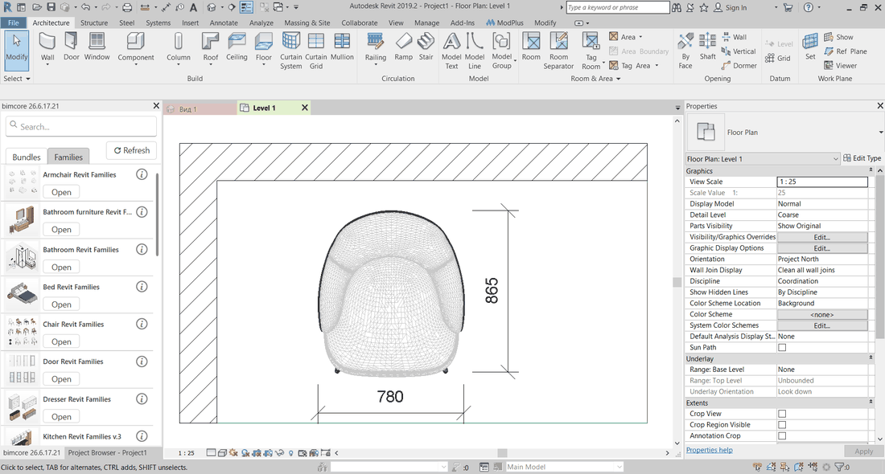
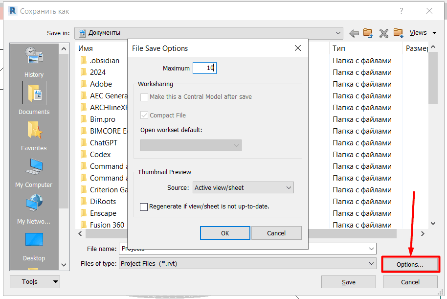
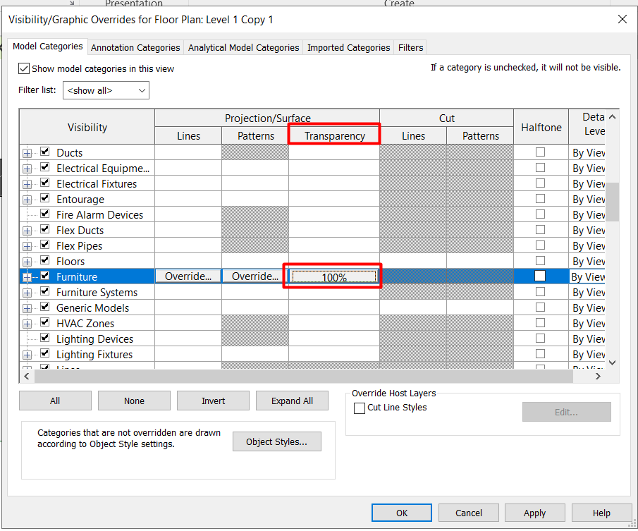
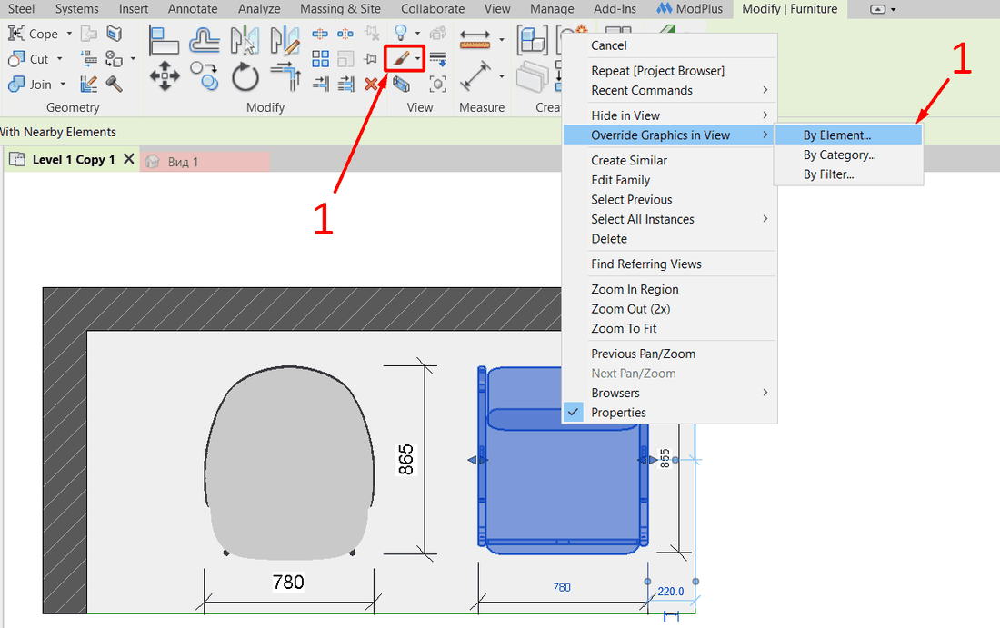

La familia está colocada en Revit y se ve bien en 3D, pero en planta aparecen líneas innecesarias, no puedes configurar el material, se ve el acabado del suelo bajo la familia o aparece un relleno blanco sólido que no puedes modificar. La causa casi siempre es una de estas cinco. Las he ordenado según resulta más práctico comprobarlas en un proyecto: desde las importaciones y los ajustes del proyecto hasta la edición de la familia.

<truncate />

## 1. Geometría importada

La familia no está creada con geometría de Revit, sino con un archivo importado de AutoCAD, 3ds Max u otro programa. Este tipo de familias suele distribuirse gratis y puede parecer muy realista por fuera. Sin embargo, su representación en planta suele dar problemas. La gran cantidad de caras forma una maraña de líneas muy difícil de eliminar. También resulta casi imposible cambiar los materiales de la familia.

Para comprobar si es tu caso, selecciona la familia y ábrela en el Editor de familias. Si toda la geometría se selecciona como una sola pieza y las propiedades indican que es una importación, este es el problema.

:::danger[Peligro]
**Utiliza estas familias con cuidado.**

La geometría importada es pesada y aumenta el riesgo de que el archivo se dañe y no pueda abrirse, obligándote a repetir el trabajo. Para reducir las consecuencias, antes de trabajar con una familia de este tipo abre **Guardar como**, haz clic en **Opciones** y establece el campo **Máximo** en 10. Si el archivo se daña, conservarás diez versiones anteriores del proyecto.
:::

:::info[Información]
Revit crea una versión anterior del proyecto cada vez que pulsas **Guardar**.
:::

En el artículo sobre los [riesgos de las familias gratuitas de Revit](/es/blog/free-revit-families-risks/) explico qué más conviene comprobar antes de cargarlas en un proyecto.

## 2. Nivel de detalle bajo

La mayoría de las familias tiene tres formas de mostrarse en planta. Con el nivel de detalle bajo suele verse una geometría simplificada; con los niveles medio y alto aparece el modelo completo. Si la planta utiliza el nivel bajo, un armario puede convertirse en un rectángulo y un mueble complejo puede desaparecer por completo.

En la barra de controles de vista, situada en la parte inferior de la ventana, cambia **Nivel de detalle** a **Medio** o **Alto** y vuelve a comprobar la familia. Si cambia su representación, el problema está resuelto.

:::note[Nota]
Si una categoría tiene asignado un nivel de detalle fijo en **Modificaciones de visibilidad/gráficos**, es posible que la familia no cambie al modificar el nivel de detalle de la vista. Comprueba ese cuadro de diálogo antes de descartar esta causa.
:::

Si la planta tiene aplicada una plantilla de vista, el nivel de detalle puede estar controlado por ella. En ese caso, modifica el ajuste en la plantilla o quita la plantilla de esa planta.

## 3. Estilo visual Estructura alámbrica

Con el estilo **Estructura alámbrica**, Revit muestra únicamente las aristas del modelo y toda la familia queda transparente. En planta, todos los elementos se vuelven transparentes, desaparecen los rellenos y se ve a través del mobiliario todo lo que hay debajo. Es fácil activar este estilo por accidente y después buscar el problema dentro de la familia.

Abre **Estilo visual** en la barra de controles de vista y selecciona **Línea oculta** o **Sombreado**. Con el primer estilo, el mobiliario recuperará un contorno opaco; con el segundo, también mostrará los colores de los materiales. Para los planos suele bastar **Línea oculta** y para las vistas 3D resulta más útil **Sombreado**.

## 4. Transparencia

La transparencia puede aplicarse a una categoría, un filtro o un elemento concreto, y permanece en la vista hasta que se elimina. A menudo se activa de forma temporal para ver los elementos situados bajo el mobiliario y después se olvida.

Abre **Modificaciones de visibilidad/gráficos** y comprueba la columna **Transparencia** de las categorías de mobiliario, equipamiento y modelos genéricos. Revisa también la ficha de filtros.

Si solo una familia aparece transparente, haz clic sobre ella con el botón derecho, selecciona **Modificar gráficos en vista** y luego **Por elemento**, y devuelve la transparencia de superficie a 0.

:::tip[Consejo]
Si la transparencia aparece en varias plantas y no puedes modificarla, comprueba si la vista tiene asignada una plantilla. Una sola corrección en la plantilla eliminará la transparencia de todas las plantas a las que esté aplicada.
:::

## 5. La familia utiliza una representación 2D en lugar del modelo 3D

Algunas familias están configuradas para mostrar en planta una representación 2D compuesta por líneas simbólicas y una región de máscara, mientras que la geometría tridimensional queda oculta. Esa representación se dibujó para un tamaño y una forma concretos, por lo que deja de coincidir con el modelo al cambiar los parámetros. Además, las máscaras tapan los rellenos y los materiales.

Abre la familia en el Editor de familias y revisa la vista de planta. Si contiene líneas simbólicas o una región de máscara y el modelo no se ve, tienes dos opciones.

**Primera opción:** elimina por completo la representación 2D, selecciona la geometría tridimensional, abre **Configuración de visibilidad** y activa su visualización en **Plano/RCP**. Revit mostrará en planta la forma real de la familia. Si la categoría admite corte, la geometría también aparecerá cortada donde la interseque el plano de corte.

**Segunda opción:** conserva la representación para un solo nivel de detalle, por ejemplo **Bajo**, y muestra la geometría tridimensional en los niveles medio y alto. En **Configuración de visibilidad**, deja únicamente el nivel bajo para las líneas simbólicas; para la geometría, activa **Plano/RCP** y los niveles **Medio** y **Alto**. Vuelve a cargar la familia en el proyecto y comprueba la planta con los tres niveles.

## Qué comprobar, en resumen

| Lo que ves en planta | Qué debes comprobar | Resultado |
|---|---|---|
| Maraña de líneas, sin relleno y sin corte | Importación en el Editor de familias y copias de seguridad | Sabrás que debes sustituir o reconstruir la familia |
| Un rectángulo en lugar del mueble o un espacio vacío | Nivel de detalle de la vista o de la categoría | El modelo aparece con los niveles medio y alto |
| Todos los elementos de la vista son transparentes | Estilo visual | Contorno opaco y relleno en toda la planta |
| Solo algunas categorías o un elemento son transparentes | Columna Transparencia en Modificaciones de visibilidad/gráficos y modificación del elemento | Se elimina la transparencia donde se había olvidado |
| El modelo existe en 3D, pero en planta se ve una representación plana | Líneas simbólicas y Configuración de visibilidad de la familia | La planta muestra la forma y los materiales reales |

## Si no quieres configurar cada familia

Hemos desarrollado una [biblioteca completa de familias para diseñadores de interiores](https://bimcore.one/). La visualización en planta ya está configurada. La geometría está creada con herramientas de Revit: el nivel bajo muestra una representación simplificada, los niveles medio y alto muestran la forma real, y los materiales y rellenos funcionan sin ajustes adicionales. Puedes ver cómo está resuelto en nuestras [familias de cocina para Revit](/es/guides/families/kitchen-for-revit/).

## Preguntas y respuestas

### La familia aparece completamente blanca en planta y no responde a los ajustes del material

Hay dos posibles causas. La vista utiliza el estilo visual **Línea oculta**, que no muestra los colores de los materiales en planta, o la familia contiene una región de máscara que cubre el modelo. En el primer caso, cambia el estilo a **Sombreado**. En el segundo, abre la familia y corrígela como se indica en el punto 5.

### La familia solo aparece como líneas en planta, sin relleno

Lo más probable es que la planta muestre una representación 2D creada con líneas simbólicas. Primero cambia el nivel de detalle y comprueba la transparencia, como se explica en los puntos 2 y 4. Si no funciona, abre la familia y sigue el punto 5.

<CTA type="guide" />
