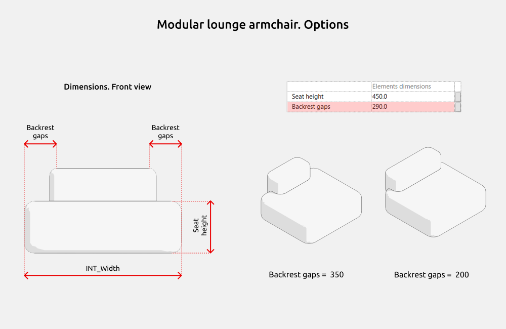

import productPreview from './product.jpg';

<ProductCard
  name="Familias de sillones para Revit"
  description="Una colección de sillones de distintos estilos, listos para colocar en tu proyecto de Revit."
  image={productPreview}
  imageAlt="Vista previa del conjunto de sillones para Revit"
  buyUrl="https://bimcore.one/products/armchair-revit-families"
  ecwidProductId="577113367"
  buyLabel="Ver el precio en la tienda"
/>

## 1. INFORMACIÓN GENERAL

- Nombre del conjunto Sillones
- Versión del conjunto 1.0.0
- Versión de Revit 2019

### Descripción

Este conjunto de familias permite incorporar sillones a las plantillas de arquitectura e interiorismo de Autodesk Revit.

Con estas familias puedes crear sillones clásicos rectos, semicirculares y modulares con dimensiones exactas.

Está pensado para diseñadores de interiores y arquitectos.

### Carga y colocación

Para ver y cargar las familias del conjunto, abre el proyecto con los sillones, copia las que necesites con Ctrl+C y pégalas en tu proyecto con Ctrl+V. También puedes abrir la carpeta de archivos de familia y arrastrarlos al proyecto.

:::note
Las imágenes y los nombres de los parámetros corresponden a la versión inglesa del conjunto. Las explicaciones están en español.
:::

## 2. CONTENIDO DEL CONJUNTO

El conjunto incluye las siguientes familias.

- Sillón de descanso (Lounge armchair)
- Sillón orejero (Wingback armchair)
- Sillón semicircular con patas (Tub armchair)
- Sillón cúbico (Boxy armchair)
- Sillón semicircular (Barrel armchair)
- Sillón sin brazos (Slipper armchair)
- Sillón con estructura vista (Framed lounge armchair)
- Sillón modular (Modular lounge armchair)
- Sillón escandinavo (Scandinavian armchair)

## 3. FAMILIAS

### Dimensiones de los sillones

Los parámetros **INT_Width**, **INT_Depth** e **INT_Height** controlan la anchura, la profundidad y la altura totales de los sillones.

El parámetro **Seat height** modifica la altura del asiento respecto al nivel del suelo terminado. Sus límites se indican en la información de herramienta.

Para verla, coloca el cursor sobre el nombre del parámetro, como en la imagen.

Algunos parámetros aparecen en gris y no se pueden modificar, por ejemplo **Legs height**. Sirven para entender el cálculo de las dimensiones y para que las fórmulas funcionen correctamente. No están pensados para que el usuario los edite.

### Opciones de los sillones

En los sillones orejero y escandinavo puedes controlar la visibilidad de los reposabrazos.

En el sillón orejero, el parámetro **Wingback-style armrests** controla los reposabrazos con orejas. En el escandinavo se utiliza **Armrests**.

El parámetro **Backrest gaps** permite cambiar la anchura del respaldo del sillón modular ajustando de forma simétrica la distancia entre el respaldo y los bordes laterales del asiento.

<CTA type="guide" />
