import productPreview from './product.jpg';

<ProductCard
  name="Familias de sanitarios para Revit"
  description="Inodoros, lavabos, bañeras y duchas, familias de sanitarios para tu proyecto de Revit."
  image={productPreview}
  imageAlt="Vista previa del conjunto de sanitarios para Revit"
  buyUrl="https://bimcore.one/products/bathroom-revit-families"
  ecwidProductId="543750264"
  buyLabel="Ver el precio en la tienda"
/>

## 1. INFORMACIÓN GENERAL

- Nombre del conjunto Sanitarios (Bathroom)
- Versión del conjunto 1.3.0
- Versión de Revit 2019

### Descripción

Este conjunto de familias de sanitarios está pensado para trabajar en Autodesk Revit y usarse en proyectos BIM de interiorismo y arquitectura. La biblioteca incluye familias paramétricas de aparatos sanitarios, desarrolladas con medidas exactas y con los requisitos del diseño de baños y lavaderos.

Con estas familias puedes crear y ajustar bañeras, lavabos, mamparas de ducha, sistemas de ducha, grifos, toalleros calefactores, aparatos sanitarios y accesorios de baño.

El conjunto está pensado para diseñadores de interiores, arquitectos y proyectistas que trabajan en Autodesk Revit en obra residencial y de uso público.

### Carga y colocación

Para ver y cargar las familias que necesites, abre el proyecto de aparatos sanitarios, copia las familias con Ctrl+C y pégalas en tu proyecto con Ctrl+V. También puedes abrir la carpeta con los archivos de familia y arrastrarlos al proyecto con el ratón.

## 2. CONTENIDO DEL CONJUNTO

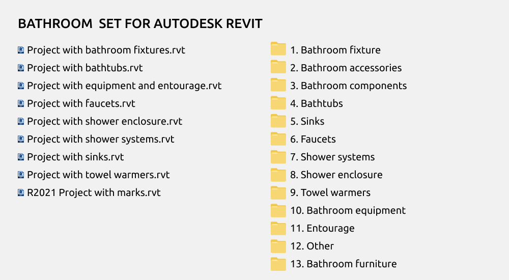

**Proyecto con bañeras**

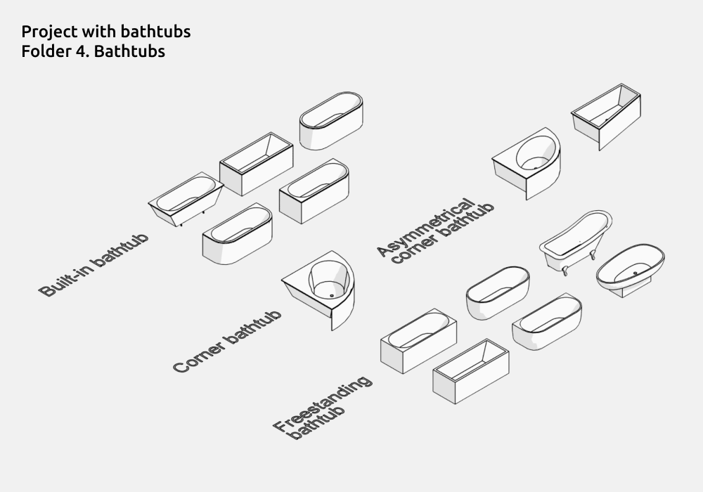

El proyecto con bañeras incluye estas familias de la carpeta número **4 Bathtubs**:

- Bañera empotrada (Built-in bathtub)
- Bañera exenta (Freestanding bathtub)
- Bañera de esquina asimétrica (Asymmetrical corner bathtub)
- Bañera de esquina (Corner bathtub)

**Proyecto con mamparas de ducha**

El proyecto con mamparas de ducha incluye estas familias de la carpeta número **8 Shower enclosure**:

- Mampara de ducha (Shower enclosure)
- Panel fijo de ducha (Shower door)
- Sumidero de ducha (Shower trap)

**Proyecto con sistemas de ducha**

El proyecto con sistemas de ducha incluye estas familias de la carpeta número **7 Shower systems**:

- Ducha lateral (Shower body spray)
- Llaves (Valves)
- Columna de ducha vista (Exposed shower system)
- Sistema de ducha empotrado (Concealed shower system)
- Teleducha (Hand shower)
- Rociador (Shower head)

**Proyecto con equipamiento y entorno**

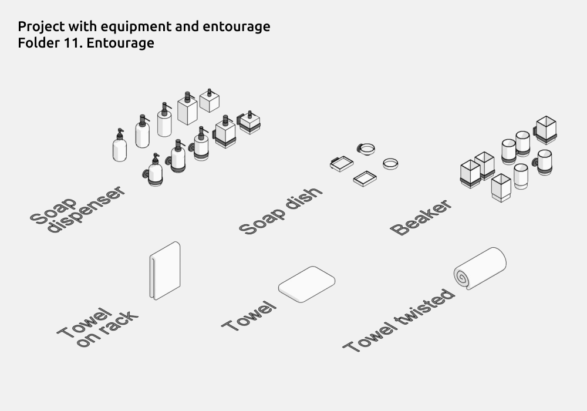

El proyecto con equipamiento y decoración incluye familias de la carpeta número **10 Bathroom equipment** y de la carpeta número **11 Entourage**.

Equipamiento:

- Termo eléctrico redondo (Water heater round)
- Termo eléctrico (Water heater)
- Lavadora (Washing machine)
- Secadora (Drying machine)

Entorno:

- Tabla de planchar (Ironing board)
- Dosificador de jabón (Soap dispenser)
- Jabonera (Soap dish)
- Toalla en barra (Towel on rack)
- Toalla enrollada (Towel twisted)
- Toalla (Towel)
- Vaso (Beaker)
- Tendedero (Laundry dryer)

**Proyecto con toalleros calefactores**

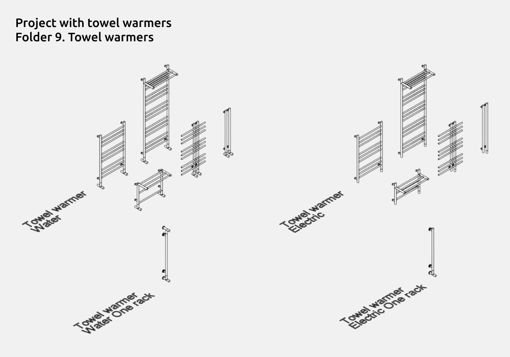

El proyecto con toalleros calefactores incluye estas familias de la carpeta número **9 Towel warmers**:

- Toallero calefactor de agua de un montante (Towel warmer Water One rack)
- Toallero calefactor de agua (Towel warmer Water)
- Toallero calefactor eléctrico de un montante (Towel warmer Electric One rack)
- Toallero calefactor eléctrico (Towel warmer Electric)

**Proyecto con lavabos**

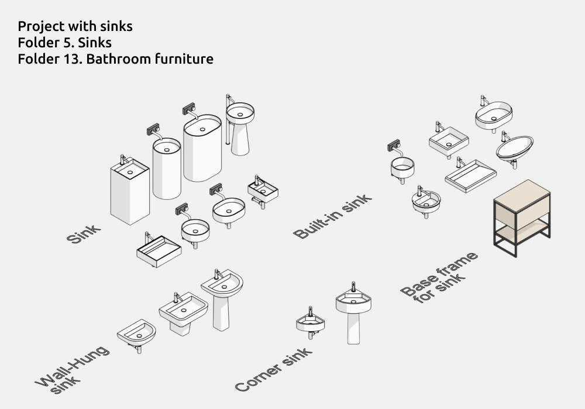

El proyecto con lavabos incluye familias de la carpeta número **5 Sinks** y de la carpeta número **13 Bathroom furniture**.

Lavabos:

- Lavabo encastrado (Built-in sink)
- Lavabo suspendido (Wall-Hung sink)
- Lavabo de esquina (Corner sink)
- Lavabo (Sink)

Mobiliario de baño:

- Estructura para lavabo (Base frame for sink)

**Proyecto con aparatos sanitarios y accesorios**

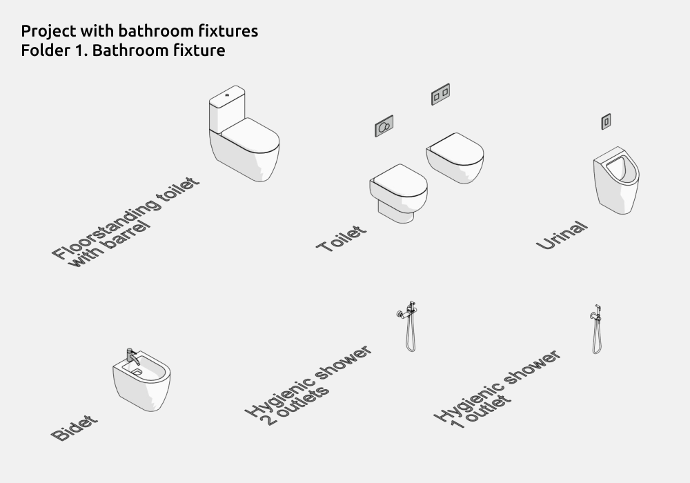

El proyecto con aparatos sanitarios y accesorios incluye familias de la carpeta número **1 Bathroom fixture** y de la carpeta número **2 Bathroom accessories**.

Aparatos sanitarios:

- Bidé (Bidet)
- Ducha higiénica de una toma (Hygienic shower 1 outlet)
- Ducha higiénica de dos tomas (Hygienic shower 2 outlets)
- Urinario (Urinal)
- Inodoro de pie con cisterna (Floorstanding toilet with barrel)
- Inodoro (Toilet)

Accesorios de baño:

- Portarrollos (Paper holder)
- Escobilla (Toilet brush)
- Espejo (Mirror)
- Perchas para toallas (Towel hooks)
- Soporte de pie para papel y escobilla (Floor stand for paper and toilet brush)
- Balda de esquina (Shelf corner)
- Balda (Shelf)
- Toallero (Towel holder)

**Proyecto con grifos**

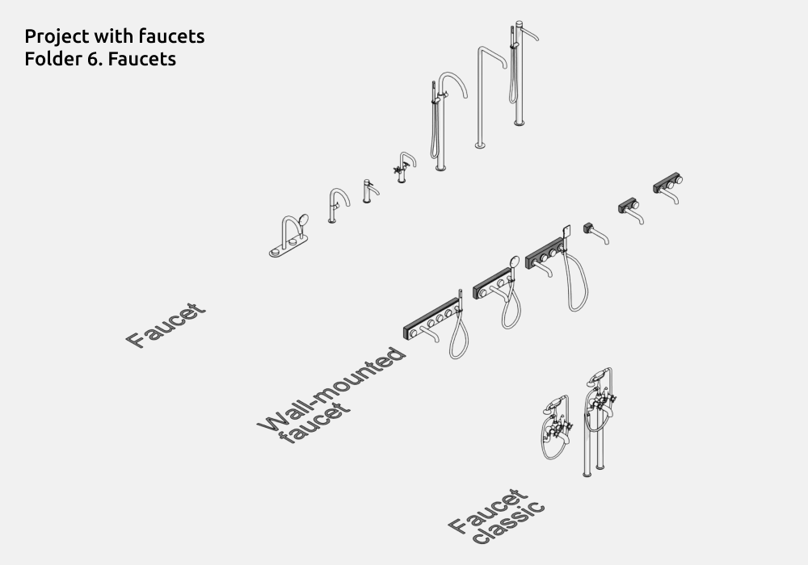

El proyecto con grifos incluye estas familias de la carpeta número **6 Faucets**:

- Grifo clásico (Faucet classic)
- Grifo mural (Wall-mounted faucet)
- Grifo (Faucet)

**Componentes de fontanería**

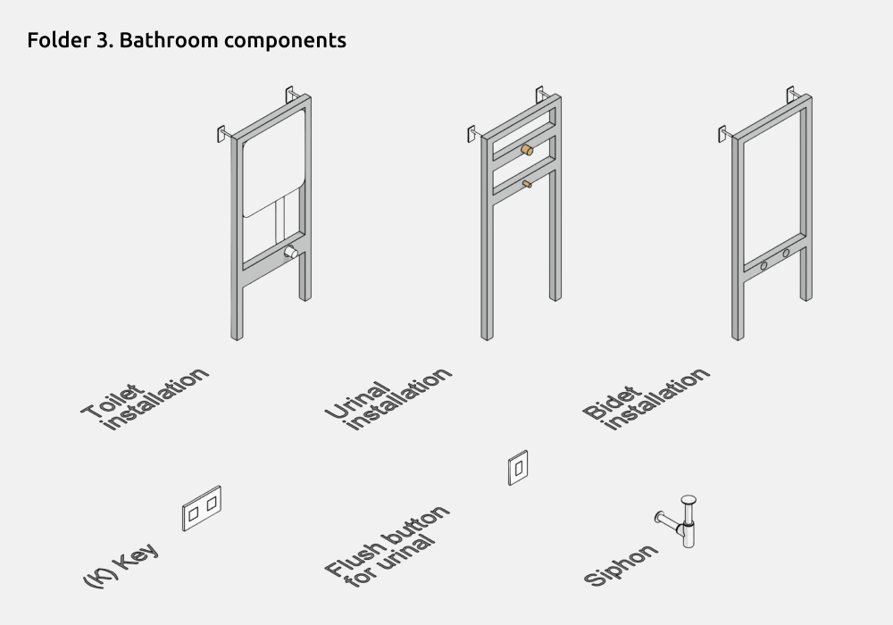

Si lo necesitas, puedes usar por separado los componentes de la carpeta número **3 Bathroom components**, donde están estas familias:

- Bastidor para bidé (Bidet installation)
- Bastidor para urinario (Urinal installation)
- Bastidor para inodoro (Toilet installation)
- K
- Pulsador de descarga para urinario (Flush button for urinal)
- Sifón (Siphon)

## 3. FAMILIAS

### Símbolo gráfico de las tomas

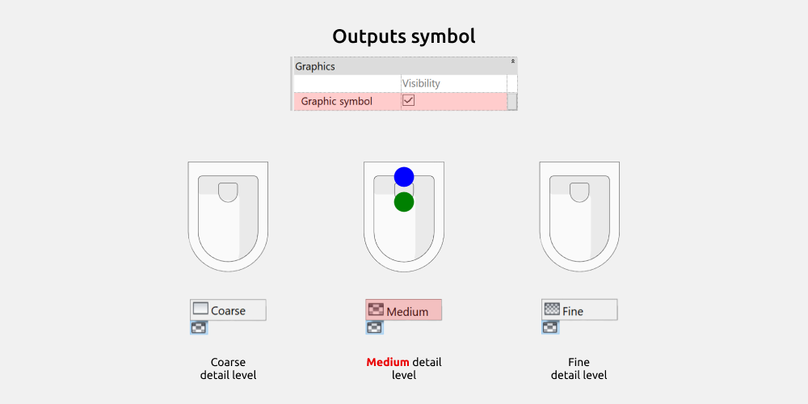

En la vista superior y con el nivel de detalle **medio** puedes activar el símbolo gráfico de las tomas de agua para mostrar qué tuberías hay que llevar hasta esa zona.

Para activarlo sigue estos pasos:

1. En las propiedades, dentro del grupo **Graphics**, marca el parámetro de visibilidad **Graphic symbol**.
2. Cambia el nivel de detalle de la vista a **medio**.

Cómo se dibuja el símbolo gráfico en la vista superior depende de qué sistemas estén activados en los parámetros de Graphics dentro de la familia principal del símbolo y también del parámetro **Vertical positioning**.

Símbolos por tipo de sistema:

- Azul, agua fría (CW)
- Rojo, agua caliente (HW)
- Verde, desagüe (Drain)

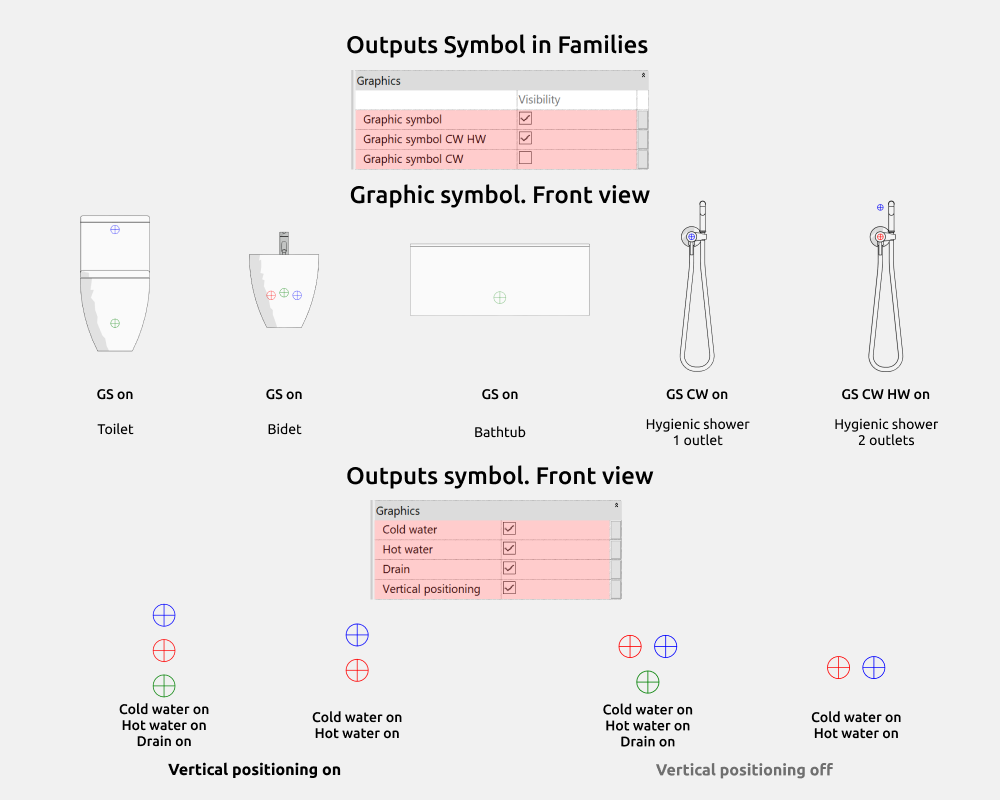

En la vista frontal el símbolo de las tomas se dibuja como marcadores circulares con ejes.

El color del marcador indica también el tipo de sistema.

Cómo se dibuja el símbolo depende de qué parámetros de tipo de sistema estén activados y del parámetro **Vertical positioning**.

### Parámetros del símbolo gráfico de las tomas. Medidas generales

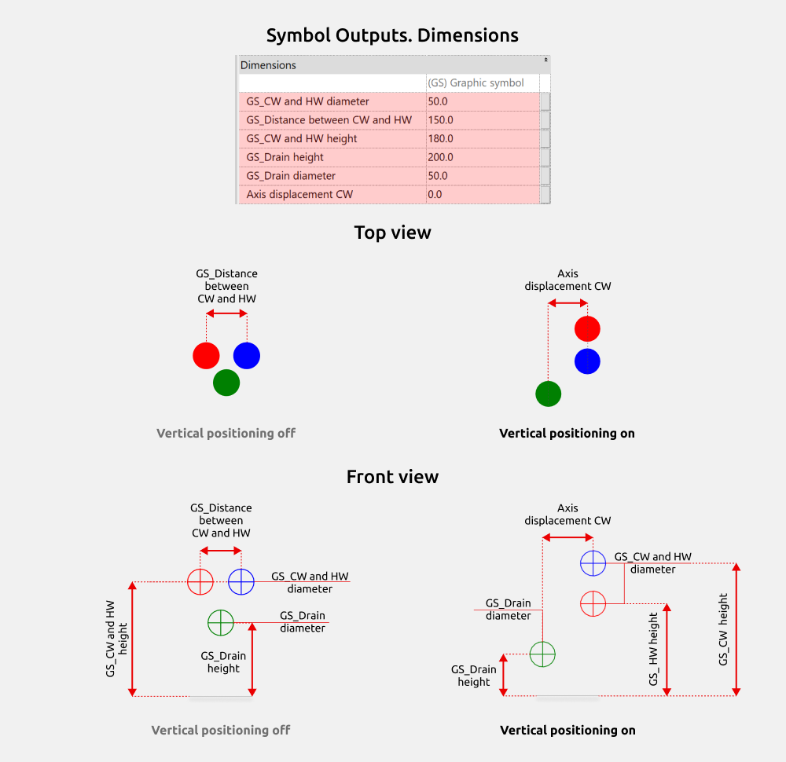

En el subgrupo **Graphic symbol** del grupo **Dimensions** están los parámetros que controlan el tamaño y la posición del símbolo respecto a los elementos de la familia principal.

Parámetros que aparecen en las familias:

- Altura de las tomas de agua fría y caliente (**GS_CW and HW height**)
- Altura de la toma de desagüe (**GS_Drain height**)
- Diámetro de los círculos del símbolo de agua fría y caliente (**GS_CW and HW diameter**)
- Diámetro del círculo del símbolo de desagüe (**GS_Drain diameter**)
- Separación de la toma de agua fría, o de agua fría y caliente, respecto al desagüe (**Axis displacement CW**)

#### Conectores

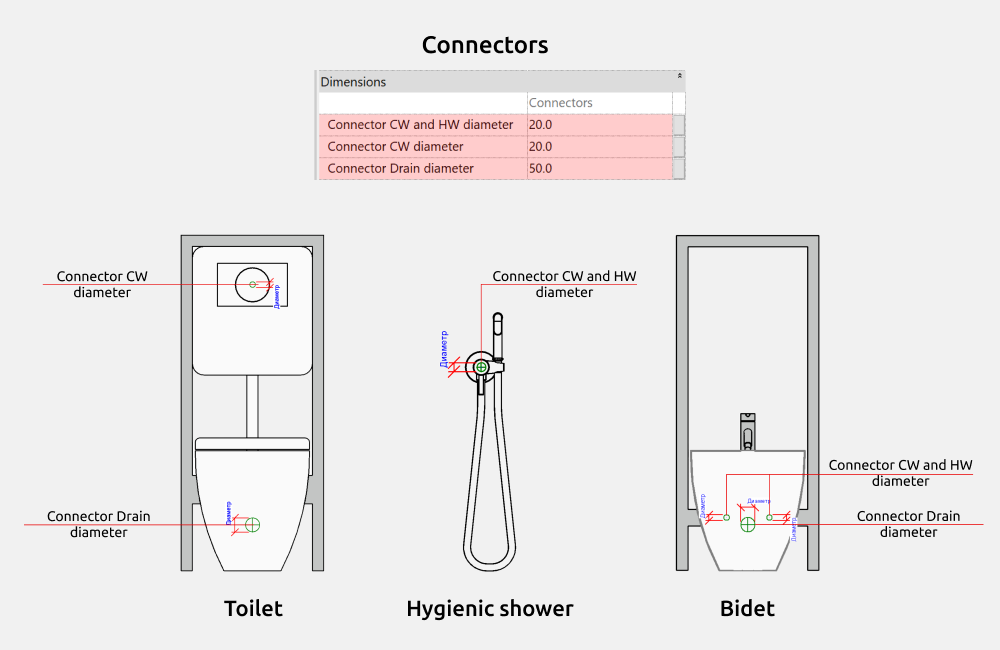

Algunas familias llevan conectores a las redes de agua fría, agua caliente y saneamiento.

Las medidas de los conectores se indican con estos parámetros:

- Diámetro del conector de agua fría (**Connector CW diameter**)
- Diámetro de los conectores de agua fría y caliente (**Connector CW and HW diameter**)
- Diámetro del conector de saneamiento (**Connector Drain diameter**)

### Bañeras

#### Bañera empotrada

En la bañera empotrada puedes activar y desactivar estos elementos:

- Faldón (**Bath panel**)
- Patas (**Legs**)

##### Dimensiones

Los parámetros **INT_Width**, **INT_Depth** e **INT_Height** controlan las medidas generales de la bañera.

**Legs forward-backward shift**, separación de las patas respecto al borde por el lado corto.

**Legs lateral shift**, separación de las patas respecto al borde por el lado largo de la bañera.

**Bowl height**, distancia desde el fondo de la bañera hasta el canto del borde. Cambia con la altura de las patas.

**Edge width**, ancho desde el borde interior de la cuba hasta el borde exterior de la bañera.

##### Opciones

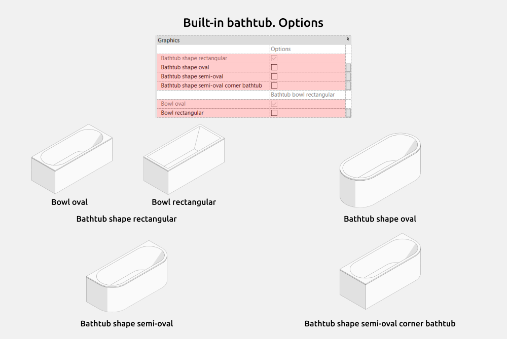

En las opciones puedes cambiar la forma de la bañera:

- Rectangular (**Bathtub shape rectangular**)
- Cuba ovalada (**Bowl oval**)
- Cuba rectangular (**Bowl rectangle**)
- Ovalada (**Bathtub shape oval**)
- Semioval (**Bathtub shape semi-oval**)
- Semioval de esquina (**Bathtub shape semi-oval corner bathtub**)

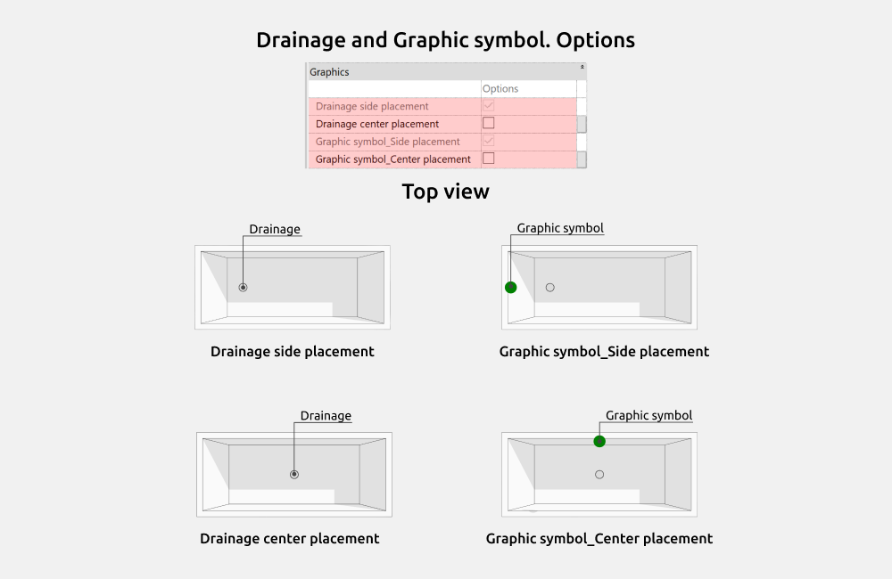

Cambiar la posición del desagüe:

- Desagüe lateral (**Drainage side placement**)
- Desagüe centrado (**Drainage center placement**)

Cambiar la posición del símbolo gráfico:

- Símbolo lateral (**Graphic symbol_Side placement**)
- Símbolo centrado (**Graphic symbol_Center placement**)

#### Bañera de esquina

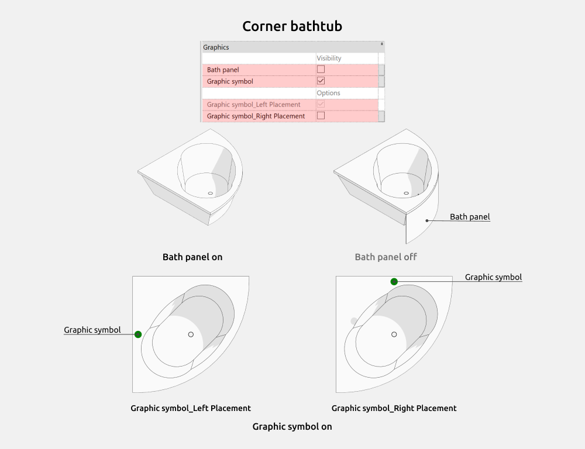

En la bañera de esquina puedes activar y desactivar la visibilidad del faldón (**Bath panel**).

También puedes elegir la posición del símbolo gráfico:

- Símbolo a la izquierda (**Graphic symbol_Left Placement**)
- Símbolo a la derecha (**Graphic symbol_Right Placement**)

##### Dimensiones

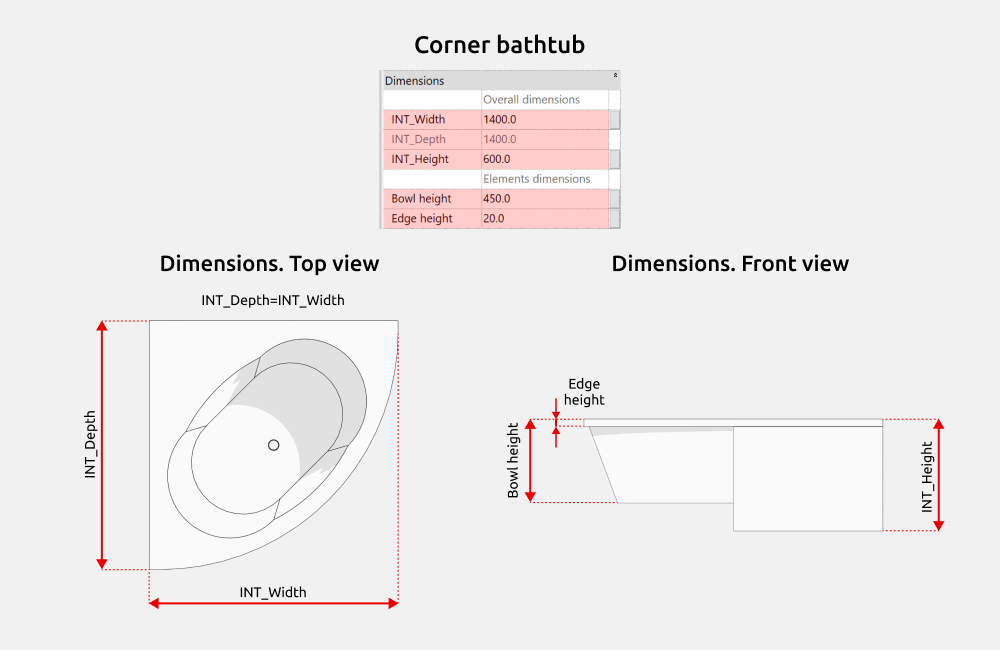

En la bañera de esquina cambian las medidas **INT_Width** e **INT_Height**. El parámetro **INT_Depth** es igual a **INT_Width**.

Puedes controlar el tamaño de los elementos con **Bowl height** y **Edge height**.

#### Bañera de esquina asimétrica

En la bañera de esquina asimétrica puedes activar y desactivar la visibilidad del faldón (**Bath panel**).

También puedes elegir la posición del símbolo gráfico:

- Símbolo a la izquierda (**Graphic symbol_Left Placement**)
- Símbolo a la derecha (**Graphic symbol_Right Placement**)

##### Dimensiones

Cambian las medidas **INT_Width** e **INT_Height**. El parámetro **INT_Depth** es igual a **INT_Width**.

Puedes controlar el tamaño de los elementos con **Bathtub rectangular_Right side**, solo en la bañera de forma rectangular, **Bowl height** y **Edge height**.

##### Opciones

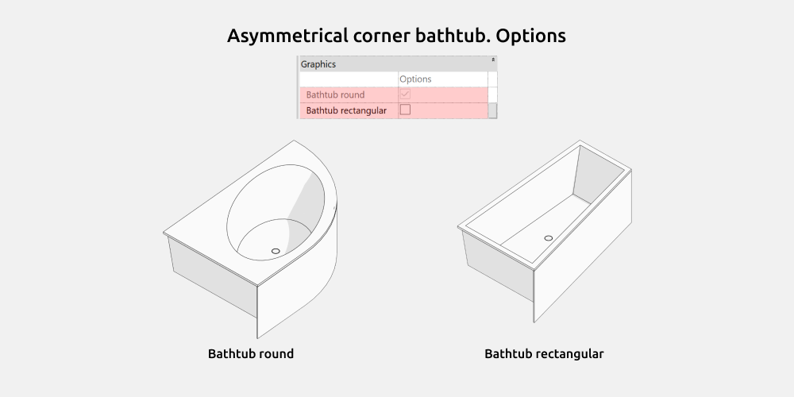

Elegir la forma de la bañera:

- Redonda (**Bathtub round**)
- Rectangular (**Bathtub rectangular**)

#### Bañera exenta

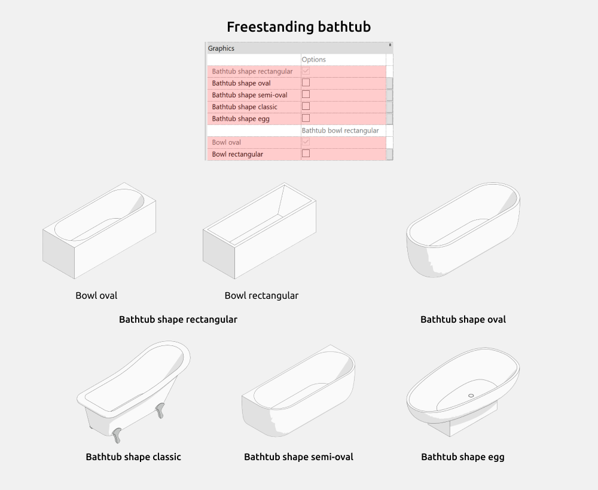

En la bañera exenta puedes elegir la forma:

- Rectangular (**Bathtub shape rectangular**)
- Cuba ovalada (**Bowl oval**)
- Cuba rectangular (**Bowl rectangle**)
- Ovalada (**Bathtub shape oval**)
- Clásica (**Bathtub shape classic**)
- Semioval (**Bathtub shape semi-oval**)
- De huevo (**Bathtub shape egg**)

##### Dimensiones

Cambian todas las medidas generales en las bañeras rectangular, ovalada y semioval.

Puedes cambiar el tamaño de estos elementos:

- Altura de la cuba (**Bowl height**)
- Ancho del borde (**Edge width**)

Particularidades según la forma:

- Forma clásica, solo cambia **INT_Width**
- Forma de huevo, solo cambia **INT_Height**

##### Opciones

Cambia la posición del desagüe:

- Desagüe lateral (**Drainage side placement**)
- Desagüe centrado (**Drainage center placement**)

Particularidades según la forma:

En la bañera de forma clásica y en la de huevo la posición del desagüe no cambia.

### Mamparas de ducha

#### Mampara de ducha

Aquí puedes activar y desactivar estos elementos:

- Plato (**Base**)
- Borde del plato (**Base edge**)
- Mampara (**Enclosure**)

##### Dimensiones

Cambian las medidas **INT_Width**, **INT_Depth** e **INT_Height**.

También puedes cambiar el tamaño de los elementos para la altura de la mampara, la altura del plato y el ancho de la puerta.

##### Opciones

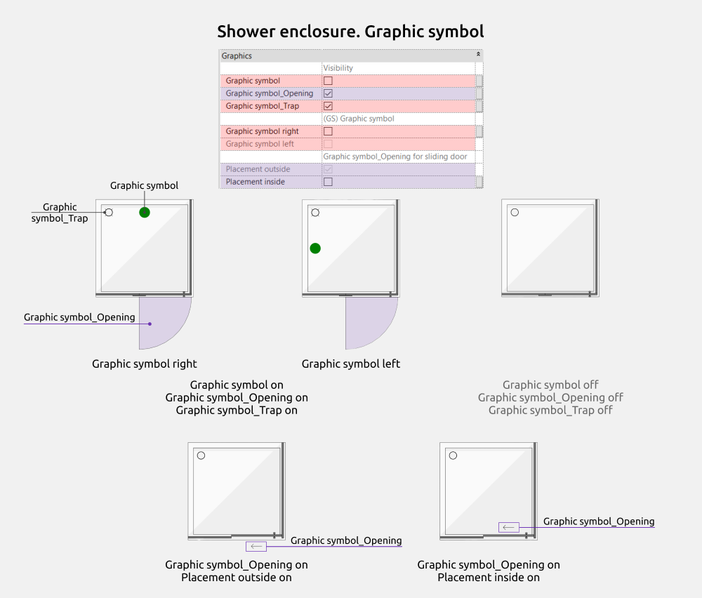

Puedes activar estos símbolos:

- Símbolo gráfico (**Graphic symbol**), con el nivel de detalle **medio**
- Símbolo de apertura (**Graphic symbol_Opening**)
- Símbolo del sumidero (**Graphic symbol_Trap**)

Para el símbolo de la acometida de tuberías puedes elegir su posición:

- Símbolo a la derecha (**Graphic symbol right**)
- Símbolo a la izquierda (**Graphic symbol left**)

Si eliges puerta corredera, **Graphic symbol_Opening** se dibuja como una flecha y tiene opciones adicionales:

- Colocación por fuera (**Placement outside**)
- Colocación por dentro (**Placement inside**)

En las opciones puedes elegir la forma de la mampara y del plato:

- Rectangular (**Shape rectangular**)
- De cuarto de círculo (**Shape quarter-circle**)
- Pentagonal (**Shape pentagon**)

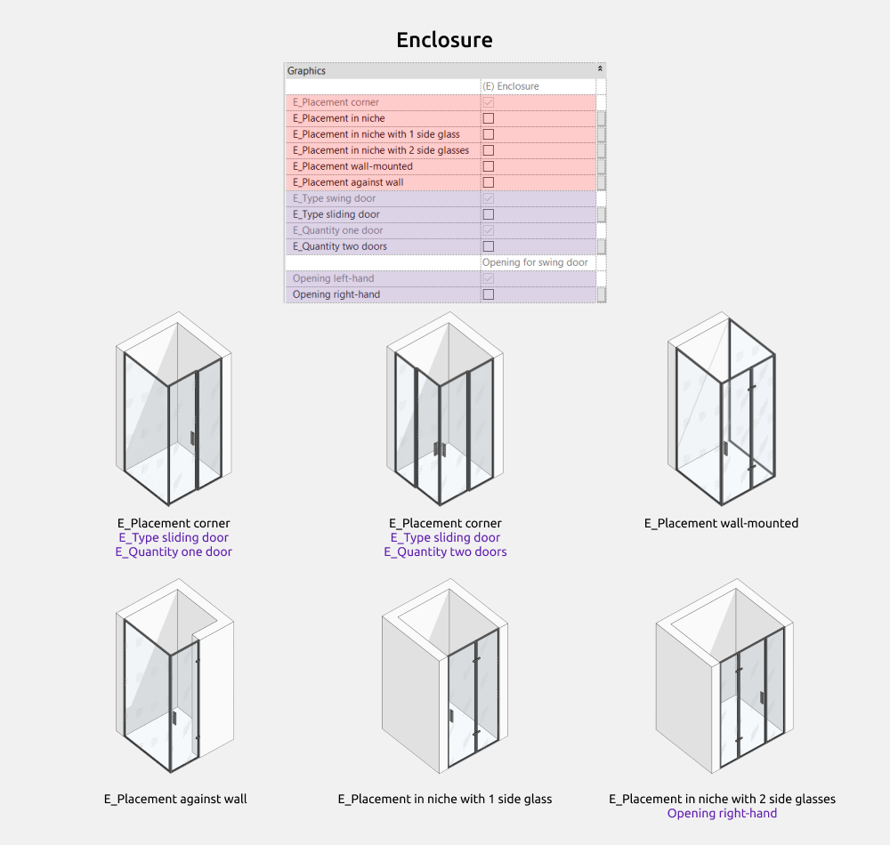

En la mampara de ducha puedes elegir el tipo de colocación:

- En esquina (**E_Placement corner**)
- En hornacina (**E_Placement in niche**)
- En hornacina con 1 vidrio lateral (**E_Placement in niche with 1 side glass**)
- En hornacina con 2 vidrios laterales (**E_Placement in niche with 2 side glasses**)
- Adosada a la pared (**E_Placement wall-mounted**)
- Contra la pared (**E_Placement against wall**)

Elegir el tipo y el número de puertas:

- Puerta abatible (**E_Type swing door**)
- Puerta corredera (**E_Type sliding door**)
- Una puerta (**E_Quantity one door**)
- Dos puertas (**E_Quantity two doors**)

Elegir el sentido de apertura de la puerta:

- Apertura izquierda (**Opening left-hand**)
- Apertura derecha (**Opening right-hand**)

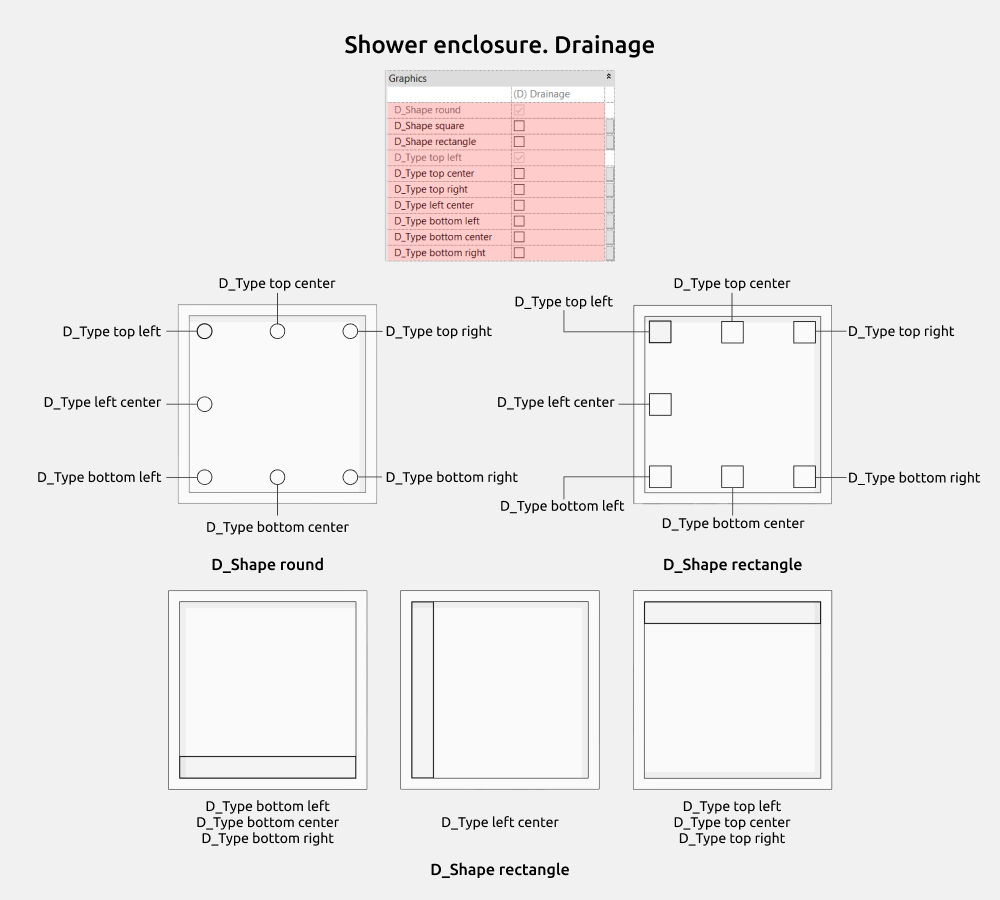

Puedes elegir el tipo de desagüe del plato:

- Redondo (**D_Shape round**)
- Cuadrado (**D_Shape square**)
- Rectangular (**D_Shape rectangle**)

También puedes elegir dónde va el desagüe en el plato.

Para el redondo y el cuadrado:

- Arriba a la izquierda (**D_Type top left**)
- Arriba en el centro (**D_Type top center**)
- Arriba a la derecha (**D_Type top right**)
- A la izquierda en el centro (**D_Type left center**)
- Abajo a la izquierda (**D_Type bottom left**)
- Abajo en el centro (**D_Type bottom center**)
- Abajo a la derecha (**D_Type bottom right**)

El desagüe rectangular se coloca en tres lados del plato: arriba, a la izquierda y abajo.

##### Materiales

Puedes cambiar los materiales del marco de la mampara, del vidrio, del plato, del tirador, de los anclajes y del desagüe.

#### Panel fijo de ducha

Aquí puedes activar y desactivar estos elementos:

- Anclaje a la pared a 90° (**Wall mounting 90°**)
- Anclaje a la pared a 45° (**Wall mounting 45°**)
- Sin marco (**Unframed**)
- Marco (**Frame**)

##### Dimensiones

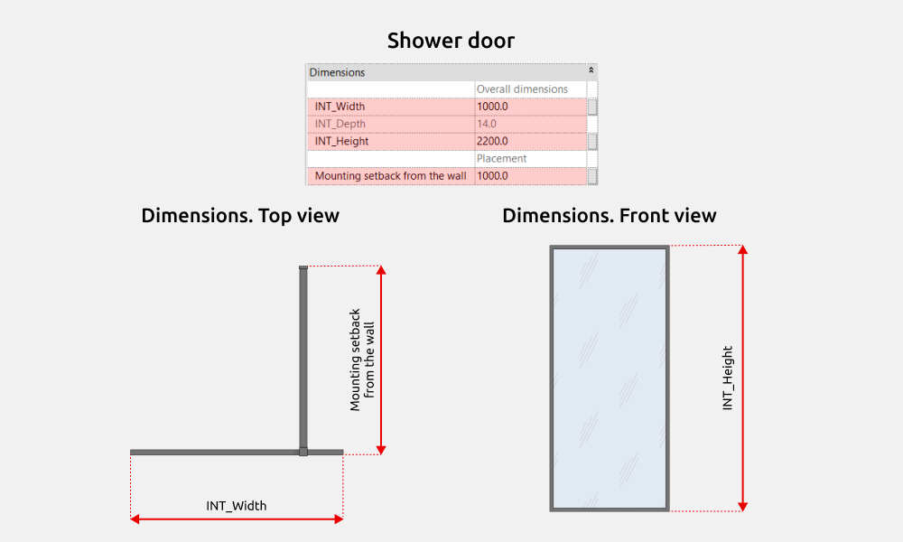

Cambian las medidas **INT_Width** e **INT_Height**.

Con **Mounting setback from the wall** puedes indicar la separación del panel respecto a la pared.

#### Sumidero de ducha

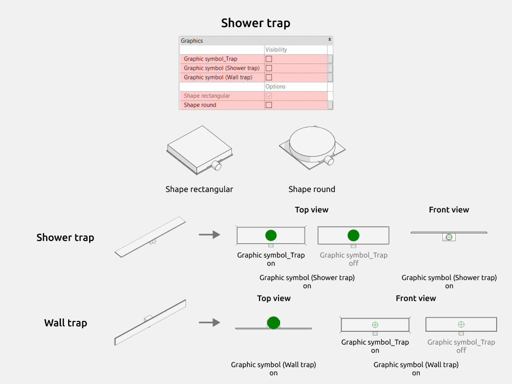

Cambia la forma del sumidero:

- Rectangular (**Shape rectangular**)
- Redonda (**Shape round**)

En el sumidero puedes activar y desactivar los símbolos gráficos:

- Símbolo del sumidero (**Graphic symbol_Trap**)
- Símbolo del sumidero colocado en el suelo (**Graphic symbol (Shower trap)**)
- Símbolo del sumidero colocado en la pared (**Graphic symbol (Wall trap)**)

Si el sumidero se coloca en el plato o en el suelo, activa **Graphic symbol (Shower trap)**. Así el símbolo se dibuja bien en la vista superior y en la frontal.

Si el sumidero se coloca en la pared, activa **Graphic symbol (Wall trap)**.

##### Dimensiones

Cambian las medidas **INT_Width**, **INT_Depth** e **INT_Height**.

También puedes cambiar el diámetro de los tubos de acometida al saneamiento y la profundidad de la acometida.

### Sistemas de ducha

#### Ducha lateral

En la familia de la ducha lateral puedes elegir la forma:

- Cuadrada (**Shape square**)
- Redonda (**Shape round**)

Cambian las medidas **INT_Width**, **INT_Depth** e **INT_Height**.

#### Llaves

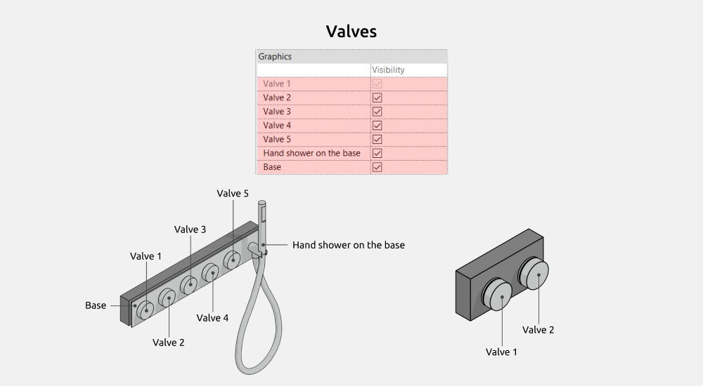

En la familia de llaves puedes activar y desactivar estos elementos:

- Llave 1 (**Valve 1**)
- Llave 2 (**Valve 2**)
- Llave 3 (**Valve 3**)
- Llave 4 (**Valve 4**)
- Llave 5 (**Valve 5**)
- Teleducha sobre la base (**Hand shower on the base**)
- Base (**Base**)

##### Dimensiones

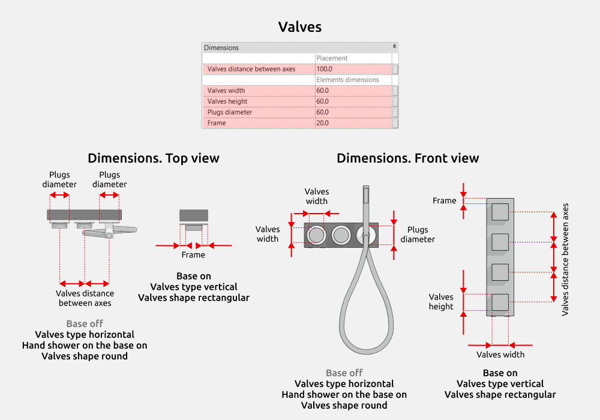

**Valves distance between axes** indica la distancia entre los centros, es decir los ejes, de las llaves y de la teleducha, si la teleducha está activada.

Diferencias de medidas según la forma de la llave:

En las llaves rectangulares puedes cambiar **Valves width** y **Valves height**.

En las llaves redondas **Valves height** no cambia y su diámetro depende de **Valves width**.

**Plugs diameter** solo se puede cambiar cuando la teleducha está activada y la base desactivada.

**Frame** regula la separación entre el borde de la base y el borde de la llave.

##### Opciones

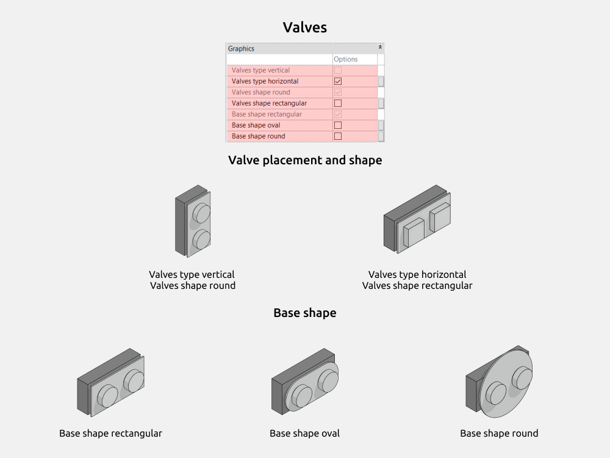

En las llaves puedes elegir el tipo de colocación:

- Vertical (**Valves type vertical**)
- Horizontal (**Valves type horizontal**)

También puedes elegir la forma de las llaves:

- Redonda (**Valves shape round**)
- Rectangular (**Valves shape rectangular**)

La forma de la base se indica de forma independiente de las llaves:

- Rectangular (**Base shape rectangular**)
- Ovalada (**Base shape oval**)
- Redonda (**Base shape round**)

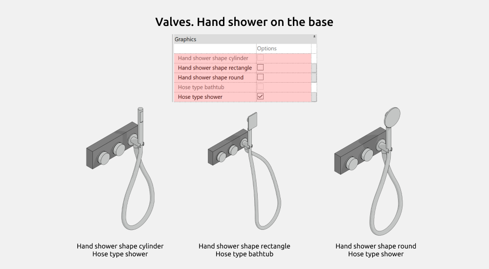

Para la teleducha, con **Hand shower on the base** activado, puedes elegir la forma:

- Cilíndrica (**Hand shower shape cylinder**)
- Rectangular (**Hand shower shape rectangle**)
- Redonda (**Hand shower shape round**)

También puedes elegir el tipo de flexo:

- De bañera (**Hose type bathtub**)
- De ducha (**Hose type shower**)

##### Materiales

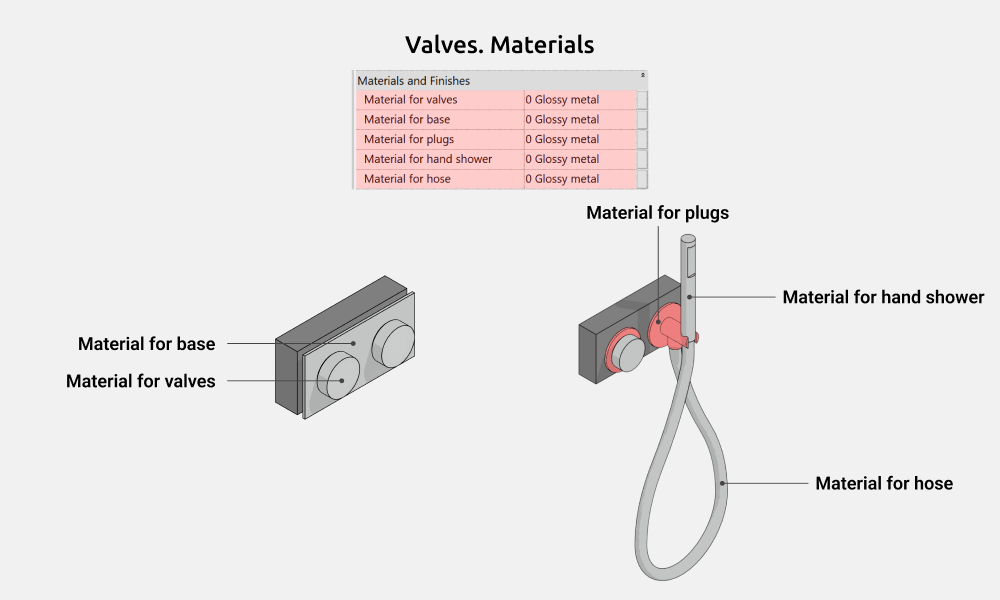

En la familia de llaves se asignan materiales a estos elementos:

- Material de las llaves (**Material for valves**)
- Material de la base (**Material for base**)
- Material de los embellecedores (**Material for plugs**)
- Material de la teleducha (**Material for hand shower**)
- Material del flexo (**Material for hose**)

#### Columna de ducha vista

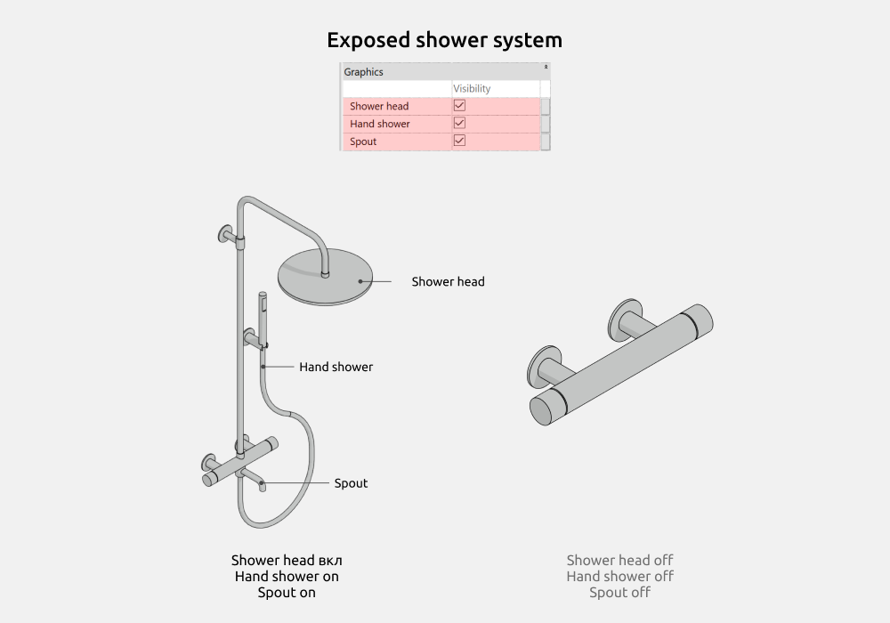

En la familia puedes activar y desactivar estos elementos:

- Rociador (**Shower head**)
- Teleducha (**Hand shower**)
- Caño (**Spout**)

##### Dimensiones

Los parámetros del rociador solo están activos con **Shower head** activado.

Parámetros principales de colocación y tamaño del rociador:

- Altura de colocación del rociador (**SH_Height of placement**)
- Separación del rociador respecto a la pared (**SH_Distance from the wall**)
- Ancho del rociador (**SH_Width**)

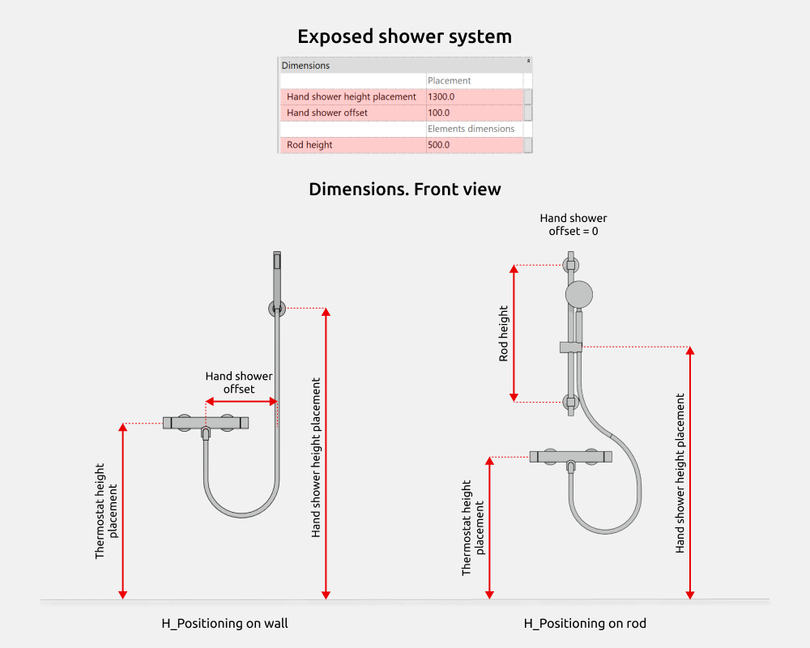

Posición del termostato y de la teleducha:

- Altura de colocación de la teleducha (**Hand shower height placement**)
- Desplazamiento de la teleducha (**Hand shower offset**)
- Altura de colocación del termostato (**Thermostat height placement**)

**Rod height** solo está activo con **H_Positioning on rod** activado.

**Hand shower offset** y **Hand shower height placement** quedan inactivos con **H_Positioning on rack** activado.

##### Opciones

En la familia de la columna de ducha vista hay opciones para el rociador y para la teleducha.

Para el rociador, con **Shower head** activado, puedes elegir la forma:

- Redonda (**SH_Shape round**)
- Cuadrada (**SH_Shape square**)

Para la teleducha, con **Hand shower** activado, puedes elegir la forma:

- Cilíndrica (**H_Shape cylinder**)
- Rectangular (**H_Shape rectangle**)
- Redonda (**H_Shape round**)

##### Materiales

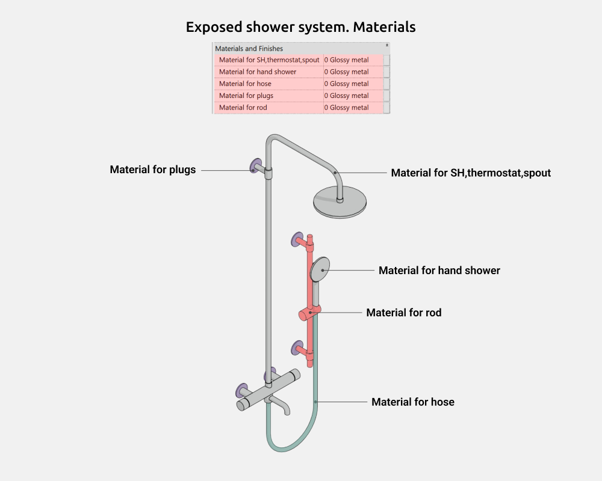

En la familia de la columna de ducha vista se asignan materiales a estos elementos:

- Material del rociador, del termostato y del caño (**Material for SH,thermostat,spout**)
- Material de la teleducha (**Material for hand shower**)
- Material del flexo (**Material for hose**)
- Material de los embellecedores (**Material for plugs**)
- Material de la barra (**Material for rod**)

#### Sistema de ducha empotrado

En la familia puedes activar y desactivar estos elementos:

- Rociador (**Shower head**)
- Llave 1 (**Valve 1**)
- Llave 2 (**Valve 2**)
- Llave 3 (**Valve 3**)
- Llave 4 (**Valve 4**)
- Llave 5 (**Valve 5**)
- Teleducha (**Hand shower**)
- Base de las llaves (**Vents base**)

##### Dimensiones

En la familia del sistema de ducha empotrado tienes parámetros de colocación y de tamaño.

Para el rociador, con **Shower head** activado:

- Altura de colocación del rociador (**SH_Height of placement**)
- Separación del rociador respecto a la pared (**SH_Distance from the wall**)
- Espesor del rociador (**SH_Thickness**)
- Ancho del rociador (**SH_Width**)
- Altura del tubo del rociador (**SH_Height of pipe**)

Para la teleducha, con **Hand shower** activado:

- Altura de colocación de la teleducha (**H_Height placement**)
- Desplazamiento de la teleducha (**H_Offset**)
- Desplazamiento de la toma de la teleducha (**H_Connection offset**)
- Altura de la toma de la teleducha (**H_Height connection**)
- Altura de la barra (**Rod height**)
- Diámetro de los embellecedores (**Plugs diameter**), para la teleducha y las llaves

Para las llaves:

- Altura de colocación de las llaves (**V_Height placement**)
- Desplazamiento de las llaves (**V_Offset**)
- Distancia entre los ejes de las llaves (**V_Distance between axes**)
- Ancho de las llaves (**Valves width**)
- Altura de las llaves (**Valves height**)
- Diámetro de los embellecedores (**Plugs diameter**), para la teleducha y las llaves
- Separación entre el borde de la base y las llaves (**Frame**)

##### Opciones

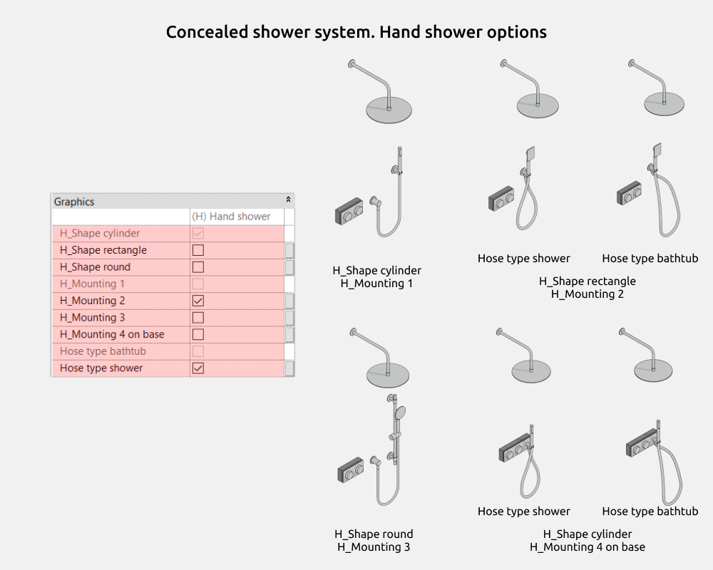

En la familia del sistema de ducha empotrado hay opciones para la teleducha, el rociador y las llaves.

Opciones de la teleducha:

Puedes elegir su forma, con independencia del tipo de anclaje:

- Cilíndrica (**H_Shape cylinder**)
- Rectangular (**H_Shape rectangle**)
- Redonda (**H_Shape round**)

El tipo de anclaje se elige aparte:

- Anclaje 1 (**H_Mounting 1**)
- Anclaje 2 (**H_Mounting 2**)
- Anclaje 3 (**H_Mounting 3**)
- Anclaje 4 sobre base (**H_Mounting 4 on base**)

Con el anclaje 2 y el anclaje 4 sobre base puedes elegir además el tipo de flexo:

- De bañera (**Hose type bathtub**)
- De ducha (**Hose type shower**)

Las opciones del rociador (SH) se explican con detalle en el apartado del rociador.

Las opciones de las llaves (V) se explican con detalle en el apartado de las llaves.

##### Materiales

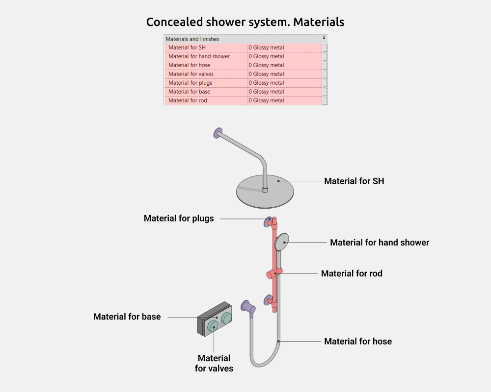

En la familia del sistema de ducha empotrado se asignan materiales a estos elementos:

- Material del rociador (**Material for SH**)
- Material de la teleducha (**Material for hand shower**)
- Material del flexo (**Material for hose**)
- Material de las llaves (**Material for valves**)
- Material de los embellecedores (**Material for plugs**)
- Material de la base (**Material for base**)
- Material de la barra (**Material for rod**)

#### Teleducha

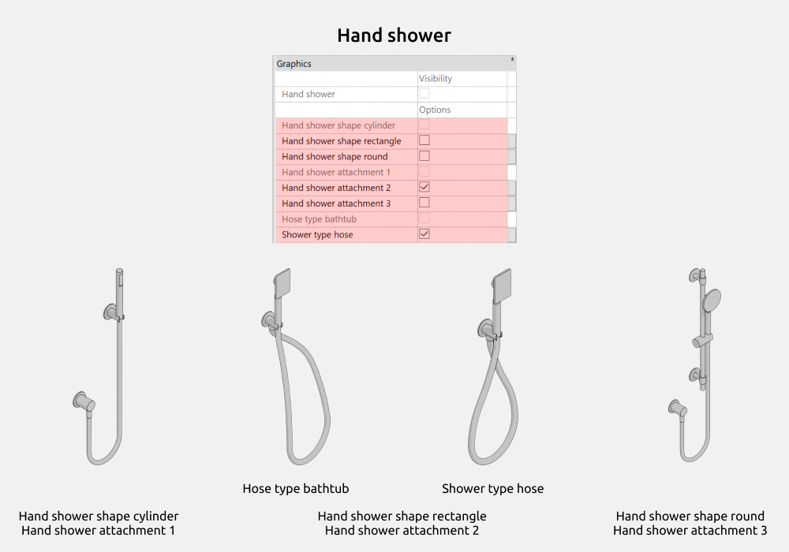

En la familia de la teleducha puedes elegir su forma, con independencia del tipo de anclaje:

- Cilíndrica (**Hand shower shape cylinder**)
- Rectangular (**Hand shower shape rectangle**)
- Redonda (**Hand shower shape round**)

El tipo de anclaje se elige aparte:

- Anclaje 1 (**Hand shower attachment 1**)
- Anclaje 2 (**Hand shower attachment 2**)
- Anclaje 3 (**Hand shower attachment 3**)

Con el anclaje 2 puedes elegir además el tipo de flexo:

- De bañera (**Hose type bathtub**)
- De ducha (**Shower type hose**)

##### Dimensiones

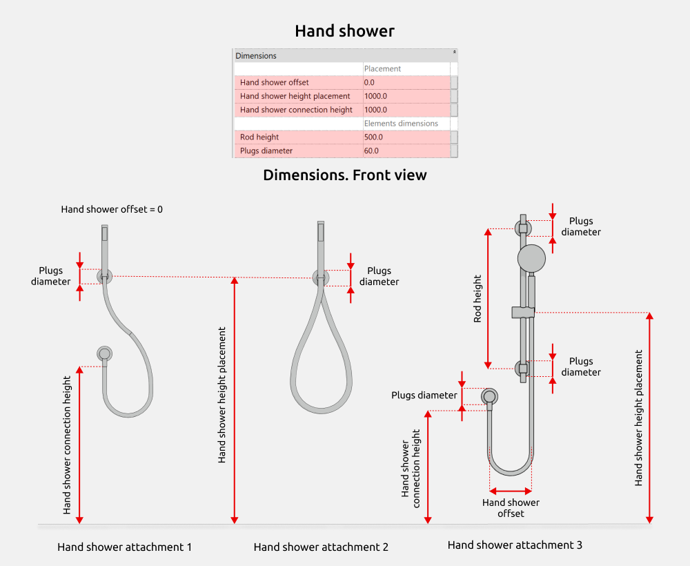

- Desplazamiento de la teleducha (**Hand shower offset**), solo con el anclaje 1 y el anclaje 3. Separación de la teleducha, de 0 a cualquier valor.
- Altura de colocación de la teleducha (**Hand shower height placement**), siempre disponible. Distancia de la teleducha respecto al plano de colocación.
- Altura de la toma de la teleducha (**Hand shower connection height**), solo con el anclaje 1 y el anclaje 3. Distancia de la acometida respecto al plano de colocación.
- Diámetro de los embellecedores (**Plugs diameter**), siempre disponible. Diámetro de todos los embellecedores del anclaje elegido.
- Altura de la barra (**Rod height**), solo con el anclaje 3. Distancia entre los anclajes de la barra.

##### Materiales

En la familia de la teleducha se asignan materiales a estos elementos:

- Material de la teleducha (**Material for hand shower**)
- Material del flexo (**Material for hose**)
- Material de los embellecedores (**Material for plugs**)
- Material de la barra (**Material for rod**)

#### Rociador

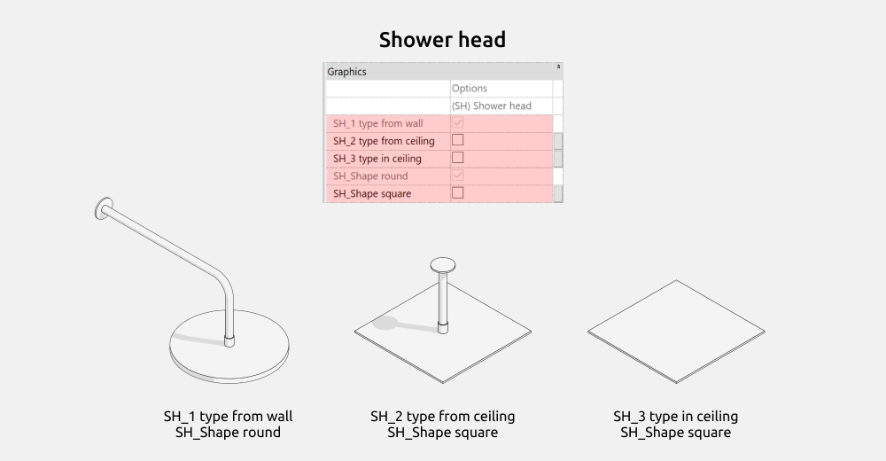

En el rociador puedes elegir el tipo de colocación:

- Desde la pared (**SH_1 type from wall**)
- Desde el techo (**SH_2 type from ceiling**)
- Empotrado en el techo (**SH_3 type in ceiling**)

También puedes elegir la forma:

- Redonda (**SH_Shape round**)
- Cuadrada (**SH_Shape square**)

##### Dimensiones

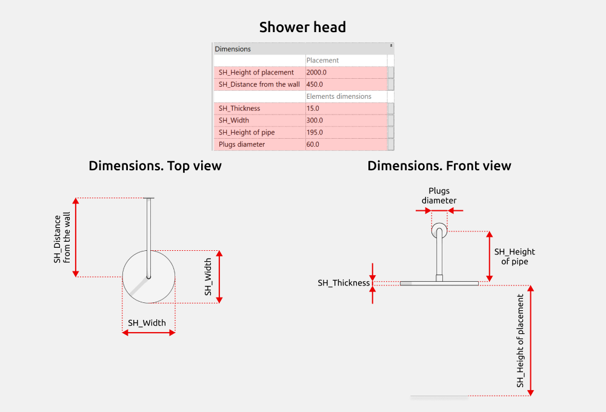

En la familia del rociador se ajustan los parámetros de colocación y de tamaño: la altura de colocación del rociador y la altura del tubo, la separación de la pared, el ancho y el espesor, y también el diámetro del embellecedor.

### Equipamiento y entorno

#### Termos eléctricos

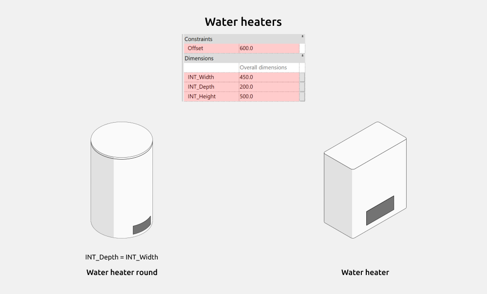

El conjunto incluye dos tipos de termo eléctrico, de forma rectangular y de forma redonda.

La altura de colocación se cambia con la herramienta de desplazamiento (**Offset**).

Cambian las medidas **INT_Width**, **INT_Depth** e **INT_Height**.

En el termo redondo **INT_Depth** es igual a **INT_Width**.

#### Lavadora y secadora

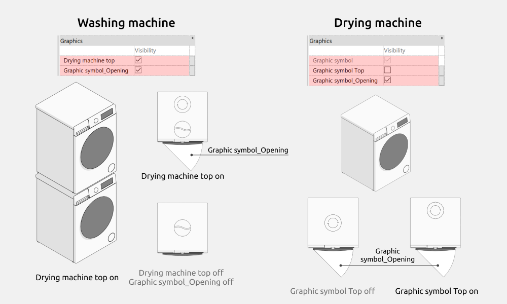

En la lavadora puedes activar y desactivar estos elementos:

- Secadora encima (**Drying machine top**)
- Símbolo de apertura (**Graphic symbol_Opening**)

En la secadora:

- Símbolo gráfico (**Graphic symbol**)
- Símbolo gráfico superior (**Graphic symbol Top**)
- Símbolo de apertura (**Graphic symbol_Opening**)

##### Dimensiones

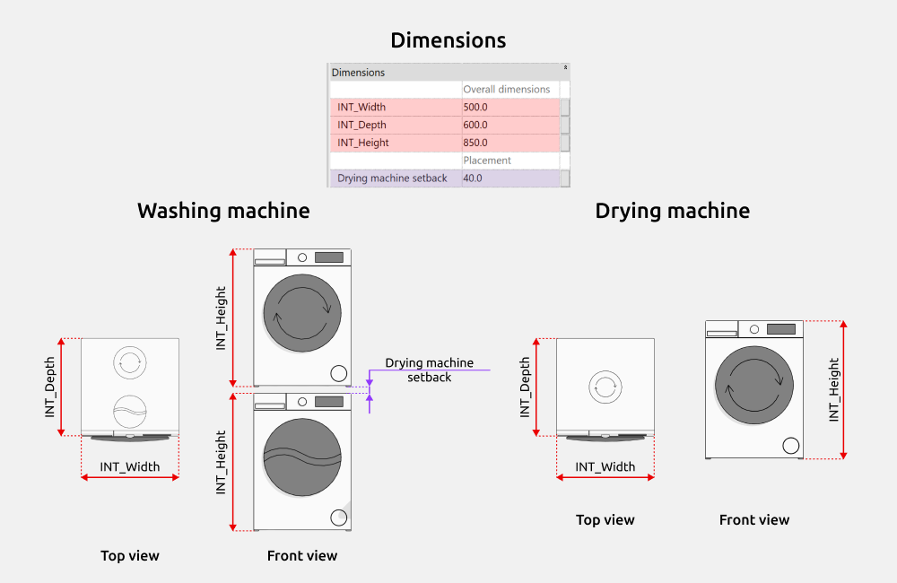

Cambian las medidas **INT_Width**, **INT_Depth** e **INT_Height**.

Puedes cambiar el parámetro de colocación **Drying machine setback**, que es la separación entre la lavadora y la secadora.

#### Entorno

Dosificador de jabón

En la familia puedes activar y desactivar el soporte.

Los 5 tipos de dosificador se eligen con la casilla de visibilidad.

Jabonera

En la jabonera puedes activar y desactivar el soporte y elegir la forma, rectangular o redonda.

Se pueden cambiar la separación de la pared y el ancho del embellecedor.

Vaso

En el vaso puedes activar y desactivar el soporte y elegir la forma, cuadrada o redonda.

Puedes elegir el número de vasos del tipo, 1 o 2.

Toallas

Cambian las medidas generales.

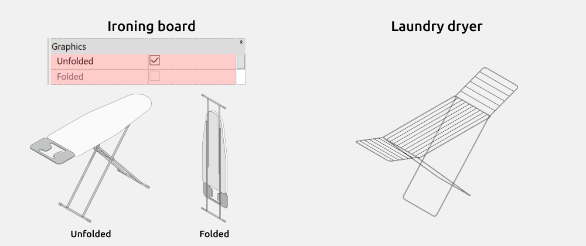

La familia de la tabla de planchar se puede ver de dos formas:

- Desplegada (Unfolded)
- Plegada (Folded)

La familia del tendedero tiene una única forma de representación.

### Toalleros calefactores

#### Toalleros calefactores de agua y eléctrico de un montante

En la familia puedes activar y desactivar estos elementos:

- Acometida (**Connection**)
- Embellecedor (**Plug**)

Puedes elegir la sección del perfil vertical:

- Cuadrada (**VP_Section square**)
- Redonda (**VP_Section circle**)

##### Dimensiones

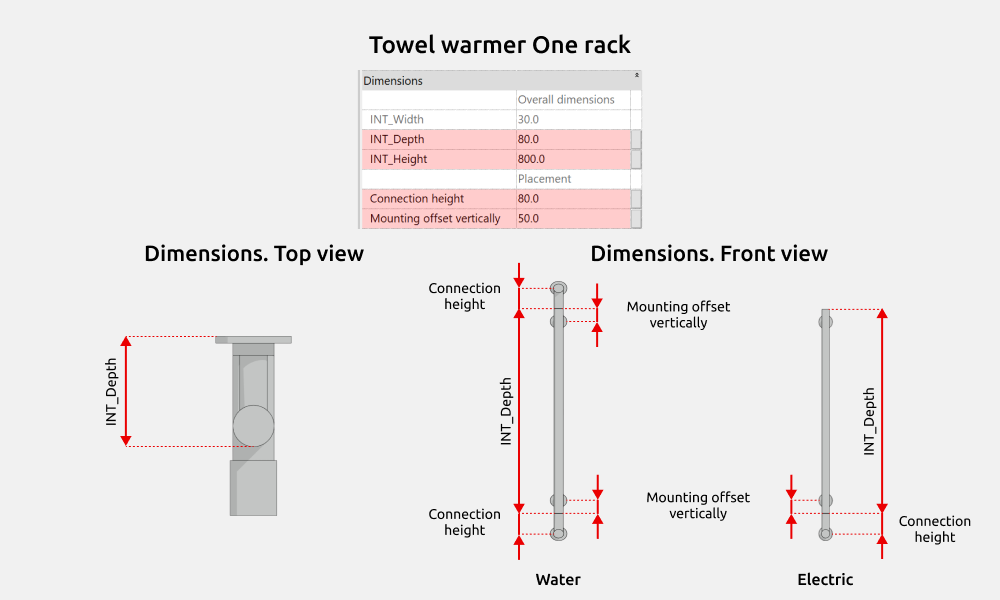

Los parámetros que controlan las medidas generales son **INT_Height** e **INT_Depth**.

**Connection height** indica la distancia desde el arranque del perfil vertical del toallero hasta el punto de acometida.

**Mounting offset vertically** indica la distancia desde el arranque del perfil hasta el centro del anclaje.

#### Toalleros calefactores

En la familia puedes activar y desactivar estos elementos:

- Montantes verticales (**Vertical racks**)
- Bastidor (**Frame**)
- Balda (**Shelf**)
- Acometida (**Connection**)
- Embellecedor (**Plug**)

##### Dimensiones

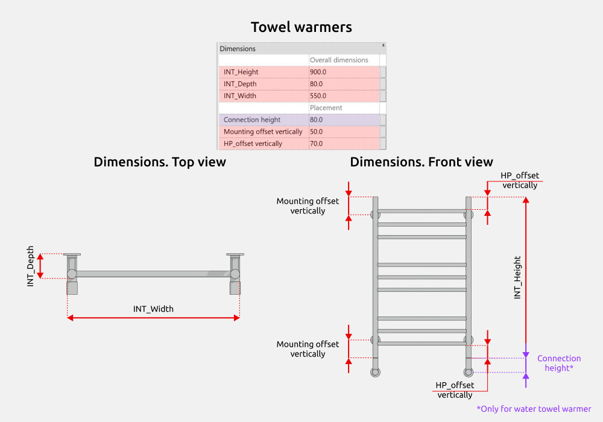

Los parámetros que controlan las medidas generales son **INT_Height**, **INT_Depth** e **INT_Width**.

**Mounting offset vertically** indica la distancia desde el arranque del perfil hasta el centro del anclaje.

**HP_offset vertically** indica la distancia desde el arranque del perfil hasta el canto del perfil horizontal.

**Connection height** solo existe en la familia del toallero calefactor de agua. Indica la distancia desde el arranque del perfil vertical hasta el punto de acometida.

##### Opciones

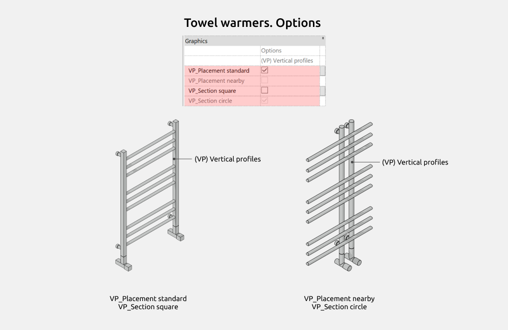

En la familia del toallero calefactor hay opciones para el perfil vertical.

Con **Vertical racks** activado puedes elegir la colocación:

- Estándar (**VP_Placement standard**)
- Junta (**VP_Placement nearby**)

También puedes elegir la sección:

- Cuadrada (**VP_Section square**)
- Redonda (**VP_Section circle**)

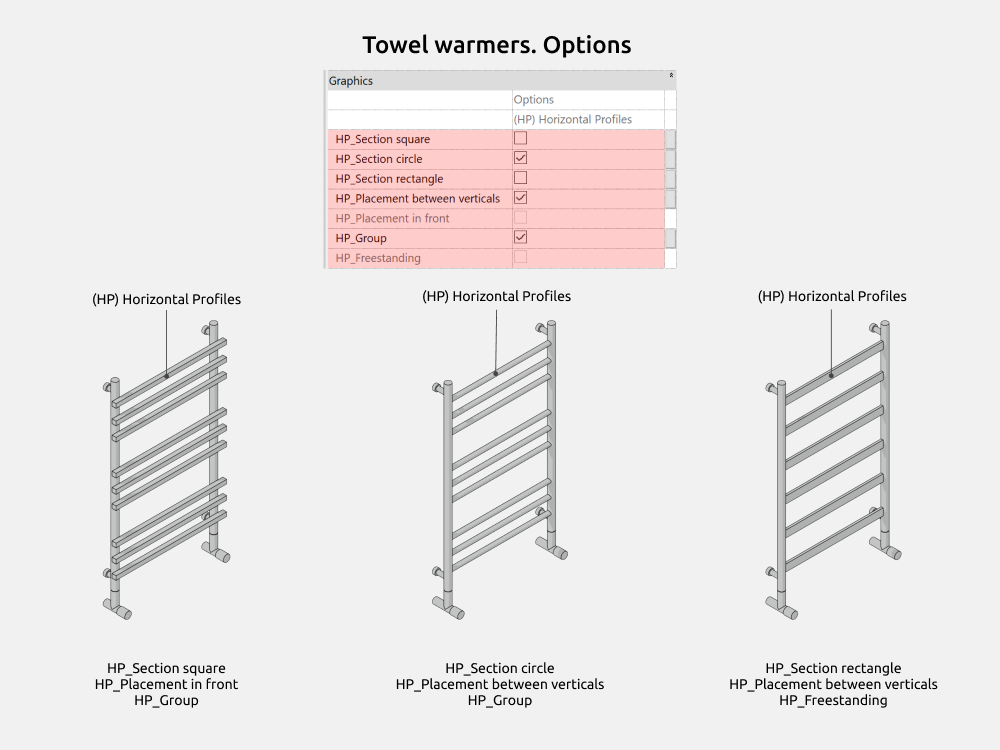

En la familia del toallero calefactor hay opciones para el perfil horizontal.

Elección de la sección del perfil horizontal:

- Cuadrada (**HP_Section square**)
- Redonda (**HP_Section circle**)
- Rectangular (**HP_Section rectangle**)

Colocación respecto al perfil vertical:

- Entre los verticales (**HP_Placement between verticals**)
- Por delante (**HP_Placement in front**), donde el perfil horizontal se coloca por encima del vertical

Agrupación de los perfiles horizontales:

- En grupo (**HP_Group**), tres perfiles horizontales repartidos de forma regular en altura
- Sueltos (**HP_Freestanding**), perfiles horizontales sueltos repartidos de forma regular en altura

En el toallero calefactor de agua puedes elegir dónde va la acometida:

- Superior (**C_Top**)
- Inferior (**C_Bottom**)
- Por el montante (**C_On the rack**)
- En diagonal (**C_Diagonal**)

### Lavabos

#### Elementos comunes

##### Desagüe

**Por defecto** todos los lavabos llevan desagüe redondo.

Solo se puede elegir el desagüe en el lavabo rectangular, y en la familia Built-in sink además con la colocación a ras de la encimera (**Placement in line with the countertop**):

- Redondo (**Drainage round**)
- Rectangular (**Drainage rectangular**)
- De ranura (**Drainage slotted**)

##### Grifo

Elección de la colocación del grifo:

- Sobre el plano (**F_Placement on the plane**)
- Sobre el lavabo (**F_Placement on the sink**)
- Mural (**F_Wall-mounted placement**)

En el **lavabo encastrado** la opción **F_Placement on the sink** solo está disponible con **Placement on a countertop**.

##### Dimensiones

Los parámetros que controlan las medidas generales son **INT_Width** e **INT_Depth**.

**Faucet offset from the sink** controla la distancia entre el eje del grifo y el borde del lavabo, solo con las opciones **F_Placement on the plane** y **F_Wall-mounted placement**.

**Importante:** en la familia del lavabo el parámetro **Edge width** se llama **Edge thickness**.

El parámetro que controla la medida general es **INT_Height**.

**Wall-mounted faucet vertical shift**, distancia desde la parte alta del lavabo hasta el eje del grifo. Está disponible con **Faucet** activado y con la opción **F_Wall-mounted placement** elegida.

**Siphon offset downward from the sink**, distancia desde la parte alta del lavabo hasta el eje horizontal del sifón.

**Siphon offset to the wall**, distancia desde la superficie de la pared hasta el eje vertical del sifón.

Los parámetros que controlan la posición del sifón están disponibles con **Siphon** activado.

##### Dimensiones del pedestal

En el lavabo suspendido y en el de esquina se pueden cambiar las medidas del pedestal.

**Pedestal height** indica la medida vertical desde el punto alto de encuentro con el lavabo hasta la base del pedestal.

**Pedestal width from top** y **Pedestal top depth** indican el ancho y la profundidad del pedestal en su parte alta, donde se encuentra con el lavabo.

**Pedestal width from bottom** y **Pedestal depth from below** indican el ancho y la profundidad del pedestal en su parte baja, en la base.

Estos parámetros dan al pedestal su geometría trapezoidal.

#### Lavabo encastrado

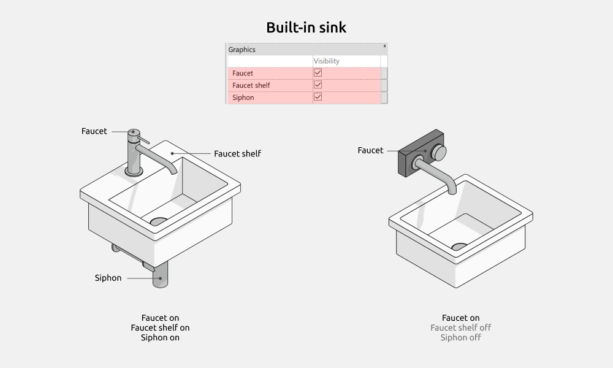

En la familia puedes activar y desactivar estos elementos:

- Grifo (**Faucet**)
- Repisa para el grifo (**Faucet shelf**)
- Sifón (**Siphon**)

La repisa para el grifo solo se activa con la opción **Placement on a countertop** activada.

##### Dimensiones

**INT_Height** controla la medida general principal, en la que no entran los bordes.

**Edge height** solo está disponible con la opción **Placement on a countertop** activada.

**Importante:** **Siphon offset downward from the sink** se mide siempre desde la medida general del lavabo sin contar **Edge height**.

Los parámetros de dimensiones del lavabo encastrado se explican con más detalle en el apartado de elementos comunes, en el subapartado de dimensiones.

##### Opciones

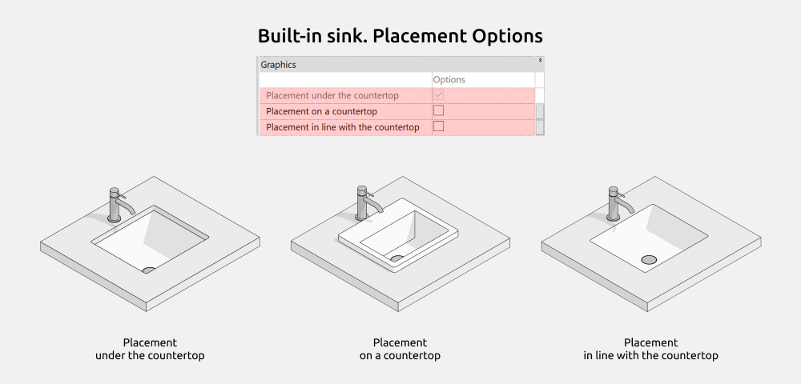

En el lavabo encastrado puedes elegir la colocación:

- Bajo encimera (**Placement under the countertop**)
- Sobre encimera (**Placement on a countertop**)
- A ras de la encimera (**Placement in line with the countertop**)

Elección de la forma del lavabo:

- Rectangular (**Shape rectangular**)
- Ovalada (**Shape oval**)
- Redonda (**Shape round**)
- Elíptica (**Shape ellipse**)

El redondeo de la forma del lavabo se puede indicar en todas las formas salvo en la elíptica.

Las demás opciones se explican en el apartado de elementos comunes.

#### Lavabo

En la familia puedes activar y desactivar estos elementos:

- Grifo (**Faucet**)
- Repisa para el grifo (**Faucet shelf**)
- Sifón (**Siphon**)
- Giro del sifón (**Siphon rotation**)

Las opciones se explican con más detalle en el apartado de elementos comunes.

##### Dimensiones

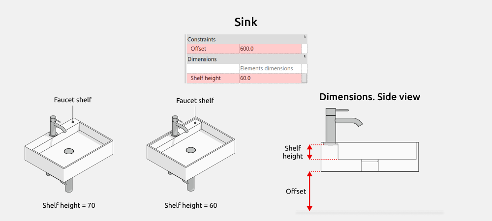

**Shelf height** solo está disponible con **Faucet shelf** activado. Indica la distancia desde el fondo del lavabo hasta la parte alta de la repisa.

La colocación en altura se hace con la herramienta de desplazamiento (**Offset**), en el grupo de restricciones.

Los parámetros de dimensiones del lavabo se explican con más detalle en el apartado de elementos comunes, en el subapartado de dimensiones.

##### Opciones

Elección de la forma del lavabo:

- Rectangular (**Shape rectangular**)
- Ovalada (**Shape oval**)
- Redonda (**Shape round**)
- De cuenco (**Shape bowl**)

El redondeo de la forma del lavabo se puede indicar en estas formas:

- Ovalada (**Shape oval**)
- Redonda (**Shape round**)

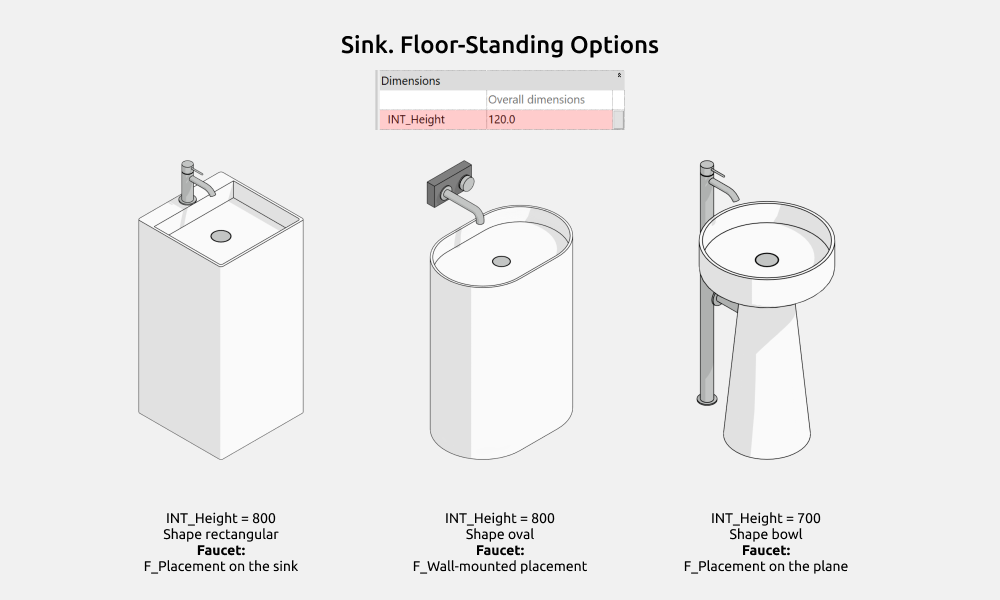

**INT_Height** permite apoyar el lavabo en el suelo, indicando la altura total desde la base hasta la parte alta de los bordes, para la colocación de pie.

Las demás opciones se explican en el apartado de elementos comunes.

#### Lavabo suspendido

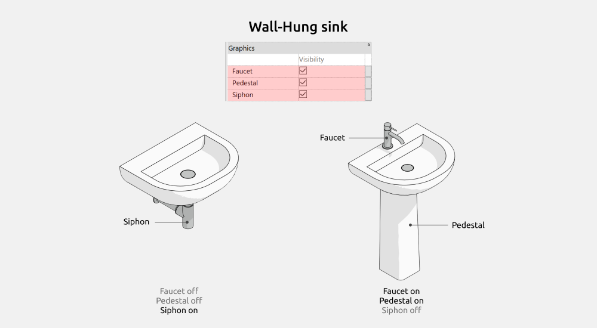

En la familia puedes activar y desactivar estos elementos:

- Grifo (**Faucet**)
- Pedestal (**Pedestal**)
- Sifón (**Siphon**)

##### Dimensiones

**INT_Width**, **INT_Depth** e **INT_Height** controlan las medidas generales de la familia.

Hay parámetros en gris que no se pueden editar, pero sirven para entender el cálculo de las medidas. Por ejemplo **INT_Height**, que muestra la altura del lavabo. Con el pedestal activado suma automáticamente la altura del pedestal y la del propio lavabo.

Los parámetros de dimensiones del pedestal se explican con más detalle en el apartado de elementos comunes, en el subapartado de dimensiones del pedestal.

#### Lavabo de esquina

En la familia puedes activar y desactivar estos elementos:

- Grifo (**Faucet**)
- Pedestal (**Pedestal**)
- Sifón (**Siphon**)

Elección de la colocación del sifón:

- Sifón en la pared izquierda (**Siphon on the left wall**)
- Sifón en la pared derecha (**Siphon on the right wall**)

##### Dimensiones

**INT_Width**, **INT_Depth** e **INT_Height** controlan las medidas generales de la familia.

Hay parámetros en gris que no se pueden editar, pero sirven para entender el cálculo de las medidas. Por ejemplo **INT_Height**, que muestra la altura del lavabo. Con el pedestal activado suma automáticamente la altura del pedestal y la del propio lavabo.

Los parámetros de dimensiones del pedestal se explican con más detalle en el apartado de elementos comunes, en el subapartado de dimensiones del pedestal.

#### Estructura para lavabo

En la familia puedes activar y desactivar estos elementos:

- Encimera (**Countertop**)
- Barra (**Railing**)
- Baldas (**Shelves**)
- Base (**Base**)
- Cajón (**Drawer**)

##### Dimensiones

**INT_Width**, **INT_Depth** e **INT_Height** controlan las medidas generales de la familia.

**INT_Height** es el parámetro de altura que engloba las alturas menores de los elementos que estén activados, es decir el espesor de la encimera (**Countertop thickness**), la altura del cajón (**Drawer height**) y la separación de la balda inferior (**Lower shelf offset**).

##### Opciones

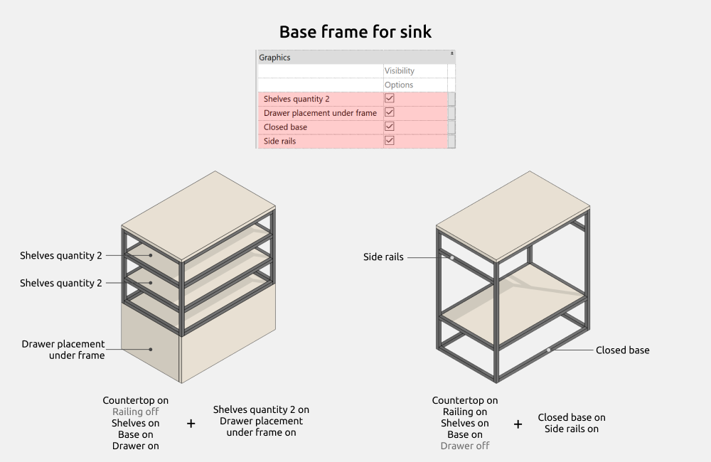

Opciones adicionales que se pueden activar:

- Dos baldas (**Shelves quantity 2**)
- Cajón bajo la estructura (**Drawer placement under frame**)
- Base cerrada (**Closed base**)
- Barra en los laterales (**Side rails**)

**Shelves quantity 2** añade una segunda balda y solo está disponible con **Shelves** activado.

**Drawer placement under frame** baja el cajón hasta el nivel de la base de la estructura y solo está disponible con **Drawer** activado.

**Closed base** añade un perfil horizontal en la base por el lado largo y solo está disponible con **Base** activado.

**Side rails** desactiva la barra entre los perfiles verticales por el lado largo de la estructura y solo está disponible con **Railing** activado.

### Aparatos sanitarios y accesorios

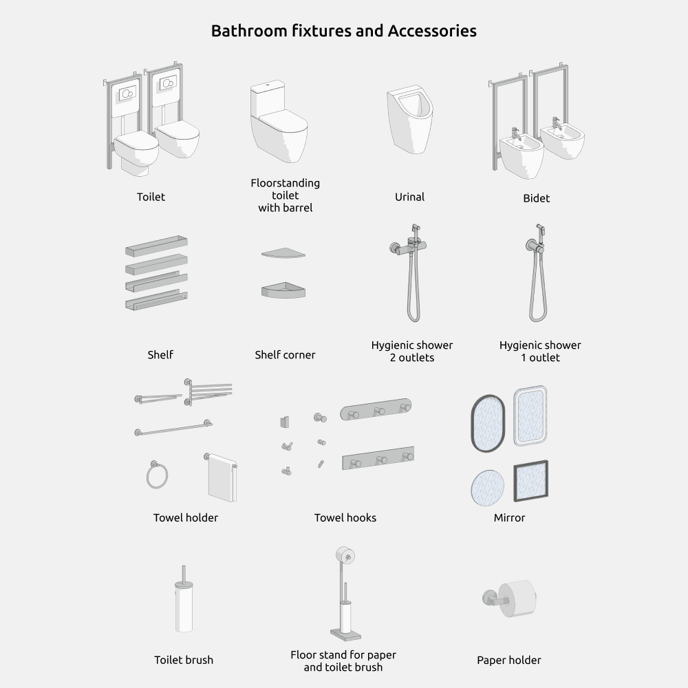

#### Aparatos sanitarios

#### Inodoro

La familia del inodoro tiene 2 tipos: inodoro de pie e inodoro suspendido.

En la familia del inodoro puedes activar y desactivar estos elementos:

- Pulsador (**Key**)
- Asiento con tapa (**Seat**)
- Bastidor empotrado (**Installation**)

Puedes elegir el tipo:

- Tipo 1 (**Type 1**)
- Tipo 2 (**Type 2**)

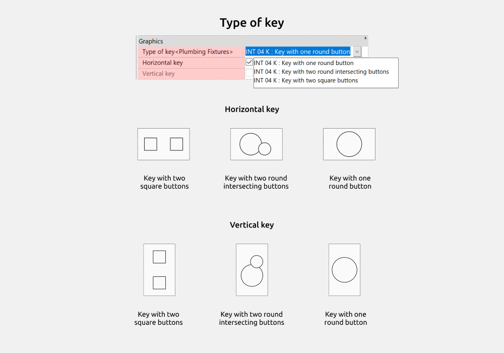

El tipo de pulsador se elige en la lista desplegable de la familia del inodoro. Son estos:

- Pulsador con dos botones cuadrados (Key with two square buttons)
- Pulsador con dos botones redondos que se cruzan (Key with two round intersecting buttons)
- Pulsador con un botón redondo (Key with one round button)

##### Dimensiones

**INT_Width**, **INT_Depth** e **INT_Height** controlan las medidas generales del inodoro.

Hay parámetros en gris que no se pueden editar, pero hacen falta para el cálculo de las medidas. Por ejemplo **INT_Height**, que depende de **Seat height**.

Puedes cambiar el tamaño del pulsador con **Key large side**, **Key smaller side** y **Key depth**.

Puedes cambiar la altura del asiento respecto al nivel de suelo acabado con **Seat height**.

También puedes controlar la altura del pulsador con **Distance from the floor to the center of the key**.

##### Bastidor empotrado

En el bastidor puedes cambiar las medidas con **Installation width**, **Installation depth** e **Installation height**.

**Cladding thickness**, separación entre el inodoro y el bastidor que se cierra con placa de yeso laminado.

##### Materiales

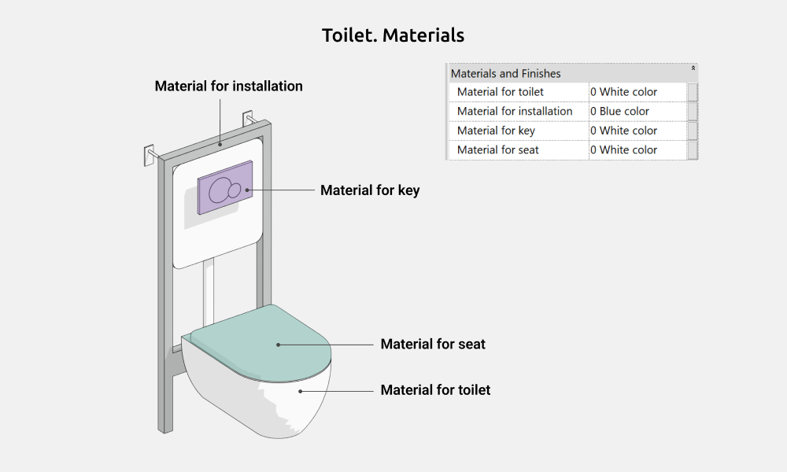

Puedes cambiar los materiales del inodoro, del bastidor, del pulsador y del asiento.

#### Inodoro de pie con cisterna

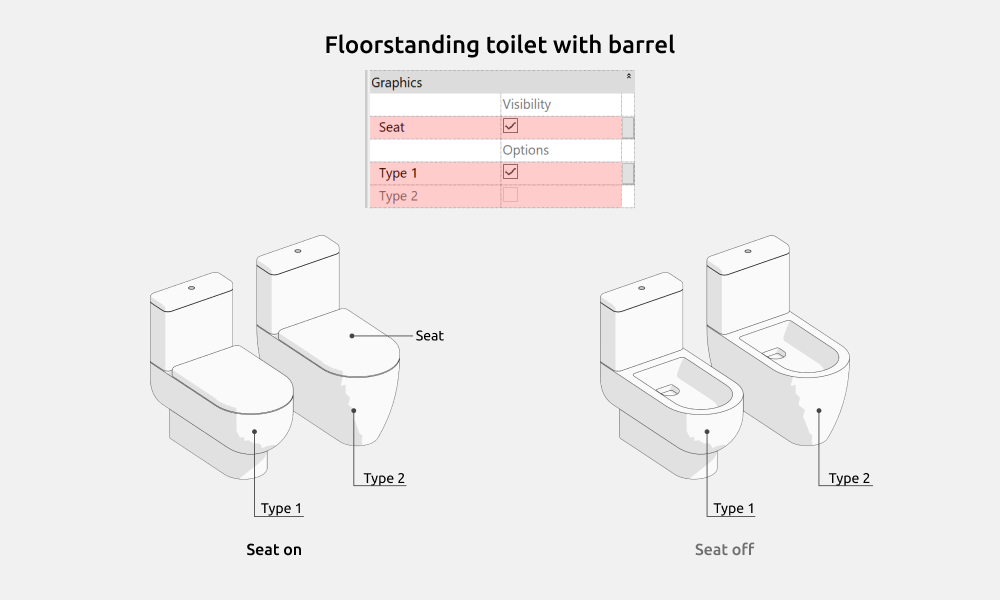

En la familia del inodoro de pie con cisterna puedes activar y desactivar estos elementos:

- Asiento con tapa (**Seat**)

Puedes elegir el tipo:

- Tipo 1 (**Type 1**)
- Tipo 2 (**Type 2**)

##### Dimensiones

**INT_Width**, **INT_Depth** e **INT_Height** controlan las medidas del inodoro.

Puedes cambiar la altura del asiento respecto al nivel de suelo acabado con **Seat height**.

#### Bidé

La familia del bidé tiene 2 tipos: bidé de pie y bidé suspendido.

En la familia del bidé puedes activar y desactivar estos elementos:

- Bastidor empotrado (**Installation**)

Puedes elegir el tipo:

- Tipo 1 (**Type 1**)
- Tipo 2 (**Type 2**)

##### Dimensiones

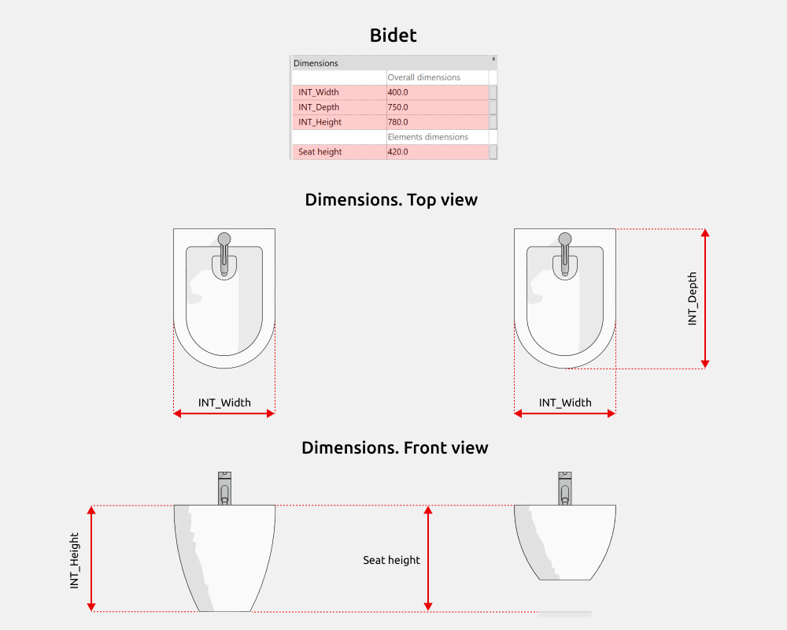

**INT_Width**, **INT_Depth** e **INT_Height** controlan las medidas generales del bidé.

Hay parámetros en gris que no se pueden editar, pero hacen falta para el cálculo de las medidas. Por ejemplo **INT_Height**, que es igual a **Seat height**.

Puedes cambiar la altura del asiento del bidé con **Seat height**.

##### Bastidor empotrado

En el bastidor puedes cambiar las medidas con **Installation width**, **Installation depth** e **Installation height**.

**Lining thickness**, separación entre el bidé y el bastidor que se cierra con placa de yeso laminado.

#### Urinario

En el urinario puedes activar y desactivar estos elementos:

- Pulsador de descarga (**Flush key**)
- Botón del pulsador de descarga (**Button on the flush key**)
- Bastidor empotrado (**Installation**)

##### Dimensiones

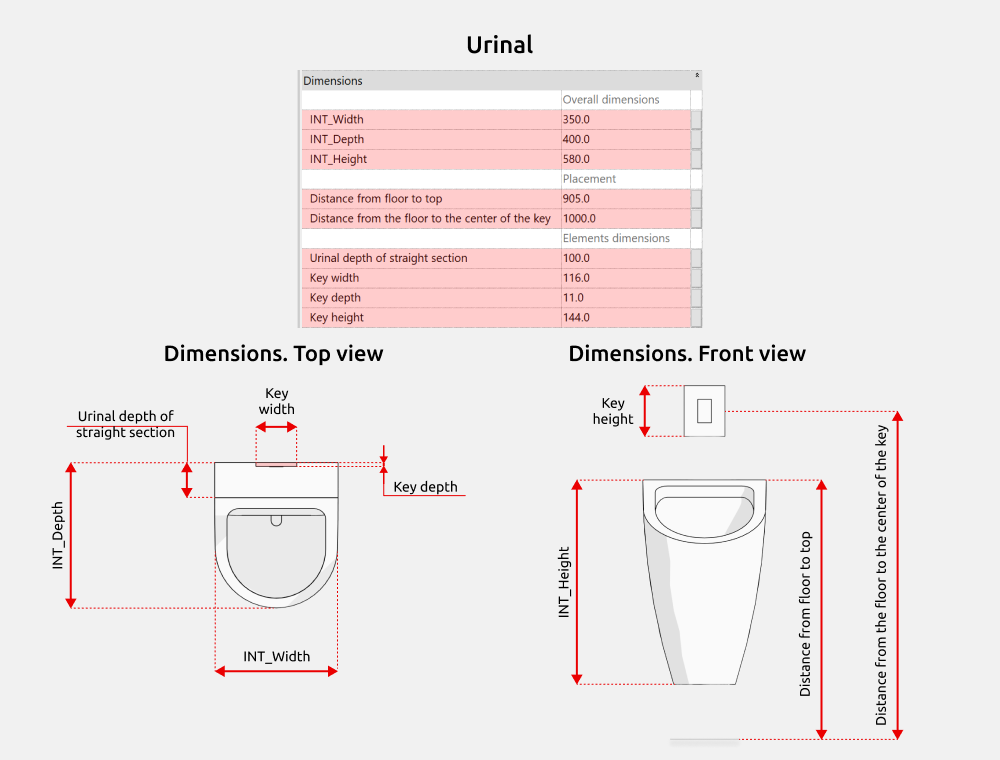

**INT_Width**, **INT_Depth** e **INT_Height** controlan las medidas generales del urinario.

Puedes cambiar el tamaño del pulsador con **Key width**, **Key depth** y **Key height**. También puedes cambiar la altura del pulsador con **Distance from the floor to the center of the key**.

**Urinal depth of straight section** cambia la distancia del tramo recto desde la pared hasta el desagüe del urinario.

**Distance from floor to top** permite indicar la altura del urinario desde el nivel de suelo acabado.

##### Bastidor empotrado

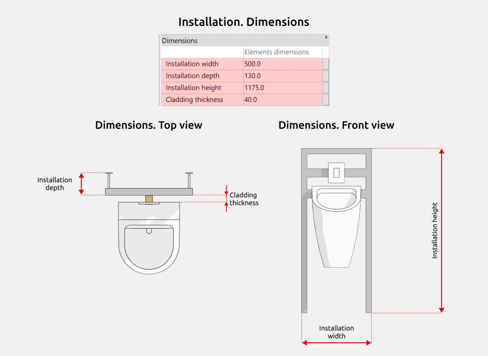

En el bastidor puedes cambiar las medidas con **Installation width**, **Installation depth** e **Installation height**.

**Cladding thickness**, separación entre el urinario y el bastidor que se cierra con placa de yeso laminado.

#### Ducha higiénica de una toma

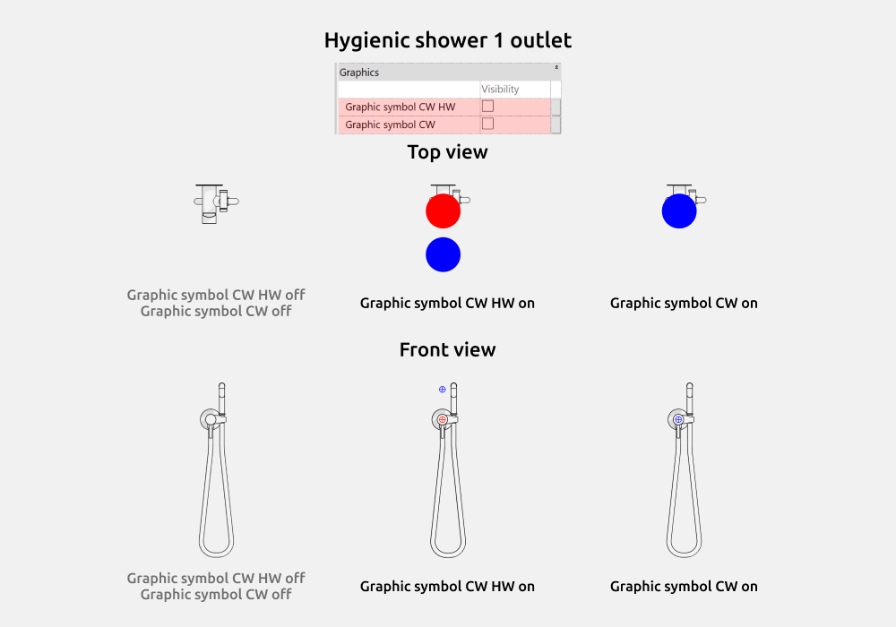

Se ha añadido la posibilidad de activar y desactivar la visibilidad del símbolo gráfico:

- Símbolo de agua fría y caliente (**Graphic symbol CW HW**)
- Símbolo de agua fría (**Graphic symbol CW**)

##### Dimensiones

La colocación en altura se hace con la herramienta de desplazamiento (**Offset**), en el grupo de restricciones.

La longitud del flexo se cambia con **Hose length**.

#### Ducha higiénica de dos tomas

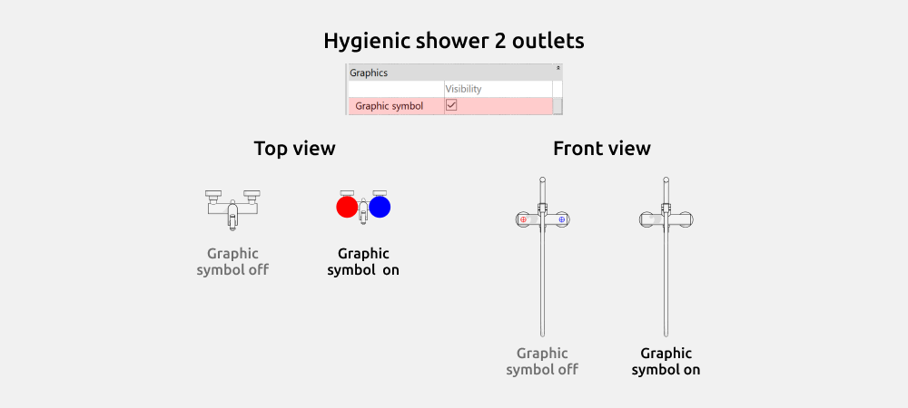

En la ducha higiénica de dos tomas puedes activar y desactivar el símbolo gráfico.

##### Dimensiones

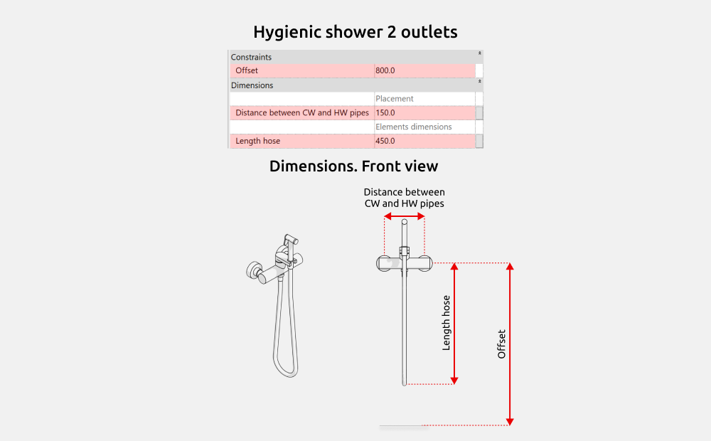

La colocación en altura se hace con la herramienta de desplazamiento (**Offset**), en el grupo de restricciones.

La longitud del flexo se cambia con **Length hose**.

Puedes cambiar la distancia entre los tubos de agua fría y de agua caliente.

#### Accesorios

#### Espejo

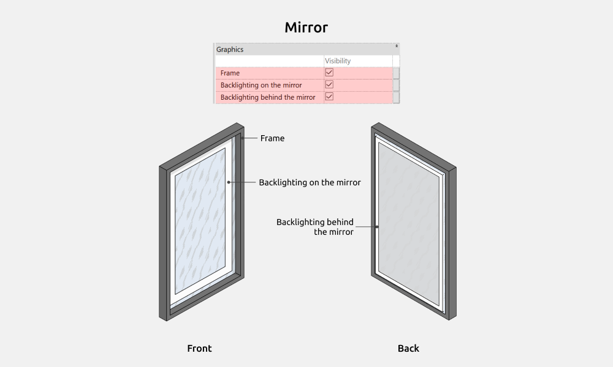

En el espejo puedes activar y desactivar estos elementos:

- Marco (**Frame**)
- Iluminación sobre el espejo (**Backlighting on the mirror**)
- Iluminación detrás del espejo (**Backlighting behind the mirror**)

##### Dimensiones

Cambian las medidas **INT_Width**, **INT_Depth** e **INT_Height**.

Puedes cambiar el tamaño de los elementos con **R frame**, en el espejo rectangular biselado, **Indentation of the backlight from the edge of the mirror**, **Width backlight line**, **Frame width** y **Frame depth**.

El espejo se coloca y se cambia de altura con la herramienta de desplazamiento (**Offset**).

##### Opciones

Puedes cambiar la forma del espejo:

- **Rectangular**
- Rectangular con bisel (**Rectangular with chamfer**)
- Redondo (**Round**)
- Ovalado (**Oval**)

#### Toallero

En todos los toalleros puedes activar y desactivar el embellecedor y cambiar su forma:

- Redondo (**Stub round**)
- Cuadrado (**Stub square**)

Puedes elegir el tipo de toallero:

- Barra simple (**Single boom**)
- Barra en U (**U-shaped boom**)
- Giratorio (**Swivel**)
- Aro (**Ring**)

En los toalleros de barra simple y de barra en U puedes cambiar la forma de la barra:

- Redonda (**Boom shape circle**)
- Cuadrada (**Boom shape square**)

En la barra en U puedes elegir el número de travesaños:

- 1 unidad (1 pc.)
- 2 unidades (2 pc.)

En el toallero giratorio puedes elegir de 1 a 4 travesaños con **Number of rungs**.

##### Dimensiones

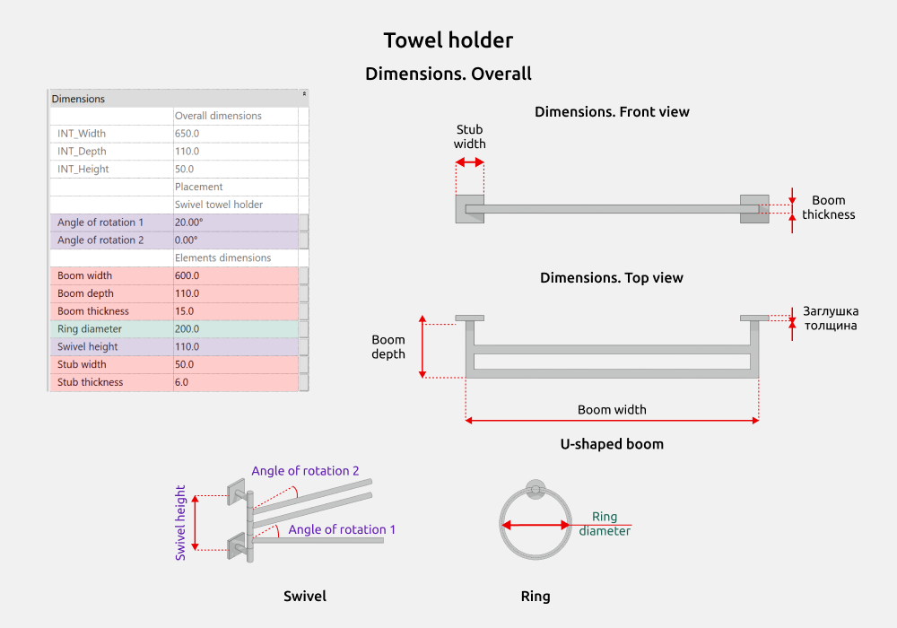

Solo en el toallero giratorio se cambian estos parámetros:

- Ángulo de giro de la primera barra desde abajo (**Angle of rotation 1**)
- Ángulo de giro de las barras siguientes (**Angle of rotation 2**)
- Altura del toallero giratorio (**Swivel height**), distancia entre los anclajes de los embellecedores

Solo en el toallero de aro se cambia:

- Diámetro del aro (**Ring diameter**)

En todos los toalleros se cambian estos parámetros:

- Ancho de la barra (**Boom width**)
- Profundidad de la barra (**Boom depth**)
- Espesor de la barra (**Boom thickness**)

En todos los toalleros con el embellecedor activado se cambian:

- Ancho del embellecedor (**Stub width**)
- Espesor del embellecedor (**Stub thickness**)

#### Perchas para toallas

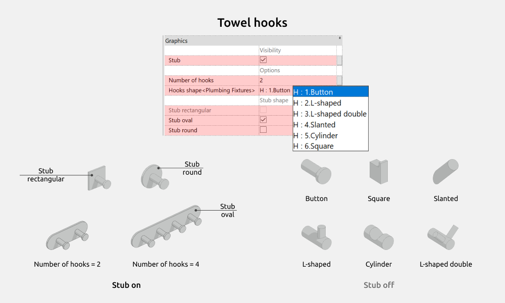

En las perchas puedes activar y desactivar el embellecedor y elegir su forma:

- Rectangular (**Stub rectangular**)
- Ovalado (**Stub oval**)
- Redondo (**Stub round**)

El número de perchas sobre una misma base se elige con **Number of hooks**.

También se indica la forma de la percha:

- 1.Botón (1.Button)
- 2.En L (2.L-shaped)
- 3.En L doble (3.L-shaped double)
- 4.Inclinada (4.Slanted)
- 5.Cilindro (5.Cylinder)
- 6.Cuadrada (6.Square)

##### Dimensiones

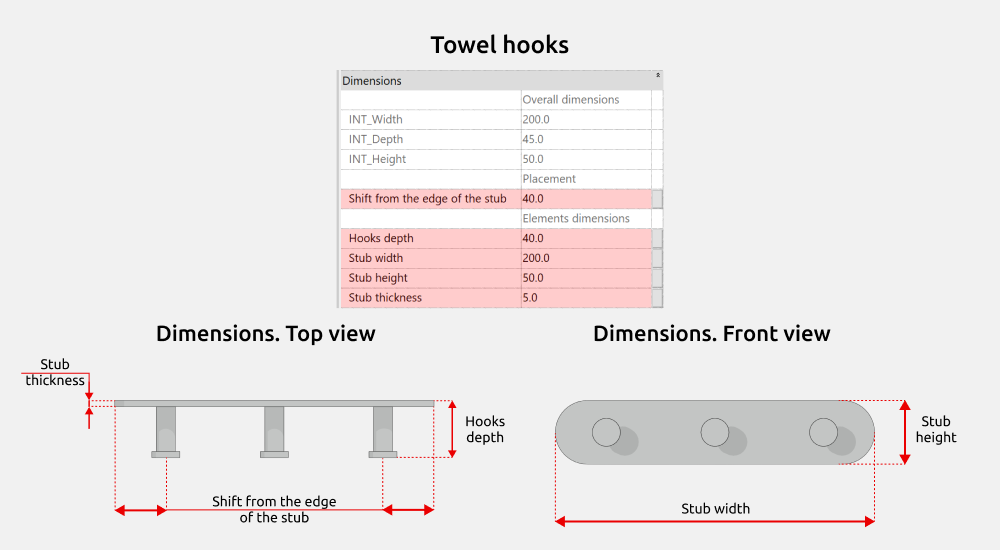

En la familia se cambian estos parámetros:

- Separación respecto al borde del embellecedor (**Shift from the edge of the stub**)
- Profundidad de las perchas (**Hooks depth**)
- Ancho del embellecedor (**Stub width**)
- Altura del embellecedor (**Stub height**)
- Espesor del embellecedor (**Stub thickness**)

#### Soporte de pie para papel y escobilla, escobilla y portarrollos

La familia de la escobilla se puede colocar tanto en la pared como en el suelo.

En las familias de la escobilla y del papel, la colocación y el cambio de altura se hacen con la herramienta de desplazamiento.

#### Baldas de baño

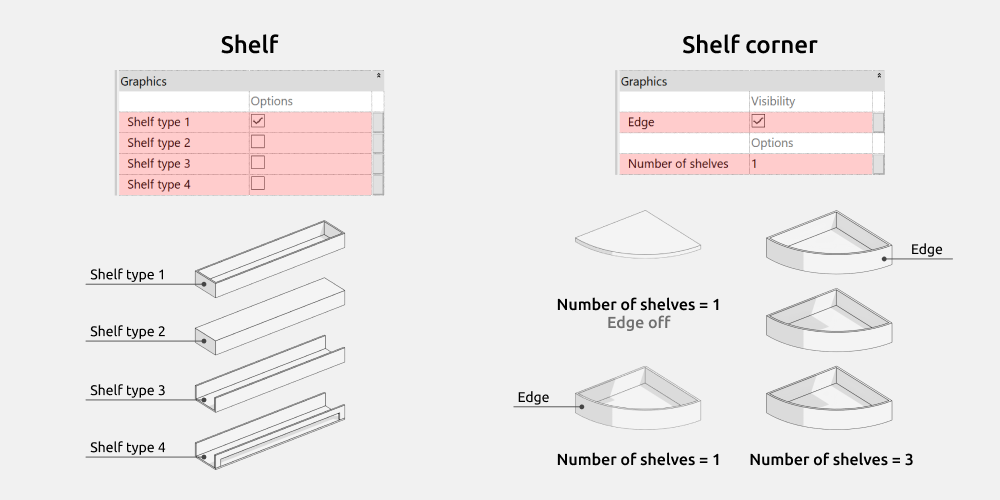

En la familia de la balda puedes elegir el tipo.

En la familia de la balda de esquina puedes activar y desactivar el borde y cambiar el número de baldas.

##### Dimensiones

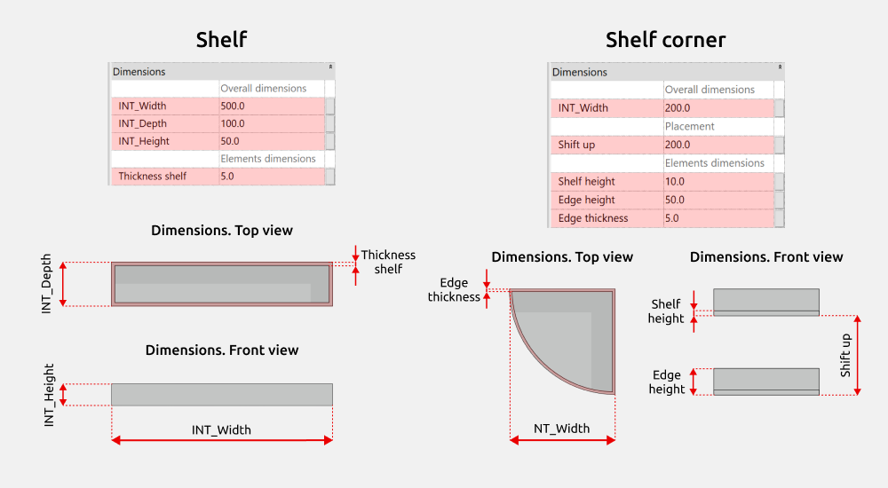

Las baldas se colocan y se cambian de altura con la herramienta de desplazamiento.

En la familia de la balda:

Cambian las medidas **INT_Width**, **INT_Depth** e **INT_Height**.

Puedes cambiar el espesor de la balda.

En la familia de la balda de esquina:

Cambia la medida **INT_Width**.

Puedes cambiar el tamaño de los elementos: la altura de la balda, la altura del borde y el espesor del borde.

### Grifos

#### Grifo

En la familia puedes activar y desactivar estos elementos:

- Llave 1 (**Valve 1**)
- Llave 2 (**Valve 2**)
- Llave 3 (**Valve 3**)
- Llave a la izquierda (**Valve left**)
- Teleducha (**Hand shower**)
- Llave sobre el grifo (**Valve on the faucet**)
- Palanca de la llave (**Lever on the valve**)
- Base (**Base**)

##### Combinaciones

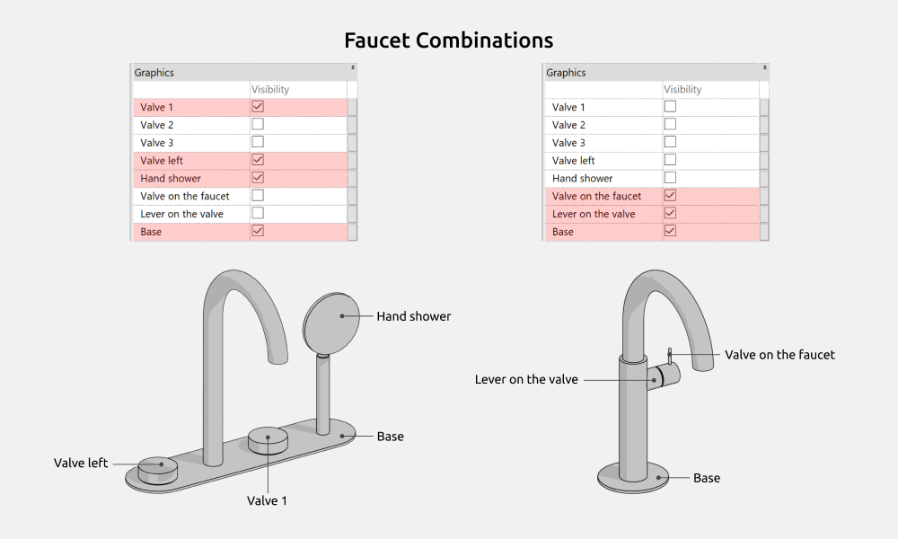

Los parámetros del grupo Graphics permiten componer con libertad el grifo y su aspecto activando y desactivando elementos sueltos de la familia.

Combinando los parámetros de visibilidad puedes formar distintos tipos de grifo dentro de una misma familia.

En la primera combinación están activados estos parámetros de visibilidad:

- Llave 1 (**Valve 1**)
- Llave a la izquierda (**Valve left**)
- Teleducha (**Hand shower**)
- Base (**Base**)

En la segunda combinación están activados estos parámetros de visibilidad:

- Llave sobre el grifo (**Valve on the faucet**)
- Palanca de la llave (**Lever on the valve**)
- Base (**Base**)

##### Dimensiones

**INT_Width**, **INT_Depth** e **INT_Height** controlan las medidas generales del grifo.

Hay parámetros en gris que no se pueden editar, pero sirven para entender el cálculo de las medidas. Por ejemplo **INT_Width**, que muestra el ancho del grifo, porque se calcula con una fórmula a partir del número de llaves, de si hay teleducha y de la distancia entre ejes.

##### Opciones

En la familia del grifo hay opciones para el caño, la teleducha, la llave sobre la base y la base.

Elección de la forma del caño:

- Caño de forma 1 (**Spout 1 shape**)
- Caño de forma 2 (**Spout 2 shape**)
- Caño de forma 3 (**Spout 3 shape**)

Con **Hand shower** activado están disponibles estas opciones.

Colocación de la teleducha:

- Sobre la base (**Hand shower on base**)
- Sobre el grifo (**Hand shower on faucet**)

Forma de la teleducha:

- Cilíndrica (**Hand shower shape cylinder**)
- Redonda (**Hand shower shape round**)
- Rectangular (**Hand shower shape rectangle**)

Con **Valve on the faucet** activado puedes elegir la forma del cuerpo del grifo:

- Monomando (**Single-lever**)
- De dos mandos en cruz (**2x cross**)

Con **Base** activado puedes elegir la forma de la base:

- Rectangular (**Base shape rectangular**)
- Ovalada (**Base shape oval**)

#### Grifo mural

En la familia puedes activar y desactivar estos elementos:

- Llave 1 (**Valve 1**)
- Llave 2 (**Valve 2**)
- Llave 3 (**Valve 3**)
- Llave a la izquierda (**Valve left**)
- Teleducha (**Hand shower**)
- Base (**Base**)

##### Dimensiones

**INT_Width**, **INT_Depth** e **INT_Height** controlan las medidas generales del grifo.

Hay parámetros en gris que no se pueden editar, pero sirven para entender el cálculo de las medidas. Por ejemplo **INT_Width**, que muestra el ancho del grifo, porque se calcula con una fórmula a partir del número de llaves, de si hay teleducha y de la distancia entre ejes.

##### Opciones

En la familia del grifo hay opciones para la teleducha, el tipo de flexo y la base.

Con **Hand shower** activado están disponibles estas opciones.

Forma de la teleducha:

- Cilíndrica (**Hand shower shape cylinder**)
- Redonda (**Hand shower shape round**)
- Rectangular (**Hand shower shape rectangle**)

Tipo de flexo:

- De bañera (**Hose type bathtub**)
- De ducha (**Hose type shower**)

Con **Base** activado puedes elegir la forma de la base:

- Rectangular (**Base shape rectangular**)
- Ovalada (**Base shape oval**)

#### Grifo clásico

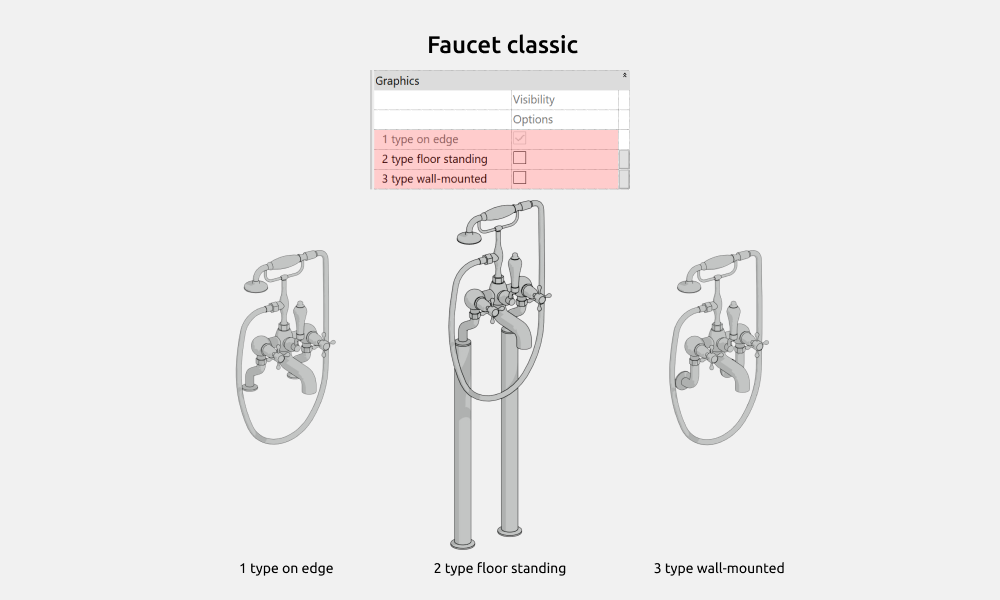

En la familia puedes elegir el tipo de grifo:

- Tipo 1 sobre el borde (**1 type on edge**)
- Tipo 2 de pie (**2 type floor standing**)
- Tipo 3 mural (**3 type wall-mounted**)

##### Dimensiones

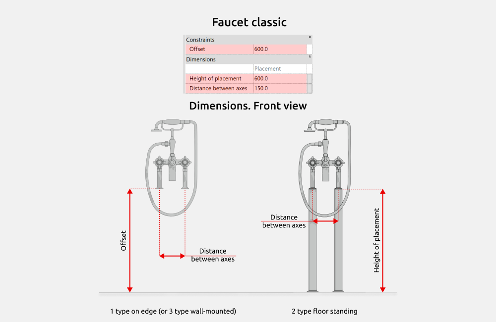

**Height of placement** solo está disponible en el grifo con **2 type floor standing** activado. En los grifos **1 type on edge** y **3 type wall-mounted** la altura se cambia con la herramienta de desplazamiento (**Offset**) dentro del proyecto de Revit.

**Distance between axes** indica la distancia entre los centros, es decir los ejes, de las llaves, y funciona en todos los tipos de grifo.

## 4. PRESENTACIÓN

### Ajustes de gráficos

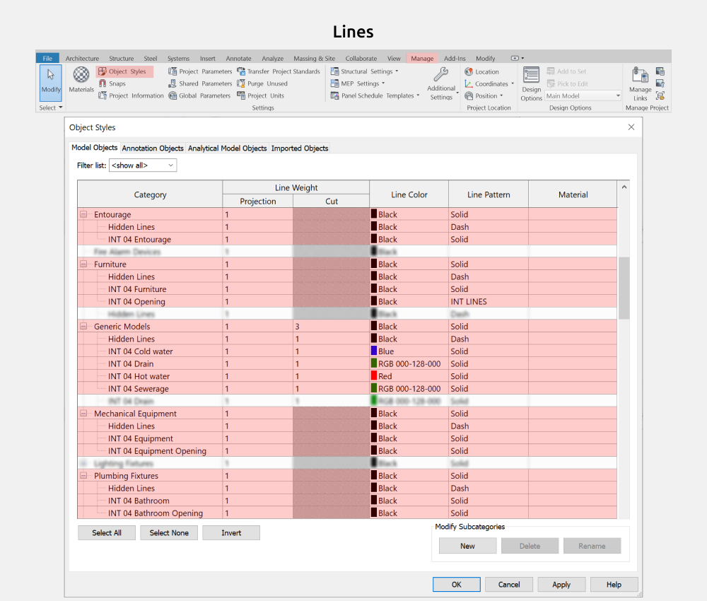

Para cambiar el color, el grosor o el tipo de línea de las familias, ve a Gestionar, Estilos de objeto, y a estas categorías:

- Entorno (Entourage)
- Mobiliario (Furniture)
- Modelos genéricos (Generic Models)
- Equipos mecánicos (Mechanical Equipment)
- Aparatos sanitarios (Plumbing Fixtures)

<CTA type="guide" />
