import productPreview from './product.png';

<ProductCard
  name="Familias de muebles de baño para Revit"
  description="Muebles de lavabo, armarios y sistemas de almacenamiento para baños, listos para colocar en tu proyecto de Revit."
  image={productPreview}
  imageAlt="Vista previa del conjunto de muebles de baño para Revit"
  buyUrl="https://bimcore.one/products/bathroom-furniture-revit-families"
  ecwidProductId="632953216"
  buyLabel="Ver el precio en la tienda"
/>

## 1. INFORMACIÓN GENERAL

- Nombre del conjunto Muebles de baño
- Versión del conjunto 1.1.0
- Versión de Revit 2019

### Descripción

Este conjunto de familias permite modelar muebles de baño en Autodesk Revit.

Puedes crear muebles con o sin lavabo, armarios suspendidos con espejo, columnas, estanterías y otras configuraciones con dimensiones exactas.

Está pensado para diseñadores de interiores y arquitectos. Las familias no tienen suficiente detalle para modelar muebles destinados a su fabricación.

### Carga y colocación

Para ver y cargar las familias, abre el proyecto de muebles de baño, copia las que necesites con Ctrl+C y pégalas en tu proyecto con Ctrl+V. También puedes abrir la carpeta de archivos de familia y arrastrarlos al proyecto.

:::note
Las imágenes y los nombres de los parámetros corresponden a la versión inglesa del conjunto. Las explicaciones están en español.
:::

## 2. CONTENIDO DEL CONJUNTO

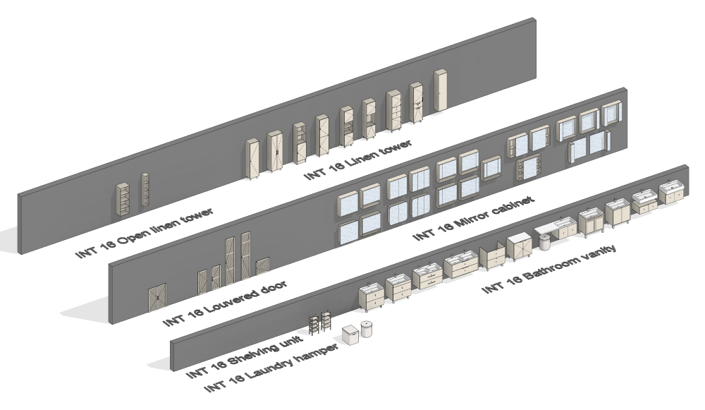

- Columna de baño (INT 16 Linen tower)
- Columna abierta (INT 16 Open linen tower)
- Puerta de lamas (INT 16 Louvered door)
- Puerta doble de lamas
- Armario con espejo (INT 16 Mirror cabinet)
- Mueble de lavabo (INT 16 Bathroom vanity)
- Estantería (INT 16 Shelving unit)
- Cesto de ropa (INT 16 Laundry hamper)

## 3. FAMILIAS

### Mueble de lavabo (Bathroom vanity)

Esta familia permite crear muebles de lavabo de distintas configuraciones.

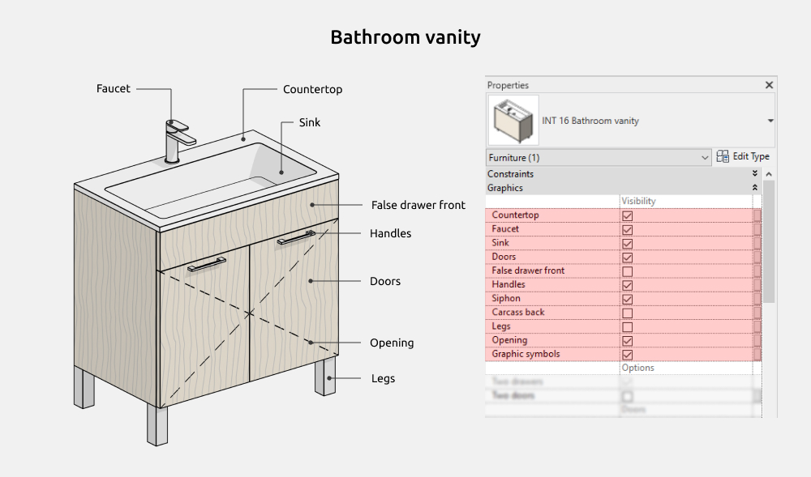

Puedes activar o desactivar estos elementos.

- Encimera (Countertop)
- Grifo (Faucet)
- Lavabo (Sink)
- Frentes (Doors)
- Falso frente de cajón (False drawer front)
- Tiradores (Handles)
- Sifón (Siphon)
- Panel trasero del cuerpo (Carcass back)
- Patas (Legs)
- Apertura (Opening)
- Símbolos gráficos (Graphic symbols)

#### Dimensiones

**Cabinet Height** es la altura del mueble e incluye las alturas de los elementos activados, como las patas, el falso frente y la encimera.

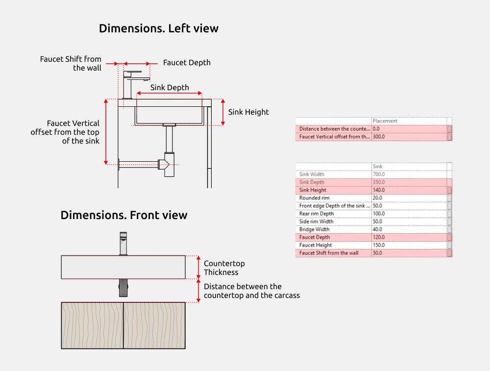

Los parámetros de dimensiones con el prefijo INT son compartidos y se pueden utilizar en las tablas de planificación.

Los tiradores recortados (Cut-out handle), de puente (Bow handle) y superpuestos (Overlay handle) permiten modificar su anchura. Los recortados y superpuestos siempre están centrados en el borde superior del frente.

**Legs Shift ↔** y **Legs Shift ↓↑** desplazan las patas hacia el centro del mueble, lateralmente y de delante hacia atrás.

#### Frentes

El mueble puede tener dos puertas o dos cajones.

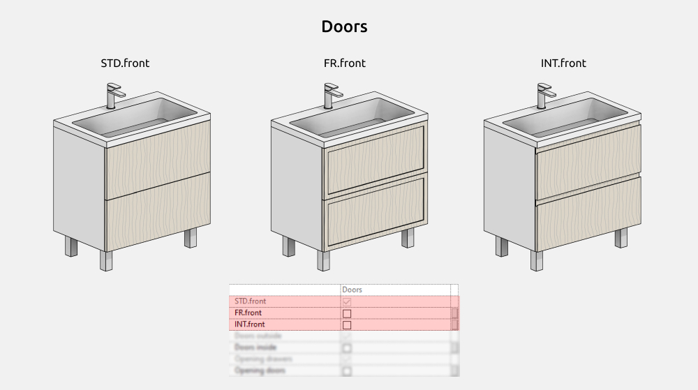

La lista de tipos de frente ofrece estas opciones.

- Frente liso (STD.front)
- Frente con marco exterior (FR.front)
- Frente con tirador integrado (INT.front)

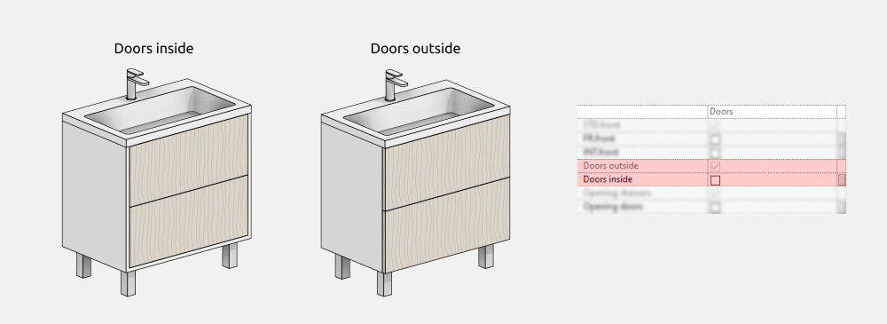

Todos los tipos de frente pueden ser remetidos o superpuestos.

Al activar **Opening**, elige un tipo de apertura que corresponda a la disposición de los frentes.

#### Tiradores

Puedes elegir estas formas.

- Pomo (Knob)
- Recorte (Cut-out handle)
- Tirador de puente (Bow handle)
- Tirador superpuesto (Overlay handle)

Si desactivas **Center placement**, los tiradores se desplazan hacia el borde superior del frente. Entonces puedes ajustar su distancia a ese borde en el apartado de dimensiones.

#### Patas

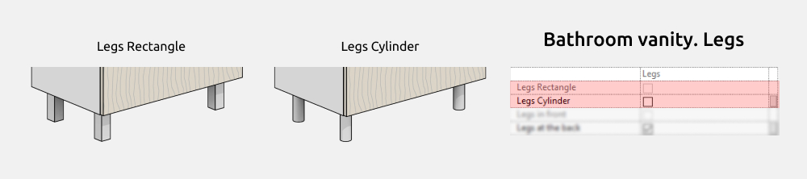

El mueble tiene patas rectangulares (Rectangle) o cilíndricas (Cylinder). Puedes desactivar todas las patas o solo las traseras.

#### Materiales

#### Ajustes gráficos

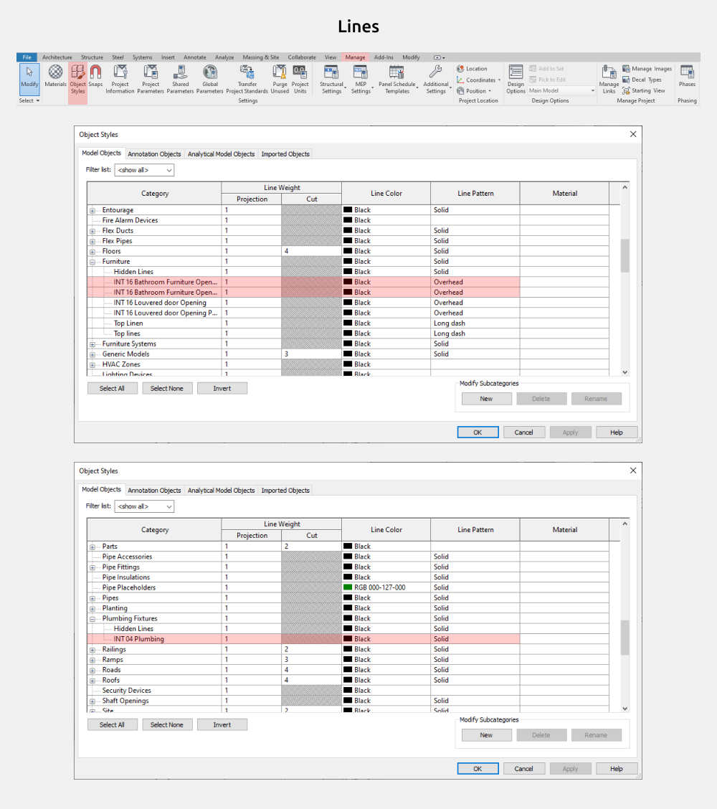

Para cambiar el color, el grosor o el patrón de las líneas, o desactivar las líneas de apertura, abre la ficha Gestionar, selecciona Estilos de objeto y busca Mobiliario o Aparatos sanitarios.

### Armario con espejo (Mirror cabinet)

Esta familia permite crear armarios suspendidos de distintas configuraciones.

Puedes activar o desactivar la sección izquierda (Section Left), la derecha (Section Right) y la balda inferior (Shelf below).

#### Dimensiones

Los parámetros de dimensiones con el prefijo INT son compartidos y se pueden utilizar en las tablas de planificación.

#### Opciones del armario

Puedes configurar el número de secciones y hacerlas iguales o ajustarlas por separado. La anchura de cada sección se configura individualmente. Las secciones laterales pueden tener un frente, dos baldas o tres baldas y se ajustan de manera independiente.

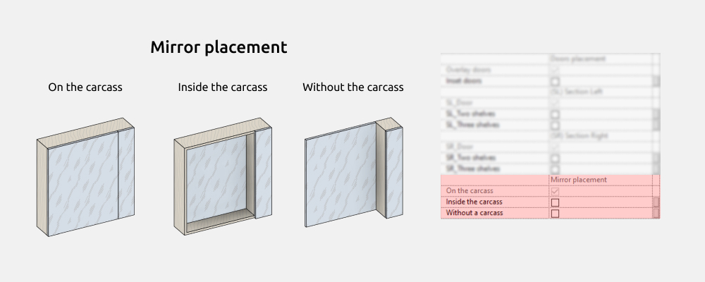

En la sección central, el espejo puede colocarse sobre el cuerpo como una puerta, dentro del cuerpo dejando una balda o directamente en la pared sin cuerpo. Esta última opción puede combinarse con una o dos secciones laterales.

#### Materiales

### Columna de baño (Linen tower)

Esta familia permite crear armarios estrechos de distintas configuraciones.

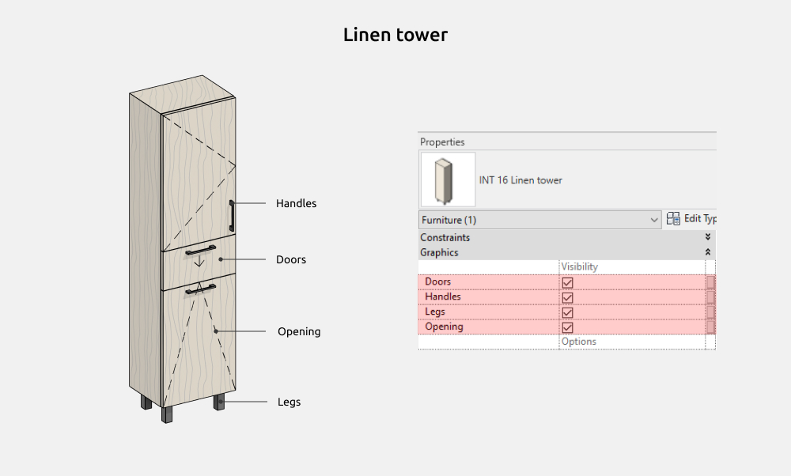

Puedes activar o desactivar los frentes (Doors), los tiradores (Handles), las patas (Legs) y la apertura (Opening).

#### Dimensiones

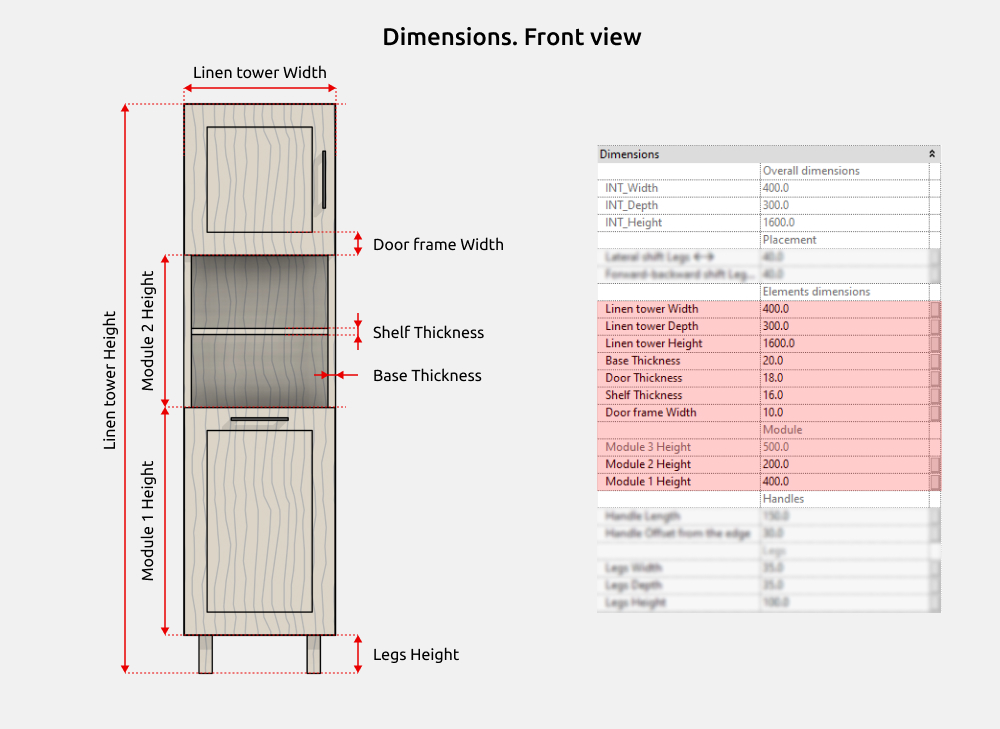

Los parámetros de dimensiones con el prefijo INT son compartidos y se pueden utilizar en las tablas de planificación.

Los tiradores de puente permiten modificar su anchura.

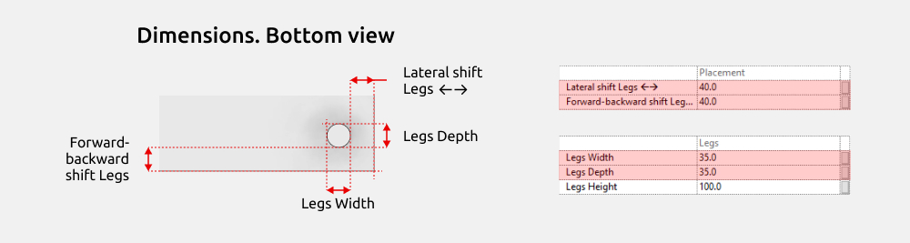

**Lateral shift Legs ↔** y **Forward-backward shift Legs** desplazan las patas hacia el centro del mueble.

#### Frentes

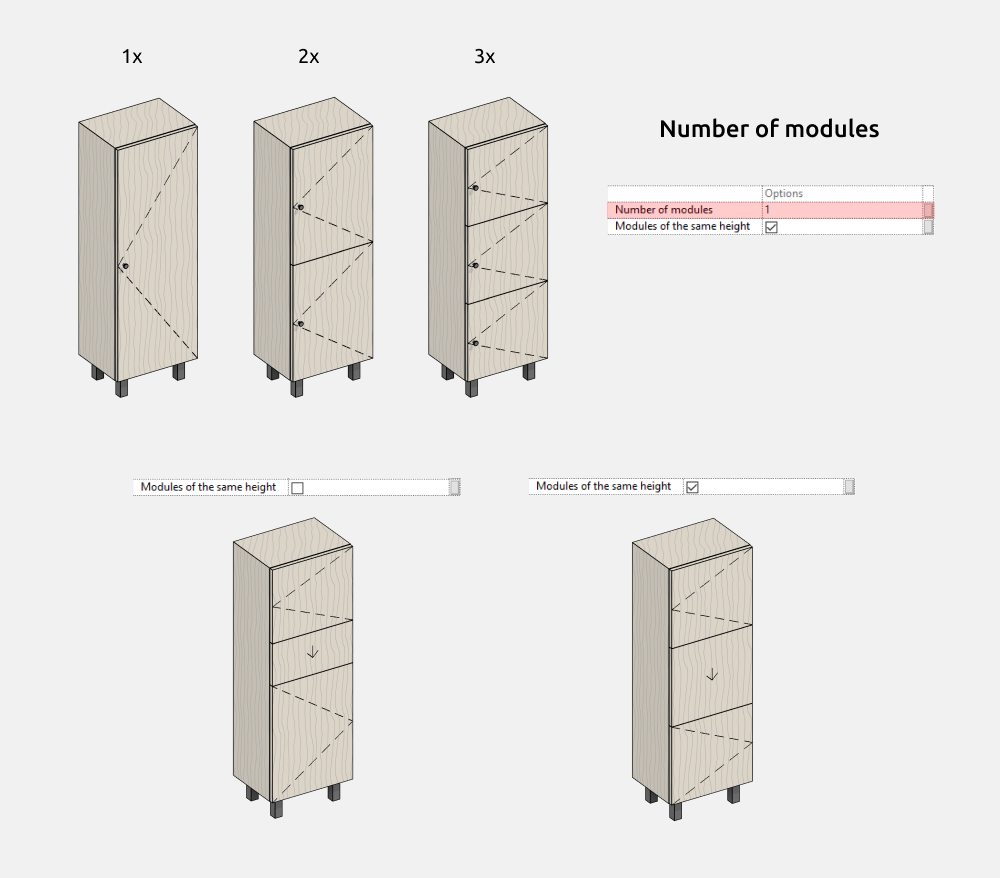

La columna puede tener entre uno y tres módulos, iguales o configurados de manera independiente. La altura de cada módulo se ajusta por separado, excepto la del módulo 3, que se calcula restando las alturas de los módulos 1 y 2 a la altura total de la columna.

La lista ofrece frentes lisos (STD.front) y frentes con marco exterior (FR.front).

Cada módulo se configura por separado.

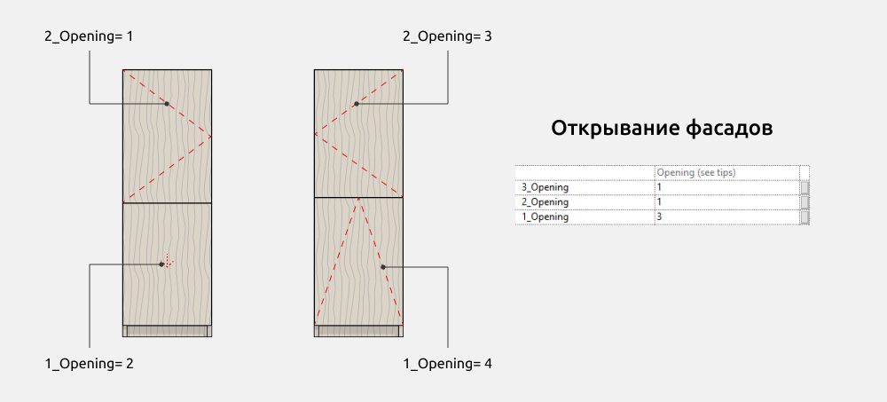

También se ajusta por separado el tipo de apertura de cada módulo.

1. Apertura a la izquierda (Left-hinged)
2. Cajón (Drawer)
3. Apertura a la derecha (Right-hinged)
4. Abatible hacia abajo (Drop-down)

#### Tiradores

La familia incluye pomos (Knob) y tiradores de puente (Bow). Los tiradores de puente se pueden orientar vertical u horizontalmente.

La posición del tirador se ajusta para cada frente. Si se utiliza un tirador de puente, también se configura su orientación.

#### Patas

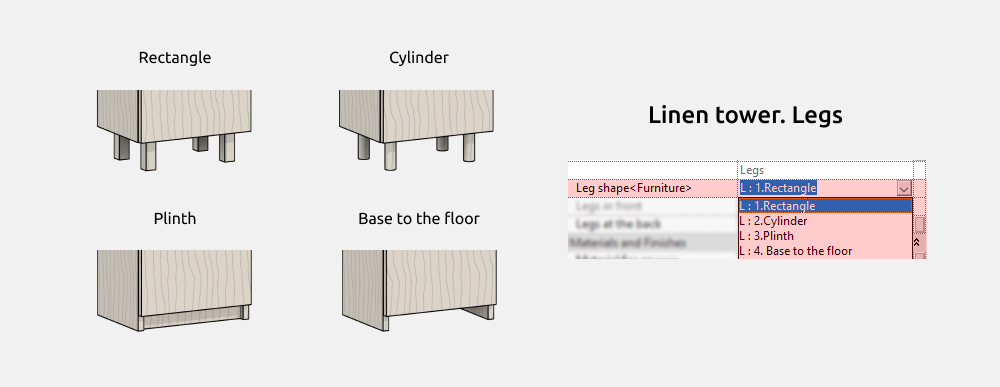

La lista de formas incluye estas opciones.

- Rectangular (Rectangle)
- Cilíndrica (Cylinder)
- Zócalo (Plinth)
- Cuerpo hasta el suelo (Base to the floor)

#### Materiales

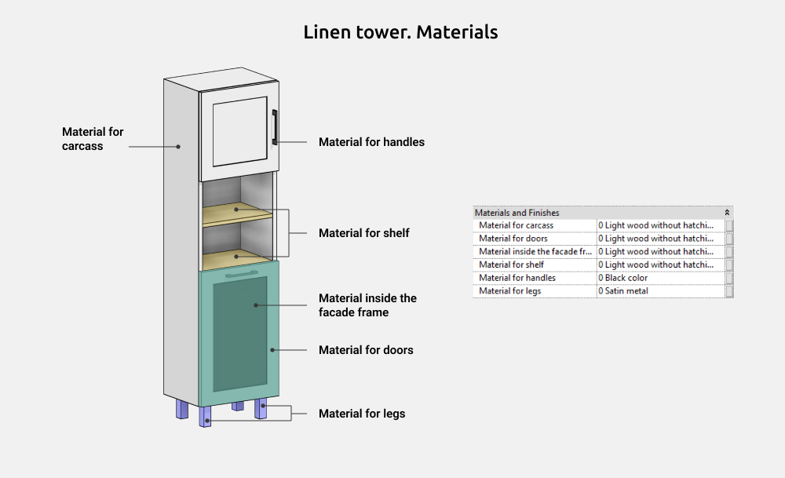

#### Ajustes gráficos

Para cambiar el color, el grosor o el patrón de las líneas, o desactivar las líneas de apertura, abre la ficha Gestionar, selecciona Estilos de objeto y busca Mobiliario.

### Puerta de lamas (Louvered door)

Esta familia permite crear puertas independientes y frentes de armario.

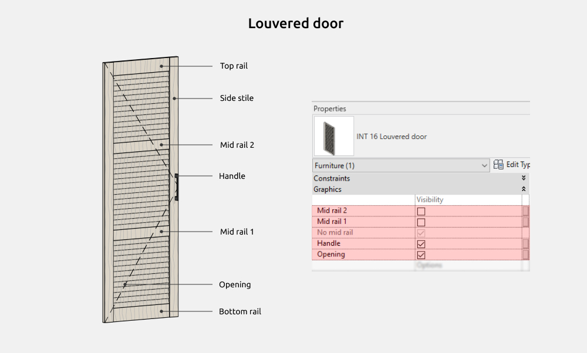

Puedes activar o desactivar el travesaño 2 (Mid rail 2), el travesaño 1 (Mid rail 1), el tirador (Handle) y la apertura (Opening).

#### Dimensiones

Los parámetros de dimensiones con el prefijo INT son compartidos y se pueden utilizar en las tablas de planificación.

#### Tiradores

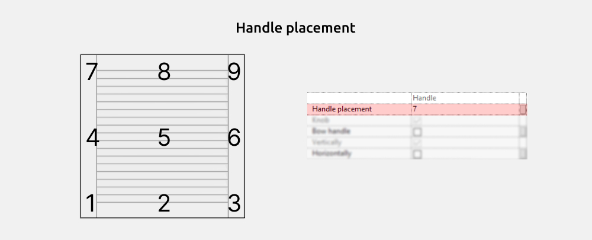

La posición del tirador se puede ajustar.

#### Ajustes gráficos

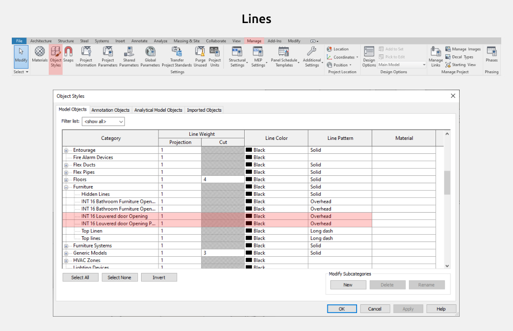

Para cambiar el color, el grosor o el patrón de las líneas, o desactivar las líneas de apertura, abre la ficha Gestionar, selecciona Estilos de objeto y busca Mobiliario.

<CTA type="guide" />
