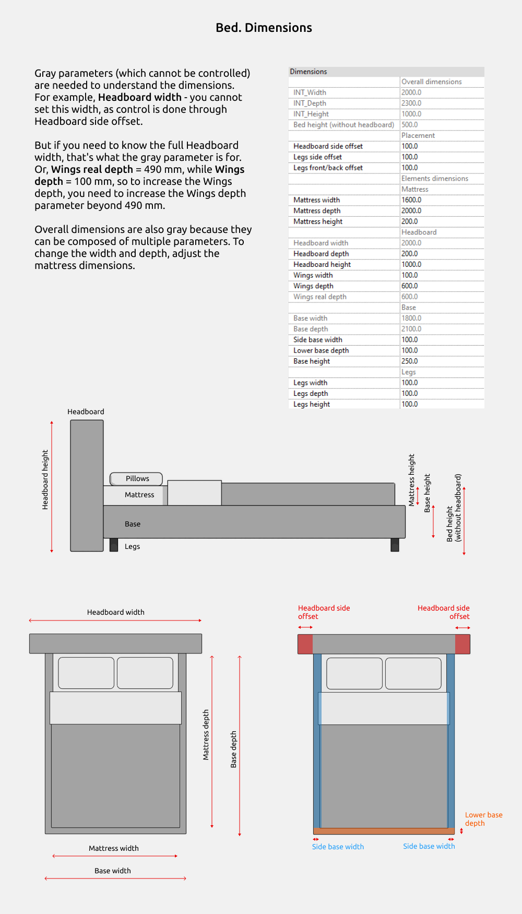
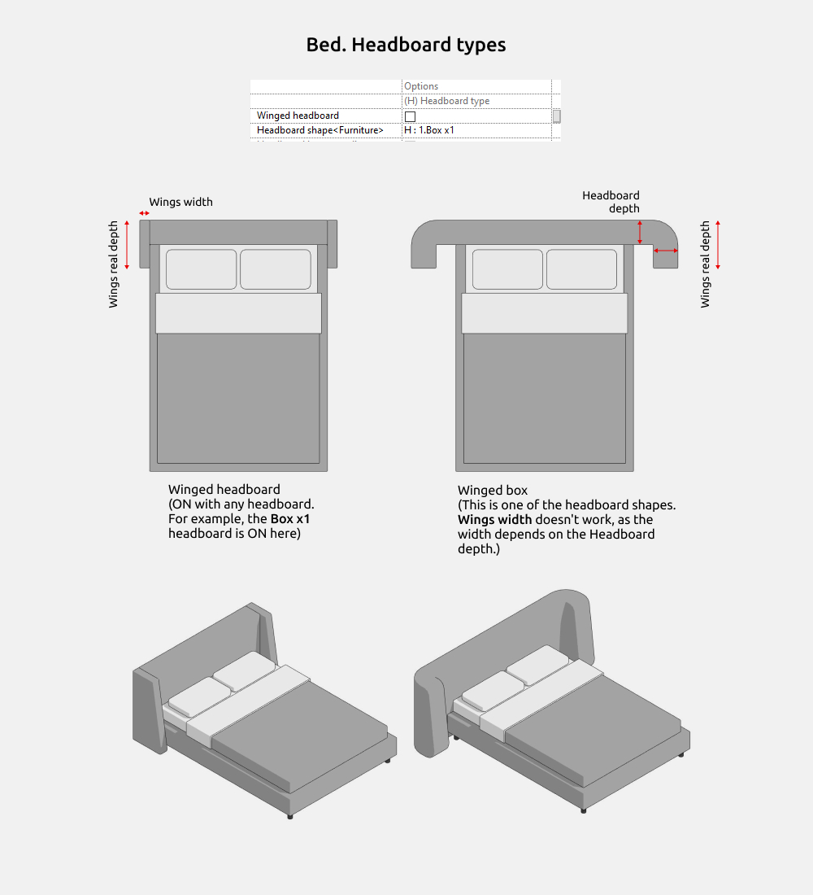
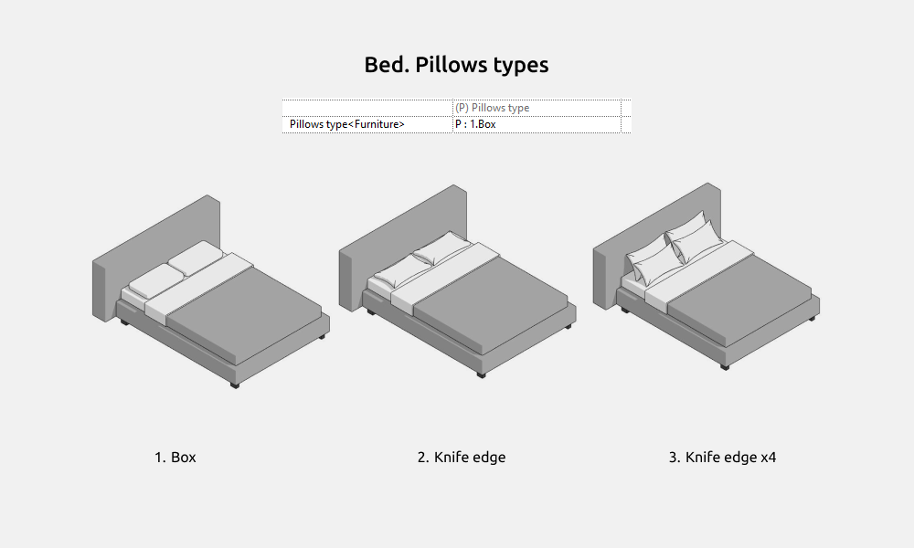
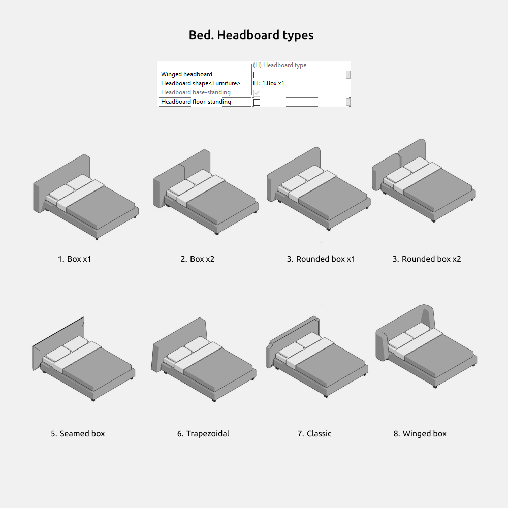
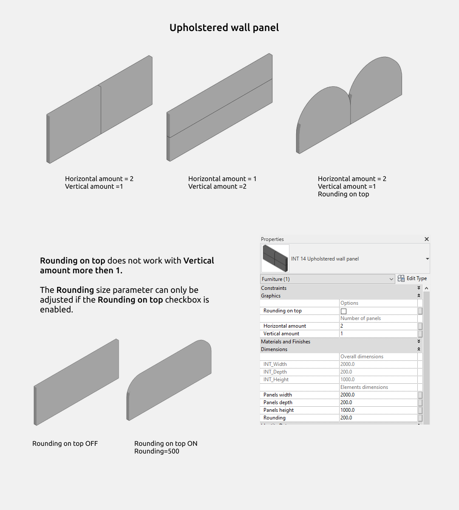
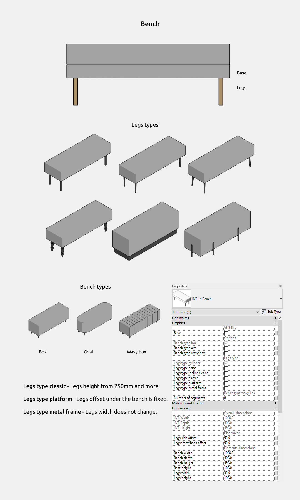
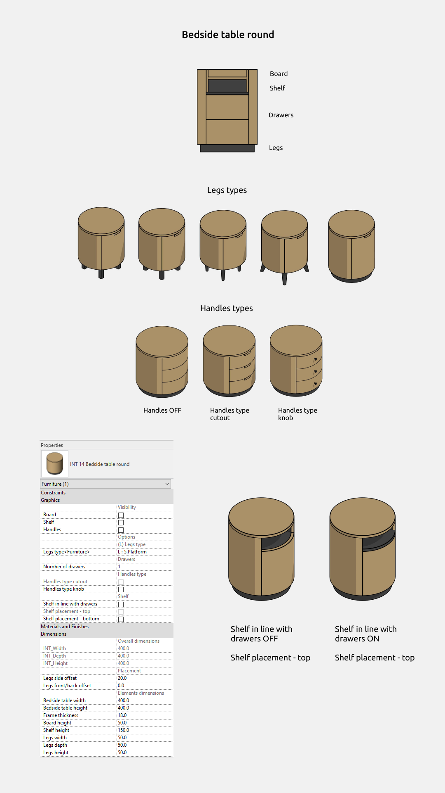

import productPreview from '@site/docs/guides/families/beds-for-revit/product.png';

<ProductCard
  name="Familias de camas para Revit"
  eyebrow="Conjunto de familias de Revit"
  description="Familia paramétrica de cama con distintas formas de cabecero, lista para colocar en tu proyecto de Revit."
  image={productPreview}
  imageAlt="Vista previa del conjunto de familias de camas para Revit"
  buyUrl="https://bimcore.one/products/bed-revit-families"
  ecwidProductId="602815169"
  buyLabel="Comprar"
  shopLabel="Ir a la tienda"
/>

## 1. INFORMACIÓN GENERAL

- Nombre del conjunto Camas
- Versión del conjunto 1.0.0
- Versión de Revit 2019

### Descripción

Este conjunto de familias permite modelar camas, mesitas de noche, bancos y paneles de pared tapizados en Autodesk Revit.

Con estas familias puedes diseñar el interior de un dormitorio.

Está pensado para diseñadores de interiores y arquitectos. La geometría de las camas está simplificada y se ha creado con las herramientas de Revit.

### Carga y colocación

Para ver y cargar las familias del conjunto, abre el proyecto con las camas, copia las que necesites con Ctrl+C y pégalas en tu proyecto con Ctrl+V. También puedes abrir la carpeta de archivos de familia y arrastrarlos al proyecto.

:::note
Las imágenes y los nombres de los parámetros corresponden a la versión inglesa del conjunto. Las explicaciones están en español.
:::

## 2. CONTENIDO DEL CONJUNTO

El conjunto incluye las siguientes familias de la categoría **Mobiliario**.

- Cama (INT Bed)
- Panel de pared tapizado (INT Upholstered wall panel)
- Banco tapizado (INT Bench)
- Mesita de noche rectangular (INT Bedside table rectangular)
- Mesita de noche redonda (INT Bedside table round)

En la categoría Entourage se incluyen los siguientes objetos decorativos.

- Jarra (Decanter)
- Jarrón en forma de U (Vase arch-form)
- Difusor de aromas (Diffuser)
- Bandeja (Tray)
- Vaso (Glass)
- Teléfono (Phone)

## 3. FAMILIAS

### Cama

En la familia de cama puedes activar o desactivar el cabecero y las patas.

El cabecero dispone de las opciones **Headboard base-standing**, que lo prolonga hasta la base de la cama, e **Headboard floor-standing**, que lo prolonga hasta el suelo.

**Dimensiones**

Los parámetros que aparecen en gris no se pueden editar, pero permiten consultar las dimensiones calculadas. Por ejemplo, **Headboard width** indica el ancho total del cabecero. Ese ancho se controla mediante **Headboard side offset**, que ajusta cuánto sobresale el cabecero por los lados.

Si **Wings real depth**, la profundidad real de las alas laterales, es de 490 mm y **Wings depth** vale 100 mm, tendrás que introducir un valor superior a 490 mm en este último parámetro para aumentar la profundidad de las alas.

Las dimensiones totales también aparecen en gris porque pueden ser el resultado de varias medidas. Para modificar el ancho y el fondo de la cama, cambia las dimensiones del colchón.

El parámetro **Winged headboard** permite activar las alas laterales con cualquier forma de cabecero. Por ejemplo, en la imagen de arriba está seleccionada la forma rectangular (Box x1).

En la forma de cabecero rectangular con alas (Winged box), el parámetro **Wings width** no tiene efecto porque el ancho total de esta forma depende del valor de **Headboard depth**.

La base de la cama puede tener las siguientes formas.

- Rectangular (Base box)
- Rectangular con esquinas redondeadas (Base rounded box). El radio de redondeo corresponde a **Side base width** o **Lower base depth**.
- Bloques (Base cubes)

Las opciones de forma y cantidad de almohadas son las siguientes.

- Rectangular (Box)
- Con bordes salientes (Knife edge)
- Con bordes salientes, cuatro unidades (Knife edge x4)

Las opciones de forma y cantidad de elementos del cabecero son las siguientes.

- Rectangular, una unidad (Box x1)
- Rectangular, dos unidades (Box x2)
- Rectangular con esquinas redondeadas, una unidad (Rounded box x1)
- Rectangular con esquinas redondeadas, dos unidades (Rounded box x2)
- Rectangular con costura (Seamed box)
- Trapezoidal (Trapezoidal)
- Clásico (Classic)
- Rectangular con alas (Winged box)

### Panel de pared tapizado

La familia de panel de pared tapizado puede utilizarse como cabecero de cama o como revestimiento decorativo de una pared.

**Rounding on top**, el redondeo superior, no funciona si **Vertical amount**, la cantidad de paneles en altura, es mayor que 1.

El parámetro de dimensiones **Rounding size** solo se puede ajustar cuando está activada la casilla **Rounding on top**.

### Banco tapizado

El banco puede tener las siguientes formas.

- Rectangular (Box)
- Ovalada (Oval)
- Rectangular con relieve acanalado (Wavy box)

Las patas pueden tener las siguientes formas.

- Cilíndricas (Legs type cylinder)
- Cónicas (Legs type cone)
- Cónicas inclinadas (Legs type inclined cone)
- Clásicas (Legs type classic)
- Plataforma (Legs type platform)
- Estructura metálica (Legs type metal frame)

Las patas de forma clásica requieren una altura de 250 mm o más.

Con la opción de plataforma, el desplazamiento de las patas bajo el banco es fijo.

Con la opción de estructura metálica, el ancho de las patas no se puede modificar.

### Mesita de noche rectangular

### Mesita de noche redonda

### Objetos decorativos

Este grupo de familias pertenece a la categoría Entourage y sirve para decorar el interior.

<CTA type="guide" />
