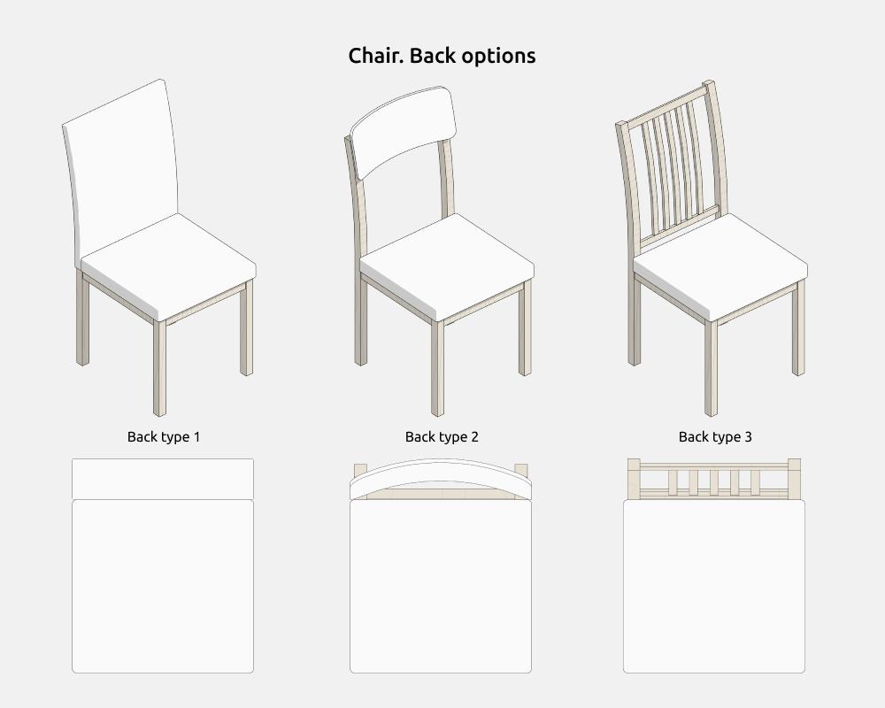
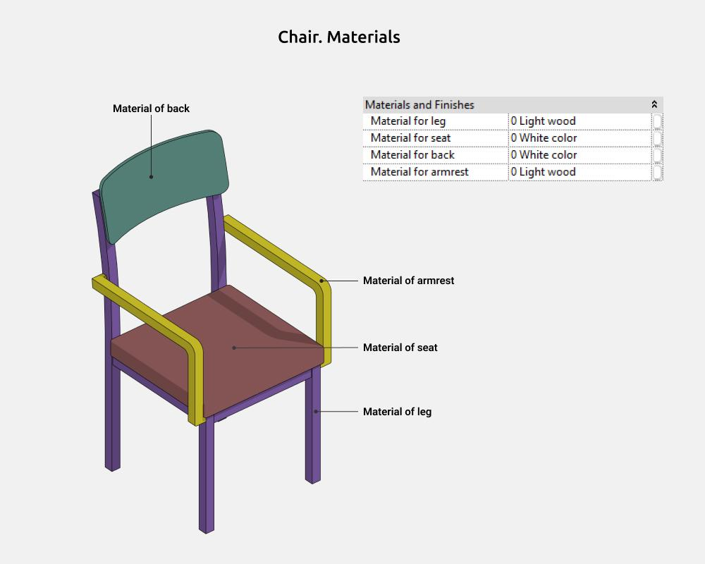
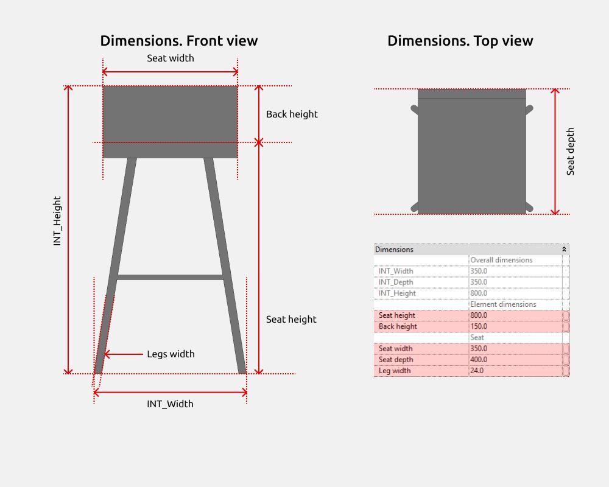
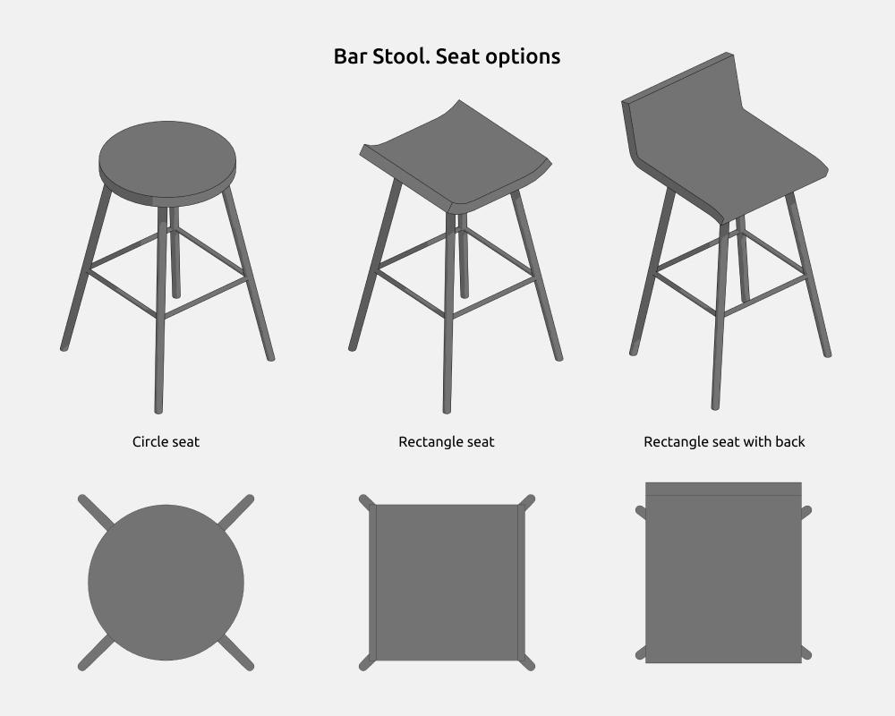

import productPreview from '@site/docs/guides/families/chairs-for-revit/product.jpg';

<ProductCard
  name="Familias de sillas para Revit"
  eyebrow="Conjunto de familias de Revit"
  description="Una colección de sillas de distintos estilos, listas para colocar en tu proyecto de Revit."
  image={productPreview}
  imageAlt="Vista previa del conjunto de sillas para Revit"
  buyUrl="https://bimcore.one/products/chair-revit-families"
  ecwidProductId="582492458"
  buyLabel="Comprar"
  shopLabel="Ir a la tienda"
/>

## 1. INFORMACIÓN GENERAL

- Nombre del conjunto Sillas
- Versión del conjunto 1.0.0
- Versión de Revit 2019

### Descripción

Este conjunto de familias permite modelar sillas en Autodesk Revit.

Con estas familias puedes crear sillas y taburetes de bar de formas y tipos básicos, además de modelos de diseño conocidos.

Está pensado para diseñadores de interiores y arquitectos. Las familias no tienen suficiente detalle para modelar sillas destinadas a su fabricación.

### Carga y colocación

Para ver y cargar las familias del conjunto, abre el proyecto de sillas, copia las que necesites con Ctrl+C y pégalas en tu proyecto con Ctrl+V. También puedes abrir la carpeta de archivos de familia y arrastrarlos al proyecto.

:::note
Las imágenes y los nombres de los parámetros corresponden a la versión inglesa del conjunto. Las explicaciones están en español.
:::

## 2. CONTENIDO DEL CONJUNTO

El conjunto incluye estas familias paramétricas.

- Silla (Chair)
- Taburete de bar (Bar Stool)

También incluye las siguientes sillas de diseño.

- Silla Beetle (Chair Beetle)
- Silla Cesca B32 (Chair Cesca B32)
- Silla Delo Нра (Chair Delo Нра)
- Silla Delo Тру (Chair Delo Тру)
- Silla Poliform (Chair Poliform)
- Silla T-chair (Chair T-chair)
- Silla Wishbone (Chair Wishbone)
- Silla Wooden (Chair Wooden)
- Silla plegable (Chair Foldable)

## 3. FAMILIAS

### Silla (Chair)

La familia Chair permite crear las formas y los tipos básicos de sillas.

Puedes activar o desactivar los siguientes elementos.

- Reposabrazos (Armrests)
- Travesaños (Aprons), las piezas horizontales que unen las patas alrededor del asiento
- Respaldo de tipo 1 (Back type 1)
- Respaldo de tipo 2 (Back type 2)
- Respaldo de tipo 3 (Back type 3)
- Asiento rectangular (Seat shape rectangle)
- Asiento trapezoidal (Seat shape trapezoid)
- Asiento tapizado (Soft seat)
- Asiento rígido (Hard seat)

#### Dimensiones

**INT_Height** indica la altura total de la silla. Se obtiene sumando los parámetros **Back height** y **Seat height**, que permiten ajustar la altura del respaldo y la del asiento.

#### Opciones del respaldo

Hay tres tipos de respaldo, correspondientes a las variantes más habituales.

Puedes activar el tipo 2 o el tipo 3. Si ambos están desactivados, se muestra el tipo 1.

#### Materiales

### Taburete de bar (Bar Stool)

La familia Bar Stool permite crear las formas y los tipos básicos de taburetes de bar.

Puedes activar o desactivar los siguientes elementos.

- Asiento circular (Seat shape circle)
- Asiento rectangular (Seat shape rectangle)
- Asiento rectangular con respaldo (Seat shape rectangle + Back)
- Cuatro patas (Four legs)
- Una pata (One leg)

#### Dimensiones

**INT_Height** indica la altura total del taburete. Se obtiene sumando los parámetros **Back height** y **Seat height**, que puedes ajustar.

#### Opciones del asiento

Hay tres tipos de asiento, correspondientes a las variantes más habituales.

Puedes activar el asiento rectangular o el rectangular con respaldo. Si ambos están desactivados, el asiento es circular.

#### Materiales

### Sillas de diseño

Las familias del grupo de sillas de diseño permiten modelar diseños de sillas existentes.

El ajuste de dimensiones y de la visibilidad de elementos, como los reposabrazos y el respaldo, sigue una lógica similar a la de las familias principales Chair y Bar Stool.

<CTA type="guide" />
