import productPreview from './product.png';

<ProductCard
  name="Familias de cortinas y persianas para Revit"
  eyebrow="Conjunto de familias de Revit"
  description="Cortinas, persianas y visillos para vestir las ventanas de tu proyecto de Revit."
  image={productPreview}
  imageAlt="Vista previa del conjunto de cortinas y persianas para Revit"
  buyUrl="https://bimcore.one/products/surtains-and-blinds-revit-families"
  ecwidProductId="759002618"
  buyLabel="Comprar"
  shopLabel="Ir a la tienda"
/>

:::note
Las imágenes y los nombres de los parámetros corresponden a la versión inglesa del conjunto. Las explicaciones están en español.
:::

## 1. INFORMACIÓN GENERAL

- Nombre del conjunto Cortinas y persianas
- Versión del conjunto 1.0.1
- Versión de Revit 2019

### Descripción

Este conjunto de familias permite representar distintas soluciones para vestir ventanas en proyectos de arquitectura e interiorismo. Incluye parámetros para ajustar el aspecto, la colocación, las dimensiones y los materiales de las cortinas y persianas.

### Carga y colocación

Para ver y cargar las familias, abre el proyecto del conjunto de cortinas y persianas, copia las que necesites con Ctrl+C y pégalas en tu proyecto con Ctrl+V. También puedes abrir la carpeta de archivos de familia y arrastrarlos al proyecto.

## 2. CONTENIDO DEL CONJUNTO

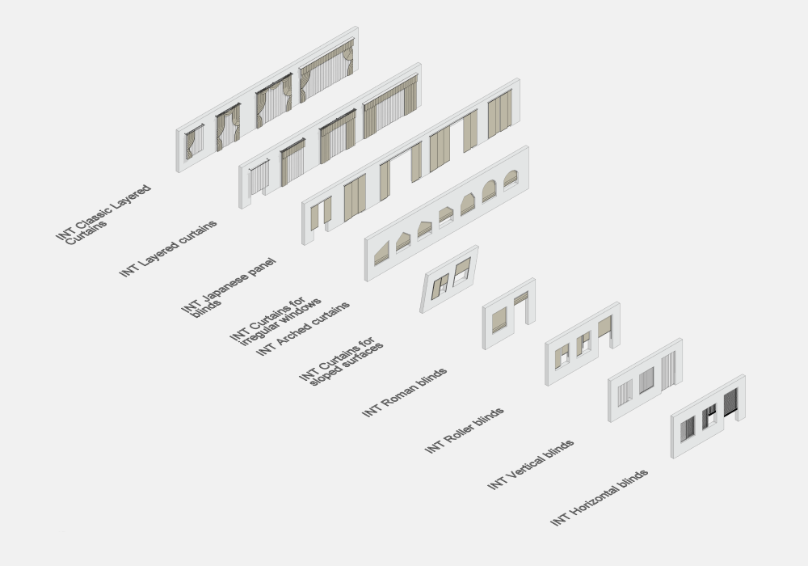

El conjunto incluye las siguientes familias de la categoría Mobiliario.

- Paneles japoneses (Japanese panel blinds)
- Cortinas superpuestas (Layered curtains)
- Cortinas clásicas superpuestas (Classic layered curtains)
- Persianas venecianas (Horizontal Blinds)
- Persianas de lamas verticales (Vertical blinds)
- Estores enrollables (Roller blinds)
- Estores plegables (Roman blinds)
- Cortinas para superficies inclinadas (Curtains for sloped surfaces)
- Cortinas para ventanas irregulares (Curtains for irregular windows)
- Cortinas en arco (Arched curtains)

## 3. FAMILIAS

### Colocación de cortinas y persianas

El parámetro **Mounting height from floor**, presente en la mayoría de las familias del conjunto, mide la distancia desde el suelo hasta el punto más alto de la cortina o persiana.

### Paneles japoneses

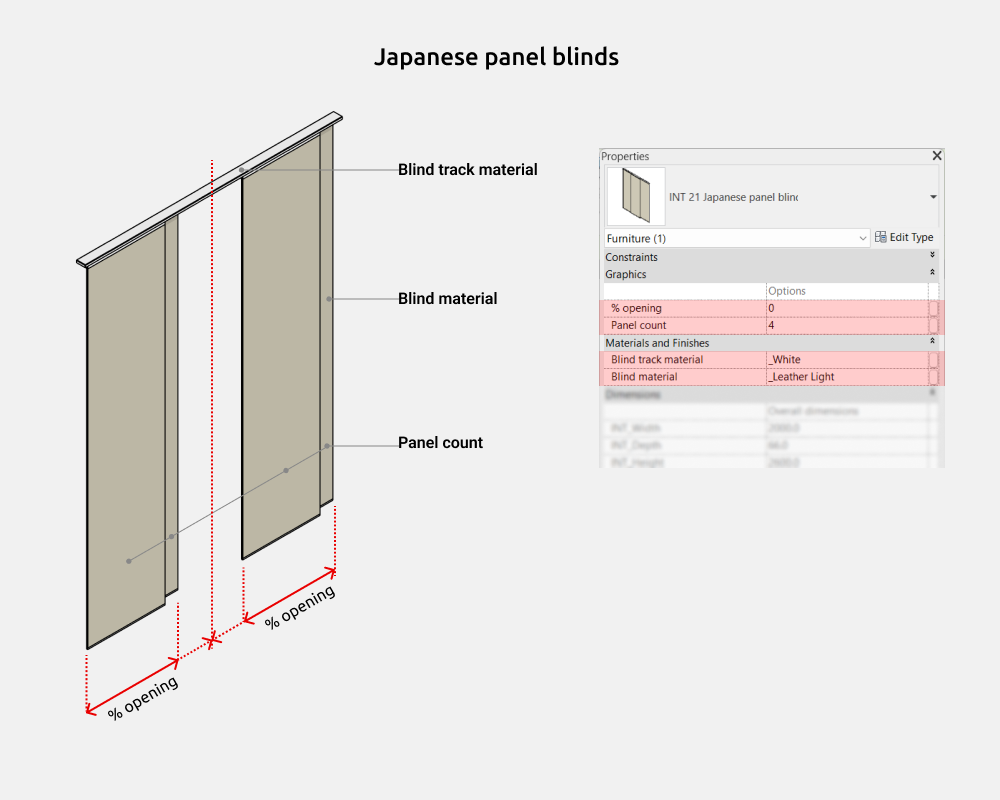

Puedes ajustar el porcentaje de apertura (**% opening**) y el número de paneles (**Panel count**).

El porcentaje de apertura aparece en muchas familias del conjunto. Controla cuánto se abren o cierran, sin modificar los parámetros de dimensiones de sus elementos.

Introduce un número en **Panel count** para cambiar la cantidad de paneles.

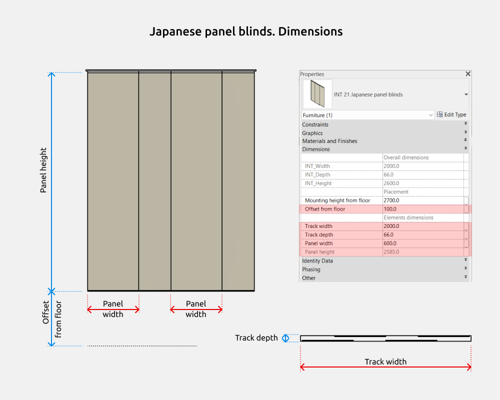

**Offset from floor** mide la distancia desde el suelo hasta el punto más bajo de la familia y aparece en muchas familias del conjunto.

La altura del carril (**Track height**) tiene un valor fijo de 15 mm. **Track width** y **Track depth** definen las dimensiones generales. **Panel width** y **Panel height** corresponden a un solo panel.

Los parámetros que aparecen en gris no se pueden modificar directamente, pero permiten entender el cálculo de dimensiones. Por ejemplo, **Panel height** descuenta la altura del carril y muestra la altura del tejido del panel.

### Cortinas superpuestas

Puedes activar o desactivar estos elementos.

- Visillo (**Sheer curtain**)
- Cortinas (**Curtains**)
- Galería textil (**Valance**)

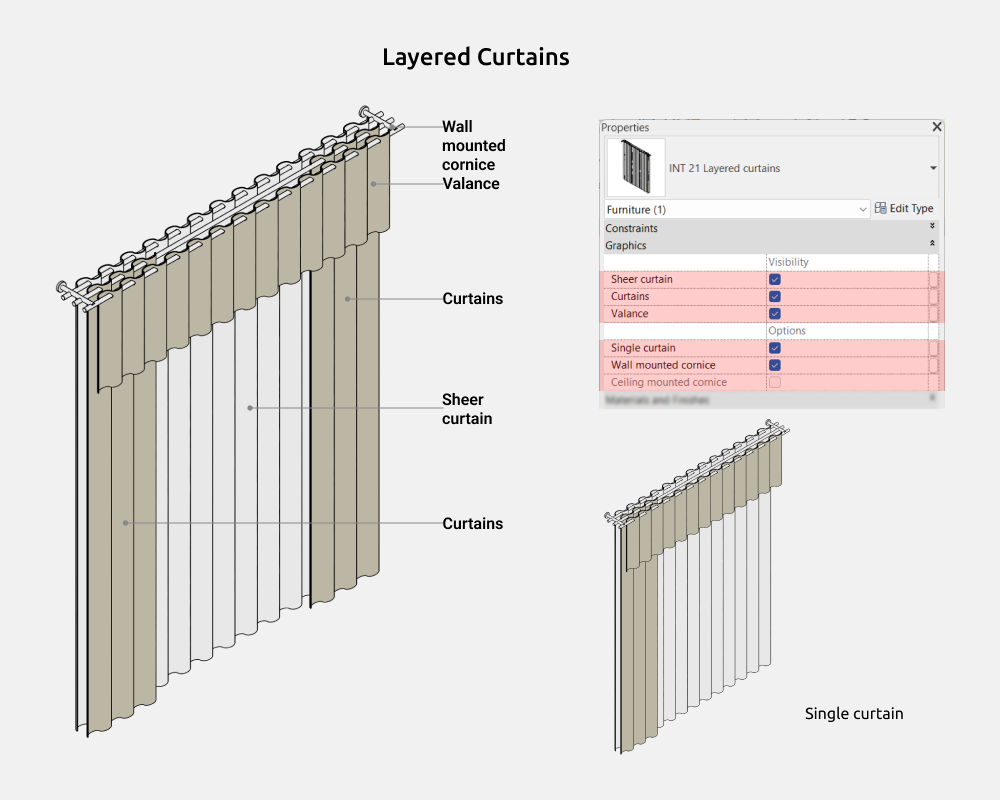

**Single curtain** desactiva la cortina de la derecha.

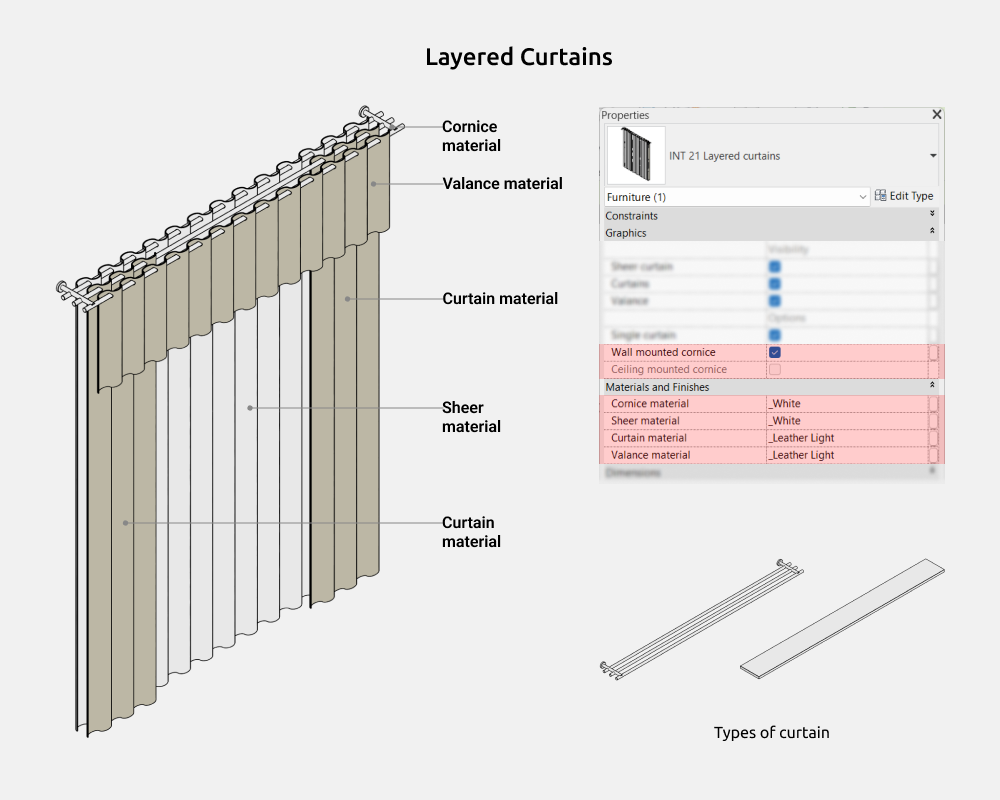

Hay dos tipos de montaje del cortinero.

- A pared (**Wall mounted cornice**). Se fija a una superficie vertical y queda separado del techo.
- A techo (**Ceiling mounted cornice**). Se fija directamente al techo y permite una instalación oculta o integrada.

Puedes ajustar el aspecto mediante los parámetros de materiales.

- Material del cortinero (**Cornice material**)
- Material del visillo (**Sheer material**)
- Material de la cortina (**Curtain material**)
- Material de la galería (**Valance material**)

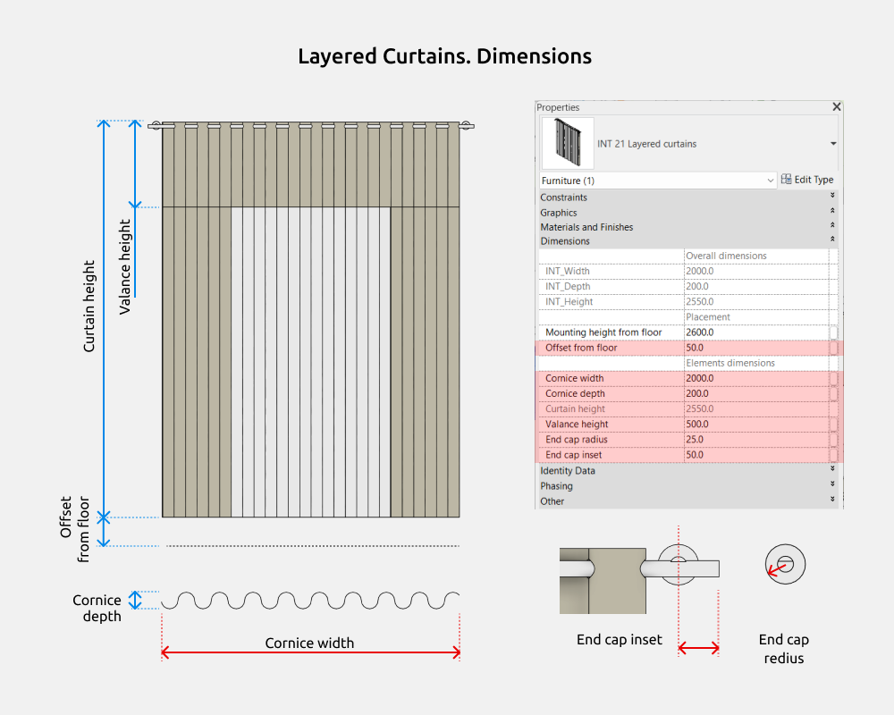

**Offset from floor** mide la separación entre el suelo y el punto más bajo de la familia. **Cornice width**, **Cornice depth** y **Curtain height** corresponden a las dimensiones generales.

La altura de la galería (**Valance height**), el radio de los remates (**End cap radius**) y su desplazamiento hacia dentro (**End cap inset**) se ajustan por separado.

Los parámetros en gris no se pueden editar directamente. **Curtain height**, por ejemplo, descuenta la separación del suelo para calcular la altura de la cortina.

### Cortinas clásicas superpuestas

Puedes activar o desactivar el visillo (**Sheer curtain**), la cortina (**Curtains**) y la galería (**Valance**).

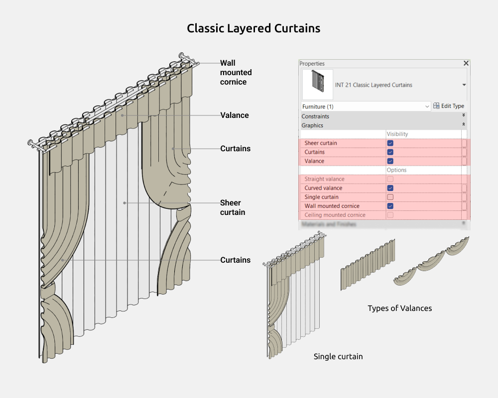

La galería puede ser recta (Straight valance) o curva (Curved valance). **Single curtain** desactiva la cortina de la derecha.

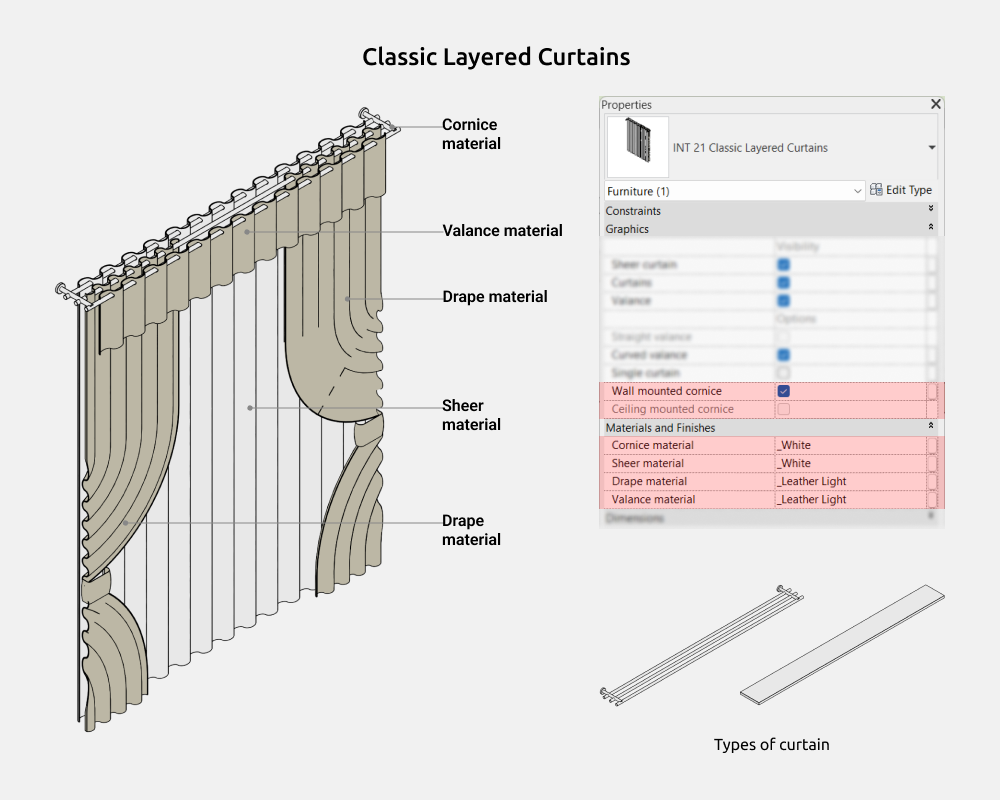

El cortinero se puede montar en la pared con **Wall mounted cornice**, separado del techo, o directamente en el techo con **Ceiling mounted cornice**, adecuado para una instalación oculta o integrada.

Los parámetros de materiales permiten ajustar el material del cortinero (**Cornice material**), del visillo (**Sheer material**), de la cortina (**Drape material**) y de la galería (**Valance material**).

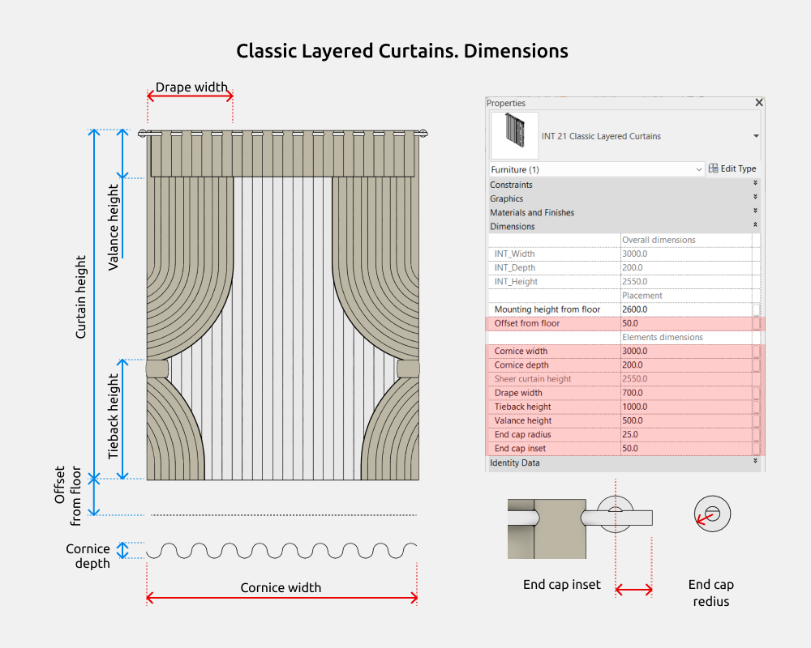

**Offset from floor** mide la separación desde el suelo hasta la parte inferior. **Cornice width**, **Cornice depth** y **Sheer curtain height** definen las dimensiones generales.

También puedes ajustar la anchura de una cortina (**Drape width**), la altura del alzapaños respecto a la parte inferior de la cortina (**Tieback height**), la altura de la galería (**Valance height**), el radio de los remates (**End cap radius**) y su desplazamiento hacia dentro (**End cap inset**).

Los parámetros en gris no se pueden modificar directamente. **Sheer curtain height** descuenta la separación del suelo y muestra la altura resultante.

### Persianas venecianas

Puedes activar o desactivar los marcos verticales con **Vertical frames**.

En las opciones puedes elegir el tipo de cordón cuando los marcos verticales están desactivados y ajustar el ángulo de las lamas con **Slat angel**. El porcentaje de apertura controla cuánto se abre o cierra la persiana sin cambiar los parámetros de dimensiones de los elementos.

**Blinds width**, **Blinds depth** y **Blinds height** definen las dimensiones generales. **Frame width** ajusta la anchura del marco por separado.

Los parámetros en gris, como **ADSK_Dimension_Width**, no están pensados para editarse manualmente. Intervienen en los cálculos de dimensiones y en el funcionamiento de las fórmulas.

### Persianas de lamas verticales

Puedes activar o desactivar el marco con **Blind frame**.

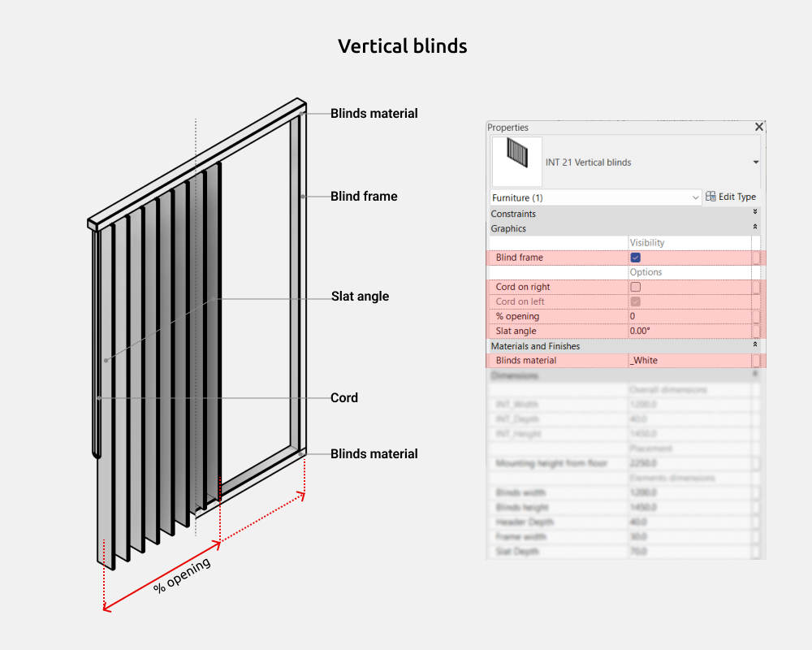

En las opciones puedes elegir el tipo de cordón cuando el marco está desactivado y ajustar el ángulo de las lamas con **Slat angle**. El porcentaje de apertura no modifica los parámetros de dimensiones de los elementos.

**Blinds width**, **Header depth** y **Blinds height** definen las dimensiones generales. **Frame width** y **Slat depth** ajustan por separado la anchura del marco y la profundidad de las lamas.

Los parámetros en gris, como **ADSK_Dimension_Width**, se utilizan en los cálculos y las fórmulas y no se editan manualmente.

### Estores enrollables

Puedes activar o desactivar la tapa con **Cassette cover**.

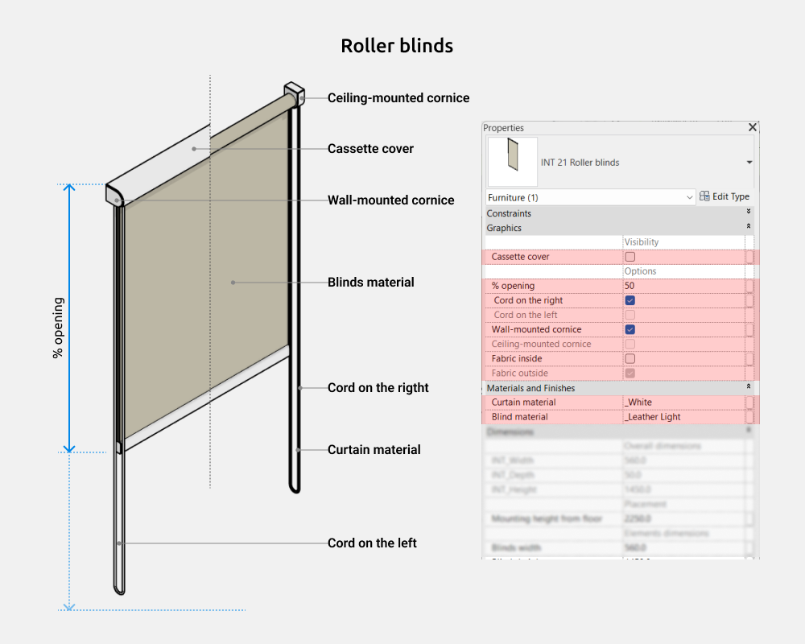

En las opciones puedes elegir el tipo de cordón, el montaje a pared o a techo y la posición del tejido por dentro o por fuera. El porcentaje de apertura controla la apertura y el cierre sin modificar los parámetros de dimensiones de los elementos.

**Blinds width**, **Blinds height** y **Cornice depth wall** definen las dimensiones generales.

**Cornice depth wall** se utiliza con el montaje a pared. Cuando esta opción está desactivada, la profundidad del cortinero es de 40 mm. **Cornice depth ceiling** se utiliza con el montaje a techo.

Los parámetros en gris, como **ADSK_Dimension_Width**, intervienen en los cálculos y las fórmulas y no se editan manualmente.

### Estores plegables

El porcentaje de apertura controla la apertura y el cierre sin modificar las dimensiones de los elementos. Puedes ajustar el material del cortinero (**Cornice material**) y el del tejido (**Curtain material**).

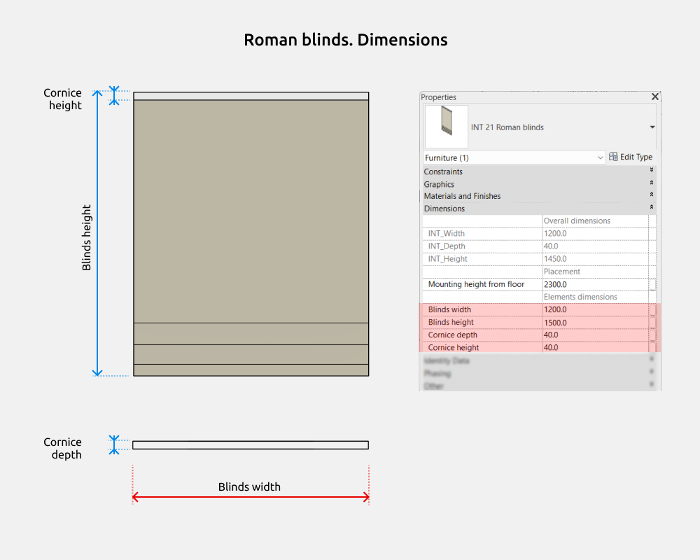

**Blinds width**, **Cornice depth** y **Blinds height** definen las dimensiones generales. **Cornice height** ajusta la altura del cortinero por separado.

Los parámetros en gris, como **ADSK_Dimension_Width**, se utilizan para los cálculos y las fórmulas y no se editan manualmente.

### Cortinas para superficies inclinadas

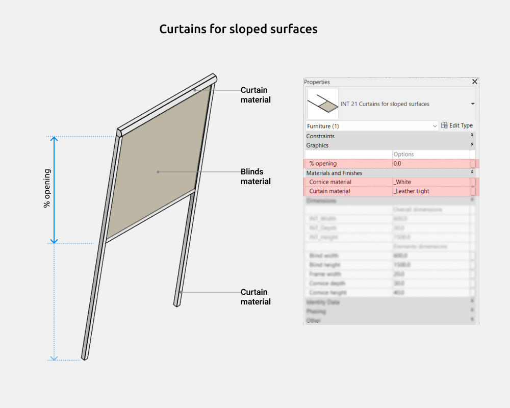

El porcentaje de apertura controla la apertura y el cierre sin cambiar los parámetros de dimensiones. **Cornice material** y **Curtain material** permiten ajustar los materiales del cortinero y del tejido.

**Blind width**, **Cornice depth** y **Blind height** definen las dimensiones generales. **Frame width** y **Cornice height** se ajustan por separado.

Los parámetros en gris, como **ADSK_Dimension_Width**, se utilizan en los cálculos y las fórmulas y no se editan manualmente.

### Cortinas para ventanas irregulares

Los siguientes interruptores permiten activar o desactivar las formas.

- Con una pendiente (**1 Angled**)
- Triangular (**2 Triangular**)
- Medio trapecio (**3 Half-trapezoid**)
- Trapecio (**4 Trapezoid**)

**% opening** controla la apertura y el cierre sin modificar los parámetros de dimensiones. **Cornice material** y **Curtain material** permiten ajustar los materiales del cortinero y del tejido.

**Curtain width**, **Cornice depth** y **Curtain height** definen las dimensiones generales. La anchura y la altura de la pendiente (**Sloped width** y **Sloped height**), así como la altura y la profundidad del cortinero, se controlan mediante sus parámetros.

Los parámetros en gris, como **ADSK_Dimension_Width**, se utilizan en los cálculos y las fórmulas y no se editan manualmente.

### Cortinas en arco

El porcentaje de apertura controla la apertura y el cierre sin cambiar los parámetros de dimensiones. **Cornice material** y **Curtain material** permiten ajustar los materiales del cortinero y del tejido.

**Curtain width**, **Cornice depth** y **Curtain height** definen las dimensiones generales. La altura del arco (**Arch height**) y las dimensiones del cortinero se ajustan mediante sus parámetros específicos.

Los parámetros en gris, como **ADSK_Dimension_Width**, se utilizan en los cálculos y las fórmulas y no se editan manualmente.

## 4. REPRESENTACIÓN GRÁFICA

### Ajustes gráficos

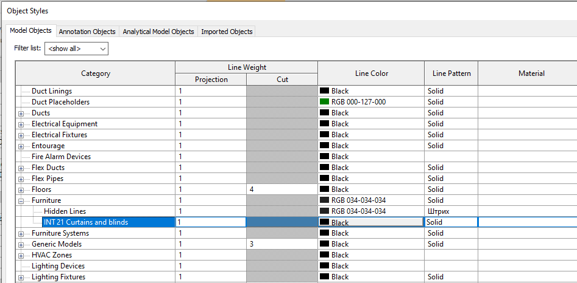

Para cambiar el color, el grosor o el patrón de las líneas, abre la ficha Gestionar, selecciona Estilos de objeto y busca INT 21 Curtains and blinds en la categoría Mobiliario.

En las familias de cortinas superpuestas y cortinas clásicas, cambia el color del patrón para modificar su representación en las plantas.

<CTA type="guide" />
