import productPreview from './product.png';

<ProductCard
  name="Familias de puertas para Revit"
  description="Puertas abatibles, de dos hojas, correderas y técnicas, huecos y portales, listos para colocar en tu proyecto de Revit."
  image={productPreview}
  imageAlt="Vista previa del conjunto de puertas para Revit"
  buyUrl="https://bimcore.one/products/door-revit-families"
  ecwidProductId="695706588"
  buyLabel="Ver el precio en la tienda"
/>

## 1. INFORMACIÓN GENERAL

- Nombre del conjunto Puertas (Doors)
- Versión del conjunto 1.2.0
- Versión de Revit 2019

### Descripción

Este conjunto de familias de Revit sirve para modelar puertas y huecos en Autodesk Revit.

Con estas familias puedes crear puertas de entrada e interiores de una hoja, de hoja y media y de dos hojas, puertas plegables, correderas y pivotantes, huecos con cerco y sin él, y puertas con acristalamiento.

Está pensado para diseñadores de interiores y arquitectos. La geometría del cerco, de la hoja y del resto de elementos está simplificada para no recargar unas familias que ya son complejas de por sí.

### Carga y colocación

Para ver y cargar las familias que necesites, abre la carpeta con los archivos de familia y arrástralos al proyecto con el ratón.

¡IMPORTANTE! Coloca las puertas solo en una vista de planta, nunca en 3D. En 3D puede aparecer un error y Revit no te dejará colocar la puerta.

## 2. CONTENIDO DEL CONJUNTO

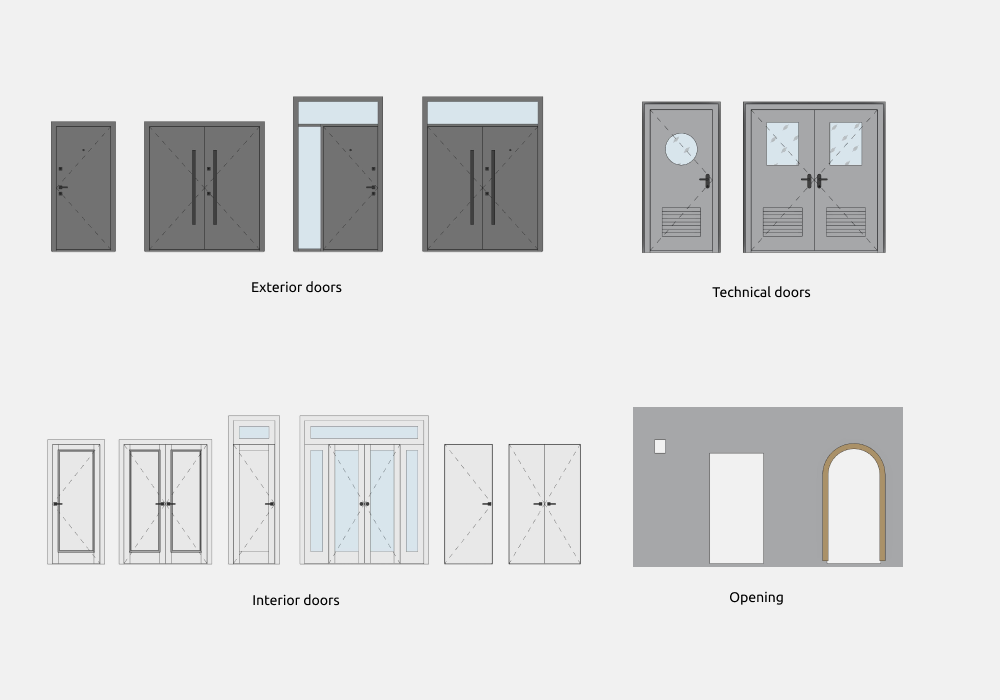

El conjunto incluye estas familias.

Puerta de entrada (Exterior door):

- De una hoja (Single)
- De dos hojas (Double)
- De una hoja con acristalamiento (Single with sidelites)
- De dos hojas con acristalamiento (Double with sidelites)

Puerta interior (Interior door):

- De una hoja (Single)
- De dos hojas (Double)
- De una hoja con acristalamiento (Single with sidelites)
- De dos hojas con acristalamiento (Double with sidelites)
- Oculta (Invisible)
- Oculta de dos hojas (Invisible double)

Puertas correderas (Sliding door):

- Corredera empotrada (Pocket), de una y de dos hojas
- Plegable (Bi-fold), de una y de dos hojas
- Compack, de una y de dos hojas
- Giratoria (Rotary), de una y de dos hojas
- Pivotante (Pivot), de una y de dos hojas
- Corredera vista sobre la pared (Wall-sliding), de una y de dos hojas
- Magic, de una y de dos hojas
- Corredera de 2 hojas (Sliding 2 panels)
- Corredera de 3 hojas (Sliding 3 panels)
- Corredera de 4 hojas (Sliding 4 panels)

Puerta técnica (Technical door):

- De una hoja (Single)
- De dos hojas (Double)
- De vaivén de una hoja (Swinging single)
- De vaivén de dos hojas (Swinging double)

Huecos (Openings):

- Hueco (Opening), sirve para señalar aberturas pequeñas en el muro, como pasos de tubería o de ventilación
- Hueco de puerta (Door opening), un hueco simple en el muro
- Portal (Doorway), un hueco de distintas formas con el cerco de las mochetas

Etiqueta de puertas (Door tag)

## 3. ELEMENTOS COMUNES

Los elementos comunes son los que se repiten a menudo en las familias del conjunto.

### Apertura

Los parámetros de apertura de las puertas están entre los parámetros de tipo.

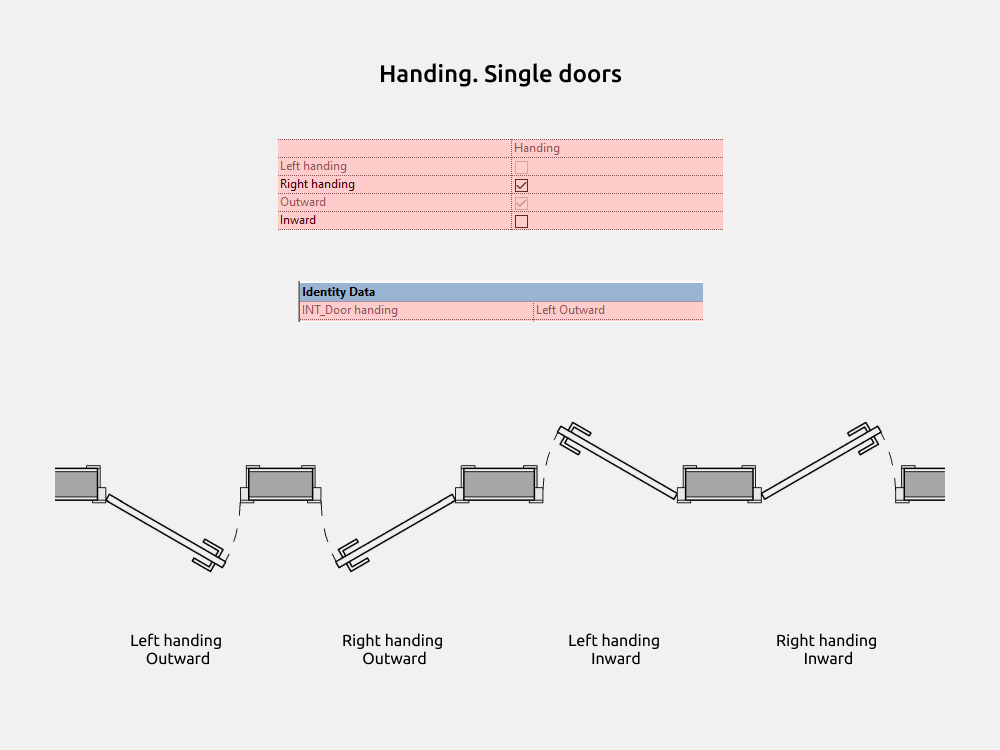

Tipos de apertura:

- Apertura izquierda (**Left handing**)
- Apertura derecha (**Right handing**)
- Hacia fuera (**Outward**)
- Hacia dentro (**Inward**)

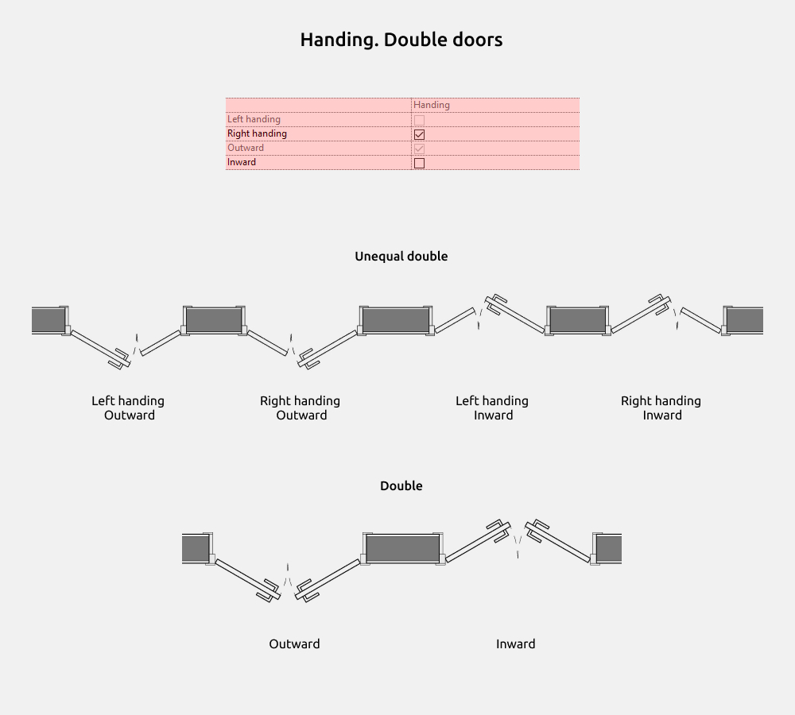

En las puertas de dos hojas iguales, donde no hay apertura izquierda ni derecha, solo se elige hacia fuera o hacia dentro.

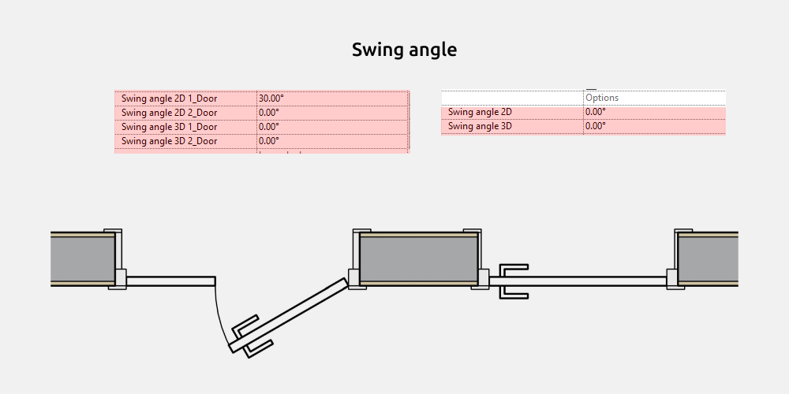

El ángulo de apertura funciona por separado para la hoja 3D y para la hoja 2D, porque la representación en 2D se dibuja con líneas simbólicas. Los parámetros son **Swing angle 3D** y **Swing angle 2D**.

Las correderas de una hoja tienen apertura izquierda y derecha. Hacia fuera y hacia dentro no existen en ellas: para eso se usan las flechas de simetría de los controles. En las correderas de dos hojas solo hay flechas.

Esas flechas indican además la cara exterior de la familia, así que con ellas sabes dónde queda el acabado exterior (**Finishing outside**) y dónde el interior (**Finishing inside**).

Para indicar cómodamente la apertura de las puertas en las tablas de planificación se creó el parámetro compartido **INT_Door handing**, que está en el grupo Datos de identidad.

Si el parámetro aparece en gris, es decir inactivo, dentro lleva una fórmula y por eso no se puede editar.

Si aparece en negro, es decir activo, puedes escribir tú la información según la configuración concreta de la puerta. Esto vale para casi todas las correderas.

En las puertas de dos hojas sin apertura izquierda ni derecha solo se escribe el valor hacia fuera o hacia dentro.

En el nivel de detalle alto se ve todo igual que en 3D, salvo la hoja con las manillas. Esa hoja 2D gira por separado de la hoja 3D.

En el nivel de detalle medio la geometría del cerco se dibuja con líneas simplificadas. Los tapajuntas y los forros de jamba quedan ocultos y la hoja se representa con una simple línea.

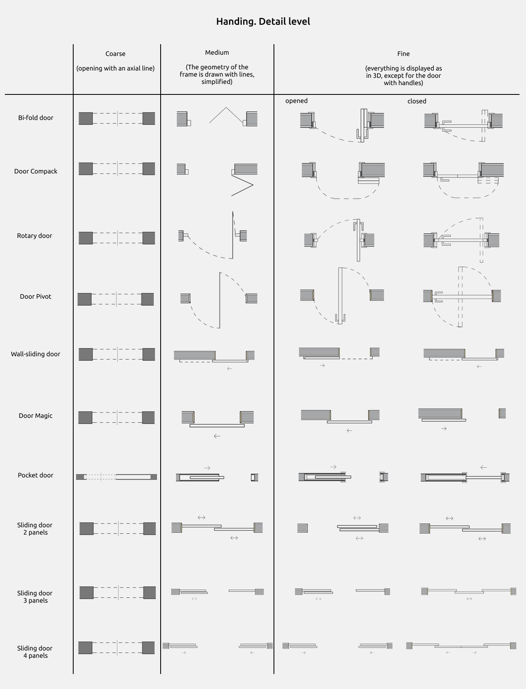

### Tipos

Los nombres de tipo de todas las familias empiezan por las dimensiones del hueco, el ancho (Opening width) y el alto (Opening height).

En las puertas interiores y correderas sigue el ancho de la hoja (Door width), o de varias hojas, por ejemplo 600+600.

Tipo de hoja (Door type), ciega (Solid) o acristalada (Glass).

Apertura (Handing), derecha (R), izquierda (L), hacia fuera (OUT) o hacia dentro (IN).

Acristalamiento (Sidelites), colocación a la izquierda (SL-Left), a la derecha (SL-Right), arriba (SL-Top) y sus combinaciones (SL-Left-Right, SL-Left-Top, SL-Right-Top, SL-Left-Right-Top).

### Herrajes (manillas, cerraduras)

Manillas

Los tipos de manilla se eligen en la lista desplegable de **Handles type**, salvo en las correderas, que llevan por defecto solo manillas de corredera. Son estos:

- Ninguna (None)
- Cuadrada (Rectangle)
- Redonda (Rounded)
- Sobre placa (On backplate)
- Barra (Pull bar)
- De corredera (Sliding)
- Pomo (Knob)
- Asa (D-handle)

Para reflejar todos los herrajes en las tablas de planificación se creó el parámetro compartido **INT_Door hardware**, que está en el grupo Datos de identidad.

La información la escribes tú según la configuración concreta de la puerta.

La manilla en 2D se puede desactivar con **Handle 2D**, por ejemplo cuando la puerta lleva manilla de corredera.

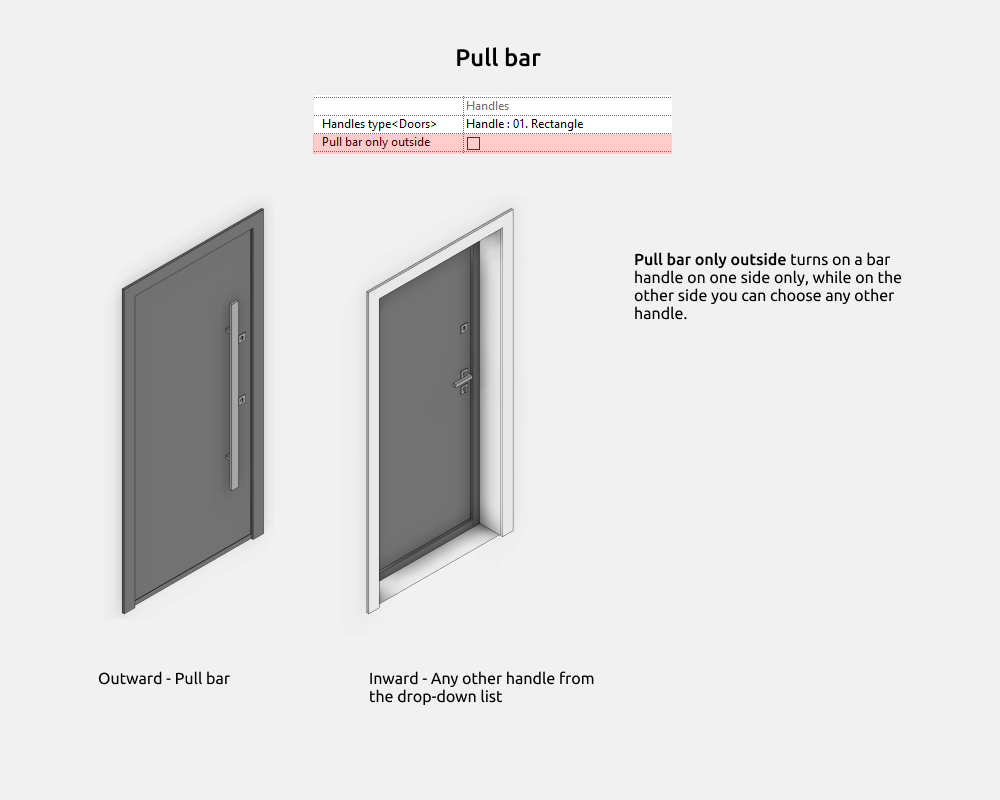

**Pull bar only outside** deja la manilla de barra en una sola cara y permite elegir cualquier otra manilla en la contraria.

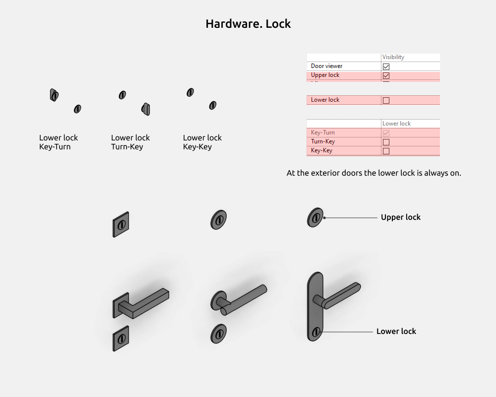

Tipos de cerradura:

- Cerradura superior (Upper lock), en las puertas de entrada
- Cerradura inferior (Lower lock), presente en todas las familias de puertas y siempre activada en las de entrada

La cerradura inferior tiene además opciones para colocar el botón de condena y la llave por dentro o por fuera:

- Key-Turn
- Turn-Key
- Key-Key

Las dimensiones de los herrajes no cambian. Solo se puede modificar la separación entre el borde de la puerta y el eje de las manillas, de la que se ocupa **Handle side offset**.

La manilla de barra (Pull bar) se coloca algo más lejos que la posición estándar del resto de manillas y cerraduras.

La mirilla (**Door viewer**) de las puertas de entrada se sitúa en el centro, salvo si está activado el espejo (**Mirror**) en la cara interior de la hoja. Entonces la mirilla se desplaza hacia el eje de las manillas.

Las manillas se colocan a 1000 mm del borde inferior de la hoja.

### Acabado

Si en el proyecto el acabado está resuelto con muros finos adicionales unidos al muro principal, la puerta tiene que desplazarse ese espesor de acabado para encajar en las dimensiones.

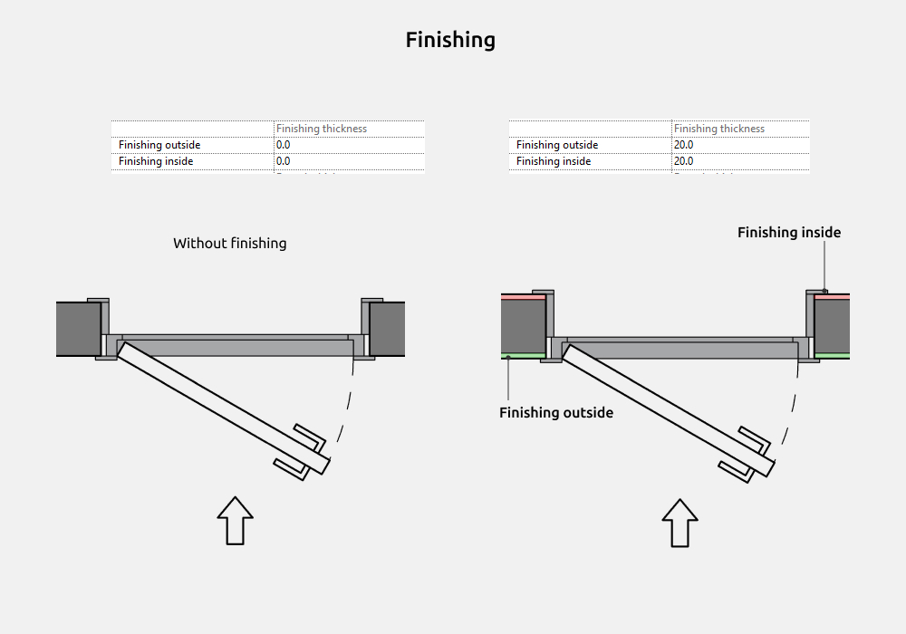

El acabado puede estar por fuera o por dentro del muro. Para anular ese desplazamiento pon a 0 los parámetros de espesor de acabado **Finishing outside** y **Finishing inside**.

### Mochetas

Las mochetas están resueltas en todas las familias de puertas con las familias anidadas compartidas INT 19 Door reveals outside e INT 19 Door reveals inside, que pertenecen a la categoría Muros (Walls). Se activan y se desactivan con **Reveals outside** y **Reveals inside**.

Para que la superficie de las mochetas se calcule por una sola cara y no por todo el volumen, lo que daría datos incorrectos en la tabla de planificación, el material está dividido.

**Material for reveals outside (not for shedule)** y **Material for reveals inside (not for shedule)** son el material de relleno de la mocheta y no sirven para la tabla de planificación.

**Material for reveals outside** y **Material for reveals inside** son la cara exterior de la mocheta, pintada con la herramienta de pintura. Ese material sí se puede usar para contabilizar la superficie.

### Dimensiones

El ancho (**Width**) y el alto (**Height**) son las dimensiones del hueco.

El ancho aproximado (**Rough Width**), el alto aproximado (**Rough Height**) y el espesor (**Thickness**) son las dimensiones de la hoja.

#### Rebaje

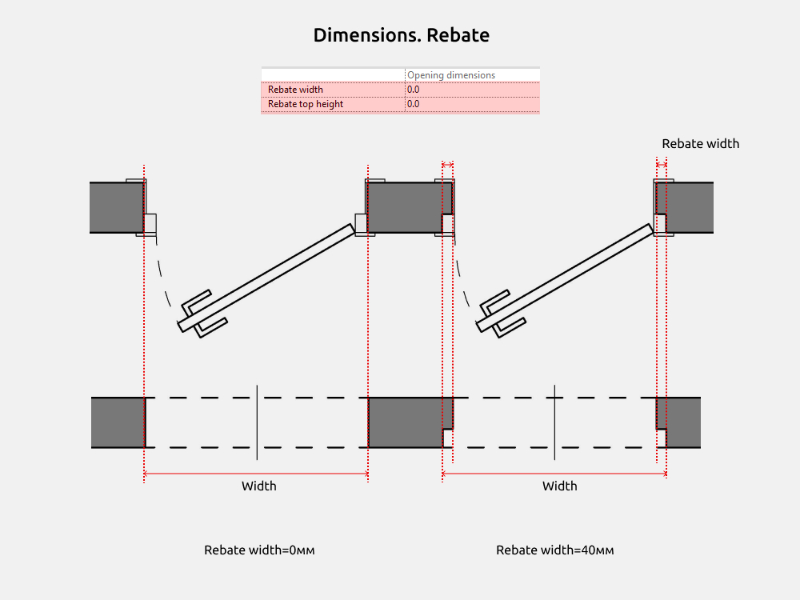

El rebaje (**Rebate**) es un corte del hueco para alojar el cerco. Su valor por defecto es 0.

#### Profundidad de instalación

La profundidad de instalación (**Installation depth**) es cuánto se desplaza la hoja con el cerco hacia el interior del hueco. Su valor por defecto es 0.

#### Tapajuntas y forros de jamba

Los tapajuntas están fijados a la cara del forro de jamba y se desplazan con él. Aunque los forros estén desactivados, si necesitas mover los tapajuntas basta con cambiar su espesor.

#### Falso montante

En esta familia el falso montante se activa dando un valor mayor que 0 a **False transom height outside** y **False transom height inside**. Entonces ese valor se suma al ancho del tapajuntas (**Casing width**) y el tapajuntas crece hacia arriba.

Si los tapajuntas están desactivados, el falso montante no funciona.

### Acristalamiento

El acristalamiento se usa en estas familias:

- INT 19 Door exterior single with sidelites
- INT 19 Door exterior double with sidelites
- INT 19 Door interior single with sidelites
- INT 19 Door interior double with sidelites

El acristalamiento se puede colocar:

- Arriba (Top)
- A la derecha (Right)
- A la izquierda (Left)
- A la derecha y a la izquierda (Right and Left)
- A la derecha y arriba (Right and Top)
- A la izquierda y arriba (Left and Top)
- A la izquierda, a la derecha y arriba (Left, Right and Top)

Se controla con **Sidelites top**, **Sidelites left** y **Sidelites right**.

**Left and right sidelights Full-height** sube los montantes laterales hasta arriba.

Los peinazos (Muntins) son elementos de la hoja.

Los peinazos adicionales, **Muntin 1 on top**, **2 and 3 on top**, **4 and 5 on top** y **Side muntins**, son los que se activan en el acristalamiento.

## 4. FAMILIAS

### Puertas interiores

Las familias de puertas interiores son las que comunican habitaciones dentro de la vivienda. La hoja abre de la forma habitual.

Las puertas interiores se dividen en:

- De una hoja (Single)
- De dos hojas (Double)
- Con acristalamiento (With sidelites)
- Ocultas (Invisible)

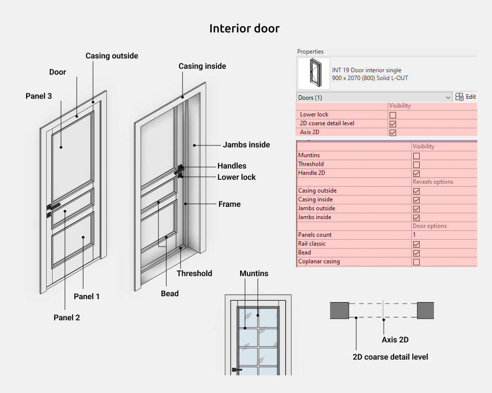

Aquí puedes activar y desactivar estos elementos:

- Cerradura inferior (**Lower lock**)
- Representación 2D del nivel de detalle bajo (**2D coarse detail level**)
- Eje en 2D (**Axis 2D**)
- Peinazos (**Muntins**)
- Umbral (**Threshold**)
- Tapajuntas interior (**Casing inside**)
- Forros de jamba exteriores (**Jambs outside**)
- Forros de jamba interiores (**Jambs inside**)
- Mochetas exteriores (**Reveals outside**)
- Mochetas interiores (**Reveals inside**)
- Número de entrepaños (**Panels count**), de 0 a 3
- Moldura clásica (**Rail classic**)
- Junquillo (**Bead**)
- Tapajuntas coplanario (**Coplanar casing**)

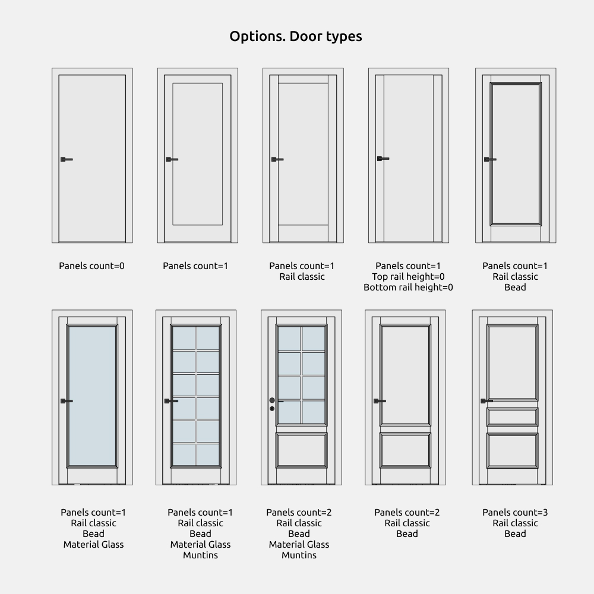

Estos tipos de hoja sirven para todas las puertas interiores, salvo la oculta, y para las correderas.

Con las opciones adicionales de la hoja puedes hacer desde una hoja lisa sin fresado hasta hojas clásicas ciegas o con vidrio.

El número de entrepaños va de 0 a 3. Con el valor 0 la hoja queda lisa, sin recortes.

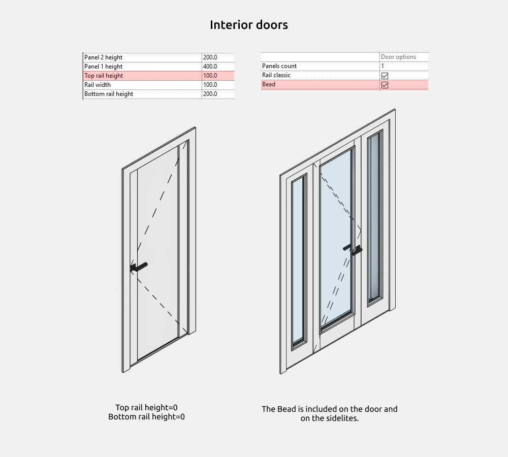

**Coplanar casing** desplaza la hoja con el cerco hasta el borde del tapajuntas para que queden en el mismo plano.

Con ese parámetro activado no se puede cambiar la profundidad de instalación, deja de funcionar.

#### Dimensiones

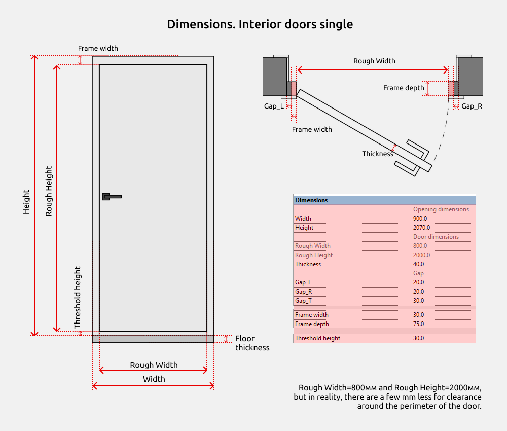

La hoja mide algo menos que los valores de **Rough Width** y **Rough Height** por las holguras del perímetro.

**Rough Width** = **Width** − **Frame width** × 2

**Rough Height** = **Height** − alto del cerco superior − 10, o bien menos el alto del umbral (**Threshold height**)

Si el umbral está desactivado, en la parte baja de la hoja queda una holgura de unos 10 mm.

En las familias de dos hojas hay tanto puertas de hojas iguales como de hoja y media. Basta con elegir el tipo adecuado.

Dimensiones del paso libre:

**Rough Width** = **1_Door width** + **2_Door width**

**Rough Height** = **Door height**

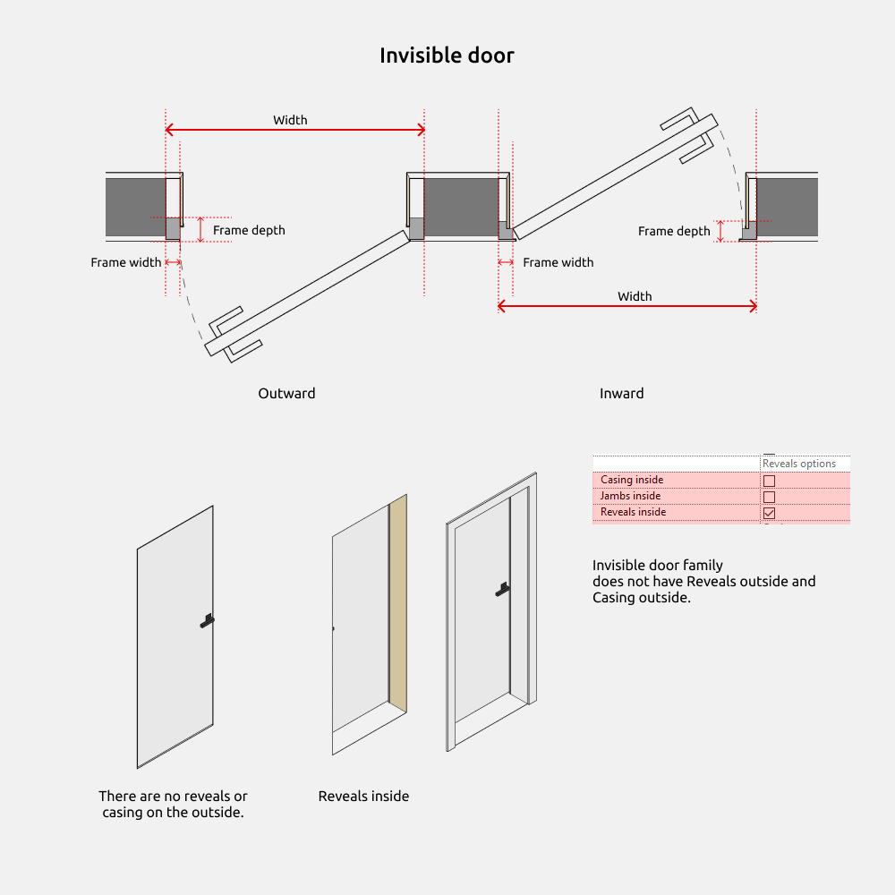

La puerta oculta también puede abrir hacia fuera y hacia dentro.

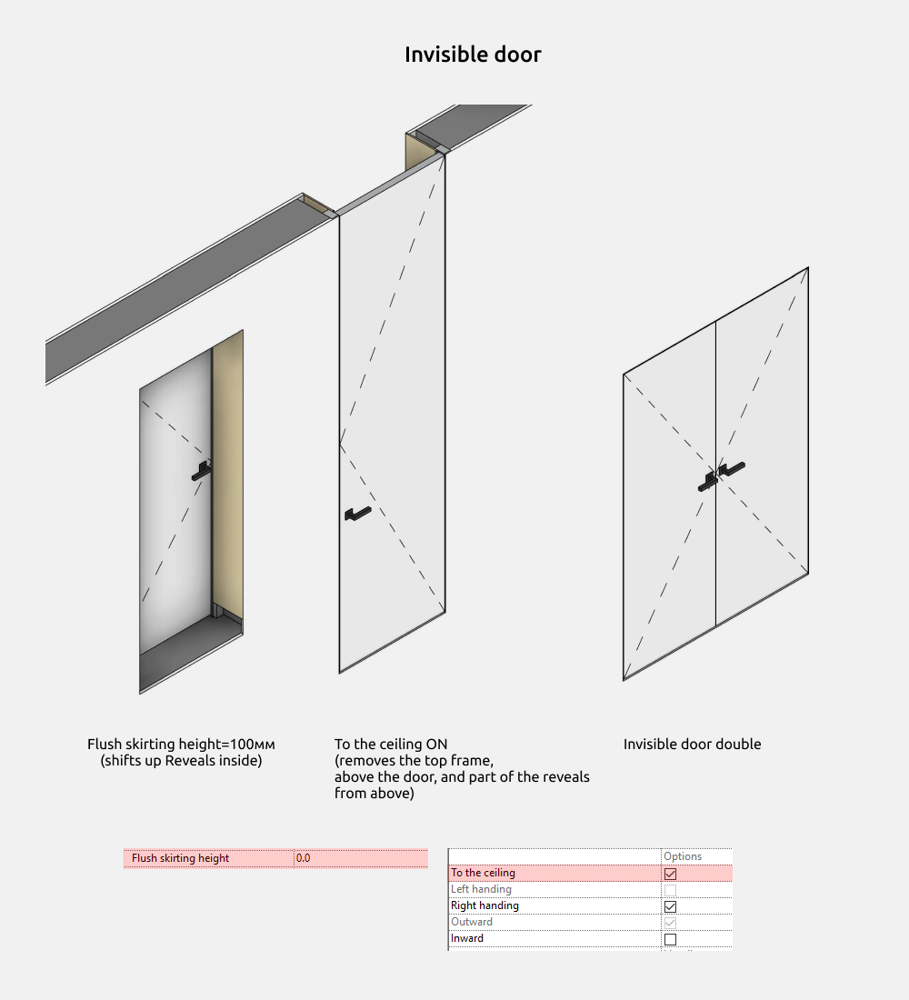

**Flush skirting height** sube las mochetas interiores y deja sitio para un rodapié oculto.

**To the ceiling** quita el cerco superior, por encima de la hoja, y parte de las mochetas de arriba.

El conjunto incluye además la puerta oculta de dos hojas (Invisible door double).

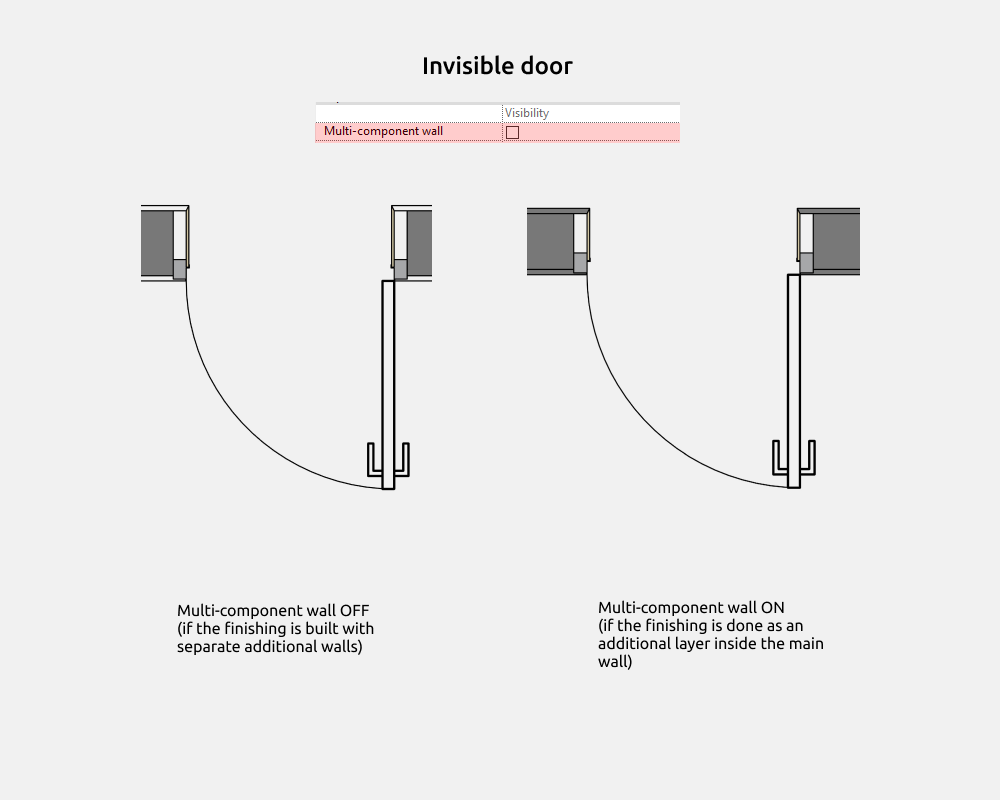

**Multi-component wall** se activa en las puertas ocultas cuando el acabado de los muros está resuelto con capas adicionales dentro del muro principal y no con muros finos independientes.

El recorte para el perfil de sombra se ajusta en las dimensiones. Con la altura a 0 mm la puerta se ve como siempre. Con 20 mm aparece el recorte para el perfil.

#### Materiales

Los materiales de los entrepaños están en el tipo.

**Material for door classic** sirve para las puertas con entrepaños, es decir con recortes. Los materiales de hoja lisa, **Material for plain door outside**, **Material for plain door inside** y **Material for plain door edge**, sirven cuando el número de entrepaños es 0.

### Puertas correderas

Las familias de puertas correderas son aquellas cuyas hojas se desplazan, se pliegan o giran, a diferencia de las interiores normales. Se dividen en:

- Corredera empotrada (Pocket), de una y de dos hojas
- Plegable (Bi-fold), de una y de dos hojas
- Compack, de una y de dos hojas
- Giratoria (Rotary), de una y de dos hojas
- Pivotante (Pivot), de una y de dos hojas
- Corredera vista sobre la pared (Wall-sliding), de una y de dos hojas
- Magic, de una y de dos hojas
- Corredera de 2 hojas (Sliding 2 panels)
- Corredera de 3 hojas (Sliding 3 panels)
- Corredera de 4 hojas (Sliding 4 panels)

La geometría de los elementos de las correderas es la misma que la de las interiores, con su cerco, sus tapajuntas, sus forros de jamba y demás. Las diferencias están en las dimensiones y en los elementos adicionales.

#### Corredera empotrada

Ancho del paso libre = **Rough Width** − reducción del ancho de paso libre (**Reduction of clear opening width**)

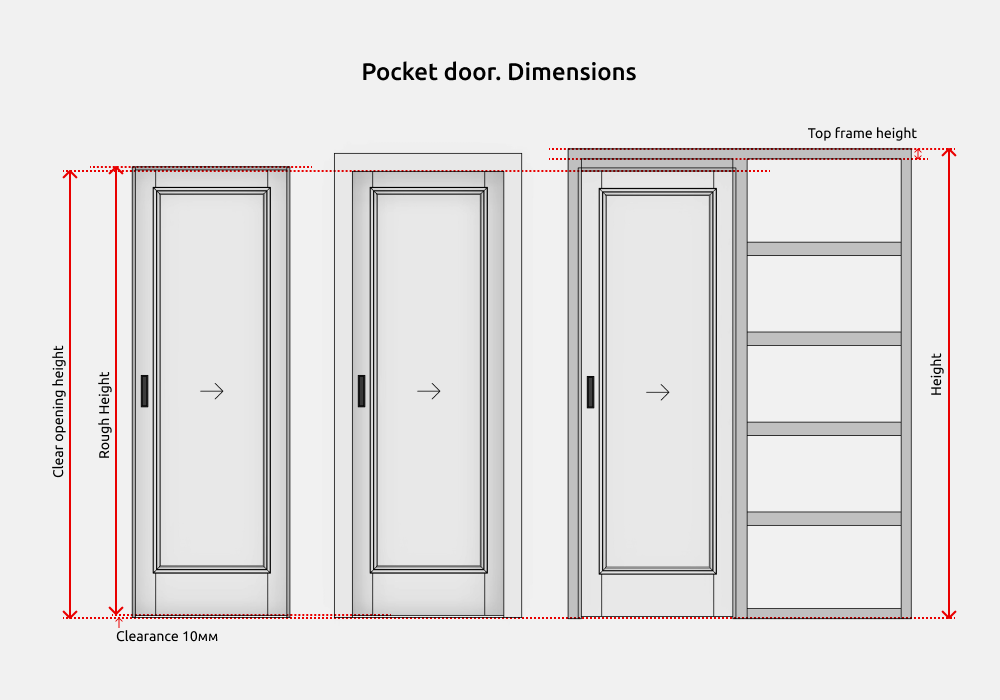

#### Plegable

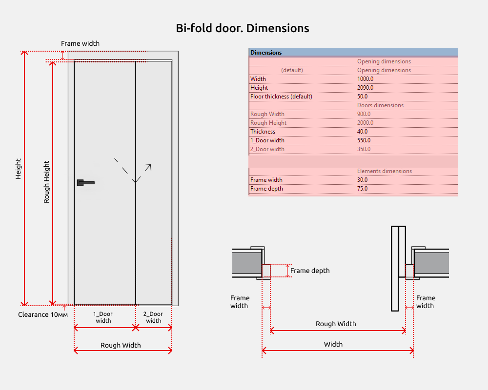

#### Compack

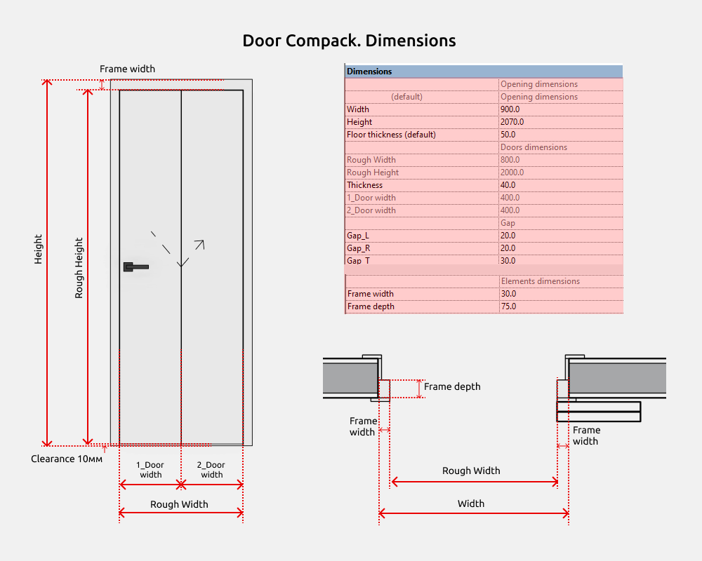

#### Giratoria

#### Pivotante

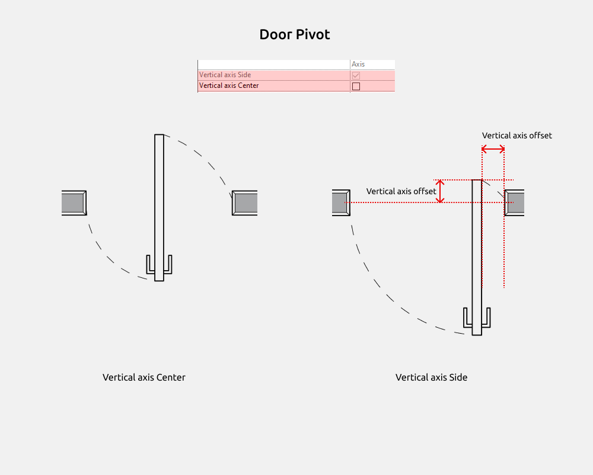

Con el eje vertical en el centro, la hoja se desplaza al centro. Con el eje vertical al lado, la hoja se sitúa más cerca del borde del hueco y esa distancia se puede cambiar con **Vertical axis offset**.

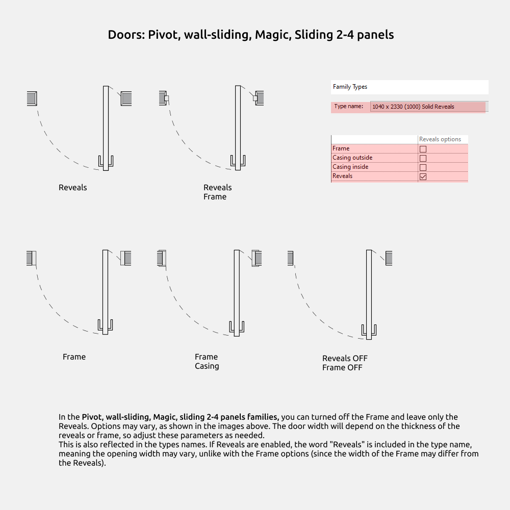

En las familias Pivot, Wall-sliding, Magic, Sliding 2 panels, Sliding 3 panels y Sliding 4 panels se puede desactivar el cerco (**Frame**) y dejar solo las mochetas (**Reveals**). Las combinaciones pueden variar, como en las imágenes anteriores. El ancho de la hoja depende del espesor de las mochetas o del cerco, así que cambia esos parámetros cuando haga falta.

Esto se refleja también en el nombre de los tipos. Si las mochetas están activadas, el nombre del tipo incluye la palabra Reveals, y entonces el ancho del hueco es distinto que en los tipos con cerco, porque el ancho del cerco puede no coincidir con el espesor de las mochetas.

#### Corredera vista sobre la pared

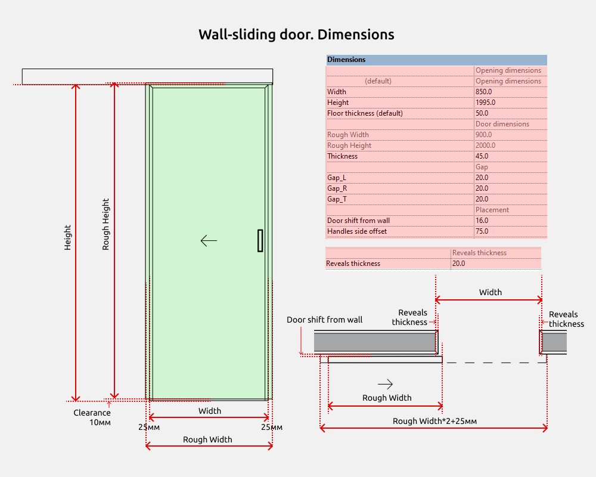

La hoja es 25 mm más ancha que el hueco por la izquierda y por la derecha.

Ancho de la guía = **Rough Width** × 2 + 25 mm. Si los tapajuntas son anchos, la guía se ensancha también un poco para enmarcarlos.

#### Magic

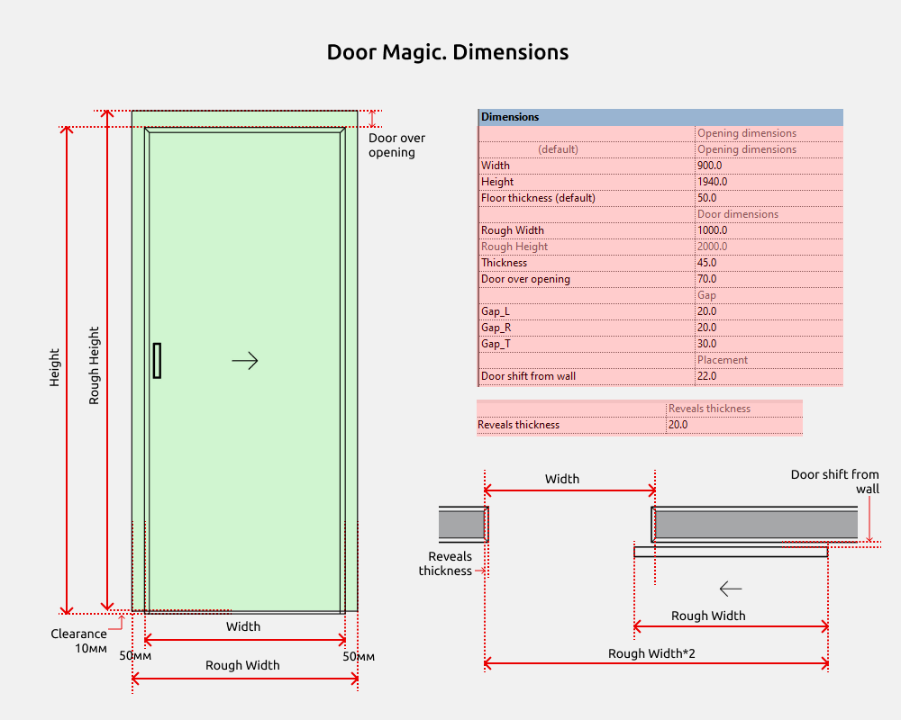

La hoja es 50 mm más ancha que el hueco por la izquierda y por la derecha. Por arriba sobresale lo que indique **Door over opening**.

#### Corredera de 2 hojas

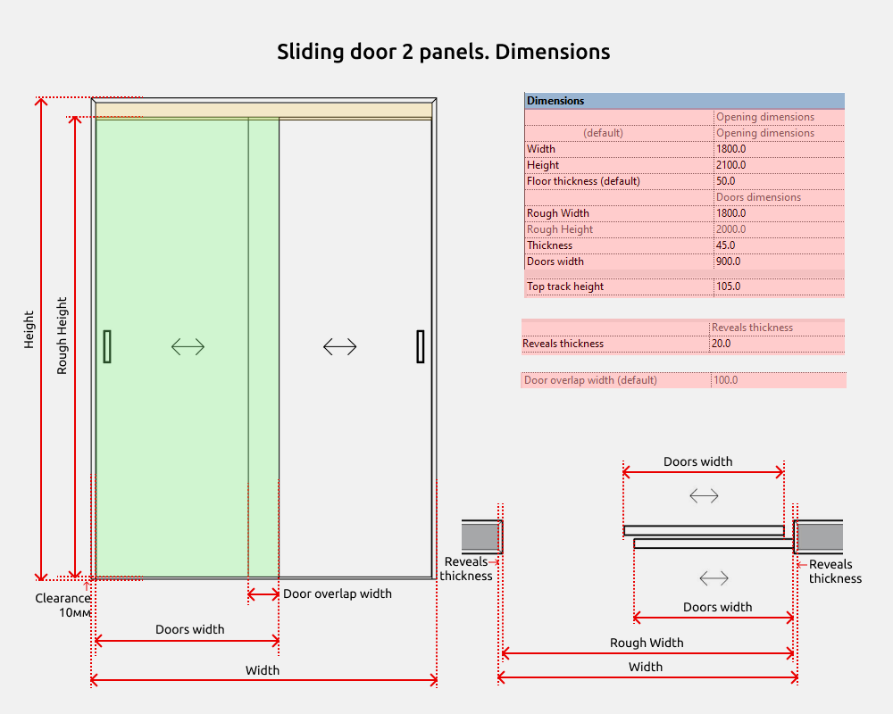

**Rough Width** = **Doors width** × 2

#### Corredera de 3 hojas

**Rough Width** = **Doors width** × 3

#### Corredera de 4 hojas

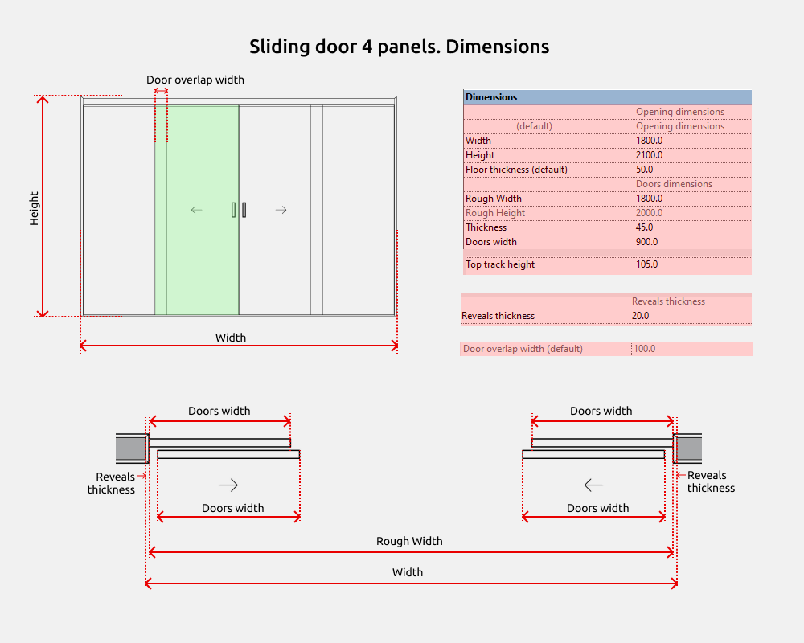

**Rough Width** = **Doors width** × 4

### Puertas de entrada y técnicas

Las familias de puertas de entrada y las de puertas técnicas van en un mismo grupo porque comparten los mismos tipos, tienen parámetros parecidos dentro de la familia y se usan para las puertas de acceso a una vivienda o a un local.

La diferencia está en la visibilidad de algunos parámetros.

Las de entrada tienen mirilla (**Door viewer**), cerradura superior (**Upper lock**) y espejo (**Mirror**).

Las técnicas tienen ventana (**Window**) y rejilla (**Louver**).

Aquí puedes activar y desactivar estos elementos:

- Mirilla (**Door viewer**)
- Cerradura superior (**Upper lock**)
- Espejo (**Mirror**)
- Representación 2D del nivel de detalle bajo (**2D coarse detail level**)
- Eje en 2D (**Axis 2D**)
- Flecha en 2D (**Arrow 2D**)
- Tapajuntas exterior (**Casing outside**)
- Tapajuntas interior (**Casing inside**)
- Forros de jamba exteriores (**Jambs outside**)
- Forros de jamba interiores (**Jambs inside**)
- Mochetas exteriores (**Reveals outside**)
- Mochetas interiores (**Reveals inside**)

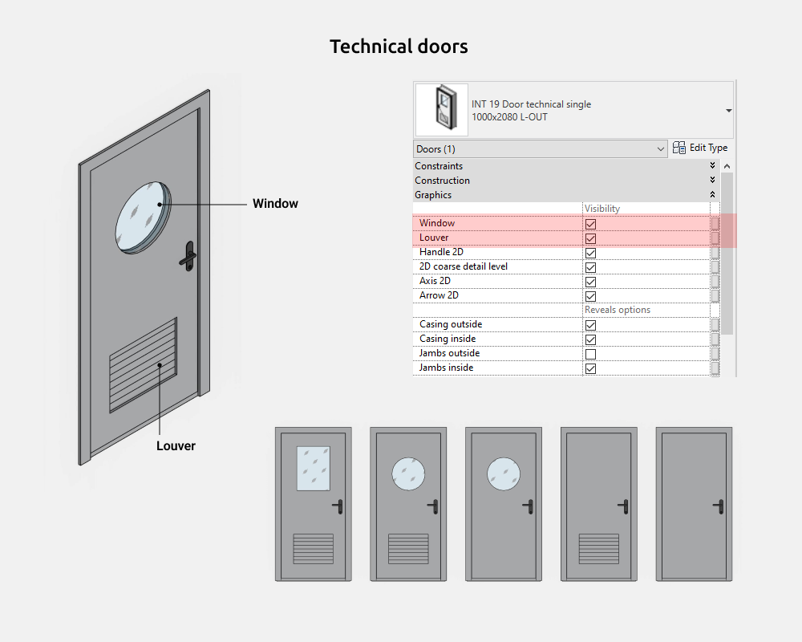

Aquí puedes activar y desactivar estos elementos:

- Ventana (**Window**)
- Rejilla (**Louver**)
- Representación 2D del nivel de detalle bajo (**2D coarse detail level**)
- Eje en 2D (**Axis 2D**)
- Flecha en 2D (**Arrow 2D**)
- Tapajuntas exterior (**Casing outside**)
- Tapajuntas interior (**Casing inside**)
- Forros de jamba exteriores (**Jambs outside**)
- Forros de jamba interiores (**Jambs inside**)
- Mochetas exteriores (**Reveals outside**)
- Mochetas interiores (**Reveals inside**)

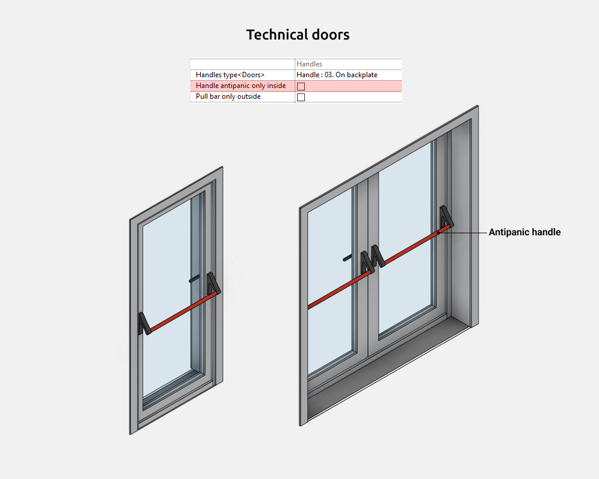

A las puertas técnicas se les añadieron manillas antipánico.

#### Dimensiones

En las familias de puertas de entrada y técnicas, a diferencia del resto, existen los parámetros del bloque de puerta (Door unit) y de la holgura de montaje (**Gap**).

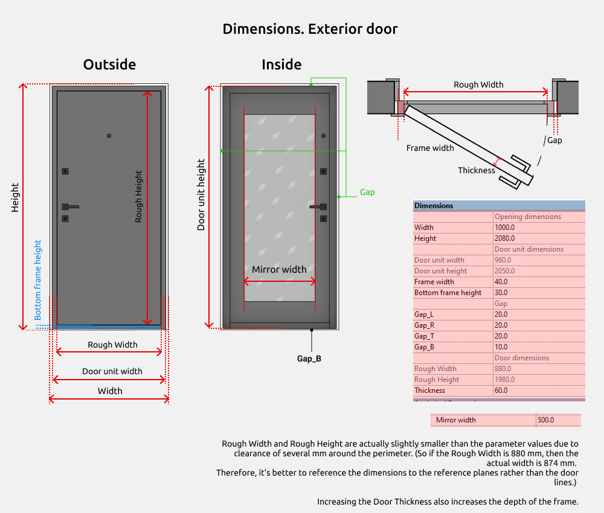

**Door unit width** = **Width** − **Gap** × 2

**Door unit height** = **Height** − **Gap** − holgura inferior (**Gap_B**)

**Rough Width** y **Rough Height** son en realidad algo menores que los valores de los parámetros, porque hay unos milímetros de holgura en todo el perímetro. Si en la tabla **Rough Width** es 880 mm, el ancho real es 874 mm.

Por eso conviene acotar contra los planos de referencia y no contra las líneas de la hoja.

Al aumentar el espesor de la hoja (**Thickness**) aumenta también la profundidad del cerco.

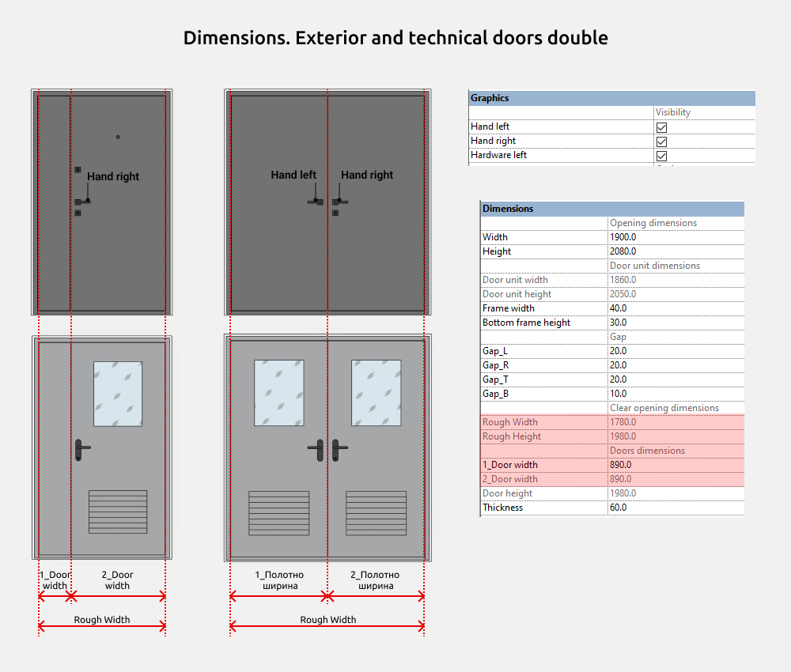

En las familias de dos hojas hay tanto puertas de hojas iguales como de hoja y media. Basta con elegir el tipo 1.5x o 2x.

**Door unit width** = **Width** − **Gap** × 2

**Door unit height** = **Height** − **Gap** − **Gap_B**

Ancho del paso libre = **Rough Width** = **1_Door width** + **2_Door width**

Alto del paso libre = **Rough Height** = **Door height**

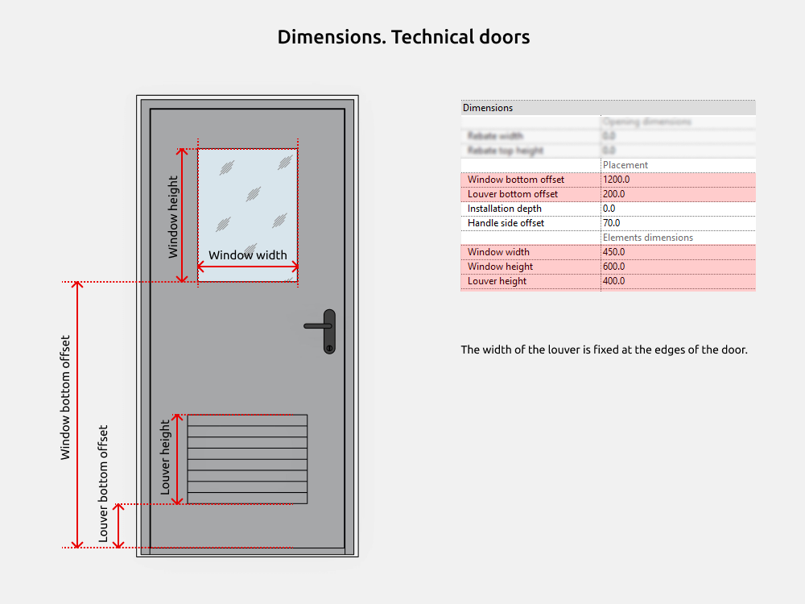

#### Materiales

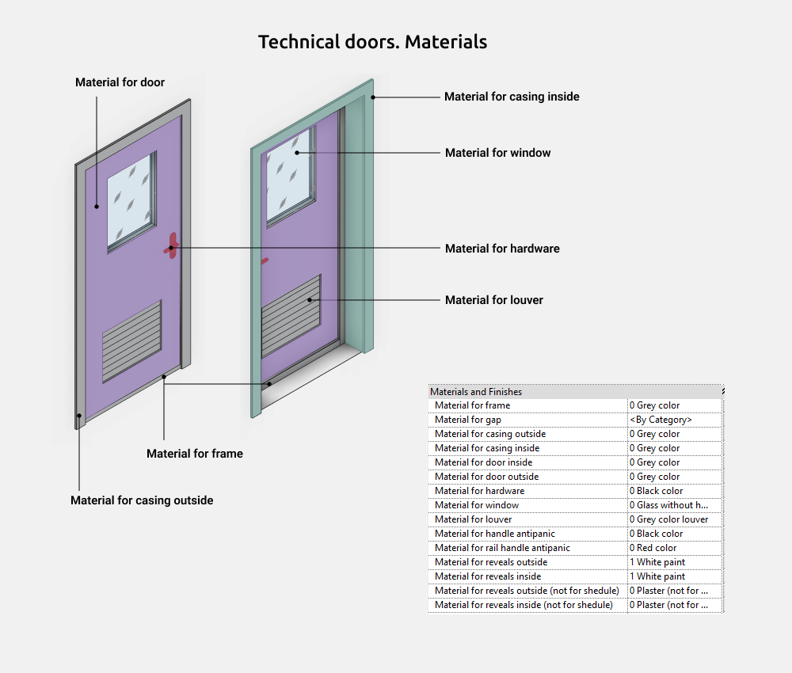

### Portal

El portal es un hueco con cerco. El cerco puede llevar tapajuntas o mochetas.

Los tipos se nombran con el ancho y el alto del hueco más la forma del hueco, por ejemplo 1000 x 2100 Rectangle.

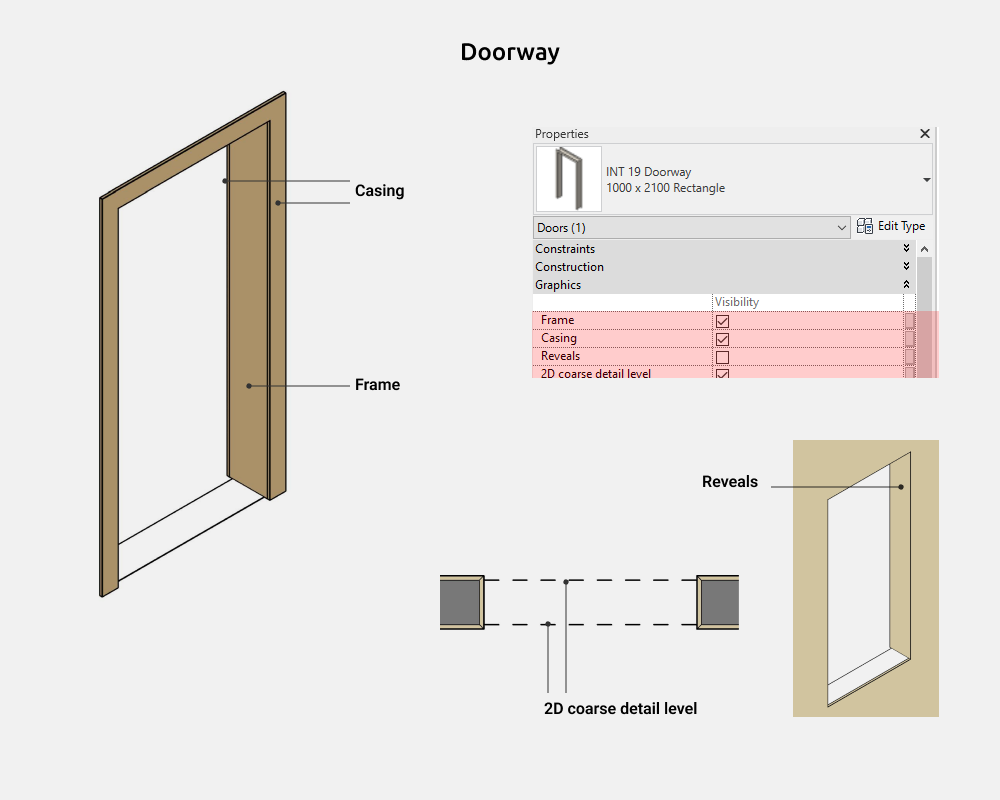

Aquí puedes activar y desactivar estos elementos:

- Cerco (**Frame**)
- Tapajuntas (**Casing**)
- Mochetas (**Reveals**)
- Representación 2D del nivel de detalle bajo (**2D coarse detail level**)

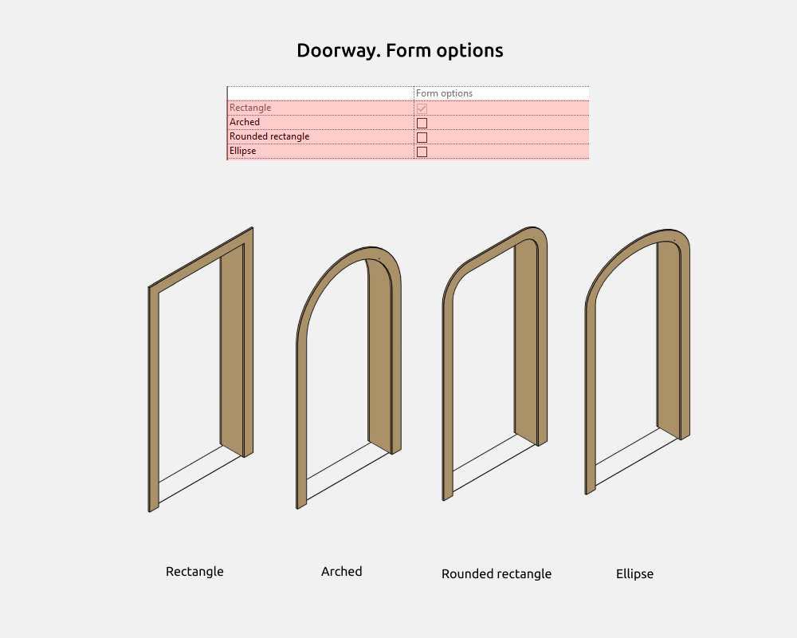

En la familia puedes elegir tipos con distintas formas de hueco:

- Rectangular (Rectangle)
- En arco (Arched)
- Rectangular con esquinas redondeadas (Rounded rectangle)
- Elíptica (Ellipse)

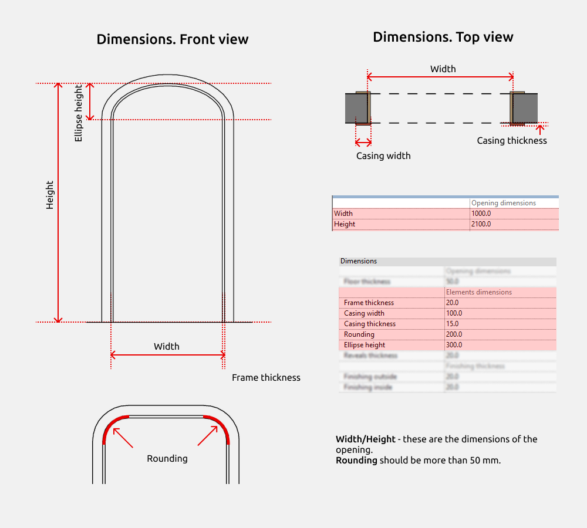

El ancho (**Width**) y el alto (**Height**) son las dimensiones del hueco.

El radio de redondeo (**Rounding**) tiene que ser mayor que 50 mm.

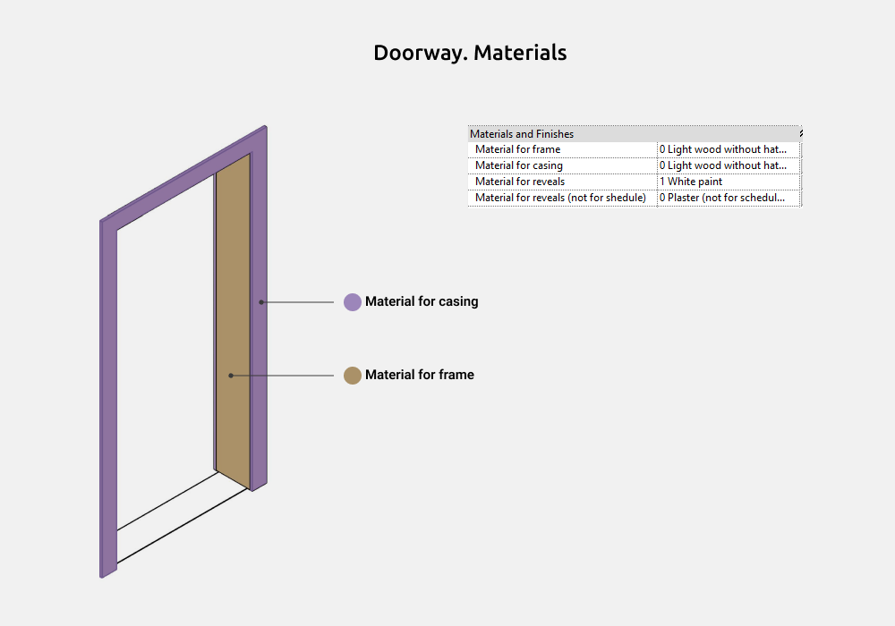

### Etiqueta de puertas

La etiqueta de puertas tiene tres tipos:

- Etiqueta (Tag)
- Etiqueta y dimensión del hueco (Tag + Opening dimension)
- Dimensión del hueco (Opening dimension)

## 5. PRESENTACIÓN

### Ajustes de gráficos

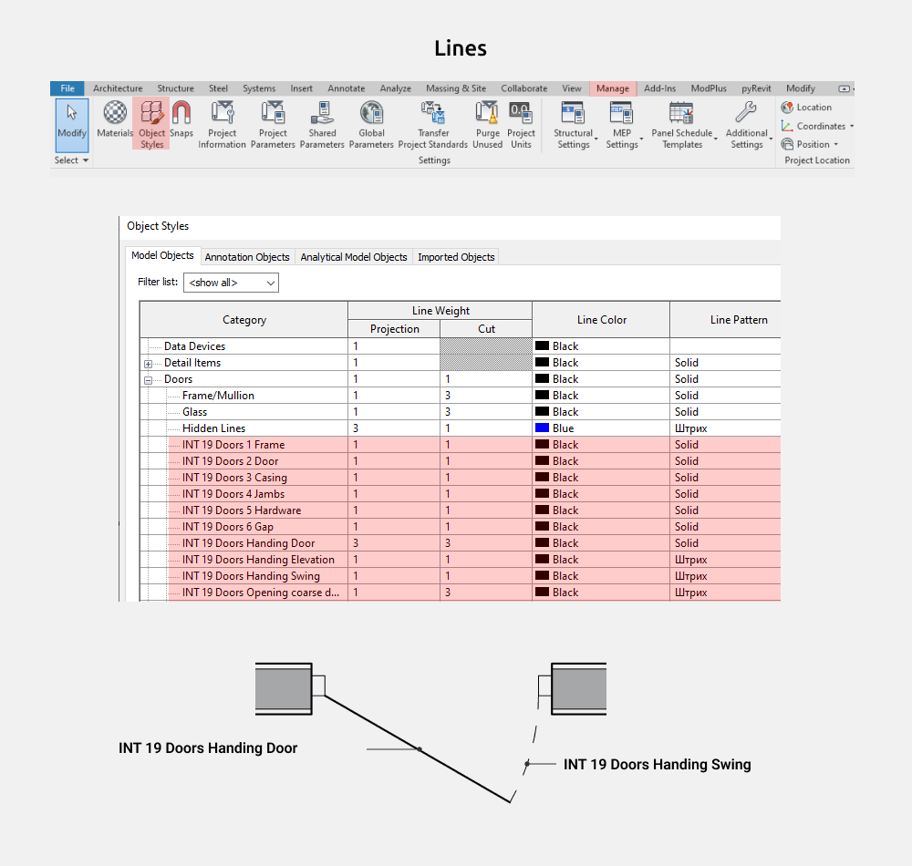

Para cambiar el color, el grosor o el tipo de línea de las familias, ve a Gestionar, Estilos de objeto, Puertas.

<CTA type="guide" />
