import productPreview from './product.png';

<ProductCard
  name="Familias de cocinas para Revit"
  eyebrow="Conjunto de familias de Revit"
  description="Muebles, electrodomésticos y encimeras para montar una cocina en tu proyecto de Revit."
  image={productPreview}
  imageAlt="Vista previa del conjunto de familias de cocinas para Revit"
  buyUrl="https://bimcore.one/products/kitchen-revit-families-v-3"
  ecwidProductId="543629545"
  buyLabel="Comprar"
  shopLabel="Ir a la tienda"
/>

## 1. INFORMACIÓN GENERAL

- Nombre del conjunto Familias de cocinas
- Versión del conjunto 3.2.1
- Versión de Revit 2019

### Descripción

Este conjunto de familias permite modelar una cocina en Autodesk Revit.

Con las familias puedes crear una cocina con dimensiones precisas y contar sus módulos.

Está pensado para diseñadores de interiores y arquitectos. Las familias no tienen el nivel de detalle necesario para que un fabricante de muebles desarrolle la cocina para su fabricación.

### Carga y colocación

Para ver y cargar las familias que necesites, abre el proyecto con la cocina, cópialas con Ctrl+C y pégalas en tu proyecto con Ctrl+V. También puedes abrir la carpeta de archivos de familia y arrastrarlos al proyecto.

:::note
Las imágenes y los nombres de los parámetros corresponden a la versión inglesa del conjunto. Las explicaciones están en español.
:::

## 2. CONTENIDO DEL CONJUNTO

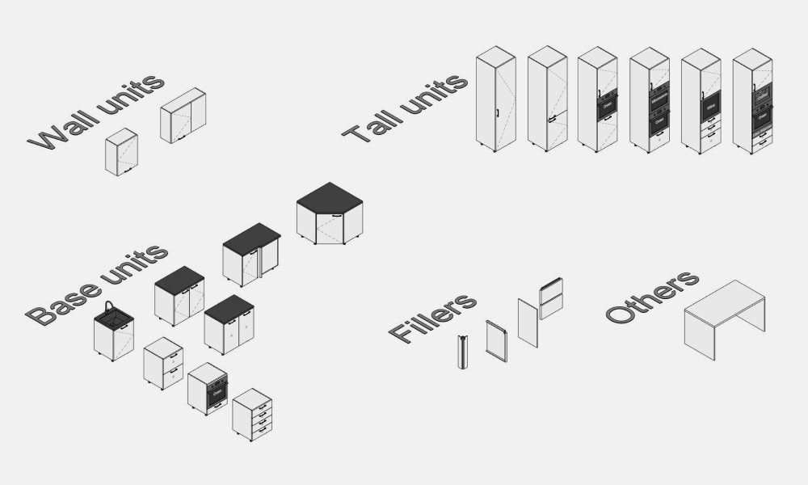

El conjunto incluye las siguientes familias.

Muebles bajos

- Mueble bajo, tipos x1, x2, x3 y x4
- Mueble bajo de dos puertas, con opciones de 2 puertas o 2 cajones
- Mueble bajo en L
- Mueble bajo en V

Muebles altos

- Mueble alto
- Mueble alto en L

Mueble columna

- Mueble columna, tipos x1, x2, x3, x4, x5 y x6

Piezas de remate

- Pieza de relleno
- Pieza de relleno de esquina
- Panel
- Panel con perfil Gola

Otros elementos

- Encimera de isla

## 3. ELEMENTOS COMUNES

En este apartado se explica qué elementos componen los módulos y cómo ajustarlos.

### Elementos comunes

Son los elementos que se repiten en los módulos de cocina.

Los módulos comparten los siguientes elementos.

- Frentes (**Doors**)
- Tiradores (**Handles**)
- Patas (**Legs**)
- Apertura (**Opening**)
- Cuerpo del mueble (**Frame**)
- Panel trasero (**Back**), que forma parte del cuerpo
- Lateral izquierdo (**LH**), que forma parte del cuerpo
- Lateral derecho (**RH**), que forma parte del cuerpo

### Frentes

En la lista desplegable de cada familia de módulo puedes elegir los siguientes tipos de frente.

- Sin frente (None)
- Estándar (Standart)
- Marco interior (Frame inside)
- Marco exterior (Frame outside)
- Con tirador integrado arriba (Integrated Up)
- Con tirador integrado a la izquierda (Integrated Left)
- Con tirador integrado a la derecha (Integrated Right)
- Con tirador integrado abajo (Integrated Down)

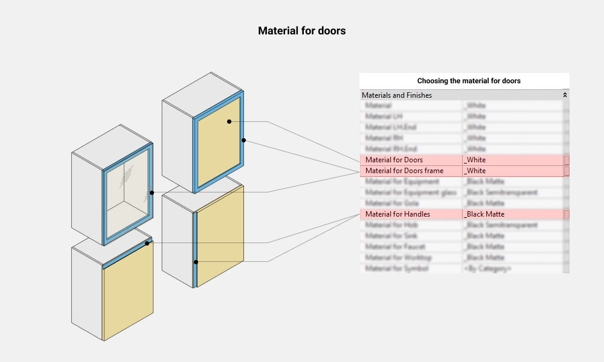

### Tiradores

#### Tipos de tiradores

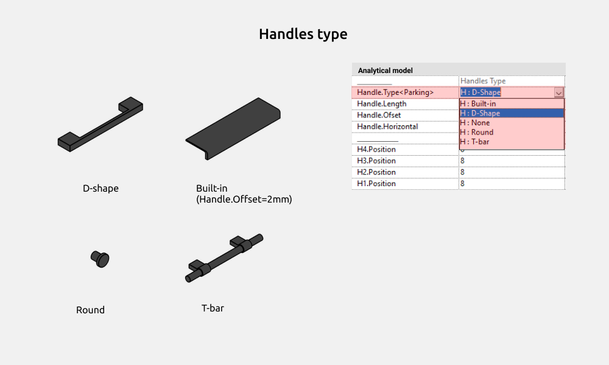

En la lista desplegable de cada familia de módulo puedes elegir los siguientes tipos.

- Sin tirador (None)
- Asa (D-shape)
- Tirador de borde (Built-in)
- Pomo (Round)
- Tirador en T (T-bar)

Para el tirador de borde, introduce 2 mm en **Handle.Offset** para desplazarlo hasta el borde del frente.

La representación del tirador en T cambia según la longitud indicada en **Handle.Length**.

#### Colocación de los tiradores

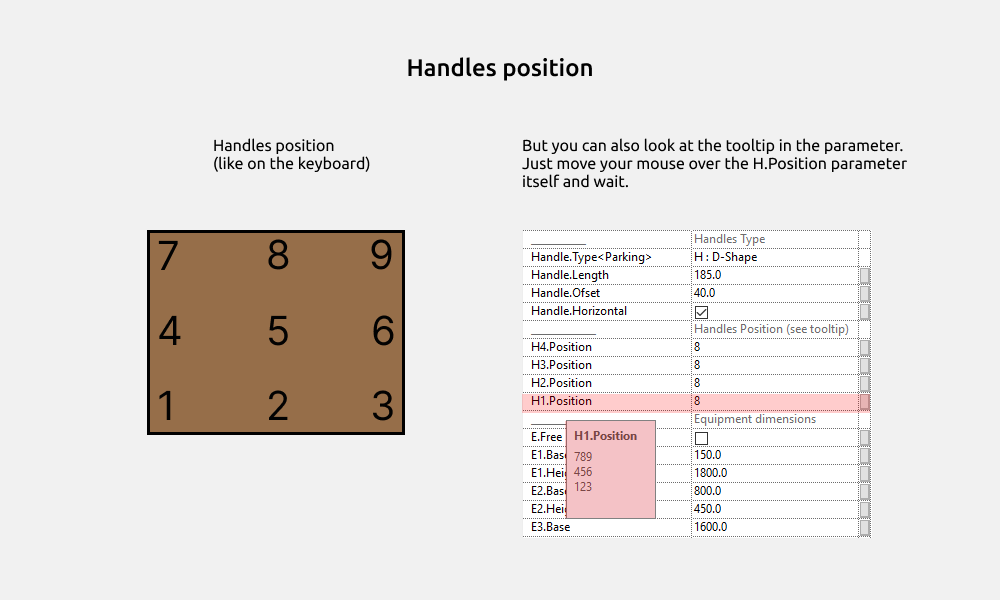

La posición se selecciona mediante números del 1 al 9, distribuidos como en un teclado numérico.

También puedes consultar la ayuda del parámetro **H.Position**.

El parámetro **Handle.Horizontal** permite colocar los tiradores en horizontal o en vertical.

### Apertura

#### Tipos de apertura

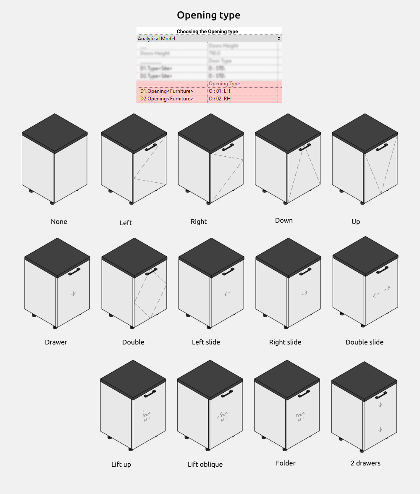

En la lista desplegable de cada familia de módulo puedes elegir las siguientes opciones.

- Sin apertura (None)
- Izquierda (Left)
- Derecha (Right)
- Hacia abajo (Down)
- Hacia arriba (Up)
- Cajón (Drawer)
- Doble (Double)
- Corredera hacia la izquierda (Left slide)
- Corredera hacia la derecha (Right slide)
- Corredera doble (Double slide)
- Elevable (Lift up)
- Elevable con inclinación (Lift oblique)
- Plegable (Folder)
- 2 cajones (2 drawers)

La apertura de los frentes es independiente de la posición de los tiradores.

#### Representación de la apertura RU / ENG

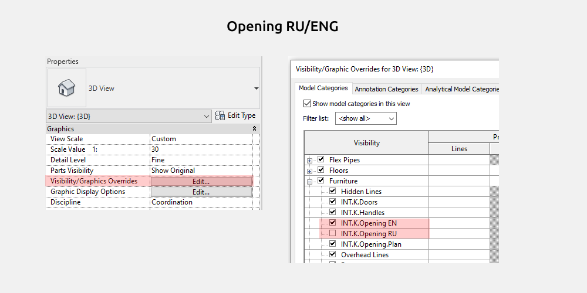

Para activar la representación RU o ENG, abre **Modificaciones de visibilidad/gráficos**, busca **Mobiliario** y selecciona la representación de apertura que necesites.

### Laterales

Todos los cuerpos incluyen un lateral izquierdo, **LH**, y otro derecho, **RH**. Están activados por defecto y puedes desactivarlos si lo necesitas.

**LH.End** y **RH.End** añaden un panel lateral adicional que cubre el canto del frente.

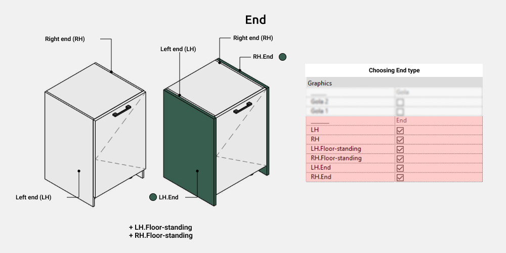

Los módulos apoyados en el suelo incluyen las opciones adicionales **LH.Floor-standing** y **RH.Floor-standing**, que prolongan los laterales hasta el suelo, además de **LH.End** y **RH.End**.

## 4. FAMILIAS

### Mueble bajo

El mueble bajo sirve para montar los módulos de cocina apoyados en el suelo, con una superficie de trabajo para preparar alimentos.

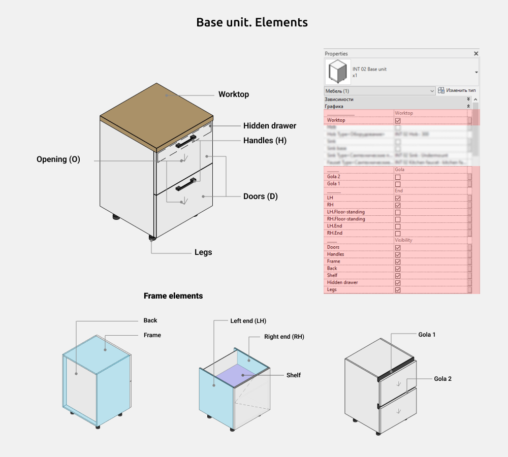

Puedes activar o desactivar los siguientes elementos.

- Encimera (**Worktop**)
- Tiradores (**Handles**)
- Frentes (**Doors**)
- Cuerpo del mueble (**Frame**)
- Panel trasero (**Back**)
- Balda (**Shelf**)
- Cajón interior (**Hidden drawer**), representado con línea discontinua
- Patas (**Legs**)
- Perfiles Gola
- Las opciones de laterales descritas anteriormente

También puedes incorporar los siguientes elementos de equipamiento.

- Placa eléctrica (**Hob**)
- Fregadero (**Sink**), que activa automáticamente el grifo
- Equipamiento en el lugar de un frente (Equipment in the Door)

#### Tipos de familia

Los tipos se denominan según el número de frentes del módulo.

- x1
- x2
- x3
- x4

Los frentes se numeran de abajo arriba. D1 corresponde al inferior y D4 al superior.

Para cambiar el número de frentes del mueble bajo, selecciona el tipo de familia correspondiente. No se cambia mediante parámetros de ejemplar.

Selecciona x1 para un frente, x2 para dos y así sucesivamente hasta x4, el máximo de esta familia.

#### Dimensiones

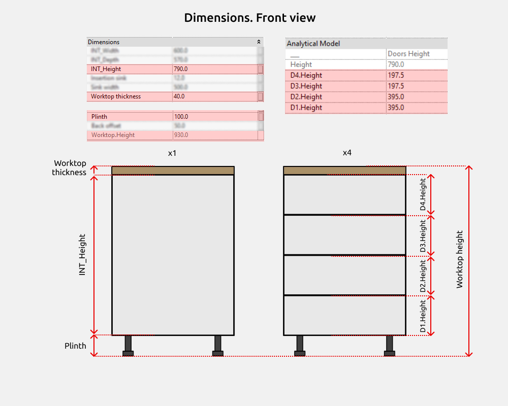

Los parámetros **Width**, **Depth** y **Height** corresponden al ancho, fondo y alto del cuerpo del mueble. El espesor de los frentes, **Door thickness**, el espesor de la encimera, **Worktop thickness**, y la altura del zócalo, **Plinth**, se ajustan por separado.

En planta, el fondo de la encimera se calcula como **Depth** + **Door thickness** + 5 mm. No se introduce de forma independiente.

Los parámetros que aparecen en gris no se pueden editar. Sirven para consultar los resultados de los cálculos. Por ejemplo, **Worktop height** suma las alturas y muestra la cota de la superficie de trabajo cuando la encimera está activada, como se ve en las imágenes.

La familia dispone de cuatro tipos, que permiten configurar hasta cuatro frentes. Cada frente tiene sus propios parámetros.

Si seleccionas x1, ajusta los parámetros con el número 1, **D1.Height**, **E1.Type**, **E1.Closed**, **D1.Type**, **D1.Opening** y **H1.Position**. En x1, la altura **D1.Height** coincide con la altura del cuerpo. Si seleccionas x2, utiliza los parámetros de los frentes 1 y 2.

Empieza a definir **D.Height**, la altura de los frentes, por el inferior. La altura del último frente, el superior, no se modifica directamente.

Por ejemplo, con el tipo x3 puedes ajustar **D1.Height** y **D2.Height**. **D3.Height** se calcula a partir de las dos primeras alturas.

Si las alturas de los frentes superan la altura del cuerpo, se producirá un error. En ese caso, deshaz la operación e introduce valores menores en **D.Height**.

#### Placa eléctrica

Selecciona el tipo de placa eléctrica en la lista desplegable.

- 300, con 2 zonas de cocción
- 450, con 3 zonas de cocción
- 580, con 4 zonas de cocción
- 880, con 6 zonas de cocción

Elige únicamente las opciones cuyo nombre comienza por INT 02 Hob. En la lista también pueden aparecer otras familias cargadas en el proyecto que no corresponden a esta selección.

#### Fregadero

La lista desplegable ofrece dos tipos de fregadero.

- Sobre encimera (Topmount)
- Bajo encimera (Undermount)

Elige únicamente las opciones cuyo nombre comienza por INT 02 Sink. La lista también puede incluir otras familias que no corresponden a esta selección.

El grifo de cocina dispone de dos alturas.

- 360
- 450

Selecciona una opción cuyo nombre comience por INT 02 Kitchen faucet.

Puedes desplazar el fregadero y la placa eléctrica a izquierda o derecha del eje central de la encimera. El ancho del fregadero se ajusta con **Sink width**.

Si estos elementos no se adaptan a lo que necesitas, desactívalos y coloca una familia independiente en el proyecto.

#### Perfiles Gola

**Gola 1** activa el perfil en la parte superior del cuerpo, bajo la encimera. **Gola 2** se sitúa entre los cajones, en el centro del cuerpo. Al aumentar o reducir la altura del cuerpo, las alturas h de los frentes cambian de forma uniforme y **Gola 2** permanece en el centro.

#### Equipamiento

Puedes colocar equipamiento en el lugar de un frente. Selecciona el número de frente y el tipo de equipamiento en la lista desplegable.

Hay dos grupos de equipamiento.

- Empotrado (Built-in)
- Integrado (Integrated)

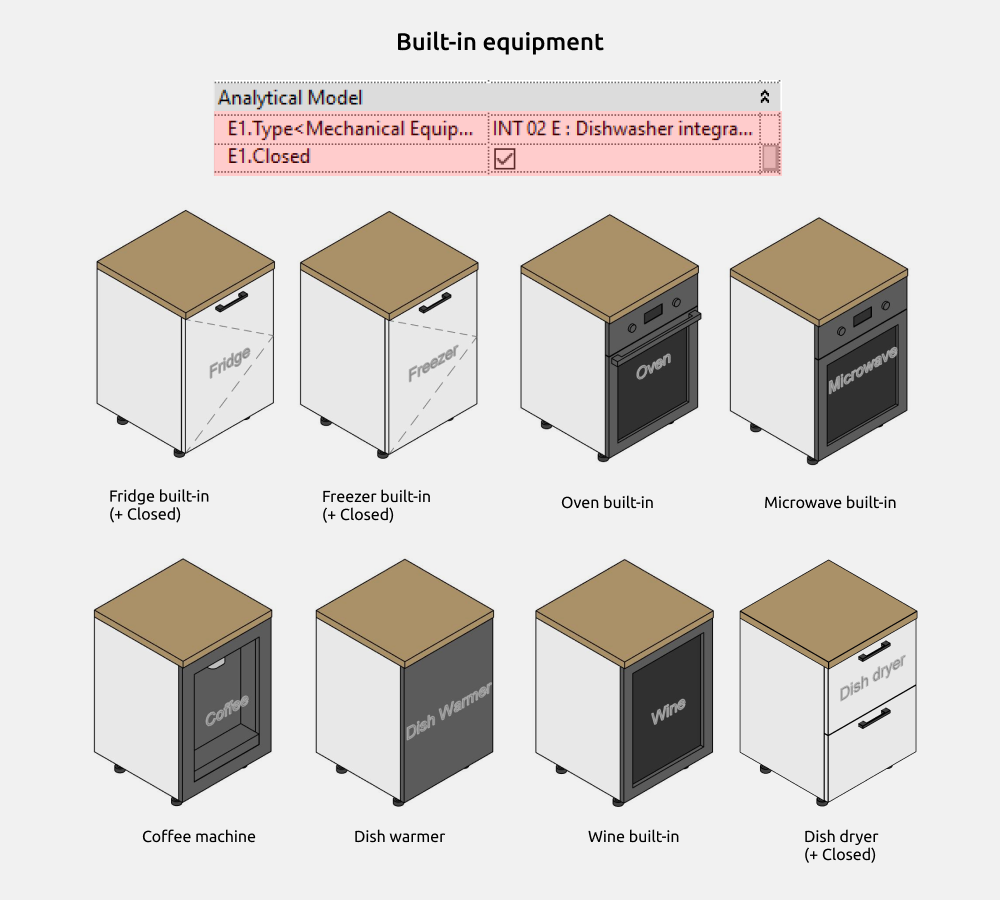

El grupo de equipamiento empotrado incluye los siguientes elementos.

- Vinoteca empotrada (Wine built-in)
- Horno empotrado (Oven built-in)
- Cafetera (Coffee machine)
- Microondas empotrado (Microwave built-in)
- Congelador empotrado (Freezer built-in)
- Calientaplatos (Dish warmer)
- Frigorífico empotrado (Fridge built-in)
- Escurreplatos (Dish dryer)

El grupo de equipamiento integrado incluye los siguientes elementos.

- Vinoteca integrada (Wine integrated)
- Congelador integrado (Freezer integrated)
- Lavavajillas integrado (Dishwashing integrated)
- Lavadora (Washing machine)
- Frigorífico integrado (Fridge integrated)

#### Materiales

### Mueble bajo de dos puertas

Esta familia permite montar muebles de cocina apoyados en el suelo con una superficie de trabajo. A diferencia del mueble bajo anterior, no admite equipamiento en el lugar de los frentes y tiene únicamente dos frentes.

Puedes activar o desactivar los siguientes elementos.

- Encimera (**Worktop**)
- Tiradores (**Handles**)
- Frentes (**Doors**)
- Cuerpo del mueble (**Frame**)
- Panel trasero (**Back**)
- Patas (**Legs**)
- Perfiles Gola
- Las opciones de laterales descritas anteriormente

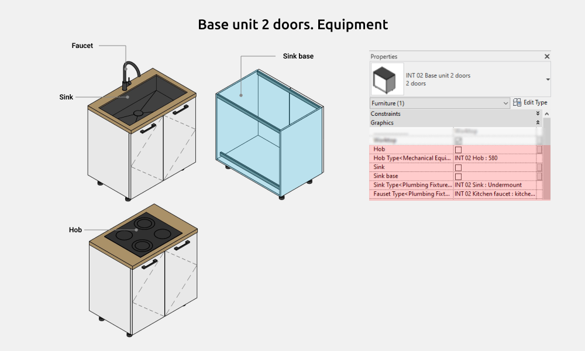

También puedes incorporar una placa eléctrica y un fregadero. Al activar el fregadero se activa automáticamente el grifo.

#### Tipos de familia

Los tipos se denominan según la apertura de los frentes.

- 2 puertas (2 doors)
- 2 cajones (2 drawers)

#### Dimensiones

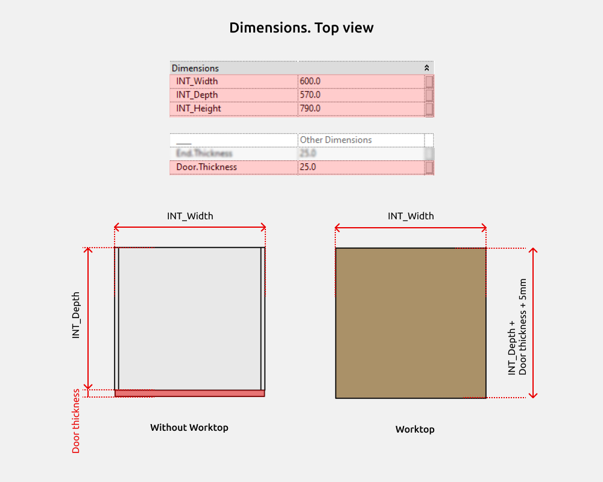

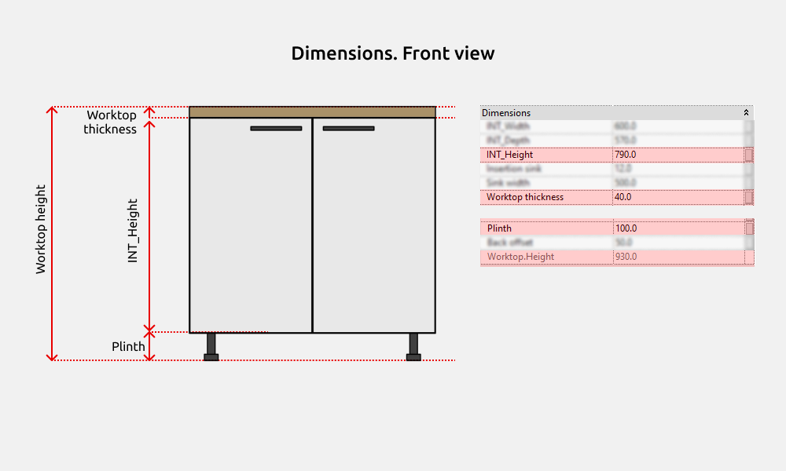

Los parámetros **Width**, **Depth** y **Height** corresponden al ancho, fondo y alto del cuerpo del mueble. El espesor de los frentes, **Door thickness**, el espesor de la encimera, **Worktop thickness**, y la altura del zócalo, **Plinth**, se ajustan por separado.

En planta, el fondo de la encimera se calcula como **Depth** + **Door thickness** + 5 mm. No se introduce de forma independiente.

Los parámetros que aparecen en gris no se pueden editar. Sirven para consultar los resultados de los cálculos. Por ejemplo, **Worktop height** suma las alturas y muestra la cota de la superficie de trabajo cuando la encimera está activada, como se ve en las imágenes.

En esta familia no es necesario introducir el alto ni el ancho de los frentes. Se calculan automáticamente a partir de las dimensiones del módulo.

#### Placa eléctrica

Selecciona el tipo de placa eléctrica en la lista desplegable.

- 300, con 2 zonas de cocción
- 450, con 3 zonas de cocción
- 580, con 4 zonas de cocción
- 880, con 6 zonas de cocción

Elige únicamente las opciones cuyo nombre comienza por INT 02 Hob. En la lista también pueden aparecer otras familias cargadas en el proyecto que no corresponden a esta selección.

#### Fregadero

La lista desplegable ofrece dos tipos de fregadero.

- Sobre encimera (Topmount)
- Bajo encimera (Undermount)

Elige únicamente las opciones cuyo nombre comienza por INT 02 Sink. La lista también puede incluir otras familias que no corresponden a esta selección.

El grifo de cocina dispone de dos alturas.

- 360
- 450

Selecciona una opción cuyo nombre comience por INT 02 Kitchen faucet.

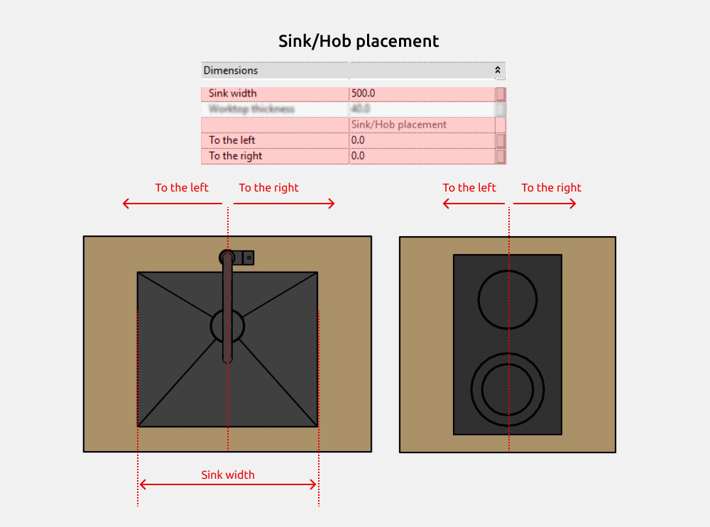

Puedes desplazar el fregadero y la placa eléctrica a izquierda o derecha del eje central de la encimera. El ancho del fregadero se ajusta con **Sink width**.

Si estos elementos no se adaptan a lo que necesitas, desactívalos y coloca una familia independiente en el proyecto.

#### Perfil Gola

**Gola 1** activa el perfil en la parte superior del cuerpo, bajo la encimera.

#### Materiales

### Mueble bajo en L

Esta familia permite montar muebles bajos de esquina con una superficie de trabajo. A diferencia del mueble bajo estándar, no admite equipamiento en el lugar del frente y tiene un solo frente.

Puedes activar o desactivar los siguientes elementos.

- Encimera (**Worktop**)
- Tiradores (**Handles**)
- Frente (**Doors**)
- Cuerpo del mueble (**Frame**)
- Panel trasero (**Back**)
- Panel lateral de remate
- Pieza de relleno
- Patas (**Legs**)
- Perfil Gola
- Las opciones de laterales descritas anteriormente

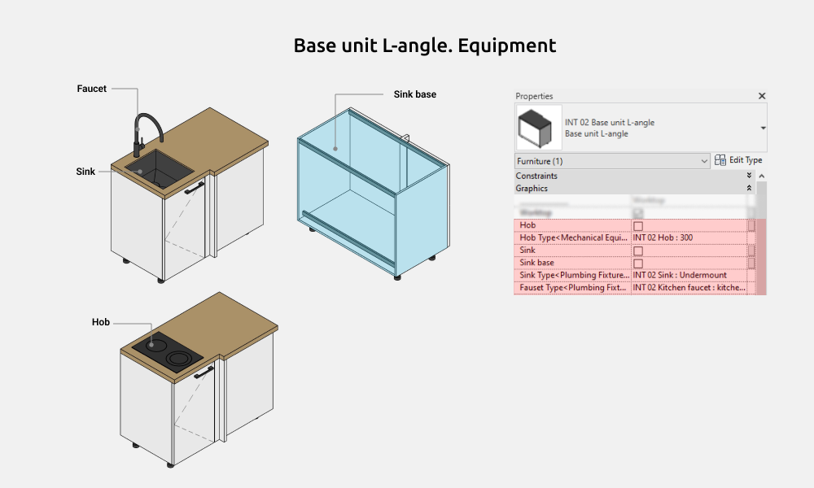

También puedes incorporar una placa eléctrica y un fregadero. Al activar el fregadero se activa automáticamente el grifo.

Esta familia no dispone de variantes de tipo.

#### Dimensiones

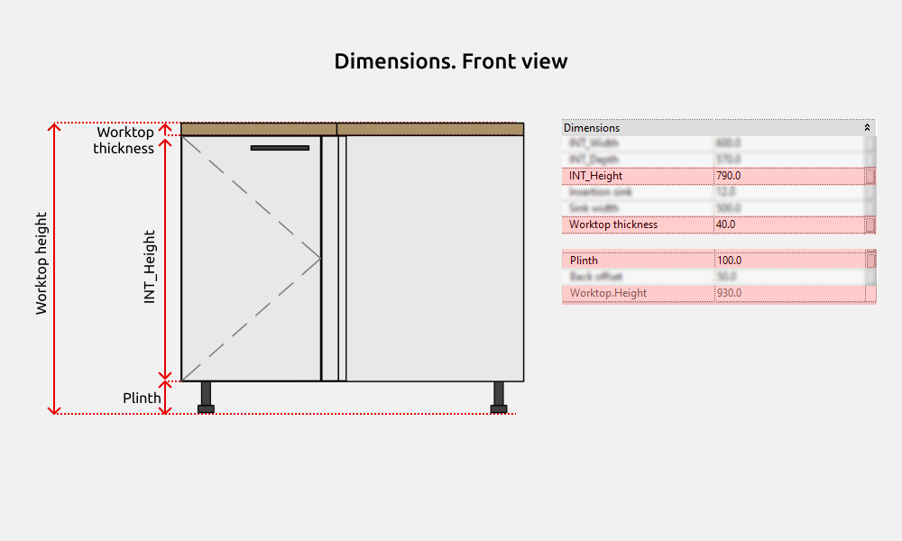

Los parámetros **Width**, **Depth** y **Height** corresponden al ancho, fondo y alto del cuerpo del mueble. El espesor de los frentes, **Door thickness**, el espesor de la encimera, **Worktop thickness**, y la altura del zócalo, **Plinth**, se ajustan por separado.

En planta, el fondo de la encimera se calcula como **Depth** + **Door thickness** + 5 mm. No se introduce de forma independiente.

Los parámetros que aparecen en gris no se pueden editar. Sirven para consultar los resultados de los cálculos. Por ejemplo, **Worktop height** suma las alturas y muestra la cota de la superficie de trabajo cuando la encimera está activada, como se ve en las imágenes.

En esta familia no es necesario introducir el alto ni el ancho de los frentes. Se calculan automáticamente a partir de las dimensiones del módulo.

#### Placa eléctrica

Selecciona el tipo de placa eléctrica en la lista desplegable.

- 300, con 2 zonas de cocción
- 450, con 3 zonas de cocción
- 580, con 4 zonas de cocción
- 880, con 6 zonas de cocción

Elige únicamente las opciones cuyo nombre comienza por INT 02 Hob. En la lista también pueden aparecer otras familias cargadas en el proyecto que no corresponden a esta selección.

#### Fregadero

La lista desplegable ofrece dos tipos de fregadero.

- Sobre encimera (Topmount)
- Bajo encimera (Undermount)

Elige únicamente las opciones cuyo nombre comienza por INT 02 Sink. La lista también puede incluir otras familias que no corresponden a esta selección.

El grifo de cocina dispone de dos alturas.

- 360
- 450

Selecciona una opción cuyo nombre comience por INT 02 Kitchen faucet.

Puedes desplazar el fregadero y la placa eléctrica a izquierda o derecha del eje central de la encimera. El ancho del fregadero se ajusta con **Sink width**.

Si estos elementos no se adaptan a lo que necesitas, desactívalos y coloca una familia independiente en el proyecto.

#### Perfil Gola

**Gola 1** activa el perfil en la parte superior del cuerpo, bajo la encimera.

#### Materiales

### Mueble bajo en V

Esta familia permite montar muebles bajos de esquina con una superficie de trabajo. A diferencia del mueble bajo estándar, no admite equipamiento en el lugar del frente y tiene un solo frente.

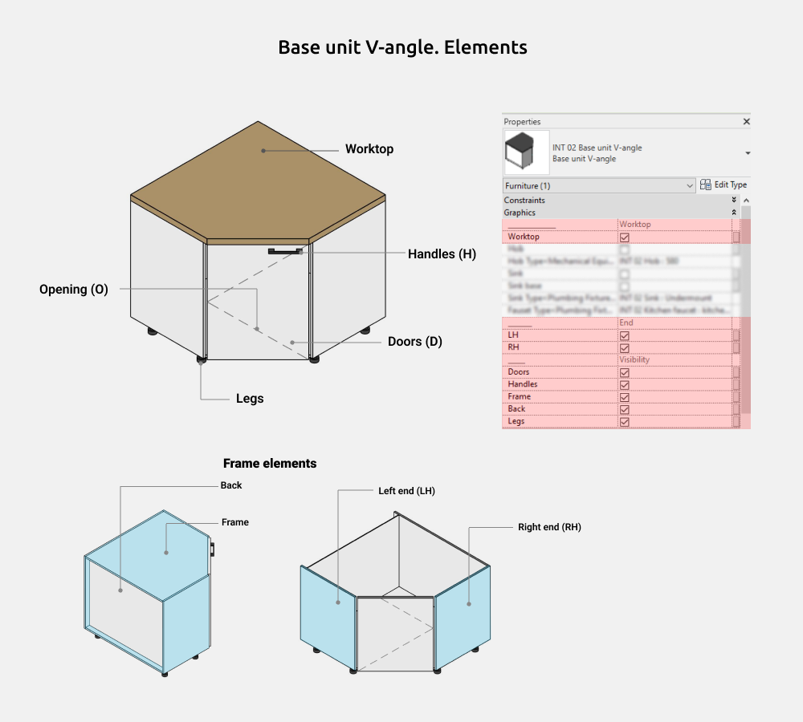

Puedes activar o desactivar los siguientes elementos.

- Encimera (**Worktop**)
- Tiradores (**Handles**)
- Frente (**Doors**)
- Cuerpo del mueble (**Frame**)
- Panel trasero (**Back**)
- Patas (**Legs**)
- Laterales izquierdo y derecho (**LH, RH**)

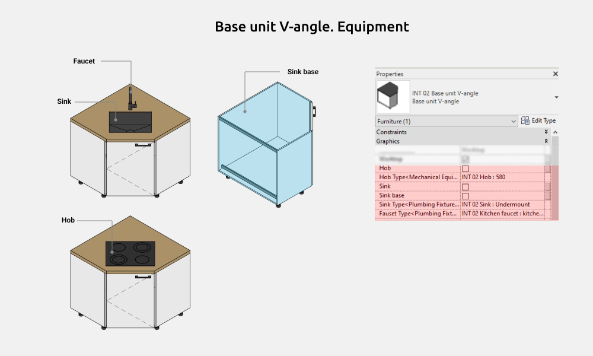

También puedes incorporar una placa eléctrica y un fregadero. Al activar el fregadero se activa automáticamente el grifo.

Esta familia no dispone de variantes de tipo.

#### Dimensiones

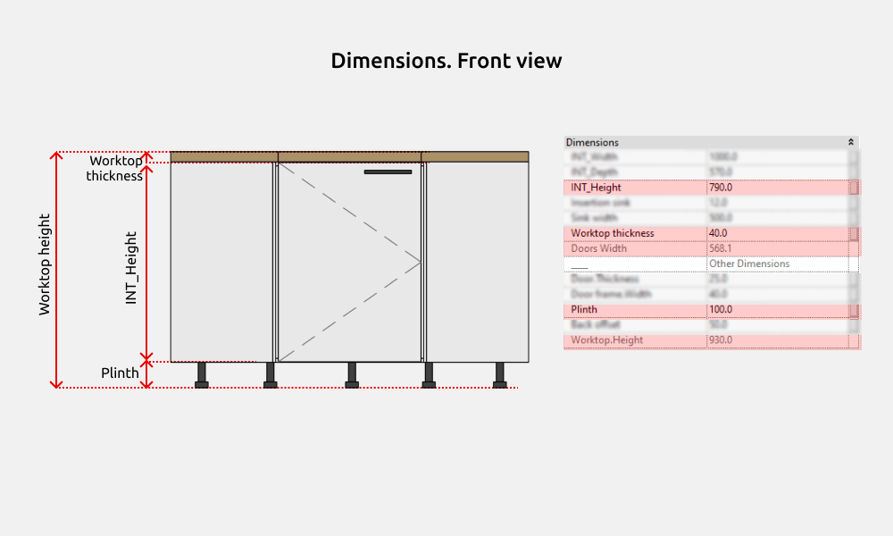

Los parámetros **Width**, **Depth** y **Height** corresponden al ancho, fondo y alto del cuerpo del mueble. El espesor de los frentes, **Door thickness**, el espesor de la encimera, **Worktop thickness**, y la altura del zócalo, **Plinth**, se ajustan por separado.

En planta, el fondo de la encimera se calcula como **Depth** + **Door thickness** + 5 mm. No se introduce de forma independiente.

Los parámetros que aparecen en gris no se pueden editar. Sirven para consultar los resultados de los cálculos. Por ejemplo, **Worktop height** suma las alturas y muestra la cota de la superficie de trabajo cuando la encimera está activada, como se ve en las imágenes.

En esta familia no es necesario introducir el alto ni el ancho de los frentes. Se calculan automáticamente a partir de las dimensiones del módulo.

#### Placa eléctrica

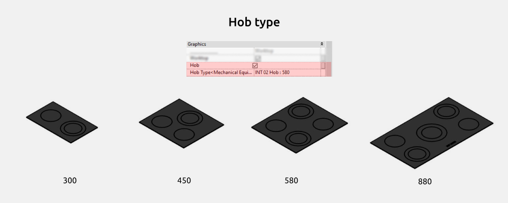

Selecciona el tipo de placa eléctrica en la lista desplegable.

- 300, con 2 zonas de cocción
- 450, con 3 zonas de cocción
- 580, con 4 zonas de cocción
- 880, con 6 zonas de cocción

Elige únicamente las opciones cuyo nombre comienza por INT 02 Hob. En la lista también pueden aparecer otras familias cargadas en el proyecto que no corresponden a esta selección.

#### Fregadero

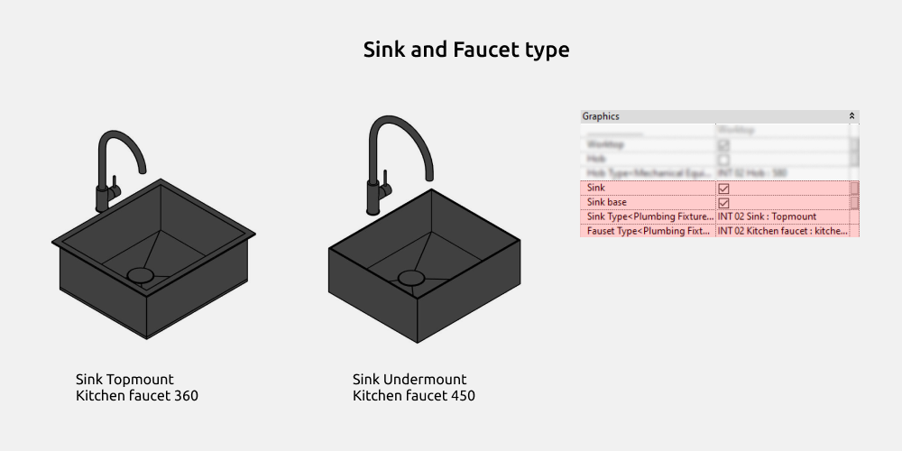

La lista desplegable ofrece dos tipos de fregadero.

- Sobre encimera (Topmount)
- Bajo encimera (Undermount)

Elige únicamente las opciones cuyo nombre comienza por INT 02 Sink. La lista también puede incluir otras familias que no corresponden a esta selección.

El grifo de cocina dispone de dos alturas.

- 360
- 450

Selecciona una opción cuyo nombre comience por INT 02 Kitchen faucet.

En este módulo, el fregadero y la placa eléctrica se sitúan sobre el eje central de la encimera y NO pueden desplazarse a izquierda o derecha. El ancho del fregadero se ajusta con **Sink width**.

Si estos elementos no se adaptan a lo que necesitas, desactívalos y coloca una familia independiente en el proyecto.

#### Materiales

### Mueble columna

La familia permite montar muebles columna de cocina apoyados en el suelo, con o sin electrodomésticos empotrados.

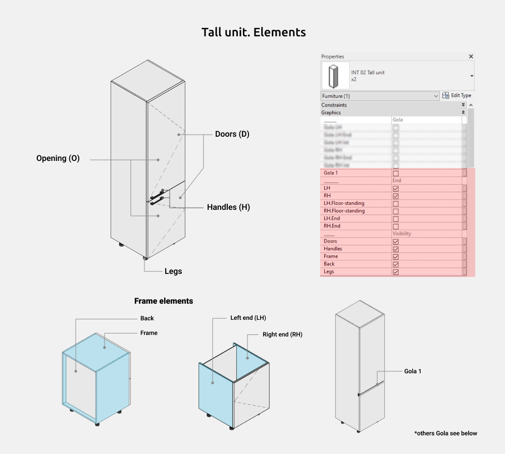

Puedes activar o desactivar los siguientes elementos.

- Encimera (**Worktop**)
- Tiradores (**Handles**)
- Frentes (**Doors**)
- Cuerpo del mueble (**Frame**)
- Panel trasero (**Back**)
- Patas (**Legs**)
- Perfil Gola
- Las opciones de laterales descritas anteriormente

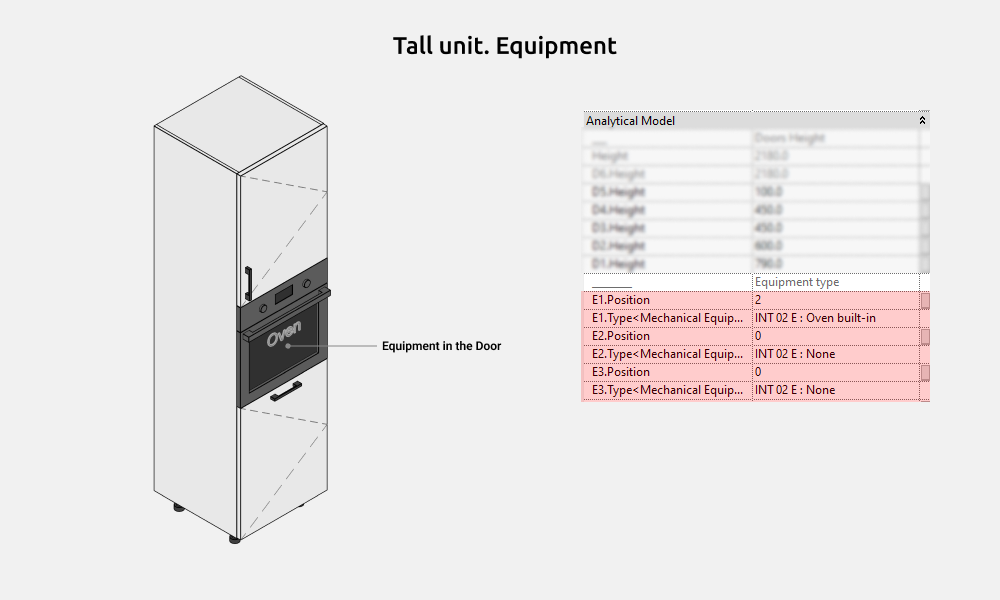

También puedes incorporar equipamiento en el lugar de un frente.

#### Tipos de familia

Los tipos se denominan según el número de frentes del módulo.

- x1
- x2
- x3
- x4
- x5
- x6

Los frentes se numeran de abajo arriba. D1 corresponde al inferior y D6 al superior.

Para cambiar el número de frentes, selecciona el tipo de familia correspondiente. No se cambia mediante parámetros de ejemplar. Selecciona x1 para un frente, x2 para dos y así sucesivamente hasta x6, el máximo de esta familia.

#### Dimensiones

**Width**, **Depth** y **Height** corresponden al ancho, fondo y alto del cuerpo. El espesor de los frentes, **Door thickness**, y la altura del zócalo, **Plinth**, se ajustan por separado.

La familia dispone de seis tipos, que permiten configurar hasta seis frentes. Cada frente tiene sus propios parámetros.

Si seleccionas x1, ajusta los parámetros con el número 1, **D1.Height**, **D1.Type**, **D1.Opening** y **H1.Position**. En x1, **D1.Height** coincide con la altura del cuerpo. Si seleccionas x2, utiliza los parámetros de los frentes 1 y 2.

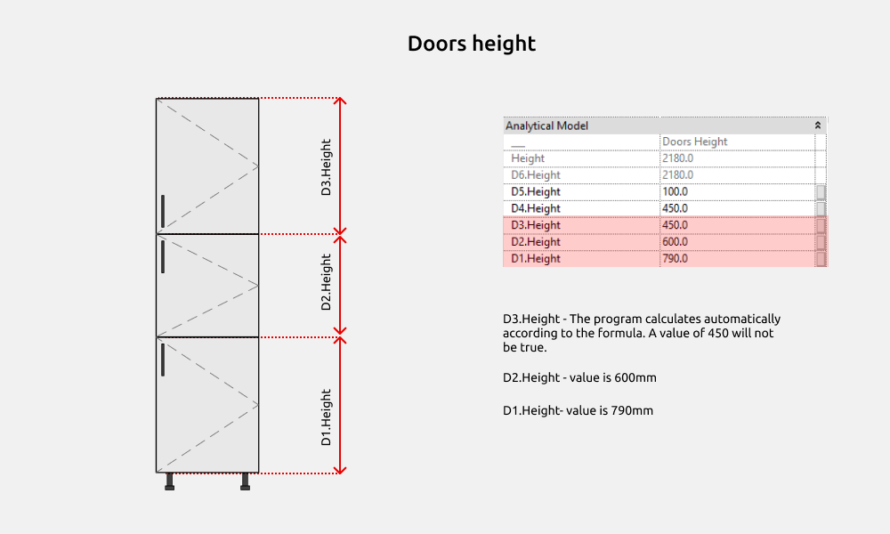

Empieza a definir **D.Height** por el frente inferior. La altura del último frente, el superior, no se modifica directamente. Por ejemplo, con x3 puedes ajustar **D1.Height** y **D2.Height**, mientras que **D3.Height** se calcula a partir de las dos primeras.

Si las alturas de los frentes superan la altura del cuerpo, se producirá un error. En ese caso, deshaz la operación e introduce valores menores en **D.Height**.

#### Perfiles Gola

En el mueble columna puedes activar perfiles Gola verticales a izquierda y derecha del cuerpo, así como perfiles horizontales entre los frentes, **Gola 1**, **Gola 2**, **Gola 3** y **Gola 4**.

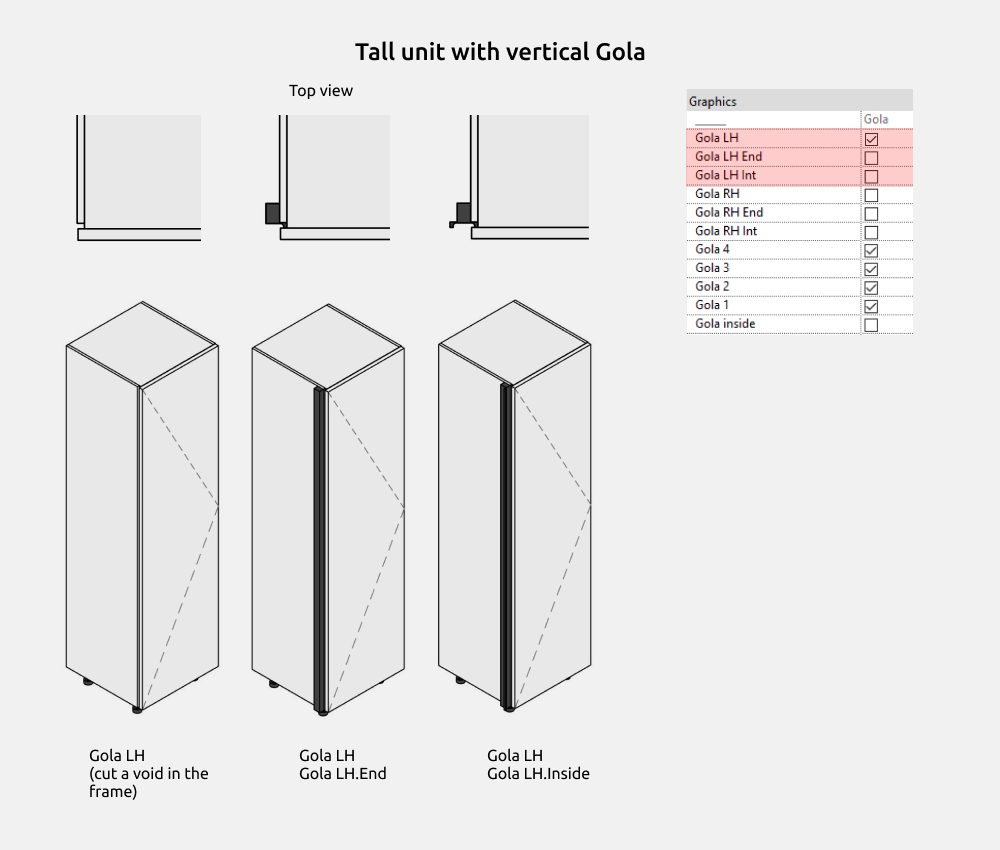

Los perfiles horizontales se numeran de abajo arriba. **Gola 1** corresponde al inferior y **Gola 4** al superior.

El parámetro **Gola inside** desplaza el perfil hacia el interior del cuerpo, dejando visibles los cantos de sus paneles.

#### Equipamiento

Puedes colocar equipamiento en el lugar de un frente. En **E.Position**, selecciona el número del frente que ocupará y elige el tipo de equipamiento en la lista desplegable. Los nombres comienzan por INT 02 E..

Hay dos grupos de equipamiento.

- Empotrado (Built-in)
- Integrado (Integrated)

El grupo de equipamiento empotrado incluye los siguientes elementos.

- Vinoteca empotrada (Wine built-in)
- Horno empotrado (Oven built-in)
- Cafetera (Coffee machine)
- Microondas empotrado (Microwave built-in)
- Congelador empotrado (Freezer built-in)
- Calientaplatos (Dish warmer)
- Frigorífico empotrado (Fridge built-in)
- Escurreplatos (Dish dryer)

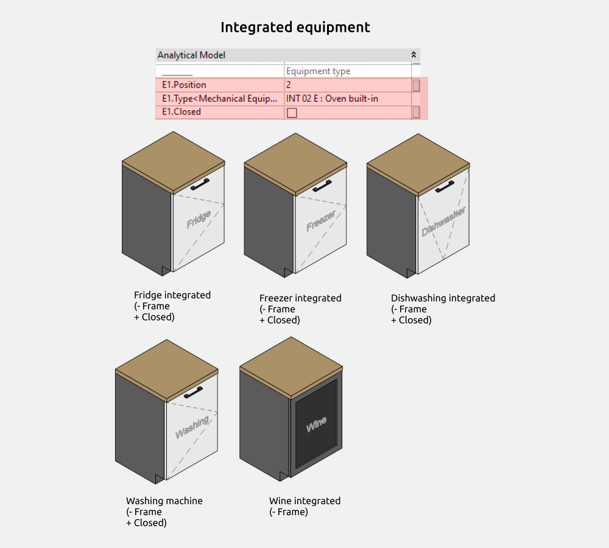

El grupo de equipamiento integrado incluye los siguientes elementos.

- Vinoteca integrada (Wine integrated)
- Congelador integrado (Freezer integrated)
- Lavavajillas integrado (Dishwashing integrated)
- Lavadora (Washing machine)
- Frigorífico integrado (Fridge integrated)

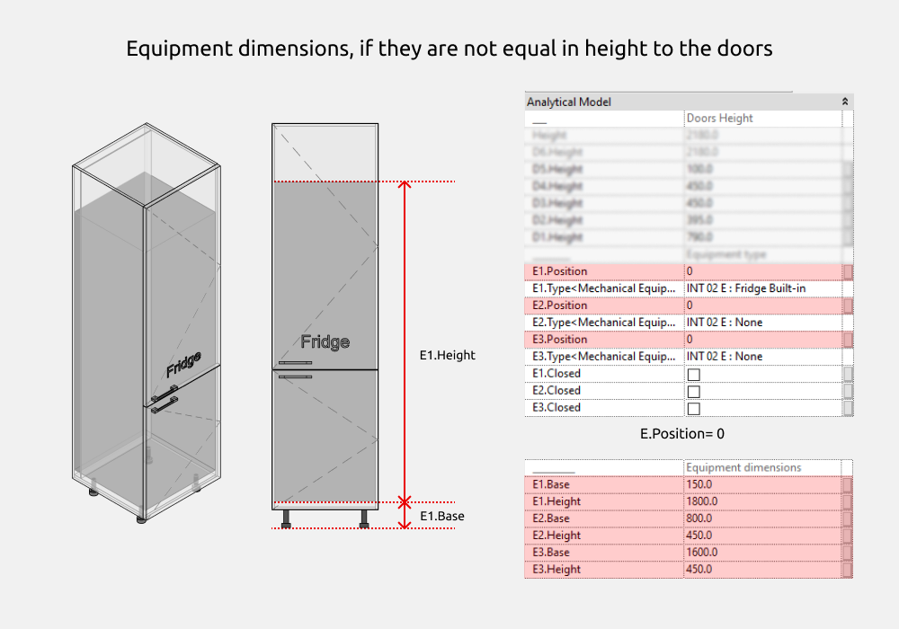

Por defecto, el equipamiento adopta la altura del frente que sustituye. Si necesitas cambiar sus dimensiones y colocarlo libremente, introduce 0 en **E.Position**. Después ajusta **E.Base** y **E.Height**.

#### Materiales

### Mueble alto

Esta familia permite montar los muebles de cocina suspendidos en la pared.

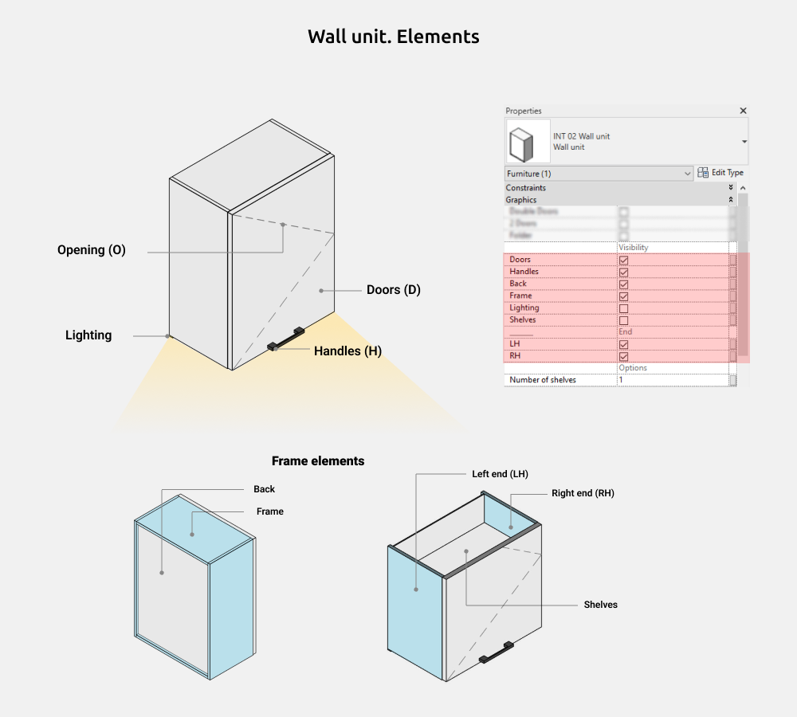

Puedes activar o desactivar los siguientes elementos.

- Tiradores (**Handles**)
- Frentes (**Doors**)
- Cuerpo del mueble (**Frame**)
- Panel trasero (**Back**)
- Iluminación (**Lighting**)
- Baldas (**Shelves**)
- Laterales izquierdo y derecho (**LH, RH**)

También puedes incorporar equipamiento en el lugar de un frente.

#### Número de frentes

El número de frentes se modifica mediante parámetros de ejemplar porque esta familia no dispone de variantes de tipo.

Puedes elegir las siguientes opciones.

- Un frente (Door 1), activado por defecto
- Dos puertas dispuestas horizontalmente (Double doors)
- Dos puertas dispuestas verticalmente (2 doors). A esta opción puedes añadir la apertura plegable, que oculta el tirador superior.

#### Número de baldas

El mueble alto admite de 1 a 3 baldas.

#### Dimensiones

**Width**, **Depth** y **Height** corresponden al ancho, fondo y alto del cuerpo. El espesor de los frentes, **Door thickness**, se ajusta por separado. **Doors elongation** desplaza el frente hacia abajo respecto al cuerpo la distancia indicada.

#### Equipamiento

Puedes colocar equipamiento en el lugar del primer frente, el inferior. Selecciona el tipo en la lista **Equipment type**, eligiendo un nombre que comience por INT 02 Wall E..

Están disponibles los siguientes elementos.

- Campana integrada (Hood integrated)
- Campana telescópica (Hood telescopic)
- Microondas empotrado (Microwave built-in)
- Escurreplatos (Dish dryer)

#### Materiales

### Mueble alto en L

Esta familia permite montar muebles altos de esquina suspendidos en la pared.

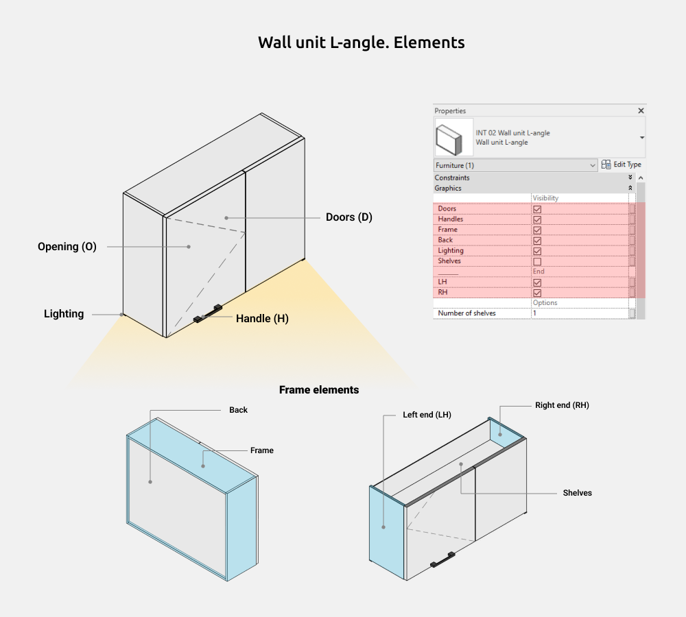

Puedes activar o desactivar los siguientes elementos.

- Tiradores (**Handles**)
- Frente (**Doors**)
- Cuerpo del mueble (**Frame**)
- Panel trasero (**Back**)
- Iluminación (**Lighting**)
- Baldas (**Shelves**)
- Laterales izquierdo y derecho (**LH, RH**)

#### Número de baldas

El mueble alto en L admite de 1 a 3 baldas.

#### Dimensiones

**Width**, **Depth** y **Height** corresponden al ancho, fondo y alto del cuerpo. El espesor de los frentes, **Door thickness**, se ajusta por separado. **Doors elongation** desplaza el frente hacia abajo respecto al cuerpo la distancia indicada.

#### Materiales

## 5. REPRESENTACIÓN EN LOS PLANOS

### Configuración gráfica

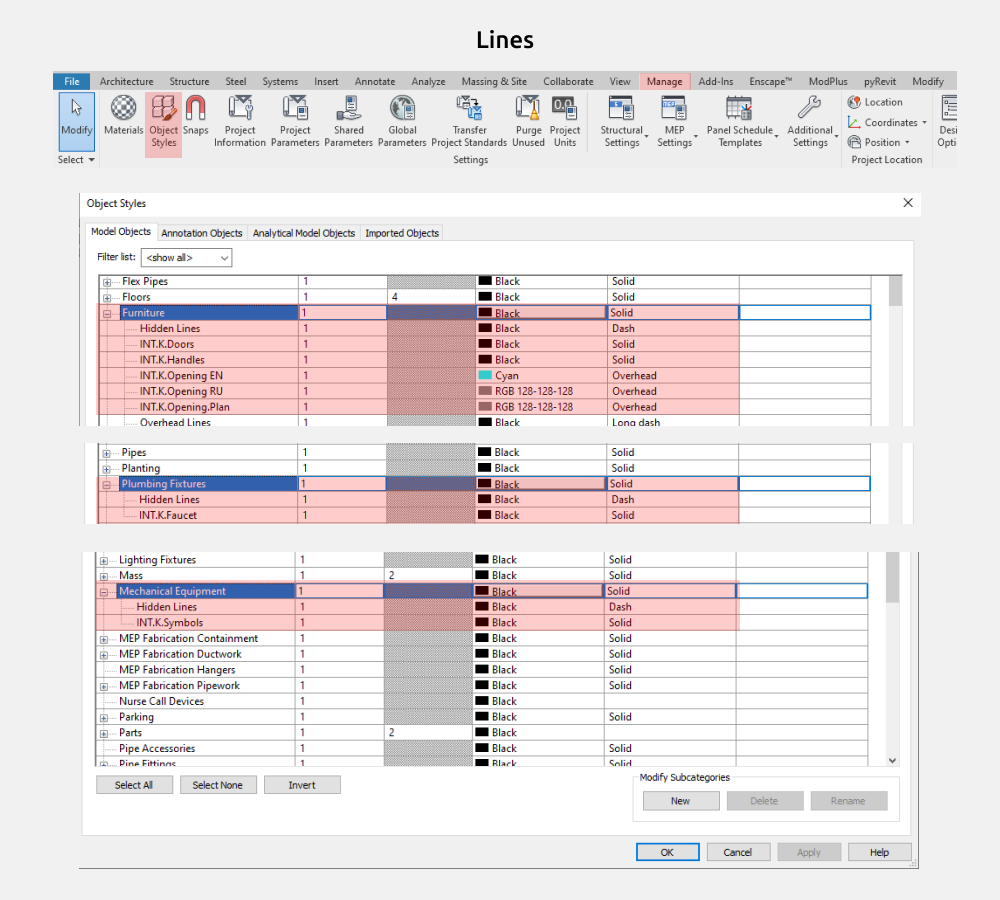

Para cambiar el color, el grosor o el patrón de las líneas de las familias, abre **Gestionar**, después **Estilos de objeto**, y busca las categorías **Mobiliario**, **Equipos mecánicos** y **Aparatos sanitarios**.

### Identificación del equipamiento

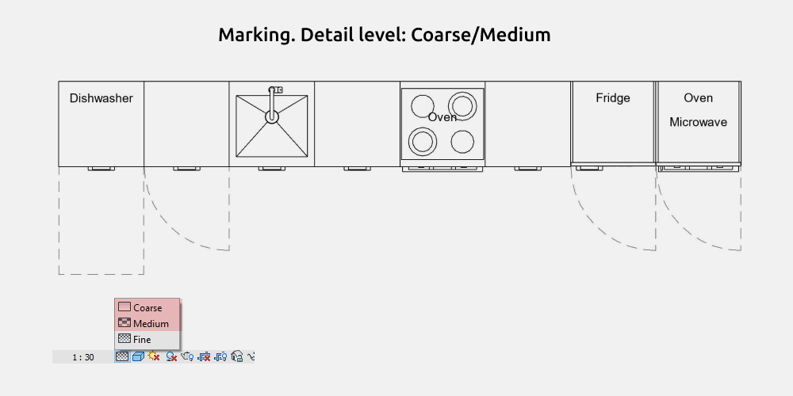

Con el nivel de detalle **Alto**, los símbolos de texto del equipamiento no aparecen en los planos de planta. Con los niveles **Medio** o **Bajo**, el texto sí se muestra.

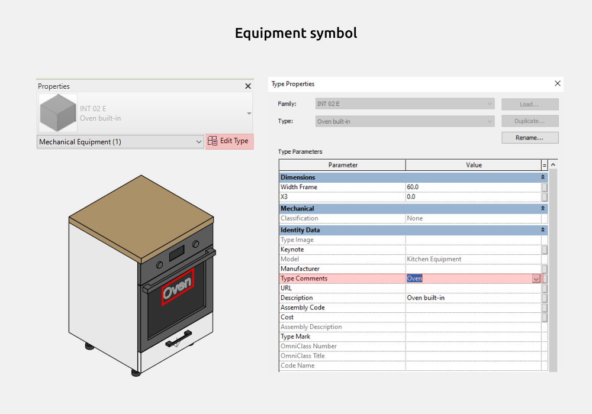

Para cambiar ese texto, selecciona el elemento de equipamiento dentro del módulo utilizando Tab. Pulsa **Editar tipo** y modifica **Comentarios de tipo**.

<CTA type="guide" />
