import productPreview from './product.jpg';

<ProductCard
  name="Familias de luminarias para Revit"
  description="Downlights, colgantes, lámparas de araña, apliques, lámparas de pie, perfiles LED y sistemas de carril, listos para colocar en tu proyecto de Revit."
  image={productPreview}
  imageAlt="Vista previa del conjunto de luminarias para Revit"
  buyUrl="https://bimcore.one/products/lighting-revit-families"
  ecwidProductId="560800271"
  buyLabel="Ver el precio en la tienda"
/>

## 1. INFORMACIÓN GENERAL

- Nombre del conjunto: Lighting
- Versión del conjunto 1.1.0
- Versión de Revit: 2019

### Descripción

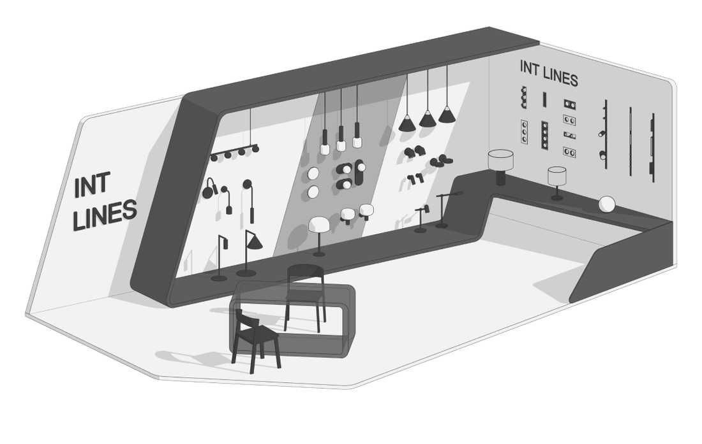

Este conjunto de familias está pensado para trabajar en Autodesk Revit y usarse en proyectos BIM de interiorismo y arquitectura.

Es adecuado para diseñadores de interiores y arquitectos. La geometría de las luminarias y del resto de piezas está simplificada con las herramientas de Revit.

Las familias incluyen conectores eléctricos y archivos de malla fotométrica.

### Carga y colocación en el proyecto

Para ver y cargar las familias del conjunto puedes abrir Projects with lighting, copiar las familias con la combinación de teclas Ctrl+C y pegarlas en tu proyecto con Ctrl+V.

También puedes abrir la carpeta con los archivos de familia y arrastrarlos con el ratón al proyecto.

La mayoría de las luminarias están hechas sobre la plantilla Modelo genérico métrico basado en cara. Colócalas en el plano de techo o en una vista 3D.

## 2. CONTENIDO DEL CONJUNTO

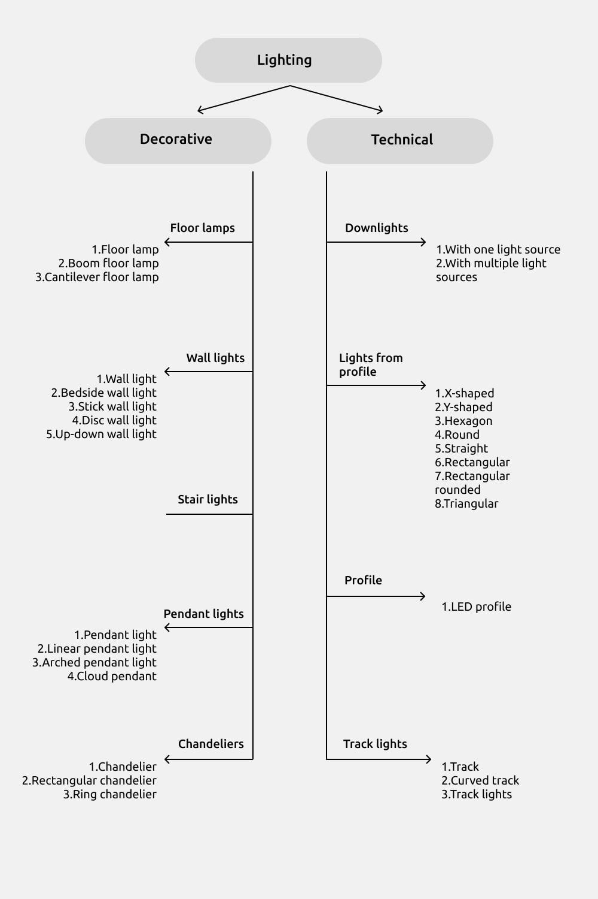

El conjunto incluye los siguientes grupos de familias de la categoría Luminarias:

- Downlights
- Colgantes (Pendant lights)
- Lámparas de araña (Chandeliers)
- Apliques (Wall lights)
- Iluminación de escalera (Stair lights)
- Lámparas de pie y de mesa (Floor and table lamps)
- Luminarias de perfil (Lights from profile)
- Perfil LED (Profile LED)
- Carriles (Track lights)

## 3. ELEMENTOS COMUNES

Elementos comunes: los que se repiten en la mayoría de las familias.

### Símbolos gráficos

Los símbolos gráficos (Graphic symbols) son elementos gráficos convencionales. En cada nivel de detalle se muestra un símbolo distinto.

**Nivel de detalle Alto**: la geometría de la luminaria se ve exactamente igual que en 3D.

**Nivel de detalle Medio**: la escala del símbolo gráfico no depende de las dimensiones reales de la luminaria. El tamaño del símbolo se puede ajustar por ejemplar.

**Nivel de detalle Bajo**: el tamaño del símbolo es proporcional a las dimensiones reales de la luminaria.

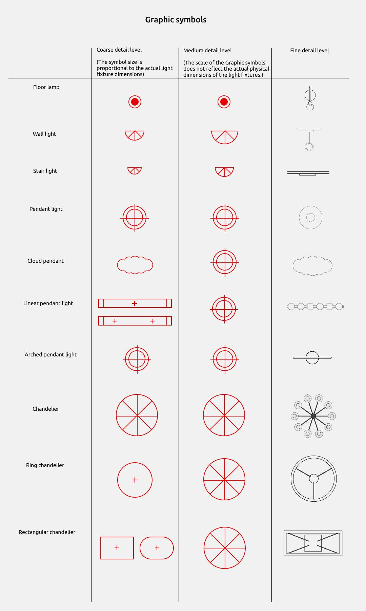

Usa el nivel de detalle que te resulte más cómodo.

Para cambiar el estilo de los símbolos gráficos de las luminarias (en el nivel de detalle Medio) ve a **Gestionar** > **Estilos de objeto** > **Objetos de anotación** > **Anotaciones genéricas** > **INT 07 Lighting Graphic symbols**

El tamaño (escala) del símbolo en el nivel de detalle Medio se cambia por ejemplar con el parámetro **Graphic symbols (M) Dimension**.

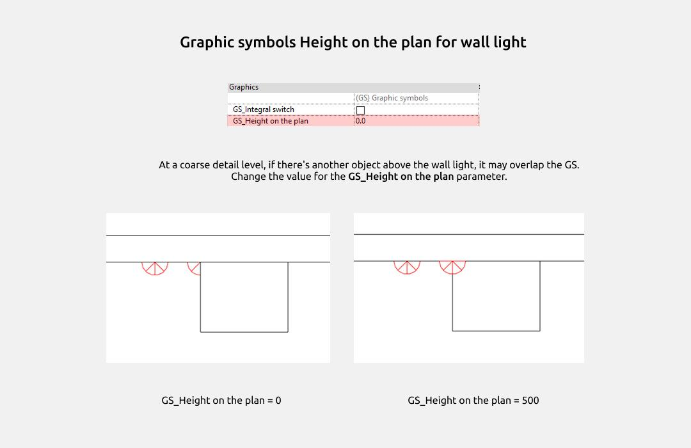

En el nivel de detalle Bajo, si hay otro objeto encima del aplique, puede tapar el símbolo. Cambia el valor del parámetro **GS_Height on the plan**. Funciona con los apliques.

### Apartados y configuración de las familias

Cada familia de luminaria tiene los apartados principales en Propiedades:

- **Graphics : Visibility, Options.**
  - En el apartado **Visibility** se activan y desactivan los elementos de la familia.
  - **Options**: aquí se elige la forma, el tipo, la dirección o el número de elementos.

- **Materials and finishes.**
- **Dimensions : Overall dimensions, Placement, Elements dimensions.**
  - El apartado **Overall dimensions** muestra las dimensiones generales de la luminaria. Suelen aparecer en gris, es decir, no se editan y se calculan automáticamente con fórmulas.
  - **Placement**: control de desplazamientos, desfases y giros.
  - **Elements dimensions**: control de todas las dimensiones posibles (altura, anchura, grosor, diámetro).

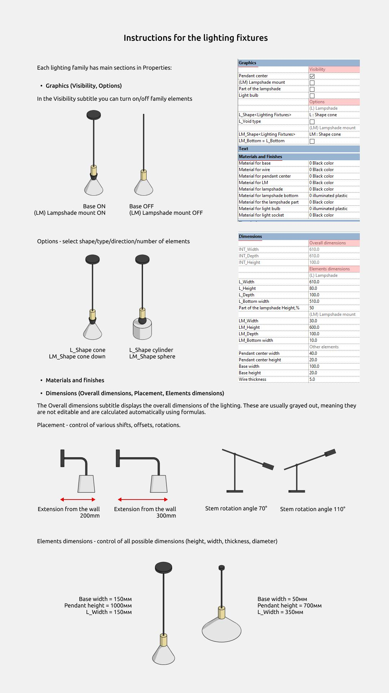

Los parámetros se cambian marcando casillas o eligiendo un valor en la lista desplegable.

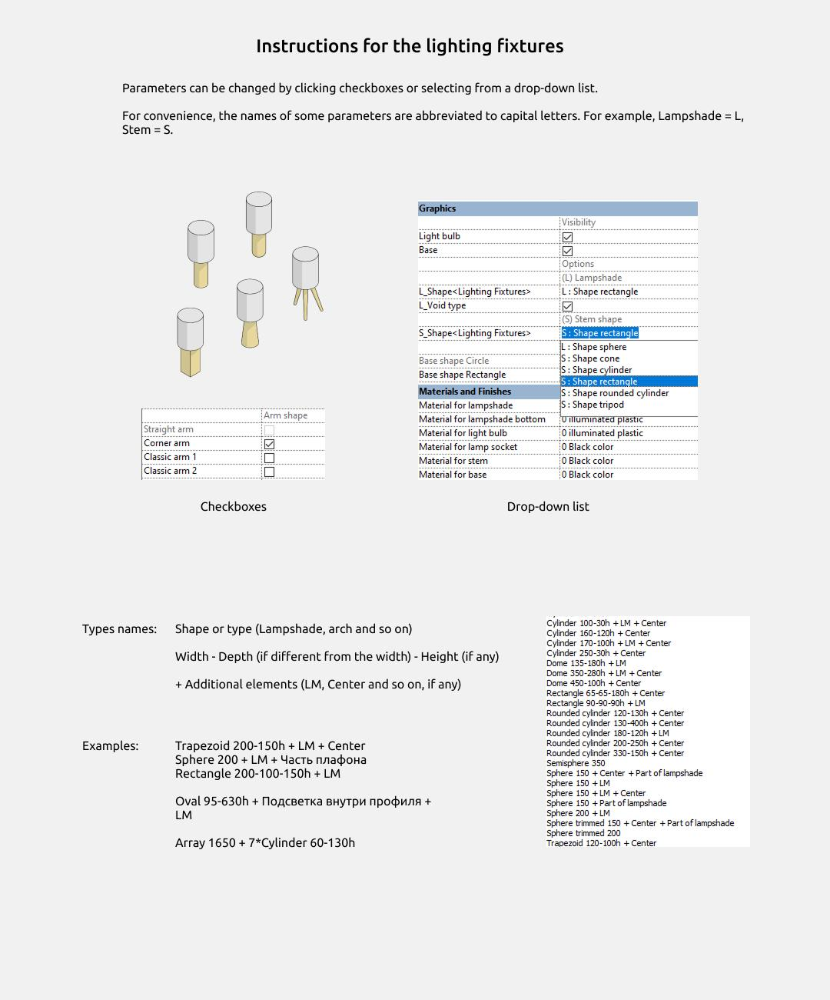

### Techo inclinado

La mayoría de las luminarias están hechas sobre la plantilla Modelo genérico métrico basado en cara. Para que la luminaria cuelgue en vertical, y no a 90 grados respecto a un techo inclinado, puedes usar este método:

## 4. FAMILIAS

### Lámparas de pie y de mesa

Las lámparas de pie incluyen estas familias:

- Lámpara de pie (Floor lamp)
- Lámpara de pie con brazo (Boom floor lamp)
- Lámpara de pie con pantalla desplazada (Cantilever floor lamp)

La lámpara de pie es una luminaria estándar que se puede colocar sobre un mueble, una mesa o el suelo.

**L_Height** queda fijo cuando la pantalla tiene forma Sphere (es igual a **L_Width**, y todo el tamaño de la pantalla se controla con **L_Width**).

Cuando la pantalla tiene forma Semisphere, **L_Height** y **L_Width** dependen entre sí: **L_Width**/2 = **L_Height**.

La lámpara de pie con brazo (Boom floor lamp) tiene el parámetro **Stem rotation angle**.

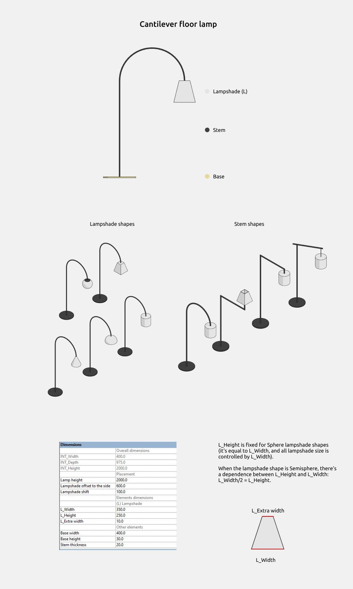

La lámpara de pie con pantalla desplazada (Cantilever floor lamp) tiene la opción adicional **Lampshade offset** para desplazar la pantalla hacia un lado.

### Apliques

Los apliques incluyen estas familias:

- Aplique (Wall light)
- Aplique de cabecera (Bedside wall light)
- Aplique lineal (Stick wall light)
- Aplique de disco (Disc wall light)
- Aplique arriba-abajo (Up-down wall light)

Y, por separado, la iluminación de escalera (Stair light)

La familia Wall light es la familia base de este grupo: ofrece distintas pantallas, formas y número de brazos, y tamaños.

**L_Height** queda fijo cuando la pantalla tiene forma Sphere (es igual a **L_Width**, y todo el tamaño de la pantalla se controla con **L_Width**).

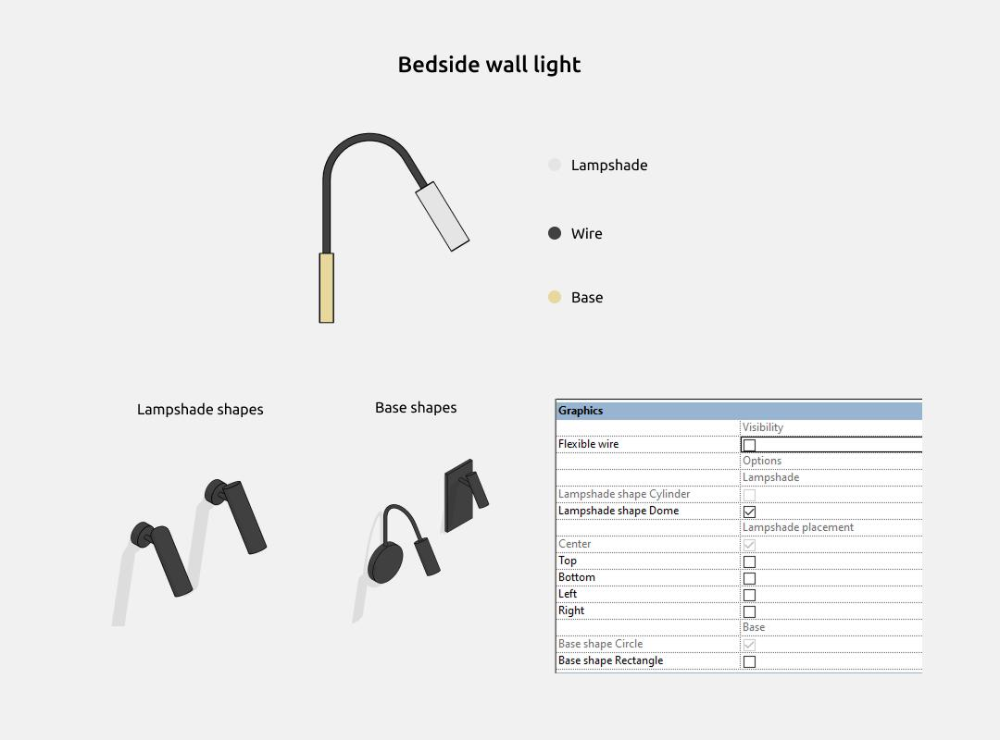

**Lamp center**: cambia la altura de forma uniforme desde el centro.
El material de la iluminación hacia la pared se puede cambiar.

El aplique lineal (Stick wall light) también se puede girar un ángulo dado.

El tamaño de la pantalla se controla con **L_Width**.

Lo mismo se aplica al disco con forma Circle y Plate. En la forma Plate, la profundidad del disco depende de la anchura, pero el parámetro en sí no está activo.

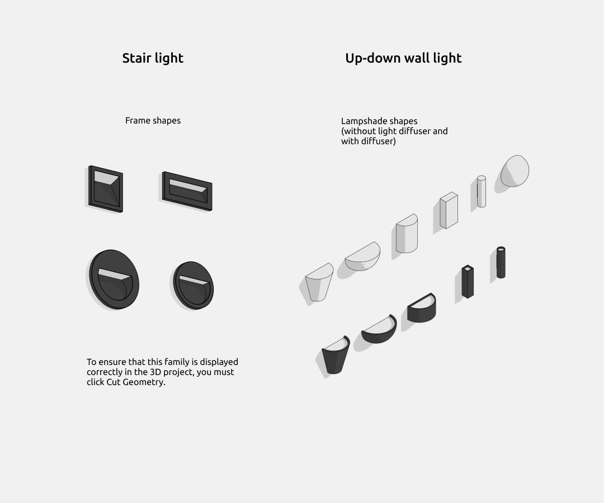

Para que esta familia se muestre correctamente en el proyecto en 3D hay que usar Cortar geometría.

### Colgantes

Los colgantes incluyen estas familias:

- Colgante (Pendant light)
- Colgante lineal (Linear pendant light)
- Colgante en arco (Arched pendant light)
- Colgante nube (Cloud pendant). Sirve para representar una luminaria grande y voluminosa de formas complejas, que muestre sus dimensiones en el espacio sin modelarla en detalle con las herramientas de Revit.

La familia Pendant light es la familia base de este grupo: ofrece distintas pantallas, sujeciones de la pantalla, formas y tamaños.

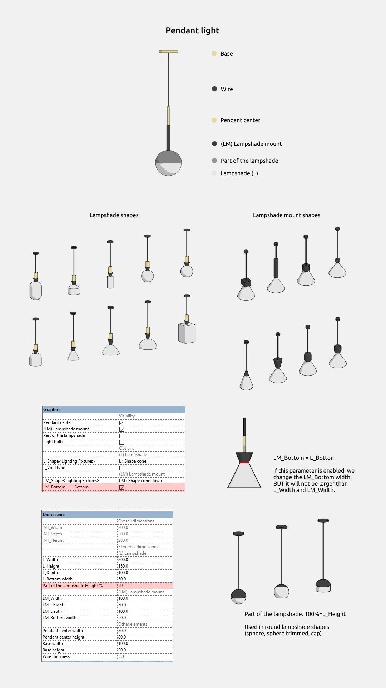

**Part of the lampshade**. 100 % = **L_Height**

Se usa en las pantallas de forma redonda (sphere, sphere trimmed, cap).

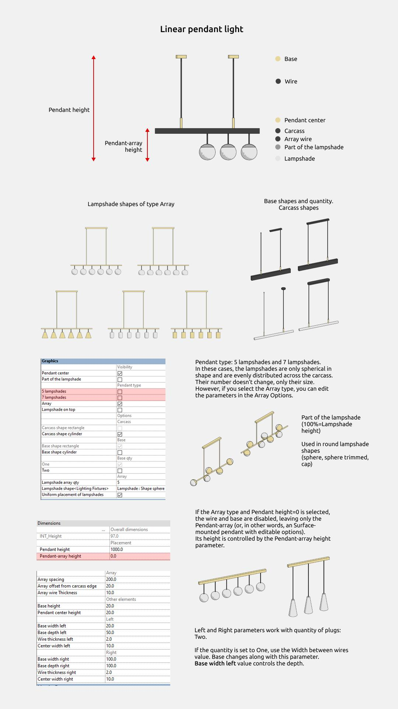

Tipos de colgante: 5 lampshades y 7 lampshades.
En estos casos las pantallas solo tienen forma de esfera y se reparten de manera uniforme por la estructura. Su número no cambia, solo su tamaño.
Si eliges el tipo Array, podrás editar los parámetros en **Array Options**.

Si está elegido el tipo Array y **Pendant height**=0, el cable y la base se desactivan y queda solo el Pendant-array (dicho de otro modo, un colgante de superficie con opciones editables).
Su altura se controla con el parámetro **Pendant-array height**.

Los parámetros **Left** y **Right** funcionan con **quantity of plugs**: Two.

Si la cantidad es One, usa el valor **Width between wires**.

La base cambia junto con este parámetro. El valor **Base width left** controla la profundidad.

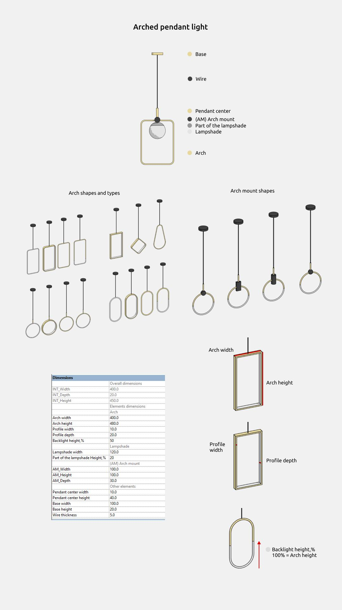

### Lámparas de araña

Las lámparas de araña incluyen estas familias:

- Lámpara de araña (Chandelier)
- Lámpara de araña de anillo (Ring chandelier)
- Lámpara de araña rectangular (Rectangular chandelier)

La familia Chandelier es la familia base de este grupo: ofrece distintas pantallas, sujeciones de la pantalla, número de brazos, formas y tamaños.

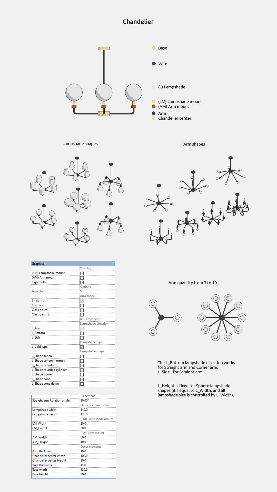

Número de brazos: de 3 a 10.

La dirección de la pantalla **L_Bottom** funciona con Straight arm y Corner arm.
**L_Side**: con Straight arm.

**L_Height** queda fijo cuando la pantalla tiene forma Sphere (es igual a **L_Width**, y todo el tamaño de la pantalla se controla con **L_Width**).

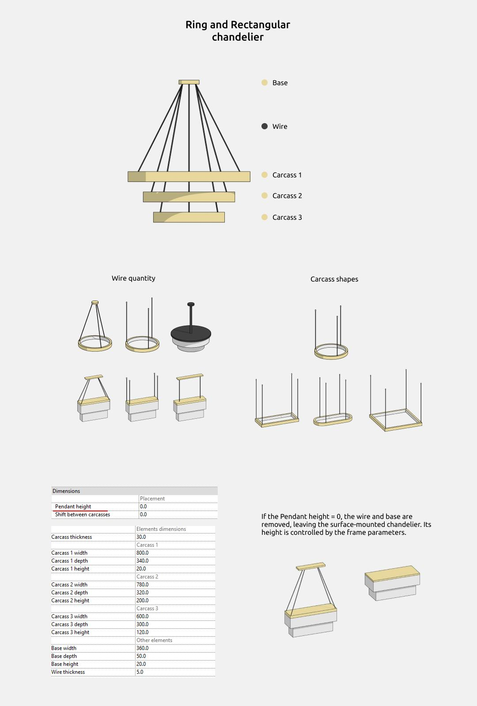

Si **Pendant height** = 0, el cable y la base se quitan y queda la lámpara de araña de superficie. Su altura se controla con los parámetros de la estructura.

### Downlights

Los downlights incluyen estas familias:

- Downlight empotrado (Recessed downlight)
- Downlight empotrado orientable (Recessed gimbal downlight)
- Downlight de superficie (Surface downlight)
- Downlight de superficie orientable (Surface gimbal downlight)

#### Símbolos gráficos sobre base inclinada

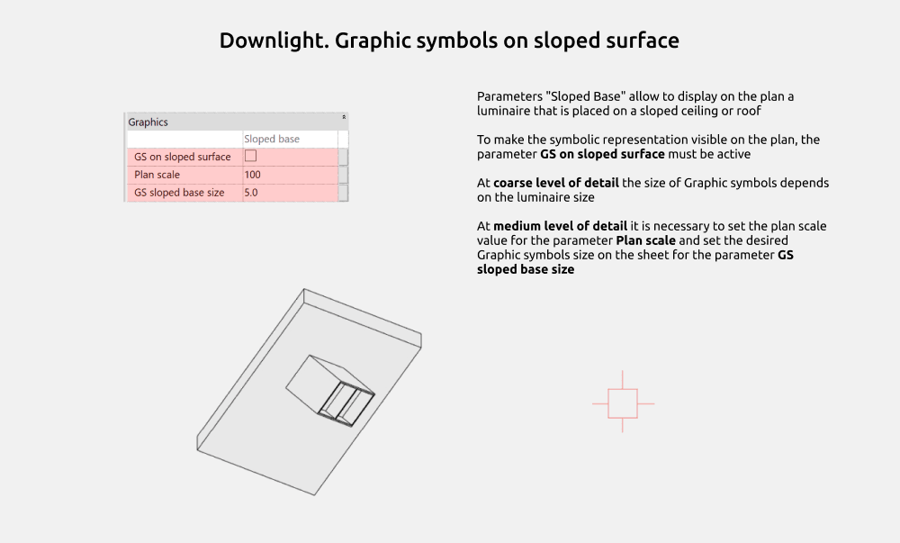

En todos los downlights colocados sobre una base inclinada se puede activar el símbolo gráfico para que se vea en el plano.

Los parámetros **Sloped Base** permiten mostrar en el plano una luminaria colocada en un techo o una cubierta inclinados.

Para que el símbolo se vea en el plano, el parámetro **GS on sloped surface** debe estar activo.

En el nivel de detalle Bajo, el tamaño del símbolo depende del tamaño de la luminaria.

En el nivel de detalle Medio hay que indicar la escala del plano en el parámetro **Plan scale** y el tamaño deseado del símbolo en la hoja en el parámetro **GS sloped base size**.

Aquí se elige la opción de forma

Forma de la luminaria (Light shape):

- Lámpara redonda (Round lamp)
- Lámpara rectangular (Rectangular lamp)

Forma del embellecedor (End cap shape):

- Embellecedor redondo (Round end cap)
- Embellecedor rectangular (Rectangular end cap)

Forma del nicho (Niche shape):

- Nicho redondo (Round niche)
- Nicho rectangular (Rectangular niche)

El parámetro **Mount height** funciona en las luminarias orientables. El parámetro admite valores positivos y negativos.

El grupo **Overall dimensions** muestra las dimensiones de la luminaria para las tablas de planificación.

Aquí se elige la opción de forma

Forma de la luminaria (Light shape):

- Lámpara redonda (Round lamp)
- Lámpara rectangular (Rectangular lamp)

Se pueden activar y desactivar estos elementos:

- Embellecedor (End cap)
- Soporte (Mount)

El parámetro **Mount height** funciona en las luminarias orientables.

El grupo **Overall dimensions** muestra las dimensiones de la luminaria para las tablas de planificación.

El parámetro **Tilt angle_2** cambia la inclinación de la parte orientable de la luminaria.

El número de lámparas se define con el parámetro **Lamp qty**.

En las lámparas redondas, la profundidad de la lámpara se define con el parámetro **Lamp depth**. Si este parámetro es mayor que el espacio reservado para la lámpara, la profundidad se calcula automáticamente.

En las lámparas cuadradas, **Lamp depth** se calcula con la fórmula (**Box width** - **Box frame width**\*2) / **Lamp qty**.

El parámetro **Lamp offset** define la profundidad a la que se colocan las lámparas respecto al borde superior de la caja.

Los parámetros **End cap solid** y **Swivel lamps** funcionan solo con lámparas redondas.

El número de lámparas se define con el parámetro **Lamp qty**.

En las lámparas redondas, la profundidad de la lámpara se define con el parámetro **Lamp depth**. Si este parámetro es mayor que el espacio reservado para la lámpara, la profundidad se calcula automáticamente.

En las lámparas cuadradas, **Lamp depth** se calcula con la fórmula (**Box width** - **Box frame width**\*2) / **Lamp qty**.

El parámetro **Lamp height from ceiling** define la profundidad a la que se colocan las lámparas respecto al borde superior de la caja. El valor puede ser positivo o negativo.

### Luminaria de perfil

Consta de una luminaria de perfil.

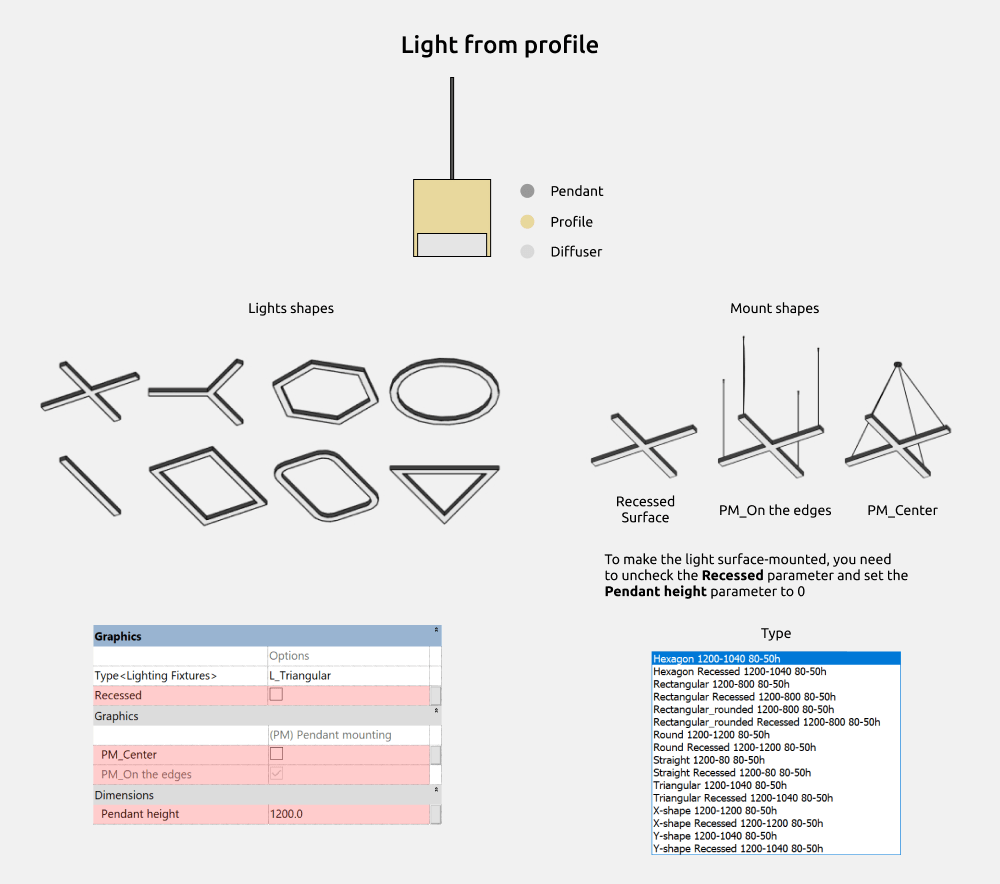

Aquí se elige la opción de forma

Forma de la luminaria (Light shape):

- En X (X-shaped)
- En Y (Y-shaped)
- Hexágono (Hexagon)
- Redonda (Round)
- Recta (Straight)
- Rectangular (Rectangular)
- Rectangular redondeada (Rectangular rounded)
- Triangular (Triangular)

Forma de la sujeción (Mount shape):

- Empotrada (Recessed)
- De superficie (Surface)
- PM_Center
- PM_On the edges

Para hacer la luminaria de superficie, desmarca el parámetro **Recessed** y pon el parámetro **Pendant height** en 0.

### Perfil LED

Consta de una luminaria: el perfil LED.

En el perfil empotrado se recorta un hueco por defecto.

Si hace falta, el hueco se desactiva con el parámetro **Hole for built-in profile**.

En el plano, con el nivel de detalle Bajo, el perfil muestra las marcas Start +/- y End +/-. Estas marcas ayudan a configurar el recorte (Trimming).

Las marcas se desactivan con el parámetro **Graphic symbols_Start_End**.

La longitud del perfil se controla con el parámetro **Length (manual)**. La longitud también se ajusta con los pinzamientos en la vista 3D y en el plano.

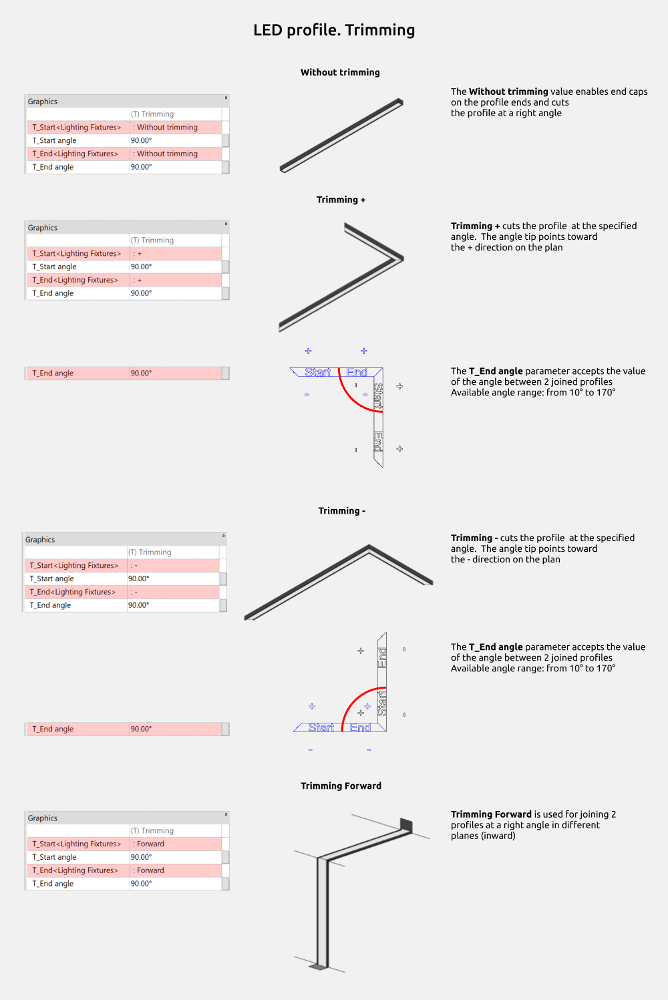

El valor Without trimming activa los embellecedores en los extremos del perfil y lo corta en ángulo recto.

Trimming + corta el perfil con el ángulo indicado. La punta del ángulo apunta hacia el lado + en el plano.

En el parámetro **T_End angle** se introduce el ángulo entre los 2 perfiles que se unen. Rango admitido: de 10° a 170°.

Trimming - corta el perfil con el ángulo indicado. La punta del ángulo apunta hacia el lado - en el plano.

Trimming Forward se usa para unir 2 perfiles en ángulo recto en planos distintos (hacia dentro).

### Carriles

Los carriles incluyen estas familias:

- Carril empotrado (Recessed track)
- Carril de superficie (Surface track)
- Carril curvo empotrado (Recessed curved track)
- Carril curvo de superficie (Surface curved track)
- Luminaria de carril lineal orientable (Track light - Adjustable linear)
- Luminaria de carril lineal (Track light - Linear)
- Foco de carril (Track light - Spot)

En el carril empotrado se recorta un hueco por defecto.

Si hace falta, el hueco se desactiva con el parámetro **Cutout for track**.

Para los huecos del carril con los conectores Inner corner y Outer corner en las uniones pared-pared y pared-techo, hay que usar además la herramienta Cortar de la barra de herramientas.

La longitud del carril se controla con el parámetro **Length (manually)**.

La longitud del carril también se ajusta con los pinzamientos en la vista 3D y en el plano.

Los parámetros **Pendant start height** y **Pendant end height** definen la sujeción de la suspensión a un plano inclinado.

La distancia del carril al punto de sujeción se toma por el valor mayor.

El desfase de las suspensiones respecto al borde del carril se define con el parámetro **Pendant Offset from the edge**.

Para activar la visibilidad de las suspensiones usa los parámetros **P_Start** y **P_End**.

Para activar la visibilidad de los cables usa los parámetros **W_Start** y **W_End**.

En el plano, con el nivel de detalle Bajo y el estilo Estructura alámbrica, el carril muestra las marcas Start +/- y End +/-.

Estas marcas ayudan a elegir el tipo de conector en los parámetros (C) Connector: **C_Start** y **C_End**.

Si hace falta, las marcas se desactivan con el parámetro **GS_Start_End**.

Conector (Connector):

#### Embellecedor (End cap)

El conector End cap se puede poner tanto en **C_Start** como en **C_End**, en los extremos del carril.

#### Sin conector (Without connector)

Elige este valor si el carril se une al conector del carril vecino.

En casos poco frecuentes, cuando el carril se une por ambos extremos a End +/- de otros carriles, se admite el tipo de conector **C_End**: Without connector.

#### Conector X (Connector X)

Conector End: Connector X se usa para unir 4 carriles en ángulo recto.

#### Conector de esquina (Connector Corner)

**C_End**: Connector Corner se usa para unir 2 carriles con un ángulo. El ángulo se indica en el parámetro **C_Angle**.

Si el parámetro **C_Angle -** está activo, la punta del ángulo en el plano apunta hacia el lado -.

Si el parámetro **C_Angle +** está activo, la punta del ángulo en el plano apunta hacia el lado +.

#### Unión en tramo recto (Joint on a straight section)

Without connector: Joint on a straight section sirve para unir varios carriles en línea recta. Se usa cuando el carril del proyecto es largo y debe componerse de varios tramos rectos.

#### Conector T (Connector T)

Conector End: Connector T se usa para unir 3 carriles en ángulo recto.

Si el parámetro **C_Angle +** está activo, uno de los extremos libres del conector apunta hacia el lado +.

Para reflejar el elemento, junto a la marca Start del carril hay un control ↓↑.

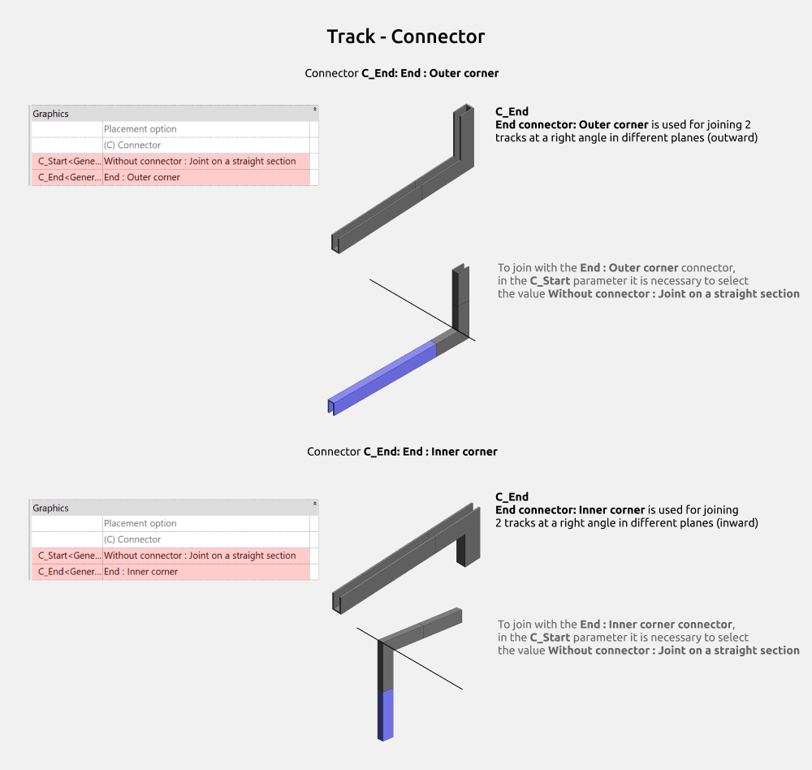

#### Esquina exterior (Outer corner)

Conector End: Outer corner se usa para unir 2 carriles en ángulo recto en planos distintos (hacia fuera).

Para unir con el conector End: Outer corner, en el parámetro **C_Start** hay que elegir el valor Without connector: Joint on a straight section.

#### Esquina interior (Inner corner)

Conector End: Inner corner se usa para unir 2 carriles en ángulo recto en planos distintos (hacia dentro).

Para unir con el conector End: Inner corner, en el parámetro **C_Start** hay que elegir el valor Without connector: Joint on a straight section.

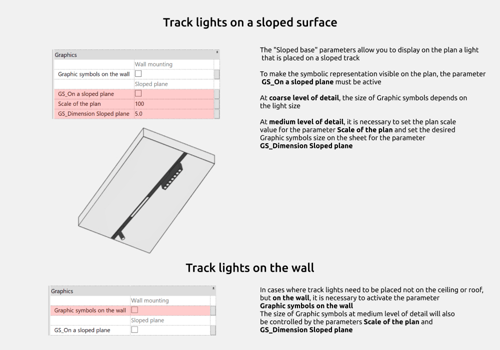

Los parámetros **Sloped base** permiten mostrar en el plano una luminaria colocada en un carril inclinado.

Para que el símbolo se vea en el plano, el parámetro **GS_On a sloped plane** debe estar activo.

En el nivel de detalle Bajo, el tamaño del símbolo depende del tamaño de la luminaria.

En el nivel de detalle Medio hay que indicar la escala del plano en el parámetro **Scale of the plan** y el tamaño deseado del símbolo en la hoja en el parámetro **GS_Dimension Sloped plane**.

Si las luminarias de carril no van en el techo o la cubierta, sino en la pared, hay que activar el parámetro **Graphic symbols on the wall**.

El tamaño del símbolo en el nivel de detalle Medio también se controla con los parámetros **Scale of the plan** y **GS_Dimension Sloped plane**.

## 5. Símbolos gráficos y Figma

Para el conjunto de luminarias se añadieron imágenes de todos los símbolos gráficos por tipo en los parámetros **INT_Graphic symbols** e **INT_Graphic symbols 2**.

Si necesitas cambiar el símbolo gráfico en la tabla de planificación, puedes editar el archivo vectorial con la imagen de la luminaria en la página de Figma.

Enlace a Figma:

https://www.figma.com/design/Wmf24tLPX4jthdiSWlPSOY/INT-LIGHTING?node-id=4-277&t=zR6X0GsaoMQxt9ry-0

Los archivos se pueden ver en cualquier navegador, pero no se pueden editar en la página de INT LINES: selecciona todo y cópialo a tu propia página.

<u>Cómo sustituir la imagen en el proyecto:</u>

- Para cargar la imagen actualizada en la familia, busca la familia en el Navegador de proyectos y pulsa Editar. Se abrirá el editor de familias.
- Abre la ventana Tipos de familia y sustituye los valores de los parámetros **INT_Graphic symbols** (nivel de detalle Bajo) o **INT_Graphic symbols 2** (nivel de detalle Medio).
- Después carga la familia en el proyecto y elige Sobrescribir la versión existente y sus valores de parámetros.

## 6. ESTILO

### Ajustes de gráficos

Para cambiar el color, el grosor o el patrón de las líneas de las familias ve a **Gestionar** > **Estilos de objeto** > **Luminarias**

Para un plano concreto, las líneas también se cambian en Modificaciones de visibilidad/gráficos.

<CTA type="guide" />
