import productPreview from './product.jpg';

<ProductCard
  name="Familias de sofá modular para Revit"
  eyebrow="Conjunto de familias de Revit"
  description="Combina las secciones del sofá modular para crear la configuración que necesites en tu proyecto de Revit."
  image={productPreview}
  imageAlt="Vista previa del conjunto de sofá modular para Revit"
  buyUrl="https://bimcore.one/products/modular-sofa-revit-families"
  ecwidProductId="543746540"
  buyLabel="Comprar"
  shopLabel="Ir a la tienda"
/>

## 1. INFORMACIÓN GENERAL

- Nombre del conjunto Sofá modular
- Versión del conjunto 1.0.2
- Versión de Revit 2019

### Descripción

Este conjunto de familias permite modelar sofás de configuración libre en Autodesk Revit. Está pensado para diseñadores de interiores y arquitectos.

### Carga y colocación

Para ver y cargar las familias, abre el proyecto del sofá modular, copia las que necesites con Ctrl+C y pégalas en tu proyecto con Ctrl+V. También puedes abrir la carpeta de archivos de familia y arrastrarlos al proyecto.

:::note
Las imágenes y los nombres de los parámetros corresponden a la versión inglesa del conjunto. Las explicaciones están en español.
:::

## 2. CONTENIDO DEL CONJUNTO

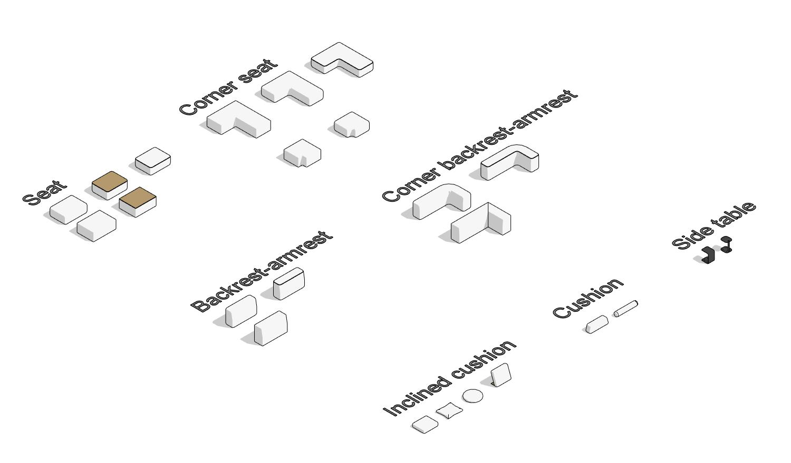

- Asiento (Seat)
- Asiento de esquina (Corner seat)
- Respaldo y reposabrazos (Backrest-armrest)
- Respaldo y reposabrazos de esquina (Corner backrest-armrest)
- Cojín (Cushion)
- Cojín inclinado (Inclined cushion)
- Mesa auxiliar (Side table)

## 3. FAMILIAS

### Asiento (Seat)

Esta familia representa el asiento del sofá modular, la parte principal del mueble destinada a sentarse cómodamente.

Puedes ajustar los siguientes aspectos.

- Anchura, profundidad, altura y materiales.
- Visibilidad de la costura mediante **Seam**.
- Activación o desactivación del tablero superior.
- Forma con esquinas rectas o redondeadas.

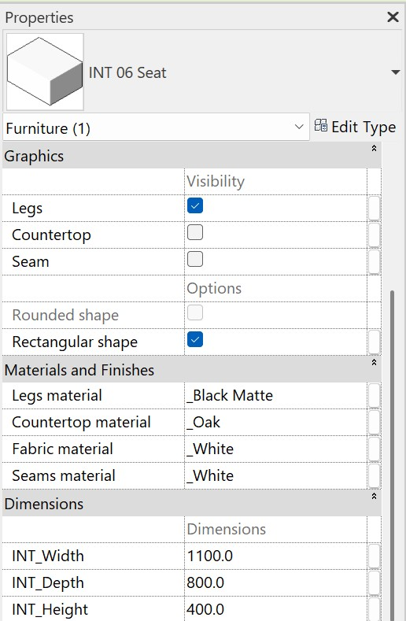

#### Gráficos

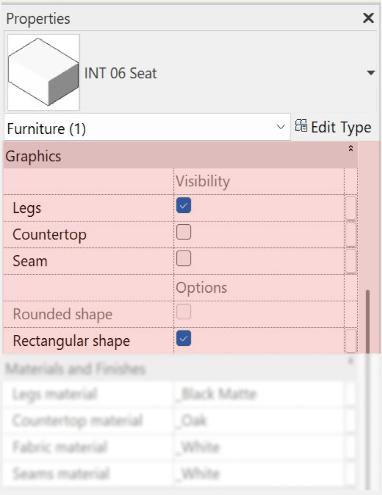

El apartado Graphics permite controlar estos elementos.

- **Legs** activa o desactiva las patas del asiento.
- **Countertop** activa o desactiva el tablero sobre la cara superior del asiento.
- **Seam** controla la visibilidad de la costura.
- **Rectangular shape** permite elegir una forma rectangular. Si desactivas la casilla, el asiento adopta la forma redondeada.

#### Materiales

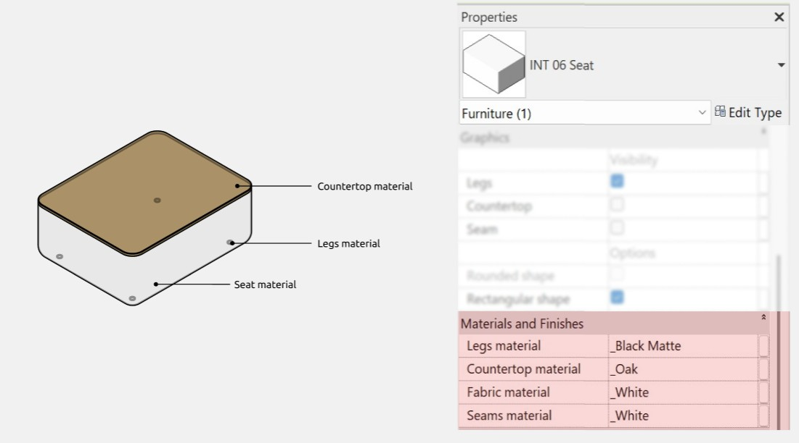

#### Dimensiones

**INT_Height** incluye la altura del tablero y de las patas cuando están activados **Countertop** y **Legs**, respectivamente.

### Asiento de esquina (Corner seat)

Esta familia permite colocar asientos en las esquinas de la composición.

Al igual que en el asiento recto, puedes ajustar la anchura, la profundidad, la altura y los materiales, activar o desactivar **Seam** y elegir esquinas rectas o redondeadas.

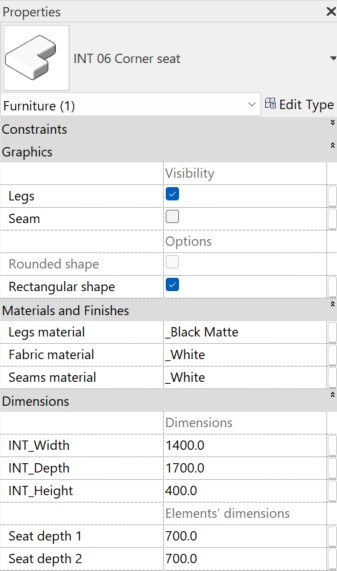

#### Dimensiones de los elementos

En Dimensions, dentro de Elements’ dimensions, los parámetros **Seat depth 1** y **Seat depth 2** permiten ajustar la profundidad del asiento a cada lado del módulo.

### Respaldo y reposabrazos (Backrest-armrest)

Esta familia permite crear apoyos para la espalda y los brazos. También sirve como elemento decorativo para componer distintas configuraciones del sofá.

Puedes activar o desactivar las patas y la costura, elegir una forma rectangular o redondeada y asignar materiales a todos los elementos.

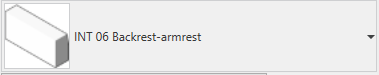

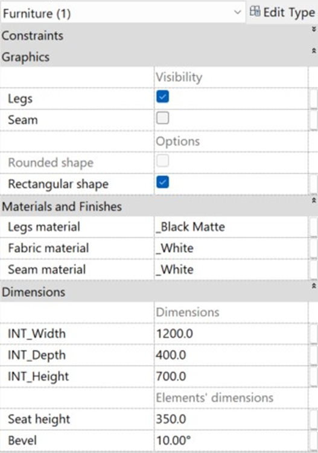

#### Dimensiones de los elementos

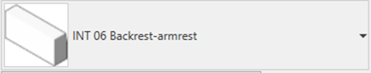

**Seat height** ajusta la altura del asiento y **Bevel** modifica el ángulo de inclinación de la parte superior del módulo.

### Respaldo y reposabrazos de esquina (Corner backrest-armrest)

Esta familia funciona como el respaldo y reposabrazos recto, pero está pensada para las esquinas.

Tiene los mismos parámetros que Backrest-armrest, además de **Backrest depth**, explicado a continuación.

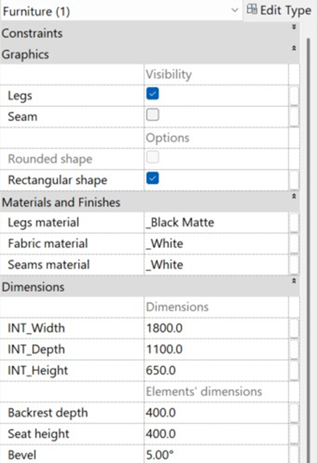

#### Dimensiones de los elementos

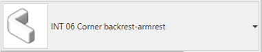

**INT_Depth** controla la profundidad total de la familia. **Backrest depth**, en Elements’ dimensions, permite ajustar la profundidad del propio respaldo.

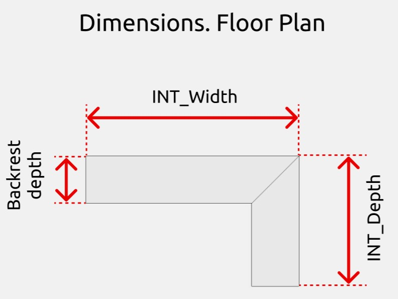

**Seat height** y **Bevel** funcionan igual que en Backrest-armrest.

### Cojín (Cushion)

Esta familia tiene una función decorativa.

Sus parámetros permiten modificar las dimensiones y el material del cojín, así como elegir una forma cilíndrica o trapezoidal.

### Cojín inclinado (Inclined cushion)

Esta familia sirve como elemento decorativo y para representar un apoyo para otros objetos.

Además de los ajustes de la familia Cushion, permite hacer lo siguiente.

- Elegir entre tres formas, circular (Round shape), rectangular (Rectangular shape) y rectangular con reborde (Oxford cushion).
- Activar o desactivar el soporte con **Stand** y, cuando está activado, modificar su material.
- Regular la inclinación del cojín.

### Mesa auxiliar (Side table)

Esta familia permite representar una mesa de centro, una superficie de trabajo, un apoyo para bebidas y aperitivos, un soporte para dispositivos o un elemento decorativo.

Puedes modificar sus dimensiones y material y elegir una forma rectangular o redondeada.

<CTA type="guide" />
