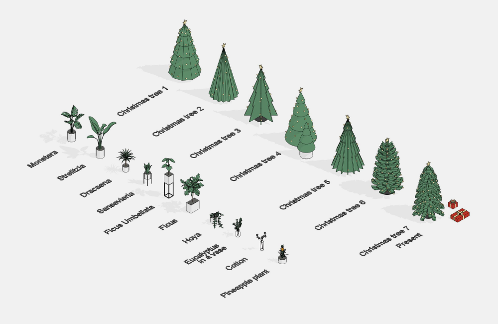
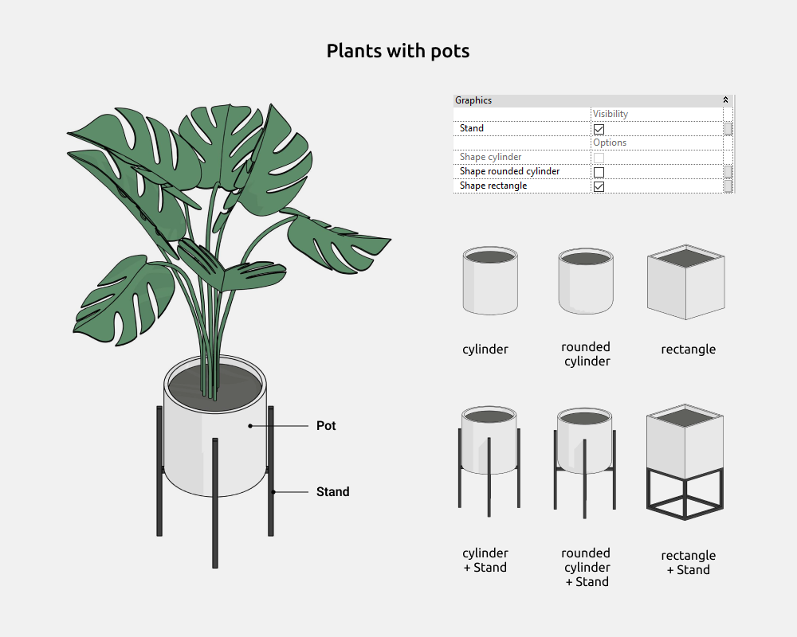

import productPreview from './product.jpg';

<ProductCard
  name="Familias de plantas para Revit"
  eyebrow="Conjunto de familias de Revit"
  description="Plantas de interior y maceteros de distintas formas, listos para colocar en tu proyecto de Revit."
  image={productPreview}
  imageAlt="Vista previa del conjunto de familias de plantas para Revit"
  buyUrl="https://bimcore.one/products/plants-revit-families"
  ecwidProductId="543589695"
  buyLabel="Comprar"
  shopLabel="Ir a la tienda"
/>

## 1. INFORMACIÓN GENERAL

- Nombre del conjunto Plantas
- Versión del conjunto 1.3.0
- Versión de Revit 2019

### Descripción

Este conjunto de familias permite modelar plantas de interior con maceteros o jarrones en Autodesk Revit.

Con estas familias puedes incorporar vegetación al interior.

Está pensado para diseñadores de interiores y arquitectos. La geometría de las hojas y las flores está simplificada y se ha creado con las herramientas de Revit.

### Carga y colocación

Para ver y cargar las familias del conjunto, abre el proyecto con las plantas, copia las que necesites con Ctrl+C y pégalas en tu proyecto con Ctrl+V. También puedes abrir la carpeta de archivos de familia y arrastrarlos al proyecto.

:::note
Las imágenes y los nombres de los parámetros corresponden a la versión inglesa del conjunto. Las explicaciones están en español.
:::

## 2. CONTENIDO DEL CONJUNTO

El conjunto incluye las siguientes familias de la categoría Planting de la versión inglesa de Revit.

- Monstera
- Estrelitzia
- Drácena
- Sansevieria
- Ficus umbellata
- Ficus
- Hoya
- Eucalipto en un jarrón (Eucalyptus in a vase)
- Algodón (Cotton)
- Planta de piña (Pineapple plant)
- Árboles de Navidad con siete formas diferentes (Christmas tree 1–7)
- Regalo para colocar bajo el árbol (Present)

## 3. FAMILIAS

### Plantas con maceteros

En las familias con maceteros puedes activar o desactivar el siguiente elemento.

- Soporte para el macetero (**Stand**)

Puedes elegir las siguientes formas de macetero.

- Cilíndrica (Shape cylinder)
- Cilíndrica con la parte inferior redondeada (Shape rounded cylinder)
- Rectangular (Shape rectangle)

El parámetro de altura (**Height**) cambia la escala de la planta.

En el macetero rectangular puedes modificar el ancho y el fondo. En los cilíndricos, el parámetro de fondo (**Pot depth**) no tiene efecto. Solo se utiliza el ancho (**Pot width**).

### Árboles de Navidad

En las familias de árboles de Navidad puedes activar o desactivar los siguientes elementos.

- Cesta (**Basket**)
- Adornos, la estrella y las luces (**Decoration**)

El parámetro de altura (**Height**) cambia la escala del árbol.

### Algodón

Puedes elegir las siguientes formas de jarrón.

- Rectangular (Shape rectangle)
- Cilíndrica (Shape cylinder)
- Abombada (Shape lens-shaped vase)

Al activar la casilla de escala (**Scale**), las dimensiones del jarrón se ajustan proporcionalmente a la planta de algodón y estos parámetros dejan de poder editarse por separado.

- Ancho del jarrón (**Vase width**)
- Fondo del jarrón (**Vase depth**)
- Altura del jarrón (**Vase height**)
- Radio del jarrón abombado (**LS_Radius**)

Al desactivar la casilla (**Scale**), puedes introducir manualmente todos los valores de las dimensiones del jarrón.

<CTA type="guide" />
