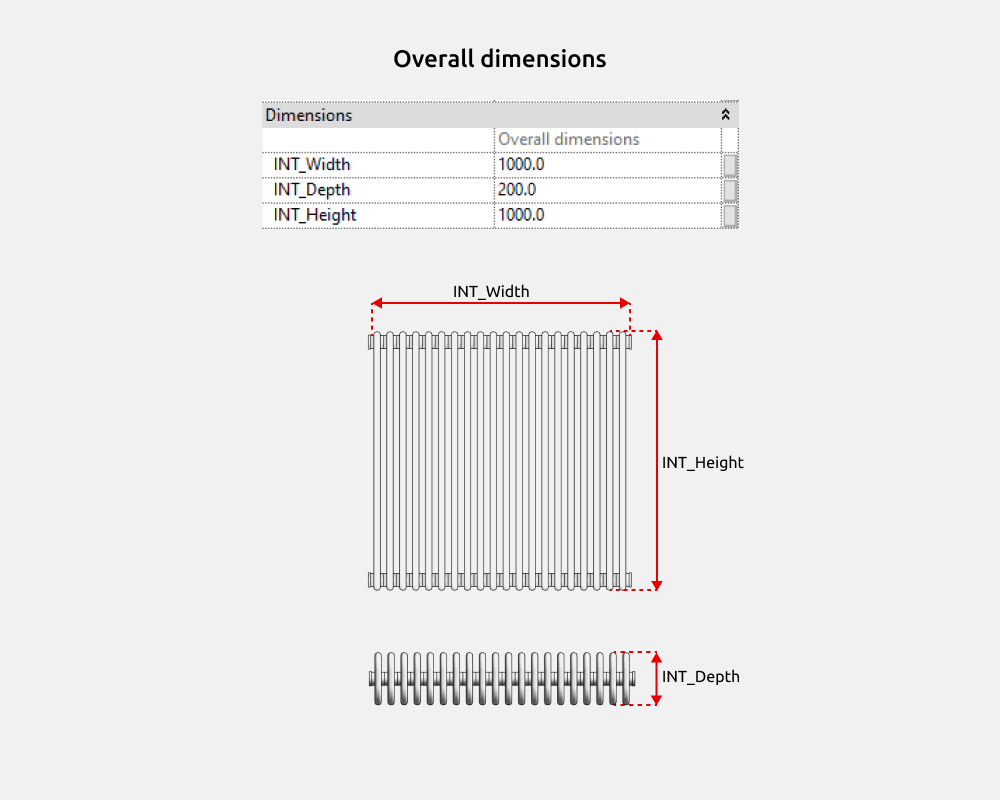
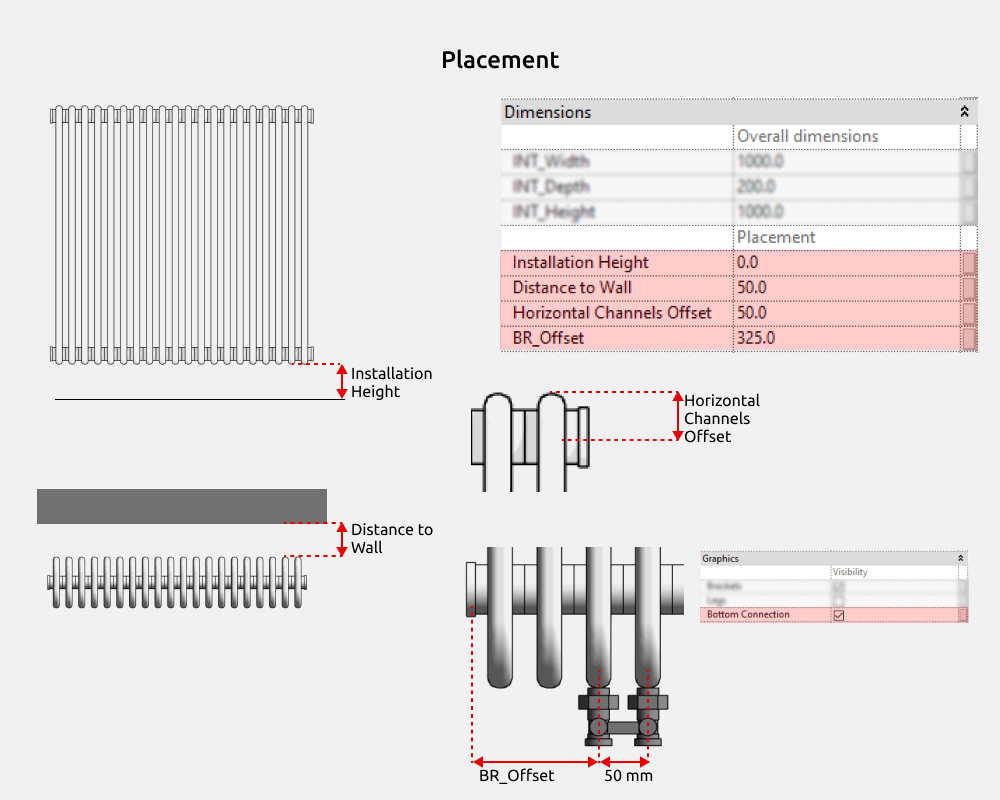
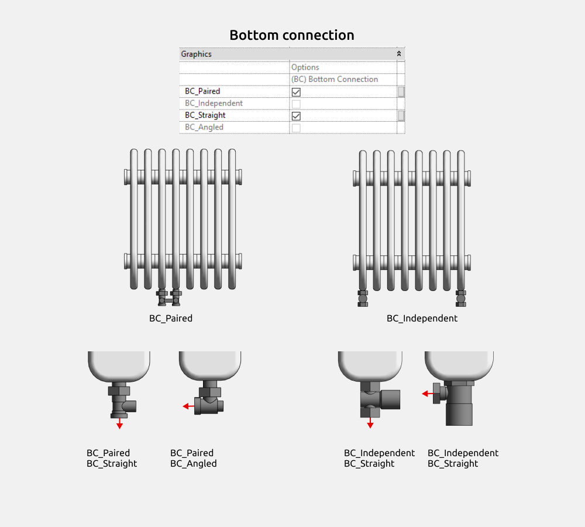
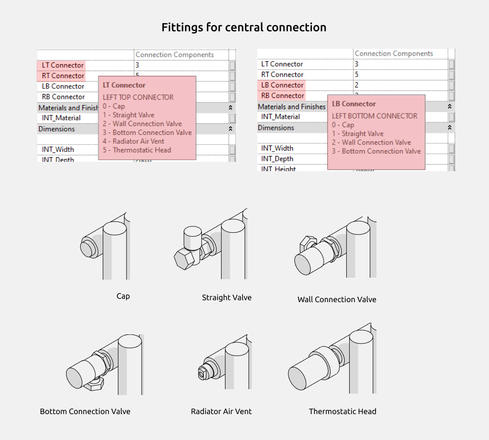
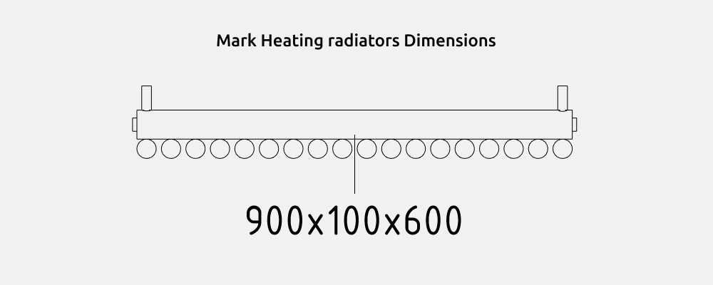
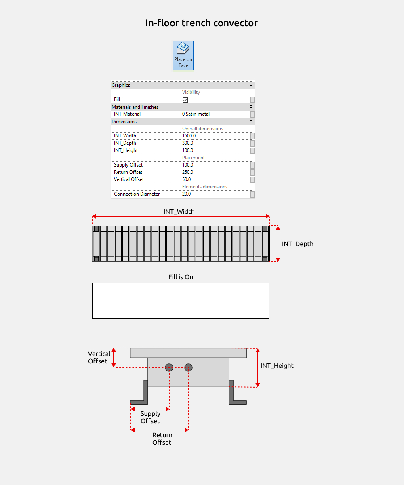
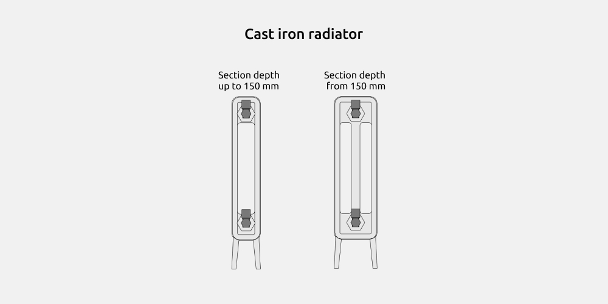

import productPreview from './product.jpg';

<ProductCard
  name="Familias de radiadores para Revit"
  description="Radiadores de panel, radiadores por elementos y toalleros para tu proyecto de Revit."
  image={productPreview}
  imageAlt="Vista previa del conjunto de radiadores para Revit"
  buyUrl="https://bimcore.one/products/radiators-revit-families"
  ecwidProductId="577117112"
  buyLabel="Ver el precio en la tienda"
/>

## 1. INFORMACIÓN GENERAL

- Nombre del conjunto Radiadores
- Versión del conjunto 1.1.0
- Versión de Revit 2019

### Descripción

Este conjunto de familias permite modelar radiadores de calefacción con dimensiones exactas en Autodesk Revit.

Está pensado para diseñadores de interiores y arquitectos.

### Carga y colocación

Para ver y cargar las familias, abre el proyecto del conjunto, copia las que necesites con Ctrl+C y pégalas en tu proyecto con Ctrl+V. También puedes abrir la carpeta de archivos de familia y arrastrarlos al proyecto.

El conjunto incluye familias de las categorías Plumbing Fixtures y Pipe Accessories para los aparatos y sus conexiones.

:::note
Las imágenes y los nombres de los parámetros corresponden a la versión inglesa del conjunto. Las explicaciones están en español.
:::

## 2. CONTENIDO DEL CONJUNTO

- Radiador de hierro fundido (Cast iron radiator)
- Radiador bimetálico (Bimetallic radiator)
- Radiador de panel de acero (Steel panel radiator)
- Radiador tubular vertical (Vertical tubular radiator)
- Radiador tubular horizontal (Horizontal tubular radiator)
- Radiador tubular por elementos (Sectional tubular radiator)
- Convector empotrado en el suelo (In-floor trench convector)

Las familias tienen parámetros compartidos con el prefijo INT que se pueden incluir en tablas de planificación. El parámetro **INT_Material** permite asignar un material a los radiadores.

## 3. ELEMENTOS COMUNES

Los elementos comunes se repiten en varias familias.

### Dimensiones

Todos los radiadores tienen parámetros de dimensiones generales.

- Anchura (**INT_Width**)
- Profundidad (**INT_Depth**)
- Altura (**INT_Height**)

En las familias de radiador de hierro fundido (Cast iron radiator) y bimetálico (Bimetallic radiator), las dimensiones generales se calculan a partir del tamaño y el número de elementos. No se introducen manualmente.

En los radiadores tubulares verticales (Vertical tubular radiator) y horizontales (Horizontal tubular radiator), **INT_Depth** se calcula a partir de las dimensiones de los conductos horizontales y verticales, en lugar de introducirse manualmente.

Puedes indicar la altura de colocación y la distancia a la pared. Para los conductos horizontales hay un parámetro de desplazamiento vertical.

Las siguientes familias permiten elegir una conexión inferior doble.

- Radiador bimetálico (Bimetallic radiator)
- Radiador de panel de acero (Steel panel radiator)
- Radiador tubular vertical (Vertical tubular radiator)
- Radiador tubular horizontal (Horizontal tubular radiator)
- Radiador tubular por elementos (Sectional tubular radiator)

Para esta conexión se indica el desplazamiento respecto al borde izquierdo del radiador. La distancia entre las válvulas de conexión inferior es de 50 mm.

### Soportes y patas

Todos los radiadores permiten activar soportes con **Brackets**. Su tamaño se ajusta mediante el parámetro **Distance to Wall**.

Las patas se activan con **Legs** y se ajustan con **Installation Height**. Pueden ser redondas o cuadradas. El radiador de hierro fundido solo tiene una forma de patas.

### Conexión inferior

Las siguientes familias tienen conexión inferior, doble o independiente, con variantes recta y acodada.

- Radiador bimetálico (Bimetallic radiator)
- Radiador de panel de acero (Steel panel radiator)
- Radiador tubular vertical (Vertical tubular radiator)
- Radiador tubular horizontal (Horizontal tubular radiator)
- Radiador tubular por elementos (Sectional tubular radiator)

### Conexión axial

Los radiadores ofrecen varias opciones de accesorios para la conexión axial. Los parámetros incluyen información de herramienta, un breve texto que explica su función. Para verla, coloca el cursor sobre el nombre del parámetro.

En las salidas superiores puedes elegir uno de seis elementos. En las inferiores, uno de cuatro.

### Etiqueta

El conjunto incluye la familia de etiqueta Mark Heating radiators Dimensions para mostrar las dimensiones generales de los radiadores.

## 4. FAMILIAS

### Convector empotrado en el suelo (In-floor trench convector)

Coloca el convector con la opción Place on Face para que recorte correctamente el suelo.

Puedes indicar el material, las dimensiones generales, la posición de la impulsión y el retorno y el diámetro de conexión.

Al activar **Fill**, aparece un rectángulo blanco en planta.

### Radiador de hierro fundido (Cast iron radiator)

El radiador de hierro fundido puede tener dos o tres conductos. Con una profundidad de elemento inferior a 150 mm tiene dos; a partir de 150 mm, tres.

<CTA type="guide" />
