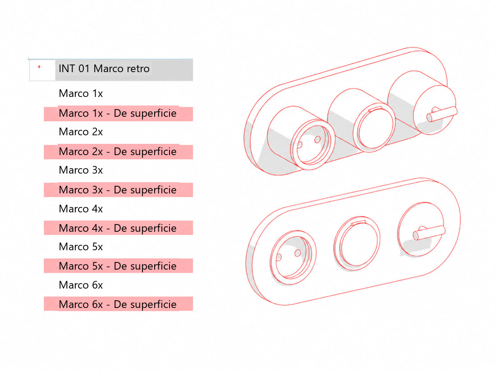
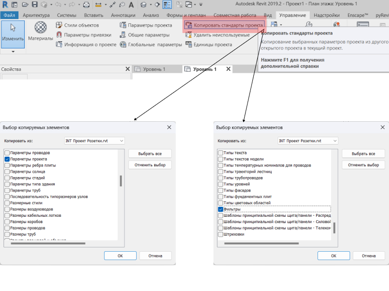
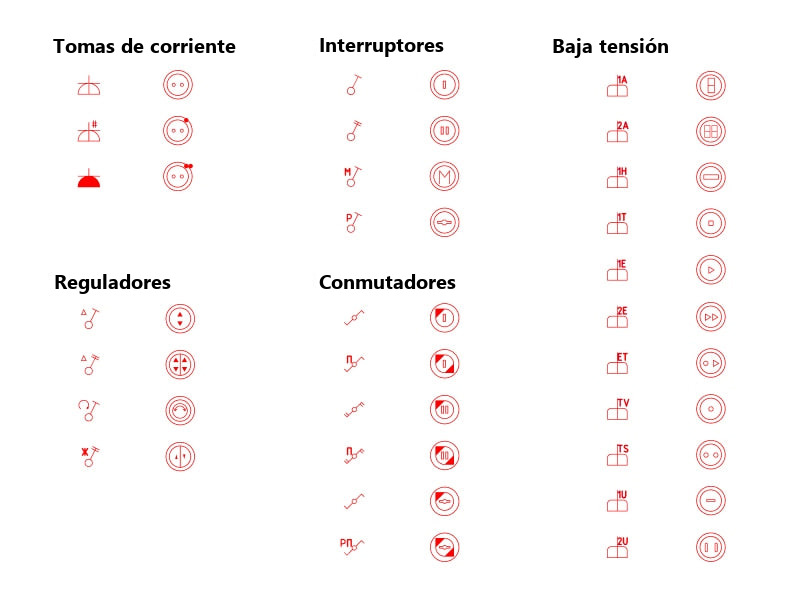
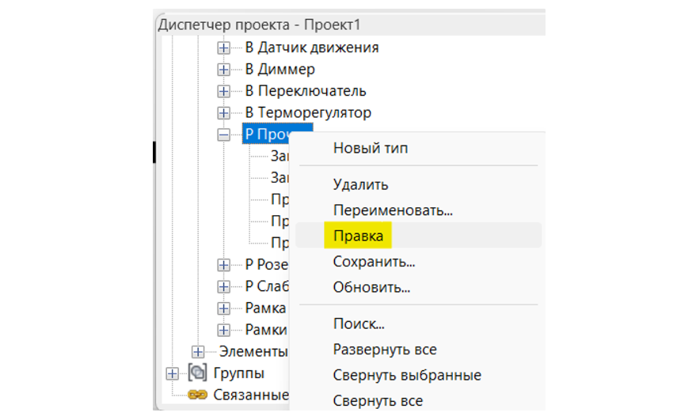
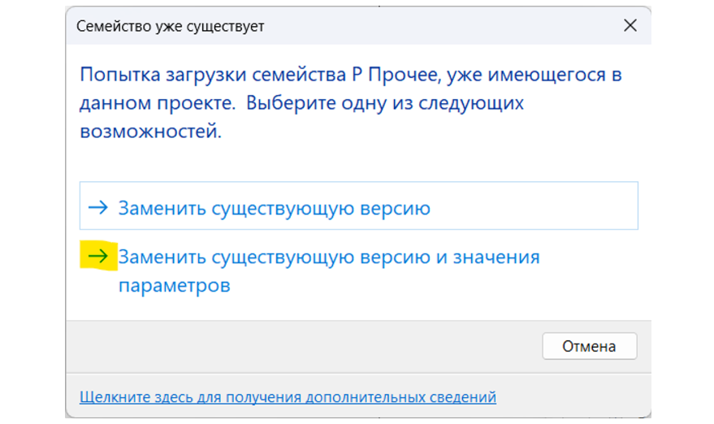
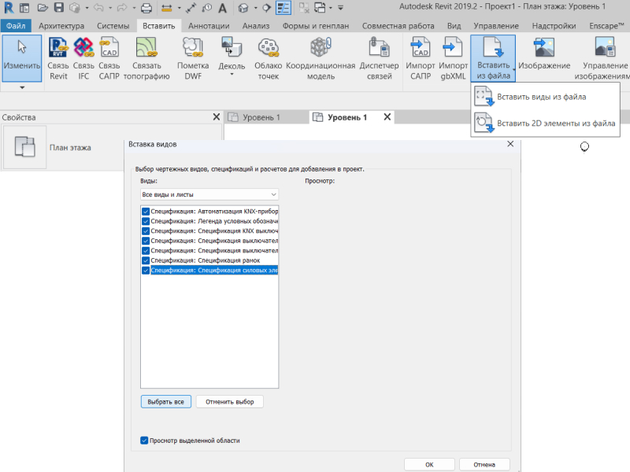

import productPreview from './product.jpg';

:::note
Las familias de este conjunto están disponibles por ahora solo en ruso. Las imágenes y los nombres de archivos y parámetros se mantienen en ruso para que puedas identificarlos en Revit. Las explicaciones están en español.
:::

<ProductCard
  name="Familias de enchufes retro para Revit"
  eyebrow="Conjunto de familias de Revit"
  description="Enchufes e interruptores de estilo retro, listos para colocar en tu proyecto de Revit."
  image={productPreview}
  imageAlt="Vista previa del conjunto de enchufes retro para Revit"
  buyUrl="https://bimcore.one/products/retro-style-socket-revit-families"
  ecwidProductId="660613460"
  buyLabel="Comprar"
  shopLabel="Ir a la tienda"
/>

## Introducción

Esta familia complementa el conjunto de enchufes. Los enchufes e interruptores de estilo vintage siguen la misma lógica de uso y utilizan símbolos similares, lo que permite utilizar ambos conjuntos en un mismo proyecto.

## 1. Contenido del conjunto

Proyecto con las familias y las tablas de planificación cargadas.

17 Проект Ретро-Розетки.rvt

Familias cargables.

- Marco retro (INT 01 Рамка ретро.rfa)
- Marco retro basado en cara (INT 01 Рамка грань ретро.rfa)

Etiquetas.

- INT 01 Марка розеток.rfa
- INT 01 Марка розеток — 21.rfa

## 2. Carga de las familias

INT 01 Рамка ретро es la familia principal. Se coloca en una planta de piso o de techo junto a la pared y permite indicar su altura.

INT 01 Рамка грань ретро se coloca sobre una superficie, en planta o en 3D. Se utiliza principalmente en suelos o techos. No permite indicar una altura independiente, ya que se coloca sobre la cara seleccionada sin desplazamiento.

Para trabajar, carga ambas familias en tu proyecto o cópialas desde el proyecto de ejemplo con Ctrl+C y pégalas con Ctrl+V.

En INT 01 Рамка ретро, el parámetro **INT_Отступ** establece la altura respecto al suelo. En INT 01 Рамка грань ретро, la altura depende de la superficie donde se coloca la familia.

## 3. Marcos de superficie y empotrados

Todos los marcos tienen dos tipos, empotrado (Встроенная) y de superficie (Накладная). Selecciona el tipo que necesites para cambiar la colocación del marco.

Puedes distinguir los mecanismos de superficie mediante un color utilizando el filtro de visibilidad y gráficos del proyecto de ejemplo.

Abre tu proyecto y el proyecto de ejemplo de enchufes retro. Desde tu archivo de trabajo, utiliza Transfer Project Standards para copiar las normas del proyecto. Así incorporarás los parámetros y el filtro de visibilidad y gráficos necesarios.

## 4. Mecanismos

El conjunto incluye 3 tipos de enchufes, 4 tipos de interruptores, 6 tipos de conmutadores, 4 tipos de reguladores de luz y mecanismos de corrientes débiles.

Para definir el contenido del marco, selecciona la familia de enchufe o interruptor en la lista desplegable de los parámetros **1х**, **2х**, **3х**, **4х**, **5х** y **6х**. Los prefijos В y Р identifican los interruptores y los enchufes, respectivamente.

## 5. Edición de los símbolos

Si necesitas cambiar el símbolo de un aparato en la tabla de planificación, puedes editar su archivo vectorial. Los archivos están agrupados en una carpeta.

Están guardados en formato .svg y se pueden editar en un editor vectorial de escritorio o en línea, como Figma. Puedes verlos en cualquier navegador.

### Sustitución de una imagen en el proyecto

Busca la familia correspondiente en el navegador de proyectos y abre su edición para acceder al editor de familias.

Abre la ventana de tipos de familia y sustituye el valor de **INT_Условное обозначение** para el nivel de detalle bajo o de **INT_Условное обозначение 2** para el nivel medio.

Después, vuelve a cargar la familia en el proyecto y selecciona la opción que sobrescribe la versión existente y sus valores de parámetros.

## 6. Tablas de planificación

El proyecto INT Проект Розетки incluye tablas de planificación preparadas.

Puedes copiarlas de un plano a otro con Ctrl+C y Ctrl+V, o utilizar la inserción desde archivo y seleccionar el proyecto INT Проект Розетки.

### Tablas incluidas

- Leyenda de símbolos (Легенда условных обозначений)
- Tabla de marcos (Спецификация рамок)
- Tabla de interruptores (Спецификация выключателей)
- Tabla de enchufes (Спецификация розеток)

<CTA type="guide" />
