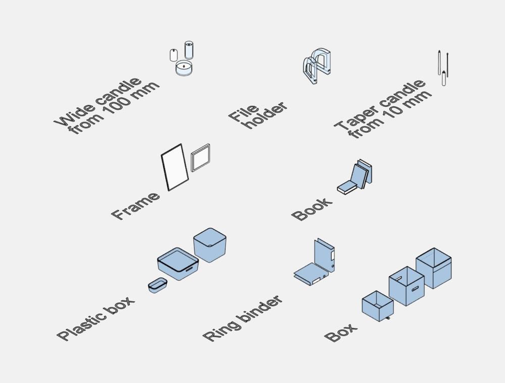
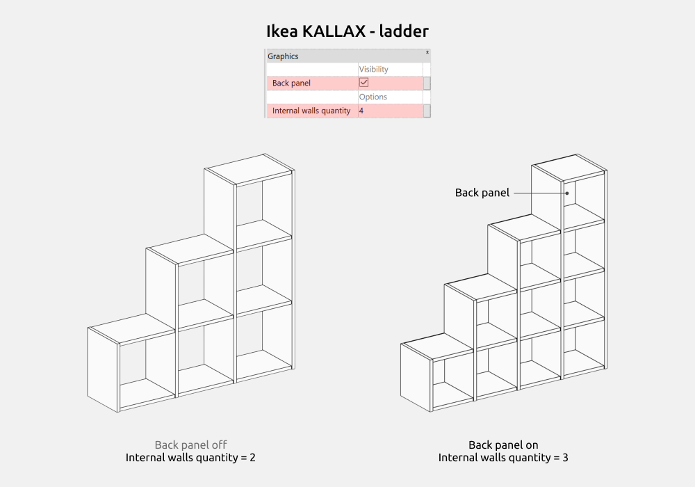
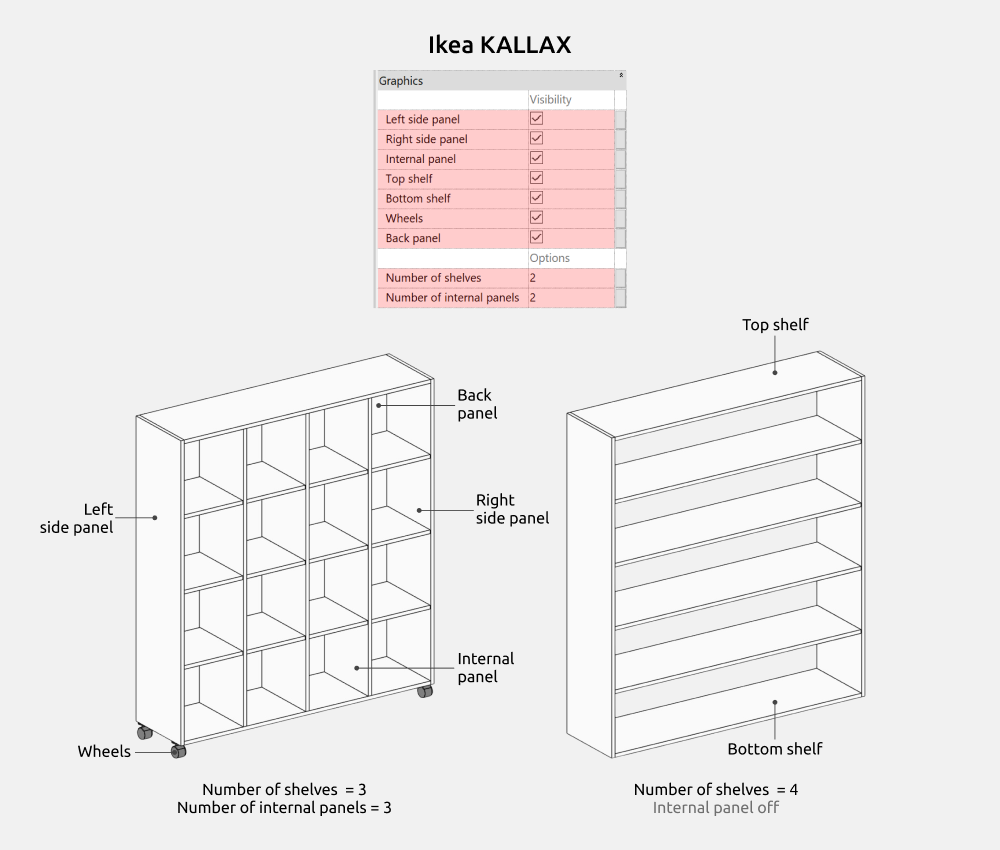
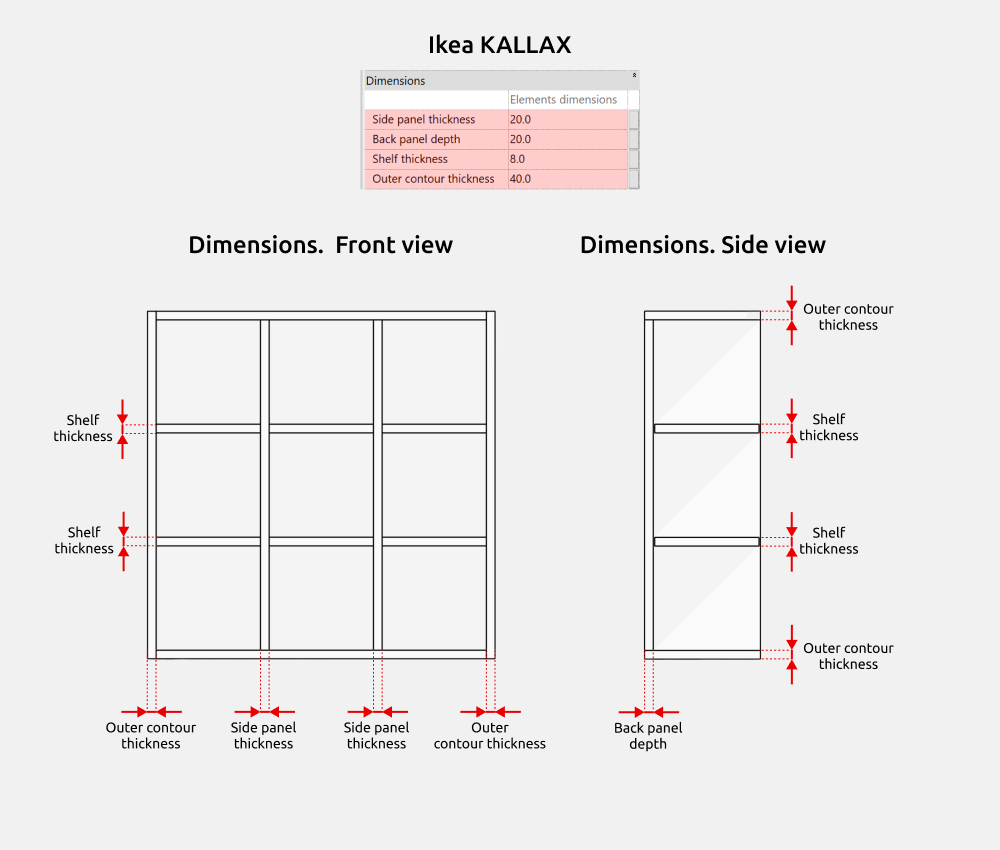
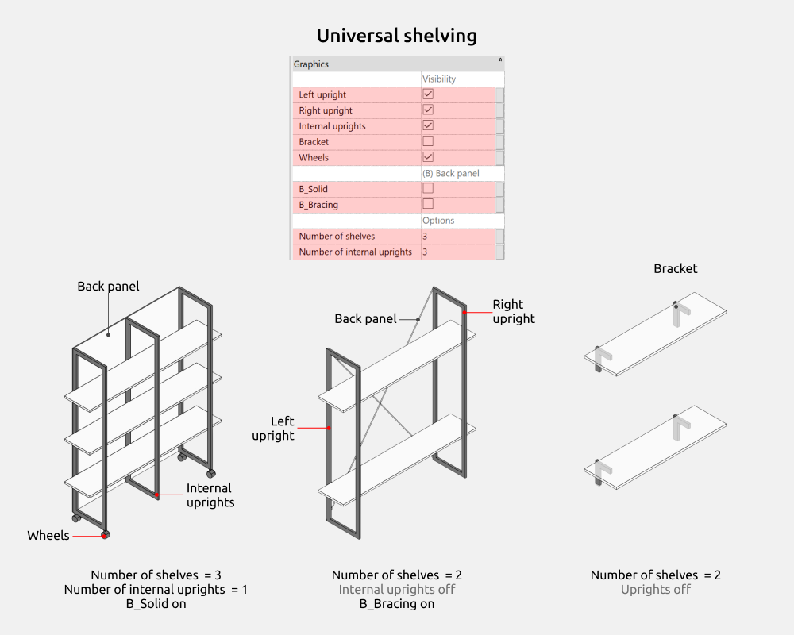
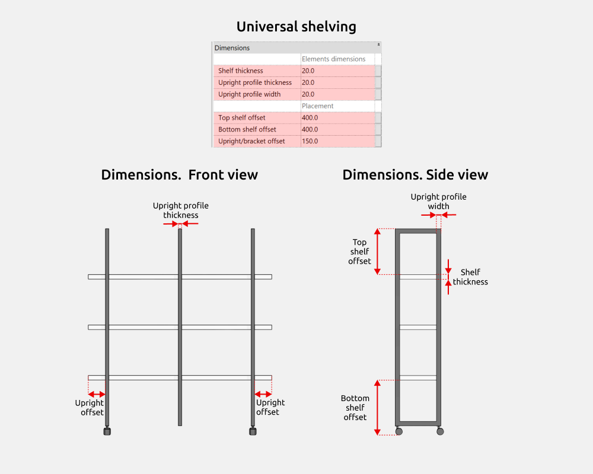
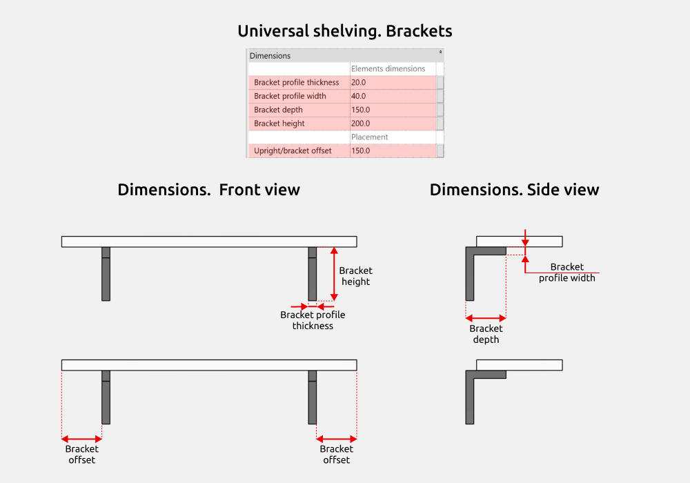

import productPreview from './product.jpg';

<ProductCard
  name="Familias de estanterías para Revit"
  eyebrow="Conjunto de familias de Revit"
  description="Baldas y estanterías en distintas configuraciones, listas para colocar en tu proyecto de Revit."
  image={productPreview}
  imageAlt="Vista previa del conjunto de estanterías para Revit"
  buyUrl="https://bimcore.one/products/shelving-revit-families"
  ecwidProductId="582497943"
  buyLabel="Comprar"
  shopLabel="Ir a la tienda"
/>

## 1. INFORMACIÓN GENERAL

- Nombre del conjunto Estanterías
- Versión del conjunto 1.1.0
- Versión de Revit 2019

### Descripción

Este conjunto de familias de estanterías está pensado para proyectos BIM de interiorismo y arquitectura en Autodesk Revit. La biblioteca incluye familias paramétricas de estanterías y objetos decorativos.

Está dirigido a diseñadores de interiores, arquitectos y proyectistas que trabajan en proyectos residenciales y de uso público.

### Carga y colocación

Para ver y cargar las familias, abre el proyecto de estanterías, copia las que necesites con Ctrl+C y pégalas en tu proyecto con Ctrl+V. También puedes abrir la carpeta de archivos de familia y arrastrarlos al proyecto.

:::note
Las imágenes y los nombres de los parámetros corresponden a la versión inglesa del conjunto. Las explicaciones están en español.
:::

## 2. CONTENIDO DEL CONJUNTO

- Ikea KALLAX escalonada (Ikea KALLAX - ladder)
- Ikea KALLAX
- Balda (Shelf)
- Estantería en zigzag (Zig Zag Shelf)
- Estantería universal (Universal shelving)

Familias de decoración.

- Libro (Book)
- Revistero (File holder)
- Archivador de anillas (Ring binder)
- Marco (Frame)
- Vela estrecha a partir de 10 mm (Taper candle from 10 mm)
- Vela ancha a partir de 100 mm (Wide candle from 100 mm)
- Caja de plástico (Plastic box)
- Caja (Box)

## 3. FAMILIAS

### Estanterías

#### Dimensiones generales

**INT_Width**, **INT_Depth** e **INT_Height** controlan la anchura, la profundidad y la altura totales de las estanterías.

#### Ikea KALLAX escalonada (Ikea KALLAX - ladder)

Puedes activar o desactivar el panel trasero mediante **Back panel**.

**Internal walls quantity** permite cambiar el número de divisiones interiores.

#### Ikea KALLAX

Puedes activar o desactivar estos elementos.

- Panel izquierdo (**Left side panel**)
- Panel derecho (**Right side panel**)
- Divisiones interiores (**Internal panel**)
- Balda superior (**Top shelf**)
- Balda inferior (**Bottom shelf**)
- Ruedas (**Wheels**)
- Panel trasero (**Back panel**)

**Number of shelves** cambia el número de baldas y **Number of internal panels** cambia el de divisiones interiores.

##### Dimensiones

- **Side panel thickness** indica el espesor de las divisiones interiores.
- **Back panel depth** indica la profundidad del panel trasero.
- **Shelf thickness** indica el espesor de las baldas interiores.
- **Outer contour thickness** indica el espesor de los laterales y de las baldas superior e inferior.

#### Balda (Shelf)

Puedes activar o desactivar los soportes con **Bracket** y cambiar su cantidad mediante **Number of bracket**.

##### Dimensiones

**INT_Width**, **INT_Depth** e **INT_Height** describen las dimensiones generales de la balda.

Algunos parámetros aparecen en gris y no se pueden modificar, pero ayudan a entender el cálculo de las dimensiones. Por ejemplo, **INT_Height** muestra la altura total de la balda, que resulta de sumar su espesor y la altura del soporte.

**Top shelf height** controla la altura de colocación de la balda. **Bracket side offset** controla el desplazamiento de los soportes a lo largo de su anchura.

#### Estantería en zigzag (Zig Zag Shelf)

Puedes cambiar el número de baldas y de montantes con **Number of shelves** y **Number of upright**.

##### Dimensiones

**Upright offset** controla el desplazamiento de los montantes a lo largo de la anchura de la estantería.

**Upright profile thickness** y **Upright profile width** definen el espesor y la anchura del perfil del montante.

**Top shelf offset** y **Bottom shelf offset** ajustan el desplazamiento de las baldas superior e inferior. **Shelf thickness** controla el espesor de la balda.

#### Estantería universal (Universal shelving)

Puedes activar o desactivar los siguientes elementos.

- Montante izquierdo (Left upright)
- Montante derecho (Right upright)
- Montantes interiores (Internal uprights)
- Soporte (Bracket)
- Ruedas (Wheels)

Tipos de panel trasero disponibles.

- Panel continuo (B_Solid)
- Arriostramiento (B_Bracing)

**Number of shelves** y **Number of internal uprights** permiten ajustar el número de baldas y de montantes interiores.

##### Dimensiones

**Upright/bracket offset** controla el desplazamiento de los montantes a lo largo de la anchura de la estantería.

**Upright profile thickness** y **Upright profile width** definen el espesor y la anchura del perfil del montante.

**Top shelf offset** y **Bottom shelf offset** ajustan el desplazamiento de las baldas superior e inferior. **Shelf thickness** controla su espesor.

**Upright/bracket offset** también controla el desplazamiento lateral de los soportes.

**Bracket depth**, **Bracket height**, **Bracket profile thickness** y **Bracket profile width** permiten ajustar la profundidad y la altura del soporte, así como el espesor y la anchura de su perfil.

##### Opciones

Puedes elegir estos tipos de montante.

- Un montante central en L (1 Central L-upright)
- Un montante recto junto a la pared (1 Straight wall upright)
- Un montante recto central (1 Central straight upright)
- Dos montantes rectos laterales (2 Side straight uprights)
- Dos soportes laterales en L (2 Side L-brackets)
- Cubo (Cube)
- Marco (Frame)

### Decoración

Las familias de decoración permiten llenar las estanterías y los sistemas de almacenamiento abiertos según las necesidades del interior.

Su altura, anchura y profundidad se pueden ajustar para adaptar los objetos a las dimensiones concretas de las baldas.

<CTA type="guide" />
