import productPreview from './product.png';

<ProductCard
  name="Familias de aparadores y cómodas para Revit"
  description="Cómodas y aparadores, listos para colocar en tu proyecto de Revit."
  image={productPreview}
  imageAlt="Vista previa del conjunto de aparadores y cómodas para Revit"
  buyUrl="https://bimcore.one/products/dresser-revit-families"
  ecwidProductId="615953573"
  buyLabel="Ver el precio en la tienda"
/>

## 1. INFORMACIÓN GENERAL

- Nombre del conjunto Aparadores y cómodas
- Versión del conjunto 1.0.0
- Versión de Revit 2019

### Descripción

Este conjunto permite modelar aparadores y cómodas de distintas configuraciones con dimensiones exactas en Autodesk Revit.

Está pensado para diseñadores de interiores y arquitectos. Las familias no tienen suficiente detalle para modelar muebles destinados a su fabricación.

### Carga y colocación

Para ver y cargar las familias, abre el proyecto de aparadores y cómodas, copia las que necesites con Ctrl+C y pégalas en tu proyecto con Ctrl+V. También puedes abrir la carpeta de archivos de familia y arrastrarlos al proyecto.

:::note
Las imágenes y los nombres de los parámetros corresponden a la versión inglesa del conjunto. Las explicaciones están en español.
:::

## 2. CONTENIDO DEL CONJUNTO

- Aparador (Sideboard)
- Aparador ovalado (Sideboard oval)
- Cómoda (Dresser)

## 3. ELEMENTOS COMUNES DE LA CÓMODA Y EL APARADOR

Este apartado describe los elementos y opciones que se repiten en Dresser y Sideboard.

### Frentes

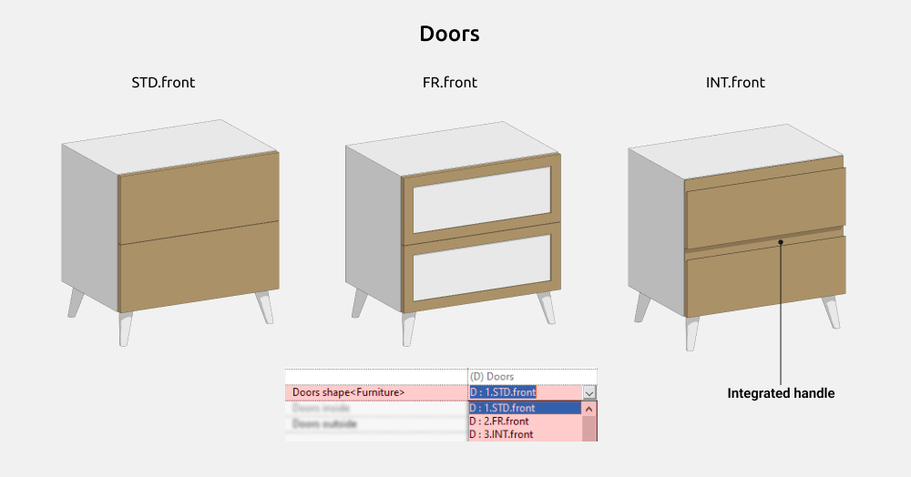

La lista incluye frentes lisos (STD.front), con marco exterior (FR.Front) y con tirador integrado (INT.front).

Todos los tipos pueden ser remetidos o superpuestos.

### Tiradores

- Pomo (Knob)
- Recorte (Cut-out handle)
- Tirador de puente (Bow handle)
- Lazo de cuero (Leather loop pull)
- Tirador superpuesto (Overlay handle)
- Tirador en T (T-shaped)
- Concha (Shell pull)
- Asa de cuero (Leather pull handle)
- Tirador rectangular de toda la anchura del frente (Rectangular handle)

### Patas

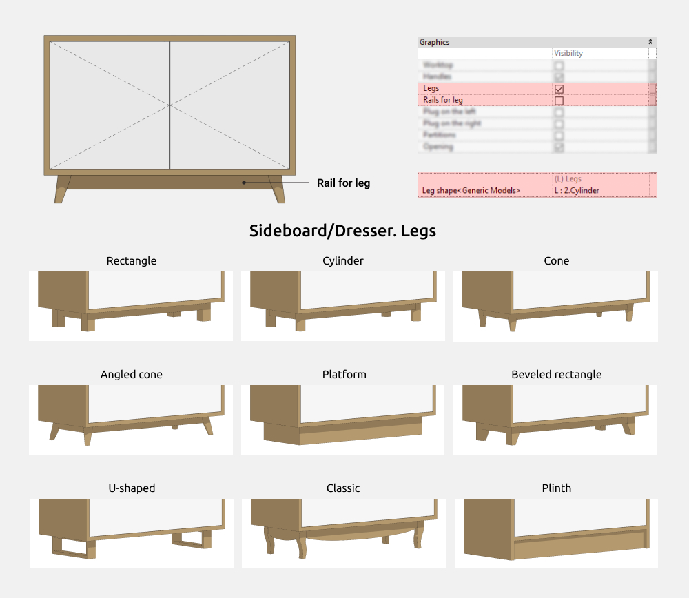

- Rectangular (Rectangle)
- Cilíndrica (Cylinder)
- Cónica (Cone)
- Plataforma (Platform)
- Rectangular estrechada (Chamfered rectangle)
- Cónica inclinada (Angled cone)
- En U (U-shaped)
- Zócalo (Plinth)
- Clásica (Classic)

Con las patas independientes puedes activar o desactivar los travesaños que las unen.

## 4. FAMILIAS

### Cómoda (Dresser)

Esta familia permite crear cómodas de distintas configuraciones.

Puedes activar o desactivar el módulo 2 (**Module 2**), los tiradores de cada módulo (**Handle module 1** y **Handle module 2**), el tablero (**Worktop**), el borde elevado (**Raised edge**), las patas (**Legs**) y sus travesaños (**Rails for leg**).

#### Opciones de la cómoda

La cantidad de frentes parte de uno. Su anchura se calcula automáticamente. Para consultar los límites de cada parámetro, coloca el cursor sobre su nombre y espera a que aparezca la información de herramienta.

En el módulo 1, **1_Column count** admite de 1 a 2 columnas y **1_Drawer count**, uno o más cajones. En el módulo 2, **2_Column count** admite de 1 a 4 columnas y **2_Drawer count**, uno o más cajones.

Al aumentar la cantidad de cajones en vertical, comprueba que las dimensiones sigan siendo compatibles para evitar errores.

#### Dimensiones

**Dresser Height** incluye las alturas de los elementos activados, como **Legs Height**, **Module 2 Height**, **Worktop Thickness** y **Raised edge Height**.

Los parámetros en gris no se pueden editar y ayudan a entender los cálculos. Por ejemplo, **INT_Width** muestra la anchura total, calculada a partir de la anchura de la cómoda y del vuelo del tablero.

Si el tablero está desactivado, **INT_Width** coincide con **Dresser Width**. La misma lógica se aplica a la profundidad.

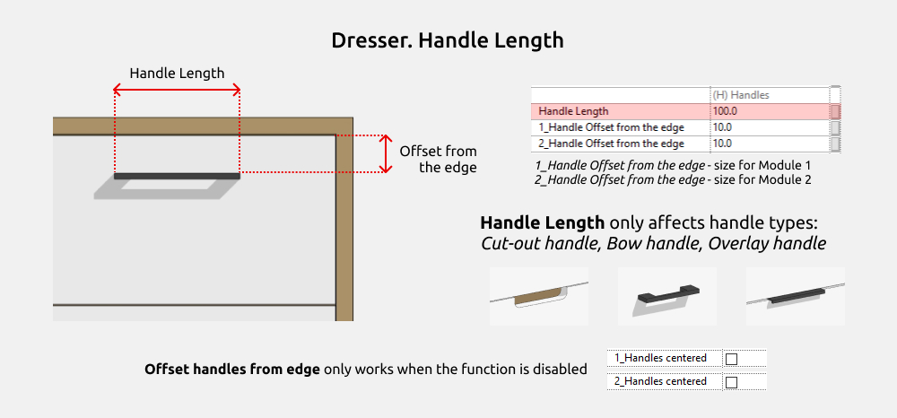

Los tiradores recortados, de puente y superpuestos permiten ajustar su anchura. Los recortados y superpuestos siempre quedan centrados en el borde superior del frente. **Handle Offset from edge** controla la posición vertical de los tiradores.

Las patas clásicas tienen dimensiones fijas de 40 mm de anchura y 150 mm de altura.

**Lateral shift Legs** y **Forward-backward shift Legs** desplazan las patas hacia el centro de la cómoda.

#### Frentes

En el módulo 2 puedes desactivar los frentes para crear una balda abierta en la parte superior. Solo puede haber una balda y la cantidad de divisiones verticales depende del número de columnas del módulo 2.

#### Tiradores

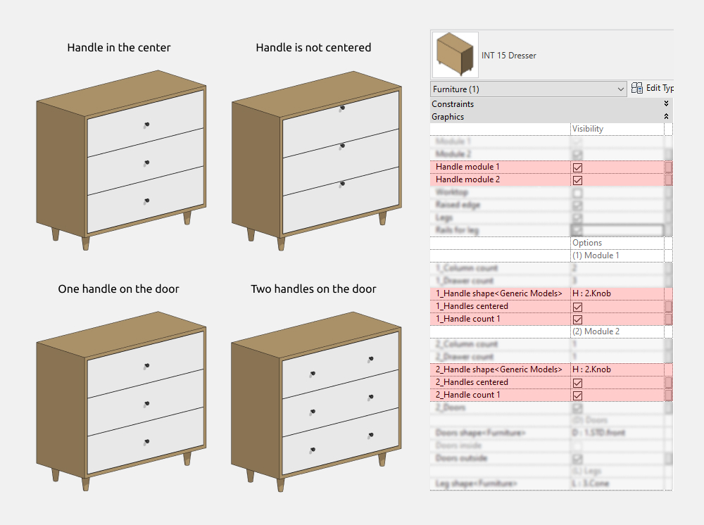

Los tiradores de cada módulo se activan, desactivan y configuran por separado. Cada frente puede tener uno o dos, excepto los recortados y superpuestos, que siempre son únicos.

Al desactivar **1_Handles centered** o **2_Handles centered**, los tiradores del módulo correspondiente se desplazan hacia el borde superior. Puedes ajustar su separación de ese borde en el apartado de dimensiones.

#### Materiales

### Aparador (Sideboard)

Esta familia permite crear aparadores de distintas configuraciones.

Puedes activar o desactivar el tablero (**Worktop**), los tiradores (**Handles**), las patas (**Legs**), sus travesaños (**Rails for leg**), los paneles laterales izquierdo y derecho (**End panel on the left** y **End panel on the right**), las divisiones (**Partitions**) y la apertura (**Opening**).

El tipo de frente y de tirador es común a todos los módulos. Para cada módulo se ajustan por separado la cantidad de frentes, la posición y orientación vertical del tirador y el tipo de apertura.

#### Opciones del aparador

El aparador puede tener de 1 a 5 módulos, iguales o configurados por separado. La anchura de cada uno es independiente, excepto la del módulo 1, que se calcula restando las anchuras de los módulos 2 a 5 a la anchura total.

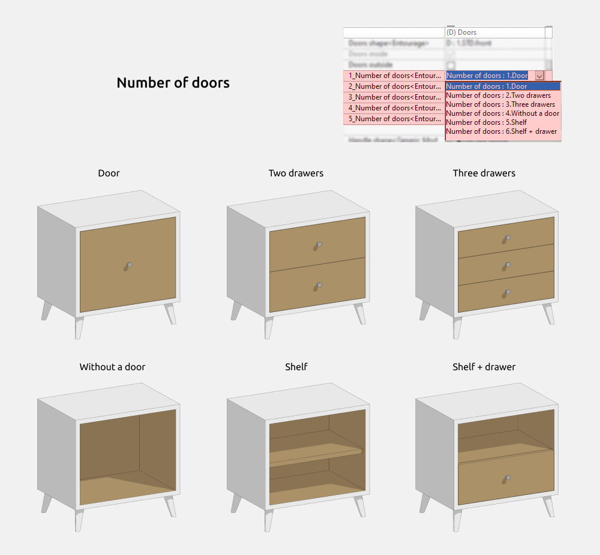

Cada módulo se configura por separado.

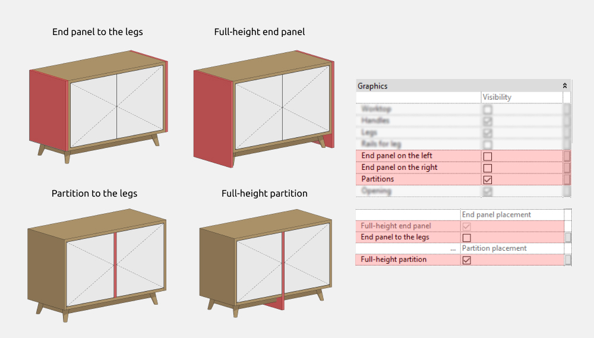

Los paneles laterales se activan por separado, pero su altura se ajusta conjuntamente. Puedes activar una división adicional entre módulos para crear otras configuraciones.

#### Dimensiones

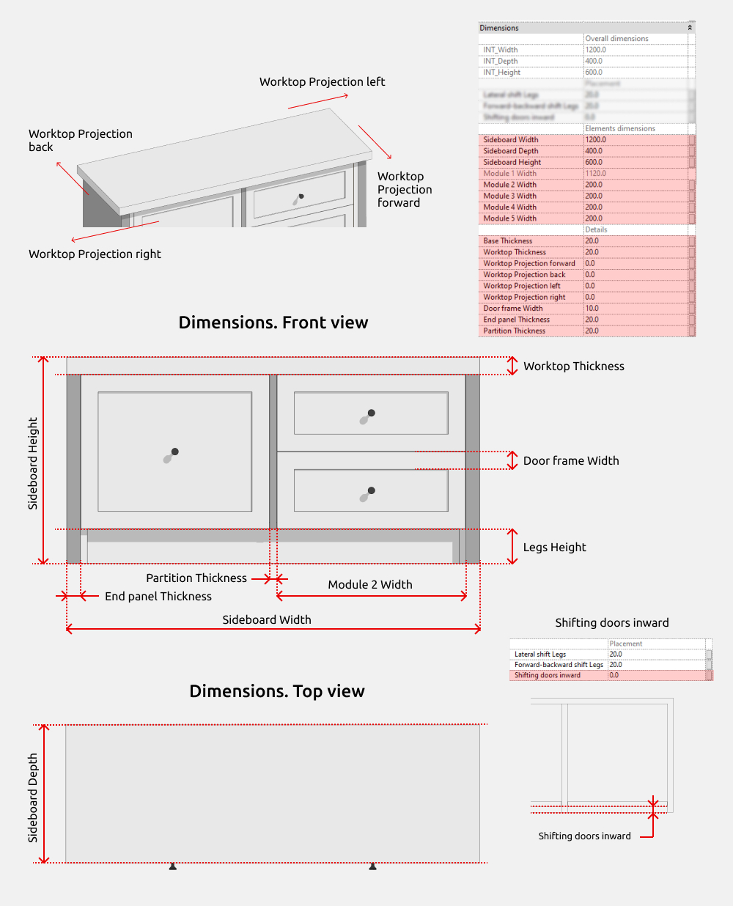

**Sideboard Height** incluye las alturas de los elementos activados, como **Legs Height** y **Worktop Thickness**.

Los parámetros en gris no se pueden modificar. **Module 1 Width** se calcula para que la familia funcione correctamente. Los parámetros con el prefijo INT son compartidos y se pueden utilizar en tablas de planificación.

Sin tablero, **INT_Width** coincide con **Sideboard Width**. La misma lógica se aplica a la profundidad.

Los tiradores recortados, de puente y superpuestos permiten ajustar su anchura. Los recortados y superpuestos quedan centrados en el borde superior. **Handle Offset from edge** controla su posición vertical.

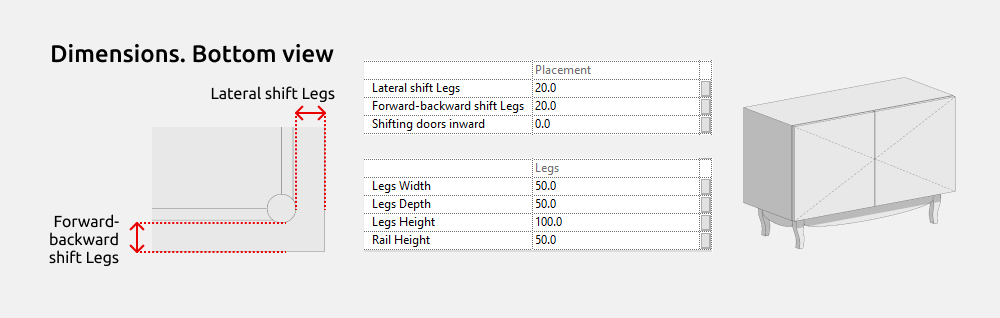

Las patas clásicas tienen 40 mm de anchura y 150 mm de altura, ambos valores fijos. **Lateral shift Legs** y **Forward-backward shift Legs** desplazan las patas hacia el centro.

#### Apertura de los frentes

La apertura se configura para cada módulo.

1. Apertura a la izquierda (Left-hinged)
2. Cajón (Drawer)
3. Apertura a la derecha (Right-hinged)
4. Abatible hacia abajo (Drop-down)

#### Posición de los tiradores

La posición y la orientación se configuran para cada módulo.

#### Materiales

#### Ajustes gráficos

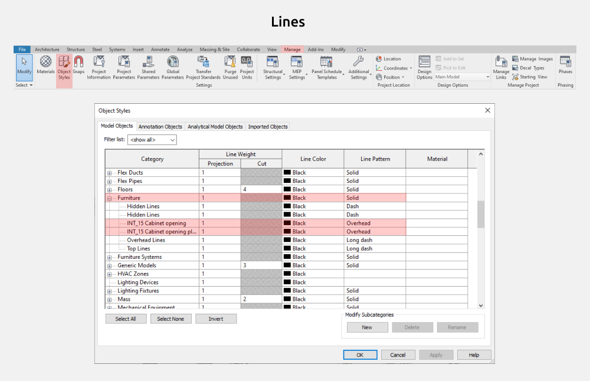

Para cambiar el color, el grosor o el patrón de las líneas, o desactivar las líneas de apertura, abre la ficha Gestionar, selecciona Estilos de objeto y busca la categoría Mobiliario.

### Aparador ovalado (Sideboard oval)

Esta familia permite crear aparadores con esquinas redondeadas y distintas configuraciones.

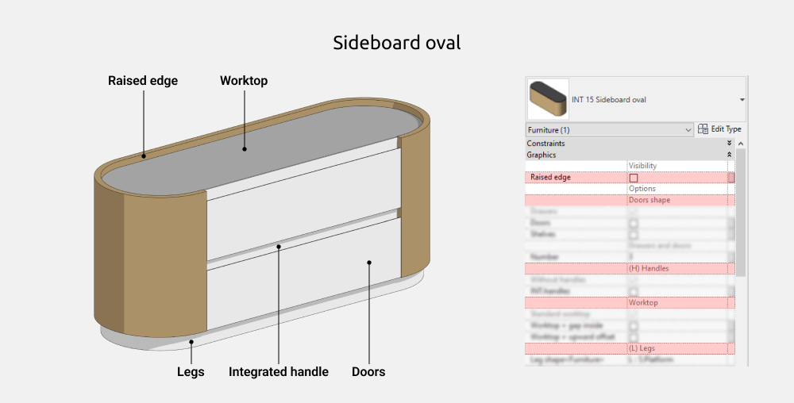

Puedes activar o desactivar el borde elevado (**Raised edge**) y los tiradores integrados (**Integrated handles**). También se ajustan el tipo y la cantidad de frentes, la posición del tablero y la forma de las patas.

#### Dimensiones

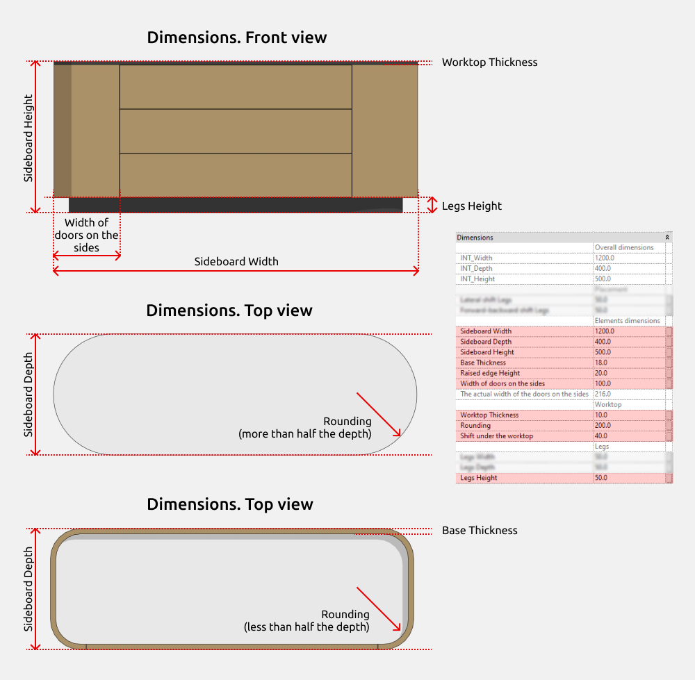

**Sideboard Height** incluye la altura del borde cuando está activado. Los parámetros en gris no se pueden modificar. Los que empiezan por INT son compartidos y se pueden utilizar en tablas de planificación.

#### Frentes

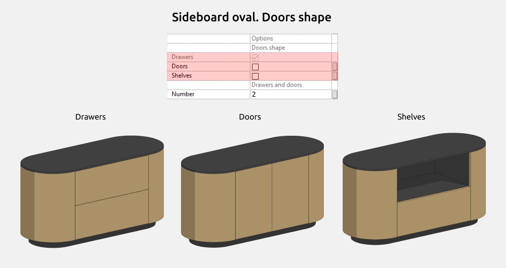

Con los tipos cajón (Drawer) y puerta (Door), puedes modificar la cantidad de frentes. Con la opción de balda (Shelves), el frente del cajón inferior es siempre único.

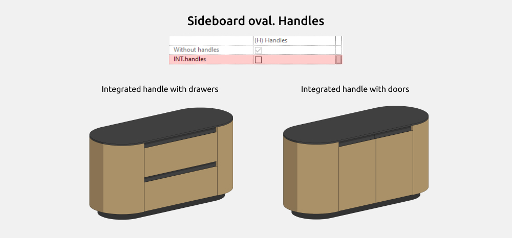

Cualquier tipo de frente puede tener un tirador integrado.

Al seleccionar Worktop + gap inside o Worktop + upward offset, puedes ajustar el desplazamiento del tablero en el apartado de dimensiones.

#### Patas

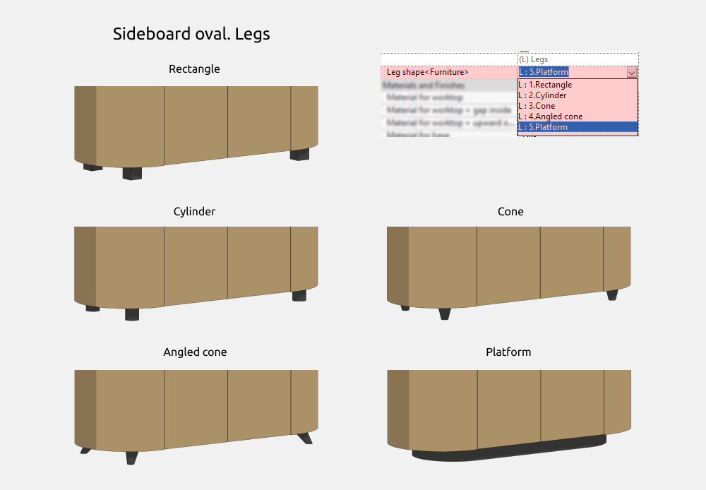

Puedes elegir patas rectangulares (Rectangle), cilíndricas (Cylinder), cónicas (Cone), cónicas inclinadas (Angled cone) o una plataforma (Platform).

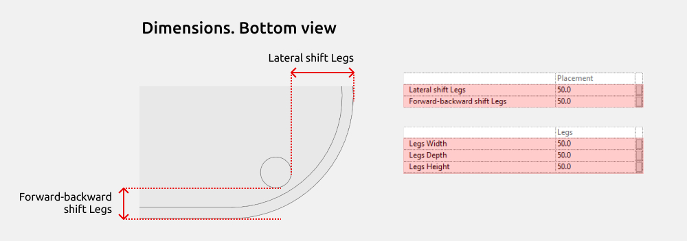

**Lateral shift Legs** y **Forward-backward shift Legs** desplazan las patas hacia el centro.

#### Materiales

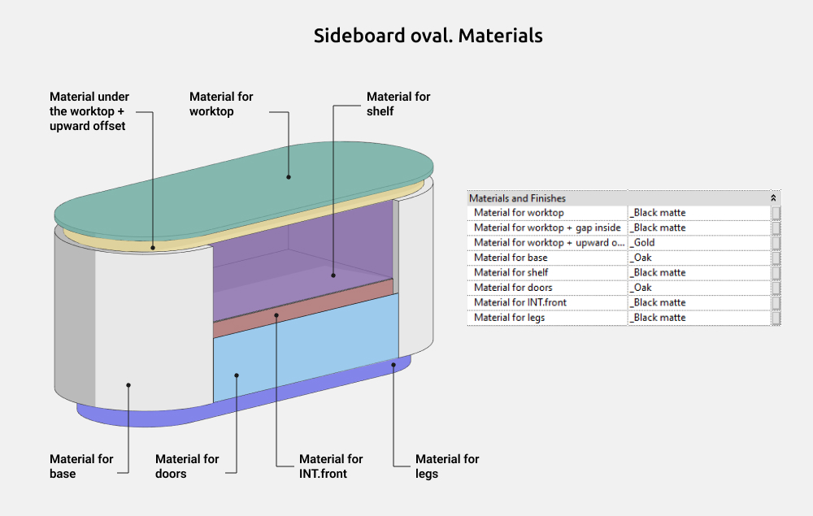

<CTA type="guide" />
