import productPreview from './product.jpg';

:::note
Las familias de este conjunto están disponibles por ahora solo en ruso. Las imágenes y los nombres de archivos y parámetros se mantienen en ruso para que puedas identificarlos en Revit. Las explicaciones están en español.
:::

<ProductCard
  name="Familias de enchufes e interruptores para Revit"
  description="Enchufes, interruptores y otros mecanismos, listos para colocar en tu proyecto de Revit."
  image={productPreview}
  imageAlt="Vista previa del conjunto de enchufes para Revit"
  buyUrl="https://bimcore.one/products/socket-revit-families-v-4"
  ecwidProductId="543601734"
  buyLabel="Ver el precio en la tienda"
/>

## 1. INFORMACIÓN GENERAL

- Nombre del conjunto Enchufes
- Versión del conjunto 4.2.2
- Versión de Revit 2019

### Descripción

Este conjunto permite crear planos de instalaciones eléctricas e interruptores y contabilizar marcos y mecanismos en las tablas de planificación de Autodesk Revit.

Está pensado para diseñadores de interiores y arquitectos. La geometría de los marcos y mecanismos está simplificada y se ha creado con las herramientas de Revit.

### Carga y colocación

Para ver y cargar las familias, abre el proyecto de enchufes, copia las que necesites con Ctrl+C y pégalas en tu proyecto con Ctrl+V. También puedes abrir la carpeta de archivos de familia y arrastrarlos al proyecto.

Si ya tienes versiones antiguas de estas familias, elimínalas antes. En el navegador de proyectos, despliega las familias y la categoría Электрические приборы, selecciona las familias del conjunto de enchufes y elimínalas.

Para evitar problemas con las imágenes en las tablas, al cargar selecciona la opción que sustituye la familia compartida de componentes anidados junto con sus valores de parámetros.

## 2. CONTENIDO DEL CONJUNTO

El conjunto incluye estas familias.

- Marco (Рамка)
- Marco basado en cara (Рамка грань), para colocar enchufes sobre una superficie seleccionada
- Etiqueta de enchufes (Марка розеток)
- Leyenda (Легенда), de la categoría Обобщенные модели

Las familias de aparatos pertenecen a la categoría Электрические приборы.

También se incluye un grupo de mecanismos independientes, que se colocan fuera de los marcos.

- WIFI
- Salida eléctrica (Вывод электрический)
- Interfonos (Домофоны)
- Mecanismos (Механизмы)
- Mecanismos basados en cara (Механизмы по грани)
- Paneles de control (Пульты управления)
- Toma de fuerza de 380 V (Розетка силовая 380V)
- Termostatos (Терморегуляторы)
- Amplificador de señal móvil (Усилитель сотового сигнала)

Рамка es la familia principal. Se coloca en una planta de piso o de techo junto a la pared y permite indicar su altura.

Рамка грань se coloca sobre una superficie, en planta o en 3D. Se utiliza sobre todo en suelos y techos. Su altura depende de la superficie seleccionada, sin desplazamiento independiente.

Las familias con los prefijos В y Р son familias anidadas destinadas exclusivamente al interior del marco. No se recomienda colocarlas de forma independiente.

## 3. NIVELES DE DETALLE

La representación en planta y alzado depende del nivel de detalle de la vista. Para las vistas 3D utiliza el nivel alto.

## 4. ESCALA

Los parámetros de tipo **М План** y **М Фасад** modifican el tamaño del símbolo en planta y alzado en los niveles bajo y medio.

**Размер механизма** y **Толщина внешней рамки** modifican el tamaño real del enchufe o interruptor. Este cambio se ve en el nivel de detalle alto.

## 5. OPCIONES DEL MARCO

### 1. Tipos de marco

El número de mecanismos del marco depende del tipo seleccionado.

Para definir su contenido, selecciona la familia de enchufe o interruptor en la lista de los parámetros **1х**, **2х**, **3х**, **4х**, **5х** y **6х**. El prefijo В identifica los interruptores y Р los enchufes.

Un marco de dos posiciones utiliza solo **1х** y **2х**. Uno de cinco utiliza **1х**, **2х**, **3х**, **4х** y **5х**; en ese caso **6х** no modifica el contenido.

Para pasar de un marco horizontal a uno vertical, desactiva **Гор**.

### 2. Enchufes

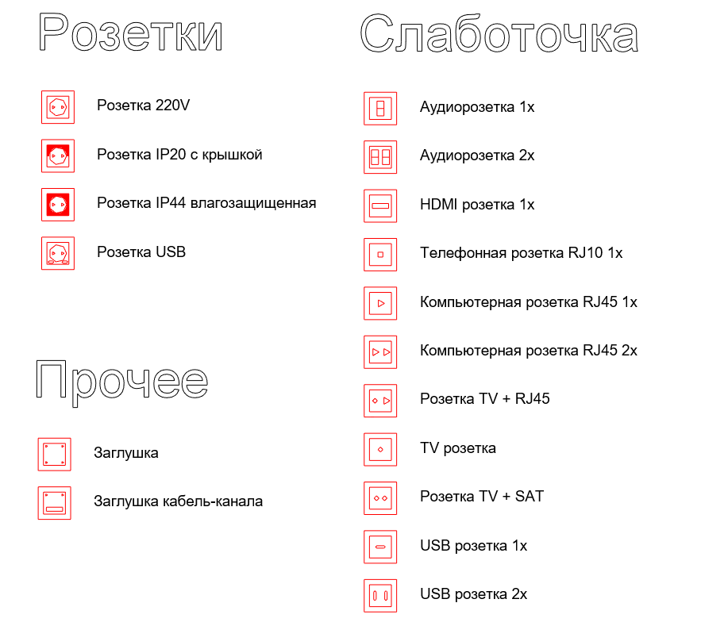

Los enchufes son familias compartidas anidadas en los marcos. Estos son sus tipos.

Р 01 Прочее, otros elementos.

- Tapa ciega (Заглушка)
- Tapa para canaleta (Заглушка кабель-канала)
- Otro 1 (Прочее 1)
- Otro 2 (Прочее 2)
- Otro 3 (Прочее 3)

Р 01 Розетка, enchufes.

- 220V
- IP20 con tapa (IP20 с крышкой)
- IP44
- USB

Р 01 Слаботочка, conectores de baja corriente.

- Audio 1x
- Audio 2x
- HDMI 1х
- RJ10 1x, teléfono
- RJ45 1x, red de datos
- RJ45 2x, red de datos
- RJ45 + TV
- TV
- TV + SAT
- USB 1x
- USB 2x

Para encontrar antes los enchufes en la lista, escribe la letra cirílica mayúscula Р.

Los tipos Прочее 1, Прочее 2 y Прочее 3 permiten crear un tipo propio para un mecanismo que falte. Puedes añadirles tu propio texto 3D y utilizarlos en el proyecto.

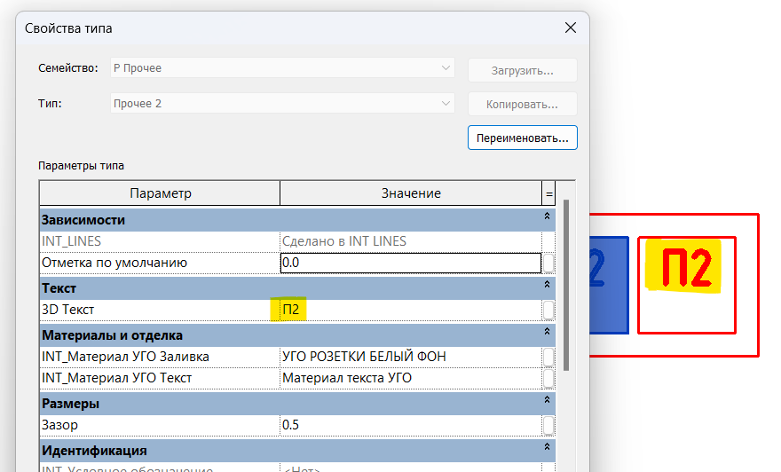

### 3. Interruptores

Los interruptores también son familias compartidas anidadas en los marcos.

В 01 Выключатель, interruptores.

- Una tecla (1КЛ)
- Dos teclas (2КЛ)
- Tres teclas (3КЛ)
- Cuatro teclas (4КЛ)
- Tarjeta (КАРТ)
- Interruptor maestro (МАСТЕР)

В 01 Датчик движения, detector de movimiento.

В 01 Диммер, reguladores.

- Una tecla de pulsación (1КЛ НАЖИМ)
- Dos teclas de pulsación (2КЛ НАЖИМ)
- Persianas (ЖАЛЮЗИ)
- Giratorio con pulsación (ПОВ НАЖ)
- Giratorio (ПОВОРОТНЫЙ)

В 01 Переключатель, conmutadores.

- Una tecla (1КЛ)
- Cruzamiento de una tecla (1КЛ Перекрестный)
- Dos teclas (2КЛ)
- Cruzamiento de dos teclas (2КЛ Перекрестный)

В 01 Терморегулятор, termostatos.

- Radiador mecánico (РАДИАТОР МЕХ)
- Radiador electrónico (РАДИАТОР ЭЛЕКТР)
- Suelo radiante mecánico (ТЕПЛ ПОЛ МЕХ)
- Suelo radiante electrónico (ТЕПЛ ПОЛ ЭЛЕКТР)

Para buscar los interruptores, escribe la letra cirílica mayúscula В.

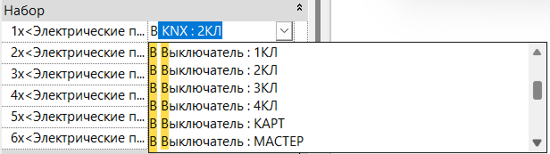

### 4. Puntos de referencia

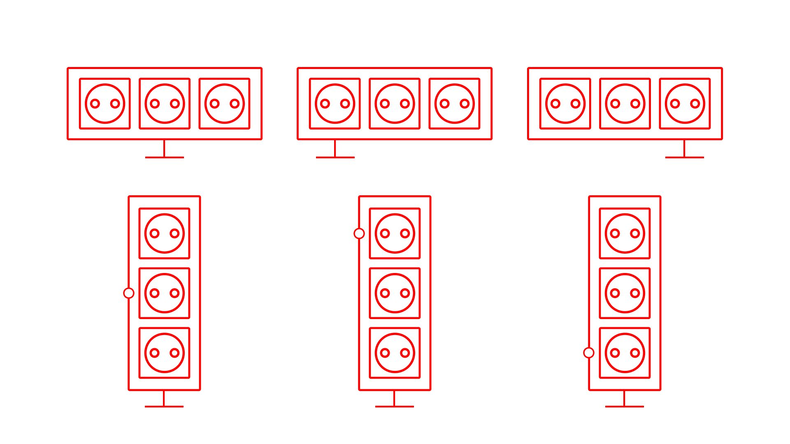

En planta, la directriz de un marco horizontal puede referirse al centro del marco, al primer mecanismo o al último.

En alzado, un marco vertical puede referirse a su centro, al mecanismo inferior o al superior. El punto de referencia se representa con un círculo.

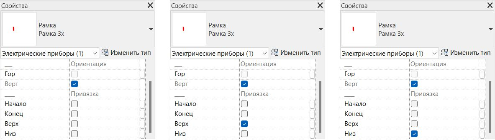

### 5. Materiales

Para cambiar los materiales en el nivel de detalle alto, asigna los materiales que necesites a los parámetros de ejemplar **INT_Материал рамки** y **INT_Материал розетки**.

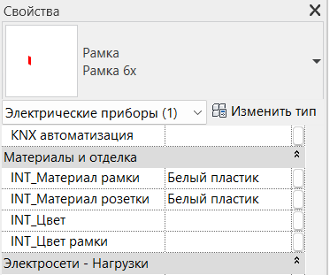

## 6. COLOCACIÓN

### 1. Desplazamiento del símbolo en planta y alzado

**Вынос УГО План** y **Вынос УГО Фасад** permiten mostrar los marcos aunque queden tapados por muebles u otros elementos en planta o alzado, cuando no se utiliza el nivel de detalle alto en los alzados interiores.

Un error frecuente es olvidar que Revit considera la altura del marco junto con el desplazamiento de su símbolo en planta. La altura resultante se obtiene sumando **INT отступ от пола**, la altura sobre el suelo, y **Вынос УГО План**.

Por ejemplo, si tienes un interruptor a una altura de 900 mm y su símbolo tiene un desplazamiento de 2500, en la planta de Revit el interruptor será visible hasta la cota +2.400 respecto al suelo terminado.

Si el plano de la segunda planta está por debajo de la suma de **INT отступ от пола** y **Вынос УГО План**, el interruptor se ve también en la segunda planta. Si está más abajo, solo en la primera.

### 2. Separación de la pared

**Отступ от основы** controla la separación respecto a la pared. Cuanto mayor sea el valor, más se aleja el símbolo del marco.

Puedes introducir valores negativos para situar el símbolo al otro lado de la pared, algo útil en habitaciones pequeñas.

En alzado y sección, el símbolo se coloca centrado sobre la posición real del marco, sin ese desplazamiento.

## 7. ETIQUETADO

La familia INT 01 Марка розеток incluye estos tipos de etiqueta.

- Breve (Краткая), con la altura del aparato (**INT_отступ от пола**) y el comentario.
- Breve con orientación (Краткая + Ориентация), con la altura (**INT_отступ от пола**), **INT_Ориентация** y el comentario.
- Completa (Полная), con **INT_Отступ от пола**, **INT_Ориентация**, **INT_Производитель**, **INT_Серия**, **INT_Цвет**, **INT_Цвет рамки** y el comentario.
- Solo comentario (Только комментарий).

La altura de Рамка грань es siempre 0 en esta etiqueta, porque la familia se coloca sobre una superficie sin desplazamiento.

Los marcos también incluyen **Марка**, que muestra junto al enchufe una etiqueta con su altura de colocación. Si utilizas una familia de etiqueta independiente, desactiva esta casilla.

## 8. PLANO DE TECHO

El plano de techo muestra los elementos situados por encima de su plano de corte. Para mostrar elementos que estén por debajo o tapados por muebles, ajusta **Вынос УГО План** de manera que la suma de **INT отступ от пола** y **Вынос УГО План** supere la altura del plano de corte.

También puedes utilizar la herramienta de región de plano de Revit, llamada Фрагмент плана en la interfaz rusa.

Para que los enchufes e interruptores tengan en el plano de techo la misma apariencia que en planta con el nivel de detalle medio, establece la transparencia en 100 % en Reemplazos de visibilidad/gráficos de la vista. En el nivel bajo se muestran correctamente sin modificar la transparencia.

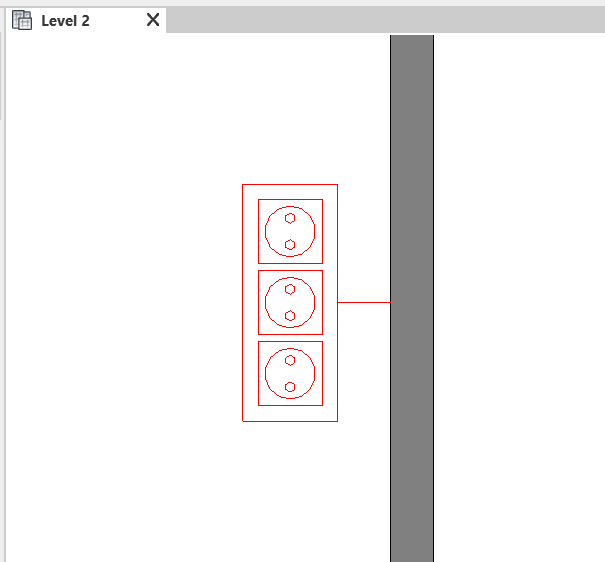

## 9. MECANISMOS INDEPENDIENTES

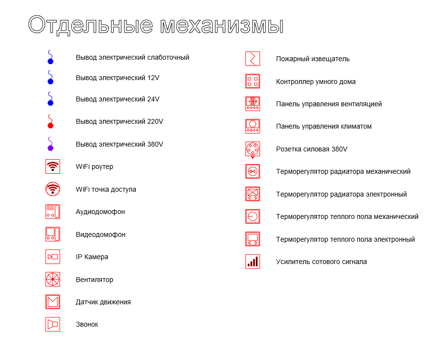

Estas son las familias y sus tipos.

INT 01 WIFI.

- Router (Роутер)
- Punto de acceso (Точка доступа)

INT 01 Вывод электрический, salidas eléctricas.

- Baja corriente (Слаботочный)
- 12V
- 24V
- 220V
- 380V

INT 01 Домофоны, interfonos.

- Interfono de audio (Аудиодомофон)
- Videoportero (Видеодомофон)

INT 01 Механизмы y INT 01 Механизмы по грани.

- Cámara IP (IP Камера)
- Ventilador (Вентилятор)
- Detector de movimiento (Датчик движения)
- Timbre (Звонок)
- Detector de humo (Пожарный извещатель дымовой)

INT 01 Пульты управления, paneles de control.

- Controlador de domótica (Контроллер умного дома)
- Control de ventilación (Пульт управления вентиляцией)
- Control del clima (Пульт управления климатом (Метеостанция))

INT 01 Розетка силовая 380V, tomas de fuerza.

- Empotrada (Скрытая 3Р+Е+N 16А 380В IP44)
- Fija (Стационарная 3Р+Е+N 16А 380В IP44)

INT 01 Терморегуляторы, termostatos.

- Termostato mecánico de radiador (Терморегулятор радиатора - Механический)
- Termostato electrónico de radiador (Терморегулятор радиатора - Электронный)
- Termostato mecánico de suelo radiante (Терморегулятор теплого пола - Механический)
- Termostato electrónico de suelo radiante (Терморегулятор теплого пола - Электронный)

INT 01 Усилитель сотового сигнала, amplificador de señal móvil.

Механизмы по грани se coloca sobre la superficie seleccionada. Los demás mecanismos se colocan en planta.

Si activas el parámetro de ejemplar **Марка**, la etiqueta muestra la altura del elemento y el valor del parámetro de tipo **INT_Комментарий по типу**.

### Salidas eléctricas

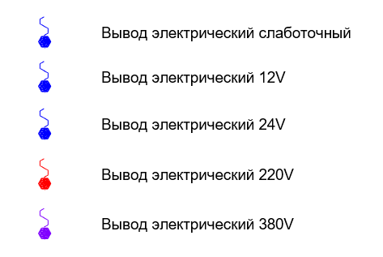

Las salidas eléctricas se muestran en planta en los niveles de detalle medio y bajo, independientemente de su altura.

## 10. GRÁFICOS

### 1. Estilos de líneas

Para cambiar el color de los enchufes e interruptores en todo el proyecto, abre la herramienta de estilos de objeto en la pestaña de gestión de Revit.

Modifica los colores de la categoría Электрические приборы y de sus subcategorías. Las subcategorías sobrantes de versiones antiguas se pueden eliminar.

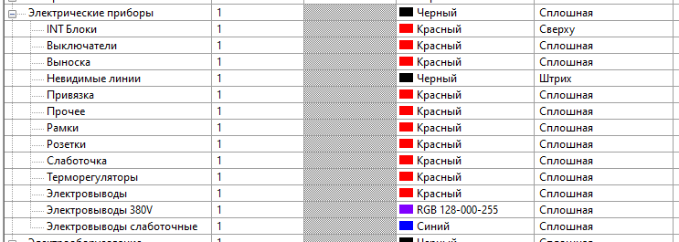

Para cambiar el color solo en una vista, utiliza Reemplazos de visibilidad/gráficos y configura esa categoría y sus subcategorías.

También puedes utilizar los filtros de esa ventana para modificar los colores.

**INT Блоки** activa la representación del marco en el nivel de detalle bajo. **Выноска** muestra en planta las líneas entre la pared y el símbolo. **Привязка** muestra en alzado el punto de referencia de los marcos verticales, en el centro, arriba o abajo.

### 2. Relleno

Para cambiar el color de relleno del símbolo en planta, selecciona con Tab la familia compartida anidada y asigna un material al parámetro de tipo **INT_УГО Заливка**.

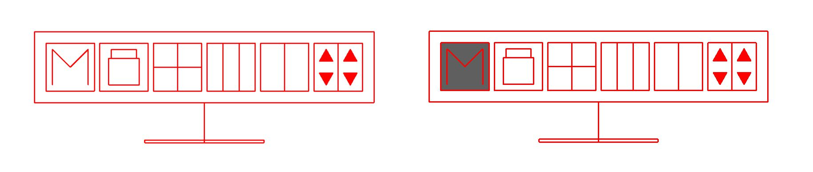

Para que los símbolos de las tablas coincidan con lo definido en el proyecto, actualiza las imágenes JPEG en las propiedades de tipo.

### 3. Símbolos y Figma

Si necesitas cambiar el símbolo de un aparato en una tabla, puedes editar su archivo vectorial en la [página de símbolos de Figma](https://www.figma.com/design/C53Y49XcTp6BOhbNSROxqs/%D0%A3%D0%93%D0%9E-%D0%A0%D0%9E%D0%97%D0%95%D0%A2%D0%9A%D0%98-V4?node-id=0-1&t=fJL1bR7jzSHFrgc3-1).

Los archivos se pueden ver en cualquier navegador. No puedes editar directamente la página de INT LINES; selecciona su contenido y cópialo a tu propia página.

Para sustituir la imagen en el proyecto, sigue estos pasos.

1. Busca la familia en el navegador de proyectos y abre su edición.
2. Abre la ventana de tipos de familia y sustituye **INT_Условное обозначение** para el nivel bajo o **INT_Условное обозначение 2** para el nivel medio.
3. Vuelve a cargar la familia en el proyecto y elige sobrescribir la versión existente y los valores de parámetros.

Si quieres reutilizar los símbolos modificados en otros proyectos, actualiza también la familia anidada dentro de Рамка y Рамка грань. Guarda después ambas familias en tu ordenador, además de actualizar el proyecto.

<CTA type="guide" />
