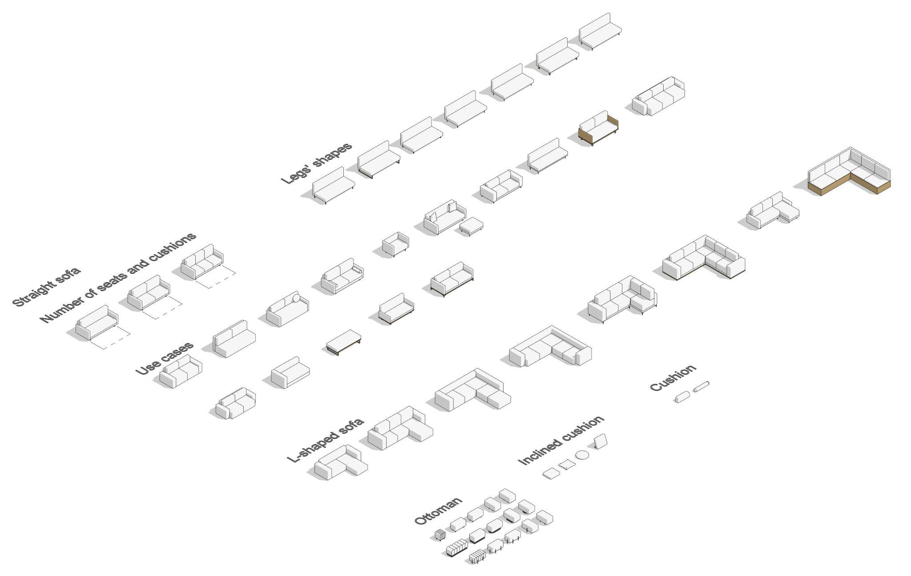
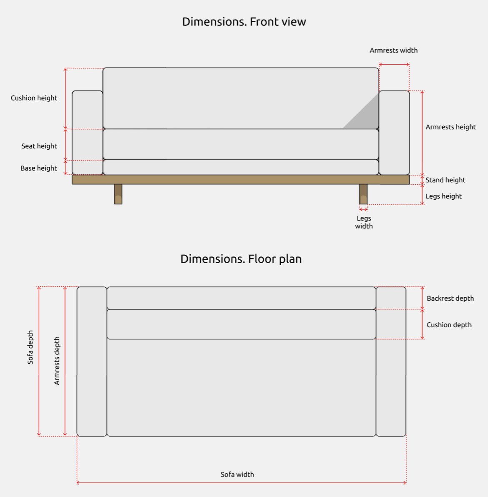
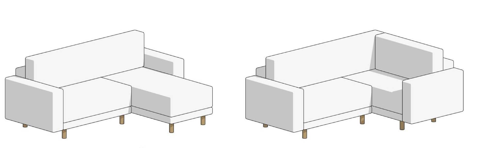
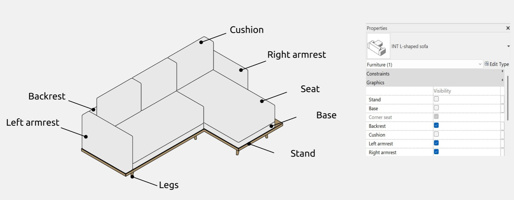
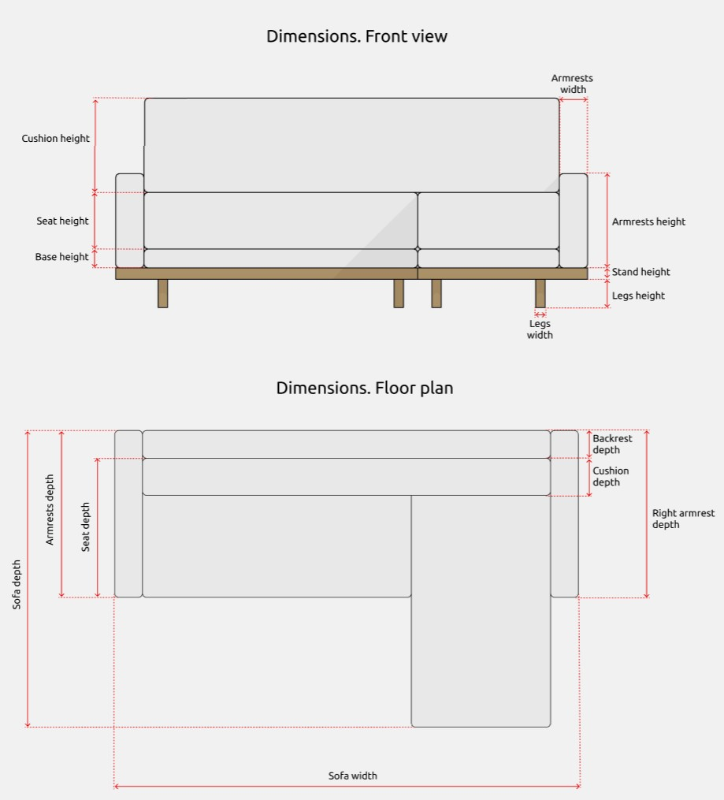
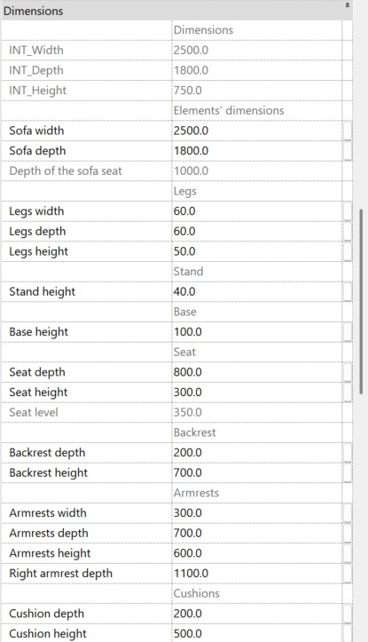
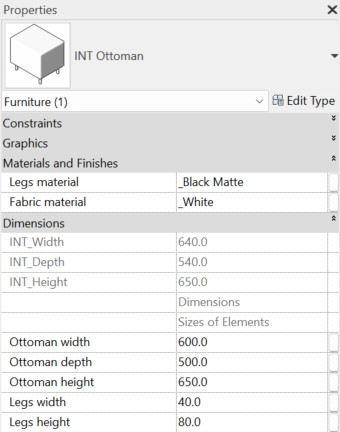
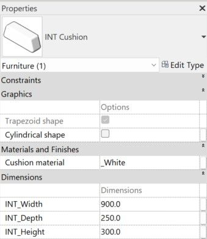

import productPreview from './product.jpg';

<ProductCard
  name="Familias de sofás para Revit"
  description="Sofás de distintos estilos y tamaños, listos para colocar en tu proyecto de Revit."
  image={productPreview}
  imageAlt="Vista previa del conjunto de sofás para Revit"
  buyUrl="https://bimcore.one/products/sofa-revit-families"
  ecwidProductId="577113364"
  buyLabel="Ver el precio en la tienda"
/>

## 1. INFORMACIÓN GENERAL

- Nombre del conjunto Sofás
- Versión del conjunto 1.0.0
- Versión de Revit 2019

### Descripción

Este conjunto permite modelar sofás rectos y de esquina, divanes y pufs con dimensiones exactas en Autodesk Revit. Está pensado para diseñadores de interiores y arquitectos.

### Carga y colocación

Para ver y cargar las familias, abre el proyecto de sofás, copia las que necesites con Ctrl+C y pégalas en tu proyecto con Ctrl+V. También puedes abrir la carpeta de archivos de familia y arrastrarlos al proyecto.

:::note
Las imágenes y los nombres de los parámetros corresponden a la versión inglesa del conjunto. Las explicaciones están en español.
:::

## 2. CONTENIDO DEL CONJUNTO

- Sofá recto (Straight sofa)
- Sofá de esquina (L-shaped sofa)
- Puf (Ottoman)
- Cojín (Cushion)
- Cojín inclinado (Inclined cushion)

## 3. FAMILIAS

### Sofá recto (Straight sofa)

Esta familia permite crear sofás, divanes y otomanas de forma recta.

Puedes activar o desactivar la plataforma de apoyo (**Stand**), la base (**Base**), el respaldo (**Backrest**), el cojín (**Cushion**), los reposabrazos izquierdo (**Left armrest**) y derecho (**Right armrest**) y el símbolo del sofá desplegado en planta (**Symbol of convertible sofa**).

**Seat** y **Legs** están activados por defecto.

#### Opciones

Puedes ajustar de forma independiente la cantidad de cojines, de 1 a 3, y la cantidad de asientos, también de 1 a 3. Estos límites aparecen en la información de herramienta al colocar el cursor sobre el parámetro correspondiente.

En Graphics puedes hacer que la profundidad de los reposabrazos coincida con la del sofá, como ocurre por defecto, o ajustarla por separado mediante **Armrests depth**. Este parámetro controla ambos reposabrazos; en el sofá recto no se ajustan independientemente.

La lista de tipos de patas incluye formas en L (L-shaped), en U (U-shaped), clásicas (classical shape), cónicas (cone-shaped), cónicas inclinadas (tilted cone-shaped), rectangulares (rectangular) y cilíndricas (cylindrical).

Las patas clásicas siempre tienen una altura de 150 mm. Con las patas rectangulares puedes modificar su profundidad.

Puedes colocar las patas bajo los reposabrazos o bajo el asiento. La segunda opción está seleccionada por defecto.

#### Materiales

#### Dimensiones

**Sofa width** incluye la anchura de los elementos activados, por ejemplo **Armrests width**. Si desactivas los reposabrazos, el cuerpo se desplaza esa anchura.

La misma lógica se aplica a **Sofa height** y a las alturas de los elementos, como **Armrests height**, **Stand height** y **Base height**, así como a **Sofa depth** y a dimensiones como **Backrest depth**.

**Symbol of depth** permite ajustar la profundidad del símbolo del sofá desplegado.

Algunos parámetros aparecen en gris y no se pueden modificar, por ejemplo **INT_Width**. Ayudan a entender los cálculos y permiten que las fórmulas funcionen correctamente; no están pensados para que el usuario los edite.

### Sofá de esquina (L-shaped sofa)

Esta familia permite crear sofás de esquina con distintas configuraciones.

Puedes activar o desactivar la plataforma de apoyo (**Stand**), la base (**Base**), el respaldo (**Backrest**), el cojín (**Cushion**) y los reposabrazos izquierdo (**Left armrest**) y derecho (**Right armrest**).

#### Opciones

En Options puedes elegir el número de asientos y cojines. Los del lado izquierdo se cuentan desde el asiento de esquina hacia la izquierda; los del derecho, desde ese asiento hacia abajo por el lado derecho de la planta.

La cantidad de asientos se ajusta de forma independiente, de 1 a 2 a la izquierda y de 0 a 2 a la derecha. La cantidad de cojines va de 1 a 3. Estos límites también aparecen en la información de herramienta.

Las formas y los ajustes de las patas son los mismos que en el sofá recto.

Puedes elegir un respaldo recto o en L. Por defecto está seleccionado el recto.

Las opciones de colocación de los reposabrazos son similares a las del sofá recto, pero aquí se puede ajustar su profundidad por separado, como se explica en las dimensiones.

#### Materiales

#### Dimensiones

**Sofa width** y **Sofa depth** controlan las dimensiones generales e incluyen las dimensiones de los elementos activados, como **Armrests width**. Si desactivas los reposabrazos, el cuerpo se desplaza esa anchura. La misma lógica se aplica a los demás elementos.

En esta familia los cojines están colocados sobre los asientos. Por eso la profundidad del asiento se determina por el borde superior del cojín, no por el inferior.

**Armrests width** y **Armrests height** controlan la anchura y la altura de ambos reposabrazos. Con el respaldo en L, o cuando la profundidad de los reposabrazos coincide con la del sofá, **Armrests depth** controla ambos.

Cuando la profundidad no coincide con la del sofá, puedes ajustarlos por separado con **Armrests depth** para el izquierdo y **Right armrest depth** para el derecho.

Los parámetros en gris, como **INT_Width**, no se pueden editar. Sirven para entender los cálculos y para el funcionamiento de las fórmulas.

### Puf (Ottoman)

Esta familia permite representar pufs y bancos tapizados.

Admite cuatro formas, ovalada (Ottoman oval shape), cuadrada (Ottoman square shape), circular (Ottoman round shape) y rectangular acanalada (Ottoman corrugated rectangle shape). En esta última puedes modificar el número de divisiones de la matriz mediante **Number of cluster segments**.

También puedes elegir entre patas cilíndricas (Legs cylindrical shape), una base (Legs base shape) y un bastidor metálico (Legs metal frame shape). Las patas cilíndricas se utilizan por defecto cuando las demás opciones están desactivadas.

La familia no permite prescindir de las patas.

#### Materiales y dimensiones

Puedes modificar los materiales de la tela y las patas, las dimensiones del puf y la altura de las patas. Si las patas son cilíndricas, también puedes cambiar su anchura.

### Cojín (Cushion)

Esta familia tiene una función decorativa. Sus parámetros permiten modificar las dimensiones y el material y elegir una forma cilíndrica (Cylindrical shape) o trapezoidal (Trapezoid shape).

### Cojín inclinado (Inclined cushion)

Además de los ajustes de Cushion, esta familia permite elegir una forma circular (Round shape), rectangular (Rectangular shape) o rectangular con reborde (Oxford cushion), activar o desactivar el soporte (**Stand**) y modificar su material cuando está activado, y regular el ángulo de inclinación del cojín.

<CTA type="guide" />
