import productPreview from '@site/docs/guides/families/storage-cabinets-for-revit/product.png';

<ProductCard
  name="Familias de armarios para Revit"
  eyebrow="Conjunto de familias de Revit"
  description="Armarios y sistemas de almacenaje de distintos tamaños, listos para colocar en tu proyecto de Revit."
  image={productPreview}
  imageAlt="Vista previa del conjunto de armarios para Revit"
  buyUrl="https://bimcore.one/products/storage-cabinet-revit-families"
  ecwidProductId="660642703"
  buyLabel="Comprar"
  shopLabel="Ir a la tienda"
/>

## 1. INFORMACIÓN GENERAL

- Nombre del conjunto Armarios (Storage cabinets)
- Versión del conjunto 1.0.0
- Versión de Revit 2019

### Descripción

Este conjunto de familias de Revit sirve para modelar armarios en Autodesk Revit.

Con estas familias puedes crear armarios, frentes, vitrinas y cornisas con medidas exactas.

Está pensado para diseñadores de interiores y arquitectos. Para que un carpintero fabrique el armario, las familias no tienen suficiente detalle.

### Carga y colocación

Para ver y cargar las familias que necesites, abre el proyecto de armarios, copia las familias con Ctrl+C y pégalas en tu proyecto con Ctrl+V. También puedes abrir la carpeta con los archivos de familia y arrastrarlos al proyecto con el ratón.

## 2. CONTENIDO DEL CONJUNTO

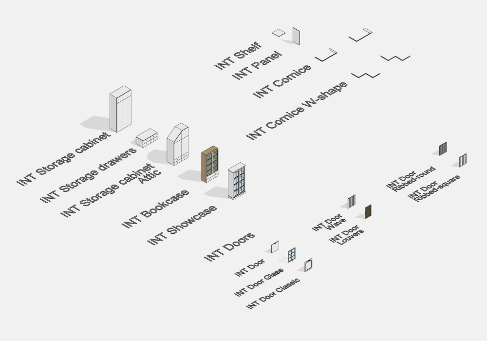

El conjunto incluye estas familias:

- Armario (Storage cabinet)
- Armario abuhardillado (Storage cabinet Attic)
- Cajonera (Storage drawers)
- Librería (Bookcase)
- Vitrina (Showcase)
- Balda (Shelf)
- Panel
- Cornisa (Cornice)
- Cornisa en W (Cornice W-shape)

Frentes

- Frente (Door)
- Frente de vidrio (Door Glass)
- Frente de onda (Door Wave)
- Frente de listones cuadrados (Door Ribbed-square)
- Frente de listones de medio círculo (Door Ribbed-round)
- Frente de lamas (Door Louvers)
- Frente clásico (Door Classic)

## 3. FAMILIAS

### Armario

La familia Storage cabinet sirve para construir armarios con cajones o con altillo.

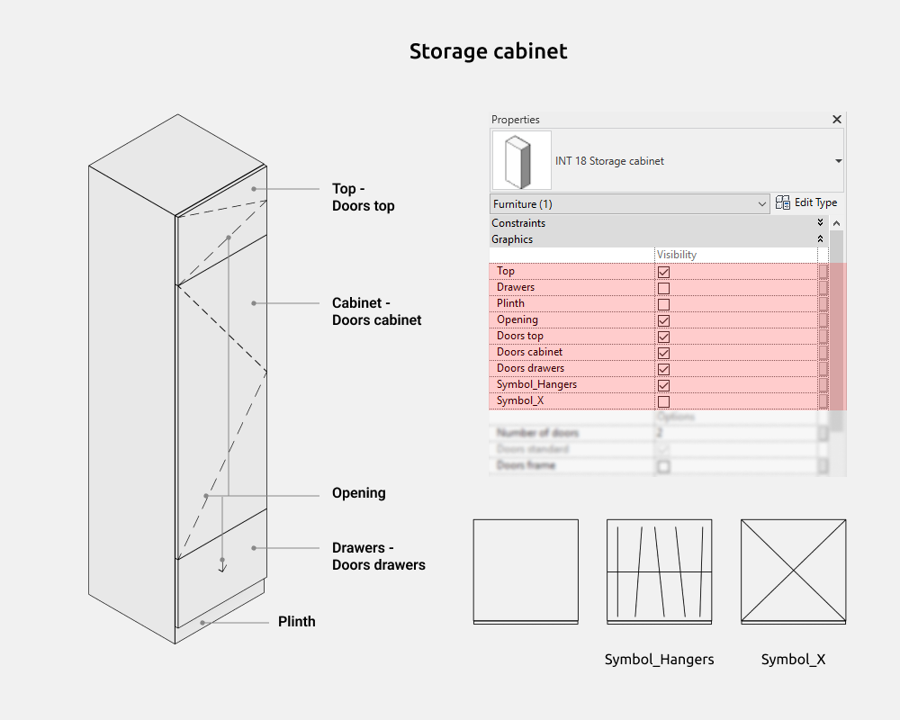

Aquí puedes activar y desactivar estos elementos:

- Altillo (**Top**)
- Cajones (**Drawers**)
- Zócalo (**Plinth**)
- Apertura (**Opening**)
- Frentes del altillo (**Doors top**)
- Frentes del armario (**Doors cabinet**)
- Frentes de los cajones (**Doors drawers**)
- Símbolo de las barras de colgar (**Symbol_Hangers**), en la planta vista desde arriba
- Símbolo en aspa (**Symbol_X**), en la planta vista desde arriba

#### Dimensiones

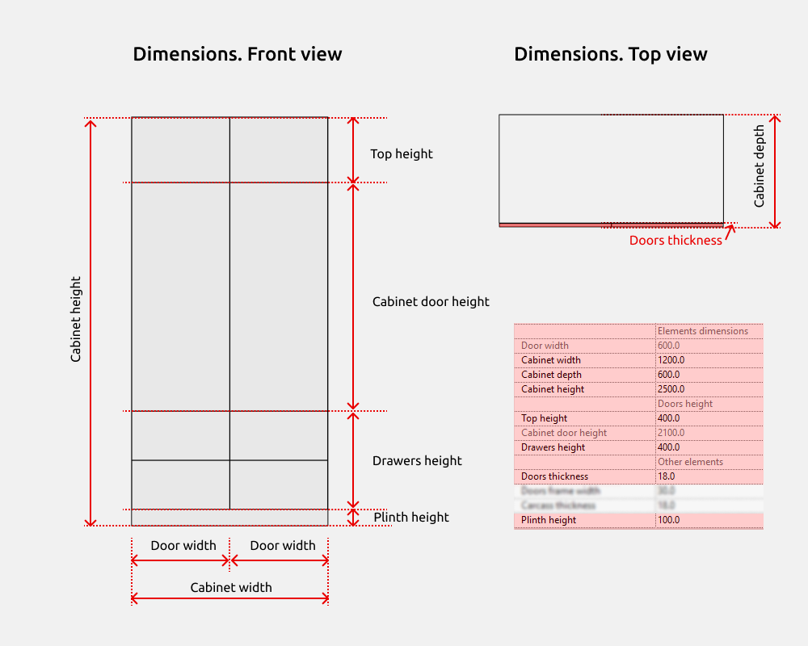

La altura del armario (**Cabinet height**) engloba las alturas menores de los elementos que estén activados, es decir la altura del zócalo (**Plinth height**), la de los cajones (**Drawers height**), la del frente del armario (**Cabinet door height**) y la del altillo (**Top height**).

Hay parámetros en gris que no se pueden editar, pero sirven para entender el cálculo de las medidas. Por ejemplo **Door width**, que muestra el ancho de los frentes, porque se calcula con una fórmula a partir del número de frentes y del ancho del propio armario.

Si los frentes están desactivados, el cuerpo se desplaza el espesor de los frentes.

#### Número de frentes

El número de frentes puede ir de 1 a 4.

Los frentes se numeran de izquierda a derecha, donde D1 es el de más a la izquierda y D4 el de más a la derecha. El ancho de los frentes no se indica, se calcula automáticamente.

#### Apertura

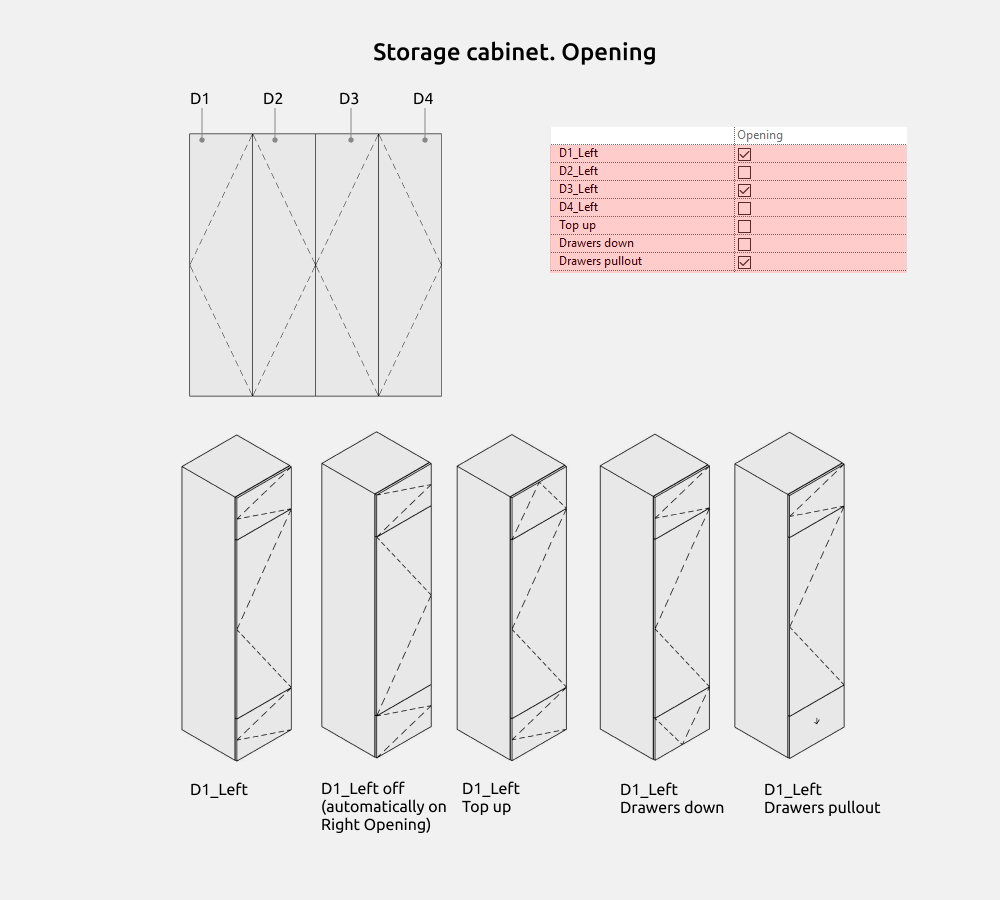

Los tipos principales de apertura de esta familia son la apertura izquierda y la derecha. Si desactivas la apertura izquierda (**D1_Left**, **D2_Left**, **D3_Left** o **D4_Left**, según el frente), se activa automáticamente la derecha en todos los frentes visibles en vertical.

Cuando el altillo o un cajón necesita otro tipo de apertura, se activan casillas adicionales. Son **Top up**, **Drawers down** y **Drawers pullout**. El frente principal (Cabinet door) mantiene la apertura izquierda o derecha.

#### Opciones

Los frentes pueden ser estándar, es decir lisos y sin fresado, o de marco.

El número de cajones en altura puede ser de 1 en adelante, pero conviene vigilar que las medidas sean coherentes para que no aparezca un error.

**Drawers at full width** elimina la división por frentes y estira los cajones a todo el ancho del armario.

#### Materiales

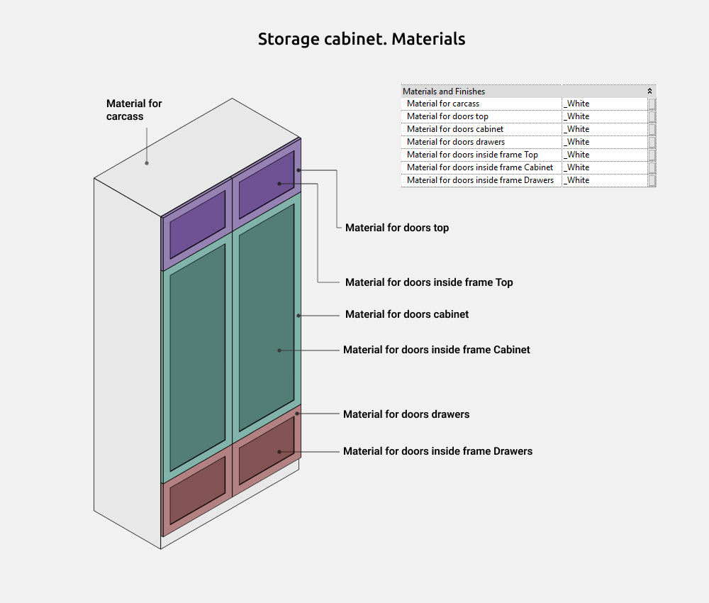

### Armario abuhardillado

La familia Storage cabinet Attic sirve para construir armarios abuhardillados con cajones o con altillo. Estos armarios suelen tener una esquina achaflanada que sigue la pendiente de la cubierta.

Aquí puedes activar y desactivar estos elementos:

- Altillo (**Top**)
- Cajones (**Drawers**)
- Zócalo (**Plinth**)
- Apertura (**Opening**), en la planta vista desde arriba
- Apertura de los cajones (**Opening drawers**)
- Frentes del altillo (**Doors top**)
- Frentes del armario (**Doors cabinet**)
- Frentes de los cajones (**Doors drawers**)
- Símbolo de las barras de colgar (**Symbol_Hangers**), en la planta vista desde arriba
- Símbolo en aspa (**Symbol_X**), en la planta vista desde arriba

#### Dimensiones

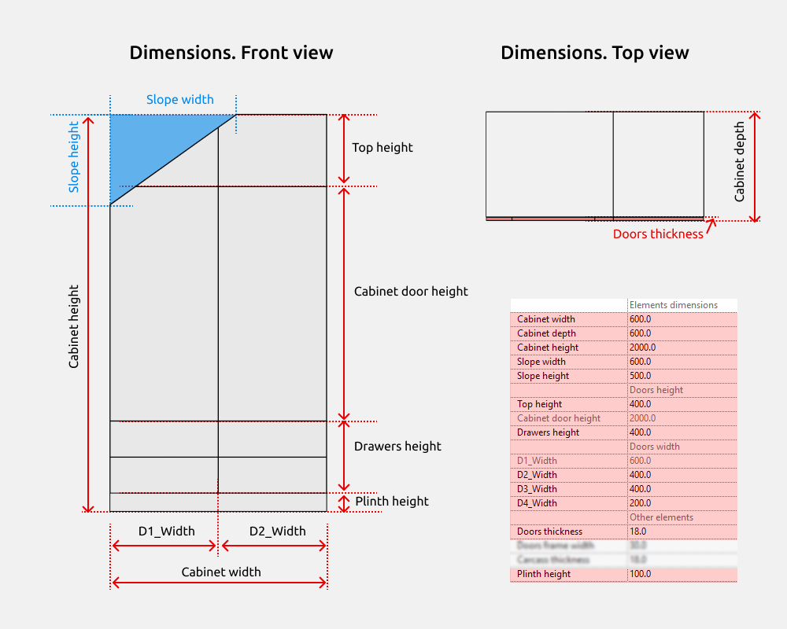

La altura del armario (**Cabinet height**) engloba las alturas menores de los elementos que estén activados, es decir la altura del zócalo (**Plinth height**), la de los cajones (**Drawers height**), la del frente del armario (**Cabinet door height**) y la del altillo (**Top height**).

El ancho de la pendiente (**Slope width**) arranca en el punto superior izquierdo del armario y crece hacia la derecha, y la altura de la pendiente (**Slope height**) crece hacia abajo.

Hay parámetros en gris que no se pueden editar, pero sirven para entender el cálculo de las medidas. Por ejemplo **D1_Width**, que muestra el ancho del primer frente, porque se calcula con una fórmula a partir del número de frentes y del ancho del propio armario. Por defecto todos los frentes son iguales, porque en las opciones está activada la casilla correspondiente.

Si los frentes están desactivados, el cuerpo se desplaza el espesor de los frentes.

#### Número de frentes

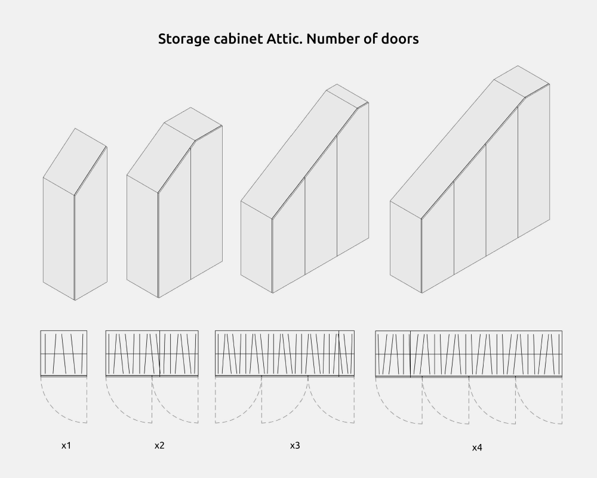

El número de frentes puede ir de 1 a 4.

Los frentes se numeran de izquierda a derecha, donde D1 es el de más a la izquierda y D4 el de más a la derecha. El ancho de los frentes no se indica, se calcula automáticamente.

#### Apertura

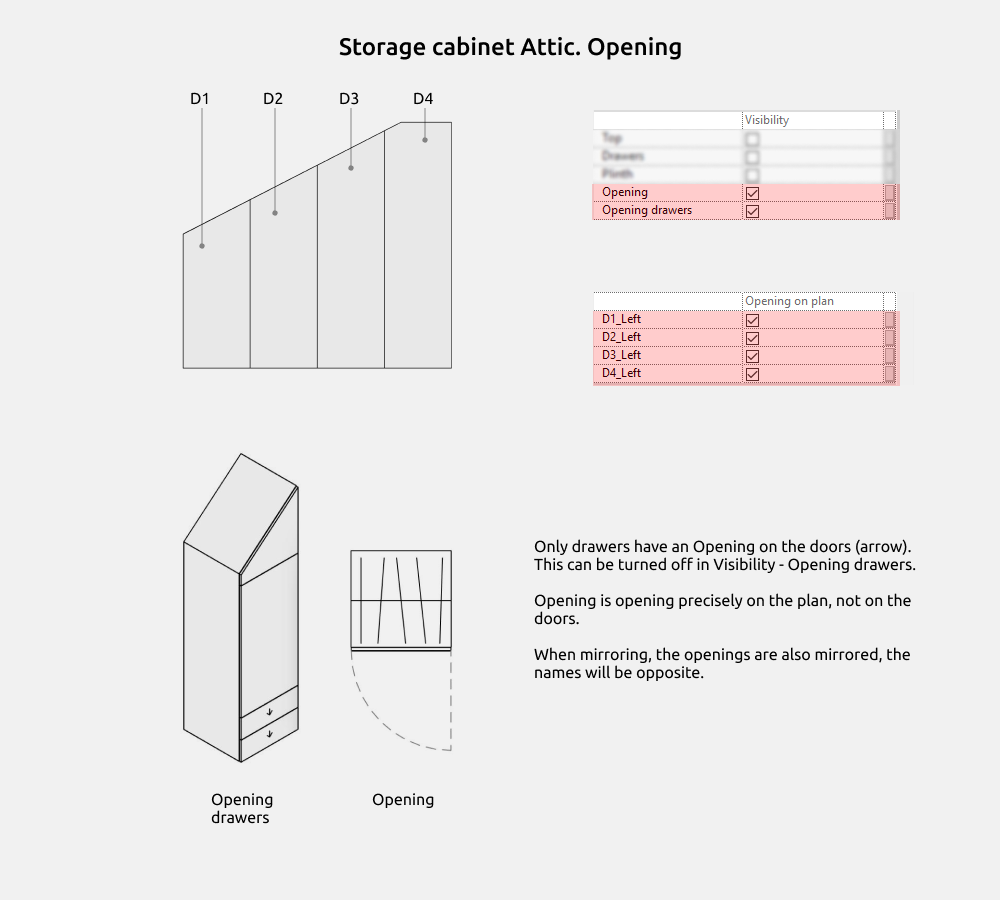

En los frentes solo tienen apertura los cajones (**Opening drawers**). **Opening** es justamente la apertura que se ve en la planta desde arriba.

Puedes elegir apertura izquierda o derecha. Si desactivas la apertura izquierda (**D1_Left**, **D2_Left**, **D3_Left** o **D4_Left**, según el frente), se activa automáticamente la derecha en todos los frentes visibles en vertical.

Al reflejar la familia, las aperturas también se reflejan, así que los nombres quedan al revés: la izquierda pasa a ser la derecha y al contrario.

#### Opciones

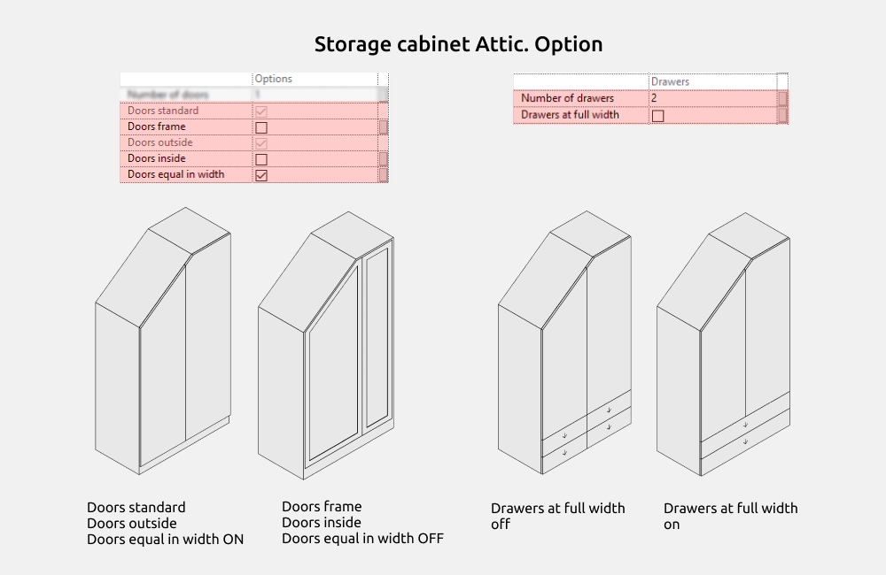

Los frentes pueden ser estándar, es decir lisos y sin fresado, o de marco.

**Doors outside** son los frentes que tapan el cuerpo del armario y **Doors inside**, al contrario, dejan ver el espesor del cuerpo por todo el perímetro.

Con **Doors equal in width** activado, **D1_Width** es igual al ancho de todos los demás frentes. Si está desactivado, el ancho de cada frente, salvo **D1_Width**, se indica a mano.

El número de cajones en altura puede ser de 1 en adelante, pero conviene vigilar que las medidas sean coherentes para que no aparezca un error.

**Drawers at full width** elimina la división por frentes y estira los cajones a todo el ancho del armario.

#### Materiales

### Vitrina

La familia Showcase sirve para construir vitrinas de vidrio con baldas donde colocar vajilla, libros u otros objetos.

Aquí puedes activar y desactivar estos elementos:

- Frentes (**Doors**)
- Baldas (**Shelves**)
- Tiradores (**Handles**)
- Cornisa (**Cornice**)
- Peinazos (**Muntins**), que coinciden en número con las baldas
- Cuerpo de vidrio (**Glass carcass**)
- Patas (**Legs**)
- Faldones de las patas (**Legs aprons**)
- Apertura (**Opening**)

#### Dimensiones

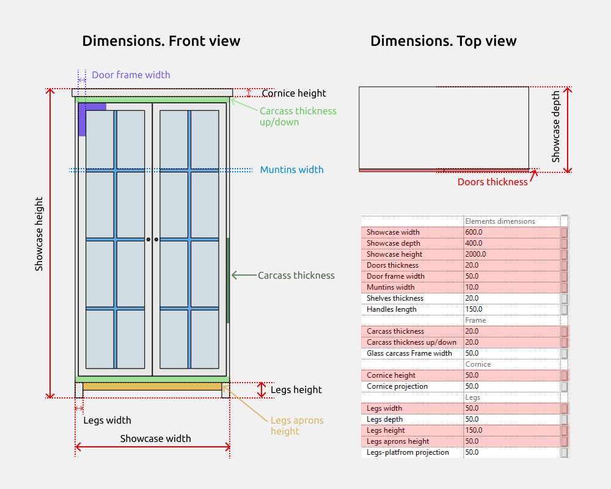

La altura de la vitrina (**Showcase height**) engloba las alturas menores de los elementos que estén activados, es decir la altura de las patas (**Legs height**) y la de la cornisa (**Cornice height**).

El espesor del cuerpo por los lados puede ser distinto del espesor del cuerpo arriba y abajo. En la imagen es lo que va en verde.

Si los frentes están desactivados, el cuerpo se desplaza el espesor de los frentes.

**Glass carcass Frame width** funciona con **Glass carcass** activado.

#### Frentes

El número de frentes puede ser 1 o 2.

**Doors outside** son los frentes que tapan el cuerpo del armario y **Doors inside**, al contrario, dejan ver el espesor del cuerpo por todo el perímetro.

Los frentes pueden ser estándar, es decir lisos y sin fresado, o de marco.

Con **Two sliding doors** activado, un frente se desliza por detrás del otro. Para que funcione bien hay que poner el número de frentes en 2 y activar **Doors inside**.

#### Baldas

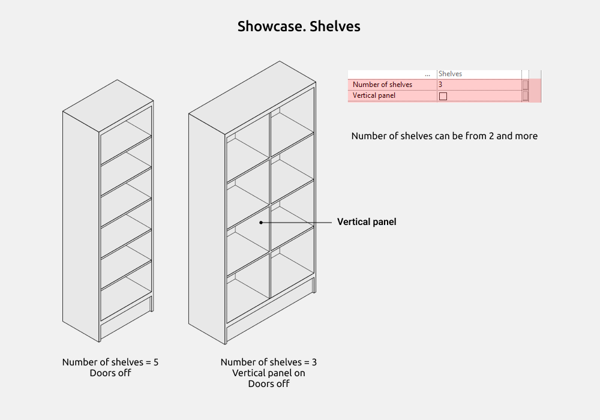

El número de baldas puede ser de 2 en adelante.

El panel vertical se activa en el centro de la vitrina y divide las baldas en dos secciones.

#### Tiradores

Los tipos de tirador se eligen en la lista desplegable. Son estos:

- Pomo (Knob)
- Asa (D-shape)
- En T (T-shape)
- Perfil (Pull)

Elige siempre los que empiezan por H:, porque en las listas desplegables se cargan otras familias que no hay que seleccionar.

Para el asa y el perfil funciona **Handles length**.

#### Patas

Los tipos de pata se eligen en la lista desplegable. Son estos:

- Prismática (Box)
- Cilíndrica (Cylinder)
- Cónica (Cone)
- Cónica inclinada (Inclined cone)
- Plataforma (Platform)
- Prismática achaflanada (Slope box)
- En U (П-shape)
- Clásica (Classic)
- Zócalo (Plinth)

Las patas de plataforma tienen un parámetro adicional en las dimensiones, **Legs-platform projection**.

En la pata clásica **Legs height** es de 150 mm.

#### Materiales

### Librería

La familia Bookcase sirve para construir librerías con baldas donde colocar libros u otros objetos. Los frentes superiores son abiertos o de vidrio y los inferiores cerrados, sin vidrio.

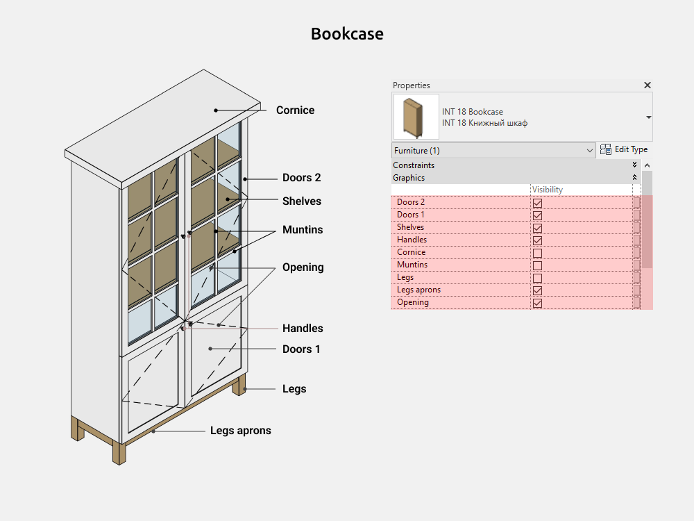

Aquí puedes activar y desactivar estos elementos:

- Frentes 2, los de arriba (**Doors 2**)
- Frentes 1, los de abajo (**Doors 1**)
- Baldas (**Shelves**)
- Tiradores (**Handles**)
- Cornisa (**Cornice**)
- Peinazos (**Muntins**), que coinciden en número con las baldas
- Patas (**Legs**)
- Faldones de las patas (**Legs aprons**)
- Apertura (**Opening**)

#### Dimensiones

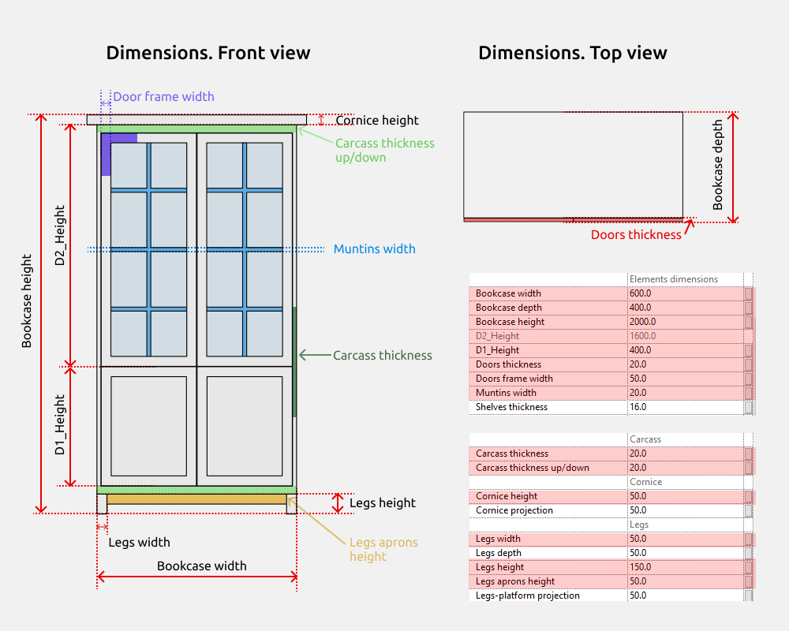

La altura de la librería (**Bookcase height**) se compone de dos parámetros principales, **D1_Height** y **D2_Height**, y engloba además las alturas menores de los elementos que estén activados, es decir la altura de las patas (**Legs height**) y la de la cornisa (**Cornice height**).

El espesor del cuerpo por los lados puede ser distinto del espesor del cuerpo arriba y abajo. En la imagen es lo que va en verde.

Hay parámetros en gris que no se pueden editar, pero sirven para entender el cálculo de las medidas. Por ejemplo **D2_Height**, que muestra la altura del segundo frente, porque se calcula con una fórmula a partir de la altura del primero y de la altura de la propia librería.

Si los frentes están desactivados, el cuerpo se desplaza el espesor de los frentes.

#### Frentes en general

**Doors outside** son los frentes que tapan el cuerpo del armario y **Doors inside**, al contrario, dejan ver el espesor del cuerpo por todo el perímetro.

Con **D1 & D2 united door** activado, el frente inferior y el superior pasan a ser un único frente. La apertura también pasa a ser única.

#### Frentes 2

**D2_Number of doors** puede ser 1 o 2.

Los frentes D2 pueden ser estándar, es decir lisos y sin fresado, o de marco.

#### Frentes 1

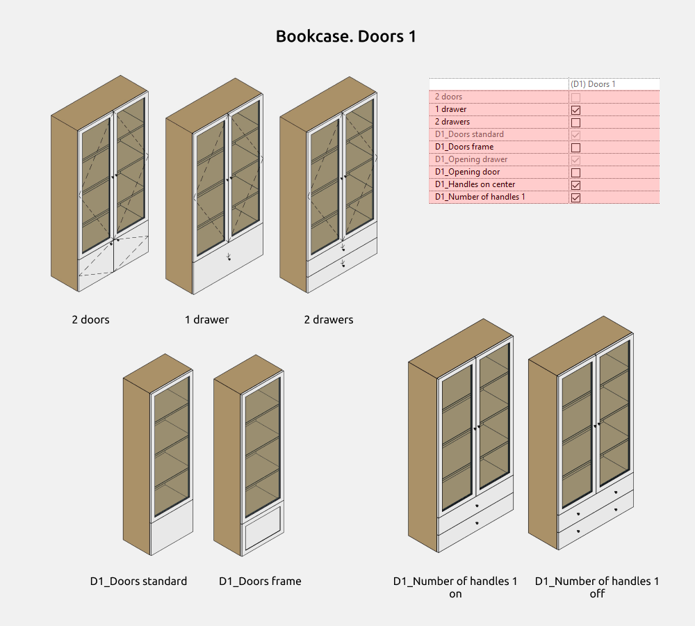

El número de frentes D1 se elige con las casillas de dos puertas (**2 doors**), un cajón (**1 drawer**) o dos cajones (**2 drawers**).

Los frentes D1 pueden ser estándar, es decir lisos y sin fresado, o de marco.

Con **D1_Number of handles 1** activado hay un tirador por defecto; al desactivarlo hay dos.

#### Baldas

El número de baldas puede ser de 2 en adelante.

El panel vertical se activa en el centro de la librería, a la altura del frente 2, y divide las baldas en dos secciones.

#### Tiradores

Los tipos de tirador se eligen en la lista desplegable. Son estos:

- Pomo (Knob)
- Asa (D-shape)
- En T (T-shape)
- Perfil (Pull)

Elige siempre los que empiezan por H:, porque en las listas desplegables se cargan otras familias que no hay que seleccionar.

Para el asa y el perfil funciona **Handles length**.

#### Patas

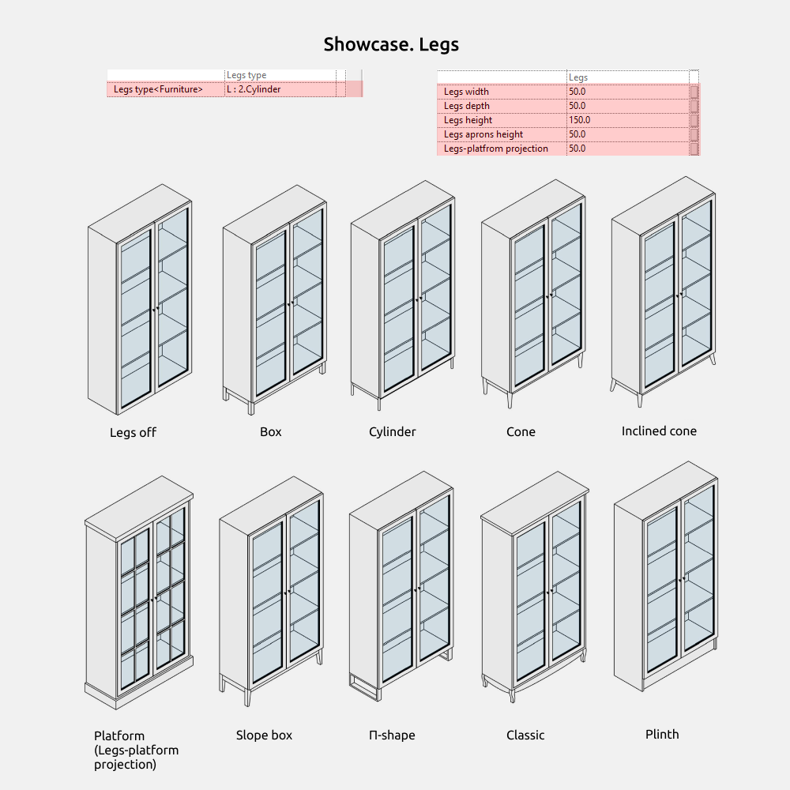

Los tipos de pata se eligen en la lista desplegable. Son estos:

- Prismática (Box)
- Cilíndrica (Cylinder)
- Cónica (Cone)
- Cónica inclinada (Inclined cone)
- Plataforma (Platform)
- Prismática achaflanada (Slope box)
- En U (П-shape)
- Clásica (Classic)
- Zócalo (Plinth)

Las patas de plataforma tienen un parámetro adicional en las dimensiones, **Legs-platform projection**.

En la pata clásica **Legs height** es de 150 mm.

#### Materiales

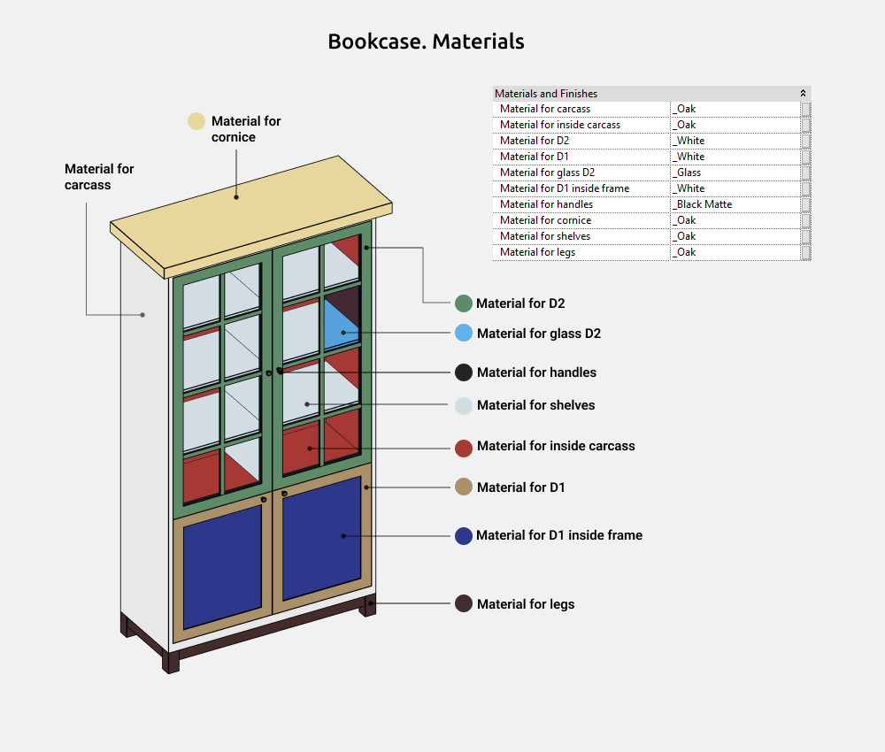

### Cornisa

El ancho de la cornisa (**Cornice width**) y su profundidad (**Cornice depth**) coinciden con las medidas del armario sobre el que se coloca.

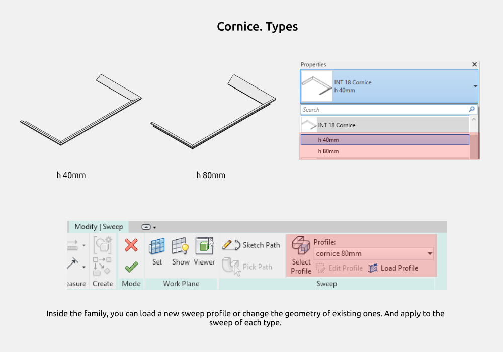

Hay dos tipos que se diferencian en la altura, 40 y 80 mm.

Dentro de la familia puedes cargar un perfil nuevo para el barrido o cambiar la geometría de los que ya existen. Si cargas uno nuevo, tienes que seleccionarlo en la lista desplegable de perfiles de la familia, ya sea para un barrido nuevo o para los que ya están.

### Cornisa en W

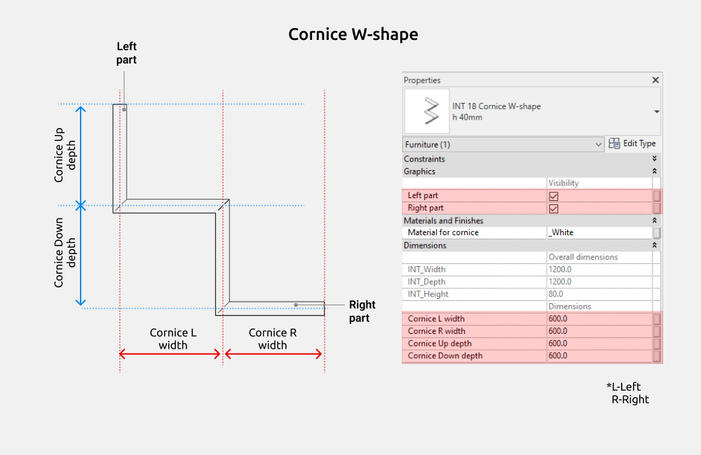

El ancho y la profundidad de la cornisa coinciden con las medidas del armario sobre el que se coloca.

Hay dos tipos que se diferencian en la altura, 40 y 80 mm.

Dentro de la familia puedes cargar un perfil nuevo para el barrido o cambiar la geometría de los que ya existen. Si cargas uno nuevo, tienes que seleccionarlo en la lista desplegable de perfiles de la familia, ya sea para un barrido nuevo o para los que ya están.

### Frentes

Los frentes son las puertas vistas de los muebles. Sirven para armarios empotrados, para la cocina y para cualquier otro mueble.

Los frentes se hacen en materiales y formas distintos. En este conjunto están estos:

- Frente (Door)
- Frente de onda (Door Wave)
- Frente de listones cuadrados (Door Ribbed-square)
- Frente de listones de medio círculo (Door Ribbed-round)
- Frente de vidrio (Door Glass)
- Frente clásico (Door Classic)
- Frente de lamas (Door Louvers)

A continuación van los parámetros comunes a todos los frentes del conjunto.

#### General. Tiradores

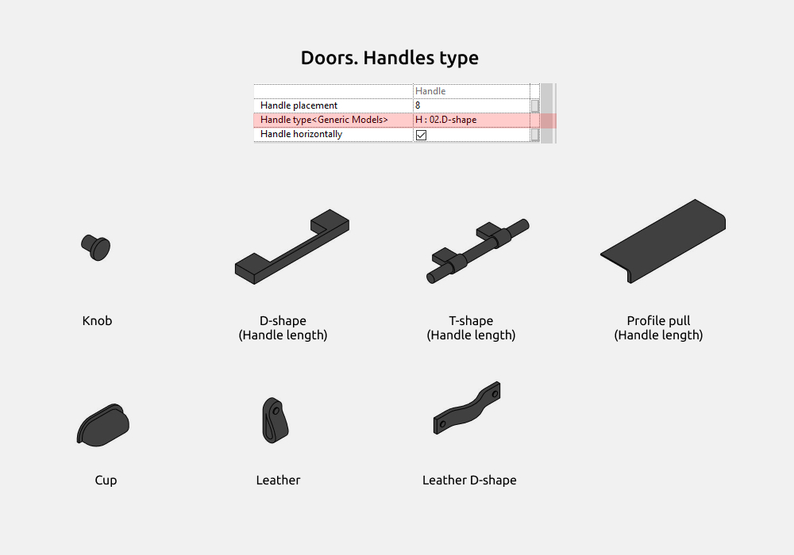

Los tipos de tirador se eligen en la lista desplegable de cada familia de frentes. Son estos:

- Pomo (Knob)
- Asa (D-shape)
- En T (T-shape)
- Perfil (Profile pull)
- Concha (Cup)
- Lazo de cuero (Leather)
- Asa de cuero (Leather D-shape)

Para el asa, el tirador en T y el perfil funciona **Handle length**.

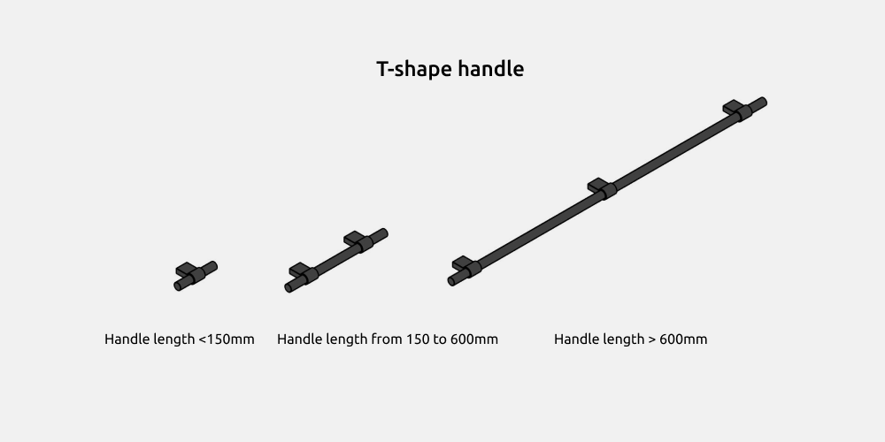

El tirador en T cambia de aspecto según la longitud que le des en **Handle length**.

#### General. Colocación de los tiradores

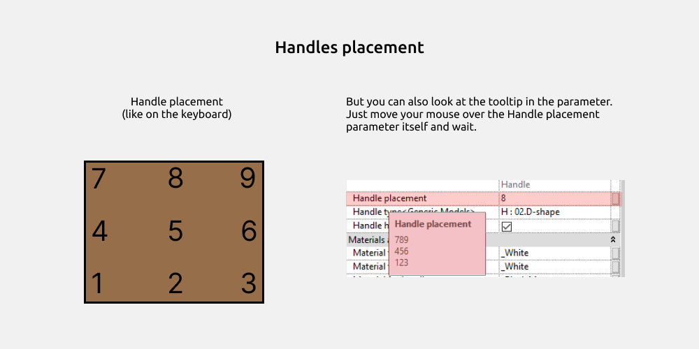

La colocación de los tiradores se indica con números del 1 al 9. Visualmente recuerda a la disposición de los números del teclado.

También puedes leer la ayuda del propio parámetro **Handle placement**.

Los tiradores pueden ir en horizontal o en vertical, y de eso se ocupa **Handle horizontally**.

#### General. Apertura

Los tipos de apertura se eligen en la lista desplegable de cada familia de frentes. Son estos:

- Izquierda (Left)
- Derecha (Right)
- Hacia abajo (Down)
- Hacia arriba (Up)
- Cajón (Drawer)
- Doble (Double)
- Corredera a la izquierda (LH Slide)
- Corredera a la derecha (RH Slide)
- Corredera doble (Double Slide)
- Elevable (Lift Up)
- Elevable inclinada (Lift Oblique)
- Plegable (Folder)
- 2 cajones (2 Drawers)

La apertura de los frentes no depende de dónde estén los tiradores.

#### General. Dimensiones

El ancho del frente (**Door width**) y su profundidad (**Door depth**) son medidas con holguras, mientras que **INT_Width** e **INT_Height** indican el ancho y la altura sin holguras.

#### Frente

El frente estándar reúne los tipos más habituales.

Frente estándar (Door standard), un frente rectangular sencillo.

Frente con marco por fuera (Door frame outside), un frente rectangular de marco, adecuado para el estilo neoclásico.

Frente con marco por dentro (Door frame inside), donde el marco queda por dentro, detrás del vidrio.

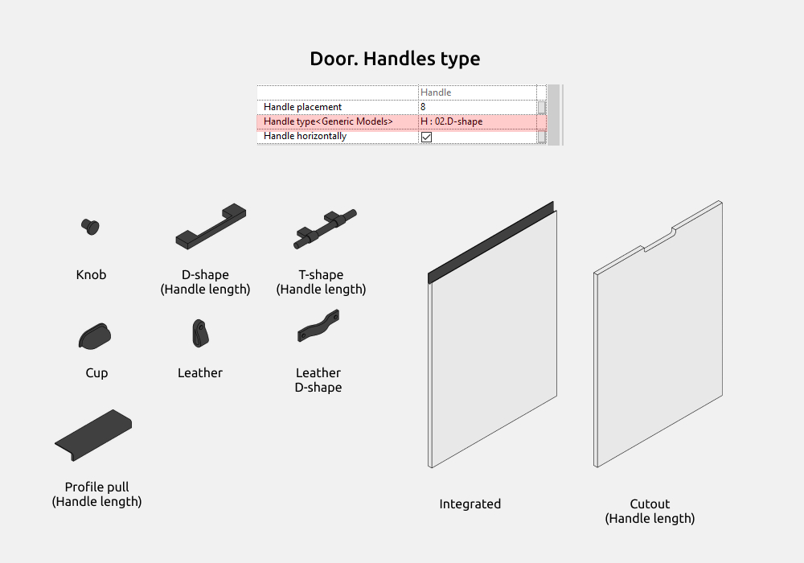

En esta familia los tiradores del apartado general se completan con el integrado y el de uñero. Quedan así:

- Pomo (Knob)
- Asa (D-shape)
- En T (T-shape)
- Concha (Cup)
- Lazo de cuero (Leather)
- Asa de cuero (Leather D-shape)
- Perfil (Profile pull)
- Integrado (Integrated)
- Uñero (Cutout)

Para el asa, el tirador en T, el uñero y el perfil funciona **Handle length**.

#### Frente de onda

El frente de onda lleva un fresado con forma de onda.

El ancho de la ranura y el del resalte se pueden ajustar, solo que el resalte tendrá un ancho aproximado. Esto se debe a cómo funcionan las matrices en Revit.

#### Frente de listones cuadrados

El frente de listones cuadrados lleva un fresado con forma de listón.

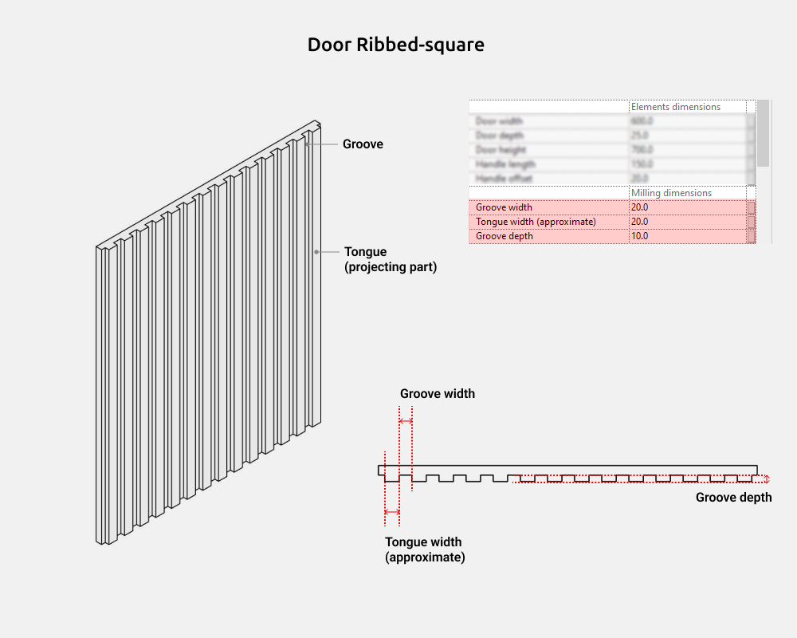

El ancho de la ranura y el del resalte se pueden ajustar, solo que el resalte tendrá un ancho aproximado. Esto se debe a cómo funcionan las matrices en Revit.

A diferencia de las otras familias con fresado, aquí se puede ajustar la profundidad de la ranura.

#### Frente de listones de medio círculo

El frente de listones de medio círculo lleva un fresado con forma de listón redondeado.

El ancho de la ranura y el del resalte se pueden ajustar, solo que la ranura tendrá un ancho aproximado. Esto se debe a cómo funcionan las matrices en Revit.

#### Frente de vidrio

El frente de vidrio lleva vidrio, peinazos y peinazos en forma de cruz.

Los peinazos son los listones que dividen el frente.

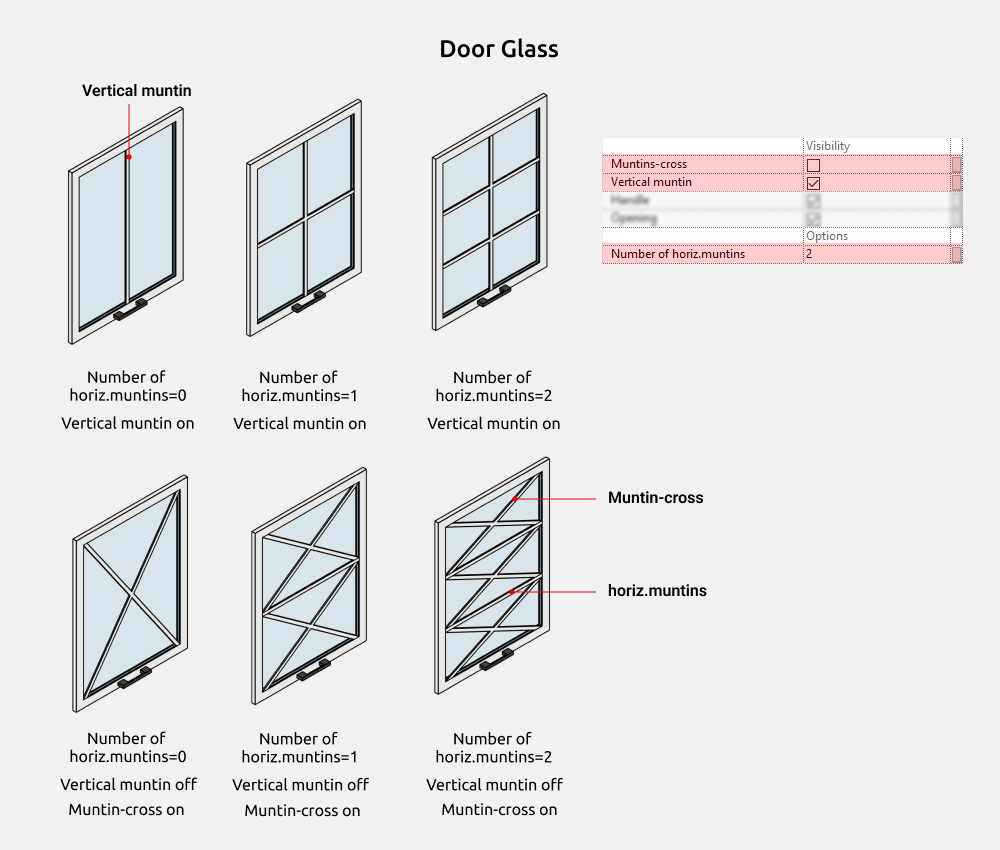

#### Frente clásico

El frente clásico son frentes de marco con un fresado complejo. El perfil se puede cambiar dentro de la familia, pero con un perfil muy ancho pueden aparecer errores.

Cuando **Door height** es menor que 150 mm, todos los tipos de frente pasan a ser el tipo 1. Además el ancho del marco del frente arriba y abajo se reduce a la mitad respecto al de los marcos laterales.

Cuando **Door height** es menor que 100 mm, todos los tipos de frente pasan a ser un frente rectangular simple, sin fresados.

El frente no puede tener menos de 150 mm de ancho.

#### Frente de lamas

El frente de lamas lleva lamas verticales u horizontales.

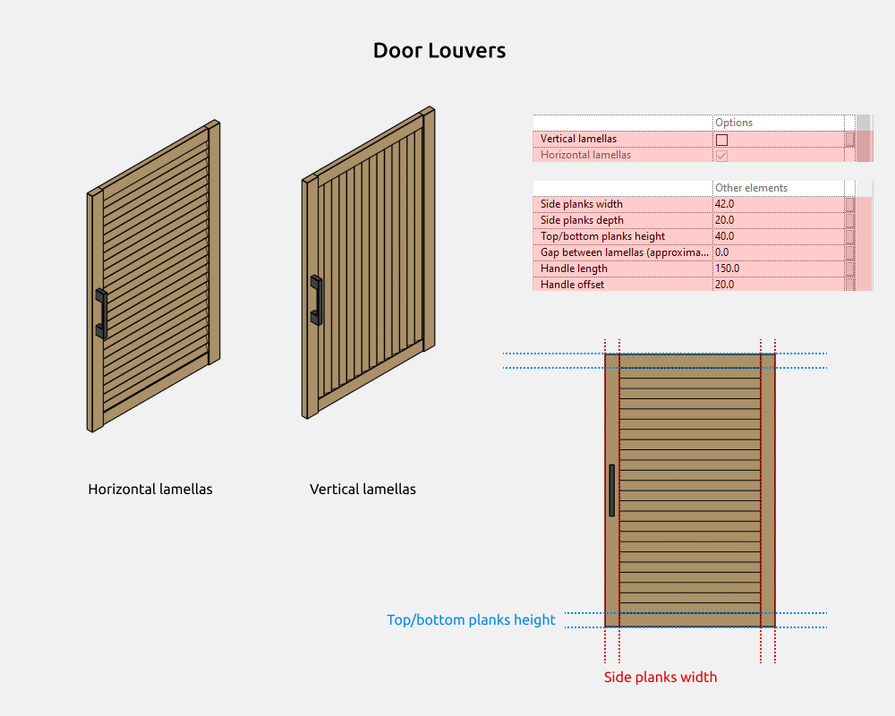

## 4. PRESENTACIÓN

### Ajustes de gráficos

Para cambiar el color, el grosor o el tipo de línea de las familias, ve a Gestionar, Estilos de objeto, Mobiliario y Elementos de detalle.

<CTA type="guide" />
