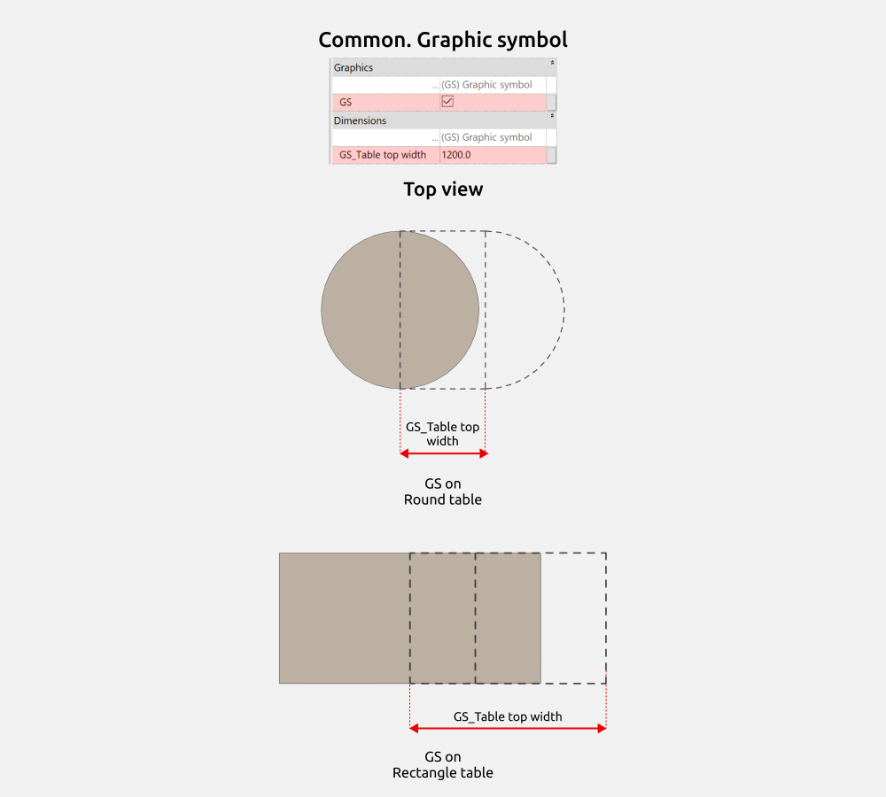
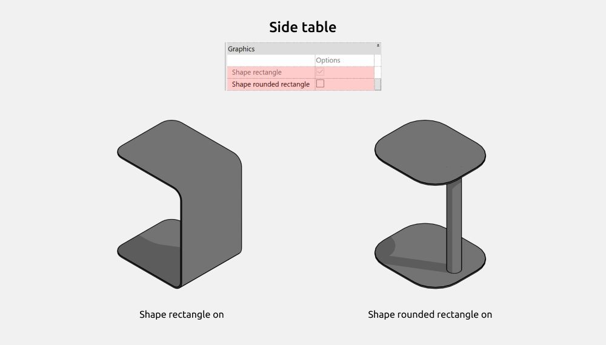
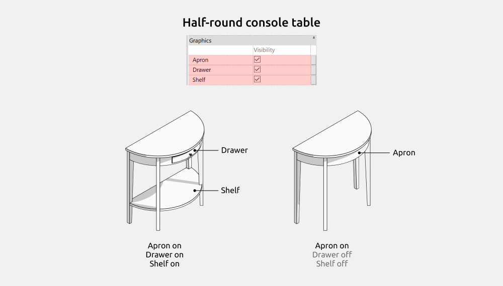
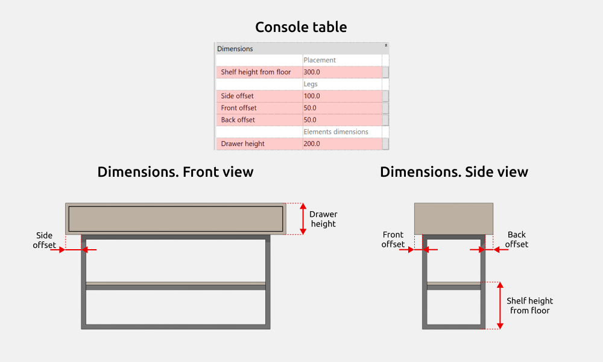
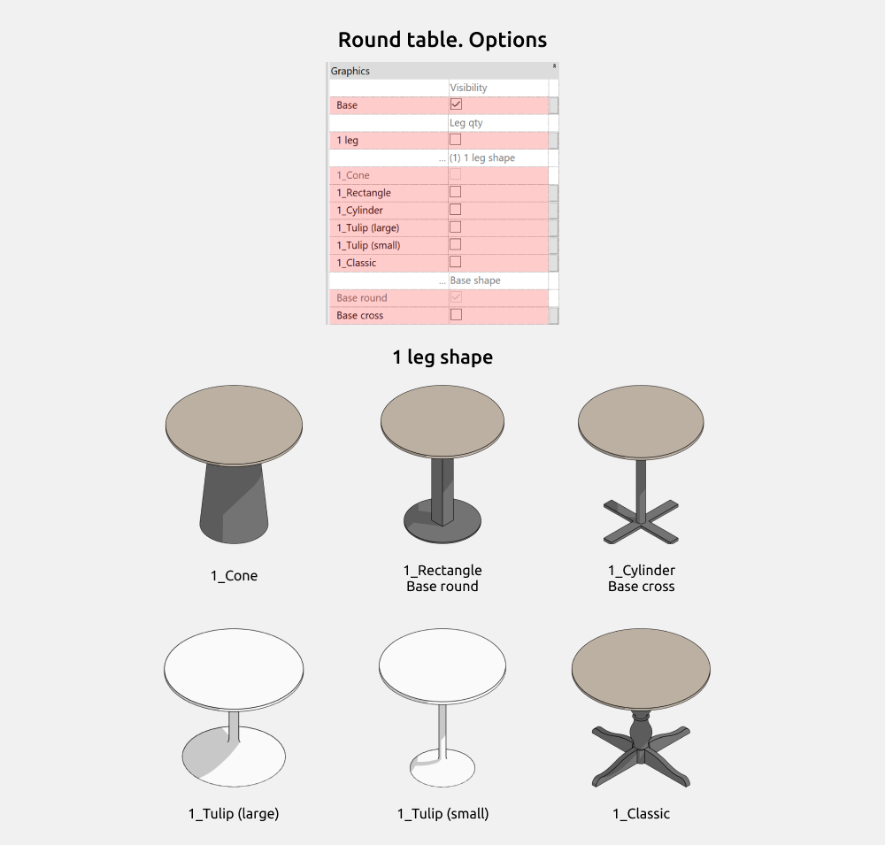
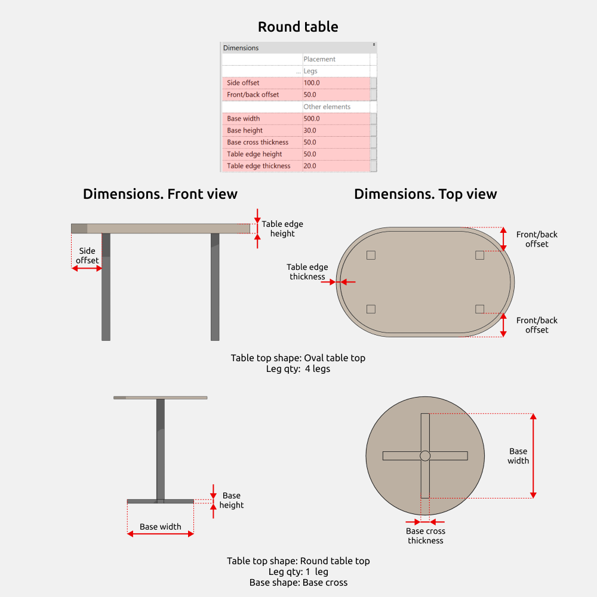
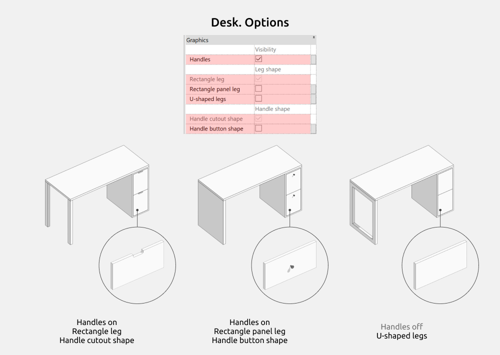
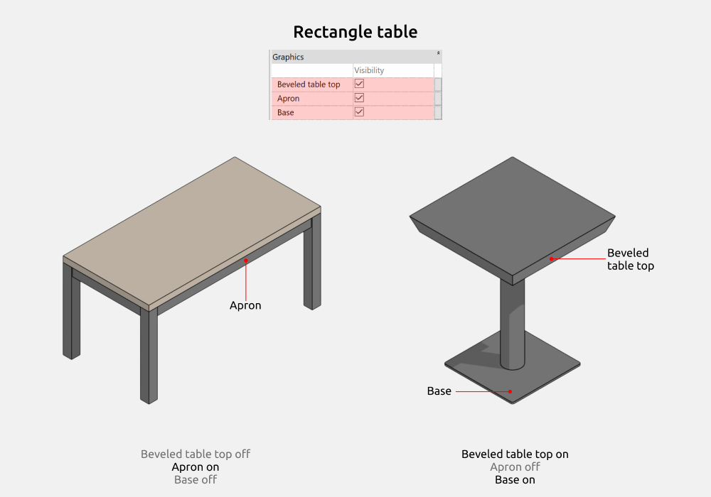
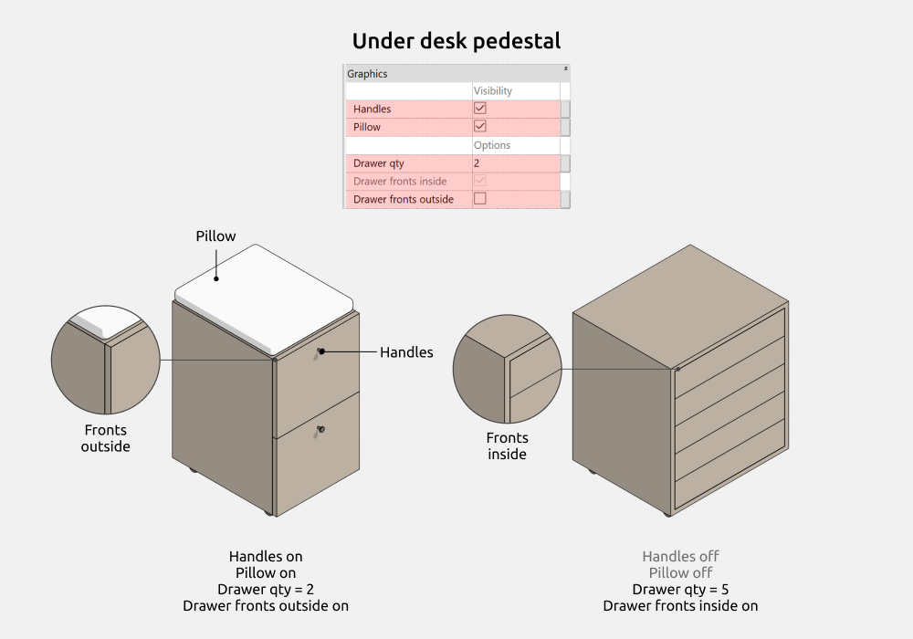
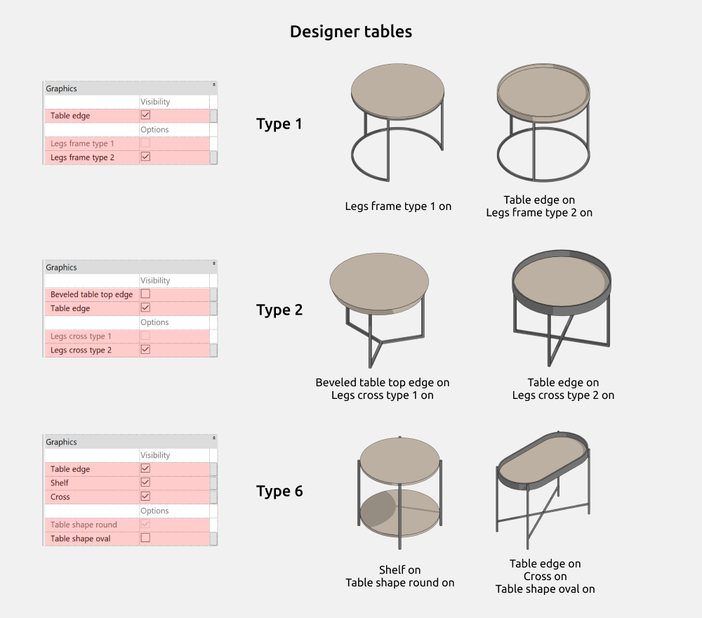

import productPreview from '@site/docs/guides/families/tables-for-revit/product.png';

<ProductCard
  name="Familias de mesas para Revit"
  eyebrow="Conjunto de familias de Revit"
  description="Mesas de comedor, de centro y auxiliares, listas para colocar en tu proyecto de Revit."
  image={productPreview}
  imageAlt="Vista previa del conjunto de mesas para Revit"
  buyUrl="https://bimcore.one/products/table-revit-families"
  ecwidProductId="592167128"
  buyLabel="Comprar"
  shopLabel="Ir a la tienda"
/>

## 1. INFORMACIÓN GENERAL

- Nombre del conjunto Mesas
- Versión del conjunto 1.2.0
- Versión de Revit 2019

### Descripción

Esta biblioteca de familias paramétricas de mesas está pensada para proyectos BIM de interiorismo y arquitectura en Autodesk Revit.

Está dirigida a diseñadores de interiores, arquitectos y proyectistas que trabajan en espacios residenciales y de uso público.

### Carga y colocación

Para ver y cargar las familias, abre el proyecto de mesas, copia las que necesites con Ctrl+C y pégalas en tu proyecto con Ctrl+V. También puedes abrir la carpeta de archivos de familia y arrastrarlos al proyecto.

:::note
Las imágenes y los nombres de los parámetros corresponden a la versión inglesa del conjunto. Las explicaciones están en español.
:::

## 2. CONTENIDO DEL CONJUNTO

- Consola (Console)
- Mesa auxiliar (Side table)
- Consola semicircular (Half-round console table)
- Mesa consola (Console table)
- Mesa redonda (Round table)
- Escritorio (Desk)
- Mesa rectangular (Rectangle table)
- Cajonera de escritorio (Under desk pedestal)

También incluye nueve familias de mesas de diseño, Designer table 1, Designer table 2, Designer table 3, Designer table 4, Designer table 5, Designer table 6, Designer table 7, Designer table 8 y Designer table 9.

## 3. FAMILIAS

### Dimensiones generales

La mayoría de las mesas paramétricas tienen estos parámetros compartidos de dimensiones.

- **INT_Width** corresponde a **Table width**, la anchura de la mesa.
- **INT_Depth** corresponde a **Table depth**, la profundidad.
- **INT_Height** corresponde a **Table height**, la altura.

También puedes ajustar **Legs width**, **Legs depth**, **Tabletop height** y **Apron height**, que controlan la anchura y profundidad de las patas, el espesor del tablero y la altura de los travesaños.

### Símbolo gráfico

**GS** activa en planta el símbolo del tablero extensible. **GS_Table top width** modifica la anchura del símbolo.

### Consola (Console)

Puedes activar un apoyo con **One support** o dos con **Two supports**.

Además de las dimensiones generales, **Console thickness** modifica el espesor de la consola y **Inner radius** el radio de unión entre el apoyo y el tablero. Si **Inner radius** es 0, no hay redondeo.

### Mesa auxiliar (Side table)

Puedes elegir una forma rectangular (Shape rectangle) o rectangular con esquinas redondeadas (Shape rounded rectangle).

### Consola semicircular (Half-round console table)

Puedes activar o desactivar los travesaños (Apron), el cajón (Drawer) y la balda (Shelf). Para activar el cajón, primero activa los travesaños.

#### Opciones

Puedes elegir entre dos y cuatro patas y estas formas.

- Rectangulares (Rectangle leg)
- Clásicas rectas (Classic straight leg)
- Clásicas curvas (Classic curved leg)
- Bastidor metálico (Metal frame legs), no disponible con dos patas

#### Dimensiones

Los ajustes generales se describen en Dimensiones generales. La altura de la mesa debe ser de al menos 700 mm. En las patas clásicas rectas, la anchura y la profundidad son fijas. El bastidor metálico se ajusta con **Legs frame thickness**.

### Mesa consola (Console table)

Puedes activar o desactivar las patas (**Legs**), los cajones (**Drawer**) y la balda (**Shelf**). La cantidad de cajones va de 1 a 3. La balda está disponible con todas las formas de patas excepto Tapered rectangle leg.

#### Opciones

- Bastidor de tipo 1 (Leg frame type 1)
- Bastidor de tipo 2 (Leg frame type 2)
- Rectangular (Rectangle leg)
- Panel rectangular (Rectangle panel leg)
- Rectangular estrechada (Tapered rectangle leg)
- Cónica (Tapered leg)
- Cónica inclinada (Angled tapered leg)
- Clásica (Classic leg)

#### Dimensiones

**Side offset**, **Back offset** y **Front offset** ajustan la separación de las patas respecto a los bordes laterales, trasero y delantero del tablero. **Shelf height from floor** controla la altura de la balda y **Drawer height** la del cajón.

Las patas Tapered rectangle leg admiten anchuras de 40 a 100 mm. Las clásicas tienen dimensiones fijas, salvo la altura, que debe ser de al menos 300 mm.

### Mesa redonda (Round table)

Puedes activar o desactivar el bisel del tablero (**Beveled table top**), su borde elevado (**Table edge**), los travesaños (**Apron**) y la base (**Base**).

Las formas del tablero son circular (Round table top), ovalada (Oval table top) y elíptica (Elliptical table top). Los travesaños están disponibles con cuatro patas o una pata.

#### Opciones

Puedes elegir cuatro, tres, dos o una pata.

Con cuatro patas están disponibles estas formas.

- Rectangular (4_Rectangle)
- Rectangular a 45° (4_Rectangle 45°)
- Rectangular a 45° e inclinada (4_Rectangle 45° angled)
- Rectangular estrechada (4_Rectangle beveled)
- Cónica (4_Cone)
- Cónica inclinada (4_Cone angled)
- Clásica (4_Classic)
- Cilíndrica (4_Cylinder)

Con tres patas puedes elegir cónicas inclinadas (3_Cone angled), cónicas (3_Cone) o cilíndricas (3_Cylinder). Con dos patas, en T (2_T-shaped) o cilíndricas (2_Cylinder).

Con una pata están disponibles estas formas.

- Cónica (1_Cone)
- Rectangular (1_Rectangle)
- Cilíndrica (1_Cylinder)
- Tulipán grande (1_Tulip (large))
- Tulipán pequeño (1_Tulip (small))
- Clásica (1_Classic)

Al activar **Base**, puedes elegir una base circular (Base round) o en cruz (Base cross).

#### Dimensiones

Con dos, tres o cuatro patas, **Side offset** y **Front/back offset** controlan su separación respecto al borde.

Con **Base** activado puedes modificar la anchura y la altura de la base. Para la base en cruz, **Base cross thickness** ajusta el espesor. Con **Table edge** activado puedes modificar la altura y el espesor del borde.

Las patas 4_Rectangle beveled admiten anchuras de 40 a 100 mm. Las 4_Classic tienen dimensiones fijas salvo la altura, que debe ser de al menos 400 mm.

Las formas 1_Classic, 1_Tulip (large) y 1_Tulip (small) también tienen dimensiones fijas. La altura de 1_Classic parte de 600 mm.

Con el tablero circular, el diámetro se controla únicamente mediante **Table width**.

### Escritorio (Desk)

Puedes activar o desactivar los tiradores (**Handles**), los cajones izquierdos (**Left drawers**) y los derechos (**Right drawers**). La cantidad de cajones parte de uno.

#### Opciones

Las patas pueden ser rectangulares (Rectangle leg), de panel rectangular (Rectangle panel leg) o en U (U-shaped legs).

Al activar **Handles**, puedes elegir un tirador recortado (Handle cutout shape) o un pomo (Handle button shape). Si dejas los tiradores desactivados, los frentes son lisos.

#### Dimensiones

**Side offset** y **Front/back offset** controlan la separación de las patas respecto al borde.

Cuando activas **Right drawers** o **Left drawers**, puedes ajustar las dimensiones de los cajones y el espesor de sus paneles con **Drawer width**, **Total drawers height** y **Side panels thickness**.

Si **Total drawers height** es menor que **Table height**, los cajones se desplazan hacia dentro la anchura de las patas y estas aparecen. Si es igual o mayor, las patas desaparecen y los cajones ocupan su lugar.

Puedes introducir cualquier valor en **Total drawers height**; los cajones quedan limitados por el nivel del suelo.

### Mesa rectangular (Rectangle table)

Puedes activar o desactivar el bisel del tablero (**Beveled table top**), los travesaños (**Apron**) y la base (**Base**). Los travesaños solo están disponibles con cuatro patas.

#### Opciones

Puedes elegir cuatro, dos o una pata.

Con cuatro patas están disponibles estas formas.

- Rectangular (4_Rectangle)
- Rectangular inclinada (4_Rectangle angled)
- Rectangular a 45° (4_Rectangle 45°)
- Rectangular a 45° e inclinada (4_Rectangle 45° angled)
- Rectangular estrechada (4_Rectangle beveled)
- Cónica (4_Cone)
- Cónica inclinada (4_Cone angled)
- Clásica (4_Classic)

Con dos patas puedes elegir formas en U (2_U-shaped), en T (2_T-shaped) o rectangulares (2_Rectangle). Con una pata, rectangular (1 Rectangle) o cilíndrica (1 Cylinder).

#### Dimensiones

Con dos o cuatro patas, **Side offset** y **Front/back offset** controlan su separación respecto al borde. **Table top rounding** controla el radio de las esquinas del tablero.

Con la base activada puedes ajustar **Base width**, **Base depth** y **Base height**.

En 4_Rectangle beveled, **Legs width** admite entre 40 y 100 mm. En 4_Classic las dimensiones son fijas salvo la altura, que parte de 400 mm.

### Cajonera de escritorio (Under desk pedestal)

Puedes activar o desactivar los tiradores (**Handles**) y el cojín (**Pillow**) y elegir el número de cajones sin un límite fijado por la familia.

Los frentes pueden ser remetidos (Drawer fronts inside) o superpuestos (Drawer fronts outside).

#### Opciones

Con **Handles** activado puedes elegir un recorte (Handle shape cutout) o un pomo (Handle shape button).

Las patas pueden ser ruedas (Leg shape wheels), cuadradas (Leg shape square) o redondas (Leg shape round).

#### Dimensiones

**Pedestal width**, **Pedestal depth** y **Pedestal height** controlan las dimensiones generales. La altura incluye el cuerpo y la altura fija de las patas.

**Frame thickness** controla el espesor del cuerpo. Con **Pillow** activado, **Pillow height** ajusta la altura del cojín.

### Mesas de diseño

Designer table 1 permite activar o desactivar el borde del tablero (Table edge) y elegir los bastidores Legs frame type 1 o Legs frame type 2.

Designer table 2 permite activar o desactivar el bisel (Beveled table top edge) y el borde (Table edge), y elegir las bases en cruz Legs cross type 1 o Legs cross type 2.

Designer table 6 permite activar o desactivar el borde (Table edge), la balda (Shelf) y la cruceta (Cross), y elegir tablero circular (Table shape round) u ovalado (Table shape oval).

En las demás mesas de diseño puedes ajustar las dimensiones de los elementos, excepto en el tipo 9.

## 4. PRESENTACIÓN

### Ajustes gráficos

Para cambiar el color, el grosor o el patrón de las líneas del símbolo de las mesas extensibles, abre la ficha Gestionar, selecciona Estilos de objeto y busca la categoría Mobiliario.

<CTA type="guide" />
