import productPreview from './product.jpg';

<ProductCard
  name="Familias de vestidores para Revit"
  description="Vestidores y armarios de puertas correderas de distintos tipos, listos para colocar en tu proyecto de Revit."
  image={productPreview}
  imageAlt="Vista previa del conjunto de vestidores para Revit"
  buyUrl="https://bimcore.one/products/wardrobe-revit-families"
  ecwidProductId="543746528"
  buyLabel="Ver el precio en la tienda"
/>

## 1. INFORMACIÓN GENERAL

- Nombre del conjunto Vestidor (Wardrobe)
- Versión del conjunto 1.2.0
- Versión de Revit 2019

### Descripción

Este conjunto de familias de Revit sirve para modelar vestidores en Autodesk Revit.

Permite crear sistemas de módulos y de estructura, cómodas y elementos de interior sueltos con medidas exactas.

Está pensado para diseñadores de interiores y arquitectos.

### Carga y colocación

Para ver y cargar las familias que necesites, abre el proyecto de vestidor, copia las familias con Ctrl+C y pégalas en tu proyecto con Ctrl+V. También puedes abrir la carpeta con los archivos de familia y arrastrarlos al proyecto con el ratón.

El conjunto incluye familias de las categorías Mobiliario (Furniture) y Entorno (Entourage).

## 2. CONTENIDO DEL CONJUNTO

Familias de la categoría Mobiliario:

- Cesta (Basket)
- Balda de esquina (Corner shelf)
- Barra de colgar (Crossbar)
- Puerta corredera doble (Double sliding door)
- Puerta abatible doble (Double swing door)
- Cajón (Drawer)
- Frente de vidrio (Glass front)
- Zapatero inclinado (Inclined shoe rack)
- Cesta de rejilla (Mesh basket)
- Espejo (Mirror)
- Pantógrafo (Pantograph)
- Cesta extraíble (Pull-out basket)
- Pantalonero extraíble (Pull-out trouser rack)
- Balda (Shelf)
- Puerta abatible simple (Single swing door)
- Frente estándar (Standard front)
- Casilleros (Storage cubbies)
- Zapatero recto (Straight shoe rack)
- Armario de puertas abatibles (Swing-door cabinet)
- Puerta corredera triple (Triple sliding door)
- Pantalonero (Trouser rack)
- Panel vertical (Vertical panel)
- Montante vertical de sección redonda (Vertical round post)

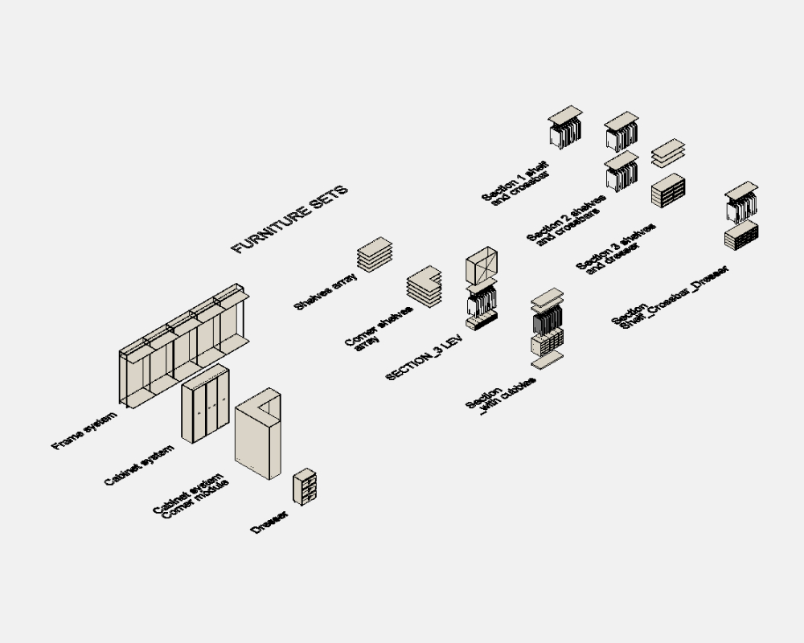

Familias de conjuntos de mobiliario, también de la categoría Mobiliario:

- Módulo de esquina del sistema de módulos (Cabinet system Corner module)
- Sistema de módulos (Cabinet system)
- Conjunto de baldas de esquina (Corner shelves array)
- Cómoda (Dresser)
- Sistema de estructura (Frame system)
- Sección con una balda y barra (Section 1 shelf and crossbar)
- Sección con dos baldas y barras (Section 2 shelves and crossbars)
- Sección con tres baldas y cómoda (Section 3 shelves and dresser)
- Sección de balda, barra y cómoda (Section Shelf_Crossbar_Dresser)
- Sección con casilleros (Section_with cubbies)
- Conjunto de baldas (Shelves array)
- Sección de tres niveles (SECTION_3 LEV)

Las familias de conjuntos de mobiliario funcionan como contenedores y reúnen dentro familias de la categoría Mobiliario.

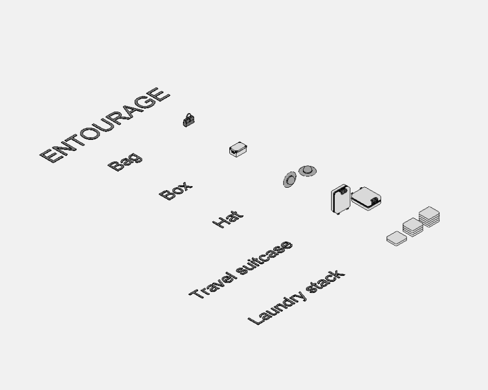

Familias de la categoría Entorno:

- Caja (Box)
- Sombrero (Hat)
- Pila de ropa (Stack)
- Bolso (Bag)
- Maleta de viaje (Travel suitcase)

Las familias tienen parámetros compartidos con el prefijo INT que se pueden llevar a las tablas de planificación.

## 3. ELEMENTOS COMUNES

Los elementos comunes son los que se repiten a menudo en las familias del conjunto.

### Tiradores

Llevan tirador las familias con puertas:

- Puerta corredera doble (Double sliding door)
- Puerta abatible doble (Double swing door)
- Puerta abatible simple (Single swing door)
- Puerta corredera triple (Triple sliding door)
- Armario de puertas abatibles (Swing-door cabinet)
- Sistema de módulos (Cabinet system)

Y también las familias con frentes:

- Pantalonero extraíble (Pull-out trouser rack)
- Cajón (Drawer)
- Cómoda (Dresser)
- Sección de balda, barra y cómoda (Section Shelf_Crossbar_Dresser)
- Sección con tres baldas y cómoda (Section 3 shelves and dresser)
- Sección de tres niveles (SECTION_3 LEV)

El tirador que necesites se elige en la lista desplegable **Handle type**. El conjunto incluye estos tipos:

- Pomo redondo (Round knob)
- Tirador de superficie (Surface-mounted handle)
- Tirador en U (U-handle)
- Tirador en T (T-handle)
- Uñero (Recessed handle), que se elige en el tipo de panel

Familias con puertas:

- Sistema de módulos (Cabinet system)
- Armario de puertas abatibles (Swing-door cabinet)
- Puerta abatible simple (Single swing door)
- Puerta abatible doble (Double swing door)
- Puerta corredera doble (Double sliding door)
- Puerta corredera triple (Triple sliding door)

En estas familias la posición del tirador se ajusta con **Handle offset** y **Vertical handle offset**.

El tamaño del tirador se define con **Handle length**.

El tirador puede ir en horizontal o en vertical.

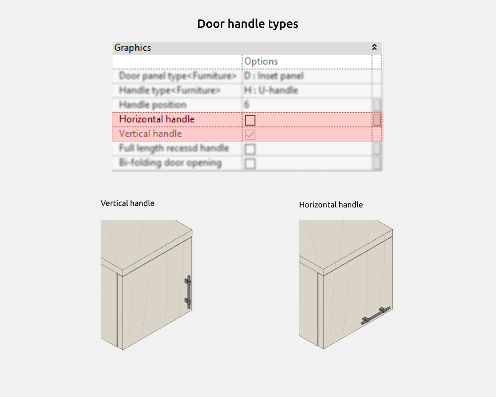

En las puertas simples la posición se indica con números del 1 al 9, igual que la disposición de los números del teclado numérico. Puedes leer la ayuda en **Handle position** o en **Single Door Handle Position**.

En las puertas dobles y triples la posición del tirador sobre el panel se indica así: 1 abajo, 2 en el centro y 3 arriba. Puedes leer la ayuda en **Handle position**.

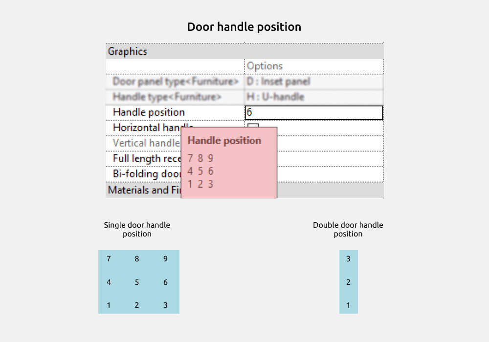

En las familias con frentes:

- Cómoda (Dresser)
- Cajón (Drawer)
- Pantalonero extraíble (Pull-out trouser rack)

el tirador solo puede ir en horizontal. Su posición se ajusta con **Moving the handle down** y su tamaño con **Handle length**.

Las familias de sección están algo simplificadas y en ellas solo se puede indicar la longitud del tirador, sin desplazamiento.

### Paneles

En las familias

- Pantalonero extraíble (Pull-out trouser rack)
- Cajón (Drawer)
- Puerta corredera doble (Double sliding door)
- Puerta abatible doble (Double swing door)
- Puerta abatible simple (Single swing door)
- Puerta corredera triple (Triple sliding door)
- Armario de puertas abatibles (Swing-door cabinet)
- Sistema de módulos (Cabinet system)
- Sección de tres niveles (SECTION_3 LEV)
- Sección de balda, barra y cómoda (Section Shelf_Crossbar_Dresser)
- Sección con tres baldas y cómoda (Section 3 shelves and dresser)
- Cómoda (Dresser)

el panel se elige en la lista desplegable **Door panel type**. El conjunto incluye estos tipos de panel:

- Panel dentro del marco (Inset panel)
- Panel con uñero (Panel with top recessed handle, Panel with bottom recessed handle, Panel with left recessed handle, Panel with right recessed handle), donde en las puertas simples puedes elegir el uñero arriba, abajo, a la izquierda o a la derecha
- Panel con fresado (Milled panel)
- Panel por fuera del marco (Overlay panel)
- Estándar (Standard)

En los paneles con uñero puedes indicar la longitud del tirador o elegir el uñero a todo lo largo con **Full length recessd handle**.

En los paneles dentro del marco y con fresado se puede ajustar el ancho del marco.

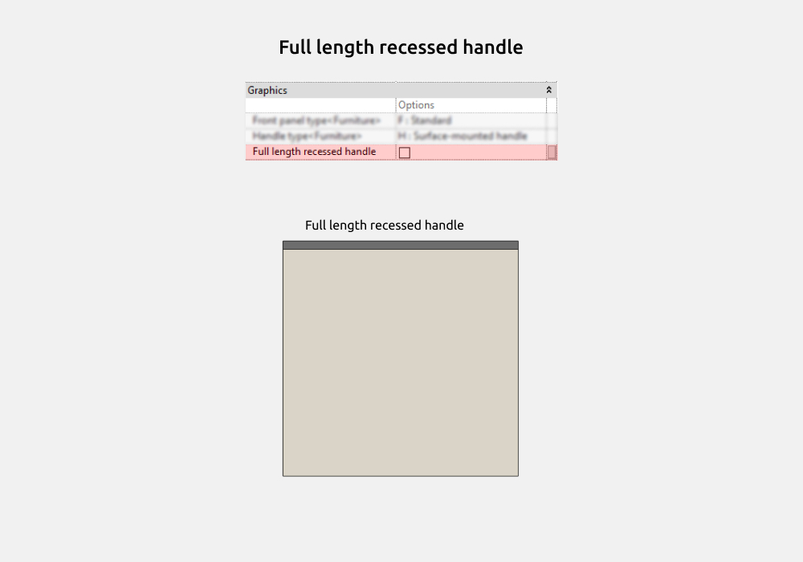

## 4. FAMILIAS

### Balda y balda de esquina

Estas familias se usan tanto por su cuenta como dentro de las familias de conjuntos de mobiliario:

- Sistema de estructura (Frame system)
- Conjunto de baldas (Shelves array)
- Conjunto de baldas de esquina (Corner shelves array)
- Sección de tres niveles (SECTION_3 LEV)
- Sección con casilleros (Section_with cubbies)
- Sección de balda, barra y cómoda (Section Shelf_Crossbar_Dresser)
- Sección con una balda y barra (Section 1 shelf and crossbar)
- Sección con dos baldas y barras (Section 2 shelves and crossbars)
- Sección con tres baldas y cómoda (Section 3 shelves and dresser)

#### Dimensiones y opciones

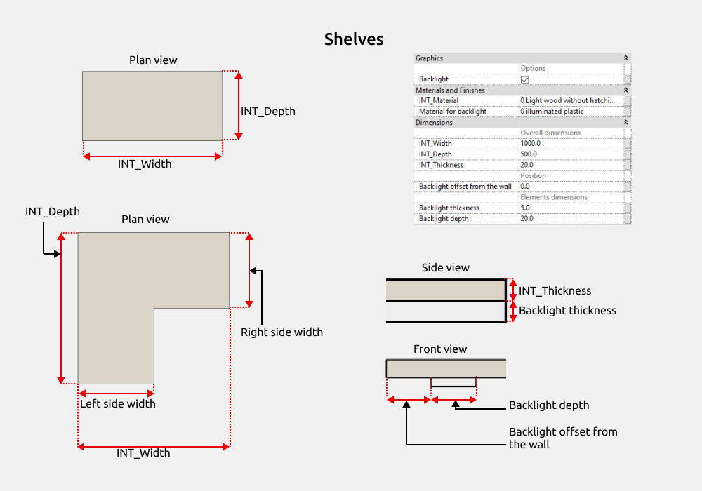

En las baldas se ajustan las medidas generales, el tamaño y el desplazamiento de la iluminación, y se puede indicar el material de la balda y el de la iluminación.

### Pantalonero extraíble

#### Dimensiones

En la familia se ajustan las medidas generales y el desplazamiento del frente hacia arriba. Sobre el frente queda una holgura de 2 mm para que el modelo resulte realista.

#### Opciones

Puedes sacar el pantalonero del todo o hasta la mitad. También se puede activar y desactivar el frente y el símbolo de apertura (**Conventional graphic symbol - opening**).

### Cesta extraíble

#### Dimensiones y opciones

En la familia se ajustan las medidas generales y puedes sacar la cesta del todo o hasta la mitad.

### Cajón

La familia Drawer sirve para construir cajones sueltos del vestidor y forma parte de estas familias de conjuntos de mobiliario:

- Cómoda (Dresser)
- Sección de tres niveles (SECTION_3 LEV)
- Sección de balda, barra y cómoda (Section Shelf_Crossbar_Dresser)
- Sección con tres baldas y cómoda (Section 3 shelves and dresser)

#### Dimensiones

En la familia puedes indicar las medidas generales y las de los laterales y los frentes.

#### Opciones

El cajón se puede sacar a toda la profundidad o hasta la mitad. También se puede activar y desactivar el símbolo de apertura (**Conventional graphic symbol - opening**).

### Casilleros

La familia Storage cubbies sirve para construir casilleros donde guardar cosas.

#### Dimensiones, visibilidad y opciones

Aquí puedes activar y desactivar estos elementos:

- Panel superior (**Top panel**)
- Panel inferior (**Bottom panel**)
- Panel izquierdo (**Left panel**)
- Panel derecho (**Right panel**)

Puedes indicar el número de casillas en horizontal y en vertical. El mínimo es 1 y no hay máximo.

### Pantógrafo

La familia Pantograph sirve para colocar un pantógrafo con ropa en perchas.

#### Dimensiones

#### Opciones y visibilidad

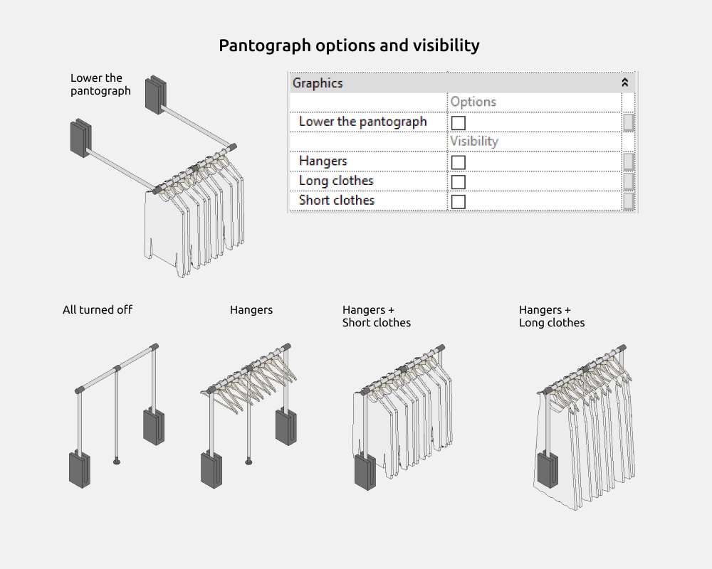

En la familia puedes activar las perchas y la ropa corta o larga. El pantógrafo se puede bajar en paralelo al suelo. El símbolo de las perchas se configura en Gestionar, Estilos de objeto, Elementos de detalle, INT 03 Wardrobe.

### Barra de colgar

La familia Crossbar sirve para colocar una barra con ropa en perchas. Se usa por su cuenta y también dentro de estas familias:

- Sección con una balda y barra (Section 1 shelf and crossbar)
- Sección con dos baldas y barras (Section 2 shelves and crossbars)
- Sección de balda, barra y cómoda (Section Shelf_Crossbar_Dresser)
- Sección con casilleros (Section_with cubbies)
- Sección de tres niveles (SECTION_3 LEV)

#### Dimensiones

#### Opciones y visibilidad

En la familia puedes activar la sujeción superior, las perchas y la ropa corta o larga. La barra puede tener sección cuadrada o redonda.

El símbolo de las perchas se configura en Gestionar, Estilos de objeto, Elementos de detalle, INT 03 Wardrobe.

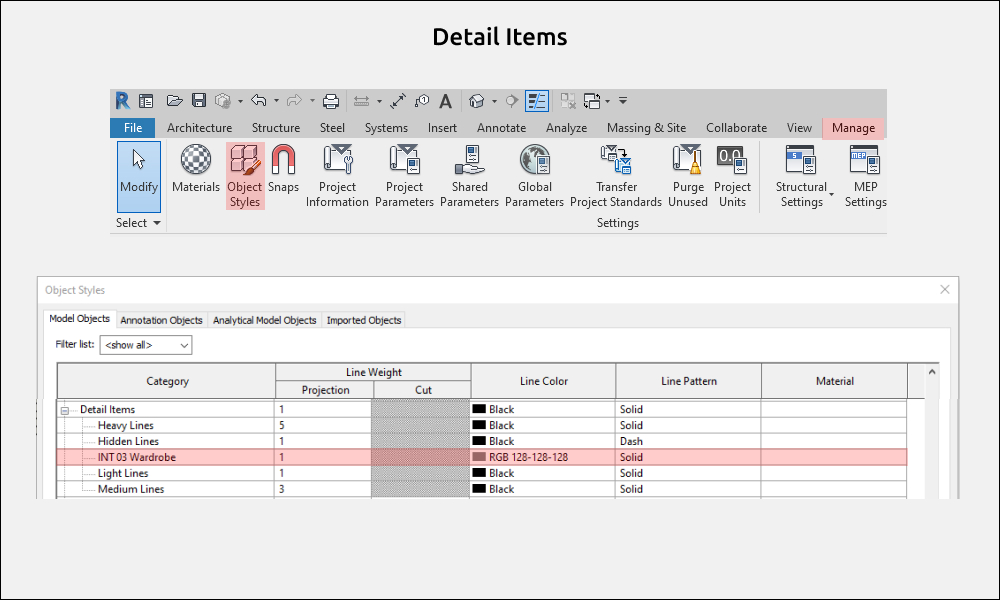

### Zapatero inclinado

#### Dimensiones y visibilidad

En la familia se ajustan las medidas generales, el tamaño de los elementos y el ángulo de inclinación de la balda. Puedes activar y desactivar estos elementos:

- Tope (**Upstand**)
- Iluminación (**Backlight**)
- Apoyo para el tacón (**Heel bar**)

A la balda y a la iluminación se les puede asignar material.

### Zapatero recto

#### Dimensiones y visibilidad

En la familia se ajustan las medidas generales y el tamaño de los elementos. La iluminación se puede activar y desactivar, y a cada elemento se le puede asignar material.

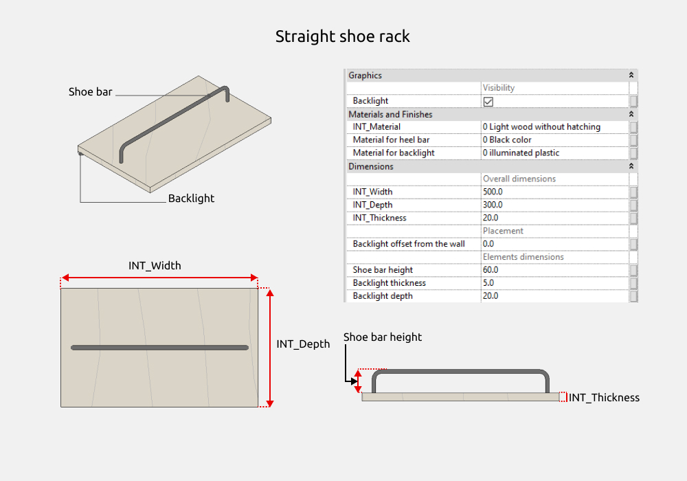

### Armario de puertas abatibles

La familia Swing-door cabinet sirve para construir armarios con puerta simple o doble.

#### Dimensiones

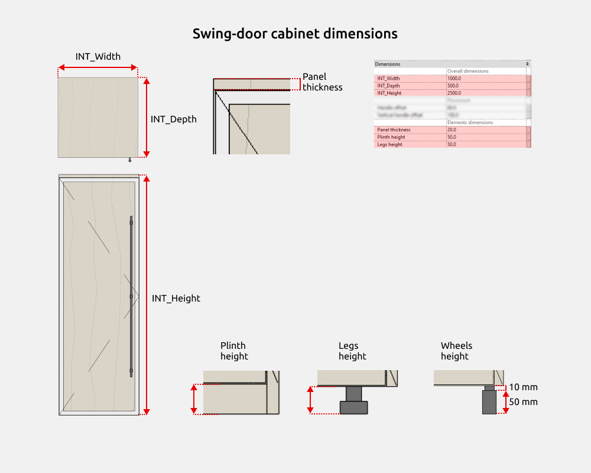

En la familia puedes indicar las medidas generales, el espesor de los paneles y la altura del zócalo y de las patas. También puedes elegir ruedas, cuya altura total es de 60 mm, de los que 50 mm son el diámetro de la rueda.

#### Opciones y visibilidad

Puedes elegir puerta simple, puerta doble o hacer el armario sin puertas.

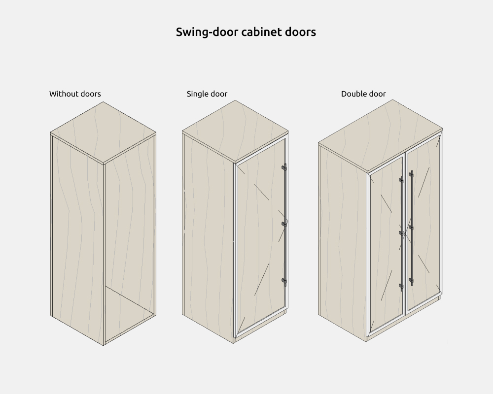

Puedes activar y desactivar estos elementos:

- Panel superior (**Top panel**)
- Panel inferior (**Bottom panel**)
- Panel izquierdo (**Left panel**)
- Panel derecho (**Right panel**)
- Panel trasero (**Back panel**)
- Zócalo (**Plinth**)
- Ruedas (**Wheels**)
- Patas (**Legs**)
- Símbolo de apertura (**Conventional graphic symbol - opening**)

En la vista superior hay dos formas de apertura, abatible y plegable. Existe además la opción de que los paneles sobresalgan por delante. A cada elemento del armario se le puede asignar material.

### Puertas abatibles

El conjunto incluye dos familias de puertas abatibles:

- Puerta abatible simple (Single swing door)
- Puerta abatible doble (Double swing door)

#### Dimensiones y opciones

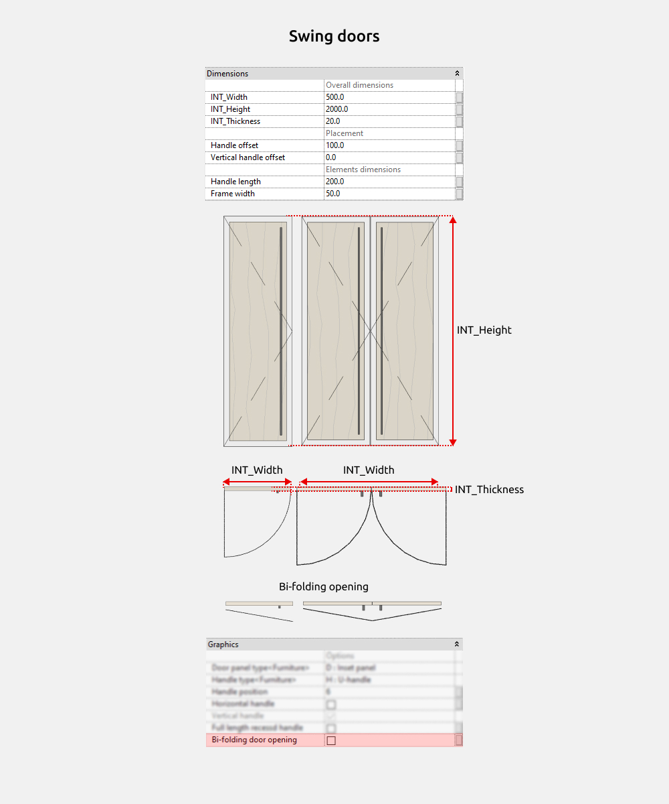

En las puertas puedes indicar el ancho, el alto y el espesor. A izquierda y derecha queda una holgura de 2 mm para que el modelo resulte realista. Se puede asignar material a la hoja, al marco y al tirador.

En la vista superior, las dos familias permiten elegir apertura abatible o plegable.

### Puertas correderas

El conjunto incluye dos familias de puertas correderas:

- Puerta corredera doble (Double sliding door)
- Puerta corredera triple (Triple sliding door)

#### Dimensiones y opciones

En las puertas puedes indicar el ancho, el alto y el espesor. A izquierda y derecha queda una holgura de 2 mm para que el modelo resulte realista. La posición del tirador se ajusta con **Handle offset** y **Vertical handle offset**. Se puede asignar material a la hoja, al marco y al tirador.

En la puerta triple se puede indicar además la posición del tirador de la hoja central.

### Conjunto de baldas y conjunto de baldas de esquina

Estas familias sirven para trabajar más rápido y colocar varias baldas a la vez.

#### Dimensiones y opciones

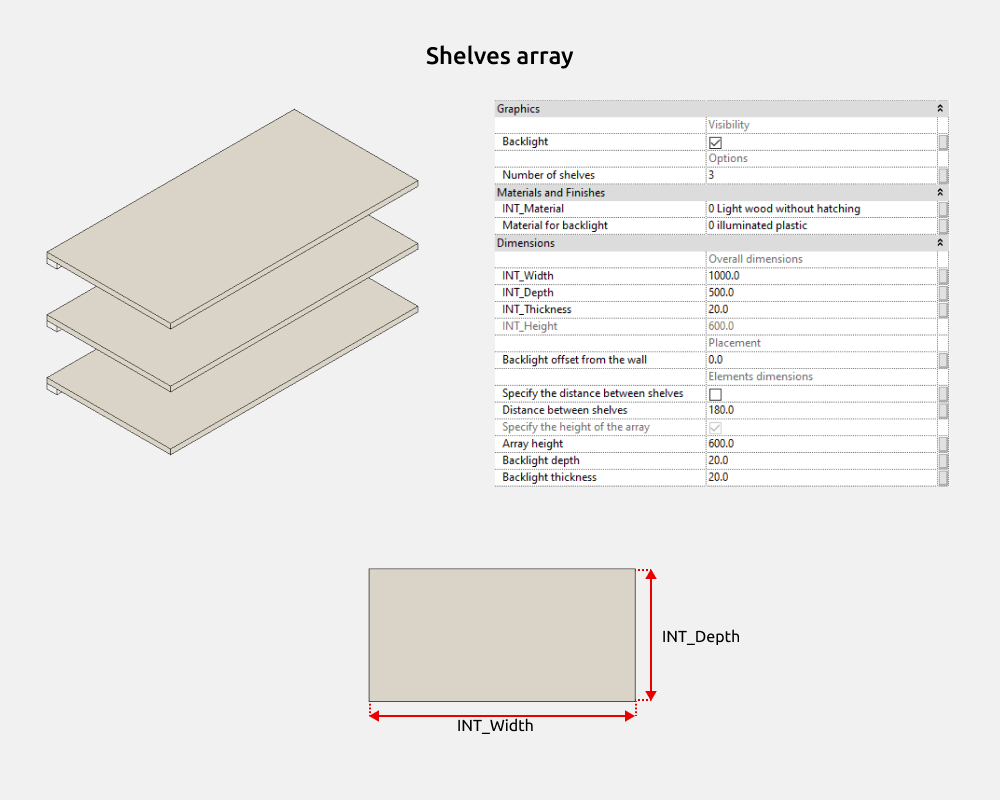

En la familia se indican el número de baldas, a partir de 2, las medidas generales y uno de los dos parámetros de altura: la distancia entre baldas o la altura total del conjunto.

### Cómoda

La familia sirve para crear cómodas con cajones, a partir de 1.

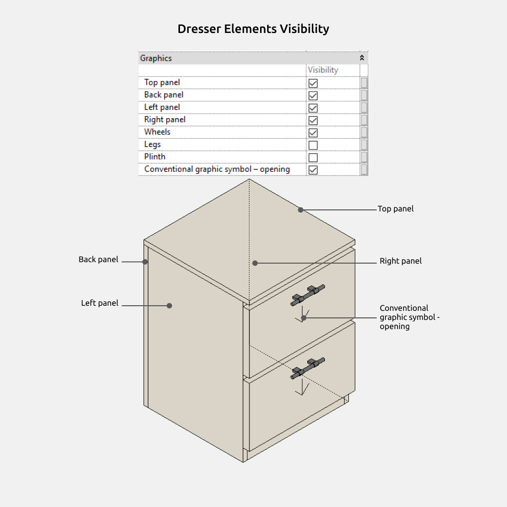

#### Dimensiones

#### Visibilidad y opciones

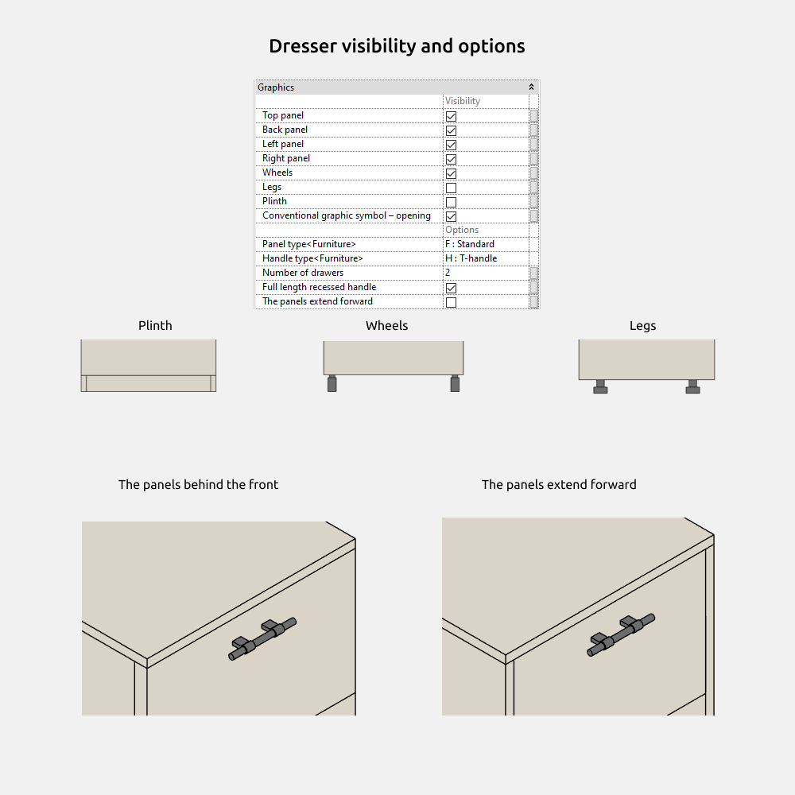

Se indican las medidas generales y también las de los cajones, los laterales y los paneles. Hay tres formas de resolver la parte baja:

- Zócalo (**Plinth**)
- Ruedas (**Wheels**)
- Patas (**Legs**)

La altura del zócalo y la de las patas se ajustan con el parámetro correspondiente. Las ruedas tienen 50 mm de diámetro y 60 mm de altura. Se pueden desactivar las tres opciones, y entonces el cajón inferior queda apoyado en el suelo.

Puedes activar y desactivar estos elementos:

- Panel superior (**Top panel**)
- Panel trasero (**Back panel**)
- Panel izquierdo (**Left panel**)
- Panel derecho (**Right panel**)
- Ruedas (**Wheels**)
- Patas (**Legs**)
- Zócalo (**Plinth**)
- Símbolo de apertura (**Conventional graphic symbol - opening**)

A cada elemento se le asigna material.

### Sistema de estructura

La familia sirve para construir sistemas de estructura del vestidor.

#### Visibilidad y opciones

#### Dimensiones

Para cada elemento del sistema se indican sus medidas y su posición. Puedes indicar el ancho total del sistema, y entonces la distancia entre montantes se calcula sola, o indicar la distancia entre montantes, y entonces el ancho total se determina solo.

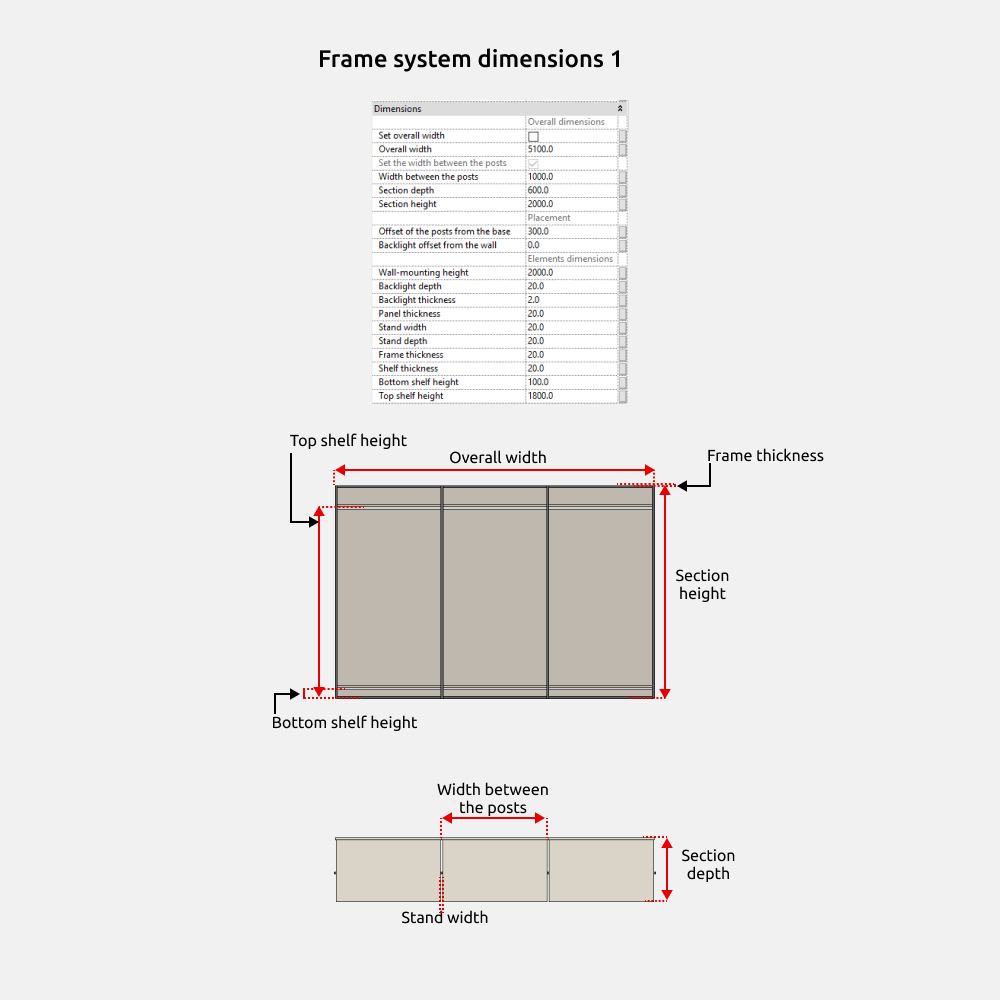

El número de secciones parte de 1. Puedes activar y desactivar estos elementos:

- Panel trasero (**Back panel**)
- Sujeción a la pared (**Wall mounting**)
- Iluminación de las baldas (**Shelf backlight**)
- Balda superior (**Top shelf**)
- Balda inferior (**Bottom shelf**)
- Marco superior (**Top frame**)
- Marco inferior (**Bottom frame**)

A cada elemento del conjunto se le puede asignar su propio material.

### Sistema de módulos

La familia sirve para construir los módulos del sistema.

#### Dimensiones

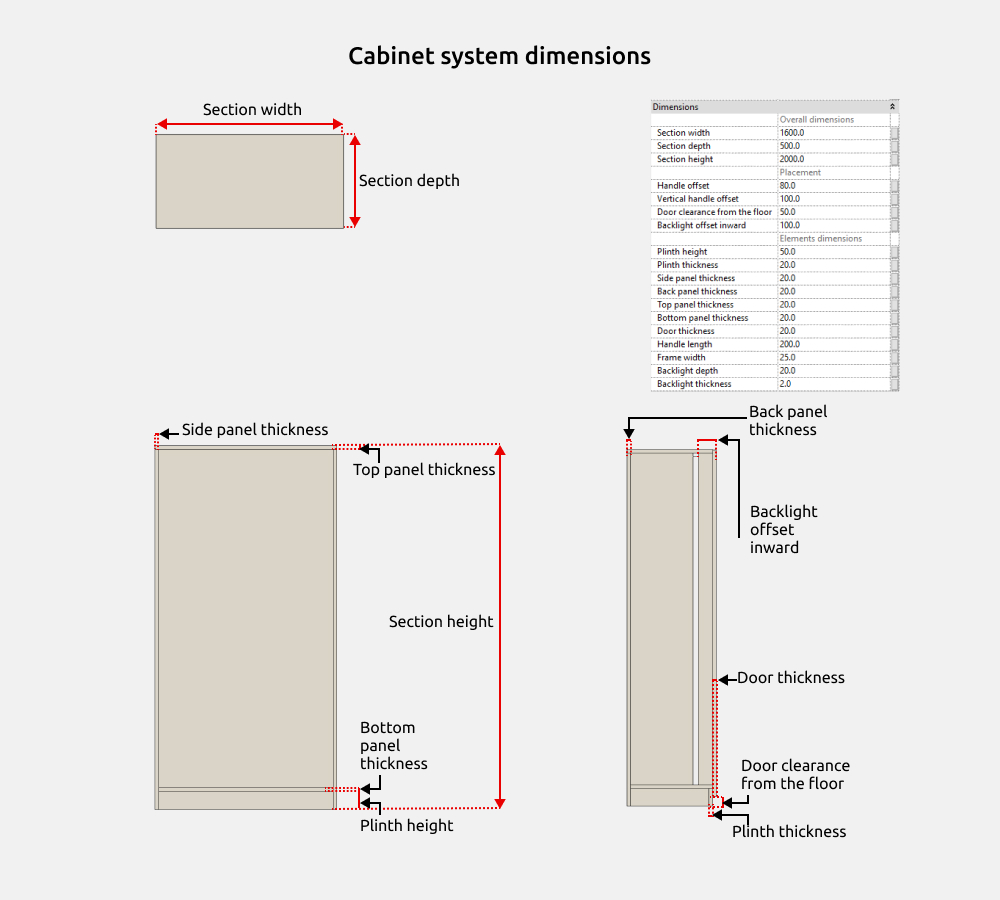

#### Opciones y visibilidad

El panel superior se puede hacer encastrado para que se vea el excéntrico de unión. Puedes activar y desactivar estos elementos:

- Panel superior (**Top panel**)
- Panel inferior (**Bottom panel**)
- Costado izquierdo (**Left side panel**)
- Costado derecho (**Right side panel**)
- Panel trasero (**Back panel**)
- Zócalo (**Plinth**)
- Iluminación superior (**Top backlight**)
- Iluminación izquierda (**Left backlight**)
- Iluminación derecha (**Right backlight**)

Puedes elegir puertas abatibles simples o dobles, y también correderas dobles o triples. En la puerta triple se puede indicar la posición del tirador de la hoja central.

En las puertas abatibles, en planta está disponible el símbolo de apertura plegable.

A cada elemento del módulo se le puede asignar un material distinto.

### Módulo de esquina del sistema de módulos

La familia sirve para construir los módulos de esquina de los sistemas de módulos.

#### Dimensiones y opciones

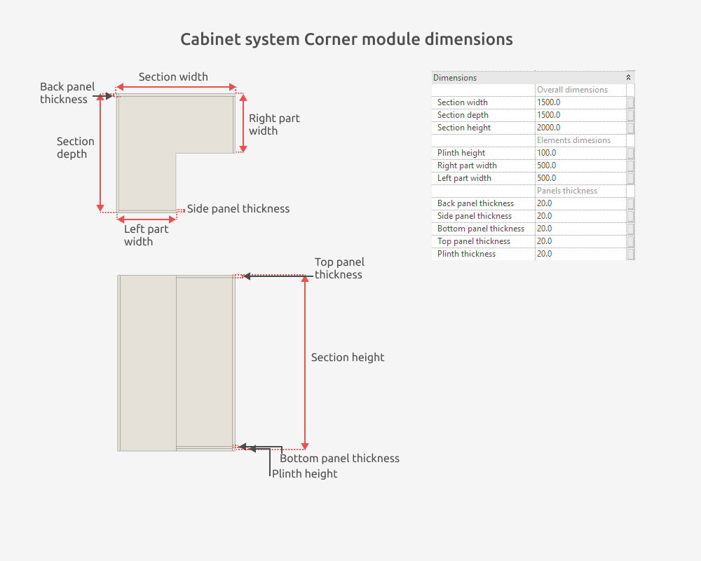

El panel superior se puede hacer encastrado para que se vea el excéntrico de unión. Puedes activar y desactivar estos elementos:

- Panel superior (**Top panel**)
- Panel inferior (**Bottom panel**)
- Panel izquierdo (**Left panel**)
- Panel derecho (**Right panel**)
- Panel trasero (**Back panel**)
- Zócalo (**Plinth**)

### Sección con casilleros

La familia sirve para trabajar más rápido y colocar de una vez tres baldas, los casilleros y la barra de colgar.

#### Dimensiones, visibilidad y opciones

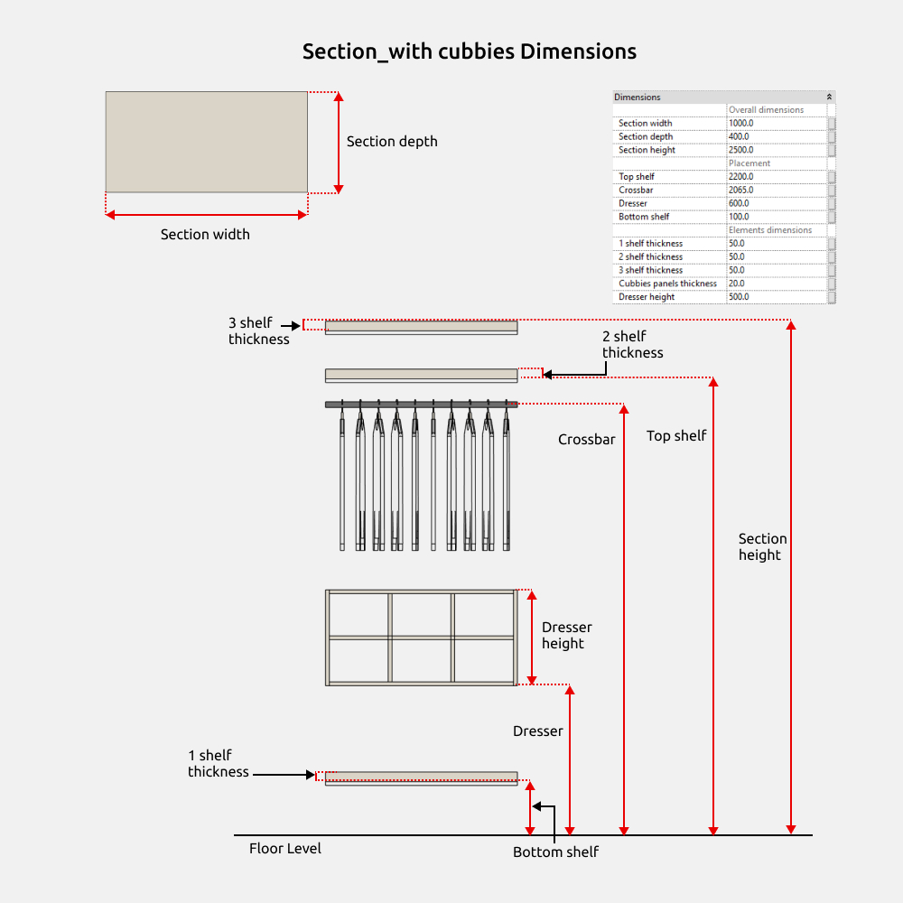

En la familia puedes ajustar las medidas de la sección y el tamaño y la posición de los elementos. A los elementos se les puede asignar material. Puedes activar y desactivar estos elementos:

- Perchas (**Hangers**)
- Ropa larga (**Long clothes**)
- Ropa corta (**Short clothes**)
- Iluminación (**Backlight**)

Existe además la opción de sujeción superior.

En los casilleros se ajusta el número de casillas en horizontal y en vertical.

### Sección con una balda y barra

La familia sirve para trabajar más rápido y colocar de una vez una balda y la barra de colgar.

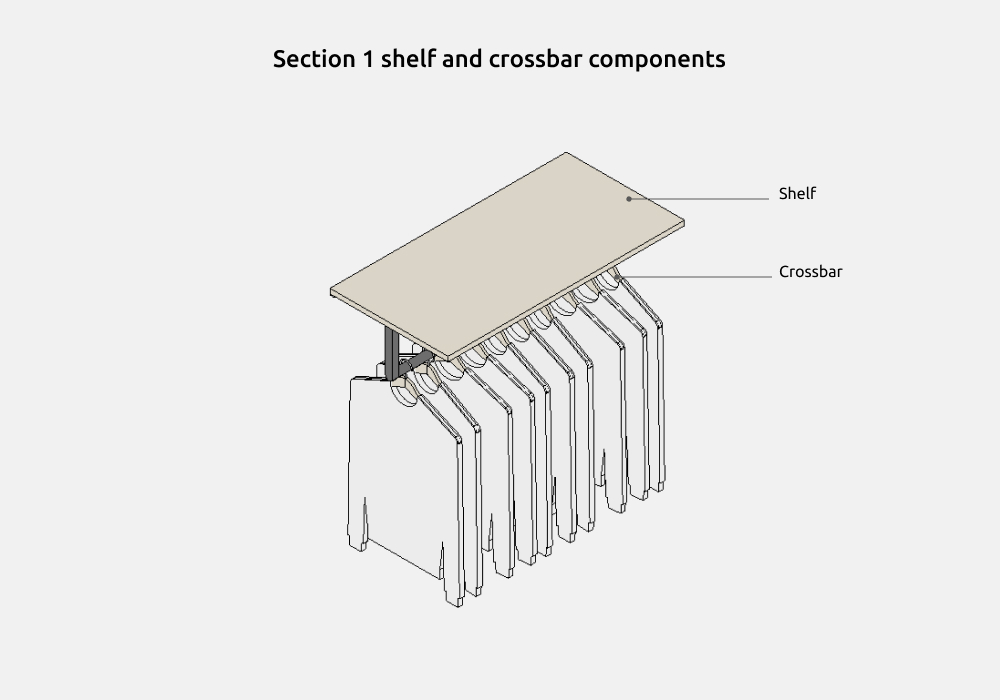

#### Dimensiones, visibilidad y opciones

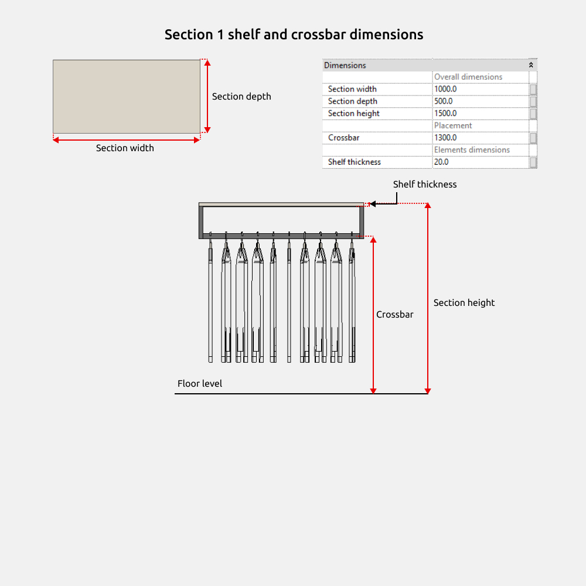

En la familia puedes ajustar las medidas de la sección y el tamaño y la posición de los elementos. A los elementos se les puede asignar material. Puedes activar y desactivar estos elementos:

- Perchas (**Hangers**)
- Ropa larga (**Long clothes**)
- Ropa corta (**Short clothes**)
- Iluminación (**Backlight**)

Existe además la opción de sujeción superior.

### Sección con dos baldas y barras

La familia sirve para trabajar más rápido y colocar de una vez dos baldas y dos barras de colgar.

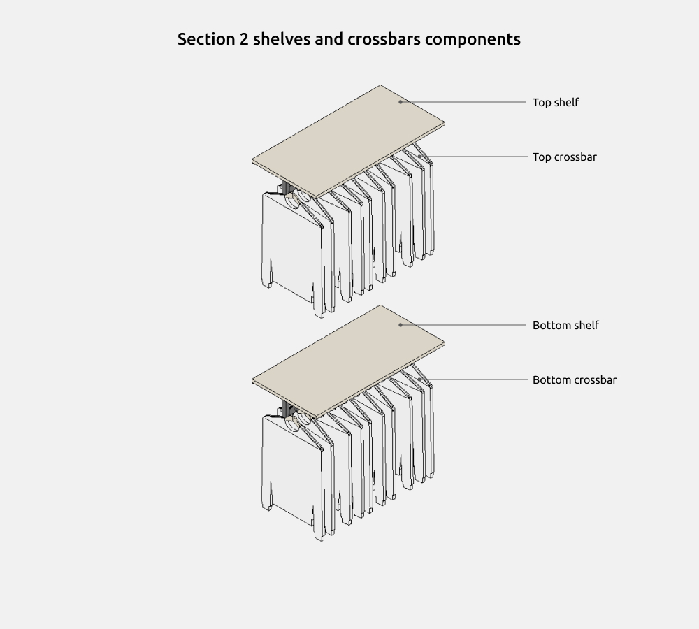

#### Dimensiones, visibilidad y opciones

En la familia puedes ajustar las medidas de la sección y el tamaño y la posición de los elementos. A los elementos se les puede asignar material. En cada barra y cada balda puedes activar y desactivar estos elementos:

- Perchas (**Hangers**)
- Ropa larga (**Long clothes**)
- Ropa corta (**Short clothes**)
- Iluminación (**Backlight**)

Cada barra tiene además la opción de sujeción superior.

### Sección con tres baldas y cómoda

La familia sirve para trabajar más rápido y colocar de una vez tres baldas y una cómoda.

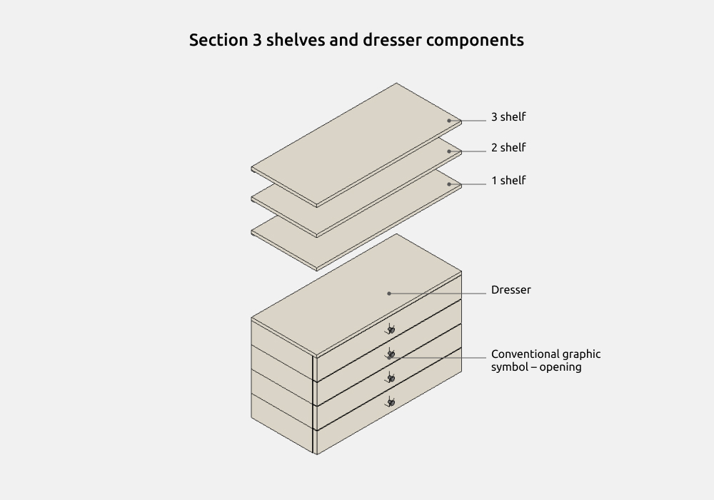

#### Dimensiones, visibilidad y opciones

En la familia puedes ajustar las medidas de la sección y el tamaño y la posición de los elementos. A los elementos se les puede asignar material. En la cómoda se puede activar y desactivar el símbolo de apertura, y en las baldas la iluminación. El número de cajones de la cómoda puede ir de 1 a 4.

### Sección de balda, barra y cómoda

La familia sirve para trabajar más rápido y colocar de una vez el conjunto de balda, barra de colgar y cómoda.

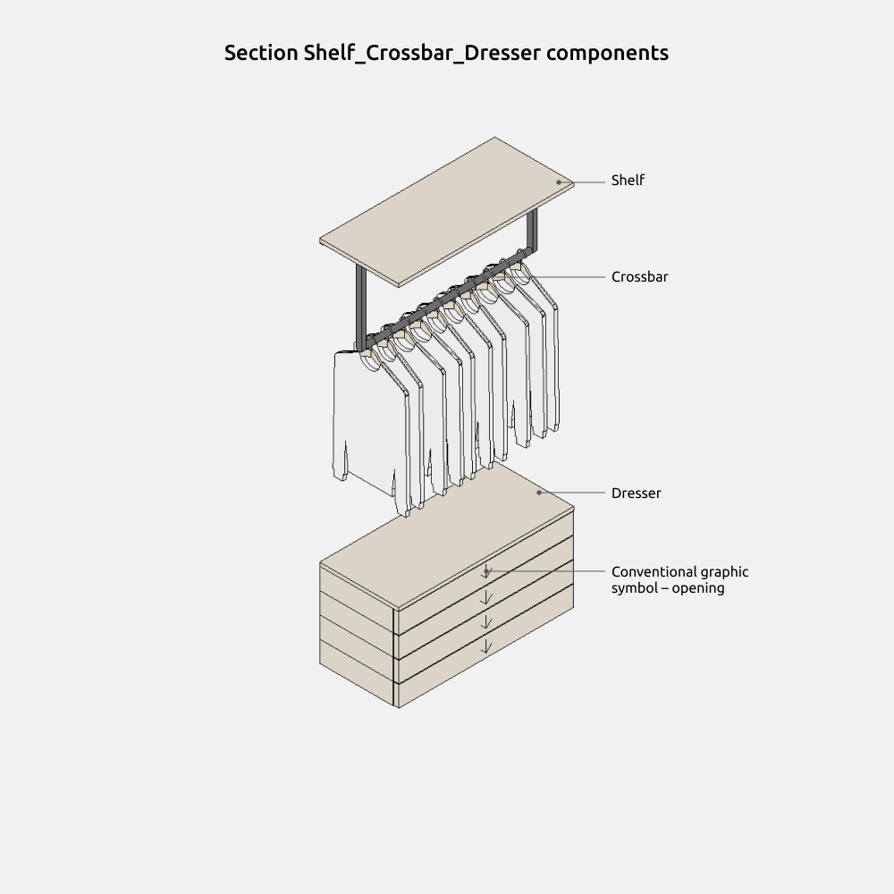

#### Dimensiones, visibilidad y opciones

En la familia puedes ajustar las medidas de la sección y el tamaño y la posición de los elementos. A los elementos se les puede asignar material. En la cómoda se puede activar y desactivar el símbolo de apertura. El número de cajones de la cómoda puede ir de 1 a 4.

En la barra y en la balda puedes activar y desactivar estos elementos:

- Perchas (**Hangers**)
- Ropa larga (**Long clothes**)
- Ropa corta (**Short clothes**)
- Iluminación (**Backlight**)

La barra tiene además la opción de sujeción superior.

### Sección de tres niveles

Es una familia de montaje con la que puedes componer secciones a medida.

#### Dimensiones y opciones

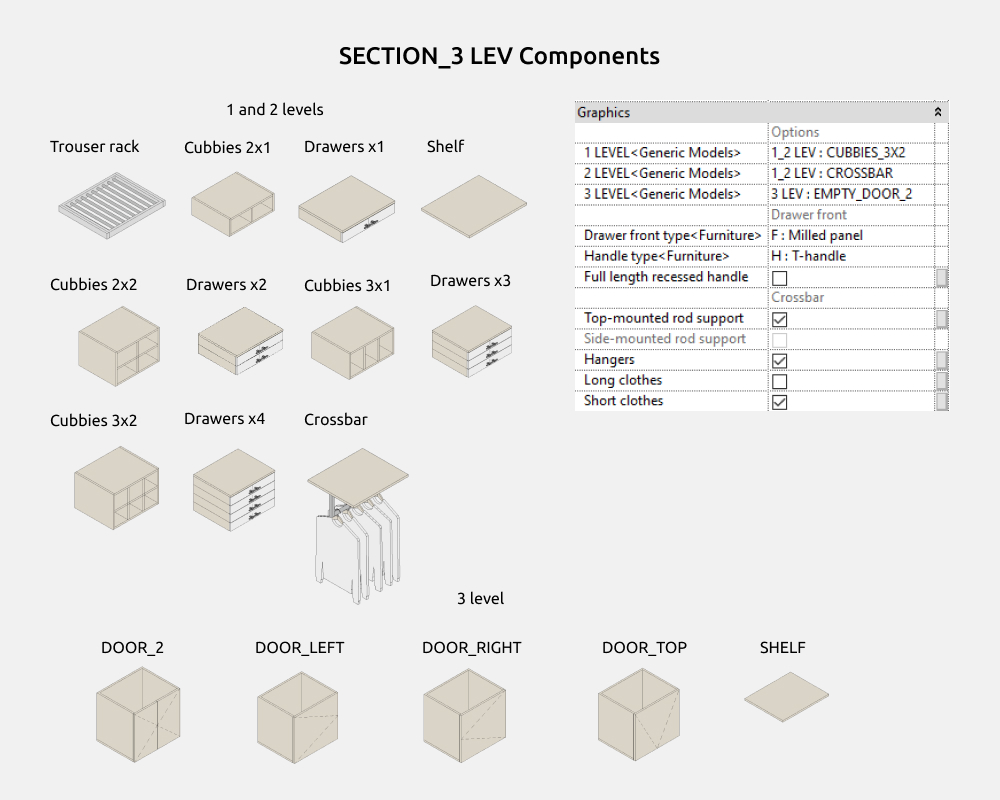

Consta de tres niveles y en cada uno puedes elegir estos elementos.

Niveles 1 y 2:

- Pantalonero (TROUSER RACK)
- Balda (SHELF)
- Vacío (EMPTY)
- Barra de colgar (CROSSBAR)
- Casilleros 2x1 (CUBBIES 2x1)
- Casilleros 2x2 (CUBBIES 2x2)
- Casilleros 3x1 (CUBBIES 3x1)
- Casilleros 3x2 (CUBBIES 3x2)
- Cajones x1 (DRAWERS x1)
- Cajones x2 (DRAWERS x2)
- Cajones x3 (DRAWERS x3)
- Cajones x4 (DRAWERS x4)

Nivel 3:

- Armario con puertas dobles (DOOR_2)
- Armario con puerta simple que abre hacia arriba (DOOR_TOP)
- Armario con puerta simple que abre hacia la izquierda (DOOR_LEFT)
- Armario con puerta simple que abre hacia la derecha (DOOR_RIGHT)
- Balda (SHELF)
- Vacío (EMPTY)
- Combinación de un espacio vacío abajo y un armario con puertas dobles (EMPTY_DOOR_2)
- Combinación de un espacio vacío abajo y un armario con una puerta que abre hacia arriba (EMPTY_DOOR_TOP)
- Combinación de un espacio vacío abajo y un armario con puerta simple que abre hacia la izquierda (EMPTY_DOOR_LEFT)
- Combinación de un espacio vacío abajo y un armario con puerta simple que abre hacia la derecha (EMPTY_DOOR_RIGHT)

A cada elemento se le puede indicar material, medidas y altura de colocación.

## 5. PRESENTACIÓN

### Ajustes de gráficos

Para cambiar el color, el grosor o el tipo de línea de las familias, ve a Gestionar, Estilos de objeto, Entorno, Mobiliario, Luminarias y Elementos de detalle.

<CTA type="guide" />
